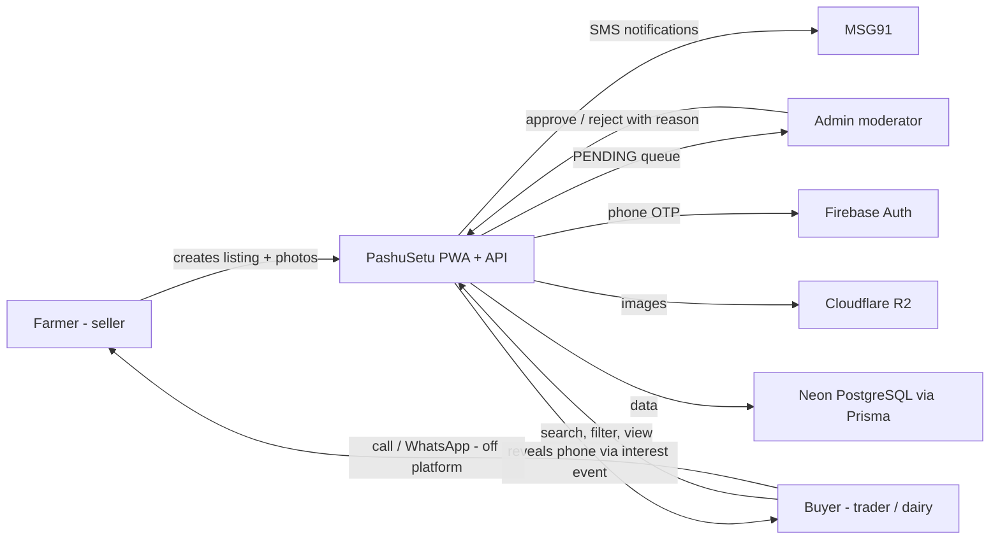
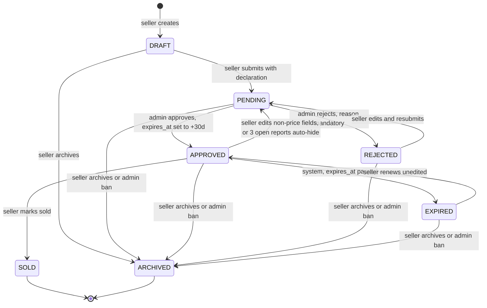

# 01 — Product Requirements Document (PRD)

| Field | Value |
|---|---|
| **Status** | Draft |
| **Version** | 1.0 |
| **Owner** | Founder (Abhishek) |
| **Last updated** | 2026-07-04 |
| **Depends on** | [../00-foundation/README.md](../00-foundation/README.md) · [../02-research/README.md](../02-research/README.md) · [../03-users/README.md](../03-users/README.md) |

> This PRD is the complete product specification for the PashuSetu MVP. It is decision-complete: every feature, rule reference, budget and gate needed to build the MVP is stated here or in the owning sibling document it links to. Where this PRD and [../00-foundation/README.md](../00-foundation/README.md) disagree, the foundation doc wins (it never should — report any divergence as a defect).

---

## 1. Product overview

### 1.1 What

PashuSetu (पशुसेतू — "the bridge for livestock") is a **Marathi-first, mobile-first Progressive Web App** where livestock farmers in rural Maharashtra list animals for sale — cows, buffaloes, bulls/oxen, goats and sheep — and buyers (traders, dairy farms, other farmers) search, filter and contact sellers directly by phone call or WhatsApp. Every listing is reviewed by an admin **before** it becomes publicly visible. The platform is completely free in MVP: no commission, no listing fee, no subscription.

### 1.2 Why

Farmers today sell through the weekly pashu mela (cattle market) and local middlemen: a tiny audience, opaque pricing, and a trader-controlled negotiation. Buyers face the mirror problem — no way to discover quality animals beyond word of mouth, no trust in claims about milk yield or health, and long travel to inspect animals that turn out misrepresented. WhatsApp groups and Facebook posts fill some of the gap but have no search, no verification, and no moderation. Full problem analysis and competitor matrix live in [../02-research/README.md](../02-research/README.md).

### 1.3 For whom

Marathi-speaking livestock farmers (age 25–60, rural Maharashtra, often first-generation smartphone users) as sellers; livestock traders and dairy farms as the primary buyers; a small internal admin team as moderators. Full personas in [../03-users/README.md](../03-users/README.md).

### 1.4 Elevator pitch

> PashuSetu lets a farmer in any Maharashtra village photograph an animal, publish a moderated Marathi listing in under five minutes, and get direct calls from buyers across all 36 districts — no middleman, no fee — while buyers finally get searchable, admin-verified listings with real milk-yield and health details instead of rumors at the weekly bazar.

### 1.5 Positioning vs competitors

Animall, PashuShala, PashuLok and generic classifieds (OLX, Facebook Marketplace) are pan-India, Hindi-first products where Marathi is a translated afterthought and listings go live unreviewed, so fake and stale listings erode trust. PashuSetu differentiates on exactly three axes: **Marathi-first UX** designed for first-time smartphone users, **moderation-before-visibility** (nothing public until an admin approves it, 24-hour SLA), and **deep Maharashtra localization** (all 36 districts, local breeds like Khillar, Dangi, Osmanabadi, Pandharpuri seeded with Devanagari names). We deliberately do not compete on feature breadth (no chat, payments or auctions in MVP) — we compete on trust and usability for one state.

### 1.6 System context

The transaction itself (inspection, negotiation, payment, transport) happens **offline between the parties**; PashuSetu is a discovery-and-contact facilitator only (see [../16-legal/README.md](../16-legal/README.md)).

---

## 2. Goals & success metrics

All metrics are instrumented — each row names its exact measurement method. "M1/M3/M6" = end of month 1/3/6 after public beta launch.

| # | Metric | Target | Measurement method |
|---|---|---|---|
| G-01 | Registered farmers (users with `is_farmer = true`) | ≥ 100 by M1 | SQL count on `users` where `is_farmer` and `status = ACTIVE`, weekly admin stats (`GET /api/v1/admin/stats`) |
| G-02 | Total listings created (any status except DRAFT) | ≥ 1,000 by M3 | SQL count on `listings` where `status != 'DRAFT'` |
| G-03 | Registered users (any role) | ≥ 5,000 by M6 | SQL count on `users` |
| G-04 | Inquiry rate: approved listings with ≥ 1 interest event | ≥ 25% | Join `listings` (ever APPROVED) × `interest_events`, computed in admin stats |
| G-05 | Crash-free sessions | ≥ 99% | Sentry release health, weekly |
| G-06 | Listing detail page usable on 3G | < 5 s TTI | Lighthouse CI on throttled Fast 3G profile, every deploy (see NFR-01) |
| G-07 | Moderation SLA: PENDING → decision | ≤ 24 h for 95% of listings | `moderation_log.created_at - listings.updated_at` percentile in admin stats |
| G-08 | Listings marked SOLD within 30 days of approval | ≥ 10% by M3 | `listings.sold_at - approved_at ≤ 30d` over approved listings |
| G-09 | Median photos per approved listing | ≥ 3 | SQL median of `listing_images` count per APPROVED listing |
| G-10 | Listing creation completion rate (submit ÷ create-flow starts) | ≥ 60% | Analytics events `listing_create_start` vs `listing_submit` (NFR-10) |
| G-11 | Repeat sellers: sellers with ≥ 2 lifetime submitted listings | ≥ 30% of sellers by M3 | SQL on `listings` grouped by `seller_id` |
| G-12 | Rejection rate of first-decision listings | ≤ 30% | `moderation_log` REJECT ÷ (APPROVE + REJECT), monthly (proxy for form quality + onboarding clarity) |

If G-04 (inquiry rate) or G-12 (rejection rate) miss target for two consecutive months, the founder triggers a listing-form and search-UX review before building any new feature (Farmer First, Trust Over Speed — foundation principles 1–2).

---

## 3. Users summary

Full personas, demographics, digital-literacy profiles and journey maps: [../03-users/README.md](../03-users/README.md).

| User | Role in product | Primary goal | Key constraint | MVP touchpoints |
|---|---|---|---|---|
| Livestock farmer (शेतकरी) | Primary seller | Sell 1–3 animals at fair price, fast | Low digital literacy, Marathi-only, 3G, budget Android | Auth, profile, listing CRUD, My Listings, notifications |
| Livestock trader (व्यापारी) | Primary buyer | Find many animals across districts each month | Needs volume + cross-district filters, always on the road | Search/filters, detail, contact, favorites |
| Dairy farm | Buyer | Find high milk-yield cows/buffaloes | Filters on breed + milk yield claims must be trustworthy | Search/filters, detail, contact, favorites, report |
| Admin / moderator | Internal operator | Approve honest listings ≤ 24 h, keep platform clean | Solo founder initially; needs fast queue + audit trail | Admin panel: queue, reports, bans, audit log, stats |
| Vet / transport / insurance provider | Future (Phase 3+) | Offer services to farmers | Out of MVP; schema keeps extension points only | None in MVP |

---

## 4. Feature catalog

The 12 MVP features map 1:1 to the foundation IN-scope list ([../00-foundation/README.md](../00-foundation/README.md) §4). Detailed per-feature specs (field-level validation, screen states, permissions) are owned by [../05-features/README.md](../05-features/README.md); user flows by [../06-user-flows/README.md](../06-user-flows/README.md); exact rule wording by [../04-business-rules/README.md](../04-business-rules/README.md).

### 4.0 Business rules index (BR ids referenced below)

Doc 04 owns the normative wording; this table fixes the ids and one-line meaning used throughout the doc set.

| BR id | Rule (summary) |
|---|---|
| BR-01 | Photos: min 1, max 5 per listing (UI recommends 3+); each ≤ 5 MB; JPEG/PNG/WebP accepted; server stores WebP variants; no video in MVP |
| BR-02 | Max 10 ACTIVE (non-terminal) listings per user |
| BR-03 | Listing expires 30 days after approval; one-tap renew EXPIRED → APPROVED (+30 days) with no re-moderation if unedited |
| BR-04 | Editing photos/description/attributes of an APPROVED listing returns it to PENDING; price-only change keeps APPROVED; SOLD listings cannot be edited or renewed |
| BR-05 | Moderation SLA target: decision within 24 hours of submission |
| BR-06 | ≥ 3 OPEN reports on a listing auto-move it to PENDING (hidden) and notify admin |
| BR-07 | Duplicate heuristic (admin-side warning only): same seller + same species + price within 10%, posted within 7 days |
| BR-08 | Bans are manual by admin; banning archives all the user's listings |
| BR-09 | Rate limits: OTP handled entirely by Firebase client SDK (backend never sends OTP); API writes 60/min/user; interest events 20/day/buyer; reports 5/day/user |
| BR-10 | Browse/search/detail are public; contact actions, favorites, listing creation require login; seller phone revealed ONLY via the interest endpoint after a logged-in buyer taps a contact action; every reveal logged as an interest event |
| BR-11 | Pagination: cursor-based, default 20 per page, max 50 |
| BR-12 | Every listing submission requires seller declaration acceptance (lawful ownership + sale complies with state law; NOT for slaughter); stored as `declaration_accepted` + timestamp |

---

### F-01 — Phone-OTP authentication & session management

| Field | Value |
|---|---|
| **ID** | F-01 |
| **Description** | Login/signup via Indian mobile number + OTP using the Firebase Auth client SDK (phone provider). No passwords, no email. The backend never sends OTPs; it only verifies Firebase ID tokens with the Firebase Admin SDK. First successful login creates the local user row via `POST /api/v1/users`. |
| **Business purpose** | OTP is the only auth mechanism the audience reliably completes; it also avoids Aadhaar/KYC compliance burden (locked decision D3). Verified phone numbers are the trust anchor for the entire contact-seller flow. |
| **User story** | As a farmer with only a phone number, I want to log in with an SMS code so that I never need to remember a password or use email. |
| **Priority** | Must |
| **Dependencies** | Firebase project (external); F-02 (profile completion follows first login); [../12-security/README.md](../12-security/README.md) (token verification); [../08-api/README.md](../08-api/README.md) (`POST /users`, `GET /users/me`) |

**Acceptance criteria**

1. Entering a valid Indian mobile number (10 digits, normalized to E.164 `+91XXXXXXXXXX`) triggers a Firebase OTP SMS; the code entry screen appears within 2 s of tapping "OTP पाठवा" (Send OTP).
2. A correct 6-digit OTP logs the user in; an incorrect OTP shows the inline Marathi error "चुकीचा कोड. पुन्हा प्रयत्न करा." (Wrong code. Try again.) without a page reload, and the user can retry until Firebase's own throttling kicks in.
3. On first successful Firebase login (no matching `firebase_uid` in DB), the app calls `POST /api/v1/users` and routes the user to profile completion (F-02); on every subsequent login the session is restored silently and the user lands on the home/search screen.
4. Every authenticated API request carries `Authorization: Bearer <Firebase ID token>`; the server verifies it with the Firebase Admin SDK; a missing/invalid/expired token returns HTTP 401 with error code `UNAUTHENTICATED` in the standard envelope.
5. A user with `status = BANNED` can still authenticate with Firebase, but every API call returns HTTP 403 `USER_BANNED`, and the UI shows a full-screen banned notice with the grievance contact (per [../16-legal/README.md](../16-legal/README.md)).
6. Logout signs out of the Firebase SDK, clears all locally cached user data and favorites, and any subsequent navigation to a protected screen redirects to login.
7. Token refresh is silent (Firebase SDK auto-refresh of the 1-hour ID token); an active user is never interrupted by re-login during a session.

**Business rules** — BR-09 (OTP is 100% Firebase client-side; backend has no OTP endpoint), BR-10 (login boundary). Details: [../04-business-rules/README.md](../04-business-rules/README.md).

**Edge cases**

- OTP SMS delayed or lost: "पुन्हा OTP पाठवा" (Resend OTP) enabled after Firebase's cooldown; UI shows countdown.
- User's number was recycled by the telco: the new owner inherits the account; mitigation deferred to Phase 2 (re-verification prompts) — documented risk, accepted for MVP.
- Device clock skew makes a fresh token look expired: server allows Firebase Admin SDK default clock tolerance; client retries once on 401 after forcing token refresh.
- User kills the app between Firebase login and `POST /users` completing: Firebase account exists without profile; next open detects "authed but no local user" via 404 on `GET /users/me` and resumes profile completion.
- Same account on two devices simultaneously: allowed; both hold valid tokens; no session invalidation in MVP.

**Future improvements** — Truecaller-style one-tap verification; WhatsApp OTP fallback; session revocation on ban (Firebase `revokeRefreshTokens`); device management screen.

---

### F-02 — User profile

| Field | Value |
|---|---|
| **ID** | F-02 |
| **Description** | Minimal profile: name, district (picker of 36 seeded Maharashtra districts), taluka (optional text), village (free text with Google Places autocomplete assist), role flags (`is_farmer`, `is_buyer`), language preference (MR/EN). Phone comes from Firebase and is not editable. |
| **Business purpose** | Location powers search relevance and buyer trust ("seller is in my district"); role flags personalize home screen; name humanizes the contact moment. Minimal fields respect the low-typing principle. |
| **User story** | As a first-time user, I want to set up my profile in under a minute with mostly taps (not typing) so that I can start selling or browsing immediately. |
| **Priority** | Must |
| **Dependencies** | F-01 (must be authed); seeded `districts` table ([../07-database/README.md](../07-database/README.md)); Google Places API (optional assist, graceful fallback); `PATCH /api/v1/users/me` |

**Acceptance criteria**

1. Profile completion requires only: name (2–50 characters, any script) and district (single-select from the 36 seeded districts, Marathi labels); taluka and village are optional at signup.
2. `is_buyer` defaults to `true` for every new user; `is_farmer` is set to `true` when the user picks "मला जनावर विकायचे आहे" (I want to sell an animal) during onboarding **or** automatically on first listing creation.
3. Village input offers Google Places autocomplete suggestions but always accepts free text; if the Places API errors or times out (> 2 s), the field silently behaves as plain text.
4. `PATCH /api/v1/users/me` persists edits to name, district, taluka, village, role flags and `language_pref`; changes reflect in the UI without re-login.
5. Language toggle (मराठी / English) is available on the profile screen and app header; switching updates all UI strings immediately and persists to `language_pref`.
6. The phone number is displayed read-only with the note "फोन नंबर बदलता येत नाही" (Phone number cannot be changed).
7. A user without a completed profile (missing name or district) can browse publicly but is routed to profile completion before creating a listing, sending interest, or favoriting.

**Business rules** — BR-10 (which actions require a complete profile). Details: [../04-business-rules/README.md](../04-business-rules/README.md).

**Edge cases**

- Devanagari, Latin or mixed-script names all accepted; leading/trailing whitespace trimmed; emoji stripped server-side.
- User selects a district but leaves village empty: allowed; listings still require village (F-03) at listing level.
- Places API returns a village outside Maharashtra: value stored as typed free text; district (the filterable field) remains the seeded picker, so search integrity is unaffected.
- User unsets both role flags: blocked client- and server-side with `VALIDATION_ERROR` — at least one of `is_farmer`/`is_buyer` must be true.
- Name entered as only digits or a phone number: rejected by validation (must contain at least 2 letter characters) to prevent phone-number leakage into public listing cards.

**Future improvements** — Profile photo; verified-seller badge (Phase 2 — schema extension point exists); co-op / dairy affiliation field; bio.

---

### F-03 — Animal listing CRUD with photos

| Field | Value |
|---|---|
| **ID** | F-03 |
| **Description** | Create/edit an animal listing as a guided, chunked Marathi form: species → breed → sex/age → milk & health details → photos (1–5 via presigned R2 upload) → price → location → declaration → submit. Listings start as DRAFT; submission moves them to PENDING (moderation). One animal per listing in MVP. |
| **Business purpose** | The listing is the supply-side atom of the marketplace; structured attributes (breed, age, milk yield, vaccination) are precisely what WhatsApp/Facebook posts lack and what makes search and trust possible. |
| **User story** | As a farmer, I want to photograph my cow and fill a simple Marathi form so that my animal is visible to buyers across Maharashtra without needing a trader. |
| **Priority** | Must |
| **Dependencies** | F-01/F-02 (authed, complete profile); Cloudflare R2 + `POST /api/v1/uploads/presign` ([../08-api/README.md](../08-api/README.md)); seeded `breeds` and `districts` ([../07-database/README.md](../07-database/README.md)); F-10 (moderation consumes submissions); state machine ([../04-business-rules/README.md](../04-business-rules/README.md)) |

**Acceptance criteria**

1. `POST /api/v1/listings` creates a DRAFT with any subset of fields; the draft persists across app restarts and is resumable from My Listings (F-07).
2. Field validation (enforced client- and server-side): species ∈ {COW, BUFFALO, BULL_OX, GOAT, SHEEP}; breed must belong to the chosen species; sex ∈ {FEMALE, MALE}; `age_months` 1–300; `weight_kg` optional 5–1500; `price_inr` integer 500–5,000,000; `negotiable` boolean; description optional ≤ 1,000 characters; district required (seeded picker); village required (free text + Places assist); taluka optional.
3. Milk fields (`milk_yield_lpd` 0–60, `lactation_number` 1–15, `is_pregnant`) are shown and accepted only when sex = FEMALE; `is_vaccinated` is asked for every listing. Server rejects milk fields on MALE listings with `VALIDATION_ERROR`.
4. Photo upload: client requests `POST /api/v1/uploads/presign` (validates content-type ∈ image/jpeg,image/png,image/webp and size ≤ 5 MB), PUTs directly to R2, then attaches via `POST /api/v1/listings/{id}/images`; min 1 / max 5 photos per listing; the UI nudges "किमान ३ फोटो टाका — जास्त फोटो, जास्त खरेदीदार" (Add at least 3 photos — more photos, more buyers); server generates and stores WebP variants.
5. `POST /api/v1/listings/{id}/submit` succeeds only when: all required fields valid, ≥ 1 photo attached, and the seller declaration checkbox is accepted (BR-12); it sets status PENDING, stores `declaration_accepted = true` + `declaration_at`, and shows "तपासणीसाठी पाठवले. २४ तासांत मंजुरी अपेक्षित." (Sent for review. Approval expected within 24 hours.)
6. Submitting an 11th active listing fails with HTTP 409 `LISTING_LIMIT_REACHED` and the Marathi message "एका वेळी जास्तीत जास्त १० जाहिराती. जुनी जाहिरात विकली/बंद करा." (Max 10 listings at a time. Mark an old one sold/closed.) — BR-02.
7. Editing an APPROVED listing's photos/description/attributes moves it back to PENDING with an explicit confirmation dialog first; a price-only change (with optional `negotiable` toggle) keeps it APPROVED and updates instantly — BR-04.
8. The declaration text is shown in the active language before submit. Marathi: "मी घोषित करतो/करते की मी या जनावराचा कायदेशीर मालक आहे, ही विक्री महाराष्ट्र राज्याच्या कायद्यांनुसार आहे, आणि हे जनावर कत्तलीसाठी विकले जात नाही." (I declare I am the lawful owner of this animal, the sale complies with Maharashtra state law, and this animal is not being sold for slaughter.)

**Business rules** — BR-01 (photos), BR-02 (active cap), BR-04 (edit rules), BR-07 (duplicate heuristic, surfaced admin-side only), BR-12 (declaration). Details: [../04-business-rules/README.md](../04-business-rules/README.md).

**Edge cases**

- Upload interrupted mid-PUT (network drop): image never attached; orphaned R2 keys are garbage-collected by a daily job ([../09-backend/README.md](../09-backend/README.md)); user retries from the photo step without losing form data.
- Double-tap on "Submit": endpoint is idempotent for DRAFT → PENDING; second call returns the already-PENDING listing, no duplicate.
- HEIC/HEIF photo from an iPhone: rejected at presign with `UNSUPPORTED_MEDIA_TYPE`; client shows "फोटो JPEG/PNG मध्ये निवडा" and, where the browser supports it, transcodes via canvas before upload.
- EXIF-rotated photos: server normalizes orientation when generating WebP variants, so no sideways cows.
- Seller edits a listing while admin is reviewing it: the PENDING listing is updated in place; moderation always reviews the latest content (optimistic-lock conflict handling in F-10 AC-7).
- Deleting the last remaining photo of a DRAFT: allowed (drafts may be photo-less); submitting remains blocked until ≥ 1 photo exists.

**Future improvements** — Short video clips; multi-animal lots; voice-input description (speech-to-text Marathi); AI photo-quality hints; auto price suggestion (Phase 3).

---

### F-04 — Search & filters

| Field | Value |
|---|---|
| **ID** | F-04 |
| **Description** | Public (no login) browse and search over APPROVED listings: species chips, breed picker (filtered by species), district picker, price range, sort (newest / price low-high / price high-low), cursor pagination. Filter state is URL-encoded so results are shareable/deep-linkable. |
| **Business purpose** | Discovery is the buyer-side core loop; searchability is the single biggest advantage over WhatsApp groups. Shareable URLs turn WhatsApp itself into a distribution channel. |
| **User story** | As a trader, I want to filter animals by species, breed, district and price so that I can find ten candidate cows across three districts without traveling. |
| **Priority** | Must |
| **Dependencies** | `GET /api/v1/listings` + `GET /api/v1/meta/breeds` + `GET /api/v1/meta/districts` ([../08-api/README.md](../08-api/README.md)); seeded breeds/districts; F-05 (result cards link to detail); SSR (NFR-09) |

**Acceptance criteria**

1. `GET /api/v1/listings` accepts `species`, `breedId`, `districtId`, `minPrice`, `maxPrice`, `sort` (`newest` default | `price_asc` | `price_desc`), `cursor`; it returns only APPROVED listings, default 20 per page, max 50, with an opaque `nextCursor` (BR-11).
2. Each result card shows: primary photo (WebP thumbnail), species icon, breed name (Marathi in MR mode), price with Indian digit grouping and Latin digits in both locales (e.g. "₹65,000" — never Devanagari digits, per F-12 AC-6), age, district name, and a "गाभण" (pregnant) badge when `is_pregnant = true`.
3. Selecting a species restricts the breed picker to that species' breeds; changing species clears an incompatible breed filter; server rejects a `breedId` that does not match `species` with `VALIDATION_ERROR`.
4. `minPrice > maxPrice`, negative prices, or an invalid/expired `cursor` return HTTP 400 `VALIDATION_ERROR`; the UI never sends such requests (client-side guards).
5. Zero results shows the Marathi empty state "या शोधात जनावरे सापडली नाहीत. फिल्टर बदलून पाहा." (No animals found for this search. Try changing filters.) with a one-tap "फिल्टर काढा" (Clear filters) action.
6. Filter and sort state is fully encoded in the URL query string; opening a shared URL reproduces the exact result view, server-side rendered.
7. Infinite scroll loads the next cursor page automatically ≥ 300 px before the list end; a loading skeleton (not a spinner-only screen) is shown; scroll position is restored on back-navigation from a detail page.

**Business rules** — BR-10 (public access), BR-11 (pagination). Details: [../04-business-rules/README.md](../04-business-rules/README.md).

**Edge cases**

- Listing approved/expired between page loads: cursor pagination tolerates it (keyset on `approved_at, id`); an expired listing tapped from a stale results page yields the 404 state in F-05.
- All filters combined match a breed with zero listings statewide: normal empty state (AC-5), no error.
- Buyer pastes a manipulated URL (`?minPrice=-1&cursor=junk`): server 400s; UI catches it and resets to default search rather than crashing.
- Very long Marathi breed names (e.g. "होल्स्टिन फ्रिजियन") on narrow screens: cards truncate with ellipsis; full name on detail page (layout rules in [../10-frontend-design-requirements/README.md](../10-frontend-design-requirements/README.md)).
- Extremely fast repeated filter changes: in-flight request is aborted and replaced (debounce 300 ms) so results never render out of order.

**Future improvements** — Radius/nearby search with geolocation; saved searches with alerts; milk-yield and age range filters; text search on description; district-level price stats.

---

### F-05 — Listing detail page

| Field | Value |
|---|---|
| **ID** | F-05 |
| **Description** | Public, server-side-rendered page for a single APPROVED listing: swipeable photo carousel, full attribute table (breed, sex, age, weight, milk yield, lactation, pregnancy, vaccination, negotiable), price, description, seller first name + village/district (NO phone), posted date, view count, and the three contact actions (F-06), favorite (F-08), report (F-09) and share. |
| **Business purpose** | This is the conversion surface — where a buyer decides to contact. SSR makes every listing a shareable, Google-indexable URL, turning listings into organic acquisition. |
| **User story** | As a dairy-farm buyer, I want to see every claimed attribute and all photos of a cow on one page so that I can shortlist it before spending a day traveling to inspect it. |
| **Priority** | Must |
| **Dependencies** | `GET /api/v1/listings/{id}` (public); F-04 (entry point); F-06/F-08/F-09 (actions on the page); NFR-09 (SEO/SSR); image pipeline (BR-01) |

**Acceptance criteria**

1. `GET /api/v1/listings/{id}` returns full listing data for APPROVED listings to anyone; for any other status it returns 404 `NOT_FOUND` unless the requester is the owner or an admin (who see it with a status banner).
2. The photo carousel supports swipe, pinch-zoom on the open photo, and shows a position indicator ("2/5"); the first image is the LCP element and is preloaded (NFR-02).
3. All populated attributes render as a labeled Marathi table; unset optional fields (e.g. weight) are omitted entirely — never shown as "null", "-" or "N/A".
4. The seller block shows first name, village, district and member-since month — and never the phone number in page data or HTML source (BR-10); contact buttons are the only path to the number.
5. `view_count` increments at most once per user (or anonymous session) per listing per day, and never for the listing's owner or admins; the owner sees the count on My Listings (F-07).
6. The share action uses the Web Share API (fallback: copy link) with the prefilled Marathi text "PashuSetu वर हे जनावर पाहा: {url}" (See this animal on PashuSetu: {url}).
7. A deleted/expired/sold listing URL shows a friendly 404 state "ही जाहिरात आता उपलब्ध नाही." (This listing is no longer available.) with a CTA back to search, returning HTTP 404 (and therefore dropping out of search indexes).

**Business rules** — BR-10 (phone concealment; public visibility only when APPROVED). Details: [../04-business-rules/README.md](../04-business-rules/README.md).

**Edge cases**

- Listing with exactly 1 photo: carousel renders without swipe affordance or counter.
- Owner views own listing: contact buttons are replaced by "ही तुमची जाहिरात आहे" (This is your listing) linking to My Listings; no self-interest possible (F-06).
- Listing turns EXPIRED while the buyer has the page open and taps contact: interest endpoint returns 404; UI swaps to the unavailable state without a crash.
- JavaScript disabled or failed to load on 2G: SSR HTML still shows photos (as ``), attributes and price; contact buttons render as plain links prompting login.
- Very long description (1,000 chars): collapsed to 4 lines with "अधिक वाचा" (Read more) toggle.

**Future improvements** — Vet certificate attachments (Phase 2); seller ratings; similar-listings module; district price context ("median Gir price in Satara").

---

### F-06 — Contact seller (call / WhatsApp / send interest)

| Field | Value |
|---|---|
| **ID** | F-06 |
| **Description** | Three login-gated actions on the listing detail page: "फोन करा" (Call), "व्हॉट्सॲप" (WhatsApp) and "आवड कळवा" (Send Interest). Each calls `POST /api/v1/listings/{id}/interest` with `type` CALL | WHATSAPP | INTEREST; the response contains the seller's phone; the client then opens `tel:` or `wa.me` deep links, or (for INTEREST) confirms the seller has been notified. Every tap = one logged interest event. |
| **Business purpose** | Calls and WhatsApp are where rural deals actually happen (locked decision D6); routing every phone reveal through one logged endpoint gives the ≥ 25% inquiry metric (G-04), protects sellers from scraping, and defers the entire chat build to Phase 2. |
| **User story** | As a buyer, I want to call or WhatsApp the seller in one tap so that I can negotiate directly, the way I already do business. |
| **Priority** | Must |
| **Dependencies** | F-01 (login), F-02 (complete profile), F-05 (host page); `POST /api/v1/listings/{id}/interest`; F-11 (seller notification); MSG91 (interest SMS) |

**Acceptance criteria**

1. All three buttons require login: an anonymous tap opens the login sheet with the context message "विक्रेत्याशी संपर्क करण्यासाठी लॉगिन करा" (Log in to contact the seller), and after successful login the original action resumes automatically.
2. `POST /api/v1/listings/{id}/interest` with `{ "type": "CALL" }` logs an `interest_events` row and returns the seller's E.164 phone; the client immediately opens `tel:+91...`. Type `WHATSAPP` behaves identically but opens `https://wa.me/91XXXXXXXXXX?text=` with the prefilled Marathi message "नमस्कार, मी PashuSetu वर तुमची जाहिरात पाहिली: {url}" (Hello, I saw your listing on PashuSetu: {url}).
3. Type `INTEREST` logs the event, triggers a seller notification (F-11: SMS + in-app), and shows the buyer "विक्रेत्याला कळवले आहे" (The seller has been informed) plus the seller's phone number on screen for manual dialing.
4. The seller's phone number never appears in any API response except this endpoint's, and never in server-rendered HTML (BR-10) — verified by an automated test in [../14-testing-qa/README.md](../14-testing-qa/README.md).
5. Exceeding 20 interest events per buyer per day returns HTTP 429 `RATE_LIMITED` with "आजची संपर्क मर्यादा संपली. उद्या पुन्हा प्रयत्न करा." (Today's contact limit is over. Try again tomorrow.) — BR-09.
6. A buyer tapping contact on their own listing gets HTTP 400 `CANNOT_CONTACT_OWN_LISTING`; the UI prevents this by hiding the buttons for owners (F-05 edge case).
7. The endpoint returns 404 `NOT_FOUND` if the listing is not APPROVED at the moment of the tap (sold/expired/hidden race), and the UI shows the unavailable state.

**Business rules** — BR-09 (20/day/buyer), BR-10 (reveal-only-via-interest, every reveal logged). Details: [../04-business-rules/README.md](../04-business-rules/README.md).

**Edge cases**

- WhatsApp not installed: `wa.me` URL opens WhatsApp Web / Play Store interstitial — acceptable; the phone number is also visible in a toast so the buyer can call instead.
- Repeat taps by the same buyer on the same listing same day: each tap logs an event (raw funnel data), but seller SMS for INTEREST is sent at most once per buyer-listing pair per day to prevent spam; the inquiry metric G-04 counts distinct listings, so it is unaffected.
- Seller got banned after approval but before the tap: listing was auto-archived by the ban (BR-08), so the endpoint 404s.
- Buyer on a tablet/desktop without telephony: `tel:` fails silently on some platforms; the number remains visible in the confirmation sheet for manual dialing.
- Two contact taps racing the 20/day limit: enforcement is atomic at the DB layer (count-then-insert in a transaction); worst case the 21st is correctly rejected.

**Future improvements** — In-app chat (Phase 2, locked D6); masked/virtual numbers; callback-request scheduling; buyer-to-seller reveal (mutual number exchange).

---

### F-07 — My Listings management

| Field | Value |
|---|---|
| **ID** | F-07 |
| **Description** | Seller dashboard listing all own listings grouped by status tabs — प्रलंबित (Pending), सुरू (Active/Approved), संपलेल्या (Expired), विकल्या (Sold), नाकारल्या (Rejected), मसुदा (Draft), बंद (Archived) — with per-listing actions: edit, price update, mark sold, renew, archive, resume draft; plus view/interest counts. |
| **Business purpose** | Keeps supply fresh (renew), keeps search honest (mark sold), and closes the rejection feedback loop (fix + resubmit) — the mechanics behind metrics G-08 and G-12. |
| **User story** | As a farmer, I want to see the status of each of my listings and mark one sold in one tap so that buyers stop calling me after the deal is done. |
| **Priority** | Must |
| **Dependencies** | F-03 (CRUD); state machine ([../04-business-rules/README.md](../04-business-rules/README.md)); `GET /api/v1/users/me/listings`, `POST /api/v1/listings/{id}/mark-sold`, `POST /api/v1/listings/{id}/renew`, `POST /api/v1/listings/{id}/archive` |

**Acceptance criteria**

1. `GET /api/v1/users/me/listings` returns all the seller's listings in every status, newest first, cursor-paginated (BR-11), each with `view_count` and total interest-event count.
2. "विकले गेले" (Mark sold) is available only on APPROVED listings; it asks a one-tap confirmation, sets status SOLD + `sold_at`, and immediately removes the listing from public search; SOLD listings show no edit or renew actions (BR-04).
3. "नूतनीकरण करा" (Renew) is available only on EXPIRED listings; one tap returns it to APPROVED with `expires_at = now + 30 days` and no re-moderation if unedited (BR-03); if the seller edits an EXPIRED listing instead, saving resubmits it as PENDING.
4. A REJECTED listing displays the admin's `rejection_reason` verbatim in Marathi with the CTA "दुरुस्त करून पुन्हा पाठवा" (Fix and resend); resubmitting moves it REJECTED → PENDING.
5. Archive is available on any non-terminal status (DRAFT, PENDING, APPROVED, REJECTED, EXPIRED) with a confirmation warning that archived listings cannot be reopened; archived listings are visible under the बंद tab, read-only.
6. Renewing or resubmitting is blocked when the seller already has 10 active listings, with the same `LISTING_LIMIT_REACHED` message as F-03 AC-6 (BR-02).
7. Each PENDING listing shows "तपासणी सुरू आहे — साधारण २४ तास" (Under review — approx. 24 hours) with the submission timestamp, setting the SLA expectation (BR-05).

**Business rules** — BR-02 (cap counts non-terminal statuses), BR-03 (renewal), BR-04 (edit/sold rules), BR-05 (SLA messaging). Details: [../04-business-rules/README.md](../04-business-rules/README.md).

**Edge cases**

- Seller taps renew at the same moment the admin is reviewing a report on that listing: state transitions are guarded server-side; an invalid transition returns 409 `INVALID_STATE_TRANSITION` and the tab refreshes.
- Mark-sold double-tap: idempotent — second call returns the already-SOLD listing.
- Listing expired while the seller had the screen open: renew action appears after pull-to-refresh; a stale mark-sold tap on it returns 409 and the UI refreshes the row.
- Seller with 0 listings: empty state with "पहिली जाहिरात टाका" (Post your first listing) CTA into F-03.
- A listing auto-hidden by reports (BR-06) appears under प्रलंबित with the note "तक्रारींमुळे तपासणीसाठी थांबवले आहे" (Paused for review due to reports).

**Future improvements** — Sold-price capture on mark-sold (feeds Phase 3 price AI); listing performance insights; bulk renew; share-my-listing shortcuts.

---

### F-08 — Favorites

| Field | Value |
|---|---|
| **ID** | F-08 |
| **Description** | Logged-in users can save listings with a heart toggle on cards and detail pages, and view them under "जतन केलेल्या" (Saved). Uniqueness enforced per (user, listing). |
| **Business purpose** | Buyers evaluate livestock over days and visits; favorites are the shortlist tool that brings them back (retention) and a strong demand signal for future features. |
| **User story** | As a trader comparing several animals during the week, I want to save listings so that I can find them again quickly and decide which farms to visit. |
| **Priority** | Should (in MVP; may ship in the last MVP sprint without blocking earlier betas) |
| **Dependencies** | F-01 (login); F-04/F-05 (toggle surfaces); `GET/POST /api/v1/users/me/favorites`, `DELETE /api/v1/users/me/favorites/{listingId}` |

**Acceptance criteria**

1. Tapping the heart on a card or detail page while logged in saves/unsaves instantly (optimistic UI) via `POST` / `DELETE /api/v1/users/me/favorites...`; the icon state is consistent across list, detail and the saved screen.
2. An anonymous heart tap opens the login sheet; after login, the intended favorite is applied automatically.
3. `GET /api/v1/users/me/favorites` returns saved listings newest-saved first, cursor-paginated (BR-11).
4. Favoriting is idempotent: re-POSTing an existing (user, listing) pair returns success without creating a duplicate row (DB unique constraint).
5. Saved listings that are no longer APPROVED remain in the list, greyed out with a status badge ("विकले गेले" / "संपली" — Sold / Expired) and disabled contact buttons; the user can remove them.
6. Favorite counts are not shown publicly in MVP (no social-proof gaming surface).

**Business rules** — BR-10 (login required), BR-11 (pagination). Details: [../04-business-rules/README.md](../04-business-rules/README.md).

**Edge cases**

- Rapid double-tap toggling: client debounces; server idempotency guarantees final state matches last intent.
- Favorited listing archived by a ban (BR-08): shows as unavailable (greyed) rather than vanishing silently.
- Favorites list > 100 items: pagination handles it; no client-side cap.
- Same account on two devices: favorites are server-side, so both devices converge on refresh.

**Future improvements** — Price-drop and back-in-market alerts on saved listings; folders/labels; compare view; offline-cached favorites (extends NFR-11).

---

### F-09 — Report listing

| Field | Value |
|---|---|
| **ID** | F-09 |
| **Description** | Logged-in users can flag a listing with a reason — enum FAKE ("खोटी जाहिरात"), SOLD_ALREADY ("आधीच विकले"), WRONG_INFO ("चुकीची माहिती"), SPAM ("स्पॅम"), ILLEGAL ("बेकायदेशीर"), OTHER ("इतर") — plus optional free-text details. Reports feed the admin queue; 3+ open reports auto-hide the listing. |
| **Business purpose** | Community policing scales moderation beyond one admin and is a core trust mechanism ("Trust Over Speed"); the auto-hide rule caps the damage window of a bad listing that slipped through. |
| **User story** | As a buyer who called a seller and found the animal was already sold, I want to report the listing so that other buyers don't waste their time. |
| **Priority** | Must |
| **Dependencies** | F-01 (login); F-05 (entry point); F-10 (admin resolution); `POST /api/v1/listings/{id}/report`; auto-hide transition (BR-06, state machine in [../04-business-rules/README.md](../04-business-rules/README.md)) |

**Acceptance criteria**

1. "तक्रार करा" (Report) on the detail page opens a sheet with the six reason options as large tappable rows (icon + Marathi text) and an optional details field (≤ 500 chars); submission calls `POST /api/v1/listings/{id}/report`.
2. A successful report shows "तक्रार नोंदवली. आम्ही तपासू." (Report recorded. We will check.) and creates an OPEN `reports` row.
3. When a listing reaches 3 OPEN reports, it transitions APPROVED → PENDING automatically (hidden from public), an `AUTO_HIDE` entry is written to `moderation_log`, and the admin is notified in-app (BR-06); the count check and transition are atomic.
4. One OPEN report per user per listing: a second report while the first is OPEN returns 409 `ALREADY_REPORTED` ("तुमची तक्रार आधीच नोंदलेली आहे" — Your report is already recorded).
5. More than 5 reports by one user in a day returns 429 `RATE_LIMITED` (BR-09).
6. Reporting your own listing is blocked with 400 `VALIDATION_ERROR`; reporting a non-APPROVED listing returns 404 (public users cannot see such listings anyway).
7. The reporter's identity is never revealed to the seller in any UI or notification.

**Business rules** — BR-06 (auto-hide at ≥ 3), BR-09 (5/day/user). Details: [../04-business-rules/README.md](../04-business-rules/README.md).

**Edge cases**

- Two reports land simultaneously as #2 and #3: the transactional count guarantees exactly one AUTO_HIDE transition and one admin notification.
- Admin dismisses all reports on an auto-hidden listing: the listing returns to APPROVED via the admin approve action with its original `expires_at` preserved (it does not gain 30 fresh days).
- Coordinated malicious reporting (3 accounts targeting a rival seller): the listing hides but the admin sees reporter details and can dismiss + ban abusers (F-10); accepted MVP trade-off, favoring buyer protection over seller convenience.
- Reason OTHER with empty details: allowed; admin triage handles it (details strongly encouraged in UI copy).

**Future improvements** — Reporter feedback ("your report led to removal"); reporter reputation weighting; photo-evidence attachment; auto-detection of repeated offender patterns.

---

### F-10 — Admin moderation panel

| Field | Value |
|---|---|
| **ID** | F-10 |
| **Description** | Internal web panel (desktop-first, English UI acceptable) for users with `is_admin = true`: pending-listings queue (oldest first) with full preview and duplicate warnings, approve/reject with mandatory reason, reports queue with resolve/dismiss, user ban/unban, immutable audit log, and a stats dashboard for the §2 metrics. |
| **Business purpose** | Moderation-before-visibility is the trust cornerstone (locked decisions D10 + principle 2); this panel is the operating console that makes the 24-hour SLA (BR-05) achievable for a solo founder. |
| **User story** | As the admin, I want a single queue where I can approve or reject each pending listing in under a minute so that honest farmers go live within 24 hours and fakes never go live at all. |
| **Priority** | Must |
| **Dependencies** | F-01 (admin auth = same Firebase login + `is_admin` check server-side); all `/api/v1/admin/*` endpoints ([../08-api/README.md](../08-api/README.md)); `moderation_log` ([../07-database/README.md](../07-database/README.md)); F-11 (decision notifications) |

**Acceptance criteria**

1. All `/api/v1/admin/*` endpoints return 403 `FORBIDDEN` for any caller whose user row lacks `is_admin = true` (checked server-side per request; no client-side-only gating) — see [../12-security/README.md](../12-security/README.md).
2. `GET /api/v1/admin/listings?status=PENDING` lists the queue oldest-submitted first, showing per row: photos, all attributes, seller profile summary (name, district, join date, prior listing count, prior rejections), and queue age with a visual warning at > 18 h (SLA guard, BR-05).
3. `POST /api/v1/admin/listings/{id}/approve` sets APPROVED, `approved_at = now`, `expires_at = now + 30 days`, logs APPROVE in `moderation_log`, and triggers the seller notification (F-11). For a listing re-approved after report-driven auto-hide, the original `expires_at` is preserved instead.
4. `POST /api/v1/admin/listings/{id}/reject` requires a non-empty reason (400 otherwise); the panel offers one-tap Marathi reason templates — "फोटो अस्पष्ट आहेत" (Photos unclear), "माहिती अपूर्ण आहे" (Information incomplete), "किंमत अवास्तव आहे" (Price unrealistic), "नियमांचे उल्लंघन" (Rules violation / suspected slaughter intent) — plus free text; the reason reaches the seller verbatim (F-07 AC-4, F-11).
5. The queue shows a duplicate warning banner "संभाव्य डुप्लिकेट" when the BR-07 heuristic matches (same seller + species + price within 10% + within 7 days), linking the suspected sibling listing; it is advisory only and never blocks approval.
6. `GET /api/v1/admin/reports?status=OPEN` lists open reports grouped by listing with reason counts; resolve (`POST .../resolve` — upholds the report; admin then rejects/archives the listing) and dismiss (`POST .../dismiss`) both require the report id and log RESOLVE_REPORT / DISMISS_REPORT.
7. `POST /api/v1/admin/users/{id}/ban` requires a reason, sets user status BANNED, archives all their listings in the same transaction (BR-08), logs BAN, and sends the ban SMS (F-11); unban restores ACTIVE but does not restore archived listings.
8. `GET /api/v1/admin/audit-log` returns the immutable `moderation_log` (filterable by admin, action, date); every approve/reject/ban/unban/resolve/dismiss/auto-hide row is present; log rows are never updated or deleted.
9. `GET /api/v1/admin/stats` returns the counters behind §2: users by role, listings by status, median + p95 moderation turnaround, inquiry rate, reports open/resolved — rendered as a simple dashboard.
10. Two admins acting on the same listing concurrently: the second write returns 409 `INVALID_STATE_TRANSITION` (optimistic state guard) and the panel refreshes the row.

**Business rules** — BR-05 (SLA), BR-06 (auto-hide arrivals appear in this queue flagged "reports"), BR-07 (duplicate warning), BR-08 (ban semantics). Details: [../04-business-rules/README.md](../04-business-rules/README.md).

**Edge cases**

- Seller edits a PENDING listing while it is open in the admin's review screen: approve/reject validates against listing `updated_at`; on mismatch the panel reloads the latest version for re-review.
- Approving a listing whose seller was banned seconds earlier: blocked — approval validates seller status ACTIVE; returns 409.
- Admin attempts to ban themselves or another admin: blocked with 400 `VALIDATION_ERROR`.
- Listing photos fail to load in the panel (R2 hiccup): approve is disabled until at least one photo renders (no blind approvals); reject remains available.
- Empty pending queue: dashboard state "Queue clear" with SLA stats — the desired steady state.

**Future improvements** — Multi-moderator roles and assignment; ML-assisted photo checks (animal present, no text overlays); slaughter-intent keyword flagging in Marathi; bulk actions; admin mobile view.

---

### F-11 — Notifications (SMS + in-app)

| Field | Value |
|---|---|
| **ID** | F-11 |
| **Description** | Event-driven notifications persisted to the `notifications` table (channel INAPP) and, for high-value events, also sent as Marathi SMS via MSG91 (channel SMS). In-app notifications appear under a bell icon with unread badge; `POST /api/v1/notifications/{id}/read` marks them read. No web push in MVP (SMS reaches farmers more reliably than push permission prompts). |
| **Business purpose** | The seller's payoff moments — "approved", "rejected (why)", "a buyer is interested" — must reach users who may not reopen the app for days; SMS closes that loop and drives return visits. |
| **User story** | As a farmer who submitted a listing yesterday, I want an SMS the moment it is approved so that I know buyers can now see my animal without me checking the app. |
| **Priority** | Should (in MVP; the in-app channel is required for beta, SMS delivery may land in the final MVP sprint) |
| **Dependencies** | MSG91 account + Marathi (Unicode) SMS templates + DLT registration (India regulatory); `notifications` table; event sources F-03/F-06/F-09/F-10; delivery worker in [../09-backend/README.md](../09-backend/README.md) |

**Acceptance criteria**

1. Every trigger event in the FR-04 table writes a `notifications` row with `type`, `payload` (jsonb: listingId, reason, buyerName as applicable), `channel` and `status = PENDING`; the SMS worker sends via MSG91 and updates status to SENT or FAILED.
2. SMS templates are Marathi Unicode, ≤ 350 characters, each containing a short link. Approved: "PashuSetu: तुमची जाहिरात मंजूर झाली! ती आता ३० दिवस खरेदीदारांना दिसेल. {link}". Rejected: "PashuSetu: तुमची जाहिरात मंजूर झाली नाही. कारण: {reason}. दुरुस्त करून पुन्हा पाठवा: {link}". Interest: "PashuSetu: {buyerName} यांनी तुमच्या जाहिरातीत आवड दाखवली आहे. {link}".
3. Failed SMS sends are retried up to 3 times with exponential backoff; after the third failure status is FAILED and the in-app copy still exists (in-app is the always-on fallback).
4. SMS sends are queued outside 08:00–21:00 IST and flushed at the next window start (quiet-hours rule); in-app rows are created immediately regardless of time.
5. The bell icon shows the unread count (max display "9+"); `GET /api/v1/users/me/notifications` returns newest first, cursor-paginated; tapping an item marks it read via `POST /api/v1/notifications/{id}/read` and deep-links to the relevant listing.
6. Per-buyer-per-listing INTEREST SMS to a seller is capped at 1/day (F-06 edge case); all interest taps still appear in-app.
7. Notifications render in the recipient's `language_pref` (in-app); SMS is always Marathi in MVP (single DLT template set).

**Business rules** — BR-09 (SMS never used for OTP — Firebase owns OTP). Details: [../04-business-rules/README.md](../04-business-rules/README.md).

**Edge cases**

- MSG91 outage: rows stay PENDING/FAILED; a recovery sweep retries FAILED rows younger than 24 h; older ones are abandoned (in-app copy remains).
- User changes `language_pref` after a notification was created: in-app list re-renders from `type` + `payload` at read time, so language follows current preference.
- Unicode SMS segmentation: Marathi SMS consume 70-char segments; templates are budgeted ≤ 5 segments; cost tracked in the ops budget ([../13-deployment/README.md](../13-deployment/README.md)).
- Banned user's pending notifications: delivery worker skips SMS to BANNED users except the ban notice itself.
- Notification for a since-archived listing: deep link resolves to the F-05 unavailable state, not a crash.

**Future improvements** — Web push (Phase 2, tied to PWA installs); WhatsApp Business API notifications; digest batching; per-type notification preferences.

---

### F-12 — Marathi/English i18n

| Field | Value |
|---|---|
| **ID** | F-12 |
| **Description** | Full internationalization from day 1: Marathi (`mr`) is the default locale, English (`en`) the fallback. All UI strings live in locale message catalogs (no hardcoded strings); breeds and districts carry `name_mr`/`name_en` in the database; a persistent header toggle switches language instantly. |
| **Business purpose** | Marathi-first is a locked decision (D8) and the primary differentiator vs Hindi-first competitors; for many target users, an English UI is equivalent to no UI. |
| **User story** | As a Marathi-speaking farmer who reads little English, I want every screen, button, error and SMS in simple Marathi so that I can use the app without help. |
| **Priority** | Must |
| **Dependencies** | All features (every string flows through the catalog); `language_pref` on users; DB seed with Marathi names ([../07-database/README.md](../07-database/README.md)); typography/font rules in [../10-frontend-design-requirements/README.md](../10-frontend-design-requirements/README.md) |

**Acceptance criteria**

1. The default language is Marathi for every first-time visitor regardless of browser locale (Marathi First — deliberate override of `Accept-Language`); the header toggle "मराठी | English" is visible on every screen.
2. For anonymous users the choice persists in localStorage; on login it syncs to `language_pref`, and the server value wins on conflict.
3. 100% of user-facing strings — labels, buttons, errors, empty states, confirmation dialogs, in-app notifications — come from `mr.json` / `en.json` catalogs; CI fails the build if a key exists in `en.json` but not `mr.json` ([../14-testing-qa/README.md](../14-testing-qa/README.md)).
4. A missing translation at runtime falls back mr → en → raw key, and logs a Sentry warning; users never see `undefined`.
5. Breed and district names render from `name_mr` in Marathi mode and `name_en` in English mode; species labels use the foundation glossary terms (गाय, म्हैस, बैल, शेळी, मेंढी).
6. Numbers use Latin digits with Indian grouping (₹1,25,000) in both languages; dates render in the active language ("२ दिवसांपूर्वी" is NOT used — relative dates use Latin digits: "2 दिवसांपूर्वी" / "2 days ago") for numeral consistency.
7. The Marathi register is simple and rural-friendly: short sentences, everyday words (जनावर not पशुधन in body copy), respectful आपण/तुम्ही forms — enforced by the content guidelines in [../10-frontend-design-requirements/README.md](../10-frontend-design-requirements/README.md).

**Business rules** — none feature-specific; D8 (locked) governs. Content register rules owned by doc 10.

**Edge cases**

- Long Marathi strings overflow buttons designed on English lengths: doc 10 mandates designing on Marathi copy first; CI visual snapshots run in `mr`.
- User-generated content (descriptions, villages) is never machine-translated — it displays as typed, whatever the UI language.
- Devanagari font not present on an old device: self-hosted Noto Sans Devanagari subset loads with `font-display: swap` (NFR-02), so text renders in fallback then swaps.
- Mixed-script search input (e.g. "gir गाय"): filtering uses structured pickers, not free text, so no transliteration problem in MVP.

**Future improvements** — Hindi locale (Phase 2, opens border districts and migrant traders); voice guidance in Marathi; transliterated search when free-text search ships.

---

## 5. Functional requirements (cross-feature)

### FR-01 — Session & identity handling

Firebase ID tokens (1 h lifetime) are the only credential. The client SDK silently refreshes; the server verifies each request with the Firebase Admin SDK and resolves `firebase_uid` → `users` row. No server-side session store, no cookies for auth (SSR pages render public data only; authed data hydrates client-side). Every authed request re-checks `users.status`; BANNED yields 403 `USER_BANNED`. `GET /api/v1/users/me` returning 404 signals "authed but profile incomplete" and routes to F-02.

### FR-02 — Public vs authenticated access matrix

| Capability | Anonymous | Logged-in user | Admin |
|---|---|---|---|
| Browse/search listings (`GET /listings`) | ✅ | ✅ | ✅ |
| View listing detail (`GET /listings/{id}`, APPROVED only) | ✅ | ✅ | ✅ (any status) |
| View breeds/districts metadata | ✅ | ✅ | ✅ |
| Contact seller / send interest | ❌ → login sheet | ✅ (complete profile) | ✅ |
| Favorites | ❌ → login sheet | ✅ | ✅ |
| Create/manage listings | ❌ → login sheet | ✅ (complete profile) | ✅ |
| Report listing | ❌ → login sheet | ✅ | ✅ |
| Notifications | ❌ | ✅ | ✅ |
| `/api/v1/admin/*` | ❌ | ❌ 403 | ✅ |

All paths above are relative to `/api/v1` and match the contract in [../08-api/README.md](../08-api/README.md) exactly.

### FR-03 — Listing state machine (summary)

Owned in full by [../04-business-rules/README.md](../04-business-rules/README.md). Every doc and every line of code uses exactly these transitions:

SOLD and ARCHIVED are terminal — they never return to market. Only APPROVED listings are publicly visible.

### FR-04 — Notification triggers

| # | Event | Channel(s) | Recipient | Notes |
|---|---|---|---|---|
| N-01 | Listing approved | SMS + INAPP | Seller | Template in F-11 AC-2 |
| N-02 | Listing rejected | SMS + INAPP | Seller | Includes `rejection_reason` verbatim |
| N-03 | Interest received (type INTEREST) | SMS + INAPP | Seller | SMS capped 1/day per buyer-listing pair |
| N-04 | Contact tap (type CALL or WHATSAPP) | INAPP | Seller | The call itself is the contact; no SMS |
| N-05 | Listing expiring in 3 days | SMS + INAPP | Seller | "3 दिवसांत संपेल — नूतनीकरण करा: {link}" |
| N-06 | Listing expired | INAPP | Seller | Renew deep link |
| N-07 | Listing auto-hidden by reports | INAPP | Seller + Admin | BR-06; seller copy avoids revealing reporters |
| N-08 | New listing entered PENDING | INAPP | Admin | Feeds queue badge in F-10 |
| N-09 | Account banned | SMS | User | Includes grievance contact per IT Rules 2021 |

### FR-05 — Rate limiting

Per BR-09: API write endpoints 60/min/user; interest 20/day/buyer; reports 5/day/user. Exceeding any limit returns HTTP 429, error code `RATE_LIMITED`, with a `retryAfterSeconds` field in `details`. Limits are enforced server-side keyed on user id (never on IP alone — rural users share CGNAT IPs). OTP throttling is entirely Firebase's; the backend exposes no OTP endpoints.

### FR-06 — Pagination

All list endpoints use opaque cursor pagination (BR-11): request `?cursor=<opaque>&limit=<n>`, default 20, hard max 50 (larger values clamped to 50); response carries `items[]` and `nextCursor` (null on last page). Cursors are keyset-based so concurrent inserts/removals never duplicate or skip pages.

### FR-07 — Error envelope & core codes

Every non-2xx API response uses `{ "error": { "code": "STRING_CODE", "message": "...", "details": {...} } }`. Core codes used in this PRD: `VALIDATION_ERROR` (400), `UNAUTHENTICATED` (401), `FORBIDDEN` / `USER_BANNED` (403), `NOT_FOUND` (404), `ALREADY_REPORTED` / `LISTING_LIMIT_REACHED` / `INVALID_STATE_TRANSITION` (409), `UNSUPPORTED_MEDIA_TYPE` (415), `RATE_LIMITED` (429), `INTERNAL` (500). The full registry is owned by [../08-api/README.md](../08-api/README.md). `message` is developer-facing English; the client maps `code` to localized user copy (F-12).

### FR-08 — Seller phone reveal policy

The seller's phone number appears in exactly one API response in the whole system: the response of `POST /api/v1/listings/{id}/interest` (BR-10). It never appears in listing payloads, SSR HTML, sitemaps, or notification payloads sent to third parties. Every reveal writes an `interest_events` row first (transactionally), making G-04 measurement exact.

### FR-09 — View counting

`view_count` increments on listing-detail render, deduplicated per (viewer identity or anonymous session cookie) per listing per day, excluding the owner and admins. Counting is best-effort (fire-and-forget write); it is a seller-facing engagement signal, not a billing-grade metric.

### FR-10 — Expiry sweep

A scheduled job (Vercel Cron, hourly) transitions APPROVED listings with `expires_at < now` to EXPIRED and enqueues N-05 (at T-3 days) and N-06 notifications. The job is idempotent and safe to re-run; specifics in [../09-backend/README.md](../09-backend/README.md) and [../13-deployment/README.md](../13-deployment/README.md).

### FR-11 — Duplicate warning

On every submission to PENDING, the server evaluates BR-07 (same seller + same species + price within ±10% + created within 7 days against the seller's other non-terminal listings) and stores a flag consumed by the admin queue (F-10 AC-5). It never blocks the seller.

### FR-12 — Audit logging

Every admin action and every automated moderation action writes an append-only `moderation_log` row (actor, action, target, reason, timestamp). No update/delete path exists in application code. This satisfies the traceability requirement in [../16-legal/README.md](../16-legal/README.md).

### FR-13 — Ban semantics & data retention

Banning (BR-08) sets `users.status = BANNED` and archives all the user's listings in one transaction. Data is retained (not deleted) for audit and legal defense; images stay in R2 but all public surfaces 404. Unban restores login but not listings. User-initiated account deletion is a manual grievance-channel process in MVP (volume is expected near zero; documented in [../16-legal/README.md](../16-legal/README.md)).

---

## 6. Non-functional requirements

### NFR-01 — Performance: page speed on 3G

Reference environment for all budgets: Moto G-class Android (4× CPU throttle), Fast 3G network profile (1.6 Mbps down / 750 Kbps up / 150 ms RTT), tested via Lighthouse CI on every production deploy ([../14-testing-qa/README.md](../14-testing-qa/README.md)).

| Budget | Search page | Listing detail | Create-listing form |
|---|---|---|---|
| Time to Interactive | ≤ 5.0 s | ≤ 5.0 s | ≤ 6.0 s |
| Largest Contentful Paint | ≤ 4.0 s | ≤ 4.0 s | ≤ 4.0 s |
| Cumulative Layout Shift | ≤ 0.1 | ≤ 0.1 | ≤ 0.1 |
| JS shipped (gzip) | ≤ 200 KB | ≤ 200 KB | ≤ 250 KB |
| Total first-load weight incl. above-fold images (gzip) | ≤ 500 KB | ≤ 550 KB | ≤ 400 KB |

Public pages (search, detail) are server-rendered; below-the-fold images lazy-load; route-level code splitting is mandatory.

### NFR-02 — Image budgets

Server-generated WebP variants (BR-01) with fixed budgets: thumbnail 400 px ≤ 40 KB; card 800 px ≤ 90 KB; detail 1280 px ≤ 180 KB; quality target q70. Originals ≤ 5 MB are retained in R2 but never served to browsers. `` always carries explicit dimensions (CLS) and `srcset`. The Devanagari webfont (Noto Sans Devanagari, subset) is self-hosted, ≤ 60 KB WOFF2, `font-display: swap`.

### NFR-03 — API latency

p95 server processing time (excluding client network): `GET /listings` search ≤ 500 ms; `GET /listings/{id}` ≤ 300 ms; writes ≤ 600 ms; presign ≤ 200 ms. Measured via Vercel function logs + Sentry performance; DB indexes specified in [../07-database/README.md](../07-database/README.md).

### NFR-04 — Availability

99.5% monthly availability for public browse and API (managed-stack composition: Vercel + Neon + R2 + Firebase). Planned migrations use expand-contract so deploys are zero-downtime ([../13-deployment/README.md](../13-deployment/README.md)). Moderation SLA (BR-05) is an operational availability commitment: the queue is checked at least twice daily, 7 days a week, during pilot.

### NFR-05 — Stability & error budget

Crash-free sessions ≥ 99% (G-05, Sentry release health). API 5xx rate ≤ 0.5% of requests over any 7-day window. Any Sentry issue affecting > 1% of sessions is a drop-everything fix during pilot.

### NFR-06 — i18n quality (Marathi-first)

Marathi is the default locale for all visitors (F-12 AC-1). 100% string-catalog coverage enforced in CI; zero hardcoded user-facing strings; all seeded reference data (breeds, districts) carries reviewed `name_mr`. All Marathi UI copy is reviewed by a native Marathi speaker before beta (release gate §10). Register: simple, rural-friendly, respectful (doc 10 owns the content style guide).

### NFR-07 — Accessibility (WCAG-informed, low-literacy adapted)

WCAG 2.1 AA-informed, adapted for low-literacy first-time smartphone users: body text ≥ 16 px (Marathi rendered ≥ 17 px for Devanagari legibility); touch targets ≥ 48×48 px with ≥ 8 px spacing; text contrast ≥ 4.5:1; every primary action pairs icon + text label (never icon-only); one primary action per screen; max form-chunk of 3 inputs per step in the listing flow; all images have alt text; the app is fully usable with system font-size at 130%. Full spec in [../10-frontend-design-requirements/README.md](../10-frontend-design-requirements/README.md).

### NFR-08 — Security

Owned by [../12-security/README.md](../12-security/README.md). PRD-level requirements: Firebase Admin SDK verification on every authed request; server-side role checks for all admin routes (FR-02); presign endpoint validates content-type + size and issues single-use, 10-minute PUT URLs scoped to a server-generated key; rate limits per FR-05; no PII beyond name/phone/location stored; no Aadhaar ever; HTTPS everywhere (Vercel-managed TLS); OWASP Top 10 review before beta; seller phone exposure only per FR-08.

### NFR-09 — SEO

Public search and listing-detail pages are SSR with unique `<title>`/`<meta description>` in Marathi (e.g. "गीर गाय विक्रीसाठी — सातारा | PashuSetu"); `sitemap.xml` regenerated daily containing only APPROVED listings; `robots.txt` allows public pages, disallows `/api` and admin; Schema.org `Product` JSON-LD on detail pages (name, price, availability); canonical URLs; `hreflang` pairs for `mr-IN`/`en-IN`; non-APPROVED listing URLs return HTTP 404 so they fall out of indexes (F-05 AC-7); Open Graph image = listing's card variant so WhatsApp link previews show the animal.

### NFR-10 — Analytics & instrumentation

Two layers. (a) Product truth from Postgres: `interest_events`, `view_count`, `listings`, `users`, `moderation_log` power all §2 metrics via `GET /api/v1/admin/stats` — no third-party dependency for the metrics that matter. (b) Behavioral funnel via **Vercel Web Analytics** custom events (lightweight, cookie-free — chosen over GA4 to protect the NFR-01 JS budget): `search_performed`, `filter_applied`, `listing_view`, `contact_call_tap`, `contact_whatsapp_tap`, `send_interest`, `favorite_add`, `report_submit`, `listing_create_start`, `listing_photo_added`, `listing_submit`, `signup_complete`, `language_switch`, `pwa_installed`. Sentry provides G-05. Event names are frozen here; payload schemas in [../09-backend/README.md](../09-backend/README.md).

### NFR-11 — PWA installability & offline shell

Web app manifest (`name`: "PashuSetu — पशुसेतू", theme color, maskable 192/512 px icons) passes Lighthouse installability; a custom install prompt appears after the user's second session (not on first visit). Service worker precaches the app shell (layout, nav, fonts, locale catalogs) and runtime-caches visited listing pages + images (stale-while-revalidate, 50-entry LRU). Offline behavior: shell loads with the banner "इंटरनेट नाही — जुनी माहिती दाखवत आहोत" (No internet — showing older data); previously viewed listings and the favorites list render from cache; all writes (create, favorite, interest) are disabled offline with a clear message — no offline mutation queue in MVP. A cold start with no network shows the branded offline page, never the browser dinosaur.

### NFR-12 — Capacity

The MVP architecture must sustain, without redesign: 10,000 registered users, 5,000 total listings (≤ 1,500 concurrently APPROVED), 25,000 images (~15 GB in R2), 200 concurrent browsers, 50 listing submissions/day. These fit Neon/Vercel/R2 free-to-low tiers; scale triggers and the extraction path for a dedicated backend are documented in [../11-architecture/README.md](../11-architecture/README.md).

---

## 7. Assumptions

| # | Assumption | Impact if wrong |
|---|---|---|
| A-01 | Target users own or can access an Android smartphone (≥ Android 9, Chrome) with intermittent 3G/4G | PWA reach shrinks; would need assisted-listing agents sooner (already a GTM tactic, [../15-project-plan/README.md](../15-project-plan/README.md)) |
| A-02 | WhatsApp is installed for the vast majority of buyers | WhatsApp deep link degrades to wa.me web; call remains the primary path |
| A-03 | Farmers will accept a ≤ 24 h moderation delay in exchange for a trusted marketplace | If sellers churn at PENDING, revisit SLA staffing or trusted-seller fast lane (Phase 2) |
| A-04 | One admin (the founder) can moderate pilot volume (≤ 50 submissions/day) within SLA | Hire/train a part-time moderator; panel already supports multiple admins |
| A-05 | Firebase phone-OTP delivery to Indian numbers is reliable and its cost stays within budget at MVP volume | Swap to MSG91-backed custom OTP is an explicit non-goal (BR-09); would instead enable Firebase SMS region policies + retry UX |
| A-06 | Transactions complete offline without platform involvement, and users accept the platform-as-facilitator disclaimer | Escrow/payments pressure moves Phase 3 items earlier; legal posture in [../16-legal/README.md](../16-legal/README.md) unchanged |
| A-07 | The 36-district + species/breed seed taxonomy covers ≥ 95% of real listings ("local/crossbred" absorbs the tail) | Admins record unmatched breeds; seed list amended via migration ([../07-database/README.md](../07-database/README.md)) |
| A-08 | Solo developer + external designer can deliver the MVP in the planned sprints ([../15-project-plan/README.md](../15-project-plan/README.md)) | Scope guardrail: Should-priority features (F-08, F-11 SMS) slip before any Must feature does |

---

## 8. Dependencies (external services)

| Service | Used for | Criticality | Failure posture |
|---|---|---|---|
| Firebase Auth (client SDK + Admin SDK) | Phone OTP login, ID-token verification (D3) | Hard — no login without it | Public browse still works; login/writes unavailable; status page + Sentry alert |
| Neon PostgreSQL (via Prisma) | All persistent data (D2) | Hard | Full outage = maintenance page; Neon HA + PITR relied upon |
| Cloudflare R2 | Image storage + delivery via presigned PUT / public variants (D4) | Hard for images | Listings render with photo placeholders; uploads fail gracefully with retry |
| Vercel (+ GitHub, GitHub Actions) | Hosting, SSR, cron, previews, CI/CD (D5) | Hard | Covered by NFR-04 availability composition |
| MSG91 | Notification SMS (never OTP) with DLT-registered Marathi templates | Soft | In-app notifications are the fallback channel (F-11 AC-3) |
| Google Places API | Village autocomplete assist in profile + listing forms | Soft | Silent fallback to free-text input (F-02 AC-3); hard monthly quota cap configured |
| Sentry | Crash-free metric (G-05), error + performance monitoring | Soft | Metrics blind spot only; no user-facing impact |
| Vercel Web Analytics | Funnel events (NFR-10) | Soft | Postgres-based §2 metrics unaffected |

Internal doc dependencies: business rules [../04-business-rules/README.md](../04-business-rules/README.md) · features [../05-features/README.md](../05-features/README.md) · flows [../06-user-flows/README.md](../06-user-flows/README.md) · database [../07-database/README.md](../07-database/README.md) · API [../08-api/README.md](../08-api/README.md) · backend [../09-backend/README.md](../09-backend/README.md) · design [../10-frontend-design-requirements/README.md](../10-frontend-design-requirements/README.md) · architecture [../11-architecture/README.md](../11-architecture/README.md) · security [../12-security/README.md](../12-security/README.md) · deployment [../13-deployment/README.md](../13-deployment/README.md) · testing [../14-testing-qa/README.md](../14-testing-qa/README.md) · plan [../15-project-plan/README.md](../15-project-plan/README.md) · legal [../16-legal/README.md](../16-legal/README.md).

---

## 9. Out of scope (MVP)

Verbatim from [../00-foundation/README.md](../00-foundation/README.md) §4, with the reason each is deferred. Do not design for these beyond the noted extension points.

| Excluded item | Why deferred (one line) |
|---|---|
| Payments / escrow | Livestock deals are inspected-in-person, high-value and negotiated — forcing payments before trust exists would kill adoption and adds RBI/PA-PG compliance weight. |
| Delivery / transport | Requires a vetted transporter network and animal-welfare transit compliance; zero leverage until listing liquidity exists. |
| AI price estimation | Needs real transaction/sold-price data we only start collecting in MVP (F-07 future hook); guessing prices would destroy trust. |
| Insurance | IRDAI-regulated partnerships and claims workflows — a business-development track, not an MVP feature. |
| Loans | RBI-regulated lending partnerships plus credit underwriting — far beyond marketplace scope today. |
| Auctions | Needs simultaneous buyer liquidity per animal; premature before the ≥ 25% inquiry metric is consistently met. |
| In-app chat | Locked decision D6: rural users transact by call/WhatsApp; chat adds a large build + abuse-moderation surface for little MVP value. |
| Veterinary marketplace | Two-sided vet supply is its own product; Phase 3 extension point noted in personas only. |
| Milk tracking | A farm-management feature, not marketplace discovery; different usage cadence entirely. |
| Aadhaar KYC | Deliberate legal stance (foundation §8): no Aadhaar collection or storage; phone OTP is the identity layer. |

Guardrail: none of these items may appear as an MVP requirement in any downstream doc; extension points are limited to schema/notes explicitly marked "Phase 2/3".

---

## 10. Release criteria — beta pilot gate

The beta pilot (target: 2 districts — Satara and Ahilyanagar — via co-op and Pashu Mitra onboarding, per [../15-project-plan/README.md](../15-project-plan/README.md)) ships only when every box below is checked:

- [ ] All Must features (F-01–F-07, F-09, F-10, F-12) pass 100% of their acceptance criteria in staging ([../14-testing-qa/README.md](../14-testing-qa/README.md) test run signed off)
- [ ] Should features minimum bar met: F-08 favorites functional; F-11 in-app channel functional (SMS may follow within 2 weeks of pilot start)
- [ ] End-to-end scripted scenario passes on a real budget Android over cellular data: farmer registers → lists a cow with 3 photos → admin approves within SLA → buyer finds it via species+district filter → taps WhatsApp → seller receives notification → farmer marks sold
- [ ] Listing state machine verified: every FR-03 transition exercised by automated tests; no undefined transition reachable
- [ ] NFR-01 budgets green on Lighthouse CI (Fast 3G profile) for search, detail and create pages
- [ ] Security review complete per [../12-security/README.md](../12-security/README.md): admin-route authz tests, presign validation tests, FR-08 phone-concealment test, rate-limit tests all passing
- [ ] Seed data loaded and reviewed: 36 districts + full breed list with native-speaker-reviewed Marathi names ([../07-database/README.md](../07-database/README.md))
- [ ] All Marathi UI copy reviewed by a native Marathi speaker (NFR-06)
- [ ] Legal pages live: Privacy Policy, Terms & Conditions, seller declaration text, grievance contact — per IT Rules 2021 ([../16-legal/README.md](../16-legal/README.md))
- [ ] MSG91 DLT registration approved for all F-11 SMS templates (or SMS consciously toggled off at launch with in-app-only fallback)
- [ ] Sentry release health + Vercel Analytics events verified end-to-end in production; `GET /api/v1/admin/stats` returns all §2 metrics
- [ ] Moderation runbook written and staffed: queue checked ≥ 2×/day, 7 days/week; admin can decide a typical listing in ≤ 60 s
- [ ] Backups verified: Neon point-in-time recovery tested with a restore drill ([../13-deployment/README.md](../13-deployment/README.md))
- [ ] Rollback path proven: previous production build redeployable in ≤ 10 minutes
- [ ] PWA installability passes Lighthouse; offline shell behaves per NFR-11 on a real device in airplane mode

Exit from pilot to public Maharashtra launch requires: ≥ 100 registered farmers, ≥ 50 approved listings, G-04 inquiry rate ≥ 15% trending up, zero unresolved severity-1 defects, moderation SLA met for 95% of pilot submissions.

---

## 11. Phase 2 / Phase 3 roadmap summary

Directional, not committed — sequenced by trust-first strategy; each item graduates only after the §2 metrics justify it. Detailed sequencing in [../15-project-plan/README.md](../15-project-plan/README.md).

### Phase 2 — Trust & engagement (post-MVP, ~M4–M9)

| Item | Trigger to start |
|---|---|
| In-app chat (supersedes part of F-06; D6 explicitly defers it here) | G-04 ≥ 25% sustained and users request negotiation history |
| Verified Seller badge (document review; schema extension point exists) | ≥ 500 active sellers |
| Vet/vaccination certificate uploads on listings | Buyer interviews confirm willingness to pay attention to them |
| Ratings & reviews after contact events | Enough interest-event volume to bootstrap honestly |
| Web push notifications (extends F-11) | PWA install base ≥ 20% of MAU |
| Multi-animal lots per listing | Trader feedback demand |
| Hindi locale (extends F-12) | Border-district traction |
| Sold-price capture + district price insights | G-08 ≥ 10% |

### Phase 3 — Ecosystem & scale (M10+)

AI price estimation (trained on Phase 2 sold-price data) · transport partner marketplace · insurance referrals (IRDAI-compliant partners) · loan referrals · auctions for high-value animals · veterinary services marketplace · milk tracking / herd management · expansion beyond Maharashtra (state-by-state legal review first, [../16-legal/README.md](../16-legal/README.md)) · dedicated backend extraction if scale triggers fire ([../11-architecture/README.md](../11-architecture/README.md), D1 revisit trigger).

---

## Acceptance checklist

- [x] Every MVP scope item from [../00-foundation/README.md](../00-foundation/README.md) §4 (all 12) has exactly one feature entry F-01–F-12, and the mapping is 1:1
- [x] Every feature entry contains all 10 required fields: name & ID, description, business purpose, user story, acceptance criteria, business rules, edge cases, priority, dependencies, future improvements
- [x] Every acceptance criterion is testable (observable behavior, concrete inputs/outputs, exact error codes or copy) — minimum 5 per feature (actual: 6–10 each)
- [x] Every feature lists ≥ 4 edge cases with defined handling
- [x] No OUT-of-scope item (payments, delivery, AI, insurance, loans, auctions, in-app chat, vet marketplace, milk tracking, Aadhaar KYC) appears as an MVP requirement anywhere in this document
- [x] Success metrics are quantified with targets and named measurement methods (G-01–G-12), including all seven mandated metrics
- [x] All NFRs carry numeric budgets (TTI/LCP/CLS/page-weight/image-size/latency/availability/capacity figures stated)
- [x] All canonical API paths referenced match the `/api/v1` surface exactly; entity/field names match the canonical data model
- [x] Listing state machine summary matches the canonical transitions; doc 04 credited as owner; SOLD/ARCHIVED terminal
- [x] Business rule constants (photos 1–5/≤5 MB, 10 active listings, 30-day expiry, 24 h SLA, 3-report auto-hide, rate limits, cursor pagination 20/50, declaration) match canonical values via BR-01–BR-12
- [x] Marathi strings are real Devanagari with English glosses, in a simple rural-friendly register
- [x] Notification triggers table present (event → channel → recipient), consistent with `notifications` channels SMS|INAPP
- [x] Beta release gate is a concrete checklist with measurable exit criteria
- [x] No "TBD"/"TODO"/open questions; every value not fixed by the foundation doc is chosen and stated inline (e.g. price range ₹500–₹50,00,000, quiet hours 08:00–21:00 IST, hourly expiry cron, one open report per user per listing)
- [x] Header table and cross-references use relative links to sibling docs; document format complies with foundation §7
