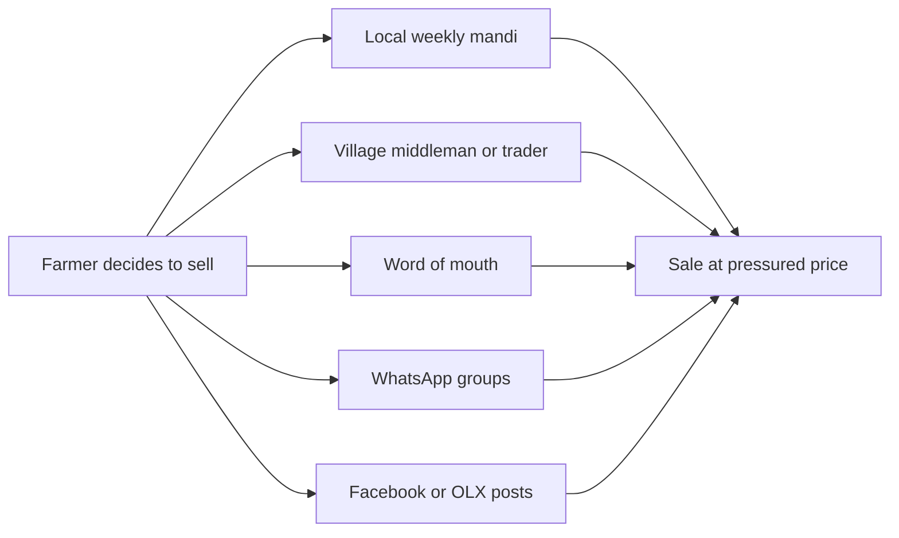
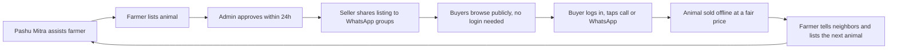
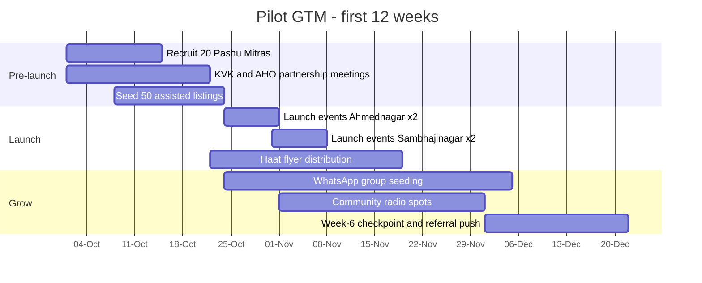

# 02 — Market Research, Competitors & Go-to-Market

| Field | Value |
|---|---|
| **Status** | Draft |
| **Version** | 1.0 |
| **Owner** | Founder (Abhishek) |
| **Last updated** | 2026-07-04 |
| **Depends on** | [../00-foundation/README.md](../00-foundation/README.md) · raw sources: [./source/deep-research-report.md](./source/deep-research-report.md), [./source/discusstion-dump.md](./source/discusstion-dump.md), [./source/phase-one-discussiton.md](./source/phase-one-discussiton.md) |

> **Purpose.** This document consolidates and deepens the raw research under `./source/` into one decision-ready reference: market context, competitor landscape, PashuSetu's differentiation wedge, positioning, and the go-to-market (GTM) plan for the pilot. It feeds the PRD ([../01-prd/README.md](../01-prd/README.md)), the personas and interview plan ([../03-users/README.md](../03-users/README.md)), and the project plan ([../15-project-plan/README.md](../15-project-plan/README.md)).
>
> **Provenance convention.** Every market figure is tagged with its source file, e.g. `[src: deep-research-report.md]`. This is desk research consolidated from prior sessions — **no new web research was run for this document**. Any figure that must be re-checked before it appears in a pitch deck, press note, flyer, or investor material carries the label **(verify before publishing)**. Figures without that label are still internal working numbers, not citations.
>
> **Business rule references.** Rule IDs (BR-xx) are owned and numbered by [../04-business-rules/README.md](../04-business-rules/README.md). This document references rules by their canonical value (e.g. "24-hour moderation SLA") plus a link to doc 04; the BR-xx id table lives there so the two docs cannot drift.

---

## 1. Market context

### 1.1 India livestock economy — headline numbers

| # | Figure | Value | Source & vintage | Confidence |
|---|---|---|---|---|
| M1 | Total livestock population, India | ~535 million animals | 20th Livestock Census (2019) `[src: deep-research-report.md]` | High — official census (verify before publishing) |
| M2 | Cattle (cows) population, India | ~192 million | 20th Livestock Census (2019) `[src: deep-research-report.md]` | High (verify before publishing) |
| M3 | Buffalo population, India | ~109 million | 20th Livestock Census (2019) `[src: deep-research-report.md]` | High (verify before publishing) |
| M4 | Rural households dependent on livestock for livelihood | ~20.5 million | `[src: deep-research-report.md]` | Medium — source vintage unclear; may be persons rather than households (verify before publishing) |
| M5 | India dairy market size | ₹13,174 billion (2021) | `[src: deep-research-report.md]` | Medium (verify before publishing) |
| M6 | Organized dairy sector growth | Projected to roughly double by 2027 | `[src: deep-research-report.md]` | Medium — projection, not measurement (verify before publishing) |

**What these numbers mean for PashuSetu.** The asset base is enormous and the asset is *traded*: milch animals change hands at predictable moments (post-calving, dry period, herd downsizing, distress). Even a tiny fraction of India's ~300M bovines (M2+M3) turning over annually implies millions of transactions per year — and today nearly all of them are discovered through physical mandis, middlemen and WhatsApp word-of-mouth (§1.3). Dairy growth (M5, M6) means demand for high-yield milch animals is rising faster than local supply networks can serve it, which is exactly the cross-district discovery problem a marketplace solves.

### 1.2 Maharashtra — the chosen wedge

| # | Figure | Value | Source | Confidence |
|---|---|---|---|---|
| M7 | Maharashtra cattle population | "c. 62M cattle in the state" as written in the source | `[src: deep-research-report.md]`, executive summary | **Low — internally inconsistent.** India's total cattle population is ~192M (M2); a single state holding 62M is implausible. The figure likely conflates total state livestock with cattle, or is an extraction error. Treat Maharashtra bovine population as an order of magnitude of ~10–35M until re-verified. **(verify before publishing — do not quote 62M anywhere external)** |
| M8 | Traditional trading venues | Weekly cattle bazaars remain the primary selling channel; named examples: Goregaon (Mumbai region), Baramati (Pune district) | `[src: deep-research-report.md]` | Medium — examples only; full mandi map is research backlog item R-04 |
| M9 | Administrative geography | 36 districts (seeded with Marathi names in the DB) | [../00-foundation/README.md](../00-foundation/README.md) glossary; seed list in [../07-database/README.md](../07-database/README.md) | High — fixed by product decision |

Maharashtra is the wedge because: (a) it has a dense dairy belt (Western Maharashtra co-op heartland) plus large goat/sheep economies (Osmanabadi goat, Deccani sheep — both seeded breeds); (b) Marathi is underserved by Hindi-first national apps (§2, §3); (c) the founder's operating base, language competence and field access are here (locked decision D7/D8 context, [../00-foundation/README.md](../00-foundation/README.md)); (d) a single-state scope keeps the district/breed/legal model small enough for a solo developer to ship correctly (D1, D7).

### 1.3 The trading status quo (the "competitor" that matters most)

Today's discovery-and-sale chain, as captured in the discussion research `[src: discusstion-dump.md]`:

**Pain points by side** `[src: discusstion-dump.md]`:

| Farmer (seller) pain | Buyer pain |
|---|---|
| Cannot reach buyers outside the village | Hard to find quality animals |
| Depends on local traders and middlemen | No trust in listings or sellers |
| Does not know fair market value | Fake or incomplete information |
| Difficult to showcase animal quality (yield, health, pregnancy) | Must travel long distances to inspect |
| No digital presence | Limited options in the local radius |
| Weak price negotiation position | No way to search or filter by breed, yield, price, district |

**Failures of the status quo channels** `[src: discusstion-dump.md]`: no trust, small audience, poor pricing, fake information, no search, no verification. Every one of these maps to a locked MVP capability (moderation D10, structured search filters, verified attribute fields, statewide reach).

### 1.4 Demand side — who actually buys

Supply-side pain gets the headlines, but marketplace liquidity dies on the buyer side first (risk AR7). The three buyer segments, from the persona research `[src: discusstion-dump.md]` and [../00-foundation/README.md](../00-foundation/README.md) §5:

| Segment | Archetype | Buying pattern | What they need from PashuSetu | GTM implication |
|---|---|---|---|---|
| **Livestock trader** (व्यापारी) | "Mahesh" — visits villages, buys ~10 cows/month, resells | High frequency, bulk, cross-district; price-driven | Many listings, district + price filters, fast scanning of new inventory | Recruit personally at mandis as **power buyers**; 20 active traders can absorb the entire pilot supply. Interest-event rate limit of 20/day/buyer ([../04-business-rules/README.md](../04-business-rules/README.md)) is sized so a working trader is never blocked |
| **Dairy farm** | "Anjali" — runs a dairy operation | Low frequency, high ticket; yield-driven | Trustworthy milk-yield, lactation and pregnancy data; verified feel | Reach via dairy co-op channel (§5.2); listing detail page must lead with yield attributes (R-02 validates ordering) |
| **Fellow farmer** | Neighboring farmer replacing or adding one animal | Occasional; trust- and proximity-driven | Nearby options (own + adjacent district), honest photos, negotiable price flag | Reached organically by WhatsApp share cards; district filter defaults matter (R-12) |

### 1.5 Why now

1. **Smartphone + cheap data have reached the village.** Rural Maharashtra farmers already run WhatsApp daily — the behavioral leap to a PWA opened from a WhatsApp link is small (this is D9's core bet). Actual device/network penetration in the pilot districts is research item R-05.
2. **National incumbents proved the category** (Animall's scale, §2) but built Hindi-first and moderation-light — the trust gap they left open is the wedge (§3).
3. **Dairy demand growth (M6)** raises the value of cross-district discovery of high-yield animals right now.
4. **Regulatory clarity exists**: the Maharashtra Animal Preservation Act constraints are known and designable-for via the seller declaration and moderation (see [../16-legal/README.md](../16-legal/README.md)); the compliance burden is a moat against casual classifieds, not a blocker.

---

## 2. Competitor matrix

One row per competitor. Scale figures are from the source research and Play Store observations captured there — all download counts are **(verify before publishing)**.

| Competitor | Type | Scale / downloads | Pricing / commission | Languages | Key features | Trust mechanisms | Weaknesses | What PashuSetu learns / steals |
|---|---|---|---|---|---|---|---|---|
| **Animall** (पशु मेळा) `[src: deep-research-report.md]` | VC-backed dedicated livestock app, nationwide | 10M+ downloads (verify before publishing) | "100% free online Pashu Mandi", no commission; monetizes adjacent services/ads | Hindi-first; Marathi interface available (translation layer) | Cow/buffalo/goat listings with photos, breed, milk yield, weight, location; in-app chat; direct buyer–seller connect | Phone-verified accounts; community reporting; volume itself signals liquidity | Hindi-first UX in Maharashtra; open-post model lets fake/duplicate/stale listings through; national breadth over district depth; chat spam | Steal the structured attribute template (breed, milk yield, lactation, pregnancy) — it is the category standard; copy supply-first growth. Differentiate on moderation-before-visibility and Marathi-native copy |
| **PashuShala** `[src: deep-research-report.md]` | Livestock/dairy "Super App" (listings + farm tools + insurance + vet help) | Self-claims "India's leading online livestock marketplace" (verify before publishing) | Free listings; monetizes bundled services | Hindi and Marathi support | Marketplace plus farm management, insurance referral, vet help | Service bundling implies legitimacy; no strong listing-level verification reported | Breadth dilutes marketplace liquidity; heavy multi-feature UI is hostile to first-time smartphone users | Their bundle is our Phase 3+ roadmap validation (vet/insurance extension points, [../00-foundation/README.md](../00-foundation/README.md) §1). Do NOT bundle in MVP — ship one job done well |
| **PashuLok** `[src: deep-research-report.md]` | Free classifieds website for all animals (cattle, goats, even dogs) | Low — hundreds of listings (verify before publishing) | Free | Multilingual UI | Basic classified posts | Effectively none | Thin liquidity, basic UX, no curation → stale/junk inventory | Cautionary tale: a classifieds shell without moderation or liquidity ops stagnates. Liquidity is an operations problem (GTM §5), not only a software problem |
| **Animal Sales** `[src: deep-research-report.md]` | Mobile app for farm animals | ~22k downloads (verify before publishing) | "Completely FREE", no commission | Multi-language, generic | Basic listing + browse | None notable | User complaints about login friction and geolocation bugs | Login friction kills rural adoption → PashuSetu keeps browse/search/detail public with no login (canonical rule; [../04-business-rules/README.md](../04-business-rules/README.md)); OTP demanded only at contact/list time |
| **e-GOPALA** (NDDB) `[src: deep-research-report.md]` | Government portal/app for livestock management | Government distribution; usage unclear (verify before publishing) | Free | Hindi/English + regional | Health records, germplasm/breeding trade, scheme info | Government backing = institutional credibility | Not a peer-to-peer marketplace; utilitarian UX; low farmer awareness as a *selling* channel | Government-adjacent credibility works → partner with animal husbandry officers and KVKs (§5.2) instead of competing with the state; align our breed taxonomy with official nomenclature ([../07-database/README.md](../07-database/README.md) seeds) |
| **OLX / Facebook Marketplace** `[src: discusstion-dump.md, deep-research-report.md]` | Generic horizontal classifieds | Massive installed base (horizontal) | Free listing | Multi-language but generic strings, not livestock vocabulary | Free-text posts, photos, chat/phone | Essentially none for livestock; scam-prone | No breed/yield/lactation fields; no vetting; fake info endemic; search useless for livestock specifics | Buyers *already search there* → PashuSetu's public SSR listing pages (Next.js, D1/D9) must be indexable so Google queries like "गीर गाय विक्री सातारा" land on us. Structured domain fields are the moat a horizontal player will not build |
| **WhatsApp groups** `[src: discusstion-dump.md, deep-research-report.md]` | Informal village/taluka trade groups | Ubiquitous; every trading cluster has several | Free | Marathi-native | Instant photo + voice-note posts to a known-ish audience | Social familiarity of group members | No search, no filters, no history (listings scroll away), reach capped at group size, cross-group scams, no structured info | Treat WhatsApp as the **distribution rail, not the rival**: WhatsApp deep-link contact (D6), per-listing share cards with link previews, and group seeding (§5.2) make PashuSetu the persistent, searchable layer on top of existing behavior |
| **Traditional mandis** (weekly पशु बाजार, e.g. Goregaon, Baramati) `[src: deep-research-report.md]` | Physical weekly cattle markets | Primary channel today (M8) | Informal agent/middleman commission, commonly a small percentage of sale value — exact norms per market unknown (verify before publishing; research item R-04) | Marathi, face-to-face | In-person inspection, same-day cash sale, price haggling | Physical inspection of the animal — the strongest trust mechanism that exists | Travel cost and animal stress; one-day sale pressure → distress pricing; buyer pool limited to who showed up; zero pre-discovery | Do not fight physical inspection — **position PashuSetu as the discovery layer before the farm/mandi visit**. The final handshake stays offline (platform-as-facilitator stance, [../16-legal/README.md](../16-legal/README.md)); GTM sets up at mandis, not against them (§5.6) |

**Also named in early research, deliberately not profiled**: *EasyPashu* and *DairyKhata* `[src: discusstion-dump.md]` — the deep-research pass found no marketplace signal worth profiling (DairyKhata is dairy bookkeeping, not trading). They stay on the research backlog (R-08) as a completeness check, not as competitors of record.

### 2.1 Primary competitor teardown — Animall

Animall is the benchmark the field will compare us against ("हे Animall सारखं आहे का?" — "is this like Animall?"), so the match/avoid/exploit call must be explicit. Based on the source research `[src: deep-research-report.md]`; feature-level claims to be re-confirmed in R-08 before external use (verify before publishing).

| Dimension | Animall's play | PashuSetu's call |
|---|---|---|
| Listing template | Structured fields: species, breed, milk yield, weight, photos, location | **Match and extend** — same category-standard fields plus lactation number, pregnancy, vaccination flags (canonical `listings` schema, [../07-database/README.md](../07-database/README.md)). Buyers trained by Animall find our form familiar |
| Publication model | Post-first, moderate-later; volume is the product | **Invert** — moderation-before-visibility (D10). We accept slower listing counts for near-zero fake inventory; this is the brand |
| Contact | In-app chat | **Avoid** — chat is out of MVP scope (D6). Calls + WhatsApp match actual rural behavior and cost nothing to moderate |
| Language | Hindi-first, Marathi as a translation layer | **Exploit** — Marathi-native copy written for the rural register, not machine-translated strings (DF1) |
| Geography | Pan-India taxonomy and liquidity | **Exploit** — 36-district Maharashtra depth, local breed catalog, mandi-level GTM presence a national player cannot staff |
| Monetization | Free listings; adjacent services/ads | **Match** — free, no commission in MVP; confirms the liquidity-first model `[src: discusstion-dump.md]` |

### 2.2 Competitive read in one paragraph

The category is proven (Animall's scale) and free (nobody charges commission — so neither can we in MVP, confirming the free model in [../01-prd/README.md](../01-prd/README.md)). The unclaimed ground is **trust at the listing level** and **language at the native level**. Every incumbent chose volume over verification and Hindi over Marathi. Both choices are rational at national scale — and both are exactly what a Maharashtra-only, moderation-first product can exploit, because our constraint (solo dev, one state, D1/D7) is their structural blind spot.

---

## 3. Gap analysis & differentiation

### 3.1 The gaps, explicitly

| # | Gap in the market | Evidence | Who leaves it open |
|---|---|---|---|
| G1 | Marathi as the *default*, rural-register language, not a translated layer | Animall/PashuShala are Hindi-first with Marathi toggles `[src: deep-research-report.md]` | All national apps |
| G2 | Human review of **every** listing before it is publicly visible | Incumbents publish first, police later; fake info is the #1 stated buyer pain `[src: discusstion-dump.md]` | All incumbents (moderation-at-scale is too expensive for them; affordable at one-state volume) |
| G3 | District-and-breed depth for one state (36 MH districts in Marathi, Khillar/Dangi/Deoni/Red Kandhari/Pandharpuri/Osmanabadi seeded) | National apps carry generic pan-India taxonomies | All national apps |
| G4 | Contact through channels farmers already use (call + WhatsApp), with the seller's number protected until a logged, logged-in reveal | Incumbents either expose numbers openly (scraping, spam) or force in-app chat (friction) | Both extremes exist; nobody does gated reveal + native channels |
| G5 | Genuinely light experience: public browsing with no login, usable on 3G, installable PWA | Login-walled native apps; Animal Sales login complaints `[src: deep-research-report.md]` | Most incumbents |
| G6 | Built-in Maharashtra legal compliance (no-slaughter seller declaration, moderation rejects slaughter-intent listings) | 1976 Act + 2015 amendment + 2026 enforcement tightening `[src: deep-research-report.md]` | Generic classifieds entirely; national apps partially |

### 3.2 Five differentiators, each mapped to a shipped MVP feature

| # | Differentiator | Concrete product feature that delivers it | Where it is specified |
|---|---|---|---|
| DF1 | **Marathi-first, not Marathi-translated** | Marathi default UI with English fallback (D8); rural-register copy deck; icon + text pairing for low-literacy users; Devanagari-legible type | [../10-frontend-design-requirements/README.md](../10-frontend-design-requirements/README.md), i18n in [../09-backend/README.md](../09-backend/README.md) |
| DF2 | **Moderation before visibility** | Full listing state machine `DRAFT→PENDING→APPROVED…` (D10); 24-hour moderation SLA; mandatory rejection reasons; ≥3 open reports auto-hide a live listing; admin audit log | [../04-business-rules/README.md](../04-business-rules/README.md), state machine + admin panel in [../05-features/README.md](../05-features/README.md) |
| DF3 | **Maharashtra-only depth** | 36 districts seeded with Marathi names; Maharashtra-native breed catalog (cow: Gir, Khillar, Dangi, Deoni, Gaolao, Red Kandhari…; buffalo: Pandharpuri, Nagpuri, Murrah…; goat: Osmanabadi, Sangamneri; sheep: Deccani, Madgyal); district filter as a first-class search facet | Seed data in [../07-database/README.md](../07-database/README.md); `GET /meta/districts`, `GET /meta/breeds` in [../08-api/README.md](../08-api/README.md) |
| DF4 | **Contact where farmers already live** | Click-to-call + WhatsApp deep-link + "Send Interest" (D6); seller phone revealed **only** via `POST /listings/{id}/interest` after login, every reveal logged as an interest event (fuels the ≥25% inquiry metric and blocks scraping) | [../08-api/README.md](../08-api/README.md), contact rules in [../04-business-rules/README.md](../04-business-rules/README.md) |
| DF5 | **Fast, public, installable** | PWA (D9); browse/search/detail public with no login; page usable on 3G in <5s; cursor pagination default 20; WebP image variants from R2 | [../10-frontend-design-requirements/README.md](../10-frontend-design-requirements/README.md), [../11-architecture/README.md](../11-architecture/README.md) |

### 3.3 What we deliberately do NOT compete on (MVP)

Per locked scope ([../00-foundation/README.md](../00-foundation/README.md) §4): no in-app chat (Animall has it; we bet calls/WhatsApp are better for this audience — D6), no payments/escrow, no transport, no insurance/loans (PashuShala's bundle), no auctions, no AI pricing. Losing a feature-checklist comparison is acceptable; losing the trust comparison is not.

### 3.4 Monetization outlook (post-MVP, competitor-validated)

MVP is free with no commission — that is locked by the market (§2.2: nobody charges) and by Principle 6 ("No Hidden Charges", any future monetization explicit and opt-in). The future revenue lines below come from the founding discussion `[src: discusstion-dump.md]` and are validated by what incumbents already monetize; none of them requires schema changes beyond the noted extension points, and **none is designed further in Phase 1**.

| Future revenue line | Competitor precedent | Earliest phase | MVP extension point kept |
|---|---|---|---|
| Featured listings | Classifieds-standard (OLX model) | Phase 2 | `listings` sort logic is server-side; a boost flag is an additive column later |
| Verified Seller badge | Animall-style trust upsell | Phase 2 | Badge extension point noted in [../00-foundation/README.md](../00-foundation/README.md) glossary; no MVP UI |
| Ads (agri inputs, feed) | PashuShala bundle | Phase 3 | None needed |
| Insurance / vet / loan referrals | PashuShala, e-GOPALA ecosystem | Phase 3+ | Out-of-scope note in foundation §4; no schema hooks in MVP |

### 3.5 Competitive moat summary

The durable moat is **operational, not technical**: a human moderation reputation earned listing-by-listing, mitra/co-op relationships in 36 districts, and a Marathi copy voice farmers trust. Software (Next.js PWA, structured fields) is table stakes any funded competitor can copy in a quarter; the trust ledger is not.

---

## 4. Positioning statement & taglines

### 4.1 Positioning statement (classic template)

> **For** Marathi-speaking livestock farmers and buyers in rural Maharashtra
> **who** need to sell or find cattle, buffaloes, goats and sheep beyond their village but cannot trust what they see online,
> **PashuSetu is** a free, Marathi-first livestock marketplace (installable web app)
> **that** shows only human-verified listings and connects buyer and seller directly by phone call or WhatsApp — no middleman, no commission.
> **Unlike** Animall and generic classifieds,
> **PashuSetu** reviews every listing before it goes public and is built exclusively for Maharashtra — its 36 districts, its breeds, its language.

### 4.2 Tagline candidates (3)

| # | English | Marathi (Devanagari) | Gloss / register note |
|---|---|---|---|
| T1 **(recommended)** | The trusted bridge between farmer and buyer. | शेतकरी आणि खरेदीदार यांच्यातील विश्वासाचा सेतू. | Plays on the product name — *Setu* = bridge; simple, dignified register |
| T2 | Fair price. Direct contact. In your language. | योग्य भाव. थेट संपर्क. आपल्या भाषेत. | Three-beat benefit stack; strongest for flyers/radio |
| T3 | Your cattle market, now on your phone. | तुमचा पशु बाजार, आता तुमच्या मोबाईलमध्ये. | Anchors on the familiar mandi mental model |

**Decision:** T1 is the master brand tagline (logo lockup, app header); T2 is the performance line for flyers, radio and WhatsApp share cards. T3 is held in reserve for launch-event banners. The designer receives all three in the copy deck ([../10-frontend-design-requirements/README.md](../10-frontend-design-requirements/README.md)).

---

## 5. Go-to-market plan

### 5.1 GTM principles

1. **Supply first.** A marketplace with buyers and no animals dies quietly. Every pre-launch activity manufactures approved listings before we invite buyers.
2. **Trust must be visible and human.** In the village, trust transfers from people (Pashu Mitra, AHO, co-op secretary), not from apps. Every channel below routes through a trusted human.
3. **Zero cost, zero risk to the farmer.** Free listing, no commission, no payment collected — say it on every asset (`[src: discusstion-dump.md]` business model: FREE for liquidity).
4. **Ride existing rails.** Weekly haat, milk collection center, vaccination camp, WhatsApp group — we insert into existing rhythms; we do not create new ones.
5. **Everything is measurable.** Each channel maps to a numeric leading indicator (§5.10); the interest-event log (D6) is the ground truth for the ≥25% inquiry metric.

### 5.2 Channel playbook

| Channel | What we do | Owner | Cost profile | Leading indicator |
|---|---|---|---|---|
| **Pashu Mitra ambassadors** | 10 village-level ambassadors per pilot district assist farmers to list (full program spec §5.3) | Founder (recruit), Pashu Mitra (execute) | ₹50 recharge per assisted approved listing, capped ₹500/month/mitra (manual, off-platform fulfillment — keeps the product itself payment-free per MVP scope) | Assisted listings/week per mitra |
| **KVK & Animal Husbandry Officer partnerships** | Demo sessions at Krishi Vigyan Kendra trainings; AHO endorsement; presence at vaccination camps `[src: deep-research-report.md]` | Founder | Travel only | Demos held; farmers registered per demo |
| **Dairy co-op tie-ins** | Poster + QR at milk collection centers; 5-minute pitch in society meetings; co-op secretary as referrer `[src: deep-research-report.md]` | Founder + local secretary | Print cost | Centers postered; scans per poster QR |
| **Weekly haat flyers** | A6 Marathi flyer with 3-step how-to, QR to PWA, helpline number; distributed at weekly cattle markets (e.g. Baramati-class mandis, M8) | Pashu Mitra + founder | ~₹2/flyer, 2,000 flyers per district per month | Flyers out; QR scans; helpline calls citing flyer |
| **WhatsApp seeding** | Per-listing share card (image + link preview) posted into existing cattle-trade groups; sellers nudged to share their own approved listing | Product (share button) + Pashu Mitra (group access) | Free | Shares per approved listing; referral traffic |
| **Community radio / local audio** | 30-second Marathi spot on community radio + recorded audio message forwarded in WhatsApp voice-note culture `[src: deep-research-report.md]` | Founder (script), station (airing) | ₹10,000/month/district budget line | Helpline calls citing radio |

### 5.3 Pashu Mitra (पशु मित्र — "friend of livestock") program spec

| Aspect | Decision |
|---|---|
| Definition | A locally respected person (progressive dairy farmer, para-vet, co-op secretary, agri-input shop owner) who helps farmers create listings on the farmer's own phone |
| Coverage | 10 per pilot district ≈ 1 per taluka cluster |
| Selection criteria | Owns a smartphone; active in ≥2 cattle WhatsApp groups; known at the local mandi; can read Marathi comfortably |
| Incentive | ₹50 mobile recharge per assisted listing that reaches APPROVED; cap ₹500/month; paid manually by ops (no in-product payments — MVP scope guard) |
| Anti-gaming guard | Recharge paid only on APPROVED (moderated) listings; duplicate-listing heuristic (same seller + species + price within 10% within 7 days, per [../04-business-rules/README.md](../04-business-rules/README.md)) flags farm-listing mills to admin; a mitra tied to ≥3 rejected-for-fake listings is dropped |
| Toolkit | Laminated A5 Marathi how-to card, 90-second demo video (shareable on WhatsApp), direct line to the founder's ops WhatsApp group |
| Critical rule | The **seller personally** taps the declaration checkbox (lawful ownership, sale complies with state law, not for slaughter — stored as `declaration_accepted` + timestamp). A Pashu Mitra may type and photograph, but never accepts the declaration on the seller's behalf. This is a legal control, not a courtesy ([../16-legal/README.md](../16-legal/README.md)) |

### 5.4 Pilot district selection

**Criteria** (score each candidate 1–5 per row):

| # | Criterion | Why it matters |
|---|---|---|
| C1 | Milch-animal density & dairy activity | Supply of listable, high-value animals (cows/buffaloes carry the highest ticket sizes) |
| C2 | Dairy co-op strength | Ready-made trusted distribution (channel §5.2) |
| C3 | Active weekly cattle mandis | Launch venues + flyer distribution + buyer concentration |
| C4 | Smartphone / 4G penetration | PWA viability (validated by R-05) |
| C5 | Founder travel access from base | Solo-founder ops reality (D7): every pilot problem gets fixed in person |
| C6 | KVK / AHO accessibility | Institutional endorsement channel |
| C7 | Goat/sheep economy presence | Second species leg → more listings per village, faster liquidity |

**Recommendation — two pilot districts (founder decision, 2026-07-05):**

| District | Marathi | Reasoning against criteria | Watch-outs |
|---|---|---|---|
| **Ahmednagar** (officially renamed Ahilyanagar) | अहमदनगर (अहिल्यानगर) | Largest district in the state by area with one of Maharashtra's strongest dairy belts and co-op networks (C1, C2 high); dense weekly market calendar (C3); hosts major agri institutions incl. KVK presence around Rahuri (C6); named in early scoping `[src: deep-research-report.md]`, Sprint 3 seed note. District-level stats to be re-confirmed in field research (verify before publishing) | Physically huge — restrict pilot ops to 3–4 talukas (e.g. Sangamner–Rahuri–Shrirampur belt) rather than the whole district |
| **Aurangabad** (officially renamed Chhatrapati Sambhajinagar) | औरंगाबाद (छत्रपती संभाजीनगर) | Marathwada's commercial hub with strong road connectivity and dense weekly cattle-market calendar (C3); catchment for buffalo (Jafarabadi/local) and the Osmanabadi goat economy of Marathwada (C7); regional trader concentration gives demand-side liquidity (C2); founder-selected pilot geography, 2026-07-05. District-level stats to be confirmed in field research (verify before publishing) | Drier region — milch-cow dairy density lower than the western sugar belt; lean on buffalo + goat supply and trader (Mahesh-type) demand; co-op network thinner than Ahilyanagar, so KVK/AHO partnerships (§5.2) matter more here |

Pune district (Baramati mandi, M8; Shikrapur used in early API examples `[src: deep-research-report.md]`) remains the named **fallback/third district** if either pilot underperforms at the week-6 checkpoint (§5.8); Satara (previous recommendation, strong existing research access) is the secondary fallback.

> **Decision note (2026-07-05):** the earlier draft recommended Ahilyanagar + Satara. The founder selected **Ahilyanagar (Ahmednagar) + Chhatrapati Sambhajinagar (Aurangabad)** as the two pilot districts; all downstream docs (PRD §10, project plan S8/M5, UAT plan, launch checklist) follow this pair.

### 5.5 Support model

| Element | Decision |
|---|---|
| **Marathi helpline** | One dedicated mobile number (procured in launch-prep week −4; printed as `<HELPLINE_NUMBER>` slot on all asset templates). Hours 10:00–18:00 IST, Mon–Sat. Missed call → callback within 4 working hours. Staffed by the founder in pilot; scripts documented so a part-time Marathi support agent can take over at >20 calls/day |
| **Helpline greeting (script line)** | «नमस्कार! पशुसेतू मदत केंद्रात आपले स्वागत आहे. मी तुम्हाला जनावर विकायला किंवा खरेदी करायला मदत करू शकतो.» — "Hello! Welcome to the PashuSetu help center. I can help you sell or buy an animal." |
| **Call-to-list assisted onboarding** | Farmer calls; agent walks the farmer through the flow **on the farmer's own device**, step by step in Marathi. If the farmer cannot operate the phone at all, the agent dispatches the nearest Pashu Mitra for an in-person assist. The agent never creates listings from an ops account on a farmer's behalf — the seller declaration and OTP must be the seller's own (see §5.3 critical rule) |
| **WhatsApp support** | The helpline number doubles as a WhatsApp inbox — farmers send photos/voice notes; agent replies with the how-to video and, if needed, schedules a callback |
| **Grievance channel** | The same helpline is the published grievance contact required under IT Rules 2021, wired to the report/moderation workflow ([../16-legal/README.md](../16-legal/README.md), [../04-business-rules/README.md](../04-business-rules/README.md)) |

### 5.6 Launch event plan

| Item | Decision |
|---|---|
| Venue | The largest weekly cattle mandi in each pilot district (candidate: Baramati-class market in the region, per M8; final venue confirmed with the market committee 2 weeks ahead) |
| Format | Canopy + table + banner (tagline T3); 2 phones for live demos; Pashu Mitras of that taluka present; AHO / co-op chairman invited to inaugurate (institutional trust, §2 e-GOPALA lesson) |
| Core activity | On-the-spot listing creation: photograph the animal the farmer brought to sell, create the listing with them, submit for moderation before they leave. Admin (founder) approves compliant listings same-day from the venue |
| Target | ≥30 submitted listings and ≥60 registrations per event; 2 events per district in launch month (4 total) |
| Handout | The haat flyer (§5.7 copy) + helpline card |
| Follow-up | Every event registrant gets the WhatsApp how-to video within 24h; Pashu Mitra follows up with non-completers in week 1 |

### 5.7 Field asset copy (Marathi master versions)

**Flyer headline:** «आता जनावरं विका मोबाईलवरून — मोफत!» — "Now sell animals from your mobile — free!"

**Flyer 3 steps:**
1. «फोटो काढा» — "Take photos"
2. «माहिती भरा» — "Fill in the details"
3. «खरेदीदाराचा थेट फोन येईल» — "The buyer will call you directly"

**Trust line:** «प्रत्येक जाहिरात तपासूनच दाखवली जाते. कोणतेही कमिशन नाही.» — "Every listing is checked before it is shown. No commission."

**Seller share message** (prefilled in the WhatsApp share button on an approved listing): «माझे जनावर विक्रीसाठी आहे — पशुसेतूवर पहा: {link}» — "My animal is for sale — see it on PashuSetu: {link}"

**Buyer-side share card caption:** «{breed} {species} विक्रीसाठी, किंमत ₹{price}, {district}. पशुसेतूवर पहा: {link}» — "{breed} {species} for sale, price ₹{price}, {district}. See it on PashuSetu: {link}"

### 5.8 Referral loop & GTM flywheel

**Referral mechanics (MVP — deliberately manual):** in-product referral codes are Phase 2 (schema and API stay untouched; no referral entity in [../07-database/README.md](../07-database/README.md)). In MVP the loop is: (a) the approval notification (SMS/in-app, per notifications spec in [../05-features/README.md](../05-features/README.md)) nudges the seller to share their listing to WhatsApp with the prefilled message above — the seller's own pride is the referral engine; (b) Pashu Mitra attribution is logged manually in the ops sheet at assist time; (c) the helpline asks every caller "कुठून समजले?" ("How did you hear about us?") and tallies channel attribution weekly. A monthly **Pashu Mitra leaderboard** (shared in the ops WhatsApp group) adds status competition on top of the recharge incentive.

**Pilot GTM timeline** (aligned to the build timeline in [../15-project-plan/README.md](../15-project-plan/README.md), which targets a pilot in Oct 2026 `[src: deep-research-report.md]`):

**Week-6 checkpoint (2026-12-01):** if a pilot district shows <50 approved listings or <15% of approved listings with ≥1 interest event, rebalance mitra count toward the stronger district or activate the Pune fallback (§5.4).

### 5.9 Pilot GTM budget (3 months, 2 districts)

Sized against the ₹50,000/month marketing + ₹30,000/month support/ops budget lines in the cost model `[src: deep-research-report.md]`; the pilot deliberately runs leaner because the founder self-staffs support (D7). All amounts INR; all are planning estimates (verify before publishing in any external funding material).

| Line item | Basis | Month 1 | Month 2 | Month 3 | Total |
|---|---|---|---|---|---|
| Pashu Mitra incentives | 20 mitras, avg ₹300/mo against the ₹500 cap | 4,000 | 6,000 | 6,000 | 16,000 |
| Haat flyers | 2,000/district/mo × ₹2 × 2 districts | 8,000 | 8,000 | 8,000 | 24,000 |
| Launch events | 4 events × ₹7,500 (canopy, banner, travel, prints) | 30,000 | — | — | 30,000 |
| Co-op center posters | 200 posters × ₹15, one-time | 3,000 | — | — | 3,000 |
| Community radio | ₹10,000/district/mo, months 2–3 per gantt | — | 20,000 | 20,000 | 40,000 |
| Helpline SIM + recharge | Dedicated number, unlimited plan | 500 | 500 | 500 | 1,500 |
| Founder field travel | Fuel + stay across 2 districts | 8,000 | 8,000 | 8,000 | 24,000 |
| Contingency (10%) | Rounded | 5,500 | 4,500 | 4,500 | 14,500 |
| **Total** | | **59,000** | **47,000** | **47,000** | **₹1,53,000** |

Rule of thumb this budget must beat: at the month-3 target of 1,000 listings, GTM cost per approved listing ≤ ₹153 — cheaper than one mandi trip costs a farmer. If cost/listing exceeds ₹300 at the week-6 checkpoint, cut radio first (weakest attribution), never the mitra program (strongest).

### 5.10 GTM success metrics (tied to foundation targets)

| Metric | Target | Source of truth |
|---|---|---|
| Farmers registered, month 1 | 100 ([../00-foundation/README.md](../00-foundation/README.md) §4) | `users` table, `is_farmer = true` |
| Approved listings, launch month (both districts) | ≥150 | `listings` where `status = APPROVED` |
| Listings, month 3 | 1,000 (foundation) | `listings` count |
| Users, month 6 | 5,000 (foundation) | `users` count |
| Inquiry rate | ≥25% of approved listings with ≥1 interest event (foundation) | `interest_events` join `listings`; `GET /admin/stats` |
| Pashu Mitras active (≥2 assisted listings/month) | ≥14 of 20 | Ops sheet |
| Moderation SLA adherence | ≥95% of PENDING decided within 24h | `moderation_log` timestamps vs `listings.created_at` |
| Helpline callback SLA | ≤4 working hours | Helpline log |
| Assisted-listing share of supply, month 1 → month 3 | ~60% → <30% (organic takeover signal) | Ops sheet vs `listings` count |

---

## 6. Adoption risks & mitigations

| # | Risk | Likelihood | Impact | Mitigation | Early-warning signal |
|---|---|---|---|---|---|
| AR1 | **Cold-start supply failure** — buyers arrive to an empty shelf | High | Critical | Supply-first GTM: 50 seeded listings before public push; launch events manufacture inventory; buyer-facing promotion only after ≥100 approved listings/district | Approved listings per district per week < 15 |
| AR2 | **Rural digital-literacy friction** — farmers cannot complete the listing flow | High | High | Icon + text UI, minimal typing ([../10-frontend-design-requirements/README.md](../10-frontend-design-requirements/README.md)); Pashu Mitra assists; call-to-list helpline; 90-second Marathi video | Listing-flow drop-off >50% at any step (analytics) |
| AR3 | **Trust deficit / "another app scam" skepticism** | High | High | Human-fronted GTM (mitra, AHO, co-op); "every listing checked, no commission" trust line on all assets; moderation-before-visibility visible in product (PENDING state messaging) | Registrations per demo < 5 |
| AR4 | **Moderation bottleneck** — solo admin cannot hold the 24h SLA as volume grows | Medium | High | Admin queue optimized for ≤60s/decision ([../05-features/README.md](../05-features/README.md)); duplicate-heuristic warnings reduce re-review; hire part-time Marathi moderator at sustained >50 pending/day | SLA adherence <95% for 2 consecutive weeks |
| AR5 | **Fake / fraudulent listings slip through** and poison early trust | Medium | Critical | 100% pre-publication review (D10); report flow with ≥3-open-reports auto-hide; admin ban with listing archival; interest-gated phone reveal blocks scraper-driven scams ([../04-business-rules/README.md](../04-business-rules/README.md)) | >2 confirmed-fraud reports per 100 approved listings |
| AR6 | **Animall competitive response** — incumbent doubles down on Marathi/Maharashtra | Medium | Medium | Speed in the wedge: district-level liquidity + moderation reputation is defensible locally; national player cannot profitably human-review at scale; deepen mitra/co-op relationships incumbents cannot replicate remotely | Animall Marathi-market feature launches (monitor store listings quarterly, R-08) |
| AR7 | **Buyer scarcity** — supply grows but calls do not come | Medium | High | Recruit traders (persona Mahesh `[src: discusstion-dump.md]`) directly at mandis as power buyers; SEO-indexable public pages capture OLX-style search demand (DF5); WhatsApp share cards reach buyers where they already look | Inquiry rate <15% at week 6 checkpoint (§5.8) |
| AR8 | **Regulatory tightening** — 2026 enforcement climate around cattle transport/slaughter chills legitimate trade `[src: deep-research-report.md]` | Medium | High | Mandatory seller declaration (stored with timestamp); moderation rejects slaughter-intent listings; platform-as-facilitator disclaimers; legal watch item in [../16-legal/README.md](../16-legal/README.md) | Any new state notification touching livestock trade/transport |
| AR9 | **Connectivity/OTP failures** in low-signal villages block signup at the worst moment (in front of the farmer) | Medium | Medium | Public browse needs no login (DF5); PWA shell tolerates flaky networks (D9); OTP is Firebase client-side with auto-retry guidance in Marathi; mitras taught the "move to signal, retry" script | OTP failure rate >10% (Firebase console) |
| AR10 | **Incentive gaming** — mitras or sellers spam listings for recharge rewards | Medium | Medium | Reward only on APPROVED listings; max 10 active listings per user; duplicate heuristic flags mills; mitra dropped after 3 fake-listing associations (§5.3) | Rejection rate >30% for any single mitra's assisted listings |
| AR11 | **Seasonality mismatch** — launching in a low-trade season wastes the launch burst | Low | Medium | Launch window (late Oct 2026) sits post-monsoon in the festival/trading season; seasonality validated via R-11 before locking event dates | Mandi footfall observations contradict assumption |
| AR12 | **Data-cost sensitivity** — image-heavy pages burn farmer data budgets | Low | Medium | WebP variants, lazy loading, ≤5MB upload cap with client-side compression ([../04-business-rules/README.md](../04-business-rules/README.md), [../10-frontend-design-requirements/README.md](../10-frontend-design-requirements/README.md)); listing page <5s on 3G budget | Bounce rate on listing detail >60% on slow connections |

---

## 7. Research backlog — what field work must still validate

Desk research got us to a confident plan; these items need primary evidence. **Methods and quotas are executed through the interview plan in [../03-users/README.md](../03-users/README.md)** (target: ≥20 structured interviews across farmers, traders and dairy farms, per the Phase-1 success criteria `[src: phase-one-discussiton.md]`; Marathi survey templates drafted in `[src: deep-research-report.md]` appendix are the starting scripts).

| ID | Open question | Decision it unblocks | Method (per doc 03 plan) | Target evidence | Deadline |
|---|---|---|---|---|---|
| R-01 | How do farmers actually set an asking price today (trader quote, mandi anchor, neighbor)? | Copy for the price field + `negotiable` flag UX; Phase-3 AI-pricing groundwork | Farmer interviews (n≥10), price-story question | 10 pricing narratives | Before Sprint 3 build freeze |
| R-02 | Which listing attributes make a buyer pick up the phone (yield? lactation? photos? pregnancy)? | Field ordering on the listing detail page; photo guidance (min 1 / max 5, recommend 3+) | Trader + dairy-farm interviews (n≥6) | Ranked attribute list | Before design handoff (doc 10) |
| R-03 | How do cattle-trade WhatsApp groups actually operate (posting etiquette, admin gatekeeping, scam patterns)? | Share-card format; group-seeding playbook §5.2 | Observation of 10 groups + 3 group-admin interviews | Etiquette + format notes | Before launch month |
| R-04 | Real mandi economics: agent commission norms, day costs, distress-sale frequency; full weekly-market map for pilot districts | Flyer value-pitch numbers (currently qualitative — verify before publishing); launch venue choice §5.6 | 4 mandi visits (2 per pilot district) with structured observation sheet | Commission range + market calendar | Before flyer print |
| R-05 | Smartphone ownership, 4G quality, data-budget habits in pilot talukas | Confirms PWA/3G bets (D9, DF5); pilot taluka shortlist §5.4 | Field survey (n≥50) alongside interviews | Penetration %s per taluka | Week −4 |
| R-06 | Do rural users recognize our Marathi terms (गाभण, वेत, जात, जाहिरात) or prefer alternatives? | Final copy deck for doc 10; glossary confirmation ([../00-foundation/README.md](../00-foundation/README.md) §6) | Terminology card-sort with 10 farmers | Term acceptance ≥80% or replacement | Before UI copy freeze |
| R-07 | Will sellers accept the no-slaughter/lawful-ownership declaration without dropping out? | Declaration wording + placement in the submit flow ([../16-legal/README.md](../16-legal/README.md)) | Prototype walkthrough with 10 sellers | Drop-off <10% at declaration step | Before Sprint 5 |
| R-08 | Verify competitor facts: Animall's real Maharashtra presence & downloads, PashuShala claims, EasyPashu/DairyKhata relevance | External-safe competitor claims (everything marked *verify before publishing* in §2) | Store-listing pull + ask "which apps have you tried?" in every interview | Verified matrix v1.1 | Before any external deck |
| R-09 | Is a 24h moderation wait acceptable to sellers, or does it need same-day messaging? | PENDING-state messaging & expectation copy; SLA confirmation (doc 04) | Farmer interviews + pilot measurement | <5% helpline complaints about wait | Pilot week 4 |
| R-10 | Who makes the best Pashu Mitra (para-vet vs co-op secretary vs progressive farmer) and is ₹50/listing the right incentive? | Mitra program v1.1 (§5.3) | Recruit first 3 mitras as a paid pilot in week −4 | ≥2 assisted listings per mitra in trial week | Week −2 |
| R-11 | Seasonal trade calendar: which months/festivals peak for each species? | Launch-date lock + marketing calendar (§5.8) | AHO interviews + mandi committee conversations | 12-month demand map per species | Before launch date lock |
| R-12 | Buyer geography: how far will a serious buyer travel for the right animal? | Default district-filter behavior & cross-district search prominence (doc 05) | Trader interviews (n≥6) | Median acceptable travel radius | Before Sprint 4 search UX |

Findings land back in this document as version bumps; any change to canonical business-rule values must go through [../04-business-rules/README.md](../04-business-rules/README.md), not here.

---

## Acceptance checklist

- [x] Market context section presents India + Maharashtra numbers (~535M animals, ~192M cows / ~109M buffaloes, ~20.5M dependent rural households, dairy market size & growth) with per-figure source-file provenance and confidence ratings
- [x] The internally inconsistent "62M Maharashtra cattle" source figure is surfaced, explained, and blocked from external use with a (verify before publishing) label
- [x] Competitor matrix covers all 8 required rows (Animall, PashuShala, PashuLok, Animal Sales, e-GOPALA, OLX/Facebook Marketplace, WhatsApp groups, traditional mandis) with all 8 required columns including "what PashuSetu learns/steals"
- [x] Demand-side buyer segments (trader, dairy farm, fellow farmer) profiled with GTM implications, consistent with foundation personas
- [x] Primary-competitor teardown (Animall) states explicit match/avoid/exploit calls per dimension without contradicting locked decisions
- [x] Gap analysis names 6 explicit gaps and maps exactly 5 differentiators to concrete, locked MVP features with links to owning docs
- [x] Monetization outlook stays post-MVP, competitor-validated, and consistent with Principle 6 and the free MVP model; no Phase-1 design work implied
- [x] Positioning statement follows the classic For/Who/Is/That/Unlike template; 3 tagline candidates provided in English + Devanagari Marathi with a recommended pick
- [x] GTM plan covers all mandated elements: Pashu Mitra program (full spec incl. incentive + anti-gaming), KVK/AHO partnerships, co-op tie-ins, haat flyers, WhatsApp/radio, pilot-district criteria with 2 reasoned recommendations (Ahilyanagar/Ahmednagar, Chhatrapati Sambhajinagar/Aurangabad — founder decision 2026-07-05) + named fallback (Pune), Marathi helpline + call-to-list support model, launch event plan with numeric targets, and a referral loop that stays within MVP scope (no in-product payments or referral schema)
- [x] Field asset copy provided in real Devanagari Marathi with English glosses (flyer, trust line, share messages, helpline greeting)
- [x] Pilot GTM budget itemized for 3 months / 2 districts, arithmetic totals correct, tied to the source cost model and to a cost-per-listing guardrail
- [x] Adoption risks table has 12 rows (≥8 required), each with likelihood, impact, mitigation, and an early-warning signal
- [x] Research backlog lists 12 items, each tied to the decision it unblocks, a method routed through ../03-users/README.md, target evidence, and a deadline
- [x] Every number needing re-verification is labeled "(verify before publishing)"; no new web research was performed
- [x] All three mermaid diagrams (status-quo flowchart, GTM flywheel flowchart, GTM gantt) use valid syntax — quoted labels, no parentheses inside bracketed node labels
- [x] Zero contradictions with locked decisions D1–D10 and canonical values (free/no-commission model, moderation-before-visibility, 24h SLA, 10-active-listing cap, public browse, interest-gated phone reveal, no chat/payments/AI in MVP); no "TBD" or open questions remain
