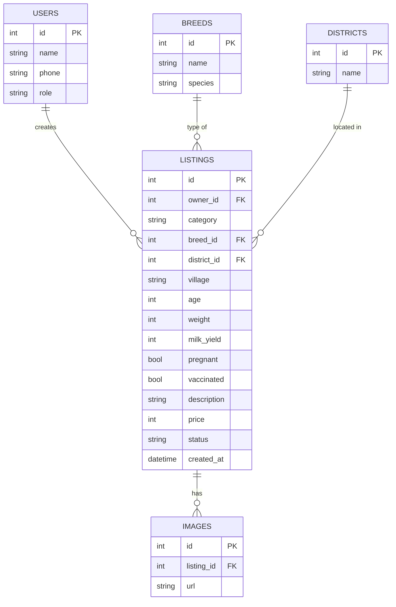
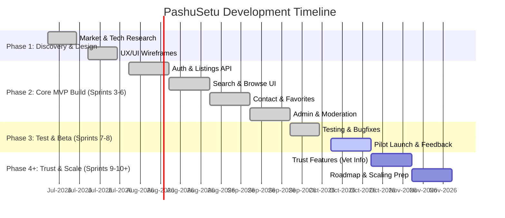

# PashuSetu Livestock Marketplace – Project Plan (Phases 1–10)

**Executive Summary:** India’s livestock sector is massive and growing (e.g. ~535 million animals, dairy market ₹13,174B in 2021), yet farmers lack a modern digital livestock marketplace. Existing players (Animall, PashuShala, PashuLok, etc.) offer free or low-cost listing platforms, but gaps remain in regional language support, trust, and integrated services. *PashuSetu* aims to build a **Marathi-first, mobile-first PWA** where rural farmers can list cows, goats, etc., with verified details (breed, health, etc.), and buyers can browse by type, breed, location, price, and contact sellers directly. By leveraging proven tech (Next.js PWA, PostgreSQL, Firebase Auth, Cloudflare R2, etc.) and focusing on user trust and language accessibility, PashuSetu can complement existing solutions and target Maharashtra’s niche (c. 62M cattle in the state). The project is scoped in 10 iterative sprints (≈20 weeks) and 3 major phases (MVP, Trust features, Growth), culminating in a pilot launch and roadmap for scale.

## Market & Competitor Analysis
- **Livestock Economy:** ~20.5 million rural households depend on livestock for livelihood. India has ~192M cows and ~109M buffaloes (2019), and the organized dairy sector is projected to double by 2027. This creates huge demand for transparent cattle trading.
- **Competitors:** Several marketplaces exist:  
  - **Animall (पशु मेळा)** – Nationwide app (10M+ downloads) offering a “100% free online Pashu Mandi” with no commission. Listings include cow/buffalo/goat with photos, breed, milk/weight, location and allow direct buyer-seller chat. Marathi interface is available.
  - **PashuShala** – A “Super App” for livestock/dairy, with listings plus farm tools, insurance, vet help. Claimed as “India’s leading online livestock marketplace”. Focuses on all-India, with Hindi/Marathi support.
  - **PashuLok** – Free classified site covering all cattle (cow, goat, dog, etc.), with multilingual UI. Lower usage (hundreds of listings) and basic UX.
  - **Animal Sales** – Mobile app (22k downloads) for farm animals. “Completely FREE app”, no commission. Basic features, some user complaints on login and geolocation.
  - **e-GOPALA (NDDB)** – Government portal/app for managing livestock (health records, germplasm trading). Not peer-to-peer.
  - **Local Mandis** – Traditional weekly cattle bazaars (e.g. Goregaon-Mumbai, Baramati-Pune) remain primary selling points in Maharashtra.
- **Gap & Opportunity:** None of these focus deeply on **Marathi-speaking farmers** and local trust networks. Also, few integrate verified health/vet info, and user discovery beyond local areas is limited. PashuSetu’s Marathi-first design and emphasis on trust (verified listings, vet certificates, co-op tie-ups) can differentiate. 

## Legal & Regulatory Checklist
- **Animal Trade Laws:** Maharashtra’s 1976 Animal Preservation Act bans cow slaughter (extended in 2015). Recent guidelines (May 2026) further penalize illegal cattle transport/slaughter. *PashuSetu* must prohibit sales “for slaughter” (e.g. a seller declaration checkbox) and notify if a listing appears non-compliant. Transporters must follow state rules.
- **KYC/Aadhaar:** The Aadhaar Act allows voluntary biometric KYC via approved Auth agencies. As a private platform, we cannot mandate Aadhaar without following UIDAI guidelines; phone-OTP (via Firebase Auth) is safer. Avoid storing Aadhaar/biometrics in DB. 
- **Company & Taxes:** Register as a **Private Limited Company** (standard for startups) to access funding and grants. Collect GST on any commission/fees as services (18% if applicable) and issue invoices. If listing fees or subscriptions are charged, treat them as service revenue (GST 18%). Register on E-commerce GST portal if doing marketplace transactions.
- **Privacy & Compliance:** Must comply with IT (Intermediary Guidelines) Rules 2021. Prepare a **Privacy Policy** and **Terms & Conditions**: outline data use (names, phone, location, livestock info), user obligations, liability disclaimers. A sample **Seller Declaration** could read: “I certify I am the lawful owner of the listed animal(s) and that sale complies with all local laws.” Include anti-fraud clauses. Store minimal PII; hash passwords (or use Firebase Auth).
- **Insurance/Finance:** Not mandatory for launch, but if integrated, ensure compliance with IRDAI for insurance referrals, RBI guidelines for any lending.

## Feature Specifications & Workflows

### Core Features (MVP)
- **User Authentication:** Phone-number + OTP login (via Firebase Auth). Multi-language (Marathi) UI.
- **Profile:** Basic user profile (name, role: farmer or buyer, contact). For farmers: farm/village info.
- **Animal Listings:** Farmers can **create a listing** per animal with: photos/video, category (cow/goat/etc), breed, age, milk yield, weight, health/vaccination status, pregnancy status, price. Location attached (district, village via Google Maps API autocomplete). Each listing is *unpublished* until review.
- **Search & Filters:** Buyers can browse listings by animal type, breed, price range, district/village, etc. Full animal details are shown on the listing page.
- **Contact:** Buyers tap “Message Seller” to send chat or request a phone call. (Chat may use a basic in-app messaging or launch SMS/WhatsApp).
- **Admin Moderation:** All new listings are flagged “Pending”. Admins review via dashboard and mark Approved/Rejected (with reason). Rejected listings notify seller with feedback.
- **Notifications:** Email/SMS alerts for key events (listing approved, inquiries). Use AWS SNS or similar.
- **Moderation Tools:** Flags for users to report spam/fraud. Abuse triggers admin review.

### Workflow Examples
1. **Farmer Onboarding:** 
   - Open app → choose language (Marathi default) → enter phone → OTP → set name/village.  
   - On first login, prompt to create listing or browse.   
   - Guided tour (optional) explains features.
2. **Create Listing Flow:** 
   - Farmer taps “+ New Animal”. Fills form: selects **category** (cow/buffalo/goat/sheep/etc), **breed** (from list), inputs age, weight, milk yield (if milch), checks vaccination, pregnancy, adds description. Uploads 3–5 photos. Sets expected price. Adds location by selecting district (dropdown) and typing village (Google Places).  
   - Preview listing, then “Submit for Review”.
   - System sets status = Pending, alerts admin.
3. **Buyer Flow:** 
   - Choose category/breed filters (Marathi breed names provided). See listings list with thumbnail, price. Tap a listing: view full profile (photos, details). Options to “Message” or “Call” seller (phone number, via click-to-call).
4. **Admin Review:** 
   - Admin portal shows table of Pending listings. Admin can inspect all details/photos. Admin clicks Approve (sets visible on marketplace) or Reject (optionally send reason). Email/text is sent to farmer.

### UX Wireframe Checklist
- **Authentication Screens:** Phone + OTP (with Marathi instructions).  
- **Home/Search:** Filter UI (dropdowns for breed, slider for price, location selector).  
- **Listings Grid/List:** Showing animal name, type, price, thumbnail, location.  
- **Animal Profile:** Carousel of images, details (breed, age, etc.), seller info, Contact buttons.  
- **Create/Edit Listing:** Multi-step form or single scroll form with field validations (Marathi labels).  
- **Profile Page:** For farmer: their listings list; for buyer: favorite listings.  
- **Inbox/Chat Screen:** Simple chat interface or call screen.  
- **Admin Dashboard:** Table of listings with approve/reject actions.  
- **Onboarding/Help:** Screens or pop-ups explaining key actions.

### Content & Language Guidelines (Marathi)
- Use **simple Marathi** terms that rural users recognize (e.g. गाय/Gai for cow, म्हैस/Mhais for buffalo, पोर/Por for calf). Avoid transliterated English jargon.  
- Provide Marathi legends for breed names (e.g. HF गाई as HF गाय).  
- Maintain consistent formal politeness (अपला/तुमचा) tone.  
- Ensure fonts are legible (Devanagari Unicode) and UI supports regional characters.  
- Key UI text (buttons, errors) in Marathi; bilingual (English) fallback optionally.

### Acceptance Criteria
- Must be fully functional in Marathi and English.  
- Listings can be created and appear in search only after admin approval.  
- End-to-end test: farmer A lists a cow, admin approves it, buyer B finds it via search, contacts A.

### Key API Contracts
```http
POST /api/auth/otp/send 
Headers: (none)  
Body: { "phone": "+919876543210" }  
Response 200: { "message": "OTP sent" }  
Errors: 400 Bad Request (invalid phone)

POST /api/auth/otp/verify  
Headers: (none)  
Body: { "phone": "+919876543210", "otp": "123456" }  
Response 200: { "token": "JWT-token", "user": { "id": 10, "name": "Ramrao", ... } }  
Errors: 401 Unauthorized (invalid OTP), 400 missing fields

POST /api/listings 
Headers: Authorization: Bearer <token>  
Body (JSON): 
{
  "category": "Cow", "breedId": 3, "age": 3, "milkYield": 12,
  "vaccinated": true, "pregnant": false,
  "weight": 450, "price": 50000,
  "district": "Pune", "village": "Shikrapur",
  "description": "Good healthy Holstein cow."
}
Response 201: { "listingId": 123, "status": "pending" }
Errors: 400 (validation), 401 (unauthenticated)

GET /api/listings?category=Cow&breedId=3&district=Pune&minPrice=30000&maxPrice=60000 
Auth: optional (public)  
Response 200: [ { listing1 }, { listing2 }, ... ]
Errors: 400 (bad params)

GET /api/listings/{id}  
Headers: (none)  
Response 200: { listing: { id, category, breed, age, ... ownerContact } }
Errors: 404 Not Found

POST /api/uploads/presigned-url 
Headers: Authorization  
Body: { "filename": "cow.jpg" }
Response 200: { "url": "<presigned S3 URL>", "fields": {...} }
Errors: 400, 401

GET /api/users/me 
Headers: Authorization  
Response 200: { "id": 10, "name": "Ramrao", "phone": "+9198...", "role": "farmer" }
PUT /api/users/me 
Headers: Authorization  
Body: { "name": "New Name", "village": "NewVillage" }
Response 200: updated user

GET /api/admin/listings?status=pending 
Headers: Authorization (Admin)  
Response 200: [ { listing1 }, { listing2 }, ... ]

POST /api/admin/listings/{id}/approve 
POST /api/admin/listings/{id}/reject 
Headers: Authorization (Admin)  
Body (for reject): { "reason": "Photos too blurry" }  
Response 200: { "status": "approved" } or { "status": "rejected" }
```
(Error details: use standard codes – 400 (ValidationError), 401 (Auth), 404 (Not found), 500 (Server error).)

### Data Models & Database Schema
- **Users** (`id`, `name`, `phone`, `role` {farmer/buyer/admin}, timestamps)  
- **Listings** (`id`, `owner_id ⟶ Users.id`, `category`, `breed_id ⟶ Breeds.id`, `district_id ⟶ Districts.id`, `village`, `age`, `weight`, `milk_yield`, `pregnant`, `vaccinated`, `description`, `price`, `status` (pending/approved), timestamps)  
- **Breeds** (`id`, `name`, `species`) – e.g. (“HF”, “crossbred”). Pre-populated.  
- **Districts** (`id`, `name`) – for filtering location. (Could extend to States, but focus Maharashtra).  
- **Images** (`id`, `listing_id ⟶ Listings.id`, `url`) – multiple per listing.  
- **Messages** (`id`, `from_user_id`, `to_user_id`, `listing_id`, `body`, `timestamp`) – optional chat.  
- **Flags/Reports** (`id`, `user_id`, `listing_id`, `reason`, `timestamp`) – for moderation.  

Indexes: Put indexes on `listings(breed_id)`, `listings(price)`, `listings(district_id)` and `listings(status)` for efficient search/filter.



### Onboarding & Moderation Flows
- **Seller onboarding:** After OTP login, farmers are prompted to complete profile (name, address). Then they see “Add your first animal” call-to-action. A checklist ensures they gather required details (photos, vet records optional).
- **Buyer onboarding:** OTP login, profile (optional). On app open, show a dashboard of new/nearby listings. Include a “Favorites” guide.
- **Moderation:** Every new listing enters an “unverified” state. The **moderation workflow** is: listing ➔ admin review (approve/reject) ➔ if approved it becomes public; if rejected, user sees the reason and can edit. Users can “report” listings for issues, which flags them for admin. Admin can ban users posting fraudulent listings. We’ll maintain audit logs of moderation actions. (Success = 0 known fraud incidents in pilot).

### Tech Stack & Tools
- **Frontend:** Next.js (React) PWA in Marathi/English. Advantage: SEO-friendly SSR, easy web deploy.  
- **Backend:** Node.js (Express or NestJS). We’ll use Express for simplicity (NestJS adds ~10% overhead).  
- **Auth:** Firebase Auth (phone OTP) or AWS Cognito for OTP messaging.  
- **Database:** Neon (PostgreSQL) – serverless, autoscale, branching (for dev environments). Prisma ORM.  
- **Storage:** Cloudflare R2 buckets (S3-compatible) – zero egress fees. Alternative: AWS S3 (with fees), but R2 is cheaper for serving to web.  
- **Hosting/CI:** Vercel for Next.js (free/Pro tiers), GitHub Actions CI/CD pipeline.  
- **APIs/Services:** Google Maps Places API (for location search), Sentry (error logging), Stripe (if payments needed in future).  
- **Dev Ops:** Monitoring (Sentry), analytics (Google Analytics), SMS provider (MSG91/Twilio for OTP as needed).

### Phase 1–10 & Sprint-by-Sprint Plan

- **Phase 1 (Discovery & Planning):** Sprints 1–2  
- **Phase 2 (Design & Prototyping):** Sprints 3–4  
- **Phase 3 (Core MVP Build):** Sprints 5–8  
- **Phase 4 (Testing & Beta Launch):** Sprints 9–10  
- **Phase 5+ (Post-MVP: Trust Features, AI, Expansion)** – beyond initial 20 weeks.

#### Sprint 1 (Week 1–2)
- **Objective:** Validate concept; finalise MVP scope.  
- **Tasks:** Deep competitor analysis, refine user personas (farmers/buyers), survey local farmers (template interviews), gather legal constraints (KYC, transport laws), set up project tools (GitHub, Jira/Notion). Research device usage in villages (some have feature phones).  
- **Deliverables:** Approved PRD with MVP features; list of must-have fields (from farmers’ feedback); user journey maps. Research report on Maharashtra cattle laws (like slaughter ban) for legal.  
- **Owners:** Product lead, UX researcher, legal consultant.  
- **Effort:** ~80 hrs (per person: 1 PM 40h, 1 product 40h).  
- **Dependencies:** None.  
- **Success:** PRD signed off by stakeholders; clear MVP list.  
- **Risk:** Over-scoping (mitigate via strict MVP focus); inaccurate assumptions (mitigate by real user surveys).
- **Exit Criteria:** Go/no-go to development based on PRD completeness.

#### Sprint 2 (Week 3–4)
- **Objective:** UX/UI design, tech architecture.  
- **Tasks:** Design wireframes/prototypes (Marathi UI) for all screens. Define database schema (above), API endpoints, and data flow. Set up dev environment: GitHub repo, branch strategy, CI/CD on Vercel/GitHub Actions. Configure Neon/Postgres instance, Cloudflare R2 bucket. Outline moderation flow (admin UI).  
- **Deliverables:** Clickable wireframes (for user flows); architecture doc (stack choices, DB ERD); user authentication flow diagram; draft privacy/T&C outlines.  
- **Owners:** UX Designer, Tech Lead, DevOps, Legal.  
- **Effort:** ~120 hrs (Dev 40h, Design 40h, DevOps 40h).  
- **Dependencies:** Sprint1 outputs (MVP spec).  
- **Success:** UI designs approved; env set up (Vercel project, Neon DB, Sentry).  
- **Risk:** Design complexity (avoid heavy graphics); DevOps delays (use managed services).  
- **Exit:** Ready to implement core features after design review.

#### Sprint 3 (Week 5–6)
- **Objective:** Basic user auth & profile, Listing CRUD (backend + minimal frontend).  
- **Tasks:** Implement phone-OTP login (Firebase/Auth API). Create `Users` and `Listings` tables. Build backend endpoints for `POST /listings`, `GET /listings`, `GET /listings/:id`. Scaffold Next.js pages for login, profile, and listing creation form. Integrate Prisma with Postgres. Seed `Breeds` and `Districts` tables (incl. Marathwada/Ahmednagar etc.).  
- **Deliverables:** Working authentication; “Create Listing” API and form (no styling needed); DB migrations in Git.  
- **Owners:** Backend Dev, Frontend Dev, DB Admin.  
- **Effort:** ~160 hrs (2 Devs).  
- **Dependencies:** DB schema from Sprint2.  
- **Success:** End-to-end: log in → create listing → listing stored in DB.  
- **Risk:** OTP delivery issues (test fallback if needed); DB schema changes (plan versioning with Prisma).  
- **Exit:** Critical: user signup/login and listing save must work reliably.

#### Sprint 4 (Week 7–8)
- **Objective:** Listing details, search/filter, image uploads.  
- **Tasks:** Implement image upload via presigned URLs (frontend `File` → Cloudflare R2). Enhance `Listings` model (images relation). Build search endpoint (`GET /listings?filters`) with Prisma querying. UI: listings index page, filter sidebar (multiselect breed, price slider, location). Listing detail page showing images carousel and all fields. Integrate Google Maps Places API for location entry. Add data validation and Marathi labels on forms.  
- **Deliverables:** End-user UI where buyers can browse/filter and view listings. Backend search API. Cloudflare R2 storage integrated.  
- **Owners:** Frontend Dev (UI/UX), Backend Dev, QA.  
- **Effort:** ~160 hrs.  
- **Dependencies:** Auth and Listing creation from Sprint3.  
- **Success:** Listings searchable with filters; images upload correctly; correct Marathi text.  
- **Risk:** Google Maps API cost/purchase key (minimize calls); CORS issues on S3 (test early).  
- **Exit:** Launch internal demo: core marketplace works (login, list, search, view).

#### Sprint 5 (Week 9–10)
- **Objective:** Contact/negotiation & Favorites.  
- **Tasks:** Implement “Contact Seller”: either an in-app chat or launch SMS/WhatsApp. Simplest: show seller’s phone with click-to-call and an in-app “Send Interest” message form that sends email/SMS to seller (via server). Build buyer “Favorites” list. Backend: a `Messages` table if chat. UI: chat screen or message modal. Admin: ability to see chat logs if needed.  
- **Deliverables:** Buyer can send message to seller; seller notified (via email/SMS). Favorites button on listings.  
- **Owners:** Backend Dev, Frontend Dev.  
- **Effort:** ~120 hrs.  
- **Dependencies:** Listings and user profiles.  
- **Success:** Buyer and seller can communicate.  
- **Risk:** Handling abusive messages (log and allow blocking); ensure SMS provider is reliable.  
- **Exit:** Verify 2 users can exchange messages and favorites persist.

#### Sprint 6 (Week 11–12)
- **Objective:** Admin & Moderation System.  
- **Tasks:** Create Admin role and authentication check. Build Admin interface: list pending listings, with Approve/Reject buttons. On approve, set listing.status=`approved`; on reject, optionally delete listing or mark `rejected`. Notify seller via SMS/email. Build user reporting: `POST /report-listing`. DB: add `status` and `reports` fields. Admin: user management stub (block bad users).  
- **Deliverables:** Admin web pages; API for moderation; tested flow (admin approves listing so it appears in search).  
- **Owners:** Full-stack Dev, QA.  
- **Effort:** ~120 hrs.  
- **Dependencies:** Listings features from prior sprints.  
- **Success:** No listing goes live without admin approval.  
- **Risk:** Admin interface security (limit to admin accounts).  
- **Exit:** All pending listings able to be reviewed; no more bugs in public listings.

#### Sprint 7 (Week 13–14)
- **Objective:** Testing & Polish (Front+Back).  
- **Tasks:** Rigorous QA: fix bugs (responsive UI, edge cases). Add validation (image formats, text length). Enhance Performance: paginate listing results, add indexes (breed_id, price, district). Integrate Sentry for error monitoring. Add SSL/HTTPS config if needed (Vercel handles this). Conduct security review (OWASP basics). Prepare analytics (Google Analytics and Sentry). Begin drafting marketing site content.  
- **Deliverables:** Stable bug-free MVP build. Test report. CI/CD pipeline running tests.  
- **Owners:** QA, DevOps, Dev.  
- **Effort:** ~100 hrs.  
- **Dependencies:** All features implemented.  
- **Success:** 0 critical bugs, UI bug count <5. High test coverage on core flows.  
- **Risk:** Time for fixes overruns (prioritize issues by impact).  
- **Exit:** Build deemed stable; ready for private pilot.

#### Sprint 8 (Week 15–16)
- **Objective:** Pilot Launch & Feedback (Beta).  
- **Tasks:** Deploy beta to a small region (e.g. one district). Onboard initial users via village agents or partner co-ops. Monitor key metrics (registrations, listings created, messages). Collect user feedback (short surveys, app reviews). Prepare support channels (Whatsapp helpline). Adjust UI for any localization issues.  
- **Deliverables:** Public beta on app stores and PWA URL. Metrics dashboard. Feedback summary.  
- **Owners:** Product, Marketing, Support.  
- **Effort:** ~80 hrs.  
- **Dependencies:** Stable MVP code.  
- **Success:** At least 100 farmers signed up, 50 listings posted. Positive user feedback.  
- **Risk:** Low adoption (mitigate with village promoters); unexpected bugs (hotfix process ready).  
- **Exit:** Decision: Proceed to full launch and Phase 2 features based on pilot data.

#### Sprint 9 (Week 17–18)
- **Objective:** Trust & Verification (Phase 2).  
- **Tasks:** Add optional vet/health records to listings (e.g. upload PDF scan of vaccination certificate). Build “Verified Seller” badge after document review. Allow user ratings/reviews of transactions. Explore integrating insurance/finance referrals (info links). Improve content: add Agri tips section or notifications about government schemes.  
- **Deliverables:** Vet record upload UI, admin document review API. "Verified" label on listing. Rating system model.  
- **Owners:** Dev team, Partnerships.  
- **Effort:** ~120 hrs.  
- **Dependencies:** Base listing works.  
- **Success:** Users trust higher: 20% listings with vet docs.  
- **Risk:** Verifying docs is manual overhead (prepare partner to handle it).  
- **Exit:** Enhanced trust features ready.

#### Sprint 10 (Week 19–20)
- **Objective:** Phase 3 Features & Ramp-up.  
- **Tasks:** Prototype advanced features (e.g. AI-based price suggestion using past sale data). Build basics of auctions or bidding if needed. Optimize and scale infrastructure (review DB load, increase Neon compute if needed). Prepare for full Maharashtra launch: refine Marathi content and add marketing integrations (SMS blasts, referral codes).  
- **Deliverables:** Demo of upcoming features (pricing AI), finalized scalability plan. Cost projection table (see below).  
- **Owners:** Tech Lead, Data scientist (for AI), Marketing.  
- **Effort:** ~80 hrs.  
- **Dependencies:** Core product stable.  
- **Success:** Roadmap for next 6 months established.  
- **Risk:** Overreach on AI (limit to suggestion not prediction).  
- **Exit:** Project ready for continuous development into 2027.



## User Research & Marketing
- **User Interviews:** Prepare templates with open questions (e.g. “How do you currently sell cattle?” “What info is important when buying an animal?”). Conduct ~10 pilot interviews with farmers (Marathi language) and traders. Survey cooperatives/vet clinics on needs.  
- **Go-to-Market Plan:** 
  - **Village Onboarding:** Partner with local **animal husbandry officers** and **Krishi Vigyan Kendras** to demonstrate the app. Recruit “Pashu Mitra” ambassadors in each village (possibly incentivized by listing rewards). Distribute flyers at weekly haats (markets). Use local language radio/WhatsApp groups.  
  - **Partners:** Collaborate with **dairy cooperatives** (e.g. Amul-like) and **veterinary clinics** to cross-promote (give farmers trust by co-branding). E.g. vet partners can recommend app to clients; display app poster in co-op offices.  
  - **Events:** Launch events at major cattle fairs. Explain benefits (better price, transparency).  
  - **Support:** Toll-free helpline (Marathi-speaking) and “call me” feature to help digital-illiterate farmers list animals.  

### Success Metrics & KPIs (MVP Phase)
- **User Acquisition:** # of farmers registered (target 1,000 in 6mo), active monthly users (500+).
- **Supply:** # of listings posted (target 500 in 3mo).
- **Engagement:** Conversations initiated (# messages), listing views.
- **Transaction Indicators:** % of approved listings that lead to sale inquiries (survey later).
- **Product:** App store rating ≥4.0, crash-free ≥99% (via Sentry).  
- **Growth:** Growth rate of signups, listings, in Maharashtra-specific districts.

## Risks & Mitigation
- **Low Adoption:** Rural skepticism → mitigate by local demos, word-of-mouth via farmers’ groups, multilingual support.  
- **Fake Listings:** Use verification (photo+owner ID), phone OTP, and community reporting. Admin audits random samples.  
- **Trust:** Ensure all critical details (age, yield) are required fields. Provide buyer reviews.  
- **Transport/Payment:** Not addressed initially; note as future (e.g. escrow). Mitigate by clear disclaimers.  
- **Tech Literacy:** Keep UI extremely simple (icons + text). Offer call support.  
- **Regulatory:** New laws (like 2026 Maharashtra crackdown) may restrict some trades; monitor legal updates and adjust product features accordingly.

## Legal Text Outlines (samples)
- **Privacy Policy:** Outline data collected (phone, name, animal details, location), how it’s used (platform operation), sharing (none except as required by law). Compliance with IT Rules. No selling data to third parties.  
- **Terms & Conditions:** Platform is facilitator; deals are between buyer and seller. No warranties on animal quality; recommend inspection. Seller warrants ownership and law-compliance of animal. 
- **Seller Declaration:** “I, {Farmer Name}, declare that I am the lawful owner of this animal and that its sale complies with applicable state laws. I take full responsibility for the information provided.”  
- (These are templates; legal counsel should finalize.)

## Cost Estimates (First 12 Months, INR)
| Category             | Monthly Cost           | Annual Cost         | Notes |
|----------------------|-----------------------|---------------------|-------|
| **Dev Salaries**     | ₹12,00,000 (team of 4) | ₹1.44 Cr            | (Assumes 2 devs @₹3L, 1 PM @₹4L, 1 QA @₹2L per month) |
| **Hosting/Infra**    | ₹5,000                | ₹60,000             | Vercel/VPS + Neon paid tier (free for small) |
| **Storage**          | ~₹0                   | ~₹0                 | Cloudflare R2 up to 10GB free |
| **SMS/OTP**         | ₹2,000                | ₹24,000             | (Assume 10k SMS @₹0.20 each via MSG91/AWS SNS) |
| **Marketing**        | ₹50,000               | ₹6,00,000           | Flyers, local events, digital ads |
| **Support/Ops**      | ₹30,000               | ₹3,60,000           | Helpline, office costs |
| **Miscellaneous**    | ₹20,000               | ₹2,40,000           | Legal, accounting, registrations |
| **Total (approx)**   | ~₹13,07,000           | ~₹1.54 Cr           |                                    |

Costs are estimates; actuals will vary by scale. (For example, Neon free tier and GitHub/Vercel free accounts may cover early costs.) Developer salaries dominate budget.

## Technology Comparisons

**Next.js (PWA)** vs **Flutter (cross-platform)**:  
- *Web-native (Next.js)* offers SSR/SEO and easy link sharing – ideal if user journeys begin via web search or link. It allows incremental deployment on Vercel. *Flutter* provides a consistent mobile UI and better offline support, but web support is less mature. For a rural marketplace where quick updates and web access matter, Next.js/PWA is preferred.

**NestJS** vs **Express.js** (Node.js):  
- *Express* is minimal and highly performant; *NestJS* is opinionated (uses TypeScript, decorators, DI) which helps structure large apps. Performance tests show NestJS incurs ~10% overhead vs raw Express. Given the project’s moderate size, using **Express** will yield simpler code and better raw performance, but NestJS could be chosen for very large scale.

**PostgreSQL (Neon)** vs **MongoDB**:  
- *Postgres* is relational, ACID-compliant, ideal for structured data and complex queries (joins, filters). Good for enforcing data integrity (e.g. breed tables, foreign keys). *MongoDB* (NoSQL) allows flexible, schema-less documents, which can help if data varied widely. However, livestock listings have well-defined fields, so Postgres is preferred for reliability. Neon adds serverless features (instant branches, autoscale). MongoDB (via Supabase) offers quick setup (auth, storage) but at higher cost and less customization.

**Cloudflare R2** vs **AWS S3**:  
- R2 provides S3-compatible object storage **with zero egress fees**, making it cost-effective for serving many images to users. AWS S3 is mature but charges for data out. For a bandwidth-heavy marketplace (images, videos) R2’s savings are significant. Both support standard APIs, but R2’s built-in CDN (via Cloudflare) can also speed up global access.

**Neon (Serverless Postgres)** vs **Supabase**:  
- *Neon* is specialized Postgres with features like scale-to-zero, branching, and automatic compute scaling. It’s pay-per-use and thus can be very cheap at low traffic (stops billing when idle). However, it’s just a DB. *Supabase* bundles Postgres with Auth, File Storage, and realtime APIs. It’s more of a backend platform, but at a fixed monthly cost (starts ~$25 for moderate use). If we need only a DB and want fine control (and already using Firebase Auth), Neon is leaner. For quick end-to-end features (built-in auth, API generation), Supabase is easier but can cost more.

## Appendix

- **ER Diagram (Mermaid):** Above.  
- **Project Timeline (Mermaid Gantt):** Above.  
- **UI Mockups (Sample Imagery):**  

   *Figure: Example Marathi-language UI screens (concept). Illustrative only.*  
   *Figure: Example farmer using smartphone (for onboarding/marketplace interface).*

- **Sample Survey Questions (Farmer Interviews):** 
  1. “गेल्या काही वर्षांमध्ये तुम्ही आपल्या जनावरे कसे विकले?” (How do you currently sell livestock? Via mandis, traders?)  
  2. “महाराष्ट्रात पशु विक्रीच्या काय अडचणी येतात?” (Challenges in selling animals in Maharashtra?)  
  3. “दुकान किंवा Apps वापरण्याची तुमची सवय कशी आहे?” (Are you comfortable using smartphones/apps?)  
  4. “तुम्हाला एखाद्या विक्री प्लॅटफॉर्ममध्ये कोणत्या सुविधांची अपेक्षा असेल?” (What features would you expect in a selling app?)  
  5. “तांबूस पुष्टीचे प्रमाणपत्र देऊ शकाल का?” (Would you be able to provide vet/vaccine certificates?)  

  (Use Marathi for rapport; record answers for persona building.)

- **Survey Template (Buyers/Traders):** Ask similar questions about how they find cattle, price discovery, trust factors.  

- **Legal References:** 
  - Maharashtra Animal Preservation Act (1976) prohibits cow slaughter. 
  - IT (Intermediary Guidelines) Rules 2021. 
  - UIDAI guidelines for private OTP (only via approved ASAs). 
  - GST rules for digital services.

Each section above should guide the team’s sprint tasks, roles, and goals. The success of Phase 1 is measured by a functioning Marathi PWA allowing farmers to list animals and buyers to find them, with at least preliminary engagement metrics. Further phases will build out trust features, services, and scale accordingly. 

**Sources:** Industry news, competitor sites, and official data have informed this plan (citations embedded above).