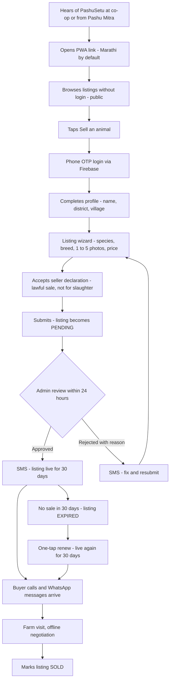
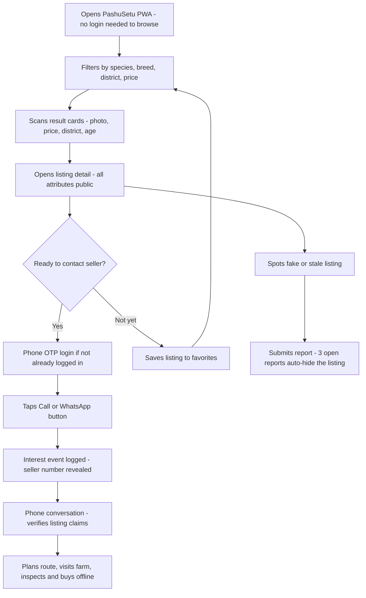

# 03 — Users: Personas, Journeys & Research Plan

| Field | Value |
|---|---|
| **Status** | Draft |
| **Version** | 1.0 |
| **Owner** | Founder (Abhishek) |
| **Last updated** | 2026-07-04 |
| **Depends on** | [../00-foundation/README.md](../00-foundation/README.md) · [../02-research/README.md](../02-research/README.md) |

**Consumed by:** [../01-prd/README.md](../01-prd/README.md) (feature prioritization), [../04-business-rules/README.md](../04-business-rules/README.md) (rule justifications), [../06-user-flows/README.md](../06-user-flows/README.md) (screen-level flows), [../10-frontend-design-requirements/README.md](../10-frontend-design-requirements/README.md) (design directives in §5).

**Purpose of this document.** This is the single reference for *who* PashuSetu is built for, *how they behave today*, *how they will behave with the product*, and *how we verify our assumptions in the field*. Every feature decision in the PRD and every design decision in doc 10 must trace back to a persona or a validated pain point in this document. Business rules are cited by their `BR-xx` ids as defined in [../04-business-rules/README.md](../04-business-rules/README.md).

---

## 1. Personas

### 1.1 Persona set overview

| Id | Name | Role | Priority | MVP user? | `users` role flags |
|---|---|---|---|---|---|
| P1 | Ramesh | Smallholder farmer-seller | **Primary seller** | Yes | `is_farmer=true`, `is_buyer=false` |
| P2 | Mahesh | Bulk livestock trader | **Primary buyer** | Yes | `is_buyer=true` (often also `is_farmer=true`) |
| P3 | Anjali | Dairy farm owner | Buyer (high-value) | Yes | `is_buyer=true` |
| P4 | Sunita | First-time smartphone user, woman farmer | **Design-stress persona** (seller) | Yes | `is_farmer=true` |
| P5 | Vikram | Admin / moderator | Internal | Yes | `is_admin=true` |
| P6 | Dr. Patil | Veterinarian | **FUTURE — Phase 3** | **No** | — (extension point only) |

Design rule: **if a screen works for P4 (Sunita), it works for everyone.** P4 is the stress-test lens applied to every wireframe in [../10-frontend-design-requirements/README.md](../10-frontend-design-requirements/README.md).

---

### 1.2 P1 — Ramesh · Smallholder farmer-seller (Primary seller)

| Attribute | Detail |
|---|---|
| **Demographics** | Male, 45. Village near Koregaon taluka, **Satara** district. Education: 8th standard (Marathi medium). Household of 5. Mixed income: 2 acres sugarcane + dairy from **3 cows** (1 HF-cross, 2 local). Sells milk to the village co-op collection center daily. Sells one animal roughly once a year — when cash is needed (school fees, sowing season) or a cow's yield drops. |
| **Device** | Entry-level Android bought 2 years ago for about ₹7,500 (Redmi/Realme A-class). 3 GB RAM, 32 GB storage — chronically full of WhatsApp forwards. Battery weak; phone often charged at the co-op center. |
| **Connectivity** | Jio ₹239 / 28-day pack, 1.5 GB/day. Solid 4G near the village square; drops to 3G/EDGE in the cattle shed and fields. Data usually exhausted by evening. |
| **Digital literacy** | Moderate-low. Fluent with calls, WhatsApp (voice notes > typing), YouTube (farming videos, bhajans). Struggles with multi-field forms, app installs, and passwords. Types Marathi slowly with the Google Indic keyboard; prefers speaking. |
| **Language** | Marathi only — speaks, reads and writes Marathi comfortably; recognizes English digits and a handful of English words (OK, Call, WhatsApp). |

**Goals**
1. Sell one cow within 2–3 weeks at a price he believes is fair (his mental anchor: what the co-op secretary says animals fetch).
2. Reach buyers beyond his village and taluka without traveling.
3. Avoid the local dalal's cut (typically ₹2,000–5,000 or a 5–8% price squeeze).
4. Look credible: show his animal's milk yield and health honestly and be believed.

**Top 5 pain points**
| # | Pain point |
|---|---|
| 1 | Only 1–2 local traders ever make an offer; they know he has no alternative and lowball him. |
| 2 | No reliable price discovery — he hears third-hand rates and never knows if he sold cheap. |
| 3 | Taking an animal to the weekly bazar costs a tempo hire (₹800–1,500) plus a full lost workday, with no guaranteed sale. |
| 4 | No credible way to prove milk yield / pregnancy / vaccination — buyers discount everything he claims. |
| 5 | Word-of-mouth reach is capped at his village; WhatsApp group posts scroll away in hours. |

**Motivations:** cash on his own timeline, pride in his animals, being treated as a seller with options rather than a supplicant, zero platform fees (MVP is free per foundation principle 6).

**Fears / objections about selling online**
- "Free today, fees tomorrow" — suspects hidden charges will appear.
- His phone number visible to strangers → spam and scam calls. (Mitigated by **BR-10** contact gating: number revealed only to logged-in buyers via the interest endpoint, every reveal logged.)
- A listing advertises his assets to the whole taluka — jealousy, theft, gossip.
- Buyers with slaughter intent — illegal under state law and against his beliefs. (Mitigated by the mandatory seller declaration, **BR-12**, and moderation, **BR-05**.)
- Photos "not good enough" — his shed is dark, his phone camera is average.

**Quote (Marathi + gloss)**
> «दलालाला विकलं की भाव तोच ठरवतो. माझ्याकडे चार खरेदीदार असले, तर भाव मी ठरवीन.»
> *"When I sell to the middleman, he sets the price. If I had four buyers, I would set the price."*

**Jobs-to-be-Done**
> When I need cash and decide to sell a cow, I want several genuine buyers to see my animal without me leaving the village, so I can sell at a fair price on my own timeline instead of taking whatever the local trader offers.

**Product notes:** Ramesh will never hit the 10-active-listings cap (**BR-02**). He needs the one-tap renew (**BR-03**) because his animal may take more than 30 days to sell. SMS notifications (approve/reject/interest) matter more to him than in-app ones — he may not reopen the PWA daily.

---

### 1.3 P2 — Mahesh · Bulk livestock trader (Primary buyer)

| Attribute | Detail |
|---|---|
| **Demographics** | Male, 38. Based in **Sangli**, operates across Sangli–Satara–Kolhapur–Solapur–Pune. Education: 10th standard. Full-time trader: buys milch cows and buffaloes from farmers, resells to dairy farms and other traders. Target volume: **~10 cows/month**. Owns a pickup (Bolero) and hires transport for larger lots. |
| **Device** | Mid-range Android (~₹15,000, Samsung M-series class), 6 GB RAM. Dual SIM: Jio (data) + Vi (calls). Phone is his office. |
| **Connectivity** | 2 GB/day pack, hotspots between towns; comfortable on 4G most of the day, patchy on rural stretches. |
| **Digital literacy** | High functional. Power user of 20+ WhatsApp trading groups, Facebook groups, OLX and livestock apps. Types Marathi and Roman-script Marathi ("Hinglish/Minglish") fast. Uses UPI, Google Maps, truck-booking apps. |
| **Language** | Marathi primary; functional Hindi (cross-border trades); reads basic English UI. |

**Goals**
1. Fill his monthly quota (~10 animals) with the fewest wasted trips.
2. Search inventory by district, species, breed, price and milk yield **before** getting in the vehicle.
3. Know a listing is *current* — not sold three weeks ago.
4. Build a shortlist (favorites) and burn through it by phone in one evening.

**Top 5 pain points**
| # | Pain point |
|---|---|
| 1 | No central searchable inventory — leads are scattered across dozens of WhatsApp groups with no filters. |
| 2 | Stale posts: he calls and hears "already sold" on half his leads. |
| 3 | Fake or wrong info — recycled photos, inflated milk-yield claims, wrong lactation number. |
| 4 | Dead-end travel: a wasted village visit costs ₹500–1,500 in fuel plus half a day. |
| 5 | No cross-district price comparison — he can't tell if Solapur is cheaper than Satara this month. |

**Motivations:** volume and speed; fuel saved is margin earned; being first to call on a fresh listing; a reputation for fair, fast deals.

**Fears / objections**
- Platform flooded with junk/duplicate listings (mitigated by moderation **BR-05**, duplicate warning **BR-07**, report auto-hide **BR-06**).
- Sellers unreachable after he commits time to a lead.
- His buying patterns visible to rival traders.
- Daily caps feel like friction — he must be able to contact many sellers per day (interest limit is 20/day per **BR-09**; sized so a legitimate trader is not blocked, documented in doc 04).

**Quote (Marathi + gloss)**
> «मला रोज शंभर जाहिराती नकोत — खऱ्या दहा पाहिजेत. फोन केल्यावर 'विकली गेली' ऐकून कंटाळा आलाय.»
> *"I don't need a hundred listings a day — I need ten genuine ones. I'm tired of calling and hearing 'already sold'."*

**Jobs-to-be-Done**
> When I plan my weekly buying route, I want to filter live, verified listings by district, breed and price and contact sellers instantly, so I can fill my monthly quota with fewer wasted trips and better margins.

**Product notes:** Mahesh is the heaviest user of `GET /api/v1/listings` filters, favorites, and the interest endpoint. Freshness features built for him: 30-day expiry (**BR-03**), seller "mark sold" flow, and moderation that removes junk. He is also the most likely reporter of fake listings (`POST /api/v1/listings/{id}/report`).

---

### 1.4 P3 — Anjali · Dairy farm owner (high-value buyer)

| Attribute | Detail |
|---|---|
| **Demographics** | Female, 34. Runs a 25-animal dairy farm near Rahuri, **Ahilyanagar (Ahmednagar)** district, supplying a private dairy and the co-op. B.Sc. Agriculture. Second-generation farm owner; manages 3 workers. Buys 1–2 high-yield animals per quarter (budget ₹60,000–1,20,000 per animal). |
| **Device** | ₹25,000 Android + a laptop in the farm office. |
| **Connectivity** | 4G + broadband at the office; effectively always online. |
| **Digital literacy** | High. Uses UPI, email, YouTube agri channels, government portals for subsidy applications, spreadsheets for milk records. |
| **Language** | Marathi primary in daily life; fully comfortable with English UI. Will still prefer Marathi breed/attribute labels because farm staff share her phone screen. |

**Goals**
1. Source HF / Jersey cows and Murrah buffaloes with **15+ litres/day**, 2nd–3rd lactation, vaccinated, ideally pregnant.
2. Verify claims *before* traveling: milk yield, lactation number, pregnancy, vaccination.
3. Protect her herd — never introduce a diseased animal.
4. Buy without a broker's 2–5% cut.

**Top 5 pain points**
| # | Pain point |
|---|---|
| 1 | Verifying claimed milk yield — sellers routinely quote peak yield as average. |
| 2 | Unknown health and vaccination history; no documents offline. |
| 3 | Brokers charge 2–5% and still misrepresent animals. |
| 4 | Thin local supply of genuinely high-yield animals; she needs cross-district reach. |
| 5 | Structured data (lactation number, pregnancy month) simply doesn't exist in offline word-of-mouth deals. |

**Motivations:** herd productivity and genetics; predictable sourcing pipeline; data-driven decisions; time saved for farm operations.

**Fears / objections**
- Disease transmission into a healthy herd (deal-breaker fear).
- Misstated lactation number — an old animal sold as young.
- Wasting a day driving to see an animal that doesn't match the listing.
- As a woman calling unknown sellers, occasional condescension — she prefers WhatsApp first, call second.

**Quote (Marathi + gloss)**
> «गाय दूध किती देते हे विक्रेता सांगेल ते नाही — भेटीत मोजून दिसेल ते खरं. पण निदान जाहिरातीत वेत, लसीकरण, गाभण आहे का हे लिहिलेलं पाहिजे.»
> *"The real milk yield is not what the seller claims — it's what I measure at the visit. But at minimum the listing must state lactation number, vaccination, and whether she is pregnant."*

**Jobs-to-be-Done**
> When I need to add a high-yield animal to my herd, I want listings with structured, honest data on yield, lactation, pregnancy and vaccination that I can filter across districts, so I can shortlist confidently and only travel for animals worth inspecting.

**Product notes:** Anjali justifies the structured listing attributes `milk_yield_lpd`, `lactation_number`, `is_pregnant`, `is_vaccinated` on the `listings` entity — they are not optional decoration; they are her filter criteria and doc 01's justification for those PRD fields. In MVP she verifies claims via WhatsApp conversation and farm visit; document upload / vet certification is a **Phase 2/3 extension point** (see P6), not built now.

---

### 1.5 P4 — Sunita · First-time smartphone user, woman farmer (design-stress persona)

| Attribute | Detail |
|---|---|
| **Demographics** | Female, 52, widow. Village in Tuljapur taluka, **Dharashiv (Osmanabad)** district, Marathwada. Keeps **4 Osmanabadi goats + 1 buffalo**; income from goat sales (festival season peaks) and 3–4 litres of buffalo milk daily. Schooling to 4th standard; reads Marathi slowly, letter by letter; cannot read English at all. |
| **Device** | Hand-me-down Android from her son (4 years old, cracked screen, 2 GB RAM, Android 9, 16 GB storage nearly full). No case; battery drains fast. |
| **Connectivity** | ₹155 recharge (1 GB/day) when she can afford it; village has patchy 3G, reliable signal only near the temple and the bus stop. |
| **Digital literacy** | Very low. Can answer calls, tap the WhatsApp video-call icon when her son calls, watch YouTube bhajans her grandson queues up. **Cannot type.** Navigates purely by icon shape, color and position. Believes pressing the wrong button can "cut money" from the mobile balance. Never installed an app herself. |
| **Language** | Marathi (spoken fluently; reads slowly). Voice is her primary interface. |

**Goals**
1. Sell 2 goats before the festival demand peak (Bakri Eid / Dasara) at the good seasonal price.
2. Negotiate herself instead of depending on her brother-in-law, who "handles" deals and keeps a cut.
3. Not be quoted less because she is a woman selling alone.
4. Do all of it without traveling — she has no transport to the taluka bazar.

**Top 5 pain points**
| # | Pain point |
|---|---|
| 1 | Cannot read long text or fill forms — any typing requirement is a hard wall. |
| 2 | Traders quote women lower prices; she has no counter-offers to point to. |
| 3 | No transport to the weekly bazar; deals happen only when a trader wanders to her village. |
| 4 | Terrified of being cheated by unknown callers (has heard OTP-fraud stories on the news). |
| 5 | Fear of the phone itself: wrong tap = lost money / broken phone / deleted photos. |

**Motivations:** independence and dignity; festival-season cash; keeping the whole sale amount instead of sharing it; her grandson (14) can help her once, but she wants to manage repeats alone.

**Fears / objections**
- Sharing photos of her home/shed with strangers.
- Strange men calling at night once her number is out (**BR-10** logging + reveal-only-after-login is a real safety feature for her, and must be *explained* to her in one Marathi sentence).
- Anything that looks like it might charge money.
- Buttons or messages in English — instant abandonment.

**Quote (Marathi + gloss)**
> «मला वाचता कमी येतं, पण फोटो आणि आवाज समजतो. चुकीचं बटण दाबलं तर पैसे कापले जातील का — एवढीच भीती.»
> *"I can't read much, but I understand pictures and voice. My only fear is — will money get cut if I press the wrong button?"*

**Jobs-to-be-Done**
> When festival season approaches and I must sell my goats, I want to show them to real buyers using only photos, voice and simple taps, so I can get the market price myself without depending on relatives or traders who undercut me.

**Product notes:** Sunita is the reason for every directive in §5. Her first listing will be an **assisted flow** (grandson or a Pashu Mitra volunteer helps once); the product must make her *second* listing possible alone. The auto-saved `DRAFT` status (state machine, doc 04) exists so a half-finished, interrupted listing is never lost.

---

### 1.6 P5 — Vikram · Admin / moderator (internal user)

| Attribute | Detail |
|---|---|
| **Demographics** | Male, 27, Pune. Part-time operations hire (agri-graduate with BPO experience); works alongside the founder, who moderates personally in month 1. Target workload at month 3: ~50–100 pending listings/day. |
| **Device** | Laptop (Chrome) as primary; checks the queue on his phone during evenings. Admin panel must be responsive but is desktop-first. |
| **Connectivity** | Urban broadband + 4G; not a constraint. |
| **Digital literacy** | High; comfortable with dashboards, keyboard shortcuts, spreadsheets. |
| **Language** | Marathi native (needed — he reads every listing description), fluent English (admin UI is English-first with Marathi content displayed as-is). |

**Goals**
1. Clear the PENDING queue inside the **24-hour SLA** (**BR-05**) every single day.
2. Catch fraud, recycled photos, slaughter-intent language, and duplicates before they go public.
3. Give sellers rejection reasons that actually help them fix and resubmit (REJECTED → PENDING loop, doc 04 state machine).
4. Handle reports fast; keep the auto-hide (≥3 open reports → PENDING, **BR-06**) queue at zero.
5. Leave a clean audit trail (`moderation_log`) for every action.

**Top 5 pain points**
| # | Pain point |
|---|---|
| 1 | Blurry / irrelevant / stock photos that are hard to judge quickly. |
| 2 | Duplicate listings from the same seller — needs the duplicate warning (**BR-07**: same seller + species + price within 10% within 7 days) surfaced inline. |
| 3 | Judging slaughter-intent from coded language — needs the declaration flag (**BR-12**) and a one-click reject with a canned reason. |
| 4 | Repeat offenders — needs seller history (prior rejections, reports, listings) on the same review screen before deciding ban (**BR-08**). |
| 5 | Context switching — approving, rejecting, resolving reports and banning must live in one panel, not four tabs. |

**Motivations:** queue-zero satisfaction; measurable quality (low post-approval report rate); protecting the platform's core promise of trust.

**Fears / objections:** wrongly rejecting an honest farmer's listing (every rejection needs a mandatory reason — state machine rule); being the bottleneck that breaks the 24h SLA; approving something that later becomes a legal problem (doc 16 guardrails).

**Quote (Marathi + gloss)**
> «एक बनावट जाहिरात शंभर खऱ्या जाहिरातींचा विश्वास घालवते.»
> *"One fake listing destroys the trust built by a hundred genuine ones."*

**Jobs-to-be-Done**
> When new listings and reports arrive, I want one screen with the listing, its photos, the seller's history and duplicate warnings, so I can make correct approve/reject/ban decisions in under two minutes per listing and keep the queue inside the 24-hour SLA.

**Product notes:** Vikram's workflow defines the admin API surface: `GET /api/v1/admin/listings?status=`, `POST /api/v1/admin/listings/{id}/approve`, `POST /api/v1/admin/listings/{id}/reject`, `GET /api/v1/admin/reports?status=`, resolve/dismiss, ban/unban, `GET /api/v1/admin/audit-log`, `GET /api/v1/admin/stats` (full contracts in [../08-api/README.md](../08-api/README.md)).

---

### 1.7 P6 — Dr. Patil · Veterinarian — **FUTURE, Phase 3 (NOT an MVP user)**

> ⚠️ **Status: FUTURE persona.** No MVP feature is built for this persona. Included because (a) vets are a key *research and distribution channel* in §4, and (b) the schema keeps extension points (per foundation doc §6 "Verified seller" and out-of-scope list). Do not design UI or API for P6 in Phase 1.

| Attribute | Detail |
|---|---|
| **Demographics** | Male, 41. Government-empaneled veterinary officer running a private practice in a taluka town, **Kolhapur** district. Sees 20–30 animals/day; farmers trust him more than any institution. |
| **Device / connectivity** | Mid-range Android, reliable 4G in town; comfortable digitally. |
| **Digital literacy** | High for his needs — WhatsApp, government portals (INAPH), UPI. |
| **Language** | Marathi + English (medical terms). |

**Goals (Phase 3):** issue digital vaccination/health records that attach to listings; receive service leads (pregnancy checks, pre-purchase inspections); build his practice's reach.

**Top 5 pain points (Phase 3 context):** paper vaccination cards get lost; buyers call him informally to "verify" animals with no compensation; no structured pre-purchase inspection market; farmers under-vaccinate because records don't affect price; no channel to reach farmers beyond his taluka.

**Motivations:** professional reputation, incremental income from inspections, better animal health outcomes.

**Fears / objections:** liability for certifying an animal that later falls sick; being spammed with free verification requests; platform bypassing his fee.

**Quote (Marathi + gloss)**
> «लसीकरणाचं कार्ड हरवतं. रेकॉर्ड फोनमध्ये असलं तर जनावराची किंमतही वाढते.»
> *"Vaccination cards get lost. If the record lives in the phone, the animal's price goes up too."*

**Jobs-to-be-Done (Phase 3)**
> When a farmer I treat wants to sell, I want the animal's verified health record to travel with the listing, so honest farmers earn more and buyers stop gambling on health.

**MVP touchpoint (only this):** vet clinics are a recruitment channel in §4.2 and a trusted referral source in go-to-market. The `is_vaccinated` boolean on `listings` is self-declared in MVP; Phase 3 may upgrade it to vet-attested.

---

## 2. Journey maps

Conventions: journeys use the canonical listing state machine (doc 04) and the canonical API paths (doc 08). "Touchpoint" names the screen or endpoint involved.

### 2.1 Farmer-seller — CURRENT offline journey (mandi / middleman)

| Stage | Actions | Thoughts | Pain or gain | Product touchpoint |
|---|---|---|---|---|
| 1. Trigger | Cash need arises (fees, sowing, fodder cost) or yield drops; decides to sell one animal | "मला या महिन्यात पैसे लागतील." *(I need money this month.)* | Pain: forced timing weakens his negotiating position | — (opportunity: list early, sell on his own clock) |
| 2. Find a buyer | Tells co-op secretary, neighbors; posts a photo in 1–2 WhatsApp groups; waits for the dalal to hear | "कोणी विचारेल का?" *(Will anyone even ask?)* | Pain: reach capped at village; WhatsApp post buried in hours | — (opportunity: district-wide reach via public search) |
| 3. Trader visit | Local trader inspects, points out every flaw, quotes low | "हा भाव पाडतोय, पण दुसरं कोण आहे?" *(He's pushing the price down, but who else is there?)* | Pain: monopsony; 5–8% squeeze or ₹2–5k commission | — (opportunity: multiple inquiries = leverage) |
| 4. Mandi fallback | If trader deal fails: hires tempo (₹800–1,500), full day at weekly bazar | "आज विकली नाही तर परत न्यावी लागेल." *(If it doesn't sell today, I haul it back.)* | Pain: cost + lost day, no guaranteed sale, distress-sale pressure by 4 pm | — (opportunity: sell from home) |
| 5. Sale & payment | Cash handoff, no paperwork, no record | "मिळालं ते खरं." *(What I got is what's real.)* | Mixed: deal done, but no proof of market rate for next time | — (opportunity: price transparency across listings) |
| 6. After | No record, no learning; next sale starts from zero | "पुढच्या वेळीही असंच." *(Next time, same story.)* | Pain: zero accumulated advantage | — (opportunity: profile + listing history) |

### 2.2 Farmer-seller — FUTURE PashuSetu journey

| Stage | Actions | Thoughts | Pain or gain | Product touchpoint |
|---|---|---|---|---|
| 1. Discover | Hears about PashuSetu at the co-op / from a Pashu Mitra / WhatsApp share; opens the PWA link | "फुकट आहे म्हणे, बघू तरी." *(They say it's free — let me look.)* | Gain: zero-install entry; Marathi from the first pixel (D8, D9) | PWA landing, public browse (`GET /api/v1/listings`) |
| 2. Sign up | Taps "जनावर विका" *(Sell an animal)* → phone OTP → name, district, village | "OTP म्हणजे बँकेसारखं — ठीक आहे." *(OTP like the bank — okay.)* | Gain: no passwords, no Aadhaar (D3) | Firebase OTP; `POST /api/v1/users` |
| 3. Create listing | Wizard: species → breed → photos (1–5, **BR-01**) → age, yield, price → declaration (**BR-12**) → submit | "फोटो चांगला आला पाहिजे." *(The photo must come out well.)* | Gain: voice input + pickers, auto-saved DRAFT; Pain: photo quality anxiety (see §5, directive 2/3) | Listing wizard; `POST /api/v1/listings`, `POST /api/v1/uploads/presign`, `POST /api/v1/listings/{id}/submit` |
| 4. Moderation wait | Listing is PENDING; he waits, gets SMS on decision within 24h (**BR-05**) | "तपासतात म्हणजे नीट काम दिसतंय." *(They check things — seems like a proper operation.)* | Gain: trust signal; Pain if rejected — reason must be actionable | SMS/in-app notification; REJECTED → edit → resubmit loop |
| 5. Live & inquiries | APPROVED, live 30 days; buyers call / WhatsApp; each contact is logged (**BR-10**) | "साताऱ्याबाहेरूनही फोन आला!" *(A call from outside Satara!)* | Gain: multiple buyers = leverage; his number only reaches logged-in buyers | Listing detail (public); `POST /api/v1/listings/{id}/interest` |
| 6. Negotiate & sell | Buyer visits farm, inspects, negotiates; deal closes offline in cash/UPI | "आता भाव मी सांगतोय." *(Now I'm the one quoting the price.)* | Gain: deal on his turf; platform takes nothing | Off-platform (by design, D6) |
| 7. Close or renew | Marks SOLD; or if unsold at 30 days it EXPIREs and he one-tap renews (**BR-03**) | "एक बटण — परत चालू." *(One button — live again.)* | Gain: no re-entry, no re-moderation if unedited | `POST /api/v1/listings/{id}/mark-sold` · `POST /api/v1/listings/{id}/renew` |

### 2.3 Buyer-trader — CURRENT offline journey

| Stage | Actions | Thoughts | Pain or gain | Product touchpoint |
|---|---|---|---|---|
| 1. Source leads | Scrolls 20+ WhatsApp groups nightly; calls brokers and old contacts | "आजच्या पन्नास मेसेजमध्ये खरं किती?" *(Of today's fifty messages, how many are real?)* | Pain: no search, no filters, no freshness signal | — (opportunity: filtered live inventory) |
| 2. Qualify by phone | Calls sellers; half the leads already sold or misdescribed | "परत 'विकली गेली'." *(Again — "already sold".)* | Pain: ~50% dead leads; hours lost nightly | — (opportunity: expiry + mark-sold keeps inventory live) |
| 3. Travel & inspect | Drives village to village; inspects animals that often don't match claims | "डिझेल जळतंय, जनावर फोटोसारखं नाही." *(Diesel burns, the animal isn't like the photo.)* | Pain: ₹500–1,500 + half a day per dead-end trip | — (opportunity: structured attributes + moderated photos) |
| 4. Negotiate & buy | Haggles; buys 1 of every 3–4 inspected | "चांगलं जनावर मिळालं की सगळं वसूल." *(One good animal recovers it all.)* | Gain: his skill; Pain: low hit-rate | — |
| 5. Transport & resell | Arranges transport; resells to dairies/traders | — | Out of platform scope (foundation: transport OUT of MVP) | — |

### 2.4 Buyer-trader — FUTURE PashuSetu journey

| Stage | Actions | Thoughts | Pain or gain | Product touchpoint |
|---|---|---|---|---|
| 1. Search | Opens PWA (no login needed, **BR-10**); filters species=COW, district, price band, sorts newest | "एका स्क्रीनवर चार जिल्हे." *(Four districts on one screen.)* | Gain: minutes instead of nightly WhatsApp trawling | `GET /api/v1/listings?species=&districtId=&minPrice=&maxPrice=&sort=&cursor=` (cursor pagination, 20/page) |
| 2. Scan & shortlist | Scans cards (photo, price, district, age); opens details; saves promising ones to favorites (login prompt on first save) | "हे तीन बघण्यासारखे." *(These three are worth seeing.)* | Gain: structured attributes = pre-qualification from his sofa | Listing detail; `POST /api/v1/users/me/favorites` |
| 3. Contact | Taps Call / WhatsApp on shortlisted listings; number revealed, interest event logged | "आत्ताच फोन लावतो." *(Calling right now.)* | Gain: instant contact; freshness high because sold/expired listings drop out (**BR-03**) | `POST /api/v1/listings/{id}/interest` with `type` CALL or WHATSAPP |
| 4. Verify by phone | Asks yield/lactation/pregnancy questions against the listing's stated data | "जाहिरातीत लिहिलंय तेच सांगतोय — बरं लक्षण." *(He's saying what the listing says — good sign.)* | Gain: listing data anchors the conversation, lies surface early | Listing attributes from doc 07 schema |
| 5. Visit & buy | Plans one route for 3–4 visits; inspects, negotiates, buys offline | "एका फेरीत तीन जनावरं." *(Three animals in one round.)* | Gain: hit-rate up, diesel down | Off-platform (D6) |
| 6. Feedback loop | Reports fake/sold-but-live listings when he hits one | "खोटी जाहिरात — रिपोर्ट." *(Fake listing — report.)* | Gain: platform quality compounds for him (**BR-06**) | `POST /api/v1/listings/{id}/report` |

---

## 3. Interview templates

Rules of use: conduct in Marathi; read questions conversationally, do not hand over the form; record audio only with consent (§4.3); one interviewer + one note-taker where possible; 20–30 minutes per session; always end by asking for referrals (snowball sampling). Questions are open-ended by design — probe with "अजून सांगा" *(tell me more)*.

### 3.1 Farmer / seller template — 15 questions

**Theme A — Current selling practice**

| # | Marathi | English gloss |
|---|---|---|
| F1 | तुमच्याकडे कोणती जनावरं आहेत आणि किती? | What animals do you keep, and how many? |
| F2 | मागच्या वेळी तुम्ही जनावर कसं विकलं — कोणाला, कुठे, किती दिवसांत? | How did you sell an animal last time — to whom, where, and how long did it take? |
| F3 | जनावर विकताना सगळ्यात जास्त त्रास कशाचा होतो? | What is the single biggest difficulty when selling an animal? |
| F4 | आठवडी बाजारात जनावर न्यायला किती खर्च आणि किती वेळ जातो? | How much money and time does taking an animal to the weekly bazar cost you? |

**Theme B — Pricing & trust**

| # | Marathi | English gloss |
|---|---|---|
| F5 | जनावराची योग्य किंमत कशी ठरवता? भाव कुठून कळतो? | How do you decide the right price? Where do you learn current rates? |
| F6 | व्यापारी किंवा दलाल किती कमिशन घेतो, किंवा भावात किती फरक पाडतो? | How much commission does the trader/middleman take, or how much does he move the price? |
| F7 | अनोळखी खरेदीदारावर विश्वास ठेवण्यासाठी तुम्हाला काय पाहिजे? | What would you need in order to trust an unknown buyer? |

**Theme C — Phone & internet usage**

| # | Marathi | English gloss |
|---|---|---|
| F8 | तुमच्याकडे कोणता फोन आहे? रिचार्ज किती रुपयांचा आणि किती दिवसांचा करता? | What phone do you have? What recharge amount and validity do you buy? |
| F9 | फोनवर रोज काय वापरता — फोन कॉल, WhatsApp, YouTube, आणखी काही? | What do you use daily — calls, WhatsApp, YouTube, anything else? |
| F10 | फोनवर मराठीत टाइप करता येतं का, की बोलून काम भागवता? | Can you type in Marathi on the phone, or do you manage with voice? |

**Theme D — Feature reactions** *(show a paper mock of a listing card while asking)*

| # | Marathi | English gloss |
|---|---|---|
| F11 | जनावराचे फोटो काढून मोबाईलवरून जाहिरात टाकाल का? त्यात काय अवघड वाटेल? | Would you photograph your animal and post a listing from your phone? What would feel hard? |
| F12 | जाहिरात टाकल्यावर अनोळखी लोकांचे फोन आले तर चालेल का? कोणाला नंबर मिळावा असं वाटतं? | Are calls from unknown people acceptable after listing? Who should get your number? |
| F13 | जाहिरात सगळ्यांना दिसण्याआधी आमची टीम ती तपासते — हे योग्य वाटतं का? एक दिवस थांबावं लागलं तर? | Our team checks every listing before it goes public — does that feel right? What if you must wait a day? |

**Theme E — Willingness & adoption**

| # | Marathi | English gloss |
|---|---|---|
| F14 | असं ॲप पूर्ण मोफत असेल तर वापराल का? पहिल्यांदा वापरताना कोणाची मदत घ्याल? | If such an app is completely free, would you use it? Whose help would you take the first time? |
| F15 | तुमच्या गावात अजून कोण असं ॲप वापरेल? आम्ही त्यांच्याशी बोलू शकतो का? | Who else in your village would use it? May we speak with them? |

### 3.2 Buyer / trader template — 12 questions

**Theme A — Current buying practice**

| # | Marathi | English gloss |
|---|---|---|
| B1 | महिन्याला साधारण किती जनावरं खरेदी करता? कोणत्या प्रकारची? | Roughly how many animals do you buy per month? What kinds? |
| B2 | जनावरं शोधण्यासाठी आत्ता काय करता — बाजार, WhatsApp ग्रुप, ओळखी, ॲप? | How do you find animals today — bazars, WhatsApp groups, contacts, apps? |
| B3 | एक जनावर खरेदी होईपर्यंत सरासरी किती गावं फिरावी लागतात आणि किती खर्च येतो? | On average, how many villages do you travel and what does it cost before one purchase closes? |

**Theme B — Pricing & trust**

| # | Marathi | English gloss |
|---|---|---|
| B4 | किंमत ठरवताना कोणत्या गोष्टी बघता — जात, वय, दूध, वेत, गाभण? | What factors set the price — breed, age, milk, lactation, pregnancy? |
| B5 | विक्रेता सांगतो त्या माहितीवर किती विश्वास ठेवता? सहसा काय खोटं सांगितलं जातं? | How much do you trust seller-stated info? What typically gets misstated? |
| B6 | फसवणूक टाळण्यासाठी तुम्ही काय करता? | What do you do to avoid being cheated? |

**Theme C — Phone usage**

| # | Marathi | English gloss |
|---|---|---|
| B7 | आत्ता कोणते ॲप किंवा ग्रुप वापरता — OLX, Facebook, WhatsApp ग्रुप, दुसरं ॲप? त्यात काय अडचणी आहेत? | Which apps or groups do you use now — OLX, Facebook, WhatsApp groups, other apps? What are their problems? |
| B8 | फोनवर जिल्हा, जात आणि किंमतीनुसार जनावरं गाळून बघता आली तर तुमचं काम किती बदलेल? | If you could filter animals by district, breed and price on your phone, how much would your work change? |

**Theme D — Feature reactions** *(show the same paper mock)*

| # | Marathi | English gloss |
|---|---|---|
| B9 | जाहिरातीत कोणती माहिती नक्की पाहिजे — फोटो, दूध, वेत, लसीकरण, गाभण, वजन? | What information is a must in a listing — photos, milk yield, lactation, vaccination, pregnancy, weight? |
| B10 | विक्रेत्याचा नंबर मिळण्याआधी एकदा OTP ने लॉगिन करावं लागेल — चालेल का? | You'd log in once via OTP before getting a seller's number — acceptable? |

**Theme E — Willingness**

| # | Marathi | English gloss |
|---|---|---|
| B11 | विकलेली जनावरं यादीतून लगेच निघून गेली, तर तुमच्या कामात किती फरक पडेल? | If sold animals disappeared from the list immediately, how much difference would that make to you? |
| B12 | असं ॲप रोज वापराल का? आत्ता मोफत आहे — पुढे तुमची काय अपेक्षा राहील? | Would you use such an app daily? It's free now — what would you expect later? |

**Question-to-decision mapping (why each theme exists):** Theme A validates journey maps (§2.1, §2.3); Theme B validates pain points P1-2/P2-3 and pricing attributes; Theme C validates device/connectivity assumptions and §5 directives; Theme D pressure-tests moderation acceptance (**BR-05**), contact gating (**BR-10**), photo rules (**BR-01**); Theme E measures adoption willingness for PRD success metrics (foundation §4) and recruits further participants.

---

## 4. Field research plan

### 4.1 Targets and quotas

Minimum **20 interviews** in the research window (matches Phase 1 success criterion "minimum 20 real user interviews" in [../02-research/README.md](../02-research/README.md)).

| Segment | Count | Quota detail | Maps to persona |
|---|---|---|---|
| Farmers (sellers) | **12** | 4 smallholder cow/buffalo keepers · 3 goat/sheep keepers · 2 women farmers · 2 farmers under 30 · 1 first-time smartphone user (may overlap with women-farmer quota) | P1, P4 |
| Traders (buyers) | **5** | 3 milch-animal traders · 2 goat/sheep traders; at least 2 operating cross-district | P2 |
| Dairy farms / vets | **3** | 2 dairy farm owners or managers · 1 practicing veterinarian | P3, P6 |
| **Total** | **20** | — | — |

**Field clusters (3 districts, chosen for persona coverage + travel feasibility from the founder's base):**
1. **Satara** (Western Maharashtra, home base) — smallholder dairy belt; Lonand weekly cattle bazar.
2. **Sangli** — trader-dense corridor; Islampur area.
3. **Dharashiv (Osmanabad)** (Marathwada) — goat/sheep economy, weaker connectivity, low-literacy stress cases; Tuljapur taluka.

### 4.2 Recruitment channels

| Channel | How | Expected yield |
|---|---|---|
| Krishi Vigyan Kendra (KVK) | Visit KVK Satara & KVK Dharashiv; ask extension officers to introduce 3–4 progressive + 3–4 ordinary farmers | 6–8 farmers |
| Dairy co-op collection centers | Morning milk-pouring hours (6:30–9:00) at 2 village centers per district; secretary introduces sellers | 4–6 farmers, 2 dairy contacts |
| Veterinary clinics / animal husbandry officers | Taluka vet clinic waiting area (with the vet's permission); recruits the vet interview itself | 2–3 farmers + 1 vet |
| Weekly cattle mandis | Lonand (Satara) and one Marathwada mandi on market day; traders are concentrated and idle between deals | 4–5 traders |
| Snowball referrals | Every interview ends with a referral ask (F15 for farmers; standing rule in §3 for all segments) | buffer of 3–5 |

**Incentive policy:** no cash incentives (it biases answers and sets a precedent); offer tea/snacks at mandi interviews and a promise to share the app when it launches. Recorded as the standing policy for all Phase 1 research.

### 4.3 Consent script (read aloud before every interview)

**Marathi:**
> «नमस्कार. मी अभिषेक. आम्ही शेतकऱ्यांसाठी 'पशुसेतू' नावाचं मोबाईल ॲप बनवत आहोत — जनावरांच्या खरेदी-विक्रीसाठी. ते नीट बनावं म्हणून तुमच्याशी १५–२० मिनिटं बोलू इच्छितो. हे काही विकण्यासाठी नाही; फक्त तुमचा अनुभव समजून घ्यायचा आहे. तुमचं नाव कुठेही छापलं जाणार नाही, आणि तुमची माहिती फक्त ॲप बनवण्यासाठी वापरली जाईल. कोणत्याही प्रश्नाचं उत्तर द्यायचं नसेल तर सोडून द्या; कधीही थांबवू शकता. नंतर नीट लिहिता यावं म्हणून बोलणं रेकॉर्ड करू का? तुमची परवानगी आहे का?»

**English gloss:**
> "Hello. I am Abhishek. We are building a mobile app called 'PashuSetu' for farmers — for buying and selling livestock. To build it well, I'd like to talk with you for 15–20 minutes. This is not a sales pitch; I only want to understand your experience. Your name will not be published anywhere, and your answers will be used only to build the app. Skip any question you don't want to answer; you may stop at any time. May I record our conversation so I can take proper notes later? Do I have your permission?"

**Consent rules:** verbal consent is sufficient and is captured at the start of the recording ("परवानगी आहे" on tape). If recording is refused, proceed with written notes only. No Aadhaar, no photos of people without separate explicit permission, no PII beyond first name + taluka in research notes. Raw recordings are deleted after transcription; anonymized transcripts live in `docs/02-research/source/`.

### 4.4 Synthesis method

1. **Transcribe & tag (rolling, same evening):** each interview becomes a one-page structured note (segment, district, device class, data pack, key quotes) filed under `docs/02-research/source/interviews/`.
2. **Affinity mapping:** every discrete observation goes on a card (FigJam board, shared with the designer); cluster into themes (selling friction, pricing, trust, device reality, feature reactions, adoption barriers).
3. **Persona validation:** score each P1–P4 persona attribute as *Confirmed / Adjusted / Contradicted* against the clusters. Contradicted attributes are rewritten and this doc bumps to v1.1.
4. **Top-20 pain point list:** rank clusters by **frequency × severity** (severity 1–3 judged by impact on the sell/buy job). Output ids `PP-01…PP-20`, each with: statement, affected personas, evidence count, and the PRD feature or business rule it validates or challenges. The list is appended to [../02-research/README.md](../02-research/README.md) and cross-linked from [../01-prd/README.md](../01-prd/README.md).
5. **Hypothesis check:** the research explicitly tests the seeded hypotheses below (drawn from personas). Each ends the sprint marked Confirmed / Adjusted / Rejected.

| Id | Seeded hypothesis to validate | Source persona |
|---|---|---|
| H-01 | Sellers' primary pain is lack of buyer reach, not lack of price information | P1 |
| H-02 | Middleman margin/commission is perceived as 5%+ of sale value | P1 |
| H-03 | A 24-hour moderation delay is acceptable if explained as a trust check | P1, P4 |
| H-04 | Voice input is preferred over typing for descriptions by most farmer-sellers | P1, P4 |
| H-05 | Sellers accept unknown-caller contact if reveal requires buyer login | P1, P4 |
| H-06 | Traders' top pain is stale/sold listings, above fake info | P2 |
| H-07 | Traders will tolerate an OTP login before number reveal | P2 |
| H-08 | Milk yield, lactation and pregnancy are the top-3 decision attributes for milch-animal buyers | P2, P3 |
| H-09 | Women sellers report systematically lower quotes than men | P4 |
| H-10 | Most farmer handsets are ≤4 GB RAM Androids on 1–2 GB/day packs | P1, P4 |

### 4.5 Timeline — 2 weeks, parallel to Sprint 1

Sprint 1 runs **Mon 2026-07-06 → Fri 2026-07-17** (see [../15-project-plan/README.md](../15-project-plan/README.md)). Research does not block development setup; it runs in parallel and feeds the PRD before feature build starts.

| Days | Activity | Output |
|---|---|---|
| Jul 06–07 | Recruit via KVK/co-op calls; print paper mocks + consent scripts; pilot 1 interview locally, fix wording | Confirmed schedule of ≥14 interviews |
| Jul 08–10 | Field cluster 1: Satara (co-op mornings, Lonand mandi day) | 7–8 interviews |
| Jul 11–13 | Field cluster 2: Sangli + start Dharashiv travel | 6–7 interviews |
| Jul 14–15 | Field cluster 3: Dharashiv (Tuljapur) — low-literacy quota focus | 5–6 interviews |
| Jul 16 | Affinity mapping + persona validation with designer | Clustered board; persona deltas |
| Jul 17 | Synthesis readout; publish `PP-01…PP-20`; hypothesis verdicts | Research findings in doc 02; PRD change requests filed |

### 4.6 How findings feed back into the PRD

| Finding type | Action | Owner | Where recorded |
|---|---|---|---|
| Copy/label/field-level (e.g. farmers say «वेत» not «दुग्धचक्र») | Direct edit to doc 01 / doc 10 strings; patch version bump (1.0 → 1.0.x) | Founder | Doc changelog |
| Attribute-level (e.g. buyers demand a "weight" filter) | PRD change request; accepted changes bump doc 01 to v1.1 and cascade to docs 04/07/08 | Founder | [../01-prd/README.md](../01-prd/README.md) |
| Scope-level (e.g. demand for a feature that is OUT of MVP) | Logged as an extension point only; MVP scope in [../00-foundation/README.md](../00-foundation/README.md) does **not** change during Phase 1; revisit at Phase 2 planning with an ADR in [../11-architecture/README.md](../11-architecture/README.md) | Founder | ADR + Phase 2 backlog |
| Persona contradiction | This doc updated to v1.1 with a "validated" marker per persona | Founder | This doc §1 |

Deadline: all research-driven PRD changes are merged by **2026-07-20** (start of Sprint 2), so design (doc 10) and schema (doc 07) build on validated inputs.

---

## 5. Accessibility & literacy implications — 10 design directives

Derived from the personas above (P4 is the binding constraint). These are **requirements**, not suggestions, for [../10-frontend-design-requirements/README.md](../10-frontend-design-requirements/README.md); the designer treats each as an acceptance criterion.

| # | Directive | What it means concretely | Driven by |
|---|---|---|---|
| A1 | **Every icon carries a Marathi label** | No icon-only buttons anywhere. Pair pictogram + one or two Marathi words (e.g. 📞 «फोन करा»). English never appears unless language is switched (D8). | P4, P1 |
| A2 | **Minimize typing to near zero** | Species/breed/district via image-chips and pickers; age/price via steppers and preset chips; description via mic dictation (Marathi speech-to-text) with typing as fallback. Only truly free-text field in seller flow: village name and description. | P4, P1 |
| A3 | **One decision per screen in the listing wizard** | Wizard steps: species → breed → photos → details → price → location → declaration → review. Progress dots, big Next button, back never loses data — every step auto-saves the DRAFT (state machine, doc 04), so an interrupted or crashed session resumes where it stopped. | P4 |
| A4 | **3G performance budget** | Critical path ≤ 200 KB compressed on first load; images lazy-loaded WebP variants (**BR-01** server-side WebP); skeleton states, no spinners over 300 ms without explanation. Meets the foundation metric: listing page usable on 3G in <5 s. | P1, P4 |
| A5 | **Large targets, legible Devanagari** | Tap targets ≥ 48×48 px; body Devanagari ≥ 16 px with generous line height (≥1.6); high-contrast text (WCAG AA 4.5:1); no all-caps Latin styling applied to Devanagari. | P4 |
| A6 | **Money shown in digits + words** | Prices render with Indian grouping and a words confirmation at input time: «₹50,000 — पन्नास हजार रुपये». Catches missing/extra-zero errors before submit. `price_inr` stays an integer (API convention). | P1, P4 |
| A7 | **Errors and empty states that instruct, not scold** | Every error = icon + one short Marathi sentence + one recovery button (e.g. photo too large per **BR-01**: «फोटो खूप मोठा आहे. दुसरा फोटो निवडा.» *(Photo is too big. Choose another photo.)*). No error codes shown to end users; codes stay in the API envelope. | P4, P1 |
| A8 | **Trust made visible** | Approved listings carry a «तपासलेली जाहिरात» *(checked listing)* badge; a one-line explainer of moderation on submit («आमची टीम २४ तासांत तपासून जाहिरात चालू करेल» — *our team will check and activate your listing within 24 hours*, **BR-05**); the seller declaration (**BR-12**) is a single plain-Marathi checkbox screen, read-aloud friendly. | P1, P2, P4 |
| A9 | **Contact through familiar channels + privacy explained** | Only Call and WhatsApp buttons, styled to match the native apps users already know (D6, no in-app chat). Sellers see one sentence at listing creation: «तुमचा नंबर फक्त लॉगिन केलेल्या खरेदीदारांनाच दिसेल» *(your number is shown only to logged-in buyers)* — surfacing **BR-10** as a safety feature, which matters most to Sunita. | P1, P2, P4 |
| A10 | **Assisted first use, independent second use** | A ≤60-second Marathi voice-over onboarding video on first launch; every wizard screen readable aloud in one sentence so a helper (grandson, Pashu Mitra) can coach over the shoulder or by phone; language toggle visible but Marathi is always the default (D8); no flow ever requires email, password, or app-store installation (D3, D9). | P4, P1 |

Traceability: A1–A3, A5–A7, A10 map to foundation principle 3 (*Simple Enough for First-Time Smartphone Users*); A4 maps to principle 5 (*Fast on Slow Internet*); A8–A9 map to principle 2 (*Trust Over Speed*) and D6.

---

## Acceptance checklist

- [x] Six personas documented (P1 Ramesh, P2 Mahesh, P3 Anjali, P4 Sunita, P5 Vikram, P6 Dr. Patil), each with demographics, device + connectivity reality, digital literacy, language, goals, top-5 pain points, motivations, fears/objections, a Marathi quote with English gloss, and a JTBD statement
- [x] P6 (veterinarian) clearly marked FUTURE / Phase 3 with no MVP features designed for it
- [x] P4 designated as the design-stress persona and linked to every directive in §5
- [x] Journey maps cover farmer-seller and buyer-trader, each with a CURRENT offline stage table and a FUTURE PashuSetu stage table using the columns stage / actions / thoughts / pain-or-gain / product touchpoint
- [x] One mermaid flowchart per future journey (farmer §2.2, buyer §2.4), both syntactically valid with quoted, parenthesis-free node labels
- [x] Journey touchpoints reference only canonical API paths (`/api/v1/...`) and canonical listing states (DRAFT/PENDING/APPROVED/SOLD/REJECTED/EXPIRED/ARCHIVED)
- [x] Farmer interview template has exactly 15 questions and buyer/trader template exactly 12, all in Devanagari Marathi with English gloss, grouped by the five required themes
- [x] Field research plan specifies ≥20 interviews (12 farmers / 5 traders / 3 dairy-vet), named recruitment channels (KVK, co-ops, vet clinics, mandis), a Marathi + English consent script, a synthesis method (affinity mapping → persona validation → top-20 pain point list), a dated 2-week timeline parallel to Sprint 1, and an explicit PRD feedback mechanism
- [x] Ten concrete accessibility/literacy design directives (A1–A10) documented with persona traceability, feeding ../10-frontend-design-requirements/README.md
- [x] Business rules referenced by BR-xx ids (BR-01, BR-02, BR-03, BR-05, BR-06, BR-07, BR-08, BR-09, BR-10, BR-12) pointing to ../04-business-rules/README.md
- [x] No contradictions with locked decisions D1–D10; no in-app chat, payments, video, or Aadhaar anywhere in MVP-scope content; no "TBD" or open questions remain
