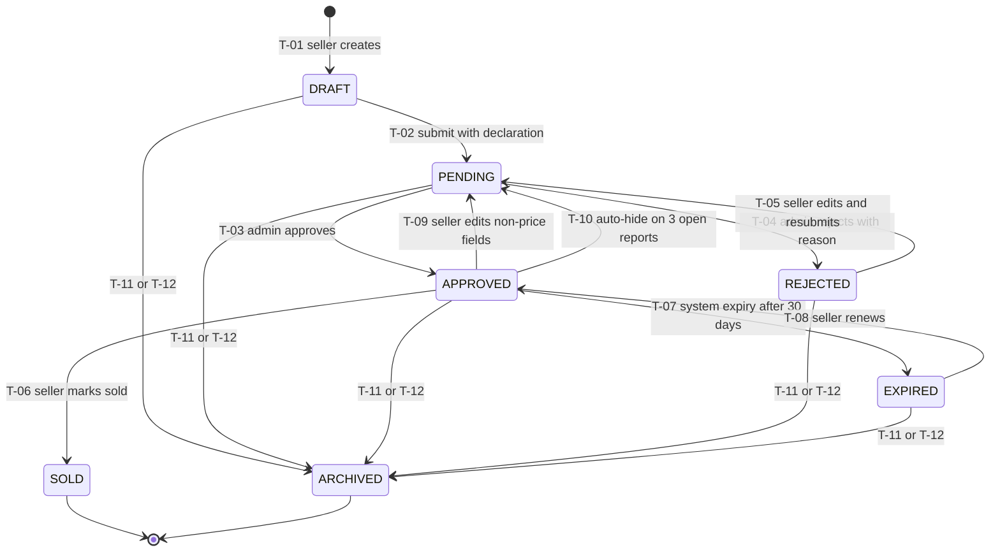
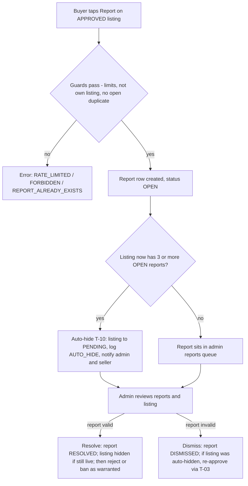

# 04 — Business Rules & Listing State Machine

| Field | Value |
|---|---|
| **Status** | Draft |
| **Version** | 1.0 |
| **Owner** | Founder (Abhishek) |
| **Last updated** | 2026-07-04 |
| **Depends on** | [../00-foundation/README.md](../00-foundation/README.md) · [../01-prd/README.md](../01-prd/README.md) · [../03-users/README.md](../03-users/README.md) |

> **This document OWNS every platform rule.** Each rule has a stable id (`BR-xx`) that all other docs cite — features ([../05-features/README.md](../05-features/README.md)), user flows ([../06-user-flows/README.md](../06-user-flows/README.md)), database ([../07-database/README.md](../07-database/README.md)), API contracts ([../08-api/README.md](../08-api/README.md)), backend ([../09-backend/README.md](../09-backend/README.md)), security ([../12-security/README.md](../12-security/README.md)) and legal ([../16-legal/README.md](../16-legal/README.md)). If a downstream doc contradicts a BR id here, this doc wins. If this doc contradicts [../00-foundation/README.md](../00-foundation/README.md), the foundation doc wins.

**How to read a rule.** Every rule states: the rule itself (normative, MUST/MUST NOT), the enforcement point (client / API / DB / admin / job), and the canonical error code returned when violated (error envelope format per [../08-api/README.md](../08-api/README.md)).

**Key terms used throughout:**

| Term | Definition |
|---|---|
| ACTIVE listing | A listing in any **non-terminal** status: `DRAFT`, `PENDING`, `APPROVED`, `REJECTED`, `EXPIRED`. Counts toward the per-user listing quota (BR-024). |
| Terminal status | `SOLD` and `ARCHIVED`. A listing in a terminal status never returns to the market. |
| Public listing | A listing in status `APPROVED` (the only status visible to anyone other than the seller and admins). |
| Contact action | A logged-in buyer tapping Call, WhatsApp, or "Send Interest" on a listing — always via `POST /api/v1/listings/{id}/interest` (BR-062). |
| Seller | The user referenced by `listings.seller_id`. Any ACTIVE user may be a seller (BR-011). |
| Admin | A user with `is_admin = true` (BR-012). |

---

## 1. Accounts & roles (BR-01x)

### BR-010 — Registration

- Sign-up is **phone OTP only** via Firebase Authentication (locked decision D3). The backend never sends or verifies OTPs; the Firebase client SDK handles the OTP round-trip and its own rate limiting.
- After the first successful Firebase login the client MUST call `POST /api/v1/users` to create the profile row (`firebase_uid`, `phone` in E.164, `name`, `district_id`, optional `taluka`/`village`, `language_pref` defaulting to `MR`).
- One phone number = one account (`users.phone` is unique; `users.firebase_uid` is unique).
- No Aadhaar, no e-mail, no password is ever collected or stored (foundation §8).
- **Enforcement:** API (`POST /users`) + DB unique constraints. Duplicate registration attempt → error code `USER_ALREADY_EXISTS` (idempotent clients should then call `GET /users/me`).

### BR-011 — One account, both roles

- Every account is **both farmer-capable and buyer-capable** (locked decision D3). `is_farmer` and `is_buyer` both default to `true` at registration; they are informational flags for personalization/analytics, **never** permission gates.
- Permissions are derived from exactly two things: authentication state (logged in or not) and `is_admin`. There is no separate "seller approval" step in MVP.
- **Enforcement:** API middleware. No error code — there is nothing to violate; downstream docs MUST NOT design farmer-only/buyer-only gates.

### BR-012 — Admin provisioning

- Admins are provisioned **manually by the Founder** by setting `is_admin = true` directly in the database (Prisma seed script or SQL console). There is **no UI or API** to grant or revoke the admin flag in MVP.
- An admin is a normal user in every other respect (can list, favorite, buy).
- Every admin mutation (approve, reject, ban, unban, resolve, dismiss, auto-hide) is written to `moderation_log` (BR-046).
- Admin endpoints (`/api/v1/admin/*`) require a verified Firebase ID token whose user row has `is_admin = true`; otherwise → `FORBIDDEN` (HTTP 403).
- **Enforcement:** DB (manual) + API middleware.

### BR-013 — Profile completeness

- A profile is **complete** when `name` (2–50 characters) and `district_id` (one of the 36 seeded Maharashtra districts) are set. `taluka` and `village` are optional at signup.
- Browsing (`GET /listings`, `GET /listings/{id}`, `GET /meta/*`) never requires a profile — or even a login (BR-060).
- Every **authenticated write** (create listing, favorite, interest, report) requires a complete profile. Incomplete profile → error code `PROFILE_INCOMPLETE` (HTTP 403); the client redirects to the profile completion screen.
- **Enforcement:** API middleware on all authenticated write routes.

### BR-014 — Bans: criteria, effects, reversal

- Bans are **manual, admin-only** actions via `POST /api/v1/admin/users/{id}/ban` with a mandatory reason. Ban criteria are defined in BR-054.
- Effects of a ban (all applied atomically in one transaction):
  1. `users.status` → `BANNED`.
  2. **All** of the user's ACTIVE listings (`DRAFT`, `PENDING`, `APPROVED`, `REJECTED`, `EXPIRED`) → `ARCHIVED` (state machine transition T-12).
  3. One `moderation_log` entry with `action = BAN`, `user_id`, `admin_id`, `reason`.
  4. SMS notification `NTF-USER-BANNED` to the user (BR-071), including the helpline for appeal (BR-055).
- A banned user's Firebase session is not deleted, but **every API call by a `BANNED` user returns error code `USER_BANNED` (HTTP 403)** — reads and writes alike, except `GET /users/me` (so the app can show the banned screen with the helpline number).
- Unban (`POST /api/v1/admin/users/{id}/unban`) sets `status` → `ACTIVE`, writes `moderation_log` `action = UNBAN`, and sends `NTF-USER-UNBANNED`. **Unban does NOT restore archived listings** — `ARCHIVED` is terminal (BR-032); the user creates fresh listings.
- **Enforcement:** API middleware (status check on every request) + admin endpoints + DB transaction.

### BR-015 — Account deactivation & deletion policy

MVP ships **helpline-mediated deletion with in-place anonymization** (no self-service delete button in MVP UI; a "Delete my account" entry in Settings shows the helpline number and the promise below).

- The user requests deletion via the support helpline (published in the app footer and Settings; grievance-officer details in [../16-legal/README.md](../16-legal/README.md)). Identity is verified by calling back the registered number.
- The admin executes deletion **within 7 days** of the verified request:
  1. Delete the Firebase Auth user (kills future logins).
  2. Anonymize the `users` row in place (kept for foreign-key integrity): `phone` → `deleted:{id}`, `firebase_uid` → `deleted:{id}`, `name` → `हटवलेला वापरकर्ता` ("Deleted user"), `taluka`/`village` → null.
  3. All ACTIVE listings → `ARCHIVED`; listing photos deleted from R2 within 30 days.
  4. Delete the user's `favorites` and `notifications` rows.
  5. **Retain** `interest_events`, `reports`, and `moderation_log` rows referencing the anonymized user (fraud/audit trail; contains no PII after step 2).
  6. One `moderation_log` entry records the deletion-archival: `action = AUTO_HIDE`, `user_id` = the anonymized user, `listing_id` = null, `reason = "account deletion request"`. The canonical action enum has no dedicated deletion value, and `AUTO_HIDE` (system-initiated removal from market) is the closest fit — a deliberate reuse, not a new enum value. [../07-database/README.md](../07-database/README.md) MUST keep `moderation_log.listing_id` nullable for exactly this case; the step-by-step operator procedure lives in the runbook ([../13-deployment/README.md](../13-deployment/README.md)).
- Re-registration with the same phone number afterwards creates a **brand-new** account with zero history.
- There is no temporary "deactivate/pause" state in MVP; sellers who want a pause simply archive their listings.
- **Enforcement:** admin runbook + DB migration-safe anonymization script (doc 09).

---

## 2. Listings (BR-02x)

### BR-020 — Who can create listings

- **Any `ACTIVE` user with a complete profile** can create listings (BR-011, BR-013). No seller verification step in MVP ("Verified seller" is a Phase 2 badge; schema extension point only).
- Creation (`POST /api/v1/listings`) always produces a `DRAFT`; nothing is public before moderation (locked decision D10).
- Guards at creation: user `ACTIVE` (else `USER_BANNED`), profile complete (else `PROFILE_INCOMPLETE`), quota available (BR-024, else `LISTING_LIMIT_REACHED`).
- **Enforcement:** API.

### BR-021 — One animal per listing

- A listing represents **exactly one animal** (foundation glossary). Lots/batches are Phase 2. Descriptions offering "5 goats, price for all" MUST be rejected by moderation with reason `WRONG_CATEGORY` and a note telling the seller to post one animal per listing.
- **Enforcement:** admin moderation (BR-042).

### BR-022 — Required vs optional fields per species

Species enum: `COW | BUFFALO | BULL_OX | GOAT | SHEEP`. Field names per the canonical data model ([../07-database/README.md](../07-database/README.md)).

| Field | COW | BUFFALO | BULL_OX | GOAT | SHEEP | Validation |
|---|---|---|---|---|---|---|
| `species` | R | R | R | R | R | enum |
| `breed_id` | R | R | R | R | R | must belong to the chosen species; every species has a "local/crossbred" (स्थानिक/संकरित) option so R is always satisfiable |
| `sex` | fixed `FEMALE` | R | fixed `MALE` | R | R | `COW` implies `FEMALE`; `BULL_OX` implies `MALE` (server rejects mismatches with `VALIDATION_ERROR`) |
| `age_months` | R | R | R | R | R | integer 1–300 |
| `weight_kg` | O | O | O | O (recommended) | O (recommended) | integer 5–1500 |
| `milk_yield_lpd` | **R** | **R if `sex=FEMALE`**, else N/A | N/A | O if `sex=FEMALE` | N/A | number 0–60 (0 = currently dry) |
| `lactation_number` | O | O if `sex=FEMALE` | N/A | O if `sex=FEMALE` | N/A | integer 0–15 (0 = not yet calved) |
| `is_pregnant` | O | O if `sex=FEMALE` | N/A | O if `sex=FEMALE` | O if `sex=FEMALE` | boolean |
| `is_vaccinated` | O | O | O | O | O | boolean |
| `price_inr` | R | R | R | R | R | BR-026 |
| `negotiable` | R | R | R | R | R | boolean, default `true` |
| `district_id` | R | R | R | R | R | one of 36 seeded MH districts |
| `taluka` | O | O | O | O | O | string ≤ 60 chars |
| `village` | R | R | R | R | R | string 2–60 chars |
| `description` | R | R | R | R | R | BR-025 |
| photos | R | R | R | R | R | BR-023 |

R = required at submit (`DRAFT` may be saved partially filled; the guard runs at `POST /listings/{id}/submit`). N/A fields MUST be null and MUST NOT be shown in the create form for that species/sex combination. Violations → `VALIDATION_ERROR` with a per-field `details` map.

- **Enforcement:** client form logic + API (authoritative) at submit.

### BR-023 — Photo rules

| Rule | Value |
|---|---|
| Photos per listing | **min 3, max 5** (foundation §4; the create UI explains the minimum with a Marathi nudge: "किमान ३ फोटो टाकल्यास जनावर लवकर विकले जाते" — "With at least 3 photos the animal sells faster") |
| Max file size | **5 MB per photo** (validated at `POST /uploads/presign` and re-validated on attach) |
| Accepted upload formats | **JPEG, PNG, WebP** (content-type validated at presign; magic-bytes re-check server-side on attach) |
| Stored/served format | Server generates and serves **WebP variants** (original kept in R2; sizes defined in [../09-backend/README.md](../09-backend/README.md)) |
| Video | **NOT supported in MVP.** No video upload, no video URL field. (Extension point only; see foundation OUT-of-scope list.) |
| Ordering | `listing_images.sort_order` 0–4; image with `sort_order = 0` is the cover photo |

- Upload flow: `POST /api/v1/uploads/presign` → direct PUT to R2 → `POST /api/v1/listings/{id}/images` to attach. Attaching a 6th image → `PHOTO_LIMIT_EXCEEDED`. Oversize/wrong type at presign → `INVALID_UPLOAD`.
- Photo **content** rules are in BR-082.
- **Enforcement:** API (presign + attach) + R2 object-size check + moderation.

### BR-024 — Maximum active listings per user

- A user may hold at most **10 ACTIVE listings** (statuses `DRAFT`, `PENDING`, `APPROVED`, `REJECTED`, `EXPIRED` all count; `SOLD` and `ARCHIVED` do not).
- Enforced at `POST /api/v1/listings` (creation). Renewal (BR-074) needs no extra check because an `EXPIRED` listing already counts as ACTIVE.
- Violation → `LISTING_LIMIT_REACHED` (HTTP 409) with Marathi client copy: "तुमच्या १० जाहिराती आधीच सुरू आहेत. नवीन जाहिरात टाकण्यासाठी जुनी जाहिरात 'विकले गेले' करा किंवा काढून टाका." ("You already have 10 running listings. Mark an old one sold or remove it to post a new one.")
- **Enforcement:** API, inside the create transaction (count + insert atomically).

### BR-025 — Description length limits

- `description` MUST be **10–1000 characters** (after trimming whitespace), counted in Unicode code points (Devanagari-safe).
- Accepted scripts/languages per BR-080. Phone numbers inside descriptions are blocked per BR-065.
- Violation → `VALIDATION_ERROR` (field `description`).
- **Enforcement:** client + API at create/edit/submit.

### BR-026 — Price bounds

- `price_inr` is an **integer number of rupees** (no paise), **min ₹500, max ₹10,00,000** (one million INR).
- These are sanity bounds, not market judgments; prices inside the bounds that are still absurd for the animal (e.g., ₹600 for a lactating Murrah) are handled by moderation with reason `PRICE_ABUSE` (BR-043).
- `negotiable` defaults to `true`; it only changes UI copy ("किंमत: ₹X (बोलणी होऊ शकते)" — "Price: ₹X, negotiable"), never behavior.
- Violation → `VALIDATION_ERROR` (field `priceInr`).
- **Enforcement:** client + API.

### BR-027 — Seller declaration (mandatory at submit)

- Every `POST /api/v1/listings/{id}/submit` MUST include acceptance of the seller declaration. The server stores `declaration_accepted = true` and `declaration_at = now()`. Submission without it → `DECLARATION_REQUIRED` (HTTP 422).
- Canonical Marathi declaration text (checkbox label; legal wording owned jointly with [../16-legal/README.md](../16-legal/README.md)):

  > **मी जाहीर करतो/करते की मी या जनावराचा/जनावरीचा कायदेशीर मालक आहे, ही विक्री महाराष्ट्र राज्याच्या कायद्यांनुसार आहे, आणि हे जनावर कत्तलीसाठी विकले जात नाही.**
  >
  > *Gloss: "I declare that I am the lawful owner of this animal, that this sale complies with the laws of the State of Maharashtra, and that this animal is not being sold for slaughter."*

- The declaration is re-affirmed on **every** submission that enters `PENDING` (first submit and every resubmit after rejection or edit); `declaration_at` is updated each time.
- **Enforcement:** API at submit; stored fields audited in moderation panel.

### BR-028 — Edit & delete rules

| Listing status | Edit allowed? | Effect |
|---|---|---|
| `DRAFT` | Yes, everything | Stays `DRAFT` |
| `PENDING` | Yes, everything | Stays `PENDING`; `updated_at` bumps, which moves it to the back of the FIFO queue (BR-040) — the UI warns the seller |
| `APPROVED` | **Price-only edits** (`price_inr` and/or `negotiable`): allowed, stays `APPROVED`, `expires_at` unchanged. **Any other field or photo change**: allowed, but the listing immediately moves `APPROVED → PENDING` for re-moderation (transition T-09) and disappears from public view | See state machine |
| `REJECTED` | Yes, everything | Stays `REJECTED` until resubmitted (T-05) |
| `EXPIRED` | **No edits.** Seller must first renew (T-08, listing becomes `APPROVED` unchanged), then edit under the `APPROVED` rules — or archive it | `EDIT_NOT_ALLOWED` (HTTP 409) |
| `SOLD` | **Never.** SOLD listings cannot be edited, renewed, or re-listed | `EDIT_NOT_ALLOWED` |
| `ARCHIVED` | **Never** | `EDIT_NOT_ALLOWED` |

- There is **no hard delete** of listings by users. "Delete" in the UI = **archive** (`POST /api/v1/listings/{id}/archive`, transition T-11), allowed from any non-terminal status. Archived listings vanish from the market forever but remain in the DB for audit.
- Only the seller may edit/archive their own listing (else `FORBIDDEN`). Admins never edit listing content; they approve/reject/ban only.
- **Enforcement:** API (`PATCH /listings/{id}` computes the changed-field set server-side and applies the price-only exception; the client hint is never trusted).

### BR-029 — Duplicate listing heuristic (MVP)

- At submit time the server flags a listing as a **possible duplicate** when ALL are true:
  1. same `seller_id`,
  2. same `species`,
  3. `price_inr` within **±10%** of another of the seller's listings,
  4. that other listing was created within the last **7 days** (any status).
- Effect: **admin-side warning badge only** in the moderation queue (with a link to the matched listing). Submission is never auto-blocked; the admin decides and, if it is a duplicate, rejects with reason `DUPLICATE` (BR-043).
- **Enforcement:** API at submit (computes flag) + admin panel (displays).

---

## 3. Listing lifecycle & state machine (BR-03x)

### BR-030 — Canonical statuses

`DRAFT | PENDING | APPROVED | SOLD | REJECTED | EXPIRED | ARCHIVED` — exactly as locked in decision D10. No other status may be introduced by any doc or migration without a foundation-level change.

| Status | Meaning | Public? | Counts toward quota (BR-024)? |
|---|---|---|---|
| `DRAFT` | Being composed by seller | No | Yes |
| `PENDING` | Awaiting moderation (first submit, resubmit, post-edit, or auto-hidden) | No | Yes |
| `APPROVED` | Live on the marketplace | **Yes** | Yes |
| `REJECTED` | Moderation refused it; reason stored | No | Yes |
| `EXPIRED` | 30-day window elapsed | No | Yes |
| `SOLD` | Seller marked sold — terminal | No | No |
| `ARCHIVED` | Removed by seller, ban, or deletion — terminal | No | No |

### BR-031 — State diagram & transition table

Complete transition table. "System" = scheduled job or automatic server logic; every transition is executed in a single DB transaction.

| Id | From | To | Trigger (API / event) | Actor | Guards | Side-effects |
|---|---|---|---|---|---|---|
| T-01 | — | `DRAFT` | `POST /listings` | Seller | User `ACTIVE`; profile complete (BR-013); ACTIVE count < 10 (BR-024) | Row created; `created_at` set |
| T-02 | `DRAFT` | `PENDING` | `POST /listings/{id}/submit` | Seller | Actor is seller; field matrix valid (BR-022); ≥3 photos (BR-023); description passes BR-025 + BR-065; price in bounds (BR-026); declaration accepted (BR-027) | `declaration_accepted=true`, `declaration_at=now`; duplicate flag computed (BR-029); admin in-app notification `NTF-ADMIN-PENDING` |
| T-03 | `PENDING` | `APPROVED` | `POST /admin/listings/{id}/approve` | Admin | Actor `is_admin`; seller still `ACTIVE` | `approved_at=now` (set on every approval); **`expires_at = now + 30 days`** (always reset, including re-approval after edit or auto-hide); `moderation_log` `APPROVE`; seller notified `NTF-LISTING-APPROVED` (SMS + in-app); any OPEN reports that triggered an auto-hide must already be resolved/dismissed (BR-052) |
| T-04 | `PENDING` | `REJECTED` | `POST /admin/listings/{id}/reject` | Admin | Actor `is_admin`; **reason mandatory** (taxonomy BR-043; `OTHER` requires free text) | `rejection_reason` stored; `moderation_log` `REJECT` with reason; seller notified `NTF-LISTING-REJECTED` (SMS + in-app, includes reason) |
| T-05 | `REJECTED` | `PENDING` | `POST /listings/{id}/submit` (resubmit after edit) | Seller | Same guards as T-02 (declaration re-affirmed) | Same side-effects as T-02; `rejection_reason` cleared |
| T-06 | `APPROVED` | `SOLD` | `POST /listings/{id}/mark-sold` | Seller | Actor is seller | `sold_at=now`; listing leaves public search immediately; frees one quota slot (BR-024) |
| T-07 | `APPROVED` | `EXPIRED` | Daily expiry job (BR-072) | System | `expires_at < now` | Seller notified `NTF-LISTING-EXPIRED` (in-app); listing leaves public search |
| T-08 | `EXPIRED` | `APPROVED` | `POST /listings/{id}/renew` | Seller | Actor is seller; user `ACTIVE`; listing unedited (always true — `EXPIRED` is not editable, BR-028) | **`expires_at = now + 30 days`**; `approved_at` unchanged; **no re-moderation** (BR-074); no notification needed (UI confirms inline) |
| T-09 | `APPROVED` | `PENDING` | `PATCH /listings/{id}` changing any field other than `price_inr`/`negotiable`, or any photo attach/delete | Seller (system-applied) | Actor is seller | Listing hidden from public immediately; admin notified `NTF-ADMIN-PENDING`; UI warned the seller before saving; declaration re-affirmed at the accompanying resubmit |
| T-10 | `APPROVED` | `PENDING` | 3rd OPEN report created on the listing (BR-045) | System | Count of `reports` with `status=OPEN` for this listing ≥ 3 | Listing hidden; `moderation_log` `AUTO_HIDE` (no admin_id semantics — logged with a system admin account, see BR-046); admin in-app `NTF-ADMIN-AUTOHIDE`; seller in-app `NTF-LISTING-HIDDEN` |
| T-11 | any non-terminal | `ARCHIVED` | `POST /listings/{id}/archive` | Seller | Actor is seller | Listing leaves market forever; frees quota slot; no moderation_log (seller action, kept in `updated_at` + status history) |
| T-12 | any non-terminal | `ARCHIVED` | `POST /admin/users/{id}/ban` (bulk) or account deletion (BR-015) | Admin / System | Ban per BR-014 / deletion per BR-015 | All the user's ACTIVE listings archived in one transaction; single `moderation_log` entry per user (ban → `BAN`; deletion → `AUTO_HIDE` per BR-015), never one per listing |

### BR-032 — Disallowed transitions (explicit)

Any attempt at a transition not in BR-031 returns error code `INVALID_STATE_TRANSITION` (HTTP 409). Notably disallowed:

| Attempt | Why |
|---|---|
| `SOLD` → anything (edit, renew, re-list, archive, approve) | `SOLD` is terminal. Foundation: "SOLD never returns to market." |
| `ARCHIVED` → anything | Terminal. Unban does not restore (BR-014); un-archive does not exist. |
| `DRAFT` → `APPROVED` | Nothing skips moderation (locked decision D10, "Trust Over Speed"). |
| `DRAFT` → `SOLD` / `DRAFT` → `EXPIRED` | Only live listings can sell or expire. |
| `PENDING` → `SOLD` / `PENDING` → `EXPIRED` | Same. |
| `REJECTED` → `APPROVED` | Must go through resubmit + moderation (T-05 → T-03). |
| `EXPIRED` → `PENDING` | An `EXPIRED` listing cannot be edited/submitted; renew first (BR-028, T-08). |
| `EXPIRED` → `SOLD` | Renew first, then mark sold — keeps `sold_at` analytics honest for live listings. |
| `APPROVED` → `REJECTED` | Admins take a live listing down via auto-hide (T-10) or a valid-report resolve (BR-052) — both land in `PENDING` — and reject from there, or ban the user; never a direct silent rejection of a live listing. |

### BR-033 — Transition authority

- Seller-triggered transitions (T-02, T-05, T-06, T-08, T-09, T-11) require the authenticated user to be the listing's seller — else `FORBIDDEN`.
- Admin-triggered transitions (T-03, T-04, T-12-ban) require `is_admin` — else `FORBIDDEN`.
- System transitions (T-07, T-10, T-12-deletion) run server-side only; no API exposes them directly.
- All transitions are executed with a status precondition in the `UPDATE ... WHERE status = <from>` clause so concurrent requests cannot double-fire (e.g., two admins approving simultaneously — second one gets `INVALID_STATE_TRANSITION`).
- **Enforcement:** API + DB row-level status precondition.

### BR-034 — Visibility & counters

- Only `APPROVED` listings appear in `GET /api/v1/listings` (public search) and are fetchable by the public on `GET /api/v1/listings/{id}`. The seller sees all own statuses via `GET /api/v1/users/me/listings`; admins see everything via `GET /api/v1/admin/listings?status=`.
- A public `GET /listings/{id}` on a non-`APPROVED` listing returns `LISTING_NOT_FOUND` (HTTP 404) unless the caller is the seller or an admin. `SOLD` listings return 404 publicly too (MVP keeps the market clean; a "recently sold" showcase is a Phase 2 idea).
- `view_count` increments by 1 on every public detail fetch of an `APPROVED` listing; **no deduplication in MVP** (per-IP dedup is a Phase 2 refinement). Seller/admin views do not increment it.
- **Enforcement:** API.

---

## 4. Moderation (BR-04x)

### BR-040 — Queue ordering

- The moderation queue (`GET /api/v1/admin/listings?status=PENDING`) is ordered **oldest first** (FIFO) by the time the listing entered `PENDING` — operationally `updated_at ASC`, since entering `PENDING` is always the row's latest update.
- Consequence (accepted): a seller editing a `PENDING` listing bumps `updated_at` and moves to the back of the queue; the seller UI states this ("बदल केल्यास तपासणीला थोडा जास्त वेळ लागू शकतो" — "Editing may delay review slightly").
- Auto-hidden listings (T-10) appear in the same queue with a red "reports" badge and the duplicate-warning badge where applicable (BR-029); admins SHOULD handle badge-flagged items first, but ordering stays FIFO.
- **Enforcement:** admin API default sort + admin panel.

### BR-041 — Moderation SLA

- Target: every `PENDING` listing gets an approve/reject decision within **24 hours** of entering `PENDING`.
- The admin panel shows age-in-queue per item and highlights items older than 18h (amber) and 24h (red). `GET /api/v1/admin/stats` reports the rolling 7-day median and p95 time-to-decision so the SLA is measurable.
- SLA breaches trigger no automatic approval — **nothing goes live without a human decision** ("Trust Over Speed").
- **Enforcement:** admin panel metrics; process rule.

### BR-042 — Approval checklist (what the admin verifies)

An admin approves only when ALL of these pass; any failure → reject with the matching reason (BR-043):

1. Photos show a real, clearly visible animal consistent with the stated species/breed (BR-082).
2. Species/breed/sex/age plausibly match the photos (`WRONG_CATEGORY` if not).
3. No slaughter-intent language or signals (BR-081) — `SLAUGHTER_INTENT`.
4. Price is plausible for the animal (`PRICE_ABUSE` if predatory/absurd).
5. No phone number, external link, or off-platform contact in text or on photos (`CONTACT_IN_DESCRIPTION`).
6. Not a flagged duplicate that is actually the same animal (`DUPLICATE`).
7. One animal per listing (BR-021).
8. No prohibited content of any kind (BR-081) — `FRAUD_SUSPECTED` or `OTHER` as appropriate.

### BR-043 — Rejection reason taxonomy

`rejection_reason` stores one canonical code plus optional free-text detail shown to the seller (free text **mandatory** for `OTHER`). Marathi labels are what the seller sees.

| Code | Marathi label (seller-facing) | English gloss | Typical fix by seller |
|---|---|---|---|
| `SLAUGHTER_INTENT` | कत्तलीच्या उद्देशाचा संशय | Suspected slaughter intent | Not fixable; repeated attempts → ban (BR-054) |
| `POOR_PHOTOS` | फोटो स्पष्ट नाहीत | Photos unclear/unusable | Retake photos in daylight, full animal visible |
| `WRONG_CATEGORY` | चुकीची जात/प्रकार निवडला आहे | Wrong species/breed/category | Correct species/breed selection |
| `DUPLICATE` | हीच जाहिरात आधीच टाकली आहे | Duplicate of an existing listing | Archive the extra copy |
| `FRAUD_SUSPECTED` | माहिती खोटी असल्याचा संशय | Suspected fake/fraudulent information | Provide truthful details; counts toward ban criteria |
| `PRICE_ABUSE` | किंमत अवास्तव आहे | Unrealistic/abusive price | Set a realistic price |
| `CONTACT_IN_DESCRIPTION` | वर्णनात फोन नंबर/संपर्क लिहू नका | Contact info inside text/photos | Remove the number; buyers reach you via the Call button |
| `OTHER` | इतर कारण (खाली दिले आहे) | Other (free text mandatory) | Per the free text |

### BR-044 — Re-submission after rejection

- A `REJECTED` listing is edited by the seller and resubmitted via the same `POST /listings/{id}/submit` (transition T-05); it re-enters the queue as a fresh `PENDING` item (FIFO by resubmission time) and the declaration is re-affirmed (BR-027).
- **No hard limit** on resubmission count. However: each rejection is in `moderation_log`; the admin panel shows a per-listing rejection counter, and a listing rejected **3+ times** shows a "repeat" badge prompting the admin to review the seller's account. Rejections with reason `FRAUD_SUSPECTED` or `SLAUGHTER_INTENT` count toward ban criteria (BR-054).
- **Enforcement:** API + admin panel.

### BR-045 — Auto-hide on reports

- When the **3rd OPEN report** is created against an `APPROVED` listing, the system immediately executes transition T-10 (`APPROVED → PENDING`), hiding it from the public, and notifies the admin (`NTF-ADMIN-AUTOHIDE`) and the seller (`NTF-LISTING-HIDDEN`, in-app).
- Reports do not auto-hide `PENDING`/other statuses (only `APPROVED` listings are reportable, BR-050).
- If the admin finds the reports invalid, they dismiss them (BR-052) and re-approve via the normal T-03 (which resets `expires_at = now + 30d`). **There is no automatic restore** when open-report count drops below 3 — a human always re-approves.
- **Enforcement:** API (report-creation transaction counts OPEN reports and fires T-10 atomically).

### BR-046 — Audit logging

- **Every** moderation action writes exactly one `moderation_log` row: `admin_id`, `listing_id?`, `user_id?`, `action` ∈ `APPROVE | REJECT | BAN | UNBAN | RESOLVE_REPORT | DISMISS_REPORT | AUTO_HIDE`, `reason?`, `created_at`.
- System-initiated actions (`AUTO_HIDE`, deletion archival per BR-015) are logged under a dedicated seeded **system user** (`is_admin = true`, name "System") so `admin_id` is always non-null and queryable.
- The log is append-only: no API updates or deletes rows. `GET /api/v1/admin/audit-log` is read-only, cursor-paginated (BR-090), filterable by admin, action, and date range.
- **Enforcement:** API (log write inside the same transaction as the action) + no delete/update endpoints.

---

## 5. Reports & abuse (BR-05x)

### BR-050 — Reporting a listing

- Any logged-in `ACTIVE` user with a complete profile may report an `APPROVED` listing via `POST /api/v1/listings/{id}/report` with `reason` ∈ `FAKE | SOLD_ALREADY | WRONG_INFO | SPAM | ILLEGAL | OTHER` and optional `details` (≤ 500 chars; **mandatory for `OTHER`**).
- Guards: listing must be `APPROVED` (else `LISTING_NOT_REPORTABLE`, HTTP 409); reporter ≠ seller (else `FORBIDDEN`); max **one OPEN report per (listing, reporter)** — a second attempt while the first is OPEN → `REPORT_ALREADY_EXISTS` (HTTP 409).
- Marathi reason labels: FAKE = खोटी जाहिरात, SOLD_ALREADY = आधीच विकले गेले, WRONG_INFO = चुकीची माहिती, SPAM = स्पॅम, ILLEGAL = बेकायदेशीर, OTHER = इतर.
- **Enforcement:** API.

### BR-051 — Report rate limit

- **5 reports per day per user** (rolling 24h window across all listings). Exceeding → `RATE_LIMITED` (HTTP 429). Consolidated in BR-090.
- **Enforcement:** API rate limiter (implementation in [../09-backend/README.md](../09-backend/README.md)).

### BR-052 — Resolution flow

- `POST /admin/reports/{id}/resolve` → `status = RESOLVED` + `moderation_log` `RESOLVE_REPORT`. Resolving means "the report was justified". If the reported listing is **still `APPROVED`** at that moment (fewer than 3 open reports), the resolve action **also hides it** — the same `APPROVED → PENDING` edge as T-10, recorded by the `RESOLVE_REPORT` log entry itself (no separate `AUTO_HIDE` row) — so a justified report always takes the listing off the market immediately. The admin then rejects it with a BR-043 reason (a valid `SOLD_ALREADY` report → reject with `OTHER` + "जनावर विकले गेले आहे" so the seller sees why, since a listing in `PENDING` cannot be marked sold) or escalates to a ban per BR-054.
- `POST /admin/reports/{id}/dismiss` → `status = DISMISSED` + `moderation_log` `DISMISS_REPORT`. If a dismissal brings an auto-hidden listing's OPEN count below 3 and the remaining reports are also dismissed, the admin re-approves via T-03.
- A report's reporter gets no notification of outcome in MVP (avoids retaliation dynamics and SMS cost); this is deliberate.
- **Enforcement:** admin API + moderation_log.

### BR-053 — False-report handling

- Dismissed reports are tracked per reporter. A user accumulating **5 dismissed reports within 30 days** is surfaced in the admin panel ("possible report abuse") for manual review.
- Consequences are manual and graduated: admin notes → verbal warning via helpline → ban for platform abuse under the "severe violation" clause of BR-054 if the pattern is clearly malicious (e.g., organized false-flagging of a competitor's listings).
- There is no automatic report-privilege revocation flag in MVP (no such field exists in the canonical data model).
- **Enforcement:** admin panel query + manual action.

### BR-054 — User ban criteria

A ban (BR-014) is warranted when either:

1. **3 confirmed fraudulent listings** — i.e., three distinct listings by the user rejected or taken down with reason `FRAUD_SUSPECTED` where the admin, on review, confirms intent (counter visible in the admin user view; no time window — fraud does not age out); **or**
2. **1 severe violation**, any of: slaughter-intent listing (`SLAUGHTER_INTENT`), listing an illegal/endangered/non-livestock animal (BR-081), threats or abuse toward users or staff via the helpline, impersonation, or organized false-reporting (BR-053).

- Bans always require a human admin decision and a written reason (BR-014). There are no automatic bans in MVP.
- **Enforcement:** admin judgment + `POST /admin/users/{id}/ban`.

### BR-055 — Appeal path

- The ban SMS (`NTF-USER-BANNED`) includes the support helpline number. Appeals are accepted **via the helpline only**, within **30 days** of the ban.
- The admin reviews the appeal within **7 days**, checking `moderation_log` history, and either unbans (`POST /admin/users/{id}/unban` → `NTF-USER-UNBANNED`) or upholds (communicated by a return call). One appeal per ban.
- Grievance-officer obligations under the IT Rules 2021 (named officer, acknowledgment timelines) are specified in [../16-legal/README.md](../16-legal/README.md); this BR defines only the product flow.
- **Enforcement:** process rule + admin API.

---

## 6. Contact & privacy (BR-06x)

### BR-060 — Public browse

- `GET /listings` (search + filters), `GET /listings/{id}` (detail), and `GET /meta/*` are **fully public** — no login, no cookie wall. This is essential for WhatsApp link-sharing and SEO (locked decision D9 rationale).
- Public listing payloads include everything about the **animal** and coarse location (district, taluka, village) and the seller's **first name only** — never the seller's phone (BR-062, BR-066).
- **Enforcement:** API (public routes) + payload shaping.

### BR-061 — Login required for contact actions

- Tapping **Call**, **WhatsApp**, or **Send Interest** requires login (and complete profile, BR-013). Anonymous users tapping a contact button are routed to OTP login and returned to the listing afterwards ([../06-user-flows/README.md](../06-user-flows/README.md)).
- Favorites and listing creation likewise require login.
- Unauthenticated contact attempt → `UNAUTHENTICATED` (HTTP 401).
- **Enforcement:** API.

### BR-062 — Phone reveal only via the interest endpoint

- The seller's phone number is returned **only** by `POST /api/v1/listings/{id}/interest` with body `{ "type": "CALL" | "WHATSAPP" | "INTEREST" }`, and **every call logs one `interest_events` row** (`listing_id`, `buyer_id`, `type`, `created_at`) before returning the contact info. There is no other endpoint, page, payload, or HTML fragment that contains a seller phone number.
- Guards: buyer logged in + `ACTIVE` + complete profile; listing `APPROVED`; buyer ≠ seller (else `FORBIDDEN`); rate limit BR-064.
- All three types return the same response shape (seller `name`, `phone`, prebuilt `whatsappUrl`); the type records the buyer's intent. `INTEREST` additionally notifies the seller (`NTF-INTEREST-RECEIVED`, BR-071); `CALL`/`WHATSAPP` do not (the buyer is contacting the seller directly anyway).
- Repeat taps are each logged (they all count toward BR-064); analytics dedupes for the ≥25% inquiry metric ([../01-prd/README.md](../01-prd/README.md)) by distinct (listing, buyer).
- **Enforcement:** API — single reveal path, logged atomically.

### BR-063 — WhatsApp deep-link format

- Canonical format (built server-side, returned as `whatsappUrl`):
  `https://wa.me/<E164-digits-without-plus>?text=<URL-encoded prefill>`
  Example: `https://wa.me/919876543210?text=...`
- Canonical Marathi prefill template:

  > **नमस्कार! मी PashuSetu वर तुमची जाहिरात पाहिली — {speciesMr}, {breedMr}, ₹{price}. जनावर अजून विक्रीसाठी आहे का? जाहिरात: {listingUrl}**
  >
  > *Gloss: "Hello! I saw your listing on PashuSetu — {species}, {breed}, ₹{price}. Is the animal still for sale? Listing: {listingUrl}"*

- The prefill is generated in the buyer's `language_pref`; the English variant is: "Hello! I saw your listing on PashuSetu — {species}, {breed}, ₹{price}. Is the animal still available? Listing: {listingUrl}".
- **Enforcement:** API (server builds the URL so the format is uniform and the phone never transits the client separately).

### BR-064 — Interest rate limit

- **20 interest events per day per buyer** (rolling 24h, summed across all types and listings). Exceeding → `RATE_LIMITED` (HTTP 429) with Marathi copy: "आज खूप विक्रेत्यांशी संपर्क झाला आहे. कृपया उद्या पुन्हा प्रयत्न करा." ("You have contacted many sellers today. Please try again tomorrow.")
- Purpose: blocks phone-number harvesting/scraping while never hindering a genuine buyer (real buyers contact a handful of sellers a day).
- **Enforcement:** API rate limiter.

### BR-065 — No phone numbers in listing text

- Descriptions (and taluka/village fields) MUST NOT contain phone numbers. Two layers:
  1. **Hard block at create/edit/submit**: server regex rejects clear Indian mobile patterns — `(\+?91[\s-]?)?[6-9]\d{9}` and any run of 10+ digits, checked against both ASCII digits and Devanagari digits (`०-९`, normalized before matching). Violation → `PHONE_IN_DESCRIPTION` (HTTP 422) with Marathi copy: "कृपया वर्णनात फोन नंबर लिहू नका. खरेदीदारांना तुमचा नंबर 'कॉल करा' बटणाने आपोआप मिळेल." ("Please don't write phone numbers in the description. Buyers get your number automatically via the Call button.")
  2. **Soft flag for moderation**: any run of 8–9 digits (possible split/obfuscated numbers, e.g., "98765 432 10" or numbers written in words) sets a "possible contact info" badge in the moderation queue; the admin rejects with `CONTACT_IN_DESCRIPTION` (BR-043) if it is a contact attempt. Phone numbers written on photo overlays are caught by the same rejection reason during photo review (BR-082).
- Rationale: the reveal-and-log funnel (BR-062) is the platform's only conversion metric; leaked numbers destroy it and enable scraping.
- **Enforcement:** API (hard block) + moderation (soft flag).

### BR-066 — Seller phone never in public surfaces

- Public API payloads, server-rendered HTML, sitemaps, SEO metadata, Open Graph tags, and error messages MUST NOT contain seller phone numbers. The only egress is BR-062's authenticated, logged endpoint.
- `GET /users/me` returns the caller's own phone; no endpoint returns another user's phone outside BR-062. Admin panel views may show phone numbers to admins only.
- **Enforcement:** API payload shaping + review checklist in [../12-security/README.md](../12-security/README.md).

---

## 7. Favorites, notifications, expiry & renewal (BR-07x)

### BR-070 — Favorites

- Any logged-in `ACTIVE` user with a complete profile can favorite `APPROVED` listings: `POST /api/v1/users/me/favorites {listingId}` / `DELETE /api/v1/users/me/favorites/{listingId}` / `GET /api/v1/users/me/favorites`.
- Limit: **200 favorites per user**. Exceeding → `FAVORITE_LIMIT_REACHED` (HTTP 409). Adding an existing favorite is idempotent (returns 200, no duplicate row — `(user_id, listing_id)` unique).
- Users cannot favorite their own listings (`FORBIDDEN`) — favorites feed the demand-side metrics.
- Favorited listings that later leave `APPROVED` (sold/expired/hidden/archived) **stay in the list** greyed-out with their status in Marathi (e.g., "विकले गेले") so buyers learn market pace; rows are removed only by the user or account deletion (BR-015).
- **Enforcement:** API + DB unique constraint.

### BR-071 — Notification triggers

Channels per the canonical model: `SMS` (transactional SMS provider, configured in [../13-deployment/README.md](../13-deployment/README.md)) and `INAPP` (rows in `notifications`, surfaced via `GET /users/me/notifications`). `INAPP` is the MVP delivery of foundation §4's "basic push" — an in-app notification bell; there is no separate web/PWA push channel in MVP. Every event below writes an `INAPP` row except `NTF-USER-BANNED` and `NTF-USER-UNBANNED`, which are SMS-only (a banned user cannot read in-app notifications, BR-014); `SMS` is additional where marked. Notification rows are purged after **90 days** (retention decision).

| Event | Recipient | Channel | Template id | Timing / notes |
|---|---|---|---|---|
| Listing approved (T-03) | Seller | SMS + INAPP | `NTF-LISTING-APPROVED` | Immediately on approval |
| Listing rejected (T-04) | Seller | SMS + INAPP | `NTF-LISTING-REJECTED` | Includes Marathi reason label (BR-043) |
| Interest received (`type=INTEREST`) | Seller | INAPP always; SMS for the **first 3 interest SMS per seller per day** (cost + spam control), further ones INAPP-only | `NTF-INTEREST-RECEIVED` | Immediately on event |
| Expiry warning | Seller | SMS + INAPP | `NTF-EXPIRY-WARNING` | **3 days before `expires_at`**, sent once per approval cycle (deduped by an existing notification row for this listing + current `expires_at`) |
| Listing expired (T-07) | Seller | INAPP | `NTF-LISTING-EXPIRED` | By the daily expiry job (BR-072); SMS already spent on the warning |
| Listing auto-hidden (T-10) | Seller | INAPP | `NTF-LISTING-HIDDEN` | "Your listing is under review" — no report details disclosed |
| Listing auto-hidden (T-10) | Admin | INAPP | `NTF-ADMIN-AUTOHIDE` | Red badge in admin panel |
| New pending listing (T-02/T-05/T-09) | Admin | INAPP | `NTF-ADMIN-PENDING` | Queue badge count |
| User banned (BR-014) | User | SMS | `NTF-USER-BANNED` | Includes helpline number (BR-055) |
| User unbanned (BR-055) | User | SMS | `NTF-USER-UNBANNED` | — |

Canonical Marathi SMS copy (final rendering/branding may be polished in [../10-frontend-design-requirements/README.md](../10-frontend-design-requirements/README.md) but meaning is locked here):

| Template id | Marathi | English gloss |
|---|---|---|
| `NTF-LISTING-APPROVED` | PashuSetu: तुमची जाहिरात मंजूर झाली! ती आता खरेदीदारांना दिसत आहे. {listingUrl} | "Your listing is approved! It is now visible to buyers." |
| `NTF-LISTING-REJECTED` | PashuSetu: तुमची जाहिरात मंजूर झाली नाही. कारण: {reasonMr}. कृपया दुरुस्त करून पुन्हा पाठवा. | "Your listing was not approved. Reason: {reason}. Please fix and resubmit." |
| `NTF-INTEREST-RECEIVED` | PashuSetu: एका खरेदीदाराने तुमच्या जनावरात रस दाखवला आहे. अ‍ॅपमध्ये पाहा. {listingUrl} | "A buyer has shown interest in your animal. See the app." |
| `NTF-EXPIRY-WARNING` | PashuSetu: तुमची जाहिरात ३ दिवसांत बंद होईल. जनावर विकायचे असल्यास अ‍ॅपमध्ये 'पुन्हा सुरू करा' दाबा. {listingUrl} | "Your listing closes in 3 days. If the animal is still for sale, tap Renew in the app." |
| `NTF-USER-BANNED` | PashuSetu: नियमांच्या उल्लंघनामुळे तुमचे खाते बंद करण्यात आले आहे. माहितीसाठी हेल्पलाइनवर संपर्क करा: {helpline} | "Your account has been suspended for rule violations. Contact the helpline: {helpline}" |
| `NTF-USER-UNBANNED` | PashuSetu: तुमचे खाते पुन्हा सुरू करण्यात आले आहे. | "Your account has been reinstated." |

- **Enforcement:** API/system emits inside the same transaction as the triggering action; SMS dispatch is async with retry (`notifications.status`: `PENDING → SENT | FAILED`; `READ` for INAPP via `POST /notifications/{id}/read`).

### BR-072 — Expiry job

- A scheduled job runs **daily at 02:30 IST (21:00 UTC)** (Vercel Cron hitting a protected route; implementation in [../09-backend/README.md](../09-backend/README.md) / [../13-deployment/README.md](../13-deployment/README.md)). It:
  1. Transitions every `APPROVED` listing with `expires_at < now` to `EXPIRED` (T-07) and emits `NTF-LISTING-EXPIRED`.
  2. Emits `NTF-EXPIRY-WARNING` for `APPROVED` listings with `expires_at` within the next 3 days that have not yet received the warning for the current cycle (BR-071 dedup).
- The job is idempotent and safe to re-run (status precondition per BR-033).
- **Enforcement:** system job.

### BR-073 — Expiry window & warning

- `expires_at = approval time + 30 days`, set on **every** T-03 approval and every T-08 renewal (always a fresh 30 days; partial windows never carry over).
- Warning lead time: **3 days before expiry**, once per cycle (BR-071).
- Price-only edits (BR-028) do NOT touch `expires_at`. Non-price edits send the listing to `PENDING`; the subsequent re-approval resets the 30-day clock.
- **Enforcement:** API (T-03/T-08 side-effects) + job (BR-072).

### BR-074 — Renewal rules

- One-tap renew: `POST /api/v1/listings/{id}/renew` on an `EXPIRED` listing → `APPROVED` with `expires_at = now + 30 days`, **no re-moderation** (the content was already approved and `EXPIRED` listings cannot be edited, so it is byte-identical to what the admin approved — BR-028).
- Guards: actor is the seller; user `ACTIVE`; listing status `EXPIRED` (else `INVALID_STATE_TRANSITION`).
- **Unlimited renewals** in MVP; each requires an explicit tap (no auto-renew — a renewed listing is the seller's fresh assertion the animal is still for sale, which keeps the market honest).
- `SOLD` and `ARCHIVED` listings can never be renewed (BR-028, BR-032).
- **Enforcement:** API.

---

## 8. Content rules (BR-08x)

### BR-080 — Language acceptance

- Accepted in user-generated text (description, village, taluka, name): **Marathi in Devanagari** (preferred), **English**, and **Marathi/Hindi transliterated in Latin script** (e.g., "gay changli dudh dete"). Hindi in Devanagari is accepted (many border-district users).
- Moderators do not reject for spelling/grammar. Text in other scripts/languages that the moderator cannot verify (and the seller cannot clarify) → reject `OTHER` with free text asking for Marathi or English.
- All platform-generated strings follow Marathi-first with English fallback per locked decision D8; UI copy lives in [../10-frontend-design-requirements/README.md](../10-frontend-design-requirements/README.md).
- **Enforcement:** moderation.

### BR-081 — Prohibited content

A listing containing any of the following is rejected (reason in parentheses); severe cases escalate to ban per BR-054:

| # | Prohibited | Rejection reason | Severity |
|---|---|---|---|
| 1 | Slaughter intent — explicit or coded (e.g., "कत्तलीसाठी", "meat purpose", per-kg meat pricing of live animals) | `SLAUGHTER_INTENT` | Severe → ban eligible on first offense (Maharashtra Animal Preservation Act; foundation §8) |
| 2 | Endangered/protected/wild species (deer, tortoises, exotic birds, any Wildlife Protection Act animal) | `WRONG_CATEGORY` | Severe → ban eligible |
| 3 | Any non-livestock animal (dogs, cats, poultry, horses, camels — outside the 5-species enum) | `WRONG_CATEGORY` | Standard |
| 4 | Abusive, obscene, casteist, or communal language | `OTHER` (free text) | Standard; severe abuse → ban eligible |
| 5 | Fabricated claims presented as fact (fake vet certificates, invented milk yields contradicted by photos) | `FRAUD_SUSPECTED` | Counts toward 3-strike ban |
| 6 | Links to other marketplaces, external URLs, QR codes in photos | `CONTACT_IN_DESCRIPTION` | Standard |
| 7 | Content about services (transport, loans, insurance, semen straws, feed) — PashuSetu lists animals only in MVP | `WRONG_CATEGORY` | Standard |

- **Enforcement:** moderation (BR-042) + report flow (BR-05x) for anything that slips through.

### BR-082 — Photo content rules

Photos must pass ALL of the following at moderation (else `POOR_PHOTOS`, or the specific reason noted):

1. The **listed animal is clearly visible** and is the main subject of at least the cover photo (`sort_order = 0`).
2. Photos are **taken by the seller of the actual animal** — no stock photos, no images downloaded from the internet, no other platform's watermark (else `FRAUD_SUSPECTED`).
3. At least one photo shows the **full body / side profile** (buyers judge build); close-ups of udder/teeth are welcome extras.
4. No text overlays containing phone numbers or external contact info (else `CONTACT_IN_DESCRIPTION`).
5. No graphic content: injured, dead, or visibly abused animals (else `OTHER`, with ban escalation if cruelty is evident).
6. Humans may appear (a farmer beside the animal is fine and builds trust); faces of minors alone as the subject are not acceptable.
7. Reasonable quality: not so blurry/dark that species or condition cannot be judged.

- **Enforcement:** moderation; the create-flow UI shows a Marathi photo-tips sheet ("उन्हात, पूर्ण जनावर दिसेल असा फोटो काढा" — "Shoot in daylight with the full animal visible") to reduce rejections.

---

## 9. Rate limits & quotas — consolidated (BR-09x)

### BR-090 — Canonical limits table

Single source of truth for every numeric limit on the platform. Docs 05/08/09/12 MUST cite this table rather than restating numbers.

| # | Limit | Value | Scope / window | Enforced at | Error code | Defined in |
|---|---|---|---|---|---|---|
| 1 | OTP send/verify | Handled entirely by **Firebase client SDK** (backend never sends OTP) | Firebase's own abuse controls | Firebase | — | BR-010 |
| 2 | API writes | **60 / minute / user** | All authenticated mutating endpoints, rolling window | API middleware | `RATE_LIMITED` (429) | BR-090 |
| 3 | Interest events | **20 / day / buyer** | All types + all listings, rolling 24h | API | `RATE_LIMITED` (429) | BR-064 |
| 4 | Reports | **5 / day / user** | All listings, rolling 24h | API | `RATE_LIMITED` (429) | BR-051 |
| 5 | Open report per listing per reporter | **1** | Per (listing, reporter) | API + DB | `REPORT_ALREADY_EXISTS` (409) | BR-050 |
| 6 | Active listings | **10 / user** | Non-terminal statuses | API (create txn) | `LISTING_LIMIT_REACHED` (409) | BR-024 |
| 7 | Photos per listing | **3 min – 5 max** | Per listing | API (attach/submit) | `PHOTO_LIMIT_EXCEEDED` (409) | BR-023 |
| 8 | Photo file size | **≤ 5 MB** | Per file, JPEG/PNG/WebP only | Presign + attach | `INVALID_UPLOAD` (422) | BR-023 |
| 9 | Description length | **10–1000 characters** | Per listing | API | `VALIDATION_ERROR` (422) | BR-025 |
| 10 | Price bounds | **₹500 – ₹10,00,000** (integer INR) | Per listing | API | `VALIDATION_ERROR` (422) | BR-026 |
| 11 | Favorites | **200 / user** | Total stored | API | `FAVORITE_LIMIT_REACHED` (409) | BR-070 |
| 12 | Pagination page size | **default 20, max 50** (cursor-based) | All list endpoints incl. admin | API | `VALIDATION_ERROR` (422) if > 50 | BR-090 |
| 13 | Interest SMS to a seller | **3 SMS / day / seller** (further interest notifications INAPP-only) | Rolling 24h | Notification dispatcher | — (silent downgrade to INAPP) | BR-071 |
| 14 | Listing life | **30 days per approval/renewal cycle** | Per listing | T-03/T-08 + daily job | — | BR-073 |
| 15 | Expiry warning lead | **3 days before `expires_at`**, once per cycle | Per listing | Daily job | — | BR-073 |
| 16 | Renewals | **Unlimited** (explicit tap each time) | Per listing | API | — | BR-074 |
| 17 | Report `details` length | **≤ 500 characters** | Per report | API | `VALIDATION_ERROR` (422) | BR-050 |
| 18 | Notification retention | **90 days** | Per notification row | Purge job | — | BR-071 |
| 19 | Moderation SLA | **24 hours to decision** (target) | Per PENDING listing | Process + admin metrics | — | BR-041 |
| 20 | Deletion execution | **≤ 7 days** from verified request | Per request | Admin runbook | — | BR-015 |

- The 60/min write limit is deliberately generous (a human cannot hit it; scripts can) — it is an abuse backstop, not a UX constraint.
- Rate-limit responses include a `details.retryAfterSeconds` field in the error envelope (contract in [../08-api/README.md](../08-api/README.md)).

---

## 10. Sprint-7 question coverage map

Every business-behavior question raised in the Phase-1 plan ([../02-research/source/phase-one-discussiton.md](../02-research/source/phase-one-discussiton.md), Sprint 7) is answered by a rule in this document:

| Sprint-7 question | Answered by |
|---|---|
| Who can create listings? | BR-020 (+ BR-011, BR-013) |
| Who can edit listings? | BR-028, BR-033 |
| Who can delete listings? | BR-028 (delete = archive, seller only; T-11/T-12) |
| Can sold listings be edited? | BR-028, BR-032 (never — SOLD is terminal) |
| Can users report fake listings? | BR-050, BR-052 |
| Maximum listings? | BR-024 (10 active per user) |
| Photo limits? | BR-023 (3–5 photos, ≤5 MB, JPEG/PNG/WebP) |
| Video limits? | BR-023 (no video in MVP) |
| Listing expiry? | BR-072, BR-073, BR-074 (30 days, 3-day warning, one-tap renew) |
| Moderation process? | BR-040–BR-046 |
| Approval workflow? | BR-031 (T-02/T-03/T-04/T-05), BR-042 |
| Duplicate detection? | BR-029 (admin-side heuristic) + BR-043 (`DUPLICATE`) |
| Spam prevention? | BR-090 (all limits), BR-051, BR-064, BR-065, BR-053 |

---

## Acceptance checklist

- [x] Every rule has a stable `BR-xx` id; ids are unique and grouped by series (01x accounts, 02x listings, 03x lifecycle, 04x moderation, 05x reports, 06x contact/privacy, 07x favorites/notifications/expiry, 08x content, 09x limits)
- [x] All canonical values reproduced exactly: photos 3–5 / ≤5 MB / JPEG-PNG-WebP / WebP variants / no video; 10 active listings; 30-day expiry with one-tap renew and no re-moderation; price-only edit exception; SOLD not editable/renewable; 24h moderation SLA; ≥3 open reports auto-hide; duplicate heuristic (same seller + species + ±10% price + 7 days, admin warning only); manual bans archiving all listings; OTP via Firebase client SDK; 60 writes/min; 20 interests/day; 5 reports/day; public browse; login-gated contact; phone reveal only via interest endpoint with logging; cursor pagination 20/50; mandatory seller declaration with stored `declaration_accepted` + timestamp
- [x] State machine covers every canonical transition (T-01–T-12), including both `APPROVED → PENDING` paths (non-price edit, auto-hide), `EXPIRED → APPROVED` renew, and non-terminal → `ARCHIVED` via seller archive and admin ban
- [x] Disallowed transitions explicitly listed with `INVALID_STATE_TRANSITION` behavior (incl. `SOLD` → anything, `ARCHIVED` → anything)
- [x] Transition table specifies Trigger, Actor, Guards, and Side-effects (notifications, `expires_at`, `moderation_log`) for every transition
- [x] Rejection taxonomy has 8 codes including the 6 mandated ones (slaughter intent, poor photos, wrong category, duplicate, fraud suspicion, price abuse) with Marathi seller-facing labels
- [x] Report reasons match the canonical enum (`FAKE | SOLD_ALREADY | WRONG_INFO | SPAM | ILLEGAL | OTHER`); ban criteria = 3 confirmed fraudulent listings OR 1 severe violation; appeal path via helpline defined with timelines
- [x] All chosen (non-canonical) values are explicit: description 10–1000 chars; price ₹500–₹10,00,000; favorites 200; expiry job daily 02:30 IST; warning 3 days prior; deletion = helpline-mediated anonymization within 7 days; interest-SMS cap 3/day/seller; notification retention 90 days; false-report threshold 5 dismissed/30 days
- [x] Marathi strings provided in Devanagari with English gloss for declaration, WhatsApp prefill, SMS templates, rejection labels, and key error copy
- [x] Both mermaid blocks (`stateDiagram-v2`, `flowchart TD`) use valid syntax — no parentheses inside square-bracket labels; special-character labels quoted
- [x] Every Sprint-7 question from the phase-one source doc maps to a BR id in the coverage table
- [x] All entity/field names match the canonical data model (snake_case DB) and all endpoint paths match the canonical `/api/v1` API surface; cross-references to sibling docs use relative links
- [x] Decision-complete: every value is chosen and stated, no placeholders or unanswered questions remain; zero contradictions with locked decisions D1–D10
