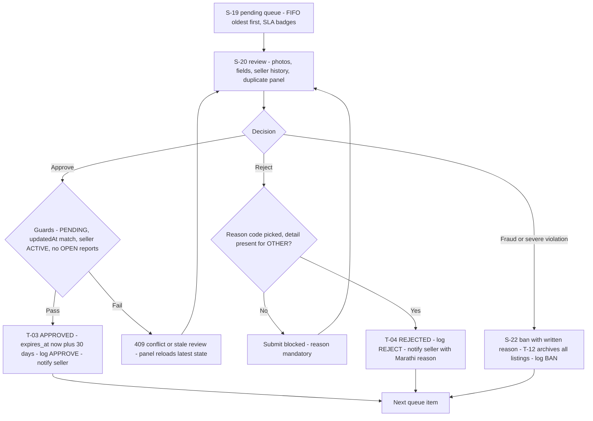

# Feature: Admin Moderation Panel (F-10)

| Field | Value |
|---|---|
| **Status** | Draft |
| **Version** | 1.0 |
| **Owner** | Founder (Abhishek) |
| **Last updated** | 2026-07-04 |
| **Depends on** | [../01-prd/README.md](../01-prd/README.md) (F-10) · [../04-business-rules/README.md](../04-business-rules/README.md) (BR-012, BR-014, BR-029, BR-040–BR-046, BR-050–BR-055) · [../06-user-flows/README.md](../06-user-flows/README.md) (Flow F + G, S-08, S-18–S-23) · [../08-api/README.md](../08-api/README.md) (API-25–API-34) · [auth.md](auth.md) · [reporting.md](reporting.md) · [notifications.md](notifications.md) |

## Purpose

The operating console that makes moderation-before-visibility (D10) workable for a solo founder: one FIFO queue, a review screen with everything needed to decide in under a minute, mandatory rejection reasons, report resolution, user bans, an append-only audit log, and the stats dashboard behind every PRD goal. Nothing goes live without a human decision here — SLA breaches never auto-approve (BR-041).

## User stories

- As the **admin**, I want the oldest pending listing first with its photos, fields and seller history on one screen so I can approve or reject each item in under a minute and hold the 24-hour SLA.
- As the **admin handling reports**, I want resolve/dismiss actions that always leave the listing in a human-decided state so no listing is ever silently republished or stranded.
- As the **founder**, I want a stats dashboard and an immutable audit log so I can prove the platform's due diligence and track the PRD metrics without SQL.

## Preconditions & permissions

| Aspect | Value |
|---|---|
| Who | Users with `is_admin = true` only — provisioned manually in the DB by the Founder; **no UI or API grants/revokes the flag** (BR-012) |
| Login required | Yes — same Firebase phone OTP as the PWA (F-01); `/admin` is the S-18 gate |
| Guard | Double: UI route guard on S-18 **and** server-side `is_admin` verification on every `/api/v1/admin/*` request (BR-012, doc 06 §5.3, [../12-security/README.md](../12-security/README.md)). Non-admins get 403 `FORBIDDEN` and an access-denied page linking to S-05 |
| Surface | Desktop-first layout at `/admin/*` in the same Next.js codebase (D1); **English-first UI** (internal user, doc 06 §5.3); never linked from any user-facing screen; not in the bottom nav |

## UX workflow

1. **S-18 gate:** admin opens `/admin`, logs in via phone OTP if needed; on success with `is_admin` verified → redirect to `/admin/pending` (S-19). Sidebar navigation: **Pending · Reports · Users · Stats** with badge counts on Pending (`PENDING` listing count) and Reports (OPEN report count), refreshed by polling every **60 seconds** and on every completed action.
2. **S-19 pending queue:** `GET /admin/listings?status=PENDING` — FIFO **oldest-first by `updated_at`** (BR-040), cursor-paginated (BR-090 #12). Each row: cover thumbnail, species/breed, price, seller name + district, and the badge set: **SLA age badge** (`queueAgeHours` — neutral < 18 h, **amber ≥ 18 h, red ≥ 24 h**, BR-041), red **"reports"** badge when `autoHidden`, **"possible duplicate"** icon when `duplicateOfListingIds` is non-empty (BR-029), **"contact-info?"** flag when `possibleContactInfo` (BR-065 soft flag), **"repeat"** badge when `rejectionCount ≥ 3` (BR-044). A status filter switches the same screen to any other listing status (`updated_at` desc, API-25).
3. **S-20 review:** full listing — every photo openable in S-08 full-screen zoom, all attributes vs the BR-022 matrix, description, price, location, `declarationAccepted` + `declarationAt` timestamp; **seller history panel** (name, phone — admin exception BR-066, district, join date, `priorListingCount`, `priorRejectionCount`, open reports on this seller's listings); **duplicate panel** linking each listing in `duplicateOfListingIds` for side-by-side comparison (advisory only — never blocks approval, BR-029). The BR-042 8-point approval checklist renders as a static aide-memoire beside the actions.
4. **Approve:** one click → `POST /admin/listings/{id}/approve` with `expectedUpdatedAt` (the `updatedAt` the panel loaded). Success = T-03: `APPROVED`, `approved_at = now`, **`expires_at = now + 30 days` — always a fresh 30 days, including re-approval after an edit or auto-hide** (BR-073); `moderation_log` `APPROVE`; seller notified `NTF-LISTING-APPROVED` (SMS + in-app). The panel advances to the next queue item.
5. **Reject:** opens the reason picker — the **8 one-tap codes of the BR-043 taxonomy** (English code + the Marathi seller-facing label beside it) plus an optional detail field, **mandatory for `OTHER`**. Confirm → `POST /admin/listings/{id}/reject {reason, detail?, expectedUpdatedAt}` — T-04: `rejection_reason` stored, `moderation_log` `REJECT`, seller notified `NTF-LISTING-REJECTED` with the Marathi reason label. Empty reason is blocked client- and server-side.
6. **S-21 reports queue:** `GET /admin/reports?status=OPEN`, oldest first, grouped by listing with per-listing OPEN count; **auto-hidden listings pinned on top** (BR-045). Row actions: open the listing in S-20; `POST /admin/reports/{id}/resolve` (report justified — if the listing is still `APPROVED` it is hidden to `PENDING` in the same transaction, BR-052; the admin then rejects via S-20 or bans via S-22); `POST /admin/reports/{id}/dismiss` (report invalid — counts toward the reporter's BR-053 tally). **Dismissal never republishes:** once every OPEN report on an auto-hidden listing is resolved/dismissed, the listing sits in the S-19 queue and returns to market only through an explicit approve (step 4); approve is blocked with `CONFLICT details.reason = "OPEN_REPORTS"` while any OPEN report remains (API-26).
7. **S-22 users & ban:** search by phone or name; user card shows profile, listing history, report history (made and received), and the BR-053 "possible report abuse" flag (5 dismissed reports / 30 days). **Ban** requires a written reason (5–500 chars) and a confirm dialog stating the effect; `POST /admin/users/{id}/ban {reason}` executes BR-014 atomically: `status = BANNED`, **all ACTIVE listings → `ARCHIVED`** (T-12, one bulk transition, `archivedListingCount` returned), one `moderation_log` `BAN` row, SMS `NTF-USER-BANNED` with the helpline. Banning yourself or another admin is blocked (422 `VALIDATION_ERROR`, API-31). **Unban** (`POST /admin/users/{id}/unban`) → `ACTIVE`, log `UNBAN`, SMS `NTF-USER-UNBANNED`; **archived listings are not restored** (BR-014, BR-032). Appeals arrive via the helpline only, within 30 days, decided within 7 (BR-055).
8. **S-23 stats & audit:** `GET /admin/stats` renders the dashboard — users (total/farmers/buyers/banned/new), listings by status/species/district, moderation (pending count, oldest-pending age, 7/30-day decisions, median + p95 turnaround, rejection rate — the BR-041 SLA measurables), inquiries (`inquiryRate` = G-04), reports, favorites — with drill-through links to S-19/S-21; values may be server-cached 5 minutes (API-34). Below it, `GET /admin/audit-log` renders the append-only `moderation_log` filterable by admin, action (`APPROVE|REJECT|BAN|UNBAN|RESOLVE_REPORT|DISMISS_REPORT|AUTO_HIDE`) and date range; system actions appear under the seeded "System" admin (BR-046).

## Fields & validation

Admin UI is English-first; EN strings are what admins see, MR entries exist in the catalog for completeness (README §3.5). Admin screens may additionally show raw error codes (README §3.2 #6).

| Field | Type | Required | Validation rule | Error message EN | Error message MR |
|---|---|---|---|---|---|
| reason (reject) | enum | Yes | `SLAUGHTER_INTENT\|POOR_PHOTOS\|WRONG_CATEGORY\|DUPLICATE\|FRAUD_SUSPECTED\|PRICE_ABUSE\|CONTACT_IN_DESCRIPTION\|OTHER` (BR-043) | Select a rejection reason | नाकारण्याचे कारण निवडा |
| detail (reject) | string | Conditional | ≤ 500 chars; **required when `reason = OTHER`** (BR-043) | Detail text is mandatory for OTHER | 'इतर' कारणासाठी तपशील लिहिणे आवश्यक आहे |
| expectedUpdatedAt | string (ISO) | Yes (approve + reject) | Must equal the listing's current `updated_at`; mismatch → 409 `CONFLICT` `STALE_REVIEW` (API-26/27) | The listing changed since you opened it. Reloaded the latest version. | तुम्ही उघडल्यानंतर जाहिरात बदलली आहे. नवीन आवृत्ती दाखवली आहे. |
| reason (ban) | string | Yes | 5–500 chars, free text (BR-014); target must not be an admin or the caller | Write a ban reason of 5–500 characters | बंदीचे कारण लिहा (5–500 अक्षरे) |
| status (queue filter) | enum | No | Any listing status, default `PENDING` (API-25); reports: `OPEN\|RESOLVED\|DISMISSED`, default `OPEN` (API-28) | Invalid status filter | चुकीचा स्थिती फिल्टर |

## Business logic

- **Access:** every `/api/v1/admin/*` request re-verifies the Firebase ID token and `is_admin = true` server-side; client-side gating alone is never trusted — BR-012, PRD F-10 AC-1.
- **Queue order:** FIFO by time-entered-`PENDING` (`updated_at ASC`); a seller editing a PENDING listing moves to the back (the seller UI warned them); badge-flagged items should be handled first but ordering stays FIFO — BR-040.
- **SLA:** 24 h to decision, amber at 18 h, red at 24 h; measured as rolling 7-day median and p95 in API-34; no auto-approval ever — BR-041.
- **Approval:** only when all 8 BR-042 checks pass; guards at API-26: status `PENDING` (else `INVALID_STATE_TRANSITION` — the two-admins race, BR-033), `expectedUpdatedAt` match (else `STALE_REVIEW`), seller `ACTIVE` (else `SELLER_BANNED`), zero OPEN reports (else `OPEN_REPORTS`, BR-052). T-03 always resets `expires_at = now + 30 days` — BR-073.
- **Rejection:** reason code mandatory from the BR-043 taxonomy; the Marathi label travels to the seller verbatim in `NTF-LISTING-REJECTED`; `FRAUD_SUSPECTED`/`SLAUGHTER_INTENT` rejections count toward ban criteria — BR-043, BR-044, BR-054.
- **Resolve/dismiss:** resolve = justified — hides a still-`APPROVED` listing in the same transaction (recorded by the `RESOLVE_REPORT` row itself, no separate `AUTO_HIDE` row); dismiss = invalid — feeds BR-053. Reporters get no outcome notification (BR-052, deliberate). Re-publication after dismissals is always an explicit human approve — BR-045.
- **Bans:** criteria = 3 confirmed fraudulent listings OR 1 severe violation (BR-054); always manual, always with a written reason; effects atomic per BR-014; unban never restores archived listings; appeal via helpline per BR-055. Helpline/e-mail grievances are entered into the reports queue by the admin so every grievance has a ticket ([../16-legal/README.md](../16-legal/README.md) §6.2).
- **Audit:** every mutation writes exactly one `moderation_log` row in the same transaction; the log is append-only — no update/delete endpoints exist; system actions use the seeded System admin — BR-046.
- **Admins never edit listing content** — approve/reject/ban only (BR-028); duplicate warnings are advisory (BR-029); admin views never increment `view_count` (BR-034).

## API usage

| Method + path | When |
|---|---|
| `GET /api/v1/admin/listings?status=` | S-19 queue load + status browser; default `PENDING`, FIFO (API-25) |
| `POST /api/v1/admin/listings/{id}/approve` | S-20 Approve — body `{ expectedUpdatedAt }` (API-26) |
| `POST /api/v1/admin/listings/{id}/reject` | S-20 Reject — body `{ reason, detail?, expectedUpdatedAt }` (API-27) |
| `GET /api/v1/admin/reports?status=` | S-21 queue load; default `OPEN`, oldest first (API-28) |
| `POST /api/v1/admin/reports/{id}/resolve` | S-21 resolve action (API-29) |
| `POST /api/v1/admin/reports/{id}/dismiss` | S-21 dismiss action (API-30) |
| `POST /api/v1/admin/users/{id}/ban` | S-22 ban — body `{ reason }` (API-31) |
| `POST /api/v1/admin/users/{id}/unban` | S-22 unban (API-32) |
| `GET /api/v1/admin/audit-log` | S-23 audit table — filters `adminId`, `action`, `from`, `to` (API-33) |
| `GET /api/v1/admin/stats` | S-23 dashboard (API-34) |

## States

| State | What the admin sees |
|---|---|
| Loading | Table-row skeletons on S-19/S-21/S-22/S-23; inline spinner in the tapped action button; S-20 photo placeholders while R2 variants load. |
| Empty | S-19: "Queue clear — all caught up" with links to S-21 and S-23 (the desired steady state); S-21: "No open reports"; S-22 search: "No user found for this phone/name". |
| Error | Endpoint-specific codes may render verbatim (README §3.2 #6): `STALE_REVIEW` → banner "Listing changed since you opened it" + auto-reload of S-20; `INVALID_STATE_TRANSITION` → "Already decided by another session" + return to queue; `SELLER_BANNED` / `OPEN_REPORTS` → blocking banner naming the unmet guard; network failure → retry affordance, no queued writes. |
| Success | Action confirmation strip ("Approved · seller notified") and automatic advance to the next queue item; sidebar badges refresh. |
| Edge | **Two admins race on one listing:** second gets 409 `INVALID_STATE_TRANSITION`; panel refreshes to actual state (BR-033). **Seller edits mid-review:** `expectedUpdatedAt` mismatch → `STALE_REVIEW`; panel reloads the latest content for re-review. **Seller banned seconds before approve:** `CONFLICT` `SELLER_BANNED` — approval blocked. **Auto-hidden listing with OPEN reports:** approve blocked with `OPEN_REPORTS` until each report is resolved/dismissed. **Photos fail to load (R2 hiccup):** Approve is disabled until at least one photo renders — no blind approvals; Reject stays available (PRD F-10 edge). **Non-admin opens `/admin`:** access-denied page, no admin data leaked, link to S-05; the API independently 403s (defense in depth). **Ban target is an admin/self:** 422 `VALIDATION_ERROR`, action blocked. |

## Analytics

No client events — admin screens fire none of the frozen NFR-10 events (README §3.4). The panel measures itself from Postgres product truth: `moderation_log` (decision volumes, per-admin activity), `listings.updated_at`→decision timestamps (SLA median/p95), and the `reports` table — all surfaced through `GET /api/v1/admin/stats` (API-34).

## Acceptance criteria

1. Every `/api/v1/admin/*` endpoint returns 403 `FORBIDDEN` for a caller without `is_admin = true`, verified server-side per request; a non-admin opening `/admin` sees the access-denied page with a link home and no admin data.
2. S-19 lists PENDING listings oldest-first with `queueAgeHours` badges that turn amber at ≥ 18 h and red at ≥ 24 h, plus the reports/duplicate/contact-info/repeat badges exactly per the API-25 `moderation` block.
3. S-20 shows all photos (zoomable via S-08), every listing field, the declaration timestamp, seller history (prior listings, prior rejections), and the duplicate panel linking each BR-029 match; the duplicate warning never blocks approval.
4. Approve fires T-03 with `expires_at = now + 30 days` (also after edit-re-moderation and auto-hide re-approval), writes one `APPROVE` log row, and sends `NTF-LISTING-APPROVED` (SMS + in-app); approve is rejected with `STALE_REVIEW`, `SELLER_BANNED`, or `OPEN_REPORTS` when the respective guard fails.
5. Reject without a reason code is blocked client- and server-side; `OTHER` without detail returns 422; a valid reject stores `rejection_reason`, writes one `REJECT` log row, and the seller receives the exact Marathi label from BR-043.
6. Resolve on a report whose listing is still `APPROVED` hides the listing to `PENDING` in the same transaction and returns `listingHidden: true`; dismiss never changes listing status; an auto-hidden listing whose reports are all dismissed returns to market only via an explicit approve.
7. Ban requires a 5–500 char reason, atomically sets `BANNED`, archives all the user's ACTIVE listings (count returned), writes exactly one `BAN` log row, and sends the ban SMS with the helpline; banning self or another admin is blocked with 422; unban restores `ACTIVE` but no listings.
8. Two admins acting on the same listing concurrently: exactly one action succeeds; the loser receives 409 and the panel refreshes to the true state.
9. The audit log renders every `APPROVE|REJECT|BAN|UNBAN|RESOLVE_REPORT|DISMISS_REPORT|AUTO_HIDE` row with admin, target, reason and timestamp, filterable by admin/action/date; no UI or API path updates or deletes a row.
10. S-23 renders every API-34 block (users, listings by status/species/district, moderation SLA median + p95, inquiry rate, reports, favorites) with drill-through links to S-19/S-21.

## Out of scope

- Multi-moderator roles, assignment, and per-admin queues; bulk approve/reject; admin mobile layout — Phase 2 (PRD F-10 future improvements).
- ML-assisted photo checks and Marathi slaughter-intent keyword flagging — Phase 3 (PRD F-10 future improvements); MVP relies on the human BR-042 checklist.
- Granting/revoking `is_admin` via UI or API — manual DB provisioning only (BR-012).
- Editing listing content as an admin — never; approve/reject/ban only (BR-028).
- Marathi admin UI — English-first in MVP; the §3.1 Marathi screen names in doc 06 are reference-only.

## Acceptance checklist

- [x] All 12 mandatory sections of README §2 present in order, plus this checklist per foundation §7
- [x] Admin guard specified as double enforcement (`is_admin` server-side per request + S-18 route guard), desktop-first English-first per doc 06 §5.3, manual provisioning per BR-012
- [x] Pending queue matches BR-040/BR-041 (FIFO oldest-first, 18 h amber / 24 h red SLA badges) and surfaces all four API-25 badge flags incl. the BR-029 duplicate warning
- [x] Reject uses the full 8-code BR-043 taxonomy with Marathi seller-facing labels; detail mandatory for `OTHER`; approve/reject carry `expectedUpdatedAt` per API-26/27
- [x] Reports queue covers resolve (hides still-APPROVED listing per BR-052) and dismiss (feeds BR-053), with explicit re-approve after dismissal per BR-045 and the `OPEN_REPORTS` approve guard
- [x] Ban/unban flow matches BR-014/BR-054/BR-055 (atomic archival T-12, one log row, SMS with helpline, no listing restore on unban); audit log per BR-046; stats dashboard per API-34
- [x] All ten canonical `/admin/*` endpoints (API-25–API-34) listed and nothing else; screens cited S-18–S-23 (+ S-08)
- [x] No client analytics events invented (server-side measurement stated); mermaid flowchart uses quoted labels, no parentheses in node labels; ≥ 6 testable acceptance criteria; no TBD/TODO; consistent with D1–D10 and docs 04/06/08
