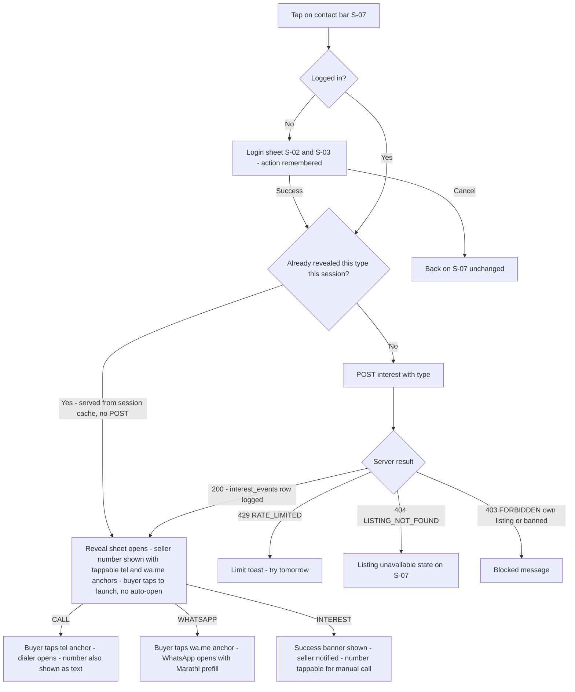

# Feature: Contact Seller — Call / WhatsApp / Send Interest (F-06)

| Field | Value |
|---|---|
| **Status** | Draft |
| **Version** | 1.1 |
| **Owner** | Founder (Abhishek) |
| **Last updated** | 2026-07-14 |
| **Depends on** | [../01-prd/README.md](../01-prd/README.md) (F-06) · [../04-business-rules/README.md](../04-business-rules/README.md) (BR-060–BR-066: full contact & privacy series) · [../06-user-flows/README.md](../06-user-flows/README.md) (Flow C, S-02, S-03, S-07) · [auth.md](auth.md) · [listing-detail.md](listing-detail.md) · [notifications.md](notifications.md) |

## Purpose

The platform's only conversion action (locked decision D6): three login-gated buttons on the listing detail page that reveal the seller's phone through exactly one logged endpoint. Calls and WhatsApp are where rural deals actually happen; routing every reveal through `POST /listings/{id}/interest` gives the ≥ 25% inquiry metric (G-04), blocks scraping, and defers chat entirely to Phase 2.

## User stories

- As a **buyer**, I want to call or WhatsApp the seller in one tap so I can negotiate directly, the way I already do business.
- As a **shy first-time buyer**, I want a "Send Interest" button so the seller knows I am interested even if I hesitate to call immediately.
- As a **seller**, I want to know when buyers show interest so I answer unknown calls around that time.

## Preconditions & permissions

| Aspect | Value |
|---|---|
| Who | Any logged-in `ACTIVE` user with a complete profile (BR-061, BR-013) |
| Login required | **Yes** — the login wall (BR-061). Anonymous taps open S-02 as a sheet; the action resumes automatically after login |
| Role | None; buyer ≠ seller — self-contact is forbidden (BR-062) |
| Listing state | APPROVED at the moment of the tap, else 404 (BR-062) |

## UX workflow

1. On **S-07**, the sticky contact bar shows three icon+text buttons: **"कॉल करा"** (Call), **"WhatsApp"**, **"आवड कळवा"** (Send interest).
2. Anonymous tap → login sheet (S-02/S-03) with the title "विक्रेत्याशी बोलण्यासाठी आधी लॉगिन करा" (To talk to the seller, log in first); after auth (and S-04 for new users) the original tap re-executes automatically; cancelling returns to S-07 with nothing lost (doc 06 login-wall contract).
3. Logged-in tap → `POST /api/v1/listings/{id}/interest` with `{ "type": "CALL" | "WHATSAPP" | "INTEREST" }`. The server logs one `interest_events` row **first** (transactionally) and returns `{ id, listingId, type, createdAt, seller: { name, phone, whatsappUrl } }` (BR-062, API-21).
4. On a 2xx the client opens the reveal **BottomSheet** titled "{sellerFirstName} यांच्याशी संपर्क" — the single launch surface for all three types — showing (a) the seller's number as a `tel:` link, (b) a **"कॉल करा"** `tel:` anchor button, and (c) a **"WhatsApp वर बोला"** button that is a **real user-tappable** `<a href={whatsappUrl} target="_blank" rel="noopener noreferrer">`. There is **no** programmatic `window.open`/navigation after the async POST: a post-await `window.open` loses the user-gesture context and is popup-blocked on mobile, which is exactly why the WhatsApp launch is delivered as a tappable `<a wa.me>` anchor the buyer taps (BR-063). Per type:
   - **CALL:** the buyer taps the `tel:+91XXXXXXXXXX` (E.164) anchor to dial; the number is also shown as text, so desktops/tablets without telephony can dial manually.
   - **WHATSAPP:** the buyer taps the `<a wa.me>` anchor (the server-built `whatsappUrl`, format below). If WhatsApp is not installed, the wa.me universal link opens in the browser/Play interstitial; the number stays visible in the sheet for a manual call.
   - **INTEREST:** the same sheet additionally shows the **"विक्रेत्याला कळवले आहे 👍"** success banner at the top, plus the seller's number for manual dialing; the seller is still notified per `NTF-INTEREST-RECEIVED` (see [notifications.md](notifications.md)).
5. After a successful reveal the client caches the returned seller for the current page session, keyed per action type. Re-tapping an already-revealed action re-opens the **same** sheet with the cached number and does **not** issue a new `POST /interest` — so it logs no duplicate `interest_events` row and consumes none of the 20/day cap (BR-064). The cache is per-(listing, type) and lives only for the page session (cleared on reload/navigation): the first tap of each of Call / WhatsApp / Interest POSTs once (at most 3 rows per listing per session), and any re-tap of that same type is served from cache.
6. Failure paths render per States (rate limit, unavailable listing, banned).

### Deep-link formats (canonical, BR-063)

| Channel | Format | Example |
|---|---|---|
| Call | `tel:` + E.164 | `tel:+919876543210` |
| WhatsApp | `https://wa.me/<E164-digits-without-plus>?text=<URL-encoded prefill>` — built **server-side** and returned as `whatsappUrl` | `https://wa.me/919876543210?text=...` |

Canonical prefill, generated in the buyer's `language_pref` (BR-063):

> **MR:** नमस्कार! मी PashuSetu वर तुमची जाहिरात पाहिली — {speciesMr}, {breedMr}, ₹{price}. जनावर अजून विक्रीसाठी आहे का? जाहिरात: {listingUrl}
> **EN:** Hello! I saw your listing on PashuSetu — {species}, {breed}, ₹{price}. Is the animal still available? Listing: {listingUrl}

## Fields & validation

| Field | Type | Required | Validation rule | Error message EN | Error message MR |
|---|---|---|---|---|---|
| type | enum | Yes | `CALL \| WHATSAPP \| INTEREST` — anything else → 400 `VALIDATION_ERROR` | Could not contact the seller. Try again. | विक्रेत्याशी संपर्क होऊ शकला नाही. पुन्हा प्रयत्न करा. |
| id (route param) | string (cuid) | Yes | Listing must be APPROVED; else 404 `LISTING_NOT_FOUND` | This listing is no longer available | ही जाहिरात आता उपलब्ध नाही |

## Business logic

- **Single reveal path:** the seller's phone appears in exactly one API response in the whole system — this endpoint's — and never in listing payloads, SSR HTML, sitemaps, or third-party notification payloads — BR-062, BR-066, PRD FR-08.
- **Log before reveal:** one `interest_events` row (`listing_id`, `buyer_id`, `type`, `created_at`) is written transactionally before contact info is returned; within one page session the client serves re-taps of an already-revealed action from the per-(listing, type) reveal cache, so only the **first** tap of each type POSTs and logs a row — same-session re-taps of that type log nothing; a new `interest_events` row is written only for a not-yet-revealed type or a fresh page session; the G-04 metric dedupes by distinct (listing, buyer) — BR-062.
- All three types return the same response shape (`{ id, listingId, type, createdAt, seller: { name, phone, whatsappUrl } }` — API-21); only `INTEREST` additionally triggers a seller notification — CALL/WHATSAPP do not (the buyer is already contacting directly) — BR-062, BR-071.
- **Rate limit:** 20 interest events / day / buyer, all types and listings combined, rolling 24 h, enforced atomically (count-then-insert in a transaction — a race on the 21st is correctly rejected) → 429 `RATE_LIMITED` with "आज खूप विक्रेत्यांशी संपर्क झाला आहे. कृपया उद्या पुन्हा प्रयत्न करा." — BR-064, BR-090 #3. The client-side per-session reveal cache is a first line of defence for this cap — incidental re-taps of an already-revealed action never re-POST, so they cannot burn the 20/day allowance; the cap value itself (BR-064) is unchanged.
- **Guards:** logged in + `ACTIVE` + complete profile (`UNAUTHENTICATED` / `USER_BANNED` / `PROFILE_INCOMPLETE`); listing APPROVED (`LISTING_NOT_FOUND`, e.g. sold/expired/hidden race, or seller banned → listings archived per BR-014); buyer ≠ seller → 403 `FORBIDDEN` (the UI already hides the bar for owners) — BR-062.
- The wa.me URL is built server-side so the format is uniform and the phone never transits the client separately — BR-063.

## API usage

| Method + path | When |
|---|---|
| `POST /api/v1/listings/{id}/interest` | Every tap of Call / WhatsApp / Send-Interest on S-07 (after login where needed) — body `{ "type": "CALL" \| "WHATSAPP" \| "INTEREST" }` |

## States

| State | What the user sees |
|---|---|
| Loading | Tapped button shows an inline spinner and disables (~≤ 600 ms budget, NFR-03); other two buttons stay enabled. |
| Empty | Not applicable — the bar renders only on an APPROVED listing for non-owners. |
| Error | 429 → toast "आजची मर्यादा संपली. उद्या पुन्हा प्रयत्न करा." (today's limit is over, try again tomorrow); 404 → S-07 swaps to the unavailable state; 403 own-listing → never reachable via UI (bar hidden); `USER_BANNED` → full-screen block per README §3.2; network failure → retry toast (no queue). |
| Success | A reveal BottomSheet opens for all types showing the number (as a `tel:` link), a Call button, and a WhatsApp button — both real anchors the buyer taps to launch the dialer / WhatsApp; nothing auto-launches. INTEREST additionally shows the "विक्रेत्याला कळवले आहे 👍" banner. |
| Edge | **WhatsApp not installed:** wa.me opens in browser; number remains visible for a manual call. **Listing turns non-APPROVED mid-view:** endpoint 404s; UI swaps state without a crash. **Seller banned seconds earlier:** listings archived by ban → 404. **Two taps racing the 20/day limit:** DB-atomic enforcement; the 21st is rejected. **Desktop without telephony:** `tel:` may fail silently; number visible in the sheet. **Launch did not fire (popup-blocked / WhatsApp missing):** the sheet stays open with the tappable `tel:`/`wa.me` anchors so the buyer simply taps again — no re-POST. **Re-tap of an already-revealed action:** re-opens the sheet from the session cache with no `POST`, no new event, and no cap consumption. |

## Analytics

| Event | Fired when | Properties |
|---|---|---|
| `contact_call_tap` | 2xx response for `type=CALL` | `listingId`, `species`, `districtId` |
| `contact_whatsapp_tap` | 2xx response for `type=WHATSAPP` | `listingId`, `species`, `districtId` |
| `send_interest` | 2xx response for `type=INTEREST` | `listingId`, `species`, `districtId` |

Fired only on success so client events mirror `interest_events` server truth (G-04 is computed from the DB, not from these events).

## Acceptance criteria

1. All three buttons are login-gated: an anonymous tap opens the login sheet with "विक्रेत्याशी बोलण्यासाठी आधी लॉगिन करा", and after successful login (including first-time S-04) the original action resumes automatically; cancel returns to S-07 with nothing lost.
2. `POST /listings/{id}/interest` writes exactly one `interest_events` row transactionally before returning `{ id, listingId, type, createdAt, seller: { name, phone, whatsappUrl } }`; the reveal sheet then presents CALL as a `tel:+91…` anchor and WHATSAPP as a real `<a href={whatsappUrl} target="_blank" rel="noopener noreferrer">` — no programmatic `window.open` runs after the POST (so mobile browsers do not popup-block the WhatsApp launch), and the `whatsappUrl` carries the canonical prefill in the buyer's language.
3. Type `INTEREST` logs the event, triggers the seller notification (in-app always; SMS within the 3/day/seller cap), and shows the buyer the confirmation toast plus the seller's number on screen.
4. The seller's phone number appears in no other API response and never in server-rendered HTML — verified by the automated phone-concealment test in [../14-testing-qa/README.md](../14-testing-qa/README.md).
5. The 21st interest event within a rolling 24 h returns 429 `RATE_LIMITED` with `details.retryAfterSeconds`, and the UI shows the canonical Marathi limit copy; enforcement is atomic under concurrent taps.
6. A tap on a listing that is no longer APPROVED (sold/expired/auto-hidden/seller-banned) returns 404 `LISTING_NOT_FOUND` and S-07 swaps to the unavailable state.
7. The owner of a listing sees no contact bar on it; a forced API call by the owner returns 403 `FORBIDDEN`.
8. Re-tapping an already-revealed action within the same page session re-opens the cached reveal and logs **no** new `interest_events` row and consumes no cap; a new event is logged only for a not-yet-revealed type or a fresh page session. The seller's INTEREST SMS respects the notification caps (no SMS spam).
9. The client caches the revealed seller per (listing, action type) for the page session; tapping the same action a second time re-opens the sheet from cache with zero additional `POST /interest` calls, so the 20/day cap (BR-064) is not consumed by incidental re-taps. Reloading the page clears the cache and a fresh tap re-POSTs.

## Out of scope

- **In-app chat** — Phase 2 by locked decision D6; not designed here beyond this note.
- Masked/virtual numbers, callback scheduling, mutual number exchange — Phase 2 (PRD F-06 future improvements).
- Any payment, escrow, or transaction step — the deal happens offline between parties (foundation §8, PRD §9).

## Acceptance checklist

- [x] All contact rules cited from the owning BR-060–BR-066 series: login wall (BR-061), log-before-reveal and single reveal path (BR-062, BR-066), server-built wa.me link with the canonical bilingual prefill (BR-063), 20/day/buyer rolling rate limit (BR-064)
- [x] Endpoint matches doc 08 API-21 exactly: `POST /api/v1/listings/{id}/interest`, nested response `{ id, listingId, type, createdAt, seller: { name, phone, whatsappUrl } }`, errors 400 `VALIDATION_ERROR` / 404 `LISTING_NOT_FOUND` / 403 `FORBIDDEN` / 429 `RATE_LIMITED`
- [x] Screens and labels reuse doc 06: S-07 contact bar (कॉल करा / WhatsApp / आवड कळवा), login sheet S-02/S-03 with automatic action resume (Flow C login-wall contract)
- [x] Seller notification fires for `INTEREST` only (`NTF-INTEREST-RECEIVED`, in-app always, SMS within the 3/day/seller cap — BR-071, notifications.md); CALL/WHATSAPP trigger none
- [x] All five states defined (loading, empty, error, success, edge); analytics limited to the three frozen success-only events; G-04 computed from `interest_events` server truth, not client events
- [x] ≥ 6 testable acceptance criteria; no TBD/TODO; chat, masked numbers, and payments explicitly deferred per locked decision D6
- [x] Reveal launches via real user-tappable `tel:`/`wa.me` anchors in the reveal sheet (no post-await `window.open`, so WhatsApp is never popup-blocked); a per-(listing, type) session reveal cache means re-taps do not re-POST, protecting the BR-064 20/day cap
