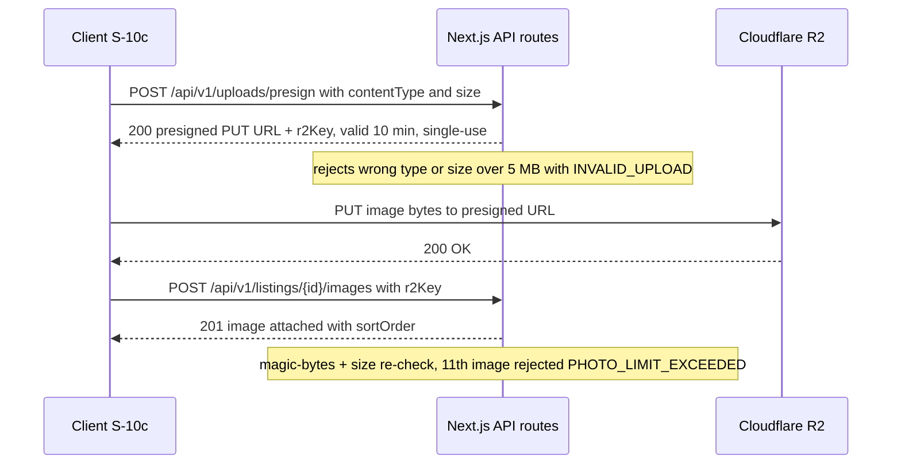

# Feature: Create Listing — 5-Step Wizard (F-03)

| Field | Value |
|---|---|
| **Status** | Draft |
| **Version** | 1.0 |
| **Owner** | Founder (Abhishek) |
| **Last updated** | 2026-07-04 |
| **Depends on** | [../01-prd/README.md](../01-prd/README.md) (F-03) · [../04-business-rules/README.md](../04-business-rules/README.md) (BR-020–BR-029, BR-065, BR-090) · [../06-user-flows/README.md](../06-user-flows/README.md) (Flow A, S-10, S-10a–S-10e, S-11) · [profile.md](profile.md) · [admin-moderation.md](admin-moderation.md) |

## Purpose

Turn a photo of an animal into a structured, searchable, moderated Marathi listing in under five minutes. The wizard chunks the form into five low-typing steps (max ~3 inputs per step, NFR-07), autosaves a DRAFT so nothing is ever lost, and ends with the mandatory seller declaration (BR-027). Nothing goes public before admin approval (D10).

## User stories

- As a **farmer**, I want to photograph my cow and fill a simple Marathi form so my animal is visible to buyers across Maharashtra without a middleman.
- As a **farmer on patchy 3G**, I want my half-finished listing saved automatically so I can continue later from where I stopped.
- As a **dairy seller**, I want to state milk yield and pregnancy so serious buyers call me, not tire-kickers.

## Preconditions & permissions

| Aspect | Value |
|---|---|
| Who | Any `ACTIVE` user with a complete profile (BR-020, BR-013) |
| Login required | Yes — Sell tab raises the login wall for anonymous users (BR-061) |
| Role | None (role flags are not gates, BR-011) |
| Quota | **No cap** — unlimited ACTIVE listings (`DRAFT/PENDING/APPROVED/REJECTED/EXPIRED`); BR-024 removed 2026-07-16. My Listings shows a plain active count; abuse is bounded by pre-publication moderation + the 60/min write limit (BR-090 #2) |

## UX workflow

1. Entry: "+ नवीन जाहिरात" on **S-11** (or the Sell tab deep-links to **S-10a** when the user has zero listings). There is no active-listing cap (BR-024 removed 2026-07-16), so the wizard is never blocked on a quota — a seller may open it with any number of existing ACTIVE listings.
2. **S-10 host shell**: five progress dots, per-step Back, and "जतन करून बाहेर पडा" (save and exit) → S-11. Bottom nav hidden inside the wizard (doc 06 §5.2).
3. **S-10a — Step 1: species & breed.** Icon grid of the 5 species (गाय / म्हैस / बैल / शेळी / मेंढी) (REDA/रेडा retired 2026-07-15 — not listable); breed picker filtered via `GET /meta/breeds?species=`, always including "गावठी / स्थानिक" (local/crossbred). **Draft autosave rule:** the first forward tap (S-10a → S-10b) calls `POST /listings` creating the DRAFT; every later forward/back navigation and the save-and-exit action calls `PATCH /listings/{id}` with the step's fields. Each forward tap server-validates that step's fields on the same POST/PATCH; a 422 `VALIDATION_ERROR` blocks the advance and renders inline field errors on the current step. Field values typed since the last successful PATCH are also kept in localStorage so a crash loses at most the current step (README §3.3 — no offline write queue).
4. **S-10b — Step 2: details.** Sex (hidden/fixed for COW=FEMALE and BULL_OX=MALE, BR-022), age as years + months inputs (client converts to `ageMonths`), weight (optional), milk fields per the conditional matrix below, pregnant/vaccinated toggles, description.
5. **S-10c — Step 3: photos.** 1–10 photos, multi-selected from the gallery or camera in a single pick (the earlier forced camera-only capture was dropped; the file input is now `multiple`) (BR-023). Per photo: presign → direct PUT to R2 → attach (sequence below); thumbnail with progress ring, retry on failure, delete, drag-to-reorder (`sortOrder` 0–9; index 0 = cover). Nudge shown until 3 photos exist: "किमान 3 फोटो टाकल्यास जनावर लवकर विकले जाते" (With at least 3 photos the animal sells faster). Photo-tips sheet: "उन्हात, पूर्ण जनावर दिसेल असा फोटो काढा" (Shoot in daylight with the full animal visible) — reduces BR-082 rejections. Add-photo button hides at 10; a counter chip shows "{n} / 10 फोटो". "पुढे" (Next) disabled until ≥ 1 photo attached.
6. **S-10d — Step 4: price & location.** Price in ₹ (integer keypad), negotiable toggle "किंमतीत बदल शक्य" (price negotiable, default on), district (pre-filled from profile), taluka (required), village (required; Places assist with silent free-text fallback).
7. **S-10e — Step 5: declaration & review** (step header "तपासा आणि पाठवा"). A full field-by-field read-back card mirroring the public detail page: a breed + species heading, then price + negotiability ("बोलणी होऊ शकते" when negotiable), then labelled rows for लिंग (sex), वय (age), वजन (weight), दूध (milk), वेत (lactation), गाभण (pregnant), लसीकरण (vaccinated), ठिकाण (village · taluka · district) and फोटो count, plus the description — unset / N-A fields are omitted. A privacy reassurance line is rendered above the checkbox: "तुमचा नंबर फक्त लॉगिन केलेल्या खरेदीदारांनाच दिसेल." Then the mandatory declaration checkbox (canonical text, BR-027):
   > मी जाहीर करतो/करते की मी या जनावराचा/जनावरीचा कायदेशीर मालक आहे, ही विक्री महाराष्ट्र राज्याच्या कायद्यांनुसार आहे, आणि हे जनावर कत्तलीसाठी विकले जात नाही.
   > *(I declare that I am the lawful owner of this animal, that this sale complies with the laws of the State of Maharashtra, and that this animal is not being sold for slaughter.)*
   Submit button "तपासणीसाठी पाठवा" (send for review) is disabled until ticked, with the hint "हमीपत्र स्वीकारल्याशिवाय जाहिरात पाठवता येणार नाही" (the listing cannot be sent without accepting the declaration).
8. Submit calls `POST /listings/{id}/submit` → status `PENDING`, success screen "तुमची जाहिरात तपासणीसाठी पाठवली आहे. 24 तासांच्या आत उत्तर मिळेल." (Your listing has been sent for review. You will get an answer within 24 hours.) → S-11 with the listing under "तपासणीत" (in review).
9. Exiting at any step keeps a resumable DRAFT under S-11 "अपूर्ण" (incomplete) with "पुढे चालू ठेवा" (continue), which reopens the wizard at the first incomplete step.

### Photo upload sequence (presigned R2, D4)

Server generates WebP variants asynchronously (BR-023; sizes in [../09-backend/README.md](../09-backend/README.md)); EXIF orientation normalized so no sideways animals (PRD F-03 edge). Interrupted PUTs leave orphaned R2 keys that a daily job garbage-collects.

## Fields & validation

Required (R) applies **at submit** — a DRAFT may be saved partially filled (BR-022). Server-side validation at `POST /listings/{id}/submit` is authoritative; violations → 422 `VALIDATION_ERROR` with a per-field `details` map.

| Field | Type | Required | Validation rule | Error message EN | Error message MR |
|---|---|---|---|---|---|
| species | enum | R | `COW\|BUFFALO\|BULL_OX\|GOAT\|SHEEP` (REDA/रेडा retired — not listable) | Choose the animal type | जनावराचा प्रकार निवडा |
| breedId | string (cuid) | R | Must belong to the chosen species (BR-022) | Choose a breed for this animal | या जनावराची जात निवडा |
| sex | enum | R | `FEMALE\|MALE`; COW forces FEMALE, BULL_OX forces MALE — mismatch rejected | Sex does not match the animal type | जनावराच्या प्रकाराशी लिंग जुळत नाही |
| ageMonths | integer | R | 1–300 (entered as years + months) | Enter age between 1 month and 25 years | वय 1 महिना ते 25 वर्षांच्या दरम्यान टाका |
| weightKg | integer | O (recommended for GOAT/SHEEP) | 5–1500 | Weight must be 5–1500 kg | वजन 5 ते 1500 किलोच्या दरम्यान टाका |
| milkYieldLpd | number | Conditional (matrix below) | 0–60; 0 = currently dry (आटलेली) | Milk yield must be 0–60 litres per day | दूध उत्पादन 0 ते 60 लिटर प्रतिदिन टाका |
| lactationNumber | integer | O (milch, FEMALE only) | 0–15; 0 = not yet calved | Lactation number must be 0–15 | वेत क्रमांक 0 ते 15 टाका |
| isPregnant | boolean | O (FEMALE only) | Toggle; null when N/A | — | — |
| isVaccinated | boolean | O | Toggle for every listing | — | — |
| priceInr | integer | R | ₹500 – ₹10,00,000, whole rupees (BR-026) | Price must be between ₹500 and ₹10,00,000 | किंमत ₹500 ते ₹10,00,000 च्या दरम्यान टाका |
| negotiable | boolean | R | Default `true` (BR-026) | — | — |
| districtId | string (cuid) | R | One of 36 seeded MH districts | Choose the district | जिल्हा निवडा |
| taluka | string | R | ≤ 60 chars | Taluka is too long | तालुक्याचे नाव खूप मोठे आहे |
| village | string | R | 2–60 chars, free text | Enter the village name | गावाचे नाव टाका |
| description | string | R | 10–1000 Unicode code points after trim (BR-025); **no phone numbers** (BR-065, incl. Devanagari digits) | Write 10–1000 characters. Do not include phone numbers. | 10 ते 1000 अक्षरांत लिहा. फोन नंबर लिहू नका. |
| photos | 1–10 files | R (≥ 1) | JPEG/PNG/WebP, each ≤ 5 MB (BR-023); HEIC rejected at presign (client transcodes via canvas where supported) | Add at least 1 photo (JPEG/PNG, up to 5 MB) | किमान 1 फोटो टाका (JPEG/PNG, जास्तीत जास्त 5 MB) |
| declarationAccepted | boolean | R at submit | Must be `true` (BR-027) | Accept the declaration to submit | जाहिरात पाठवण्यासाठी हमीपत्र स्वीकारा |

> The canonical `Species` enum is owned by [../07-database/README.md](../07-database/README.md) (DB schema) and BR-022 ([../04-business-rules/README.md](../04-business-rules/README.md)); only the listable picker set (5 species) is restated above. `REDA` (he-buffalo, male buffalo, fixed-sex MALE) was **retired 2026-07-15 — not listable**; it remains a dormant `species` enum value in the DB, kept only for the archived REDA rows (no migration dropped it), and is never offered in the wizard.

**Per-species conditional fields (BR-022 matrix — N/A fields are null and never rendered):**

| Field | COW | BUFFALO | BULL_OX | GOAT | SHEEP |
|---|---|---|---|---|---|
| sex | fixed FEMALE (hidden) | asked | fixed MALE (hidden) | asked | asked |
| milkYieldLpd | **Required** | **Required if FEMALE** | not shown | Optional if FEMALE | not shown |
| lactationNumber | Optional | Optional if FEMALE | not shown | Optional if FEMALE | not shown |
| isPregnant | Optional | Optional if FEMALE | not shown | Optional if FEMALE | Optional if FEMALE |
| isVaccinated | Optional | Optional | Optional | Optional | Optional |
| weightKg | Optional | Optional | Optional | Optional (recommended) | Optional (recommended) |

Server rejects milk / lactation / pregnancy fields on MALE / N-A combinations (e.g. BULL_OX, fixed MALE) with `VALIDATION_ERROR` (never trusts client hiding).

## Business logic

- Creation always produces a `DRAFT`; nothing skips moderation — BR-020, D10, disallowed transition `DRAFT → APPROVED` (BR-032).
- **No active-listing cap** (BR-024 removed 2026-07-16): `POST /listings` performs no quota check — a seller may hold unlimited ACTIVE listings; the `LISTING_LIMIT_REACHED` code is retained but never fires. Abuse is bounded by pre-publication moderation (D10) + the 60/min write limit (BR-090 #2) — BR-024.
- Photos: min 1 / max 10 (≥3 recommended), ≤ 5 MB, JPEG/PNG/WebP; the client uploads a multi-file selection sequentially (presign → PUT → attach per file); presign validates content-type + size and issues single-use 10-minute PUT URLs to server-generated keys; attach re-checks magic bytes; 11th attach → 409 `PHOTO_LIMIT_EXCEEDED`; bad type/size → 422 `INVALID_UPLOAD`; server stores WebP variants; **no video** — BR-023 (numeric min/max owned by BR-023, doc 04 — must read max 10), NFR-08.
- Description hard-blocks Indian mobile patterns (ASCII + Devanagari digits normalized) → 422 `PHONE_IN_DESCRIPTION` with "कृपया वर्णनात फोन नंबर लिहू नका. खरेदीदारांना तुमचा नंबर 'कॉल करा' बटणाने आपोआप मिळेल."; 8–9 digit runs set the moderation soft flag — BR-065.
- Submit guards (T-02): all required fields valid per BR-022, ≥ 1 photo, price in bounds (BR-026), description passes BR-025 + BR-065, declaration accepted (else 422 `DECLARATION_REQUIRED`). Success sets `PENDING`, stores `declaration_accepted = true` + `declaration_at = now`, computes the BR-029 duplicate flag, and emits the admin in-app notification `NTF-ADMIN-PENDING`. On a field-scoped submit failure the client maps each returned field key to its owning step and jumps to the lowest-numbered one so the seller lands where the fix lives.
- Submit is idempotent for `DRAFT → PENDING`: a double-tap returns the already-PENDING listing (PRD F-03 edge).
- The declaration is re-affirmed on **every** submission entering PENDING (first submit and every resubmit) — BR-027.
- Editing rules after submission (incl. price-only exception and re-moderation) are owned by [listing-manage.md](listing-manage.md) / BR-028.
- One animal per listing; multi-animal text is a moderation rejection (`WRONG_CATEGORY`) — BR-021.

## API usage

| Method + path | When |
|---|---|
| `GET /api/v1/meta/breeds?species=` | On species selection in S-10a (and on species change) (retryable — inline retry banner on load failure) |
| `GET /api/v1/meta/districts` | On S-10d open (cached from profile flow when available) (retryable — inline retry banner on load failure) |
| `POST /api/v1/listings` | First forward navigation S-10a → S-10b (creates the DRAFT) |
| `PATCH /api/v1/listings/{id}` | Every step navigation and save-and-exit (autosave) |
| `POST /api/v1/uploads/presign` | Per photo, before upload (S-10c) |
| `POST /api/v1/listings/{id}/images` | Per photo, after successful PUT to R2 (attach + sortOrder) |
| `DELETE /api/v1/listings/{id}/images/{imageId}` | User deletes a photo on S-10c |
| `POST /api/v1/listings/{id}/submit` | S-10e submit with `declarationAccepted: true` |

## States

| State | What the user sees |
|---|---|
| Loading | Breed/district picker skeletons (which collapse into the retry banner if the meta load fails); per-photo progress ring during PUT; submit button spinner during submit. |
| Empty | Fresh S-10a: nothing selected, Next disabled until species + breed chosen; S-10c with zero photos shows the camera/gallery CTAs + tips sheet link. |
| Error | Inline field errors per table. Meta-load failure (breeds or districts drop on a flaky rural connection) surfaces an inline banner with "पुन्हा प्रयत्न करा" (retry) that refetches both dropdowns; the rest of the wizard stays usable. Photo failures: failed thumbnail with "पुन्हा प्रयत्न करा" (retry) per photo — other photos unaffected; oversize/wrong-format rejected client-side before upload and re-validated at presign. On submit, a 422 `VALIDATION_ERROR` auto-navigates the wizard to the earliest step that renders an offending field (jump-to-step), showing the inline MR error there; non-field errors (e.g. `DECLARATION_REQUIRED`, `PHONE_IN_DESCRIPTION`) stay on S-10e. |
| Success | Post-submit confirmation with the 24 h SLA promise (BR-041), then S-11 with the card under "तपासणीत". |
| Edge | **App killed mid-wizard:** DRAFT resumes from S-11 at the first incomplete step. **Network drop mid-PUT:** photo never attaches; retry re-runs presign (URLs are single-use); orphaned keys GC'd daily. **Species changed after breed picked:** breed resets, list re-fetched. **Last photo deleted on a DRAFT:** allowed; submit stays blocked until ≥ 1 photo. **Declaration never ticked:** submit disabled; exit leaves a resumable DRAFT — never a lost listing. |

## Analytics

| Event | Fired when | Properties |
|---|---|---|
| `listing_create_start` | Wizard opened at S-10a (before any server call) | `entryPoint` (`sell_tab` \| `my_listings`) |
| `listing_photo_added` | Each successful image attach (2xx on the attach call) | `listingId`, `photoIndex` |
| `listing_submit` | Successful `POST /listings/{id}/submit` (2xx) | `listingId`, `species`, `districtId`, `photoCount` |

`listing_create_start` vs `listing_submit` yields the ≥ 60% completion metric G-10.

## Acceptance criteria

1. The first forward navigation from S-10a creates a DRAFT via `POST /listings`; every subsequent step navigation persists via `PATCH /listings/{id}`; killing the app at any step leaves a DRAFT resumable from S-11 at the first incomplete step.
2. The form renders exactly the BR-022 conditional matrix: COW hides sex (FEMALE) and requires milk yield; BULL_OX hides sex as fixed MALE; BULL_OX and SHEEP never show milk fields; server independently rejects milk fields on invalid combinations with 422 `VALIDATION_ERROR`.
3. Photo upload follows presign → PUT → attach; presign rejects non-JPEG/PNG/WebP or > 5 MB with `INVALID_UPLOAD`; the 11th attach returns `PHOTO_LIMIT_EXCEEDED`; the add button hides at 10 photos; Next from S-10c requires ≥ 1 attached photo.
4. A description containing an Indian mobile pattern (ASCII or Devanagari digits) is rejected at save/submit with 422 `PHONE_IN_DESCRIPTION` and the canonical Marathi copy.
5. Submit succeeds only with all required fields valid, ≥ 1 photo, and `declarationAccepted: true`; it sets status PENDING, stores `declaration_accepted` + `declaration_at`, and shows the 24-hour review promise; submit without the declaration returns 422 `DECLARATION_REQUIRED` and the checkbox hint is shown.
6. A submit that fails server validation lands the seller on the earliest wizard step containing an offending field (jump-to-step), with that field's inline MR error shown; the declaration / phone errors that are not field-scoped remain on the review step.
7. There is no active-listing cap (BR-024 removed 2026-07-16): `POST /listings` performs no quota check and a seller may create unlimited ACTIVE listings; the `LISTING_LIMIT_REACHED` code is retained but never fires, and My Listings shows a plain active count (never "X / 10").
8. Double-tapping submit produces exactly one PENDING listing (idempotent T-02); the duplicate heuristic flag (BR-029) is computed at submit and visible only to admins.
9. Price outside ₹500–₹10,00,000, age outside 1–300 months, or description outside 10–1000 characters each produce the inline MR error from the Fields table, client-side before submit and server-side authoritatively.

## Out of scope

- Video uploads or video URLs (BR-023 — extension point only).
- Multi-animal lots per listing — Phase 2 (BR-021).
- Voice-input Marathi descriptions, AI photo-quality hints, price suggestions — Phase 3 (PRD F-03 future improvements).
- Offline queued submission — README §3.3: retry UI only, never a background queue.

## Acceptance checklist

- [x] All 12 mandatory sections of README §2 present in order, plus this checklist per foundation §7
- [x] Wizard steps match doc 06 Flow A (S-10 host, S-10a–S-10e, S-11 return); DRAFT autosave via `POST /listings` on first forward tap then `PATCH /listings/{id}` per navigation; per-species conditional field matrix matches BR-022 exactly with server-side re-validation
- [x] Photo pipeline matches BR-023 and doc 08 (presign → direct PUT to R2 → attach; 1–10 photos, JPEG/PNG/WebP ≤ 5 MB; `INVALID_UPLOAD` at presign, `PHOTO_LIMIT_EXCEEDED` on 11th attach; no video)
- [x] All limits cited from owners: no active-listing cap (BR-024 removed 2026-07-16; `LISTING_LIMIT_REACHED` retained but dormant), price ₹500–₹10,00,000 (BR-026), description 10–1000 with phone block → 422 `PHONE_IN_DESCRIPTION` (BR-025/BR-065), age 1–300 months
- [x] Declaration checkbox carries the exact BR-027 canonical Marathi text; submit stores `declaration_accepted` + `declaration_at`, sets `PENDING` per T-02, emits `NTF-ADMIN-PENDING`, and omission returns 422 `DECLARATION_REQUIRED`; declaration re-affirmed on every submission entering PENDING
- [x] Only canonical `/api/v1` paths from doc 08 referenced; error codes match the doc 08 registry; submit idempotent for `DRAFT → PENDING`
- [x] Analytics limited to the frozen `listing_create_start` / `listing_photo_added` / `listing_submit` events feeding G-10; Marathi strings are Devanagari with English gloss
- [x] All five states defined; ≥ 6 testable acceptance criteria; no TBD/TODO; no contradiction with D1–D10 or docs 04/06/08
