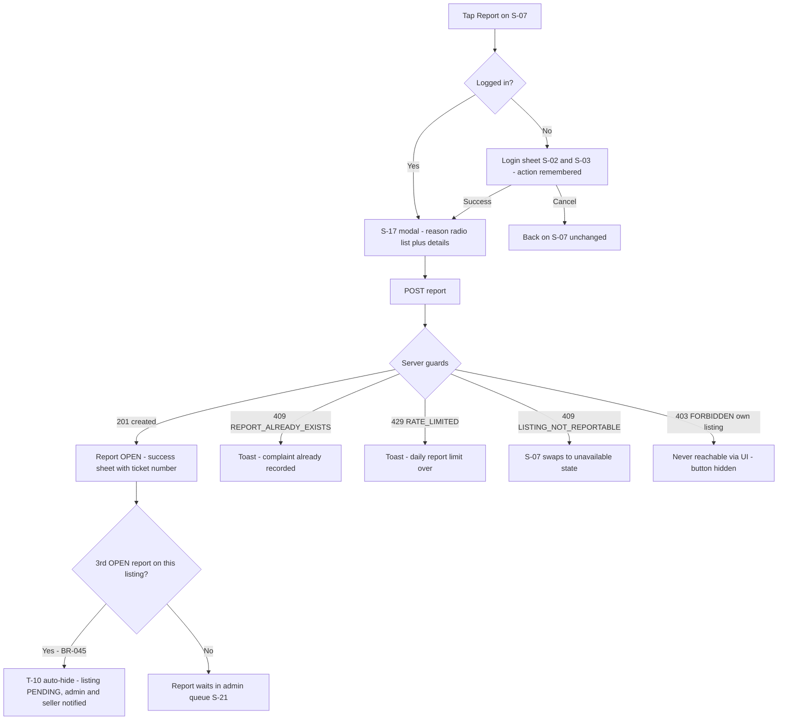

# Feature: Report Listing (F-09)

| Field | Value |
|---|---|
| **Status** | Draft |
| **Version** | 1.0 |
| **Owner** | Founder (Abhishek) |
| **Last updated** | 2026-07-04 |
| **Depends on** | [../01-prd/README.md](../01-prd/README.md) (F-09) · [../04-business-rules/README.md](../04-business-rules/README.md) (BR-050–BR-055, BR-045, BR-090 #4/#5/#17) · [../06-user-flows/README.md](../06-user-flows/README.md) (Flow G, S-07, S-17) · [../16-legal/README.md](../16-legal/README.md) (grievance mechanism §6) · [listing-detail.md](listing-detail.md) · [admin-moderation.md](admin-moderation.md) |

## Purpose

Community policing that scales moderation beyond one admin ("Trust Over Speed"). Any logged-in user can flag a live listing with one of six fixed reasons; three open reports auto-hide the listing before an admin even looks (BR-045), capping the damage window of anything that slipped through review. Every report row doubles as the grievance ticket required by the IT Rules 2021 ([../16-legal/README.md](../16-legal/README.md) §6.2).

## User stories

- As a **buyer who called a seller and learned the animal was already sold**, I want to report the listing so other buyers stop wasting calls on it.
- As a **trader who spots a stock photo from another site**, I want to flag the fake so the market stays trustworthy.
- As a **seller falsely mass-reported by a rival**, I want a human admin — not the mob — to make the final call on my listing.

## Preconditions & permissions

| Aspect | Value |
|---|---|
| Who | Any logged-in `ACTIVE` user with a complete profile (BR-050, BR-013) |
| Login required | Yes — anonymous taps on "तक्रार करा" raise the login wall; the modal opens automatically after login (BR-061, doc 06 §3.2) |
| Role | None; reporter ≠ seller — reporting your own listing → 403 `FORBIDDEN` (BR-050) |
| Listing state | `APPROVED` at submit time, else 409 `LISTING_NOT_REPORTABLE` (BR-050) |
| Limits | 5 reports/day/user rolling 24 h (BR-051); max 1 OPEN report per (listing, reporter) (BR-050, BR-090 #5) |

## UX workflow

1. **Entry:** "तक्रार करा" (report) on **S-07** — rendered only on `APPROVED` listings and never on the viewer's own listing (doc 06 Flow G edge). Anonymous tap → login sheet; after auth (and S-04 for new users) **S-17** opens automatically; cancel returns to S-07 unchanged.
2. **S-17 report modal** over S-07: six large icon + Marathi-text radio rows (table below), one selectable. Below them a details textarea with a live "0/500" counter — optional for five reasons, **mandatory for इतर (OTHER)** with the helper line "'इतर' निवडल्यास थोडी माहिती लिहा" (if you pick 'Other', write some details).
3. Submit button "तक्रार पाठवा" (send the report) stays disabled until a reason is selected (and details typed when OTHER). Tap → `POST /api/v1/listings/{id}/report`.
4. **Success sheet** replaces the modal: canonical toast copy "तुमची तक्रार नोंदवली आहे. आम्ही लवकरच तपासू." (your complaint is recorded, we will check soon — doc 06 `report.success`) plus the grievance-acknowledgment line "तक्रार क्र. {ticketId} — आम्ही 15 दिवसांच्या आत उत्तर देऊ." (complaint no. {ticketId} — we will respond within 15 days, per [../16-legal/README.md](../16-legal/README.md) §6.2). `{ticketId}` renders as the **last 8 characters of `reports.id`, uppercase** — short enough to read out on the helpline. Auto-dismiss → S-07.
5. Server-side, invisible to the reporter: if this was the **3rd OPEN report** on the listing, T-10 fires in the same transaction — listing hidden to `PENDING`, `moderation_log` `AUTO_HIDE` under the System admin, admin notified `NTF-ADMIN-AUTOHIDE`, seller notified `NTF-LISTING-HIDDEN` (in-app, no report details) — BR-045, [notifications.md](notifications.md).
6. Failure paths render per States (duplicate, rate limit, listing gone).

### Report reasons (canonical enum, BR-050)

| Code | Marathi label (S-17 row) | English gloss | Details field |
|---|---|---|---|
| `FAKE` | खोटी जाहिरात | Fake listing | Optional |
| `SOLD_ALREADY` | आधीच विकले गेले | Already sold | Optional |
| `WRONG_INFO` | चुकीची माहिती | Wrong information | Optional |
| `SPAM` | स्पॅम | Spam | Optional |
| `ILLEGAL` | बेकायदेशीर | Illegal | Optional |
| `OTHER` | इतर | Other | **Mandatory** (BR-050) |

## Fields & validation

Server-side validation at `POST /listings/{id}/report` is authoritative (API-22); violations → the codes below with the standard envelope.

| Field | Type | Required | Validation rule | Error message EN | Error message MR |
|---|---|---|---|---|---|
| reason | enum | Yes | `FAKE\|SOLD_ALREADY\|WRONG_INFO\|SPAM\|ILLEGAL\|OTHER` — anything else → 400 `VALIDATION_ERROR` | Choose a reason for the report | तक्रारीचे कारण निवडा |
| details | string | Conditional | ≤ 500 chars (BR-090 #17); **required, non-empty after trim, when `reason = OTHER`** (BR-050) | Write details for 'Other' (up to 500 characters) | 'इतर' कारणासाठी माहिती लिहा (जास्तीत जास्त 500 अक्षरे) |
| id (route param) | string (cuid) | Yes | Listing must be `APPROVED`; else 409 `LISTING_NOT_REPORTABLE` | This listing is no longer available | ही जाहिरात आता उपलब्ध नाही |

## Business logic

- **Guards, in order** (API-22): logged in + `ACTIVE` + complete profile (`UNAUTHENTICATED` / `USER_BANNED` / `PROFILE_INCOMPLETE`); listing `APPROVED` (else `LISTING_NOT_REPORTABLE` 409); reporter ≠ seller (else `FORBIDDEN` 403); no existing OPEN report by this reporter on this listing (else `REPORT_ALREADY_EXISTS` 409); under 5 reports in the rolling 24 h (else `RATE_LIMITED` 429) — BR-050, BR-051.
- **One OPEN report per (listing, reporter)** is race-proof at the DB level via the partial unique index `reports_one_open_per_reporter` ([../07-database/README.md](../07-database/README.md) §9.2). Re-reporting the same listing is allowed again after the earlier report is resolved or dismissed — BR-050.
- **Atomic auto-hide:** the report insert and the OPEN-count check run in one transaction; when the count reaches 3 on an `APPROVED` listing, T-10 executes in that same transaction (exactly one transition, one `AUTO_HIDE` log row, one admin notification — even when reports #2 and #3 land simultaneously) — BR-045, PRD F-09 edge.
- Reports never auto-hide non-`APPROVED` listings — only `APPROVED` listings are reportable in the first place (BR-045, BR-050).
- **No automatic restore:** if the open-report count later drops below 3 (dismissals), the listing stays `PENDING` until an admin explicitly re-approves via T-03 (which resets `expires_at = now + 30 d`) — BR-045, [admin-moderation.md](admin-moderation.md).
- **Reporter feedback states (MVP, deliberate):** (a) at submit — the success sheet with ticket id is the grievance acknowledgment; (b) afterwards — **no outcome notification and no per-report status UI** (avoids retaliation dynamics and SMS cost, BR-052; doc 06 Flow G edge). Reporters who want the outcome quote the ticket id on the helpline. The reporter's identity is never exposed to the seller in any payload or notification (API-22, PRD F-09 AC-7).
- **Ticket duty:** `reports.id` is the grievance ticket id; helpline/e-mail complaints are entered by the admin into the same `reports` queue so every grievance has a ticket row ([../16-legal/README.md](../16-legal/README.md) §6.2). The grievance-response SLA is 15 days; the product SLA for a hidden listing stays 24 h to decision (BR-041).
- **False-report handling (BR-053):** every dismissal counts toward the reporter's tally; **5 dismissed reports within 30 days** surfaces the user in the admin panel as "possible report abuse". Consequences are manual and graduated: admin note → helpline warning → ban under the severe-violation clause of BR-054 for organized false-flagging. No automatic report-privilege revocation exists in MVP (no such field in the data model).
- A mass-reporting ring is blunted by the caps (1 OPEN/listing/user + 5/day/user); the listing hides at 3, but the admin sees reporter identities on S-21 and can dismiss all reports, re-approve, and ban the ring (BR-053, BR-054, doc 06 Flow G edge).

## API usage

| Method + path | When |
|---|---|
| `POST /api/v1/listings/{id}/report` | S-17 submit — body `{ "reason": "<enum>", "details": "<string, conditional>" }` (API-22). The only endpoint this feature owns; admin resolution endpoints belong to [admin-moderation.md](admin-moderation.md) |

## States

| State | What the user sees |
|---|---|
| Loading | Submit button inline spinner, disabled while in flight; reason rows stay interactive until submit. |
| Empty | Fresh S-17: no reason selected, details empty, submit disabled — the six rows are the content, no separate empty illustration. |
| Error | `REPORT_ALREADY_EXISTS` → toast "तुमची तक्रार आधीच नोंदवली आहे" (doc 06 `report.duplicate`), modal closes. `RATE_LIMITED` → toast "आजची तक्रार मर्यादा संपली. उद्या पुन्हा प्रयत्न करा." (today's report limit is over, try again tomorrow); the raw `details.retryAfterSeconds` is never shown (README §3.2 #5). `LISTING_NOT_REPORTABLE` → modal closes, S-07 swaps to the sold/unavailable state. Validation errors inline under the field. Network failure → retry toast, entered values retained (README §3.3 — no queue). |
| Success | Success sheet with `report.success` copy + ticket line, auto-dismiss ≤ 3 s → S-07. Report row exists with `status = OPEN`. |
| Edge | **Reports #2 and #3 land simultaneously:** transactional count → exactly one T-10, one `AUTO_HIDE` row, one admin notification. **Listing sold/expired between opening S-17 and submit:** 409 `LISTING_NOT_REPORTABLE`, unavailable state — no crash. **Reporter banned mid-session:** `USER_BANNED` full-screen block (README §3.2 #3). **Login-wall cancelled:** back on S-07, nothing lost. **6th report of the day:** 429; the 5 existing reports are unaffected (doc 06 Flow G edge). **Same user re-reports after their earlier report was dismissed:** accepted — the OPEN-uniqueness applies to OPEN reports only (BR-050). |

## Analytics

| Event | Fired when | Properties |
|---|---|---|
| `report_submit` | 2xx response from `POST /listings/{id}/report` | `listingId`, `reason` |

From the frozen NFR-10 list (README §3.4). Report volumes, auto-hide counts and dismissal rates are measured server-side from the `reports` table and `moderation_log` via `GET /api/v1/admin/stats` — no additional client events.

## Acceptance criteria

1. "तक्रार करा" renders only on `APPROVED` listings viewed by non-owners; an anonymous tap opens the login sheet and, after successful login, S-17 opens automatically; cancelling loses nothing.
2. S-17 offers exactly the six canonical reasons with the BR-050 Marathi labels; submit is disabled until a reason is selected; choosing `OTHER` makes details mandatory (client-side and server-side — missing/empty details for `OTHER` returns 422 `VALIDATION_ERROR`).
3. A successful submit creates one `reports` row with `status = OPEN` and shows the success sheet containing both the canonical `report.success` copy and the ticket id (last 8 chars of `reports.id`, uppercase).
4. A second report by the same user on the same listing while the first is OPEN returns 409 `REPORT_ALREADY_EXISTS` and the toast "तुमची तक्रार आधीच नोंदवली आहे"; after the first report is resolved or dismissed, a new report by the same user is accepted.
5. The 6th report by one user within a rolling 24 h returns 429 `RATE_LIMITED` with `details.retryAfterSeconds`; the UI shows the Marathi limit copy and browsing is unaffected.
6. The 3rd OPEN report on an `APPROVED` listing atomically moves it to `PENDING` (hidden from `GET /listings` immediately), writes exactly one `moderation_log` `AUTO_HIDE` row under the System admin, and emits `NTF-ADMIN-AUTOHIDE` (admin) + `NTF-LISTING-HIDDEN` (seller, in-app, no report details) — verified with two concurrent report submissions racing to #3.
7. Reporting your own listing returns 403 `FORBIDDEN`; reporting a non-`APPROVED` listing returns 409 `LISTING_NOT_REPORTABLE`; details longer than 500 characters return 422 `VALIDATION_ERROR`.
8. The reporter's name/phone never appears in any seller-facing payload, notification, or screen; the seller-facing hidden notice says only that the listing is under review.
9. A reporter accumulating 5 dismissed reports within 30 days appears in the admin panel flagged "possible report abuse" (BR-053 query verified with seeded data).

## Out of scope

- Reporter outcome feedback ("your report led to removal"), reporter reputation weighting, photo-evidence attachments, repeat-offender auto-detection — Phase 2 (PRD F-09 future improvements; outcome silence in MVP is deliberate per BR-052).
- Reporting users or profiles directly — only listings are reportable in MVP; user-level abuse reaches the admin via the helpline or via listing reports (BR-053, BR-054).
- Automatic bans or automatic report-privilege revocation — all consequences are manual admin decisions (BR-053, BR-054).
- Helpline/e-mail grievance intake UI — admin-side data entry into the same queue, owned by [admin-moderation.md](admin-moderation.md) and [../16-legal/README.md](../16-legal/README.md) §6.2.

## Acceptance checklist

- [x] All 12 mandatory sections of README §2 present in order, plus this checklist per foundation §7
- [x] Report reason enum matches BR-050 exactly (`FAKE|SOLD_ALREADY|WRONG_INFO|SPAM|ILLEGAL|OTHER`) with the BR-050 Marathi labels
- [x] All limits cited from BR-090 (5/day #4, one OPEN per listing-reporter #5, details ≤ 500 #17); error codes match the doc 08 registry (`REPORT_ALREADY_EXISTS`, `LISTING_NOT_REPORTABLE`, `RATE_LIMITED`, `FORBIDDEN`, `VALIDATION_ERROR`)
- [x] Auto-hide behavior matches BR-045/T-10 (atomic at 3rd OPEN report, System-admin log row, admin + seller notifications, no automatic restore)
- [x] Reporter feedback states defined decision-completely (ticket acknowledgment at submit; no outcome notification per BR-052); false-report handling per BR-053/BR-054
- [x] Only the canonical endpoint `POST /api/v1/listings/{id}/report` referenced; screens cited as S-07/S-17 per doc 06
- [x] Analytics limited to frozen `report_submit`; Marathi strings are Devanagari with English gloss; mermaid flowchart uses quoted labels and no parentheses in node labels
- [x] ≥ 6 testable acceptance criteria; no TBD/TODO; no contradiction with D1–D10 or docs 04/06/08
