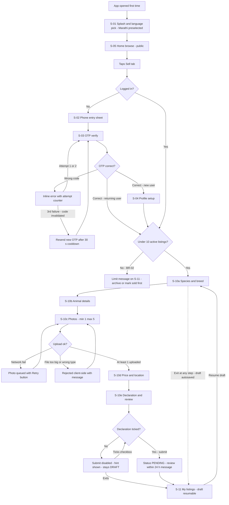
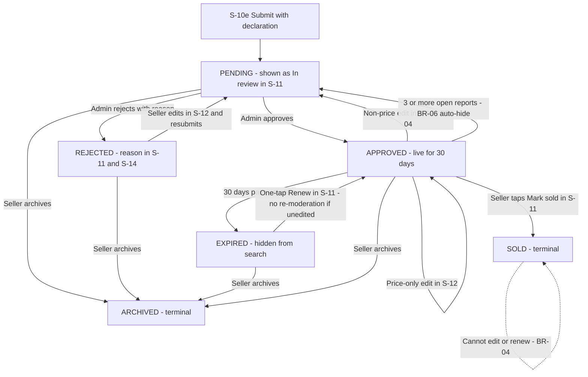
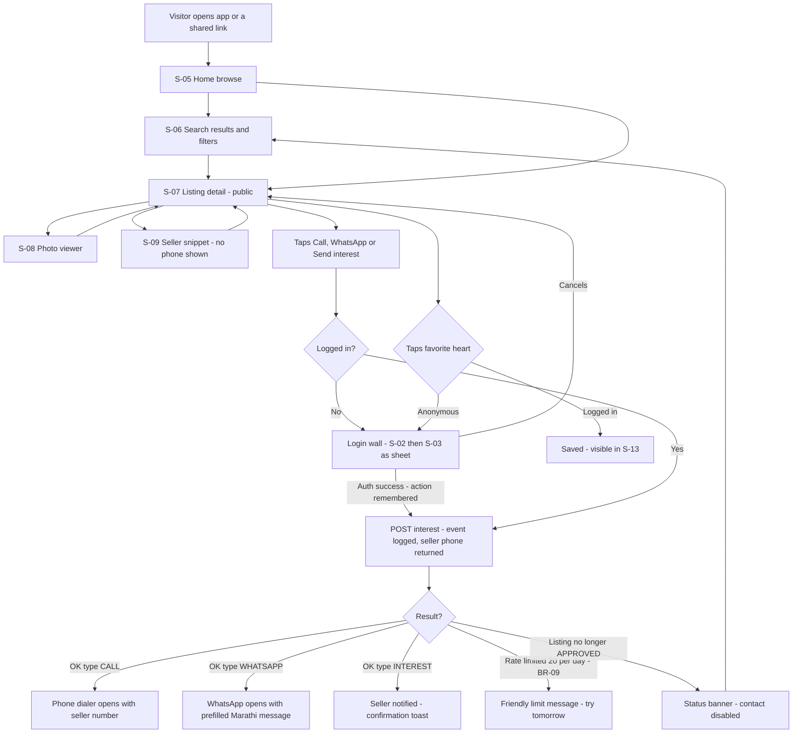
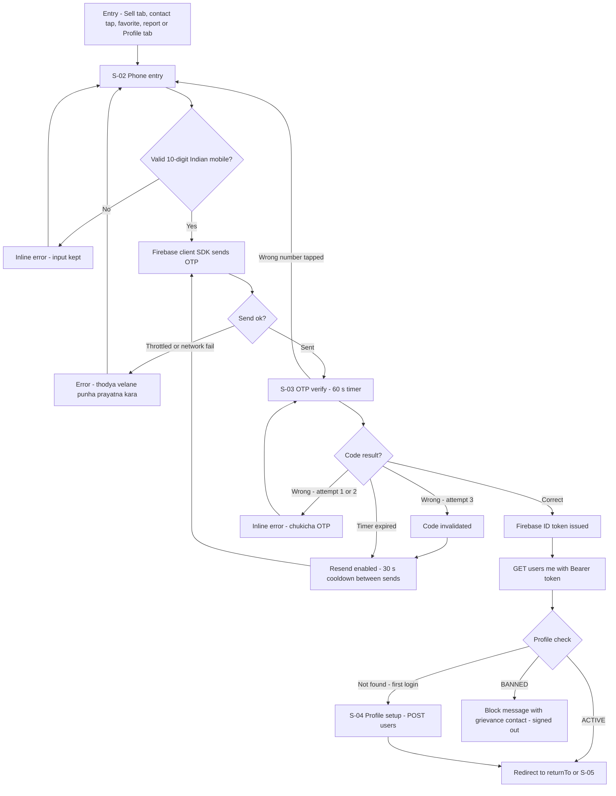
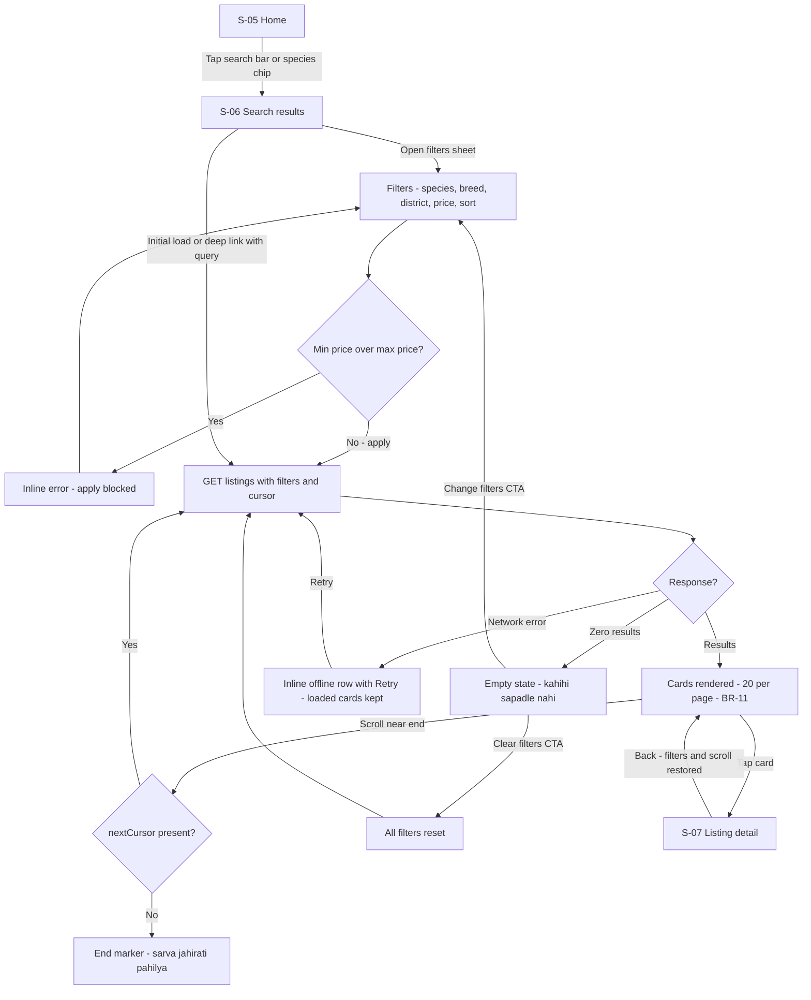
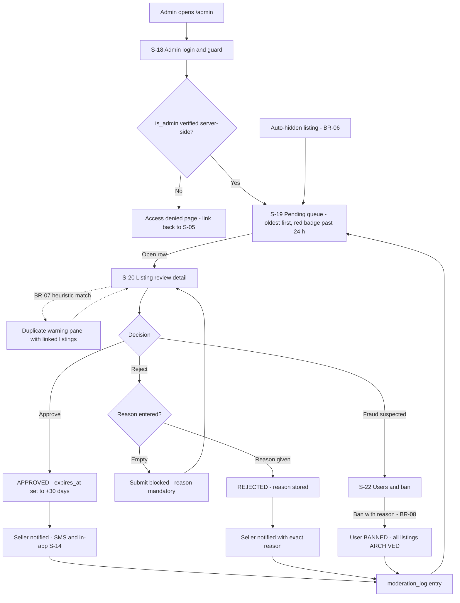
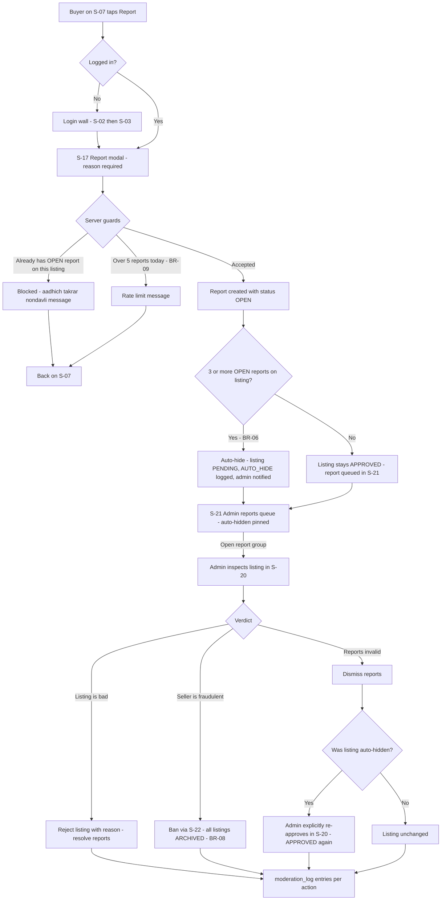
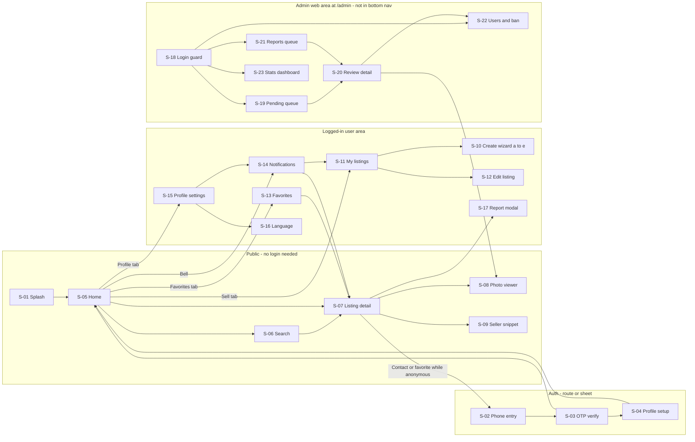

# 06 — User Flows & Screen Inventory

| Field | Value |
|---|---|
| **Status** | Draft |
| **Version** | 1.0 |
| **Owner** | Founder (Abhishek) |
| **Last updated** | 2026-07-04 |
| **Depends on** | [../00-foundation/README.md](../00-foundation/README.md) · [../01-prd/README.md](../01-prd/README.md) · [../03-users/README.md](../03-users/README.md) · [../04-business-rules/README.md](../04-business-rules/README.md) · [../05-features/README.md](../05-features/README.md) · [../08-api/README.md](../08-api/README.md) |

> This document **owns the canonical screen inventory** (stable ids `S-01`…`S-23`) and the canonical user flows of the PashuSetu MVP. Doc 10 ([../10-frontend-design-requirements/README.md](../10-frontend-design-requirements/README.md)) must design **exactly these screens under exactly these ids** — it may add visual states, never new screens or renumbered ids. Docs 05 (features), 08 (API), and 14 (testing) reference flows by their letter (Flow A–G) and screens by `S-xx`.

---

## 1. Purpose, scope and conventions

**Purpose.** Show every path a farmer, buyer, visitor, or admin can take through the MVP, including failure and edge branches, so that (a) the designer can produce wireframes without inventing behavior and (b) QA can derive end-to-end test cases directly from the diagrams (see [../14-testing-qa/README.md](../14-testing-qa/README.md)).

**Scope.** MVP only, per [../00-foundation/README.md](../00-foundation/README.md) §4. No chat, payments, auctions, AI, transport, insurance, or loan flows appear here (D6, MVP OUT list). Contact = click-to-call + WhatsApp deep link + logged "Send Interest" event.

**Conventions used throughout this doc:**

| Convention | Meaning |
|---|---|
| `S-xx` | Stable screen id. Never renumber. New screens in later phases continue from S-24. |
| `S-10a`…`S-10e` | Sub-steps of the create-listing wizard. One route, five steps (see §3.2). |
| Flow A–G | The seven canonical flows in §4. |
| BR-xx | Business rule id, owned by [../04-business-rules/README.md](../04-business-rules/README.md); restated in §2 for the rules this doc depends on. |
| API paths | Exactly the canonical `/api/v1` surface from [../08-api/README.md](../08-api/README.md). |
| Overlay | A modal/sheet rendered over its host screen; has its own `S-xx` id but no URL route. |
| Marathi copy | Real Devanagari with English gloss; the full copy deck lives in doc 10. Strings here are canonical and doc 10 must reuse them verbatim. |

**Statuses** referenced in flows are the D10 listing state machine states: `DRAFT`, `PENDING`, `APPROVED`, `SOLD`, `REJECTED`, `EXPIRED`, `ARCHIVED`. The full state machine spec is owned by [../04-business-rules/README.md](../04-business-rules/README.md); every transition drawn in this document is one of its canonical transitions.

---

## 2. Business rules this document depends on

Owned and fully specified in [../04-business-rules/README.md](../04-business-rules/README.md); restated here only so the flows are readable stand-alone. If this table and doc 04 ever diverge, doc 04 wins.

| BR id | Rule (short form) | Used in |
|---|---|---|
| BR-01 | Photos per listing: min 1, max 5 (recommend 3+), each ≤ 5 MB, JPEG/PNG/WebP. No video. | Flow A (S-10c) |
| BR-02 | Max 10 ACTIVE (non-terminal) listings per user. | Flow A, Flow B |
| BR-03 | Listing expires 30 days after approval; one-tap renew EXPIRED → APPROVED (+30 days), no re-moderation if unedited. | Flow B |
| BR-04 | Editing photos/description/attributes of an APPROVED listing → back to PENDING. Price-only edit keeps APPROVED. SOLD listings cannot be edited or renewed. | Flow B (S-12) |
| BR-05 | Moderation SLA target: 24 hours. | Flow A, Flow F |
| BR-06 | ≥ 3 OPEN reports on a listing auto-moves it to PENDING (hidden) and notifies admin. | Flow F, Flow G |
| BR-07 | Duplicate heuristic (admin-side warning only): same seller + same species + price within 10%, posted within 7 days. | Flow F (S-20) |
| BR-08 | Bans are manual by admin; banning archives all the user's listings. | Flow F, Flow G (S-22) |
| BR-09 | Rate limits: OTP by Firebase client SDK; API writes 60/min/user; interest events 20/day/buyer; reports 5/day/user. | Flows C, D, G |
| BR-10 | Browse/search/detail are public. Contact, favorites, listing creation require login. Seller phone is revealed only via `POST /listings/{id}/interest`; every reveal is logged. | Flows C, E |
| BR-11 | Pagination: cursor-based, default 20/page, max 50. | Flow E |
| BR-12 | Every submission requires the seller declaration (lawful ownership, sale complies with state law, NOT for slaughter); stored as `declaration_accepted` + timestamp. | Flow A (S-10e) |

---

## 3. Screen inventory (canonical — doc 10 reuses this verbatim)

### 3.1 Inventory table

23 top-level screens; the create-listing wizard (S-10) carries five sub-steps. Marathi names are the user-visible screen titles (simple rural register). Admin screens (S-18…S-23) ship **English-first** in MVP because admin is an internal user; their Marathi names are recorded for completeness only.

| Id | Screen (EN) | Marathi name | Purpose | Entry points | Primary actions |
|---|---|---|---|---|---|
| S-01 | Splash & language pick | भाषा निवडा ("choose language") | First-run brand splash; pick मराठी (default, pre-selected) or English. Shown once; choice stored locally and later synced to `language_pref`. | First app open; cleared app data | Select language → continue to S-05 |
| S-02 | Phone entry | मोबाईल नंबर टाका ("enter mobile number") | Collect 10-digit Indian mobile; trigger Firebase OTP send (client SDK, BR-09). Renders full-screen from Profile tab, or as a bottom sheet when invoked as a login wall. | Login wall (contact/favorite/report tap while anonymous), Sell tab while anonymous, Profile tab while anonymous | Enter number, "OTP पाठवा" (send OTP) → S-03; cancel → back to origin |
| S-03 | OTP verify | OTP टाका ("enter OTP") | 6-digit code entry with 60 s timer, attempt counter, resend with 30 s cooldown. | S-02 after successful send | Verify → S-04 (new) or destination (returning); resend; change number → S-02 |
| S-04 | Profile setup | प्रोफाइल तयार करा ("create profile") | First-login profile: name (required), district (picker, `GET /meta/districts`), taluka + village (optional), role flags "मला विकायचे आहे / मला विकत घ्यायचे आहे" (I want to sell / buy; both allowed, at least one required). Calls `POST /users`. | S-03 when `GET /users/me` returns not-found | Save → original destination or S-05 |
| S-05 | Home / browse | होम ("home") | Public landing: species category chips (गाय, म्हैस, बैल, शेळी, मेंढी), search bar, latest APPROVED listings feed, notification bell (badge, logged-in only). Bottom nav host. | S-01, app open (returning), bottom nav Home tab, deep link `/` | Tap category/search → S-06; tap card → S-07; bell → S-14 |
| S-06 | Search results + filters sheet | शोधा ("search") | Filterable, cursor-paginated results (`GET /listings`, BR-11). Filters bottom sheet: species, breed, district, min/max price, sort (newest / price low→high / price high→low). Filters reflected in URL query for shareability. | S-05 chips/search, deep link `/listings?…`, "clear filters" reset | Apply/clear filters, infinite scroll, tap card → S-07 |
| S-07 | Listing detail | जाहिरात तपशील ("listing details") | Public detail: photo carousel, price + negotiable badge, all attributes (breed, sex, age, milk yield, lactation, pregnant, vaccinated, weight), location (village, taluka, district), seller snippet, status banner when not APPROVED. Contact bar: कॉल करा / WhatsApp / आवड कळवा (call / WhatsApp / send interest). | S-05, S-06, S-13, S-14, shared deep link `/listings/{id}` | Contact (login-walled, BR-10), favorite, report → S-17, photos → S-08, seller → S-09 |
| S-08 | Photo viewer | फोटो पहा ("view photos") | Full-screen swipeable, pinch-zoom photo overlay with counter ("2/5"). | Tap any photo on S-07 or S-20 | Swipe, zoom, close → back to host screen |
| S-09 | Seller public profile snippet | विक्रेत्याची माहिती ("seller's info") | Bottom sheet on S-07: seller first name, village + district, member-since month, count of active listings. **No phone number** (BR-10 — reveal only via interest endpoint). | Tap seller row on S-07 | View other active listings by this seller → S-06 filtered; close |
| S-10 | Create listing wizard (host) | नवीन जाहिरात ("new listing") | Five-step wizard shell with progress dots, autosaving a DRAFT (`POST /listings` on first forward step, then `PATCH /listings/{id}`). Blocked with a friendly message if user already has 10 active listings (BR-02). | S-11 "+ नवीन जाहिरात" button, Sell tab when user has zero listings | Step navigation, save & exit → S-11 |
| S-10a | — Step 1: species & breed | जनावर व जात निवडा ("choose animal & breed") | Icon grid of 5 species; breed picker filtered by species (`GET /meta/breeds?species=`), incl. "गावठी / स्थानिक" (local/crossbred). | S-10 entry, back from S-10b | Select species + breed → S-10b |
| S-10b | — Step 2: details | जनावराचा तपशील ("animal's details") | Sex, age (years+months → `age_months`), weight (optional), milk yield l/day + lactation number (milch species), pregnant?, vaccinated?, short description. | S-10a next, back from S-10c | Fill fields → S-10c |
| S-10c | — Step 3: photos | फोटो टाका ("add photos") | 1–5 photos (BR-01) via camera or gallery; presigned R2 upload (`POST /uploads/presign` then `POST /listings/{id}/images`); per-photo progress, retry, delete, reorder. | S-10b next, back from S-10d | Upload ≥ 1 photo → S-10d |
| S-10d | — Step 4: price & location | किंमत व ठिकाण ("price & place") | Price in ₹ (integer), negotiable toggle ("किंमतीत बदल शक्य" — price negotiable), district (defaults from profile), taluka (optional), village. | S-10c next, back from S-10e | Set price + place → S-10e |
| S-10e | — Step 5: declaration & review | हमीपत्र व अंतिम तपासणी ("declaration & final check") | Read-only summary card of the whole listing + mandatory seller declaration checkbox (BR-12). Submit calls `POST /listings/{id}/submit` → PENDING. | S-10d next | Accept declaration + "तपासणीसाठी पाठवा" (send for review) → S-11 |
| S-11 | My listings | माझ्या जाहिराती ("my listings") | Seller hub: tabs for status groups — Drafts (अपूर्ण), In review (तपासणीत), Live (चालू), Sold (विकलेल्या), Rejected (नाकारलेल्या), Expired (मुदत संपलेल्या). Per-card actions by status; active-count meter "७/१०" (7/10) toward BR-02. Sell tab target. | Bottom nav Sell tab, post-submit redirect, S-14 notification taps | Resume draft → S-10, edit → S-12, mark sold, renew, archive, "+ नवीन जाहिरात" → S-10a |
| S-12 | Edit listing | जाहिरात बदला ("change listing") | Same form fields as the wizard, single scrollable page, pre-filled. Warning banner on APPROVED listings: non-price edits send the listing back for review (BR-04). Also the resubmit path for REJECTED (rejection reason pinned on top). | S-11 edit action, S-07 "Edit" shortcut on own listing | Save (price-only → stays APPROVED) / save & resubmit → PENDING |
| S-13 | Favorites | आवडत्या जाहिराती ("favorite listings") | Logged-in list of saved listings (`GET /users/me/favorites`); SOLD/EXPIRED items stay visible with a status tag. | Bottom nav Favorites tab | Tap card → S-07; unfavorite (swipe or heart) |
| S-14 | Notifications | सूचना ("notifications") | In-app notification list (`GET /users/me/notifications`): approved, rejected (+reason), interest received, expiry reminder, expired. Opening an item calls `POST /notifications/{id}/read` and deep-links to its subject. | Bell on S-05, SMS deep links, Profile row on S-15 | Tap item → S-07 or S-11; mark read |
| S-15 | Profile / settings | माझे प्रोफाइल ("my profile") | View/edit own profile (`GET/PATCH /users/me`): name, district, taluka, village, role flags; rows for language (→ S-16), notifications (→ S-14), help & grievance contact, T&C/privacy links, logout. | Bottom nav Profile tab | Edit fields, navigate rows, logout → S-05 |
| S-16 | Language settings | भाषा बदला ("change language") | Switch मराठी ↔ English; persists to `language_pref` via `PATCH /users/me` (and locally for anonymous users). | S-15 row; long-press language hint on S-01 | Pick language → back to S-15, UI re-renders instantly |
| S-17 | Report listing modal | तक्रार करा ("complain / report") | Modal over S-07: reason radio list (FAKE खोटी जाहिरात · SOLD_ALREADY आधीच विकले · WRONG_INFO चुकीची माहिती · SPAM स्पॅम · ILLEGAL बेकायदेशीर · OTHER इतर) + optional details. `POST /listings/{id}/report`, BR-09 (5/day). | Report button on S-07 (login-walled) | Submit → confirmation toast; cancel → S-07 |
| S-18 | Admin: login & guard | अ‍ॅडमिन प्रवेश ("admin entry") | `/admin` gate. Same Firebase phone OTP; server verifies `is_admin` on every `/admin/*` API call. Non-admins see access-denied with a link home. Desktop-first layout from here on. | Direct URL `/admin` | Login → S-19 (default redirect); denied → link to S-05 |
| S-19 | Admin: pending queue | प्रलंबित जाहिराती ("pending listings") | `GET /admin/listings?status=PENDING`, oldest first; age badge per row (red past 24 h, BR-05); auto-hidden listings flagged "reports"; duplicate-warning icon (BR-07). | S-18 login, admin nav | Open row → S-20; filter by status |
| S-20 | Admin: listing review detail | जाहिरात तपासणी ("listing inspection") | Full listing + photos (→ S-08), seller history (prior listings, prior rejections, open reports), duplicate-heuristic panel (BR-07), declaration timestamp. Approve / Reject (reason mandatory) / open seller in S-22. | S-19 row, S-21 report row, S-22 listing link | `POST /admin/listings/{id}/approve` or `/reject {reason}`; every action → `moderation_log` |
| S-21 | Admin: reports queue | तक्रारींची यादी ("list of complaints") | `GET /admin/reports?status=OPEN` grouped by listing with per-listing OPEN count; auto-hidden listings pinned on top (BR-06). | Admin nav, auto-hide notification | Open → S-20; `POST /admin/reports/{id}/resolve` / `/dismiss` |
| S-22 | Admin: users & ban | वापरकर्ते व्यवस्थापन ("user management") | User search (phone/name); profile with listing + report history; ban (reason mandatory) / unban. Ban archives all the user's listings (BR-08). | Admin nav, seller links from S-20/S-21 | `POST /admin/users/{id}/ban {reason}` / `/unban` |
| S-23 | Admin: stats dashboard | आकडेवारी ("statistics") | `GET /admin/stats` + `GET /admin/audit-log`: pending count & oldest-pending age, approvals/rejections (7/30 d), new users & listings, interest events, open reports, listings by district/species; audit-log table. | Admin nav | Read-only monitoring; drill-through links to queues |

### 3.2 Route map

Next.js App Router routes (D1). Overlays (S-08, S-09, S-17) and the login sheet render over their host route — no route of their own.

| Screen | Route | Access |
|---|---|---|
| S-01 | `/welcome` (redirected here from `/` only when no language stored) | Public |
| S-05 | `/` | Public |
| S-06 | `/listings` (+ query: `species`, `breedId`, `districtId`, `minPrice`, `maxPrice`, `sort`, `q`) | Public |
| S-07 | `/listings/[id]` | Public (only APPROVED and SOLD render; others show a "not available" state, §4.3) |
| S-08, S-09, S-17 | overlays on host route | as host |
| S-02, S-03 | `/login?returnTo=<path>` (two steps, one route); also rendered as a bottom-sheet login wall over any screen | Public |
| S-04 | `/profile/setup?returnTo=<path>` | Authenticated, profile missing |
| S-10 (a–e) | `/sell/new?step=1..5` (draft id held in state after first save) | Authenticated |
| S-11 | `/sell` | Authenticated |
| S-12 | `/sell/[id]/edit` | Authenticated (owner only) |
| S-13 | `/favorites` | Authenticated |
| S-14 | `/notifications` | Authenticated |
| S-15 | `/profile` | Authenticated |
| S-16 | `/profile/language` | Public (anonymous choice stored locally) |
| S-18 | `/admin` (redirects to `/admin/pending` when authorized) | Admin |
| S-19 | `/admin/pending` | Admin |
| S-20 | `/admin/listings/[id]` | Admin |
| S-21 | `/admin/reports` | Admin |
| S-22 | `/admin/users` | Admin |
| S-23 | `/admin/stats` | Admin |

**Login wall behavior (canonical):** any login-required action by an anonymous user opens S-02 as a bottom sheet with the pending action remembered; after S-03 (and S-04 for new users) succeeds, the user lands back on the originating screen and the pending action (contact reveal, favorite, report, sell) is executed automatically. Cancelling the sheet returns to the originating screen with nothing lost.

---

## 4. Canonical flows

### 4.1 Flow A — Farmer onboarding + first listing

**Narrative.** A first-time farmer opens the app, sees the Marathi-default language pick (S-01), and lands on the public home (S-05) — browsing needs no account (BR-10). Tapping the Sell tab raises the login wall: phone entry (S-02), OTP (S-03) with wrong-code and resend branches, then profile setup (S-04) because this user is new. The five-step wizard (S-10a–S-10e) autosaves a DRAFT from the first forward step, so the farmer can quit anytime and resume from My Listings (S-11). Photos upload one-by-one with per-photo retry (BR-01). Submission is impossible without ticking the seller declaration (BR-12); declining simply leaves a resumable DRAFT — never a lost listing. On submit the listing becomes PENDING and the farmer sees the 24-hour review promise (BR-05).

**Edge cases — Flow A**

| Situation | Expected behavior | Screen |
|---|---|---|
| User declines/never ticks declaration | Submit button disabled with hint "हमीपत्र स्वीकारल्याशिवाय जाहिरात पाठवता येणार नाही" (listing cannot be sent without accepting the declaration); DRAFT retained | S-10e |
| App killed / battery dies mid-wizard | DRAFT autosaved at last completed step; S-11 shows it under "अपूर्ण" (incomplete) with "पुढे चालू ठेवा" (continue) | S-10, S-11 |
| Photo upload fails (network) | Photo shows failed state with retry; other photos unaffected; Next blocked until ≥ 1 photo succeeds (BR-01) | S-10c |
| Photo > 5 MB or unsupported format | Rejected client-side before upload; server presign re-validates content-type + size (BR-01) | S-10c |
| 6th photo attempted | Add-photo button hidden at 5 (BR-01) | S-10c |
| Already 10 active listings | Wizard entry blocked; message shows count and suggests marking sold/archiving (BR-02) | S-11 |
| Wrong OTP 3 times | Code invalidated; must resend (30 s cooldown) | S-03 |
| Price left empty or 0 | Inline validation; Next disabled | S-10d |
| Fresh user exits before S-04 completes | No `users` row yet; next login re-enters S-04 (server has no profile) | S-04 |

---

### 4.2 Flow B — Listing lifecycle (seller perspective)

**Narrative.** After submission the seller tracks the listing in S-11. PENDING becomes APPROVED (live 30 days, BR-03) or REJECTED with a mandatory admin reason surfaced in S-11 and S-14. A rejected listing is fixed in S-12 and resubmitted to PENDING. A live listing can be marked SOLD (terminal), edited (price-only keeps APPROVED; anything else returns to PENDING per BR-04), auto-hidden back to PENDING by ≥ 3 open reports (BR-06), or it EXPIRES after 30 days. Expired listings renew with one tap back to APPROVED without re-moderation if unedited (BR-03); to *change* an expired listing the seller renews first, then edits — which triggers normal BR-04 re-moderation. Any non-terminal listing can be archived. SOLD and ARCHIVED never return to the market.

**Edge cases — Flow B**

| Situation | Expected behavior | Screen |
|---|---|---|
| Seller tries to edit a SOLD listing | Edit/renew actions not rendered on SOLD cards (BR-04) | S-11 |
| Seller wants to change an EXPIRED listing | Renew first (→ APPROVED), then edit; non-price edit then re-moderates per BR-04 | S-11, S-12 |
| Non-price edit of live listing | Confirm dialog: "बदल केल्यास जाहिरात पुन्हा तपासणीत जाईल" (after changes the listing goes back for review); on confirm → PENDING | S-12 |
| Price-only edit | Saves instantly, stays APPROVED, no dialog (BR-04) | S-12 |
| Listing auto-hidden by reports while seller watches | Card moves to "तपासणीत" (in review); notification in S-14 | S-11, S-14 |
| Expiry approaching | In-app reminder notification 3 days before `expires_at`; SMS + in-app on expiry day | S-14 |
| Renew tapped when listing count already at 10 active | Renew still allowed only if resulting active count ≤ 10; otherwise blocked with BR-02 message | S-11 |
| Mark-sold mis-tap | Confirm dialog "विकले गेले म्हणून नोंद करायची का? हे परत बदलता येणार नाही." (Mark as sold? This cannot be undone.) | S-11 |
| Rejected twice for same reason | Rejection reason history visible on S-12 banner so seller can fix properly | S-12 |

---

### 4.3 Flow C — Buyer: browse → filter → detail → contact

**Narrative.** Anyone — no account — can browse home (S-05), search and filter (S-06), and open listing details (S-07) including photos (S-08) and the seller snippet (S-09, which never shows the phone number). The trust boundary is the contact bar: tapping कॉल करा, WhatsApp, or आवड कळवा while anonymous raises the login wall; after login the remembered action executes automatically. The contact action calls `POST /listings/{id}/interest` which logs the event and returns the seller's phone (BR-10) — then the dialer or WhatsApp opens with a prefilled Marathi message. Rate limiting (20 interest events/day, BR-09) and stale-status listings (sold/expired mid-browse) are handled with friendly, non-blocking messaging.

**Edge cases — Flow C**

| Situation | Expected behavior | Screen |
|---|---|---|
| Listing turns SOLD between list and detail view | S-07 shows "हे जनावर विकले गेले आहे" banner; contact bar hidden; similar-listings CTA → S-06 | S-07 |
| Shared link to PENDING/REJECTED/EXPIRED/ARCHIVED/DRAFT listing | "ही जाहिरात आता उपलब्ध नाही" (this listing is no longer available) state with browse CTA → S-05 (owner sees their own listing normally) | S-07 |
| Viewer is the listing's own seller | Contact bar replaced by "जाहिरात बदला" (edit listing) shortcut → S-12 | S-07 |
| WhatsApp not installed | `wa.me` universal link opens in browser; revealed phone number stays visible on S-07 for a manual call | S-07 |
| Interest rate limit reached (BR-09) | Toast "आजची मर्यादा संपली. उद्या पुन्हा प्रयत्न करा." (today's limit is over, try again tomorrow); browsing unaffected | S-07 |
| Banned buyer taps contact | API 403; message directs to grievance contact (see §7); session signed out | S-07 |
| Anonymous favorite tap | Login wall; favorite applied automatically after login | S-07 |
| Login wall cancelled | Sheet closes; user remains on S-07 with nothing lost | S-07 |
| Duplicate interest same listing same day | Allowed within the 20/day cap — each reveal is logged as its own event (metric requirement) | S-07 |

---

### 4.4 Flow D — Authentication (Firebase phone OTP)

**Narrative.** All OTP sending/verifying happens in the Firebase client SDK — the backend never sends OTPs (BR-09). S-02 validates a 10-digit Indian mobile before invoking Firebase; send failures (throttling, network) surface as retryable errors. S-03 runs a 60-second timer: resend unlocks on expiry, always with a 30-second cooldown between sends. Three wrong codes invalidate the code and force a resend. On success the client gets a Firebase ID token and calls `GET /users/me` with `Authorization: Bearer <token>`: not-found routes to profile setup (S-04 → `POST /users`), ACTIVE routes to `returnTo` or home, BANNED shows a block message and signs out. Session persistence and silent token refresh are handled by the SDK, so returning users skip this flow entirely.

**Edge cases — Flow D**

| Situation | Expected behavior | Screen |
|---|---|---|
| Invalid phone (letters, < 10 digits, non-Indian prefix) | Inline validation before any Firebase call; send disabled | S-02 |
| Firebase throttling (too many requests) | "थोड्या वेळाने पुन्हा प्रयत्न करा" (try again after a while); no counter shown to avoid abuse probing | S-02 |
| SMS never arrives | Resend unlocked at timer expiry (60 s); after 3 resends in a session, hint suggests checking the number and trying later (Firebase quota also applies) | S-03 |
| Wrong code 3 times | Code invalidated; verify disabled until a fresh code is sent | S-03 |
| User entered wrong phone number | "नंबर बदला" (change number) link → back to S-02 with input kept | S-03 |
| Auto-read OTP (WebOTP API) fails | Manual entry always available; auto-read is progressive enhancement only | S-03 |
| Banned user authenticates | Firebase succeeds but API returns banned status → block screen, sign-out, grievance contact shown | S-03 |
| ID token expires mid-session | Firebase SDK silently refreshes; on hard failure, login wall opens preserving `returnTo` | any |
| User closes app between S-03 and S-04 | Firebase session persists; next open routes straight to S-04 (profile still missing) | S-04 |

---

### 4.5 Flow E — Search & filter

**Narrative.** Search (S-06) is driven entirely by `GET /listings` with cursor pagination (BR-11: 20/page, max 50) and only returns APPROVED listings. The filters sheet covers species, breed (dependent on species), district, price range, and sort; applied filters render as removable chips and are mirrored into the URL so results are shareable. Infinite scroll fetches the next cursor until exhausted. The empty state never strands the user: it offers one-tap filter reset and a broaden-district shortcut. Network failures show an inline retry without wiping already-loaded results, and going back from a detail page restores both filters and scroll position — critical on 3G (product principle 5).

**Edge cases — Flow E**

| Situation | Expected behavior | Screen |
|---|---|---|
| Zero results for filter combo | Empty state "काहीही सापडले नाही. फिल्टर बदलून पुन्हा पहा." + "फिल्टर काढा" reset CTA + change-filters CTA | S-06 |
| min price > max price | Apply blocked with inline error under the price fields | S-06 filters sheet |
| Species changed after breed selected | Breed selection resets; breed list re-fetched via `GET /meta/breeds?species=` | S-06 filters sheet |
| Network drop mid-scroll | Inline retry row appended; existing cards stay rendered | S-06 |
| Stale/invalid cursor (listing set changed) | API responds with error envelope; client silently restarts from first page | S-06 |
| Deep link with filter query params | S-06 hydrates the sheet and chips from URL before first fetch | S-06 |
| Listing sold/expired after page cached | Card still shown; S-07 handles status truthfully (Flow C) | S-06 → S-07 |
| Rapid repeated filter changes | In-flight request cancelled; only the latest query renders (no flash of stale results) | S-06 |
| End of results | Terminal row "सर्व जाहिराती पाहिल्या" (you have seen all listings) — visible stop, not a spinner | S-06 |

---

### 4.6 Flow F — Admin moderation

**Narrative.** Admin lives at `/admin` (S-18): same Firebase OTP, but every `/admin/*` API verifies `is_admin` server-side — non-admins get an access-denied page with a link home. The pending queue (S-19) sorts oldest-first with age badges that turn red past the 24-hour SLA (BR-05); auto-hidden listings (BR-06) are flagged distinctly. Review (S-20) shows the full listing, seller history, declaration timestamp, and a duplicate warning when the BR-07 heuristic matches. Approve sets `expires_at` = +30 days and notifies the seller (SMS + in-app); Reject demands a written reason, which travels verbatim to the seller. Every action writes to `moderation_log` and returns the admin to the queue for the next item.

**Edge cases — Flow F**

| Situation | Expected behavior | Screen |
|---|---|---|
| Non-admin opens `/admin` | Access-denied page (no admin data leaked); link back to S-05; API layer independently rejects (defense in depth, see [../12-security/README.md](../12-security/README.md)) | S-18 |
| Reject with empty reason | Blocked client- and server-side; reason mandatory (state machine rule) | S-20 |
| Two admin sessions act on the same listing | Second action gets a conflict error (listing no longer PENDING); S-20 refreshes to actual state | S-20 |
| Queue empty | "All caught up" empty state with links to S-21 and S-23 | S-19 |
| Pending item older than 24 h | Row pinned to top with red SLA badge (BR-05) | S-19 |
| Duplicate heuristic fires (BR-07) | Warning panel with links to the suspected originals; advisory only — admin still decides | S-20 |
| Listing photos suspicious | Photos open in S-08 full-screen zoom from S-20 for close inspection | S-20, S-08 |
| Listing suggests slaughter intent | Reject citing the legal rule; repeated attempts → ban path (foundation §8, [../16-legal/README.md](../16-legal/README.md)) | S-20, S-22 |
| Seller edits listing while admin reviews | Listing was already PENDING; edits update the same pending record — admin sees latest on refresh | S-20 |

---

### 4.7 Flow G — Report handling

**Narrative.** A logged-in buyer reports a listing from S-07 via the report modal (S-17): one mandatory reason from the fixed enum, optional details. Guards: one OPEN report per user per listing, max 5 reports/day (BR-09). Each accepted report is OPEN; when a listing accumulates ≥ 3 OPEN reports it is auto-hidden — status flips to PENDING, an `AUTO_HIDE` entry lands in `moderation_log`, and the admin is notified (BR-06). In the reports queue (S-21) the admin inspects the listing (S-20) and either resolves the reports (typically rejecting the listing with a reason, or banning a fraudulent seller — which archives all their listings, BR-08) or dismisses them. Dismissal never silently re-publishes: an auto-hidden listing returns to market only through an explicit admin approve on S-20.

**Edge cases — Flow G**

| Situation | Expected behavior | Screen |
|---|---|---|
| Same user re-reports same listing | Blocked while their prior report is OPEN: "तुमची तक्रार आधीच नोंदवली आहे" (your complaint is already recorded) | S-17 |
| 6th report of the day (BR-09) | Rate-limit message; existing reports unaffected | S-17 |
| Report reason OTHER without details | Details become required for OTHER only; other reasons keep details optional | S-17 |
| Report button on non-APPROVED listing | Report is offered only on APPROVED listings; SOLD and unavailable states hide it | S-07 |
| Threshold crossed (3rd OPEN report) | Instant auto-hide → PENDING, `AUTO_HIDE` in `moderation_log`, admin notified (BR-06); seller sees "तपासणीत" in S-11 | S-11, S-21 |
| Admin dismisses all reports on auto-hidden listing | Listing stays PENDING until admin explicitly approves on S-20 — no silent re-publish | S-20, S-21 |
| Reporter checks outcome | MVP: no per-report status UI for reporters; confirmation toast only (kept out to save scope) | S-17 |
| Malicious mass-reporting ring | Caps (1/listing/user + 5/day) blunt it; admin dismisses and may ban reporters from S-22 (BR-08) | S-21, S-22 |
| Seller of reported listing gets banned | All their listings → ARCHIVED; open reports on them resolved in the same admin action | S-22 |

---

## 5. Navigation map

### 5.1 Screen-to-screen graph

### 5.2 Bottom navigation (user PWA)

Four fixed tabs, always visible on top-level user screens (hidden inside the wizard S-10 and on overlays to prevent accidental exits — wizard has its own save-and-exit).

| Tab | Label (MR / EN) | Icon | Target | Anonymous behavior |
|---|---|---|---|---|
| 1 | होम / Home | house | S-05 | Works — public (BR-10) |
| 2 | विका / Sell | plus-circle | S-11 (deep-links straight into S-10a when the user has zero listings) | Login wall → then target |
| 3 | आवडते / Favorites | heart | S-13 | Login wall → then target |
| 4 | प्रोफाइल / Profile | person | S-15 | Login wall → then target |

### 5.3 Admin area placement

- Admin screens (S-18…S-23) live at **`/admin/*`** in the same Next.js codebase (D1) — a separate web area with its own sidebar navigation (Pending · Reports · Users · Stats), **not** in the PWA bottom nav and never linked from any user-facing screen.
- Desktop-first layout, English-first UI (internal user; Marathi names in §3.1 are for reference only).
- Guarded twice: UI route guard on `is_admin` (S-18) + server-side verification of the Firebase ID token and `is_admin` on every `/api/v1/admin/*` call ([../12-security/README.md](../12-security/README.md)).

---

## 6. Canonical Marathi microcopy used in flows

Doc 10 owns the full copy deck; the strings below are canonical because flows in this doc depend on them. Simple, rural-friendly register (foundation principle 3 & 4).

| Key | Marathi (Devanagari) | English gloss | Screen |
|---|---|---|---|
| declaration.text | मी घोषित करतो/करते की मी या जनावराचा कायदेशीर मालक आहे. ही विक्री महाराष्ट्र राज्याच्या कायद्यानुसार आहे आणि हे जनावर कत्तलीसाठी विकले जात नाही. | I declare that I am the lawful owner of this animal. This sale complies with Maharashtra state law and this animal is not being sold for slaughter. | S-10e |
| submit.success | तुमची जाहिरात तपासणीसाठी पाठवली आहे. २४ तासांच्या आत उत्तर मिळेल. | Your listing has been sent for review. You will get an answer within 24 hours. | S-10e |
| loginwall.title | विक्रेत्याशी बोलण्यासाठी आधी लॉगिन करा | To talk to the seller, log in first | S-02 sheet |
| otp.wrong | चुकीचा OTP. पुन्हा प्रयत्न करा. | Wrong OTP. Try again. | S-03 |
| otp.resend | OTP पुन्हा पाठवा | Send OTP again | S-03 |
| search.empty | काहीही सापडले नाही. फिल्टर बदलून पुन्हा पहा. | Nothing found. Change the filters and look again. | S-06 |
| search.clear | फिल्टर काढा | Remove filters | S-06 |
| search.end | सर्व जाहिराती पाहिल्या | You have seen all listings | S-06 |
| listing.soldBanner | हे जनावर विकले गेले आहे | This animal has been sold | S-07 |
| listing.unavailable | ही जाहिरात आता उपलब्ध नाही | This listing is no longer available | S-07 |
| interest.whatsappPrefill | नमस्कार, मी पशुसेतूवर तुमची जाहिरात पाहिली. जनावराबद्दल माहिती हवी आहे. | Hello, I saw your listing on PashuSetu. I want information about the animal. | S-07 |
| interest.limit | आजची मर्यादा संपली. उद्या पुन्हा प्रयत्न करा. | Today's limit is over. Try again tomorrow. | S-07 |
| myListings.renew | ३० दिवसांसाठी पुन्हा सुरू करा | Restart for 30 days | S-11 |
| myListings.markSold | विकले गेले म्हणून नोंद करा | Mark as sold | S-11 |
| markSold.confirm | विकले गेले म्हणून नोंद करायची का? हे परत बदलता येणार नाही. | Mark as sold? This cannot be undone. | S-11 |
| edit.remoderationWarning | बदल केल्यास जाहिरात पुन्हा तपासणीत जाईल | If you make changes, the listing will go back for review | S-12 |
| report.success | तुमची तक्रार नोंदवली आहे. आम्ही लवकरच तपासू. | Your complaint is recorded. We will check soon. | S-17 |
| report.duplicate | तुमची तक्रार आधीच नोंदवली आहे | Your complaint is already recorded | S-17 |
| error.offline | इंटरनेट नाही. पुन्हा प्रयत्न करा. | No internet. Try again. | global |

---

## 7. Dead-end audit

Stated success criterion (Phase 1 Sprint 6): **every screen is connected; no dead ends.** Verified per flow below, plus seven global invariants.

**Global invariants (apply to every screen):**

1. **Back always works.** Every non-tab screen has a visible back affordance and honors the hardware/browser back, returning to its entry point (PWA history stack, D9).
2. **Bottom nav is the escape hatch.** All top-level user screens show the 4-tab nav; from anywhere in the user area, Home is one tap away. The wizard hides the nav but always offers "जतन करून बाहेर पडा" (save and exit) → S-11.
3. **Every error state has retry or an alternate path** (offline rows, upload retries, OTP resend).
4. **Every empty state has a CTA** (S-06 → clear filters; S-11 → create listing; S-13 → browse; S-14 → browse; S-19 → other admin queues).
5. **Overlays are always dismissible** (S-08, S-09, S-17, login sheet) via close button, scrim tap, and back gesture — landing exactly where the user was.
6. **Banned is not a black hole**: the block screen names the grievance contact **support@pashusetu.in** (IT Rules 2021 grievance mechanism, [../16-legal/README.md](../16-legal/README.md)).
7. **Terminal listing states point forward**: SOLD/ARCHIVED cards in S-11 sit beside a permanent "+ नवीन जाहिरात" CTA.

**Per-flow audit:**

| Flow | How the user always has a way forward/back |
|---|---|
| A — Onboarding + first listing | Language pick cannot be skipped into a void (default मराठी proceeds); login wall is cancellable back to origin; OTP failure always resolves via retry/resend/change-number; every wizard step has Back + save-and-exit; drafts are resumable from S-11 forever; declaration decline leaves a resumable DRAFT, never a discard; the 10-listing cap message links to the S-11 actions (mark sold/archive) that free a slot. |
| B — Listing lifecycle | Every non-terminal state has ≥ 1 seller action: PENDING → wait (visible SLA) or archive; REJECTED → edit+resubmit or archive; APPROVED → edit/mark-sold/archive; EXPIRED → renew or archive. Terminal SOLD/ARCHIVED point to creating the next listing. No state exists without a rendered next step in S-11. |
| C — Buyer contact | Anonymous users are never trapped: the login wall is cancellable and returns to S-07. Sold/unavailable listings offer browse/similar CTAs instead of dead contact buttons. Rate-limit and 403 errors are informational toasts that leave browsing fully usable. |
| D — Authentication | Every failure loops to a usable state: invalid phone → corrected input; send failure → retry; wrong code → retry then resend; timer expiry → resend; wrong number → change number. BANNED shows the grievance contact and returns the user to public browsing (S-05), which never requires login. |
| E — Search & filter | Empty results offer reset and re-filter CTAs; network errors keep loaded results and offer retry; filter validation errors block only the Apply button, never navigation; back from S-07 restores filters + scroll, so exploration never loses context. |
| F — Admin moderation | Every queue row resolves to approve/reject/ban — nothing can remain unactionable; blocked reject (empty reason) keeps the form editable; conflict errors refresh to the true state; empty queue links onward to S-21/S-23; access-denied links back to S-05. |
| G — Report handling | Reporter guards (duplicate/rate-limit) return the buyer to S-07 with clear messaging; every OPEN report terminates in resolve or dismiss; auto-hidden listings always have an explicit admin path back to APPROVED (re-approve on S-20) or out of market (reject/archive/ban) — no listing can be stranded hidden without an owner action pending in S-21. |

---

## 8. Handoff contract to doc 10 (design requirements)

[../10-frontend-design-requirements/README.md](../10-frontend-design-requirements/README.md) must:

1. Produce wireframes/hi-fi for **all 23 screens + 5 wizard sub-steps** under the exact `S-xx` ids of §3.1 (Figma page names prefixed with the id, e.g. "S-07 Listing detail").
2. Design **all states drawn in the flows**: loading, empty, error/offline, rate-limited, sold/unavailable banners, SLA badges, draft-resume cards.
3. Reuse the §6 Marathi strings verbatim; extend (not replace) them in the copy deck.
4. Respect the navigation of §5: 4-tab bottom nav, wizard without bottom nav, `/admin` as a separate desktop-first area.
5. Honor foundation principles 3–5: icon+text pairing, minimal typing (pickers over free text everywhere except village and description), 3G-first weight budgets.

---

## Acceptance checklist

- [x] Screen inventory assigns stable ids S-01…S-23 (+ S-10a…S-10e) covering every MVP screen from the assignment list, with EN name, Marathi name, purpose, entry points, and primary actions per screen
- [x] All seven flows (A–G) present, each with a mermaid flowchart containing both happy path and failure/edge branches
- [x] Every flow has a 5–10 line narrative and an edge-case table (situation / expected behavior / screen id)
- [x] Screen ids S-xx used consistently in every flowchart node and edge-case table
- [x] Navigation map provided as a mermaid graph using S-xx ids; bottom nav (Home, Sell, Favorites, Profile) defined; admin placed in a separate `/admin` area outside the bottom nav
- [x] Dead-end audit states, per flow plus global invariants, how the user always has a way forward/back
- [x] All flows consistent with locked decisions D1–D10 (no chat, no payments, no separate backend, PWA, moderation-before-visibility) and with the canonical listing state machine transitions
- [x] All business-rule constants match canonical values (photos 1–5 ≤ 5 MB, 10 active listings, 30-day expiry, 24 h SLA, ≥ 3 reports auto-hide, rate limits 60/min · 20/day · 5/day, cursor pagination 20/50, declaration required) and are cited by BR-xx ids
- [x] All referenced API endpoints exactly match the canonical `/api/v1` surface (no invented endpoints)
- [x] Marathi strings are real Devanagari in a simple rural register with English glosses
- [x] All eight mermaid blocks use quoted labels, no parentheses inside node labels, and valid flowchart syntax
- [x] No TBD/TODO/open questions; header table and relative cross-links to docs 00, 01, 03, 04, 05, 08, 10, 12, 14, 16 present
