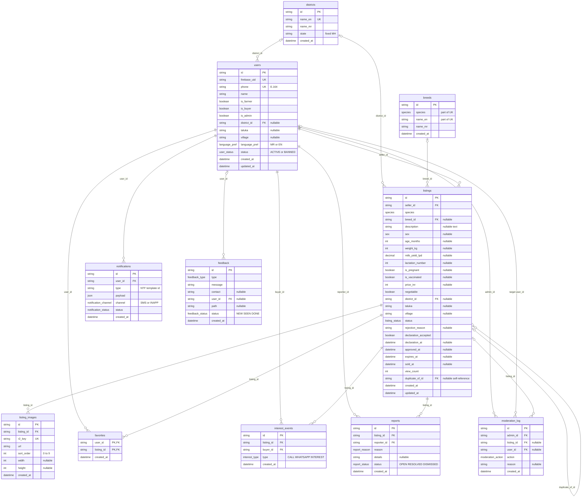
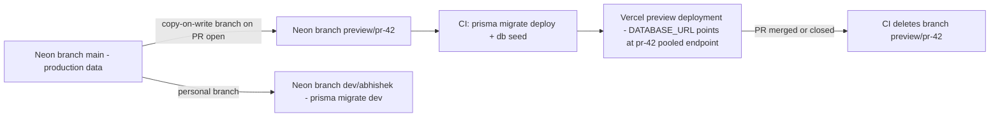

# 07 — Database Design (Neon PostgreSQL + Prisma)

| Field | Value |
|---|---|
| **Status** | Draft |
| **Version** | 1.1 |
| **Owner** | Founder (Abhishek) |
| **Last updated** | 2026-07-14 |
| **Depends on** | [../00-foundation/README.md](../00-foundation/README.md) · [../01-prd/README.md](../01-prd/README.md) · [../04-business-rules/README.md](../04-business-rules/README.md) · [../06-user-flows/README.md](../06-user-flows/README.md) |

> This document **owns the physical data model**: the Prisma schema, every index, every constraint, the seed data, and the migration process. The canonical entity/field names come from the foundation-level data model sketch and are used verbatim here (snake_case in the database, camelCase in Prisma client / API JSON). Business behavior (state machine, limits, validation semantics) is owned by [../04-business-rules/README.md](../04-business-rules/README.md) and cited by `BR-xxx` id; API request/response shapes are owned by [../08-api/README.md](../08-api/README.md); the image pipeline and jobs are owned by [../09-backend/README.md](../09-backend/README.md); backups/PITR by [../13-deployment/README.md](../13-deployment/README.md). Stack is locked: **Neon PostgreSQL via Prisma ORM** (decision D2), consumed only from Next.js route handlers (D1).

---

## 1. Design principles & naming conventions

### 1.1 Principles

| # | Principle | Consequence |
|---|---|---|
| P-1 | **DB is snake_case, code is camelCase.** Every model uses `@@map` to a snake_case table name and `@map` on every multi-word column. Prisma client and API JSON ([../08-api/README.md](../08-api/README.md)) therefore stay camelCase with zero manual mapping code. | `firebaseUid` ↔ `firebase_uid`, `listing_images`, etc. |
| P-2 | **Table names are plural snake_case** (`users`, `listings`, `listing_images`, `favorites`, `interest_events`, `reports`, `notifications`, `breeds`, `districts`) with **two singular exceptions**: `moderation_log` (as fixed by the foundation data model — "the log" is one ledger) and `feedback` (a mass noun with no natural plural; `@@map("feedback")`). | Never rename; other docs already reference these names. |
| P-3 | **IDs are cuid strings** generated by Prisma (`@default(cuid())`), including seeded reference tables (`breeds`, `districts`). No DB extension (`uuid-ossp`, `pgcrypto`) is needed; ids are generated app-side. Seed rows are addressed by **natural unique keys** (`districts.name_en`; `breeds(species, name_en)`), not by hardcoded ids. | Matches the API convention "IDs are cuid strings" everywhere. |
| P-4 | **`created_at` on every table; `updated_at` only where rows mutate** — exactly `users` and `listings` (the only user-editable aggregates, and the canonical model defines `updated_at` only there). `reports` and `notifications` have single status transitions whose timestamps are recoverable elsewhere (report resolution time = the `RESOLVE_REPORT`/`DISMISS_REPORT` row in `moderation_log`, BR-046); `favorites`, `interest_events`, `listing_images`, `moderation_log` are append-only; `breeds`/`districts` change only via seed migrations. | No dead columns; append-only tables stay provably append-only. |
| P-5 | **Timestamps are `timestamptz`-semantics UTC** (Prisma `DateTime` → Postgres `timestamp(3)` stored/read as UTC; the API serializes ISO 8601 UTC). IST is a rendering concern only. | No timezone math in the DB. |
| P-6 | **Money is integer INR** (`price_inr int`, no paise — BR-026). Never float, never numeric for money. | Exact arithmetic, Indian digit grouping is a UI concern. |
| P-7 | **Enums live in Postgres as real enum types**, snake_case type names via `@@map` on each Prisma enum (`listing_status`, `report_reason`, …). Adding a value is an additive migration; removing one follows expand–contract (§7.4). | Type safety end to end. |
| P-8 | **Draft-tolerant nullability.** A `DRAFT` listing may be saved with any subset of fields (F-03 AC-1, wizard autosave in [../06-user-flows/README.md](../06-user-flows/README.md) Flow A). Therefore every field that is *required only at submit* (BR-022) is **nullable in the DB** and enforced as required by the service layer at `POST /listings/{id}/submit`, plus DB `CHECK` backstops (§9). Fields known at creation (`seller_id`, `species`) are `NOT NULL`. | The DB never blocks a legitimate autosave; the state machine guard (T-02) is the required-ness gate. |
| P-9 | **Read-optimized indexing.** The workload is extremely read-heavy (public browse/SEO) with tiny write volume (≤ 50 listing submissions/day, NFR-12). We index generously for every search/filter/sort/job pattern (§4) and accept the negligible write overhead. | p95 `GET /listings` ≤ 500 ms (NFR-03) achievable on index scans alone. |
| P-10 | **Referential integrity fails loudly.** `onDelete: Restrict` is the default; `Cascade` only where a child row is meaningless without its parent *and* deletion is an intended flow (BR-015). No polymorphic FKs, no relationMode emulation — real Postgres foreign keys. | See per-relation justification in §2.1. |

### 1.2 Soft-delete policy (decision)

**There are no soft deletes and no `deleted_at` columns anywhere.** The two "removal" semantics in the product are modeled as status values, exactly as the state machine demands:

| Entity | "Removed" representation | Rule |
|---|---|---|
| `listings` | `status = ARCHIVED` (terminal; seller archive T-11, admin ban T-12, account deletion BR-015). Rows are never hard-deleted. | BR-028, BR-032 |
| `users` | `status = BANNED` (reversible via unban). Account deletion = **anonymize in place** (phone/firebase_uid overwritten with `deleted:{id}`, name → "हटवलेला वापरकर्ता"), never row deletion — FKs from `listings`, `interest_events`, `reports`, `moderation_log` stay intact for the audit trail. | BR-014, BR-015 |
| `favorites`, `notifications` | Hard-deleted (user unfavorite; account deletion; 90-day notification purge per BR-071). These are the only tables where rows legitimately disappear. | BR-015, BR-071 |
| `interest_events`, `reports`, `moderation_log` | Append-only, retained forever (fraud/audit evidence; `moderation_log` is legally load-bearing per FR-12). | BR-046, BR-015 |

### 1.3 Naming summary

| Layer | Convention | Example |
|---|---|---|
| Postgres tables | plural snake_case (+ `moderation_log`) | `interest_events` |
| Postgres columns | snake_case | `milk_yield_lpd` |
| Postgres enum types | snake_case via `@@map` | `notification_channel` |
| Enum values | UPPER_SNAKE | `BULL_OX`, `SOLD_ALREADY` |
| Prisma models/fields | PascalCase / camelCase | `InterestEvent.milkYieldLpd` |
| Indexes | `<table>_<purpose>_idx` via `map:` | `listings_search_idx` |
| Check constraints (raw SQL, §9.2) | `<table>_<column>_check` | `listings_price_inr_check` |
| API JSON | camelCase (doc 08) | `milkYieldLpd` |

---

## 2. Complete Prisma schema

`prisma/schema.prisma` — complete and buildable. Prisma **5.x** (pinned `^5.15`), `prisma-client-js` generator. `DATABASE_URL` is the **Neon pooled** connection string (PgBouncer); `DIRECT_URL` is the direct connection used by `prisma migrate` (§8.3).

```prisma
generator client {
  provider = "prisma-client-js"
}

datasource db {
  provider = "postgresql"
  // Prisma 7 note (implementation finding, PS-001/PS-002, 2026-07-05): `url` and
  // `directUrl` are no longer allowed in schema files. The same split now lives in
  // prisma.config.ts (datasource.url = DIRECT_URL — CLI/migrations/studio) and in
  // lib/prisma.ts (runtime client on the pooled DATABASE_URL via driver adapter).
  // Semantics of the two URLs are unchanged — see §8.3.
}

// ---------- Enums (Postgres enum types, snake_case names) ----------

enum Species {
  COW
  BUFFALO
  BULL_OX
  GOAT
  SHEEP
  REDA // retired 2026-07-15 — dormant enum value kept only for archived rows; NOT listable (listable species = 5: COW/BUFFALO/BULL_OX/GOAT/SHEEP). No migration dropped it (expand–contract, §7.4).

  @@map("species")
}

enum Sex {
  FEMALE
  MALE

  @@map("sex")
}

enum ListingStatus {
  DRAFT
  PENDING
  APPROVED
  SOLD
  REJECTED
  EXPIRED
  ARCHIVED

  @@map("listing_status")
}

enum LanguagePref {
  MR
  EN

  @@map("language_pref")
}

enum UserStatus {
  ACTIVE
  BANNED

  @@map("user_status")
}

enum InterestType {
  CALL
  WHATSAPP
  INTEREST

  @@map("interest_type")
}

enum ReportReason {
  FAKE
  SOLD_ALREADY
  WRONG_INFO
  SPAM
  ILLEGAL
  OTHER

  @@map("report_reason")
}

enum ReportStatus {
  OPEN
  RESOLVED
  DISMISSED

  @@map("report_status")
}

enum NotificationChannel {
  SMS
  INAPP

  @@map("notification_channel")
}

enum NotificationStatus {
  PENDING
  SENT
  FAILED
  READ

  @@map("notification_status")
}

enum ModerationAction {
  APPROVE
  REJECT
  BAN
  UNBAN
  RESOLVE_REPORT
  DISMISS_REPORT
  AUTO_HIDE

  @@map("moderation_action")
}

enum FeedbackType {
  PROBLEM // अडचण — काहीतरी बिघडले / चालत नाही
  SUGGESTION // सूचना — नवीन कल्पना / मागणी
  OTHER // इतर

  @@map("feedback_type")
}

enum FeedbackStatus {
  NEW // नवीन — अजून पाहिले नाही
  SEEN // पाहिले
  DONE // सोडवले / पूर्ण

  @@map("feedback_status")
}

// ---------- Models ----------

model User {
  id           String       @id @default(cuid())
  firebaseUid  String       @unique @map("firebase_uid")
  phone        String       @unique // E.164, e.g. +919876543210 (BR-010)
  name         String
  isFarmer     Boolean      @default(true) @map("is_farmer")
  isBuyer      Boolean      @default(true) @map("is_buyer")
  isAdmin      Boolean      @default(false) @map("is_admin") // set manually only (BR-012)
  districtId   String?      @map("district_id")
  taluka       String?
  village      String?
  languagePref LanguagePref @default(MR) @map("language_pref")
  status       UserStatus   @default(ACTIVE)
  createdAt    DateTime     @default(now()) @map("created_at")
  updatedAt    DateTime     @updatedAt @map("updated_at")

  district          District?       @relation(fields: [districtId], references: [id], onDelete: Restrict)
  listings          Listing[]       @relation("SellerListings")
  favorites         Favorite[]
  interestEvents    InterestEvent[] @relation("BuyerInterestEvents")
  reports           Report[]        @relation("ReporterReports")
  notifications     Notification[]
  adminActions      ModerationLog[] @relation("ModerationAdmin")
  moderationEntries ModerationLog[] @relation("ModerationTargetUser")
  feedback          Feedback[]

  @@index([districtId], map: "users_district_idx")
  @@map("users")
}

model District {
  id        String   @id @default(cuid())
  nameEn    String   @unique @map("name_en")
  nameMr    String   @map("name_mr")
  state     String   @default("MH") // fixed "MH" in MVP; column is the multi-state extension point
  createdAt DateTime @default(now()) @map("created_at")

  users    User[]
  listings Listing[]

  @@map("districts")
}

model Breed {
  id        String   @id @default(cuid())
  species   Species
  nameEn    String   @map("name_en")
  nameMr    String   @map("name_mr")
  createdAt DateTime @default(now()) @map("created_at")

  listings Listing[]

  @@unique([species, nameEn], map: "breeds_species_name_key") // also serves GET /meta/breeds?species=
  @@map("breeds")
}

model Listing {
  id                  String        @id @default(cuid())
  sellerId            String        @map("seller_id")
  species             Species
  breedId             String?       @map("breed_id") // required at submit (BR-022); nullable for DRAFT (P-8)
  description         String?       @db.Text // 10–1000 chars at submit (BR-025); nullable for DRAFT (P-8)
  sex                 Sex? // required at submit (BR-022)
  ageMonths           Int?          @map("age_months") // 1–300 (BR-022)
  weightKg            Int?          @map("weight_kg") // optional, 5–1500 (BR-022)
  milkYieldLpd        Decimal?      @map("milk_yield_lpd") @db.Decimal(4, 1) // 0–60 L/day; 0 = dry (BR-022)
  lactationNumber     Int?          @map("lactation_number") // 0–15; 0 = not yet calved (BR-022)
  isPregnant          Boolean?      @map("is_pregnant")
  isVaccinated        Boolean?      @map("is_vaccinated")
  priceInr            Int?          @map("price_inr") // ₹500–₹10,00,000 at submit (BR-026)
  negotiable          Boolean       @default(true) // UI copy only, never behavior (BR-026)
  districtId          String?       @map("district_id") // required at submit (BR-022)
  taluka              String?
  village             String? // required at submit (BR-022)
  status              ListingStatus @default(DRAFT)
  rejectionReason     String?       @map("rejection_reason") // taxonomy code + free text (BR-043)
  declarationAccepted Boolean       @default(false) @map("declaration_accepted") // BR-027
  declarationAt       DateTime?     @map("declaration_at") // refreshed on every submit (BR-027)
  approvedAt          DateTime?     @map("approved_at") // set on every T-03 approval
  expiresAt           DateTime?     @map("expires_at") // approval/renewal + 30 days (BR-073)
  soldAt              DateTime?     @map("sold_at") // set by T-06
  viewCount           Int           @default(0) @map("view_count") // BR-034: +1 per public detail fetch
  duplicateOfId       String?       @map("duplicate_of_id") // BR-029 heuristic match, advisory only
  createdAt           DateTime      @default(now()) @map("created_at")
  updatedAt           DateTime      @updatedAt @map("updated_at")

  seller      User      @relation("SellerListings", fields: [sellerId], references: [id], onDelete: Restrict)
  breed       Breed?    @relation(fields: [breedId], references: [id], onDelete: Restrict)
  district    District? @relation(fields: [districtId], references: [id], onDelete: Restrict)
  duplicateOf Listing?  @relation("ListingDuplicateOf", fields: [duplicateOfId], references: [id], onDelete: SetNull)
  flaggedAsDuplicate Listing[] @relation("ListingDuplicateOf")

  images         ListingImage[]
  favorites      Favorite[]
  interestEvents InterestEvent[]
  reports        Report[]
  moderationLogs ModerationLog[]

  // §4 explains every index and which required pattern it serves.
  @@index([status, species, districtId, createdAt(sort: Desc), id(sort: Desc)], map: "listings_search_idx")
  @@index([status, createdAt(sort: Desc)], map: "listings_status_created_idx")
  @@index([status, districtId, createdAt(sort: Desc)], map: "listings_status_district_idx")
  @@index([status, species, createdAt(sort: Desc)], map: "listings_status_species_idx")
  @@index([status, breedId, createdAt(sort: Desc)], map: "listings_status_breed_idx")
  @@index([status, priceInr], map: "listings_status_price_idx")
  @@index([sellerId, status], map: "listings_seller_idx")
  @@index([status, expiresAt], map: "listings_expiry_idx")
  @@map("listings")
}

model ListingImage {
  id        String   @id @default(cuid())
  listingId String   @map("listing_id")
  r2Key     String   @unique @map("r2_key") // one R2 object attaches to exactly one listing
  url       String // public URL of the served WebP variant set (pipeline in doc 09)
  sortOrder Int      @map("sort_order") // 0–9; 0 = cover photo; max 10 rows/listing (BR-023)
  width     Int?
  height    Int?
  createdAt DateTime @default(now()) @map("created_at")

  listing Listing @relation(fields: [listingId], references: [id], onDelete: Cascade)

  @@index([listingId, sortOrder], map: "listing_images_listing_idx")
  @@map("listing_images")
}

model Favorite {
  userId    String   @map("user_id")
  listingId String   @map("listing_id")
  createdAt DateTime @default(now()) @map("created_at")

  user    User    @relation(fields: [userId], references: [id], onDelete: Cascade)
  listing Listing @relation(fields: [listingId], references: [id], onDelete: Cascade)

  @@id([userId, listingId]) // canonical (user_id, listing_id) uniqueness; idempotent favoriting (BR-070)
  @@index([userId, createdAt(sort: Desc)], map: "favorites_user_recent_idx")
  @@index([listingId], map: "favorites_listing_idx")
  @@map("favorites")
}

model InterestEvent {
  id        String       @id @default(cuid())
  listingId String       @map("listing_id")
  buyerId   String       @map("buyer_id")
  type      InterestType
  createdAt DateTime     @default(now()) @map("created_at")

  listing Listing @relation(fields: [listingId], references: [id], onDelete: Restrict)
  buyer   User    @relation("BuyerInterestEvents", fields: [buyerId], references: [id], onDelete: Restrict)

  @@index([listingId, createdAt(sort: Desc)], map: "interest_events_listing_idx")
  @@index([buyerId, createdAt(sort: Desc)], map: "interest_events_buyer_idx")
  @@map("interest_events")
}

model Report {
  id         String       @id @default(cuid())
  listingId  String       @map("listing_id")
  reporterId String       @map("reporter_id")
  reason     ReportReason
  details    String? // ≤ 500 chars; mandatory for OTHER (BR-050, service layer)
  status     ReportStatus @default(OPEN)
  createdAt  DateTime     @default(now()) @map("created_at")

  listing  Listing @relation(fields: [listingId], references: [id], onDelete: Restrict)
  reporter User    @relation("ReporterReports", fields: [reporterId], references: [id], onDelete: Restrict)

  // Plus a PARTIAL unique index (one OPEN report per listing per reporter, BR-050) added by raw SQL — §9.2.
  @@index([listingId, status], map: "reports_listing_status_idx")
  @@index([reporterId, createdAt(sort: Desc)], map: "reports_reporter_idx")
  @@index([status, createdAt], map: "reports_status_created_idx")
  @@map("reports")
}

// App feedback / problem reports (NFR-10) — distinct from the listing-abuse Report
// above. userId is nullable (a signed-out visitor can still report a problem) and
// SetNull on user delete. No listing link: this is about the app, not one ad.
model Feedback {
  id        String         @id @default(cuid())
  type      FeedbackType
  message   String // free text; length bounded in the validation layer
  contact   String? // optional phone/name the user leaves for follow-up
  userId    String?        @map("user_id") // set when the submitter is logged in; null if anonymous
  path      String? // the in-app path they were on, for context
  status    FeedbackStatus @default(NEW)
  createdAt DateTime       @default(now()) @map("created_at")

  user User? @relation(fields: [userId], references: [id], onDelete: SetNull)

  @@index([status, createdAt(sort: Desc)], map: "feedback_status_created_idx")
  @@map("feedback")
}

model Notification {
  id        String              @id @default(cuid())
  userId    String              @map("user_id")
  type      String // template id, e.g. "NTF-LISTING-APPROVED" (BR-071); string, not enum — additive without migration
  payload   Json // jsonb: { listingId?, reasonCode?, reasonText?, buyerName?, expiresAt? }
  channel   NotificationChannel
  status    NotificationStatus  @default(PENDING)
  createdAt DateTime            @default(now()) @map("created_at")

  user User @relation(fields: [userId], references: [id], onDelete: Cascade)

  @@index([userId, status], map: "notifications_user_status_idx")
  @@index([userId, createdAt(sort: Desc)], map: "notifications_user_recent_idx")
  @@index([status, createdAt], map: "notifications_dispatch_idx")
  @@index([createdAt], map: "notifications_purge_idx")
  @@map("notifications")
}

model ModerationLog {
  id        String           @id @default(cuid())
  adminId   String           @map("admin_id") // system actions use the seeded System user (BR-046)
  listingId String?          @map("listing_id") // nullable: ban/unban and account-deletion entries (BR-015)
  userId    String?          @map("user_id") // target user for BAN/UNBAN/deletion entries
  action    ModerationAction
  reason    String?
  createdAt DateTime         @default(now()) @map("created_at")

  admin   User     @relation("ModerationAdmin", fields: [adminId], references: [id], onDelete: Restrict)
  listing Listing? @relation(fields: [listingId], references: [id], onDelete: Restrict)
  user    User?    @relation("ModerationTargetUser", fields: [userId], references: [id], onDelete: Restrict)

  @@index([listingId], map: "moderation_log_listing_idx")
  @@index([userId], map: "moderation_log_user_idx")
  @@index([action, createdAt(sort: Desc)], map: "moderation_log_action_idx")
  @@index([createdAt(sort: Desc)], map: "moderation_log_recent_idx")
  @@map("moderation_log")
}
```

### 2.1 Relation & `onDelete` decisions (justification)

| Relation (child → parent) | onDelete | Why |
|---|---|---|
| `listings.seller_id → users` | `Restrict` | Users are never hard-deleted (BR-015 anonymizes in place); Restrict makes any accidental delete attempt fail loudly instead of silently destroying a seller's history. |
| `listings.breed_id → breeds`, `listings.district_id → districts`, `users.district_id → districts` | `Restrict` | Reference data is append-only via seed migrations (§6); deleting a breed/district in use must be impossible. |
| `listings.duplicate_of_id → listings` (self) | `SetNull` | The duplicate flag (BR-029) is advisory; if the matched sibling were ever removed the flag simply clears. Postgres allows `SET NULL` on self-references. |
| `listing_images.listing_id → listings` | `Cascade` | An image row is meaningless without its listing. Listings are never hard-deleted in app code, but Cascade keeps test fixtures and any future GDPR-style purge tooling correct by construction. R2 objects are garbage-collected separately (doc 09). |
| `favorites.* → users / listings` | `Cascade` | Favorites are the one table BR-015 explicitly deletes on account deletion; Cascade also keeps fixtures clean. No audit value. |
| `interest_events.* → users / listings` | `Restrict` | Interest events are the conversion metric (G-04) and are explicitly **retained** after account anonymization (BR-015 step 5). Restrict guarantees they can never vanish via a cascading delete. |
| `reports.* → users / listings` | `Restrict` | Same retention argument (BR-015 step 5); reports are abuse evidence. |
| `notifications.user_id → users` | `Cascade` | BR-015 step 4 deletes a user's notifications; rows carry no audit value and are purged at 90 days anyway (BR-071). |
| `feedback.user_id → users` | `SetNull` | Feedback is retained as a product-improvement signal after a user is anonymized/deleted (BR-015); `SET NULL` preserves the row and matches the schema semantic `userId = null` = anonymous submission (feedback is submittable signed-out). |
| `moderation_log.* → users / listings` | `Restrict` | Append-only legal audit ledger (BR-046, FR-12); nothing may ever delete out from under it. |

Two deliberate elaborations beyond the canonical sketch, both additive:

1. **`listings.duplicate_of_id`** — BR-029 / FR-11 require the submit-time duplicate heuristic result to be *stored* and displayed in the admin queue with a link to the suspected sibling (F-10 AC-5, S-20). A nullable self-FK is the minimal storage: `NULL` = no flag; non-null = flagged, pointing at the matched listing. Set inside the T-02/T-05 submit transaction; cleared (`SET NULL`) by the service layer on approval.
2. **`listing_images.r2_key` is `@unique`** — one uploaded R2 object can be attached to exactly one listing, which blocks replay of another listing's presigned key at `POST /listings/{id}/images` (defense-in-depth with doc 12).

---

## 3. ERD

Matches the Prisma schema 1:1 (every table, column, PK/FK/UK). `enum` columns are shown with their Postgres enum type name; nullable columns are marked in the trailing comment.



---

## 4. Index strategy

### 4.1 Default sort & cursor pagination (decision)

- **Default public sort is newest-first: `ORDER BY created_at DESC, id DESC`** on `status = APPROVED`. `created_at` (not `approved_at`) is deliberately the ranking key: a listing's rank is fixed at creation, so **renewals (T-08) and edit-re-approvals (T-03 after T-09) cannot bump a listing back to the top of the feed** — an anti-gaming property that keeps the market honest and the keyset stable.
- **Cursor pagination (BR-090 #12: default 20, max 50) is keyset-based on `(created_at, id)`.** The opaque `cursor` is base64url of `{"k":[<created_at ISO>,<id>]}`; the next page is fetched with a row-value comparison `WHERE (created_at, id) < ($1, $2)` which the composite indexes below serve directly. `id` (cuid, unique) is the total-order tiebreaker, so concurrent inserts/removals never duplicate or skip pages (FR-06).
- Price sorts (`price_asc` / `price_desc`) swap the keyset to `(price_inr, id)` using `listings_status_price_idx`.
- Every other list endpoint uses the same pattern on its own recency index: favorites `(created_at DESC)` per user, notifications `(created_at DESC)` per user, seller's own listings, admin queues, audit log.

### 4.2 Index table (every declared index)

| Index (table, columns) | Query pattern served | Justification |
|---|---|---|
| `listings_search_idx` — `listings(status, species, district_id, created_at DESC, id DESC)` | **Main search** `GET /listings?species=&districtId=` newest-first + keyset cursor | The dominant buyer query (Flow E). Equality on status+species+district, then the index yields rows already in cursor order — no sort node, no heap re-order; p95 ≤ 500 ms (NFR-03) on an index scan. |
| `listings_status_created_idx` — `listings(status, created_at DESC)` | Unfiltered home feed / "latest listings" (S-05), sitemap generation of all APPROVED | The zero-filter default view; also the admin `GET /admin/listings?status=` list. |
| `listings_status_district_idx` — `listings(status, district_id, created_at DESC)` | District-only filter ("all animals in my district") | Covers the mandated `listings(status, district_id)` pattern as its prefix; `created_at DESC` extends it to serve the sort too. |
| `listings_status_species_idx` — `listings(status, species, created_at DESC)` | Species-only filter (species chips on S-05/S-06) | Covers the mandated `listings(status, species)` pattern; needed separately from `listings_search_idx` because there `district_id` sits between `species` and `created_at`, breaking the sort for species-only queries. |
| `listings_status_breed_idx` — `listings(status, breed_id, created_at DESC)` | Breed filter (`breedId` implies species, so status+breed is sufficient) | Breed is a first-class filter (F-04); equality + sort in one scan. |
| `listings_status_price_idx` — `listings(status, price_inr)` | Price-range filter (`minPrice`/`maxPrice`) and `price_asc`/`price_desc` sorts with `(price_inr, id)` keyset | Covers the mandated `listings(status, price_inr)` pattern; range scan on the second column. |
| `listings_seller_idx` — `listings(seller_id, status)` | `GET /users/me/listings`; **My-Listings active count** (`COUNT(*) WHERE seller_id=? AND status IN (non-terminal)` — informational only, not a quota; no cap, BR-024 removed 2026-07-16); ban archival (T-12); duplicate heuristic candidate scan (BR-029) | Covers the mandated `listings(seller_id)` pattern as its prefix. Per-seller row counts are ≤ tens, so the status-tab grouping and recency sort happen trivially in memory — no third column needed. |
| `listings_expiry_idx` — `listings(status, expires_at)` | Daily expiry job (BR-072): `WHERE status='APPROVED' AND expires_at < now()` and the 3-day warning window (BR-073) | Serves the mandated `listings(expires_at)` job pattern — with `status` leading it is strictly better than a bare `expires_at` index, because the job only ever looks at APPROVED rows (a partial index in disguise, without needing raw SQL). |
| `users_district_idx` — `users(district_id)` | Admin stats groupings by district (`GET /admin/stats`); FK-side lookups | Cheap; keeps district joins off seq scans as users grow. Admin user search by phone hits the `phone` unique index; name search is ILIKE over ≤ ~12 k rows (seq scan acceptable at MVP scale — recorded decision, revisit with pg_trgm post-MVP). |
| `breeds_species_name_key` — `breeds(species, name_en) UNIQUE` | `GET /meta/breeds?species=` (prefix on `species`); seed upsert natural key | One index does uniqueness and the species-filtered lookup; the response ordering (species, then seed order with Local/Crossbred last, per doc 08 API-04) is applied in app code over the ≤ 32 cached rows. A separate `breeds(species)` index would be redundant. |
| `districts.name_en UNIQUE` | Seed upsert natural key; admin lookups | 36 rows — the PK and this unique are all this table ever needs. |
| `listing_images_listing_idx` — `listing_images(listing_id, sort_order)` | Fetch a listing's photos in display order; count-before-attach for the 10-photo cap (BR-023) | Photos are always read ordered by `sort_order`; index returns them pre-sorted. |
| `favorites` PK — `(user_id, listing_id)` | Idempotent favorite/unfavorite (BR-070); "is this favorited?" per card | Composite PK **is** the canonical uniqueness constraint — a second row is impossible by construction. |
| `favorites_user_recent_idx` — `favorites(user_id, created_at DESC)` | `GET /users/me/favorites` newest-saved-first, cursor-paginated | PK cannot serve the recency order; this index returns the page pre-sorted. |
| `favorites_listing_idx` — `favorites(listing_id)` | FK-side index for the Cascade path and per-listing demand analytics | Postgres does not auto-index FK columns; without it, listing deletes (fixtures) and joins would scan. |
| `interest_events_listing_idx` — `interest_events(listing_id, created_at DESC)` | Per-listing interest counts on S-11 (F-07 AC-1); G-04 inquiry-rate join | Covers the mandated `interest_events(listing_id)` pattern as its prefix; `created_at` extends it to recent-activity views. |
| `interest_events_buyer_idx` — `interest_events(buyer_id, created_at DESC)` | **BR-064 rate limit**: count a buyer's events in the rolling 24 h, inside the reveal transaction | The 20/day check runs on every contact tap — the hottest write path; must be an index range scan, never a table scan. |
| `reports_listing_status_idx` — `reports(listing_id, status)` | **BR-045 auto-hide**: atomic `COUNT(*) WHERE listing_id=? AND status='OPEN'`; admin report grouping per listing (S-21) | Exactly the mandated `reports(listing_id, status)` pattern; the count-then-transition transaction depends on it. |
| `reports_reporter_idx` — `reports(reporter_id, created_at DESC)` | **BR-051** 5/day/user limit; **BR-053** dismissed-reports-in-30-days abuse query | Both are per-reporter time-window scans. |
| `reports_status_created_idx` — `reports(status, created_at)` | `GET /admin/reports?status=OPEN` queue, oldest-first | Admin queue ordering without a sort node. |
| *(raw SQL, §9.2)* `reports_one_open_per_reporter` — `UNIQUE (listing_id, reporter_id) WHERE status = 'OPEN'` | **BR-050**: max one OPEN report per (listing, reporter); re-reporting allowed after resolve/dismiss | Partial unique index — exactly the rule, race-proof at the DB level. Prisma cannot declare partial indexes, so it lives in a hand-edited migration. |
| `notifications_user_status_idx` — `notifications(user_id, status)` | Unread-bell badge count (`channel=INAPP AND status != 'READ'`) | Exactly the mandated `notifications(user_id, status)` pattern; runs on every app open. |
| `notifications_user_recent_idx` — `notifications(user_id, created_at DESC)` | `GET /users/me/notifications` newest-first, cursor-paginated | List order differs from the badge predicate; separate index keeps both O(page). |
| `notifications_dispatch_idx` — `notifications(status, created_at)` | SMS worker sweep: `status='PENDING'` (quiet-hours flush) and `status='FAILED' AND created_at > now()-24h` retry (F-11) | Dispatcher polls this constantly; must never scan the table. |
| `notifications_purge_idx` — `notifications(created_at)` | 90-day retention purge (BR-071): `DELETE WHERE created_at < now() - 90 days` | Purge crosses all statuses, so the dispatch index prefix does not serve it. |
| `feedback_status_created_idx` — `feedback(status, created_at DESC)` | Admin feedback inbox `GET /admin/feedback?status=` (NEW/SEEN/DONE triage), newest-first | Equality on status then rows pre-sorted by recency — no sort node. |
| `moderation_log_listing_idx` — `moderation_log(listing_id)` | Per-listing moderation history in S-20 (rejection counter, BR-044) | Direct lookup on review. |
| `moderation_log_user_idx` — `moderation_log(user_id)` | Per-user history in S-22 (ban criteria evidence, BR-054) | Direct lookup on review. |
| `moderation_log_action_idx` — `moderation_log(action, created_at DESC)` | `GET /admin/audit-log` filtered by action + date range (BR-046) | Action + date-range filters, pre-sorted. The third API-33 filter, `adminId`, runs as a filtered scan over the ≤ ~12 k-row ledger (recorded decision — no `admin_id`-leading index at MVP scale). |
| `moderation_log_recent_idx` — `moderation_log(created_at DESC)` | Unfiltered audit-log default view; SLA turnaround metrics (G-07) | Cursor pagination over the whole ledger. |
| `users.firebase_uid UNIQUE`, `users.phone UNIQUE` | Token → user resolution on **every authenticated request** (FR-01); one-phone-one-account (BR-010) | The hottest lookup in the system and a hard business rule, in one constraint each. |
| `listing_images.r2_key UNIQUE` | Attach endpoint replay protection (§2.1) | Integrity + security in one constraint. |

**Not indexed (deliberate):** `listings.duplicate_of_id` (written at submit, read only inside a single admin review row — never filtered on); `listings.updated_at` for the PENDING queue's FIFO order (BR-040) — the queue holds at most a few hundred rows selected via `listings_status_created_idx`, and sorting those by `updated_at ASC` in memory is microseconds; revisit only if queue depth ever exceeds ~5,000.

---

## 5. Data dictionary

Types are the generated Postgres types. "R@submit" = nullable in DB, required by the T-02 submit guard (BR-022, P-8). App-layer validation is authoritative; `CHECK` constraints (§9.2) are backstops.

### 5.1 `users`

| Column | Type | Null | Default | Meaning / constraint | BR |
|---|---|---|---|---|---|
| id | text (cuid) | no | cuid() | PK | — |
| firebase_uid | text | no | — | UNIQUE. Firebase Auth uid; `deleted:{id}` after account deletion | BR-010, BR-015 |
| phone | text | no | — | UNIQUE. E.164 `+91XXXXXXXXXX`; one phone = one account; overwritten on deletion | BR-010, BR-015 |
| name | text | no | — | 2–50 chars, ≥ 2 letters (app layer) | BR-013 |
| is_farmer | boolean | no | true | Informational role flag, never a permission gate | BR-011 |
| is_buyer | boolean | no | true | Informational role flag | BR-011 |
| is_admin | boolean | no | false | Set manually only (SQL/console); gates `/api/v1/admin/*` | BR-012 |
| district_id | text | yes | null | FK → districts. Required for a *complete* profile (app layer) | BR-013 |
| taluka | text | yes | null | ≤ 60 chars | BR-022 |
| village | text | yes | null | Free text + Places assist; no phone numbers (app regex) | BR-065 |
| language_pref | language_pref | no | 'MR' | MR \| EN | D8 |
| status | user_status | no | 'ACTIVE' | ACTIVE \| BANNED; BANNED checked on every request | BR-014 |
| created_at | timestamp(3) | no | now() | — | — |
| updated_at | timestamp(3) | no | @updatedAt | — | — |

### 5.2 `districts`

| Column | Type | Null | Default | Meaning / constraint | BR |
|---|---|---|---|---|---|
| id | text (cuid) | no | cuid() | PK | — |
| name_en | text | no | — | UNIQUE; seed natural key | — |
| name_mr | text | no | — | Devanagari display name | D8 |
| state | text | no | 'MH' | Fixed "MH" in MVP; multi-state extension point (Phase 3) | — |
| created_at | timestamp(3) | no | now() | — | — |

### 5.3 `breeds`

| Column | Type | Null | Default | Meaning / constraint | BR |
|---|---|---|---|---|---|
| id | text (cuid) | no | cuid() | PK | — |
| species | species | no | — | Part of UNIQUE(species, name_en) | BR-022 |
| name_en | text | no | — | Part of UNIQUE(species, name_en); seed natural key | — |
| name_mr | text | no | — | Devanagari display name | D8 |
| created_at | timestamp(3) | no | now() | — | — |

### 5.4 `listings`

| Column | Type | Null | Default | Meaning / constraint | BR |
|---|---|---|---|---|---|
| id | text (cuid) | no | cuid() | PK; public URL id (`/listings/{id}`) | — |
| seller_id | text | no | — | FK → users (Restrict) | BR-020 |
| species | species | no | — | Listable = COW \| BUFFALO \| BULL_OX \| GOAT \| SHEEP (गाय/म्हैस/बैल/शेळी/मेंढी); fixed at creation (S-10a). `REDA` (रेडा = he-buffalo / male buffalo) is a **retired, dormant enum value** kept only for archived rows — not listable (REDA/रेडा retired — not a create/edit option; `listableSpeciesSchema` 422s it) | BR-022 |
| breed_id | text | yes | null | R@submit; FK → breeds (Restrict); must match `species` (service layer) | BR-022 |
| description | text | yes | null | R@submit; 10–1000 Unicode chars; CHECK ≤ 1000; no phone numbers (app regex) | BR-025, BR-065 |
| sex | sex | yes | null | R@submit; COW ⇒ FEMALE; BULL_OX ⇒ MALE (service layer). REDA ⇒ MALE rule retained for dormant/archived REDA rows only (REDA retired — not listable) | BR-022 |
| age_months | integer | yes | null | R@submit; CHECK 1–300 | BR-022 |
| weight_kg | integer | yes | null | Optional; CHECK 5–1500 | BR-022 |
| milk_yield_lpd | numeric(4,1) | yes | null | Litres/day 0–60 (0 = dry); CHECK; FEMALE-only fields per species matrix (service layer) | BR-022 |
| lactation_number | integer | yes | null | CHECK 0–15 (0 = not yet calved) | BR-022 |
| is_pregnant | boolean | yes | null | FEMALE-only (service layer); drives "गाभण" badge | BR-022 |
| is_vaccinated | boolean | yes | null | Asked for every listing; optional | BR-022 |
| price_inr | integer | yes | null | R@submit; integer rupees; CHECK 500–1000000 | BR-026 |
| negotiable | boolean | no | true | UI copy only | BR-026 |
| district_id | text | yes | null | R@submit; FK → districts (Restrict) | BR-022 |
| taluka | text | yes | null | Required at submit (nullable while DRAFT), ≤ 60 chars | BR-022 |
| village | text | yes | null | R@submit; 2–60 chars | BR-022 |
| status | listing_status | no | 'DRAFT' | D10 state machine; transitions only via guarded `UPDATE … WHERE status = <from>` | BR-030–033 |
| rejection_reason | text | yes | null | Taxonomy code + optional free text; cleared on resubmit (T-05) | BR-043 |
| declaration_accepted | boolean | no | false | CHECK: must be true in any status other than DRAFT/ARCHIVED | BR-027 |
| declaration_at | timestamp(3) | yes | null | Refreshed on every submit | BR-027 |
| approved_at | timestamp(3) | yes | null | Set on every T-03 approval; unchanged by renewal (T-08) | BR-031 |
| expires_at | timestamp(3) | yes | null | Approval/renewal + 30 days; reset on **every** T-03 approval (including re-approval after edit or auto-hide) and every T-08 renewal | BR-073 |
| sold_at | timestamp(3) | yes | null | Set by T-06; feeds G-08 | BR-031 |
| view_count | integer | no | 0 | +1 per public detail fetch of APPROVED (no dedup in MVP); CHECK ≥ 0 | BR-034 |
| duplicate_of_id | text | yes | null | Self-FK (SetNull); BR-029 heuristic match, advisory admin badge only | BR-029 |
| created_at | timestamp(3) | no | now() | Feed ranking + cursor key (§4.1) | — |
| updated_at | timestamp(3) | no | @updatedAt | PENDING-queue FIFO key (BR-040); optimistic-concurrency check in admin review (F-10) | BR-040 |

### 5.5 `listing_images`

| Column | Type | Null | Default | Meaning / constraint | BR |
|---|---|---|---|---|---|
| id | text (cuid) | no | cuid() | PK | — |
| listing_id | text | no | — | FK → listings (Cascade) | — |
| r2_key | text | no | — | UNIQUE; server-generated R2 object key from `POST /uploads/presign` | BR-023 |
| url | text | no | — | Public base URL of served WebP variants (doc 09 pipeline) | BR-023 |
| sort_order | integer | no | — | 0–9; 0 = cover photo; max 10 rows per listing (service txn — image-service.ts `PHOTO_LIMIT=10`); no DB CHECK shipped (§9.2 note) | BR-023 |
| width | integer | yes | null | Pixel width of original (for CLS-safe `` dimensions, NFR-02) | — |
| height | integer | yes | null | Pixel height of original | — |
| created_at | timestamp(3) | no | now() | Orphan-GC cutoff input (doc 09) | — |

### 5.6 `favorites`

| Column | Type | Null | Default | Meaning / constraint | BR |
|---|---|---|---|---|---|
| user_id | text | no | — | Composite PK part; FK → users (Cascade) | BR-070 |
| listing_id | text | no | — | Composite PK part; FK → listings (Cascade); PK = canonical (user, listing) uniqueness | BR-070 |
| created_at | timestamp(3) | no | now() | Newest-saved-first ordering | BR-070 |

### 5.7 `interest_events`

| Column | Type | Null | Default | Meaning / constraint | BR |
|---|---|---|---|---|---|
| id | text (cuid) | no | cuid() | PK | — |
| listing_id | text | no | — | FK → listings (Restrict) | BR-062 |
| buyer_id | text | no | — | FK → users (Restrict); retained after anonymization | BR-062, BR-015 |
| type | interest_type | no | — | CALL \| WHATSAPP \| INTEREST; every phone reveal writes exactly one row first | BR-062 |
| created_at | timestamp(3) | no | now() | Rolling 24 h rate-limit window key (20/day) | BR-064 |

### 5.8 `reports`

| Column | Type | Null | Default | Meaning / constraint | BR |
|---|---|---|---|---|---|
| id | text (cuid) | no | cuid() | PK | — |
| listing_id | text | no | — | FK → listings (Restrict) | BR-050 |
| reporter_id | text | no | — | FK → users (Restrict); never revealed to the seller | BR-050 |
| reason | report_reason | no | — | FAKE \| SOLD_ALREADY \| WRONG_INFO \| SPAM \| ILLEGAL \| OTHER | BR-050 |
| details | text | yes | null | ≤ 500 chars (app layer); mandatory when reason = OTHER (app layer) | BR-050 |
| status | report_status | no | 'OPEN' | OPEN \| RESOLVED \| DISMISSED; partial unique on OPEN per (listing, reporter) | BR-050, BR-052 |
| created_at | timestamp(3) | no | now() | 5/day limit window; 30-day abuse window | BR-051, BR-053 |

### 5.9 `notifications`

| Column | Type | Null | Default | Meaning / constraint | BR |
|---|---|---|---|---|---|
| id | text (cuid) | no | cuid() | PK | — |
| user_id | text | no | — | FK → users (Cascade); recipient | BR-071 |
| type | text | no | — | Template id (`NTF-LISTING-APPROVED`, …); string so new templates need no migration | BR-071 |
| payload | jsonb | no | — | `{ listingId?, reasonCode?, reasonText?, buyerName?, expiresAt? }`; expiry-warning dedup key = (type, payload.listingId, payload.expiresAt) | BR-071 |
| channel | notification_channel | no | — | SMS \| INAPP | BR-071 |
| status | notification_status | no | 'PENDING' | PENDING → SENT \| FAILED; READ for INAPP via `POST /notifications/{id}/read` | BR-071 |
| created_at | timestamp(3) | no | now() | 90-day purge cutoff | BR-071 |

### 5.10 `moderation_log`

| Column | Type | Null | Default | Meaning / constraint | BR |
|---|---|---|---|---|---|
| id | text (cuid) | no | cuid() | PK | — |
| admin_id | text | no | — | FK → users (Restrict); system actions use the seeded **System** user, so never null | BR-046 |
| listing_id | text | yes | null | FK → listings (Restrict); null for BAN/UNBAN and account-deletion entries | BR-046, BR-015 |
| user_id | text | yes | null | FK → users (Restrict); target user of BAN/UNBAN/deletion | BR-046 |
| action | moderation_action | no | — | APPROVE \| REJECT \| BAN \| UNBAN \| RESOLVE_REPORT \| DISMISS_REPORT \| AUTO_HIDE | BR-046 |
| reason | text | yes | null | Mandatory in app layer for REJECT and BAN | BR-043, BR-014 |
| created_at | timestamp(3) | no | now() | Append-only; no UPDATE/DELETE path exists in app code | BR-046, FR-12 |

### 5.11 `feedback`

App feedback / problem reports (NFR-10) — distinct from the listing-abuse `reports` table. Submittable signed-out (`user_id` nullable). No listing link.

| Column | Type | Null | Default | Meaning / constraint | BR |
|---|---|---|---|---|---|
| id | text (cuid) | no | cuid() | PK | — |
| type | feedback_type | no | — | PROBLEM \| SUGGESTION \| OTHER | NFR-10 |
| message | text | no | — | Free text; length bounded in the validation layer | NFR-10 |
| contact | text | yes | null | Optional phone/name for follow-up — **not** subject to the BR-065 no-phone rule (feedback may carry a callback number) | NFR-10 |
| user_id | text | yes | null | FK → users (SetNull); set only when the submitter is logged in, null = anonymous | BR-015 |
| path | text | yes | null | In-app path the user was on, for context | NFR-10 |
| status | feedback_status | no | 'NEW' | NEW → SEEN → DONE admin triage | NFR-10 |
| created_at | timestamp(3) | no | now() | Newest-first inbox ordering | NFR-10 |

API contract (`POST /feedback` `optionalAuth`; `GET /admin/feedback` + `PATCH /admin/feedback/{id}` `requireAdmin`) is owned by [../08-api/README.md](../08-api/README.md).

---

## 6. Seed data plan

Seed = **reference data + the System user**, applied by an idempotent `prisma/seed.ts` (§6.4). Seeds run on every environment (local, Neon preview branches, production) and are safe to re-run — upserts keyed on natural unique keys, never on cuids.

### 6.1 Districts — all 36 Maharashtra districts

`state = "MH"` for every row. Current official names are used (decision): **Ahilyanagar** (formerly Ahmednagar — matches the pilot-district naming in [../01-prd/README.md](../01-prd/README.md) §10), **Chhatrapati Sambhajinagar** (formerly Aurangabad), **Dharashiv** (formerly Osmanabad).

| # | name_en | name_mr | # | name_en | name_mr |
|---|---|---|---|---|---|
| 1 | Ahilyanagar | अहिल्यानगर | 19 | Nagpur | नागपूर |
| 2 | Akola | अकोला | 20 | Nanded | नांदेड |
| 3 | Amravati | अमरावती | 21 | Nandurbar | नंदुरबार |
| 4 | Beed | बीड | 22 | Nashik | नाशिक |
| 5 | Bhandara | भंडारा | 23 | Palghar | पालघर |
| 6 | Buldhana | बुलढाणा | 24 | Parbhani | परभणी |
| 7 | Chandrapur | चंद्रपूर | 25 | Pune | पुणे |
| 8 | Chhatrapati Sambhajinagar | छत्रपती संभाजीनगर | 26 | Raigad | रायगड |
| 9 | Dharashiv | धाराशिव | 27 | Ratnagiri | रत्नागिरी |
| 10 | Dhule | धुळे | 28 | Sangli | सांगली |
| 11 | Gadchiroli | गडचिरोली | 29 | Satara | सातारा |
| 12 | Gondia | गोंदिया | 30 | Sindhudurg | सिंधुदुर्ग |
| 13 | Hingoli | हिंगोली | 31 | Solapur | सोलापूर |
| 14 | Jalgaon | जळगाव | 32 | Thane | ठाणे |
| 15 | Jalna | जालना | 33 | Wardha | वर्धा |
| 16 | Kolhapur | कोल्हापूर | 34 | Washim | वाशिम |
| 17 | Latur | लातूर | 35 | Yavatmal | यवतमाळ |
| 18 | Mumbai City | मुंबई शहर | 36 | Mumbai Suburban | मुंबई उपनगर |

All `name_mr` values go through native-speaker review before beta (PRD §10 release gate).

### 6.2 Breeds — 39 rows

Per BR-022, **every species carries a "Local / Crossbred" option** (गावठी / संकरित — the everyday farmer word गावठी is used first per the doc-10 register rule) so `breed_id` is always satisfiable. The canonical cattle/buffalo/goat/sheep lists are seeded verbatim (REDA, the he-buffalo, reuses the BUFFALO list verbatim — retained dormant for archived rows; REDA/रेडा retired 2026-07-15, not listable); BULL_OX has no canonical list, so it is seeded with Maharashtra's draught cattle breeds (decision, recorded): Khillar (the state's signature bullock breed), Gir, Dangi, Gaolao, Deoni + Local / Crossbred.

**COW — गाय (11):**

| name_en | name_mr |
|---|---|
| Gir | गीर |
| Sahiwal | साहिवाल |
| Holstein Friesian (HF) | होल्स्टिन फ्रिजियन (एचएफ) |
| Jersey | जर्सी |
| Khillar | खिल्लार |
| Dangi | डांगी |
| Deoni | देवणी |
| Gaolao | गवळाऊ |
| Red Kandhari | रेड कंधारी |
| Lal Kandhari | लाल कंधारी |
| Local / Crossbred | गावठी / संकरित |

**BUFFALO — म्हैस (7):**

| name_en | name_mr |
|---|---|
| Murrah | मुऱ्हा |
| Jafarabadi | जाफराबादी |
| Mehsana | मेहसाणा |
| Nagpuri | नागपुरी |
| Pandharpuri | पंढरपुरी |
| Surti | सुरती |
| Local / Crossbred | गावठी / संकरित |

**BULL_OX — बैल (6):**

| name_en | name_mr |
|---|---|
| Khillar | खिल्लार |
| Gir | गीर |
| Dangi | डांगी |
| Gaolao | गवळाऊ |
| Deoni | देवणी |
| Local / Crossbred | गावठी / संकरित |

**GOAT — शेळी (5):**

| name_en | name_mr |
|---|---|
| Osmanabadi | उस्मानाबादी |
| Sangamneri | संगमनेरी |
| Boer | बोअर |
| Sirohi | सिरोही |
| Local / Crossbred | गावठी / संकरित |

**SHEEP — मेंढी (3):**

| name_en | name_mr |
|---|---|
| Deccani | दख्खनी |
| Madgyal | माडग्याळ |
| Local / Crossbred | गावठी / संकरित |

**REDA — रेडा (7) — retired/dormant (not listable; kept only for archived rows, REDA/रेडा retired 2026-07-15):**

| name_en | name_mr |
|---|---|
| Murrah | मुऱ्हा |
| Jafarabadi | जाफराबादी |
| Mehsana | मेहसाणा |
| Nagpuri | नागपुरी |
| Pandharpuri | पंढरपुरी |
| Surti | सुरती |
| Local / Crossbred | गावठी / संकरित |

REDA (रेडा, he-buffalo) shares the BUFFALO breed list (same animal, male). Dormant only — REDA/रेडा retired 2026-07-15 and is not a listable species; these breed rows persist solely so archived REDA listings keep valid `breed_id` references.

Note: breed rows are unique per `(species, name_en)`, so "Khillar" exists twice — once as a COW row, once as a BULL_OX row — which is exactly what the species-filtered breed picker (`GET /meta/breeds?species=`) needs. New breeds observed in the wild (assumption A-07) are added by a seed-file change + re-run, never by hand-editing production rows.

### 6.3 System user & admin bootstrap

**System user (seeded, required by BR-046):** system-initiated moderation actions (`AUTO_HIDE`, account-deletion archival) log under this user so `moderation_log.admin_id` is always non-null.

| Field | Value |
|---|---|
| firebase_uid | `SYSTEM` (sentinel; no Firebase account exists, so it can never authenticate) |
| phone | `+910000000000` (reserved invalid Indian number; satisfies uniqueness, unreachable) |
| name | `System` |
| is_admin | `true` — is_farmer/is_buyer `false` (seeded directly; the "at least one role" rule is an API-level rule that seeds bypass) |
| status | `ACTIVE` |

**Founder admin bootstrap (BR-012 — no UI/API path, ever):**

1. Founder installs the PWA, completes phone-OTP login and profile setup — a normal `users` row now exists.
2. Run the one-off script `npm run grant-admin -- +91XXXXXXXXXX` (`scripts/grant-admin.ts`, executes `UPDATE users SET is_admin = true WHERE phone = $1` via Prisma against `DIRECT_URL`) — or the same statement in the Neon SQL console.
3. Verify: `GET /users/me` returns `isAdmin: true`; `/admin` (S-18) grants access; a test approve action appears in `GET /admin/audit-log`.
4. Revocation is the same statement with `false`. Every grant/revoke is noted in the ops runbook ([../13-deployment/README.md](../13-deployment/README.md)).

### 6.4 Seed script approach

`prisma/seed.ts`, wired via `package.json` → `"prisma": { "seed": "tsx prisma/seed.ts" }`, run automatically by `prisma migrate dev`/`prisma migrate reset` and explicitly by `npx prisma db seed` in CI (preview branches) and once per fresh production database.

```ts
// prisma/seed.ts — idempotent: safe to run any number of times, any environment.
import { PrismaClient, Species } from "@prisma/client";
const prisma = new PrismaClient();

const DISTRICTS: { nameEn: string; nameMr: string }[] = [
  { nameEn: "Ahilyanagar", nameMr: "अहिल्यानगर" },
  // ... all 36 rows from §6.1
];

const BREEDS: { species: Species; nameEn: string; nameMr: string }[] = [
  { species: "COW", nameEn: "Gir", nameMr: "गीर" },
  // ... all 39 rows from §6.2
];

async function main() {
  for (const d of DISTRICTS) {
    await prisma.district.upsert({
      where: { nameEn: d.nameEn },              // natural key, not cuid
      update: { nameMr: d.nameMr, state: "MH" }, // Marathi-name corrections re-apply
      create: { ...d, state: "MH" },
    });
  }
  for (const b of BREEDS) {
    await prisma.breed.upsert({
      where: { species_nameEn: { species: b.species, nameEn: b.nameEn } },
      update: { nameMr: b.nameMr },
      create: b,
    });
  }
  await prisma.user.upsert({
    where: { firebaseUid: "SYSTEM" },
    update: {}, // never mutate an existing System user
    create: {
      firebaseUid: "SYSTEM",
      phone: "+910000000000",
      name: "System",
      isAdmin: true,
      isFarmer: false,
      isBuyer: false,
    },
  });
}

main()
  .then(() => prisma.$disconnect())
  .catch(async (e) => {
    console.error(e);
    await prisma.$disconnect();
    process.exit(1);
  });
```

Rules: seeds **never delete** rows (a removed breed follows expand–contract, §7.4, because listings may reference it); seeds never touch user-generated tables; renames of `name_en` are treated as remove-plus-add and therefore also follow §7.4. Demo/test listings are created only by test fixtures ([../14-testing-qa/README.md](../14-testing-qa/README.md)), never by the seed.

---

## 7. Migration strategy

### 7.1 Toolchain & flow

| Environment | Database | Command | When |
|---|---|---|---|
| Local dev | Personal Neon dev branch (`dev/abhishek`) — no local Postgres to maintain | `prisma migrate dev` (creates + applies migration, regenerates client, runs seed) | While developing |
| PR preview | **Neon branch per PR**: `preview/pr-{number}`, copy-on-write from production branch | CI: `prisma migrate deploy` + `prisma db seed` against the branch | On PR open/sync |
| Production | Neon `main` branch | `prisma migrate deploy` in GitHub Actions **before** the Vercel production promote | On merge to `main` |

- Migration files in `prisma/migrations/` are **immutable once merged** — never edited, never deleted; fixes are new migrations.
- CI drift check on every PR: `prisma migrate diff --from-migrations ./prisma/migrations --to-schema-datamodel ./prisma/schema.prisma --exit-code` fails the build if schema and migrations diverge.
- `prisma migrate deploy` (production) runs against `DIRECT_URL` (PgBouncer cannot run migrations reliably); the step is ordered before deployment promotion in the pipeline ([../13-deployment/README.md](../13-deployment/README.md)).

### 7.2 Neon branching for previews



- GitHub Action `neondatabase/create-branch-action` creates the branch and returns its pooled + direct connection strings; the workflow injects them into the Vercel preview env for that deployment. `neondatabase/delete-branch-action` cleans up on PR close.
- Because branches are copy-on-write, every migration is **rehearsed against a byte-identical copy of production data** before it can merge — the single biggest safety net a solo developer can have.
- Branch data is production data: preview deployments are protected by the same auth, and preview URLs are never shared publicly ([../12-security/README.md](../12-security/README.md)).

### 7.3 Migration review rules (self-review checklist for every migration PR)

1. **Backward-compatible first.** `prisma migrate deploy` runs before the new code is live, so every migration must be safe under the **currently deployed** code (zero-downtime rule, NFR-04).
2. **No destructive change without an expand–contract plan.** Destructive = `DROP TABLE`, `DROP COLUMN`, column rename (Prisma emits drop+add — data loss!), type narrowing, adding `NOT NULL` to a populated column, removing an enum value, tightening a constraint. Any of these requires the §7.4 three-release pattern written into the PR description.
3. **Additive changes are fine in one release:** new nullable column, new column with default, new table, new index, new enum value (Postgres `ADD VALUE`), widening a type.
4. The generated SQL (`migration.sql`) is read line-by-line before merge — never trust the diff blindly. Hand-written SQL (partial indexes, `CHECK` constraints, backfills) is added via `prisma migrate dev --create-only`, then edited, then applied.
5. Backfills that touch > ~10 k rows run as **batched statements in the migration or a follow-up script**, never one giant `UPDATE` holding locks. (At MVP volumes this is precautionary.)
6. Index creation uses plain `CREATE INDEX` (transactional) — fine at MVP row counts; switch to `CREATE INDEX CONCURRENTLY` in a non-transactional hand-run step only if a table exceeds ~1 M rows.
7. Every migration merges with a **tested rollback note**: either "additive — roll back by deploying previous code" or an explicit down-SQL snippet in the PR. Neon PITR ([../13-deployment/README.md](../13-deployment/README.md)) is the disaster fallback, not the plan.

### 7.4 Expand–contract walkthrough (worked example)

Hypothetical change: rename `users.village` → `users.village_name` (e.g., to free `village` for a future structured-locations table). A naive Prisma rename generates `DROP COLUMN "village"` + `ADD COLUMN "village_name"` — silently destroying every user's village. The correct sequence:

| Release | Schema change (migration) | Code behavior | Safety property |
|---|---|---|---|
| **R1 — Expand** | `ALTER TABLE users ADD COLUMN village_name text;` then batched backfill `UPDATE users SET village_name = village WHERE village_name IS NULL AND village IS NOT NULL;` | Writes go to **both** columns; reads prefer `village_name`, fall back to `village` | Old code (still running during deploy) keeps working — it only knows `village` |
| **R2 — Switch** | none | Reads and writes use **only** `village_name`; a Sentry-logged assertion flags any residual `village` access for one week | New column is now the single source of truth; old column is dead weight but harmless |
| **R3 — Contract** | `ALTER TABLE users DROP COLUMN village;` (Prisma schema drops the field) | none | Runs ≥ 1 week after R2 with zero flagged accesses; verified on the PR's Neon preview branch against real data first |

The same three-phase pattern applies to enum value removal (map old value → new in R1/R2, drop in R3) and constraint tightening (add as `NOT VALID`, `VALIDATE CONSTRAINT` after cleanup, in R1/R2).

---

## 8. Data volume & growth estimates

### 8.1 Row and size projections

Derived from the PRD targets (G-01…G-03: 100 farmers M1, 1,000 listings M3, 5,000 users M6) and the NFR-12 capacity ceiling (10 k users / 5 k listings / 25 k images). M12 assumes healthy growth past the M6 target. Sizes include index overhead (~2× raw row bytes).

| Table | M1 | M6 | M12 | Avg row (incl. idx) | M12 size |
|---|---|---|---|---|---|
| users | 300 | 5,000 | 12,000 | ~600 B | ~7 MB |
| listings | 150 | 3,000 | 8,000 | ~1.5 KB (heavy indexing) | ~12 MB |
| listing_images (rows) | 450 | 10,000 | 28,000 | ~400 B | ~11 MB |
| favorites | 300 | 10,000 | 30,000 | ~250 B | ~8 MB |
| interest_events | 200 | 8,000 | 25,000 | ~300 B | ~8 MB |
| reports | 20 | 600 | 2,000 | ~400 B | ~1 MB |
| notifications (live, 90-day retention BR-071) | 500 | 6,000 | ~10,000 rolling | ~500 B | ~5 MB |
| moderation_log | 250 | 4,500 | 12,000 | ~350 B | ~4 MB |
| breeds + districts | 68 | 68 | ~80 | — | < 1 MB |
| **Total Postgres** | **≪ 10 MB** | **~30 MB** | **~60 MB** | | **well under 100 MB** |

Image **binaries never touch Postgres** — only ~400 B metadata rows here; the ~15 GB of originals + WebP variants at 25 k images live in Cloudflare R2 (NFR-12, zero egress by D4).

### 8.2 Why the Neon free/launch tier suffices

| Neon limit (Free / Launch) | Our M12 need | Verdict |
|---|---|---|
| Storage 0.5 GB / 10 GB | < 0.1 GB | Free tier holds through M12 with > 5× headroom; Launch ($19/mo) is the planned upgrade at public-launch traffic simply for more compute hours + longer PITR, not storage. |
| Compute (autoscaling CU, scale-to-zero) | 200 concurrent browsers ⇒ ≤ ~30 concurrent short queries, all index scans | Well inside the smallest compute size; Neon autosuspend cold starts (~500 ms) only matter at near-zero traffic, and the daily cron (BR-072) plus organic traffic keep it warm at any meaningful usage. |
| Branches | 1 prod + 1 dev + ~3 concurrent PR previews | Within plan limits; preview branches are deleted on PR close (§7.2). |
| PITR window | Restore drill required by PRD §10 | Launch tier's longer window is the second reason to upgrade at beta. |

Scale triggers and the dedicated-backend extraction path are owned by [../11-architecture/README.md](../11-architecture/README.md); nothing in this schema blocks a future move (plain Postgres + FKs, no Neon-proprietary features).

### 8.3 Connection pooling (Prisma + Neon)

- **Runtime (`DATABASE_URL`)**: Neon **pooled** connection string (the `-pooler` host) — PgBouncer in **transaction mode** — with `?sslmode=require&pgbouncer=true&connect_timeout=15`. The `pgbouncer=true` flag makes Prisma skip prepared statements and wrap operations so they are transaction-mode-safe. This is mandatory on Vercel: each serverless function instance opens its own Prisma client, and burst concurrency would exhaust Neon's direct connection slots without the pooler (which multiplexes thousands of client connections onto few Postgres backends).
- **Per-instance limit**: `connection_limit=5` on the runtime URL — enough for a route handler's internal parallelism, small enough that ~40 warm instances stay far below the pooler's backend budget.
- **Migrations & studio (`DIRECT_URL`)**: the direct (non-pooler) host. `prisma migrate` requires session-level features (advisory locks) that transaction-mode PgBouncer does not provide. Prisma 7 update (2026-07-05): the split is configured in `prisma.config.ts` (`datasource.url` = `DIRECT_URL` for all CLI commands) while the runtime `PrismaClient` receives the pooled `DATABASE_URL` through a driver adapter in `lib/prisma.ts` — the schema file itself no longer carries URLs (§2 datasource block).
- **Transactions**: interactive transactions (photo-attach limit, report auto-hide, ban archival) work through transaction-mode PgBouncer because each `$transaction` occupies one pooled backend for its duration — kept short by design (every transaction in this system touches ≤ a few hundred rows).

---

## 9. Integrity rules — what is enforced where

### 9.1 Enforcement matrix

"Service layer" = Next.js route-handler code (D1) running validation + Prisma transactions. Principle: **the service layer is authoritative for business rules; the DB provides race-proof invariants and last-line backstops.**

| Rule | DB constraint | Service layer | Race-condition handling | BR |
|---|---|---|---|---|
| **Max 10 images per listing** | none in shipped DB — enforced service-layer only (the `sort_order` CHECK is intended design, not applied — see §9.2 note) | Attach endpoint counts existing images and inserts **in one transaction** (`image-service.ts` `addImageWithLimit`, `PHOTO_LIMIT=10`); 11th attach → `PHOTO_LIMIT_EXCEEDED` | Transaction with count-then-insert serializes concurrent attaches; the 11th loses | BR-023 |
| **Active-listing cap — REMOVED (BR-024, 2026-07-16)** | none | none — no cap; sellers may hold unlimited ACTIVE listings. `POST /listings` performs no count check (`ACTIVE_LIMIT = null`, `createDraftWithQuota` skips it); the former per-user-row mutex + `LISTING_LIMIT_REACHED` no longer apply (code retained but dormant, never fires). Abuse bounded by pre-publication moderation + the 60/min write limit (BR-090 #2) | n/a (no cap) | BR-024 |
| **Seller declaration required to enter PENDING** | `CHECK (status IN ('DRAFT','ARCHIVED') OR declaration_accepted = true)` — no listing can exist beyond DRAFT without an accepted declaration | Submit endpoint requires the acceptance flag, sets `declaration_accepted = true`, `declaration_at = now()` on **every** submit → else `DECLARATION_REQUIRED` (422) | Single-row UPDATE; CHECK makes a code-path bug that skips the declaration physically unable to persist | BR-027 |
| **No phone numbers in description/taluka/village** | none (regex is not a DB job) | Hard block at create/edit/submit: normalized ASCII+Devanagari digit regex per BR-065 → `PHONE_IN_DESCRIPTION` (422); soft 8–9-digit flag surfaces a moderation badge | No race dimension; moderation (BR-042 item 5) is the human backstop for obfuscated numbers and photo overlays | BR-065 |
| **≥ 3 OPEN reports auto-hide (T-10)** | Partial unique index `reports_one_open_per_reporter` guarantees the 3 OPEN reports are 3 distinct reporters | Report creation transaction: insert report → `SELECT count(*) WHERE listing_id=? AND status='OPEN'` → if ≥ 3, `UPDATE listings SET status='PENDING' WHERE id=? AND status='APPROVED'` + `moderation_log AUTO_HIDE` + admin notification, all atomic | The status precondition in the UPDATE means two simultaneous 3rd reports produce exactly one transition and one AUTO_HIDE row (BR-033 pattern); `reports_listing_status_idx` keeps the count indexed | BR-045, BR-050 |
| **One OPEN report per (listing, reporter)** | **Partial unique index** (§9.2) — race-proof | Pre-check returns friendly `REPORT_ALREADY_EXISTS` (409); the index catches the concurrent duplicate the pre-check misses | Unique violation mapped to the same 409 | BR-050 |
| **State machine transitions** | enum type restricts values; no invalid status can be stored | Every transition = `UPDATE … WHERE id=? AND status='<from>'`; zero rows updated → `INVALID_STATE_TRANSITION` (409) | Row-level compare-and-swap (BR-033) — two admins approving concurrently: second gets 409 | BR-031–033 |
| **Price bounds ₹500–₹10,00,000** | `CHECK (price_inr IS NULL OR price_inr BETWEEN 500 AND 1000000)` | Zod validation at create/edit/submit → `VALIDATION_ERROR` with field details | none needed | BR-026 |
| **Field ranges** (age 1–300, weight 5–1500, milk 0–60, lactation 0–15, description ≤ 1000, sort_order 0–9, view_count ≥ 0) | `CHECK` constraints (§9.2, intended — not yet shipped) | Same Zod schemas, which also enforce the min-length and species/sex conditionality (BR-022 matrix) that CHECKs cannot express | none needed | BR-022, BR-025 |
| **Breed must match species** | none (kept as simple FK; a composite FK on `(breed_id, species)` was considered and rejected as over-coupling — recorded decision) | Create/edit validates `breed.species === listing.species` → `VALIDATION_ERROR` | Breed rows never change species (seed-only writes) | BR-022 |
| **One phone / one Firebase uid = one account** | `UNIQUE (phone)`, `UNIQUE (firebase_uid)` | `POST /users` maps unique violation → `USER_ALREADY_EXISTS` | DB-level, fully race-proof | BR-010 |
| **Favorites: no duplicates, 200 cap, not own listing** | Composite PK kills duplicates | Cap count + own-listing check in the endpoint → `FAVORITE_LIMIT_REACHED` / `FORBIDDEN` | Idempotent upsert semantics: re-POST returns 200 | BR-070 |
| **Rate limits (60 writes/min, 20 interests/day, 5 reports/day)** | none (windowed counts) | Counted per user against `interest_events_buyer_idx` / `reports_reporter_idx` (and an in-memory+DB hybrid for the generic write limit, doc 09) **inside** the same transaction as the insert → `RATE_LIMITED` (429) | Count-then-insert in one transaction: the 21st/6th concurrent request loses (F-06 edge case) | BR-090, BR-064, BR-051 |
| **Append-only moderation_log** | no ON UPDATE/DELETE triggers needed: app code simply has no update/delete path; FKs `Restrict` prevent cascading loss | Only `create` is ever called; `GET /admin/audit-log` is read-only | n/a | BR-046 |
| **Phone reveal only via interest endpoint** | n/a (payload shaping is an API concern) | The `interest_events` insert commits **before** the response containing the phone is built (same transaction) | Guaranteed 1 logged event ≥ 1 reveal | BR-062 |

### 9.2 Hand-written SQL (intended backstops — added via `prisma migrate dev --create-only`; NOT yet in the shipped init migration — see note)

> **Shipped-state note (verified 2026-07-14):** none of the `CHECK` constraints or the `reports_one_open_per_reporter` partial unique index below are present in the shipped init migration (`20260705063120_init`). They document the *intended* DB backstops; today these invariants (price/age/weight/milk/lactation/description/`sort_order`/`view_count`/declaration ranges, the one-OPEN-report rule) are enforced at the **service layer only**. Apply them in a dedicated follow-up migration to make them real. The `CHECK`/partial-index references elsewhere in §5 and §9.1 describe this same intended design.

```sql
-- BR-050: at most one OPEN report per (listing, reporter); re-report allowed after resolve/dismiss.
CREATE UNIQUE INDEX "reports_one_open_per_reporter"
  ON "reports" ("listing_id", "reporter_id")
  WHERE "status" = 'OPEN';

-- Range backstops (app-layer Zod is authoritative; these stop bugs from persisting garbage).
ALTER TABLE "listings"
  ADD CONSTRAINT "listings_price_inr_check"
    CHECK ("price_inr" IS NULL OR ("price_inr" >= 500 AND "price_inr" <= 1000000)),
  ADD CONSTRAINT "listings_age_months_check"
    CHECK ("age_months" IS NULL OR ("age_months" >= 1 AND "age_months" <= 300)),
  ADD CONSTRAINT "listings_weight_kg_check"
    CHECK ("weight_kg" IS NULL OR ("weight_kg" >= 5 AND "weight_kg" <= 1500)),
  ADD CONSTRAINT "listings_milk_yield_lpd_check"
    CHECK ("milk_yield_lpd" IS NULL OR ("milk_yield_lpd" >= 0 AND "milk_yield_lpd" <= 60)),
  ADD CONSTRAINT "listings_lactation_number_check"
    CHECK ("lactation_number" IS NULL OR ("lactation_number" >= 0 AND "lactation_number" <= 15)),
  ADD CONSTRAINT "listings_description_len_check"
    CHECK ("description" IS NULL OR char_length("description") <= 1000),
  ADD CONSTRAINT "listings_view_count_check"
    CHECK ("view_count" >= 0),
  -- BR-027: nothing beyond DRAFT (or a draft archived as-is) exists without an accepted declaration.
  ADD CONSTRAINT "listings_declaration_check"
    CHECK ("status" IN ('DRAFT', 'ARCHIVED') OR "declaration_accepted" = true);

ALTER TABLE "listing_images"
  ADD CONSTRAINT "listing_images_sort_order_check"
    CHECK ("sort_order" >= 0 AND "sort_order" <= 9);

ALTER TABLE "reports"
  ADD CONSTRAINT "reports_details_len_check"
    CHECK ("details" IS NULL OR char_length("details") <= 500);
```

(No unique constraint on `listing_images(listing_id, sort_order)` — a deliberate decision: photo reordering swaps `sort_order` values in place, and a non-deferrable unique index would reject the intermediate state. The service layer rewrites the 0–9 sequence in one transaction; the CHECK — once shipped (§9.2 note) — bounds the slots.)

---

## Acceptance checklist

- [x] Header table (Status/Version/Owner/Last updated 2026-07-04/Depends on) present; relative links to docs 00, 01, 04, 06, 08, 09, 11, 12, 13, 14 used throughout
- [x] Design principles state snake_case via `@map`/`@@map`, cuid ids everywhere (no DB extensions), `created_at` on every table with an explicit `updated_at` policy, and the soft-delete decision exactly as required: no soft deletes; listings use `status = ARCHIVED`, users use `status = BANNED` (+ BR-015 anonymize-in-place)
- [x] One fenced Prisma schema block containing all 11 models (User, District, Breed, Listing, ListingImage, Favorite, InterestEvent, Report, Feedback, Notification, ModerationLog) and all 13 enums (Species — still carries REDA as a retired/dormant value kept only for archived rows, not listable (REDA/रेडा retired 2026-07-15) — Sex, ListingStatus, LanguagePref, UserStatus, InterestType, ReportReason, ReportStatus, NotificationChannel, NotificationStatus, ModerationAction, FeedbackType, FeedbackStatus) with the exact canonical values (the shipped schema additionally carries the two OTP tables `OtpChallenge`/`OtpIpThrottle`, documented outside this doc's slice)
- [x] Canonical entity/field names followed exactly (snake_case DB names via mapping); the only additions — `duplicate_of_id`, `created_at` on child tables, `r2_key` uniqueness — are additive elaborations, each justified with a BR reference
- [x] Every relation declares an `onDelete` behavior with a per-relation justification table (Restrict for audit/reference, Cascade only for favorites/notifications/listing_images per BR-015)
- [x] Uniqueness constraints present: `users.firebase_uid`, `users.phone`, favorites composite PK `(user_id, listing_id)`, `breeds(species, name_en)`, `districts.name_en`, `listing_images.r2_key`, partial unique `reports(listing_id, reporter_id) WHERE OPEN`
- [x] Mermaid `erDiagram` matches the Prisma schema 1:1 (all tables, all columns, PK/FK/UK marks, nullability comments) with valid syntax (no parentheses in labels, quoted comments)
- [x] Index strategy table lists every declared index with query pattern + justification, and explicitly covers all mandated patterns: listings(status, district_id), listings(status, species), listings(status, price_inr), listings(seller_id), listings(expires_at) (as `(status, expires_at)` for the BR-072 job), interest_events(listing_id), reports(listing_id, status), notifications(user_id, status), and the main search composite (status, species, district_id, created_at DESC)
- [x] Default sort stated (newest-first `created_at DESC, id DESC`, with the anti-gaming rationale) and cursor pagination specified as keyset on `(created_at, id)` with opaque base64url cursors per BR-090 #12/FR-06
- [x] Data dictionary covers every column of every table with type, nullability, default, meaning, and BR references (price bounds BR-026 in app layer + CHECK, photos BR-023, declaration BR-027, etc.)
- [x] Seed plan lists all 36 Maharashtra districts with EN + Devanagari MR names, the full canonical breed list (verbatim, incl. both Red Kandhari and Lal Kandhari) plus the required Local/Crossbred option per species and a decided BULL_OX breed set; System user (BR-046) and founder admin bootstrap (BR-012) procedures included; `prisma/seed.ts` idempotent-upsert approach shown with natural keys
- [x] Migration strategy covers `prisma migrate dev`/`deploy` flow, Neon branch-per-PR previews (with mermaid diagram), a 7-point review rule set forbidding destructive changes without expand–contract, and a full worked expand–contract walkthrough (village → village_name rename in three releases)
- [x] Volume table gives users/listings/images/events at M1/M6/M12 with size math showing < 100 MB at M12; Neon free/launch fit argued against concrete limits; pooling specified (pooled `-pooler` URL with `pgbouncer=true` + `connection_limit=5` for runtime, `directUrl` for migrations, PgBouncer transaction mode)
- [x] Integrity matrix states DB vs service-layer enforcement (with race handling) for all mandated rules — max 10 images, active-listing cap (removed — BR-024, no enforcement), declaration required, phone-in-description ban, report threshold — plus state machine, price bounds, rate limits, and uniqueness rules; hand-written SQL for CHECKs and the partial unique index provided
- [x] Zero contradictions with locked decisions D1–D10 and doc 04 rules (statuses, transitions T-01–T-12 semantics, BR-090 limits, ₹500–₹10,00,000 price bounds per BR-026); no TBD/TODO/open questions; both mermaid blocks and both fenced code blocks are syntactically valid
