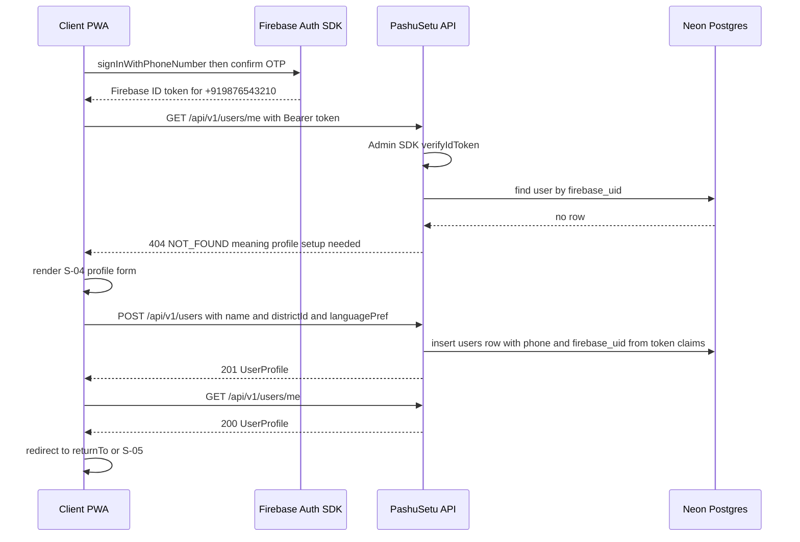
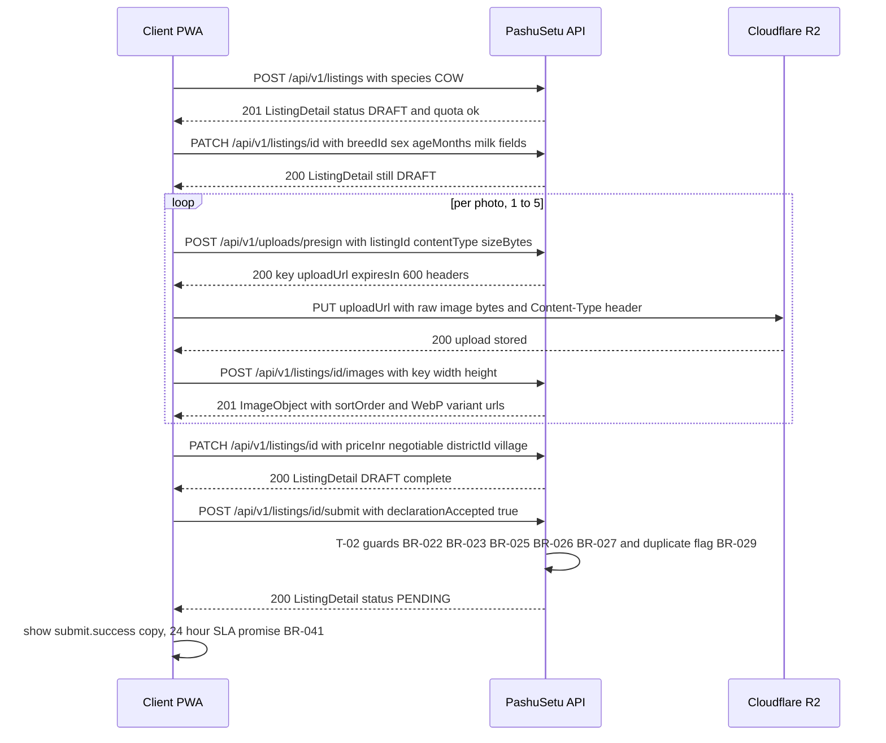
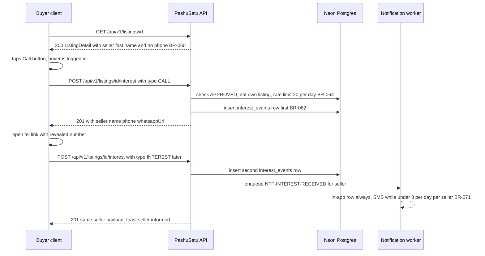
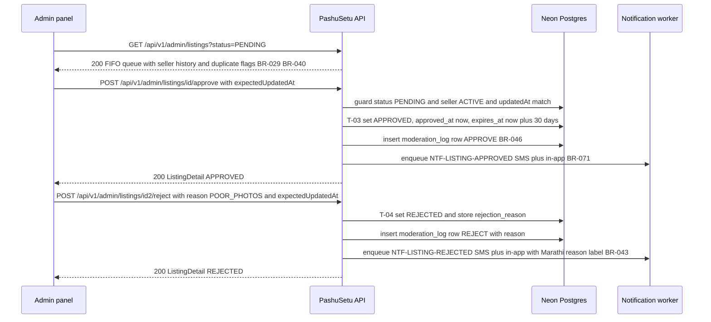

# 08 — API Contract

| Field | Value |
|---|---|
| **Status** | Draft |
| **Version** | 1.0 |
| **Owner** | Founder (Abhishek) |
| **Last updated** | 2026-07-04 |
| **Depends on** | [../00-foundation/README.md](../00-foundation/README.md) · [../01-prd/README.md](../01-prd/README.md) · [../04-business-rules/README.md](../04-business-rules/README.md) · [../06-user-flows/README.md](../06-user-flows/README.md) · [../07-database/README.md](../07-database/README.md) · [../12-security/README.md](../12-security/README.md) |

> This document is the **complete API contract** of the PashuSetu MVP. A frontend developer must be able to build the entire app from this document alone. It owns: the error-code registry (delegated here by [../01-prd/README.md](../01-prd/README.md) FR-07), all request/response shapes, all HTTP statuses, and the wire conventions. Business behavior behind every endpoint is owned by [../04-business-rules/README.md](../04-business-rules/README.md) (`BR-xx` ids cited throughout); if a shape here ever disagrees with a BR rule, doc 04 wins and this doc is defective. The API is implemented as Next.js App Router route handlers in the single codebase (locked decision D1) — there is no separate backend service.

**Endpoint index (39 endpoints, ids API-01…API-39):** §2.1 Auth & users (01–03) · §2.2 Reference data (04–05) · §2.3 Listings public (06–07) · §2.4 Listings seller (08–14) · §2.5 Uploads & images (15–17) · §2.6 Favorites (18–20) · §2.7 Interest (21) · §2.8 Reports (22) · §2.9 Notifications (23–24) · §2.10 Admin (25–34) · §2.11 Feedback (35–37) · §2.12 Authentication / OTP (38–39).

---

## 1. Conventions

### 1.1 Base path, transport, content types

| Convention | Value |
|---|---|
| Base path | **`/api/v1`** — every path in this doc is relative to it (full: `https://pashusetu.in/api/v1/...`) |
| Transport | HTTPS only (Vercel-managed TLS, D5); HTTP redirects to HTTPS |
| Request body | `Content-Type: application/json; charset=utf-8` for every endpoint with a body. Any other content type → **415 `UNSUPPORTED_MEDIA_TYPE`**. The only non-JSON request in the whole system is the image `PUT` to the presigned R2 URL (§2.5, §3.2), which never touches `/api/v1` |
| Response body | `application/json; charset=utf-8` for every endpoint (including errors); `204` responses have no body |
| Methods | `GET` (safe, cacheable per endpoint notes), `POST` (create/action), `PATCH` (partial update), `DELETE` (remove). No `PUT` on `/api/v1` |
| Encoding | UTF-8 end to end; Devanagari (Marathi) is stored and returned verbatim, never transliterated |

### 1.2 Authentication, roles, guards

Auth follows locked decision D3 and [../12-security/README.md](../12-security/README.md).

- **Credential:** `Authorization: Bearer <Firebase ID token>` — the 1-hour Firebase JWT the client holds after login. It is now obtained via `signInWithCustomToken()`, exchanging a **custom token this API mints** in `POST /auth/otp/verify` (§2.12): the backend now sends the phone OTP through an India-native SMS provider and, on the correct code, mints that custom token. So — **superseding** the earlier "Firebase client SDK owns OTP" model — the backend now **does** send OTPs and **does** issue (custom) tokens. The client SDK still auto-refreshes the resulting ID token, and every downstream verification path (§1.2 below) is unchanged. Architecture decision and service internals: [../00-foundation/README.md](../00-foundation/README.md), [../12-security/README.md](../12-security/README.md), [../09-backend/README.md](../09-backend/README.md).
- **Verification:** every authenticated request is verified server-side with the **Firebase Admin SDK** (`verifyIdToken`, default clock tolerance). The verified `firebase_uid` is resolved to the `users` row. No cookies, no server sessions.
- **Guard levels** used in every endpoint table below:

| Guard | Meaning | Failure |
|---|---|---|
| **Public** | No `Authorization` header needed. If a valid token is sent anyway, the server may personalize the response (e.g. `viewer` block in API-07) | — |
| **User** | Valid token + `users` row exists + `users.status = ACTIVE` | 401 `UNAUTHENTICATED` (no/invalid token) · 404 `NOT_FOUND` on `GET /users/me` only (no profile row — signals S-04 profile setup) · 403 `USER_BANNED` (BR-014) |
| **User+Profile** | User guard + complete profile: `name` and `district_id` set (BR-013). Required for **every authenticated write** | 403 `PROFILE_INCOMPLETE` |
| **Owner** | User+Profile guard + the authenticated user is `listings.seller_id` of the addressed listing (BR-033) | 403 `FORBIDDEN` |
| **Admin** | Valid token + `users.is_admin = true`, checked **server-side on every request** (BR-012). Admin flags are set manually in the DB by the Founder; there is no API to grant/revoke them | 403 `FORBIDDEN` |

- **Banned callers:** a `BANNED` user gets 403 `USER_BANNED` on **every** endpoint — reads and writes alike — with exactly one exception: `GET /users/me` returns 200 with `"status": "BANNED"` so the app can render the banned screen with the grievance contact (BR-014).
- Roles `is_farmer` / `is_buyer` are **never** permission gates (BR-011). Permissions derive only from authentication state and `is_admin`.

### 1.3 Error envelope & error-code registry

Every non-2xx response has exactly this shape:

```json
{
  "error": {
    "code": "LISTING_LIMIT_REACHED",
    "message": "You already have 10 active listings. Mark one sold or archive it first.",
    "details": { "activeCount": 10, "limit": 10 }
  }
}
```

- `code` — machine-readable string from the registry below. **Clients branch on `code` (never on `message`)** and map it to localized UI copy from the F-12 string catalogs.
- `message` — human-readable explanation. Localized by `Accept-Language` (§1.5); a debugging aid, never parsed.
- `details` — optional object with structured context. Guaranteed sub-fields: `details.fields` (per-field map, present on every `VALIDATION_ERROR` — BR-022) and `details.retryAfterSeconds` (present on every `RATE_LIMITED` — BR-090).

#### Base error codes (complete generic registry — clients MUST handle all ten)

| Code | HTTP status | Meaning | When |
|---|---|---|---|
| `UNAUTHENTICATED` | 401 | No, malformed, invalid, or expired Firebase ID token | Missing `Authorization` header; token fails Admin-SDK verification. Client: force token refresh, retry once, then open the login sheet (doc 06 login-wall) |
| `FORBIDDEN` | 403 | Authenticated, but this caller may not do this | Non-admin on `/admin/*` (BR-012); non-owner mutating a listing (BR-033); self-actions (interest/favorite/report on own listing — BR-050, BR-062, BR-070); incomplete profile (specific: `PROFILE_INCOMPLETE`, see below) |
| `BANNED` | 403 | Caller's `users.status = BANNED` (BR-014) | Emitted on the wire as the specific code `USER_BANNED`. Client: full-screen block with grievance contact |
| `NOT_FOUND` | 404 | Resource does not exist — or exists but is not visible to this caller | Unknown id; non-`APPROVED` listing fetched publicly (specific: `LISTING_NOT_FOUND`, BR-034); `GET /users/me` before `POST /users` |
| `VALIDATION_ERROR` | 400 or 422 | Request rejected by validation. **400** = malformed request (unparseable JSON, bad enum, bad cursor, non-integer, `minPrice > maxPrice`); **422** = well-formed but violates a domain field rule (BR-022, BR-025, BR-026, BR-090 #9/#10/#12) | `details.fields` maps each offending field to a reason |
| `CONFLICT` | 409 | Request conflicts with current server state (not a state-machine violation, not a quota) | Duplicate registration (`USER_ALREADY_EXISTS`); duplicate open report (`REPORT_ALREADY_EXISTS`); stale admin review (`details.reason = "STALE_REVIEW"`); approving for a banned seller (`details.reason = "SELLER_BANNED"`); unresolved reports at approval (`details.reason = "OPEN_REPORTS"`) |
| `LIMIT_EXCEEDED` | 409 | A stored quota from BR-090 is full (not a rolling-rate limit) | 10 active listings (`LISTING_LIMIT_REACHED`), 5 photos (`PHOTO_LIMIT_EXCEEDED`), 200 favorites (`FAVORITE_LIMIT_REACHED`) |
| `STATE_INVALID` | 409 | The listing state machine forbids this action from the current status (BR-032) | Disallowed transition (`INVALID_STATE_TRANSITION`); edit of a non-editable status (`EDIT_NOT_ALLOWED`, BR-028) |
| `RATE_LIMITED` | 429 | A rolling-window rate limit from BR-090 was hit (60 writes/min, 20 interests/day, 5 reports/day) | Response carries `details.retryAfterSeconds` and a standard `Retry-After` header (seconds) |
| `INTERNAL` | 500 | Unexpected server error | `details.eventId` carries the Sentry event id for support. Client shows the generic retry state |

#### Specific error codes (wire refinements)

The server always emits the **most specific** registered code; a base code is emitted only when no specific code applies. Each specific code inherits the semantics of its base — a client that does not recognize a code falls back to handling by base family via the HTTP status. Full mapping:

| Specific code | HTTP | Base | Raised by | Rule |
|---|---|---|---|---|
| `USER_ALREADY_EXISTS` | 409 | `CONFLICT` | API-01 | BR-010 — client recovers with `GET /users/me` |
| `USER_BANNED` | 403 | `BANNED` | every guarded endpoint except `GET /users/me` | BR-014 |
| `PROFILE_INCOMPLETE` | 403 | `FORBIDDEN` | every authenticated write | BR-013 — client routes to S-04 |
| `LISTING_NOT_FOUND` | 404 | `NOT_FOUND` | any listing-addressed endpoint | BR-034 — unknown id, or listing not visible to this caller |
| `LISTING_LIMIT_REACHED` | 409 | `LIMIT_EXCEEDED` | API-08 | BR-024 — 10 active listings |
| `PHOTO_LIMIT_EXCEEDED` | 409 | `LIMIT_EXCEEDED` | API-16 | BR-023 — attaching a 6th image |
| `FAVORITE_LIMIT_REACHED` | 409 | `LIMIT_EXCEEDED` | API-19 | BR-070 — 200 favorites |
| `INVALID_STATE_TRANSITION` | 409 | `STATE_INVALID` | API-10/11/12/13/26/27 | BR-032 — transition not in the BR-031 table |
| `EDIT_NOT_ALLOWED` | 409 | `STATE_INVALID` | API-09/15/16/17 | BR-028 — `EXPIRED`/`SOLD`/`ARCHIVED` content is immutable |
| `DECLARATION_REQUIRED` | 422 | `VALIDATION_ERROR` | API-09/10/16/17 | BR-027 — submission/re-moderation without seller declaration |
| `PHONE_IN_DESCRIPTION` | 422 | `VALIDATION_ERROR` | API-08/09/10 | BR-065 — phone number pattern in text fields |
| `INVALID_UPLOAD` | 422 | `VALIDATION_ERROR` | API-15/16 | BR-023 — wrong content type, > 5 MB, or magic-bytes mismatch |
| `REPORT_ALREADY_EXISTS` | 409 | `CONFLICT` | API-22 | BR-050 — caller already has an OPEN report on this listing |
| `LISTING_NOT_REPORTABLE` | 409 | `CONFLICT` | API-22 | BR-050 — listing is not `APPROVED` |
| `UNSUPPORTED_MEDIA_TYPE` | 415 | `VALIDATION_ERROR` | any body-bearing endpoint | Request body is not `application/json` |

No other code may be emitted by MVP code. Adding a code requires a version-1.x update to this table (additive change, §5).

### 1.4 Pagination (BR-090 #12)

All list endpoints (including admin) use **opaque cursor pagination**:

| Aspect | Contract |
|---|---|
| Request | `?cursor=<opaque string>&limit=<int>` — both optional |
| `limit` | Default **20**, min 1, max **50**. `limit > 50` or `< 1` → 422 `VALIDATION_ERROR` (BR-090 #12); non-integer → 400 |
| `cursor` | Opaque base64url keyset token minted by the server. Clients MUST NOT parse or construct it. Malformed/expired cursor → 400 `VALIDATION_ERROR`; the client silently restarts from page one (doc 06 Flow E) |
| Response | `{ "items": [ ... ], "nextCursor": "<opaque>" }` — `nextCursor` is `null` on the last page. No `total` field is returned (keyset pagination; counts where needed are separate fields, e.g. `meta.activeCount` in API-14) |
| Stability | Cursors are keyset-based (e.g. `(created_at, id)` for search — [../07-database/README.md](../07-database/README.md) §4.1), so concurrent inserts/removals never duplicate or skip items |
| Exemption | `GET /meta/breeds` and `GET /meta/districts` return bounded reference lists (≤ ~40 rows) **without** pagination — deliberate exemption, stated here so no other doc restates BR-090 #12 for them |

### 1.5 Localization

| Aspect | Contract |
|---|---|
| `Accept-Language` | `mr` or `en` (anything else, or absent → **`en`**). Affects **only** human-readable `error.message` strings. It never changes data, field names, or which fields are returned |
| Reference names | Breeds and districts always return **both** `nameEn` and `nameMr`; the client picks per the active locale (F-12 AC-5). No server-side name switching |
| User-generated text | `description`, `village`, `taluka`, `name` are returned exactly as stored (BR-080) — never translated |
| `whatsappUrl` prefill | Built server-side in the **buyer's `language_pref`** (BR-063), not from `Accept-Language` |
| UI copy | All user-facing strings come from the client's F-12 catalogs keyed by `error.code` / notification `type` — the API is not a copy source |
| Numbers | Money is integer INR in JSON (`"priceInr": 65000`); digit-grouping/₹ formatting is purely client-side (F-12 AC-6, Latin digits) |

### 1.6 Identifiers, timestamps, money, field naming

| Aspect | Contract |
|---|---|
| IDs | **All entity ids are opaque cuid strings** — users, listings, images, reports, notifications, moderation-log rows, and also seeded reference rows (breeds, districts). Seed rows are addressed by natural keys, so their cuids are **per-environment** ([../07-database/README.md](../07-database/README.md) P-3): clients must obtain them at runtime from `GET /meta/breeds` / `GET /meta/districts`, never hardcode them. Clients treat every id as an opaque string |
| Timestamps | ISO 8601 UTC with milliseconds and `Z` suffix: `"2026-07-02T05:10:00.000Z"`. All comparisons/formatting are client-side in device-local time |
| Money | `priceInr` is an **integer number of rupees** (no paise, no floats, no strings) — bounds per BR-026 (₹500–₹10,00,000) |
| Field naming | **camelCase in every JSON payload**, mapping 1:1 to the snake_case DB columns of the canonical data model (`age_months` ↔ `ageMonths`, `milk_yield_lpd` ↔ `milkYieldLpd`, `price_inr` ↔ `priceInr`, …) |
| Enums | UPPER_SNAKE strings exactly as in the data model: `species` ∈ `COW\|BUFFALO\|BULL_OX\|GOAT\|SHEEP\|REDA`, `sex` ∈ `FEMALE\|MALE`, listing `status` ∈ `DRAFT\|PENDING\|APPROVED\|SOLD\|REJECTED\|EXPIRED\|ARCHIVED` (D10), report `reason` ∈ `FAKE\|SOLD_ALREADY\|WRONG_INFO\|SPAM\|ILLEGAL\|OTHER`, `languagePref` ∈ `MR\|EN`. Clients MUST tolerate unknown enum values in responses (forward compatibility, §5) |
| Null policy | Optional fields that are unset are returned as explicit `null` (stable shapes for typed clients); the UI omits null attributes entirely (F-05 AC-3) |

### 1.7 Idempotency & retry stance

Rural 3G drops connections mid-request; the contract makes blind retries safe where it matters:

| Endpoint | Retry behavior |
|---|---|
| `POST /listings/{id}/interest` (API-21) | **Retry-safe by design.** Every accepted call logs one `interest_events` row (BR-062) and returns the same seller payload; duplicate rows from retries are acceptable — analytics dedupes by distinct `(listingId, buyerId)` and seller SMS is capped (BR-071), so no user-visible harm. All taps/retries count toward the 20/day limit (BR-064) |
| `POST /users/me/favorites` (API-19) | **Naturally idempotent** — the `(user_id, listing_id)` unique constraint dedupes; re-POST returns 200 with the existing row (BR-070) |
| `DELETE /users/me/favorites/{listingId}` (API-20) | Idempotent — deleting an absent favorite returns 204 |
| `POST /listings/{id}/submit` (API-10) | Repeat on an already-`PENDING` listing (same seller) → 200 no-op returning the `PENDING` listing; the declaration re-affirmation timestamp updates (BR-027). Not listed as disallowed in BR-032 |
| `POST /listings/{id}/sold` (API-11) | Repeat on an already-`SOLD` listing (same seller) → 200 no-op returning the `SOLD` listing. Not listed in the BR-032 `SOLD →` prohibition set (which covers edit/renew/re-list/archive/approve) |
| `POST /notifications/{id}/read` (API-24) | Idempotent — already-`READ` returns 200 |
| `POST /listings/{id}/renew` (API-12) | **NOT blindly retryable** — a repeat lands on an `APPROVED` listing and returns 409 `INVALID_STATE_TRANSITION` (a second renew would silently extend expiry). After a timed-out renew, the client re-fetches the listing state instead of retrying |
| Everything else | On timeout, re-fetch current state (`GET`) before re-attempting; any 409 `STATE_INVALID` after a retry means the first attempt succeeded |

There are no `Idempotency-Key` headers in MVP — the rules above make them unnecessary.

### 1.8 Rate limits (consolidated in BR-090 — cited, never restated)

| Limit | Value | Error |
|---|---|---|
| All authenticated **write** endpoints, combined | 60/min/user (BR-090 #2) | 429 `RATE_LIMITED` |
| `POST /listings/{id}/interest` | 20/day/buyer, all types+listings (BR-064) | 429 `RATE_LIMITED` |
| `POST /listings/{id}/report` | 5/day/user (BR-051) | 429 `RATE_LIMITED` |
| OTP (`POST /auth/otp/send`, `POST /auth/otp/verify` — §2.12) | **Now served by this API** (supersedes the earlier "Firebase client SDK owns OTP / no OTP endpoints" note): `send` throttled 5/phone/hour + 30 s resend cooldown + a coarse per-IP breadth cap; `verify` capped at 5 wrong attempts per code. Caps owned by [../04-business-rules/README.md](../04-business-rules/README.md) · [../12-security/README.md](../12-security/README.md) | 429 `RATE_LIMITED` (`Retry-After`) |
| Public reads | No per-user limit; platform-level abuse protection (Vercel/Cloudflare) is owned by [../12-security/README.md](../12-security/README.md) |

Limits are keyed on user id, never IP alone (rural CGNAT — PRD FR-05). Every 429 carries `details.retryAfterSeconds` + `Retry-After` header.

### 1.9 Shared response shapes

Defined once; referenced by name in §2. All fields follow §1.6.

**`UserProfile`** — returned by API-01/02/03:

```json
{
  "id": "clx2u01aa0001l204me3jr9t7",
  "phone": "+919876543210",
  "name": "रमेश पाटील",
  "isFarmer": true,
  "isBuyer": true,
  "isAdmin": false,
  "districtId": "clxd1st0032l004satara0001",
  "district": { "id": "clxd1st0032l004satara0001", "nameEn": "Satara", "nameMr": "सातारा", "state": "MH" },
  "taluka": "कोरेगाव",
  "village": "निगडी",
  "languagePref": "MR",
  "status": "ACTIVE",
  "createdAt": "2026-03-15T04:20:00.000Z",
  "updatedAt": "2026-07-01T06:30:00.000Z"
}
```

`firebaseUid` is never returned (internal). `phone` appears **only** in the caller's own profile (BR-066) and in admin payloads.

**`BreedRef`** — `{ "id": "clxbrd0cow01l004gir000001", "species": "COW", "nameEn": "Gir", "nameMr": "गीर" }`

**`DistrictRef`** — `{ "id": "clxd1st0032l004satara0001", "nameEn": "Satara", "nameMr": "सातारा", "state": "MH" }`

**`ImageObject`** — element of `images[]`:

```json
{
  "id": "clx4i01cc0001l604ab2cd3e4",
  "sortOrder": 0,
  "width": 1600,
  "height": 1200,
  "urls": {
    "thumb": "https://img.pashusetu.in/listings/clx4l01bb0001l404gt6yh1n2/thumb/clx4i01cc0001l604ab2cd3e4.webp",
    "card": "https://img.pashusetu.in/listings/clx4l01bb0001l404gt6yh1n2/card/clx4i01cc0001l604ab2cd3e4.webp",
    "detail": "https://img.pashusetu.in/listings/clx4l01bb0001l404gt6yh1n2/detail/clx4i01cc0001l604ab2cd3e4.webp"
  }
}
```

`sortOrder` 0–4; `sortOrder = 0` is the cover photo (BR-023). `urls` are the server-generated WebP variants (thumb 400 px, card 800 px, detail 1280 px — PRD NFR-02), served from the image CDN host `img.pashusetu.in` (R2 public bucket behind Cloudflare; infra in [../13-deployment/README.md](../13-deployment/README.md)). Originals are never served (NFR-02). Clients never construct image URLs. `r2_key` is internal and not returned.

**`ListingCard`** — search/list item (full spec in §4):

```json
{
  "id": "clx4l01bb0001l404gt6yh1n2",
  "species": "COW",
  "breed": { "id": "clxbrd0cow01l004gir000001", "species": "COW", "nameEn": "Gir", "nameMr": "गीर" },
  "sex": "FEMALE",
  "ageMonths": 48,
  "priceInr": 65000,
  "negotiable": true,
  "isPregnant": false,
  "milkYieldLpd": 12,
  "district": { "id": "clxd1st0032l004satara0001", "nameEn": "Satara", "nameMr": "सातारा", "state": "MH" },
  "taluka": "कोरेगाव",
  "village": "निगडी",
  "thumbnailUrl": "https://img.pashusetu.in/listings/clx4l01bb0001l404gt6yh1n2/thumb/clx4i01cc0001l604ab2cd3e4.webp",
  "approvedAt": "2026-07-02T05:10:00.000Z"
}
```

**`ListingDetail`** — full listing (API-07 and all seller mutations return it):

```json
{
  "id": "clx4l01bb0001l404gt6yh1n2",
  "status": "APPROVED",
  "species": "COW",
  "breed": { "id": "clxbrd0cow01l004gir000001", "species": "COW", "nameEn": "Gir", "nameMr": "गीर" },
  "sex": "FEMALE",
  "ageMonths": 48,
  "weightKg": 380,
  "milkYieldLpd": 12,
  "lactationNumber": 2,
  "isPregnant": false,
  "isVaccinated": true,
  "priceInr": 65000,
  "negotiable": true,
  "description": "गीर गाय, दुसरे वेत. दिवसाला 12 लिटर दूध देते. शांत स्वभावाची आहे, लसीकरण पूर्ण झाले आहे.",
  "district": { "id": "clxd1st0032l004satara0001", "nameEn": "Satara", "nameMr": "सातारा", "state": "MH" },
  "taluka": "कोरेगाव",
  "village": "निगडी",
  "images": [ { "id": "clx4i01cc0001l604ab2cd3e4", "sortOrder": 0, "width": 1600, "height": 1200, "urls": { "thumb": "…", "card": "…", "detail": "…" } } ],
  "viewCount": 148,
  "createdAt": "2026-07-01T06:30:00.000Z",
  "approvedAt": "2026-07-02T05:10:00.000Z",
  "seller": {
    "id": "clx2u01aa0001l204me3jr9t7",
    "firstName": "रमेश",
    "village": "निगडी",
    "district": { "id": "clxd1st0032l004satara0001", "nameEn": "Satara", "nameMr": "सातारा", "state": "MH" },
    "memberSince": "2026-03",
    "activeListingCount": 3
  },
  "viewer": { "isOwner": false, "isFavorited": true }
}
```

Rules baked into `ListingDetail`:

- `seller` contains **first name only**, coarse location, `memberSince` (`YYYY-MM` of the seller's `created_at`) and `activeListingCount` (count of the seller's currently `APPROVED` listings — feeds S-09). **Never a phone number** in this payload or any HTML render of it (BR-060, BR-066); the only phone egress in the system is API-21 (BR-062).
- `viewer` is present only when a valid `Authorization` header accompanied the request; anonymous responses carry `"viewer": null`. It powers the heart state (F-08) and the owner shortcut on S-07.
- **Owner/admin extension:** when the caller is the listing's seller or an admin, the object additionally includes `rejectionReason` (`{ "code": "<BR-043 code>", "detail": "<free text or null>" }` or `null`), `expiresAt`, `soldAt`, `declarationAccepted`, `declarationAt`, `updatedAt`. Public responses omit these six fields entirely.

**`OwnListingItem`** — element of API-14: `ListingCard` **plus** `status`, `rejectionReason`, `expiresAt`, `soldAt`, `viewCount`, `interestCount` (total `interest_events` rows, F-07 AC-1), `imageCount`, `pendingSince` (derived, no stored column: equals `updated_at` while `status = PENDING` — the BR-040 queue key, so it resets if the seller edits a `PENDING` listing — else `null`; feeds the BR-041 SLA copy), `createdAt`, `updatedAt`. `thumbnailUrl` is `null` for photo-less drafts.

**`NotificationItem`** — element of API-23:

```json
{
  "id": "clxnt01ee0001l904rs7tu8v9",
  "type": "NTF-LISTING-APPROVED",
  "payload": { "listingId": "clx4l01bb0001l404gt6yh1n2" },
  "channel": "INAPP",
  "status": "SENT",
  "createdAt": "2026-07-02T05:10:01.000Z"
}
```

`type` enum — the BR-071 template ids **verbatim**, exactly as stored in `notifications.type` ([../04-business-rules/README.md](../04-business-rules/README.md) BR-071, [../07-database/README.md](../07-database/README.md) §5.9; no transform on the wire): `NTF-LISTING-APPROVED`, `NTF-LISTING-REJECTED` (`payload.reasonCode`, `payload.reasonText`), `NTF-INTEREST-RECEIVED` (`payload.buyerName`), `NTF-EXPIRY-WARNING` (`payload.expiresAt`), `NTF-LISTING-EXPIRED`, `NTF-LISTING-HIDDEN`, `NTF-ADMIN-PENDING`, `NTF-ADMIN-AUTOHIDE`, `NTF-USER-BANNED`, `NTF-USER-UNBANNED`. `payload` keys come only from the doc 07 set `{ listingId?, reasonCode?, reasonText?, buyerName?, expiresAt? }`; every payload carries `listingId` where a listing is the subject (deep-link target per S-14).

---

## 2. Endpoint reference

Legend per endpoint: **Auth** = guard level (§1.2) · **Rate limit** = specific limit beyond the global 60 writes/min (BR-090 #2), which applies to every `POST`/`PATCH`/`DELETE` below and is not repeated. Error tables list endpoint-specific codes; `UNAUTHENTICATED`, `USER_BANNED`, `PROFILE_INCOMPLETE`, `RATE_LIMITED`, `UNSUPPORTED_MEDIA_TYPE` and `INTERNAL` can occur on any guarded endpoint per §1.2/§1.3 and are only listed where their trigger is endpoint-specific.

### 2.1 Auth & users

#### API-01 — `POST /users`

| | |
|---|---|
| **Auth** | User (token required; no profile row yet) |
| **Purpose** | Create the local profile row after the first successful Firebase login (BR-010; Flow D, S-04) |
| **Rate limit** | Global write limit only |

**Request body**

| Field | Type | Required | Validation |
|---|---|---|---|
| `name` | string | yes | 2–50 chars after trim; any script; must contain ≥ 2 letter characters (no digit-only names — F-02); emoji stripped server-side |
| `districtId` | string | yes | One of the 36 seeded MH districts (BR-013) |
| `taluka` | string | no | ≤ 60 chars |
| `village` | string | no | 2–60 chars |
| `isFarmer` | boolean | no | Default `true` (BR-011) |
| `isBuyer` | boolean | no | Default `true` (BR-011). If both flags are sent, at least one must be `true` → else 422 |
| `languagePref` | string | no | `MR` \| `EN`; default `MR` (BR-010) |

`phone` (E.164) and `firebase_uid` are taken from the **verified token claims**, never from the body — a client cannot register someone else's number.

**Response — 201** with the created `UserProfile` (§1.9 example).

**Errors**

| Code | HTTP | When |
|---|---|---|
| `USER_ALREADY_EXISTS` | 409 | A row with this `firebase_uid` or `phone` exists (BR-010). Client recovery: `GET /users/me` |
| `VALIDATION_ERROR` | 400/422 | Bad body; unknown `districtId`; name rules; both role flags false |

**Side effects:** `users` row created (`status = ACTIVE`, both role flags defaulting `true`). No notifications, no log rows.

---

#### API-02 — `GET /users/me`

| | |
|---|---|
| **Auth** | User — **works even when `BANNED`** (the single BR-014 exception) |
| **Purpose** | Fetch own profile; 404 signals "authed but no profile" → route to S-04 (PRD FR-01) |
| **Rate limit** | None (read) |

No parameters. **Response — 200** `UserProfile` (includes own `phone` — BR-066). **Errors:** `NOT_FOUND` 404 (no row yet — expected on first login, not an error state for the client). **Side effects:** none.

---

#### API-03 — `PATCH /users/me`

| | |
|---|---|
| **Auth** | User |
| **Purpose** | Edit profile fields (F-02); phone is immutable |
| **Rate limit** | Global write limit |

**Request body** — all fields optional; same validations as API-01: `name`, `districtId`, `taluka`, `village`, `isFarmer`, `isBuyer`, `languagePref`. Sending `phone` or any unknown field → 400 `VALIDATION_ERROR`. The resulting flag pair must keep at least one of `isFarmer`/`isBuyer` true → else 422.

**Response — 200** updated `UserProfile`.

**Errors:** `VALIDATION_ERROR` 400/422.

**Side effects:** row updated; changing `languagePref` changes the language of future `whatsappUrl` prefills (BR-063) and in-app rendering. Nothing else.

---

### 2.2 Reference data

#### API-04 — `GET /meta/breeds?species=`

| | |
|---|---|
| **Auth** | Public |
| **Purpose** | Breed picker data (S-10a, S-06 filters), filtered by species |
| **Rate limit** | None. Cacheable: `Cache-Control: public, s-maxage=86400, stale-while-revalidate=604800` |

**Query params**

| Param | Type | Required | Validation |
|---|---|---|---|
| `species` | string | no | `COW\|BUFFALO\|BULL_OX\|GOAT\|SHEEP\|REDA`; omitted → all breeds of all species |

**Response — 200** (not paginated — §1.4 exemption). Ordered by `species`, then seed order (locals last):

```json
{
  "items": [
    { "id": "clxbrd0cow01l004gir000001", "species": "COW", "nameEn": "Gir", "nameMr": "गीर" },
    { "id": "clxbrd0cow05l004khillar01", "species": "COW", "nameEn": "Khillar", "nameMr": "खिल्लार" },
    { "id": "clxbrd0cow11l004localcb01", "species": "COW", "nameEn": "Local / Crossbred", "nameMr": "गावठी / संकरित" }
  ]
}
```

Seeded catalog — 32 rows (owned by [../07-database/README.md](../07-database/README.md) §6.2): cow — Gir, Sahiwal, Holstein Friesian (HF), Jersey, Khillar, Dangi, Deoni, Gaolao, Red Kandhari, Lal Kandhari, local/crossbred; buffalo — Murrah, Jafarabadi, Mehsana, Nagpuri, Pandharpuri, Surti, local/crossbred; bull_ox — Khillar, Gir, Dangi, Gaolao, Deoni, local/crossbred; goat — Osmanabadi, Sangamneri, Boer, Sirohi, local/crossbred; sheep — Deccani, Madgyal, local/crossbred. Every species has a local/crossbred option so `breedId` is always satisfiable (BR-022).

**Errors:** `VALIDATION_ERROR` 400 (unknown `species`). **Side effects:** none.

---

#### API-05 — `GET /meta/districts`

| | |
|---|---|
| **Auth** | Public |
| **Purpose** | District picker data — all 36 Maharashtra districts with Marathi names |
| **Rate limit** | None. Same cache policy as API-04 |

No parameters. **Response — 200**, not paginated, ordered by `nameEn`:

```json
{
  "items": [
    { "id": "clxd1st0001l004ahilyangr1", "nameEn": "Ahilyanagar", "nameMr": "अहिल्यानगर", "state": "MH" },
    { "id": "clxd1st0016l004kolhapur01", "nameEn": "Kolhapur", "nameMr": "कोल्हापूर", "state": "MH" },
    { "id": "clxd1st0032l004satara0001", "nameEn": "Satara", "nameMr": "सातारा", "state": "MH" }
  ]
}
```

**Errors:** none beyond generics. **Side effects:** none.

---

### 2.3 Listings — public

#### API-06 — `GET /listings`

| | |
|---|---|
| **Auth** | Public (BR-060) |
| **Purpose** | Public search over `APPROVED` listings with filters, sort, cursor pagination — the buyer core loop (F-04, S-06) |
| **Rate limit** | None (read) |

Summary here; **full deep spec incl. every param, sort semantics and the visibility rule is §4.** Returns `{ "items": [ListingCard], "nextCursor": "…" }`, only `status = APPROVED`, default 20/max 50 per page (BR-090 #12). Filters include free-text `q` and the WS3 attribute filters (milk / age / pregnancy) alongside species / breed / district / taluka / price (§4.1).

---

#### API-07 — `GET /listings/{id}`

| | |
|---|---|
| **Auth** | Public for `APPROVED`; Owner/Admin see any status (BR-034) |
| **Purpose** | Listing detail page data (F-05, S-07), SSR-rendered for SEO |
| **Rate limit** | None (read) |

**Path params:** `id` — listing cuid.

**Response — 200** `ListingDetail` (§1.9). Owner/admin callers get the extended fields (`status` banner data, `rejectionReason`, `expiresAt`, …).

**Errors**

| Code | HTTP | When |
|---|---|---|
| `LISTING_NOT_FOUND` | 404 | Unknown id, or listing not `APPROVED` and caller is neither owner nor admin (BR-034 — `SOLD` included, so URLs fall out of search indexes per F-05 AC-7). For a `SOLD` listing the body carries `details.publicState = "SOLD"` (enables the S-07 "विकले गेले" banner — sold status is a positive market signal, not private data); every other hidden status carries `details.publicState = "UNAVAILABLE"` |

**Side effects:** `view_count` +1 on every successful public fetch of an `APPROVED` listing; **no dedup in MVP**; owner and admin fetches never increment (BR-034).

---

### 2.4 Listings — seller

#### API-08 — `POST /listings`

| | |
|---|---|
| **Auth** | User+Profile (BR-020) |
| **Purpose** | Create a `DRAFT` (state machine T-01); the wizard S-10a calls this on its first forward step and PATCHes afterwards |
| **Rate limit** | Global write limit |

**Request body**

| Field | Type | Required | Validation |
|---|---|---|---|
| `species` | string | yes | `COW\|BUFFALO\|BULL_OX\|GOAT\|SHEEP\|REDA` — the only field required at DRAFT creation (the wizard always has it after step 1; all other columns stay null until filled) |
| `breedId` | string | no | Must belong to `species` (BR-022) |
| `sex` | string | no | `FEMALE\|MALE`; `COW` forces `FEMALE`, `BULL_OX` forces `MALE` — mismatch → 422 (BR-022) |
| `ageMonths` | int | no | 1–300 (BR-022) |
| `weightKg` | int | no | 5–1500 (BR-022) |
| `milkYieldLpd` | number | no | 0–60; only for female milch combinations per the BR-022 matrix — sending it for a `MALE`/`BULL_OX` → 422 |
| `lactationNumber` | int | no | 0–15, same matrix rule (BR-022) |
| `isPregnant` | boolean | no | Female-only per matrix (BR-022) |
| `isVaccinated` | boolean | no | — |
| `priceInr` | int | no | 500–1000000 (BR-026) |
| `negotiable` | boolean | no | Default `true` (BR-026) |
| `description` | string | no | 10–1000 Unicode code points after trim (BR-025); **no phone numbers** — hard block (BR-065) |
| `districtId` | string | no | Seeded MH district |
| `taluka` | string | no | ≤ 60 chars |
| `village` | string | no | 2–60 chars; no phone numbers (BR-065) |

Provided fields are validated immediately; **completeness** (the R-columns of the BR-022 matrix, ≥ 1 photo, declaration) is enforced only at API-10 submit.

**Response — 201** `ListingDetail` with `"status": "DRAFT"`, empty `images`, extended owner fields (`declarationAccepted: false`, `expiresAt: null`, …).

**Errors**

| Code | HTTP | When |
|---|---|---|
| `LISTING_LIMIT_REACHED` | 409 | Caller already holds 10 active (non-terminal) listings — checked atomically inside the create transaction (BR-024) |
| `PHONE_IN_DESCRIPTION` | 422 | BR-065 hard-block regex hit in `description`/`village`/`taluka` |
| `VALIDATION_ERROR` | 400/422 | Any field rule above; per-field map in `details.fields` |

**Side effects:** T-01 — `listings` row in `DRAFT` (counts toward the BR-024 quota immediately). Sets `is_farmer = true` on the caller if not already (F-02 AC-2). No notifications.

---

#### API-09 — `PATCH /listings/{id}`

| | |
|---|---|
| **Auth** | Owner (BR-028 — admins never edit content) |
| **Purpose** | Partial edit. The server computes the changed-field set against stored values and applies the BR-028 status rules — the client's intent is never trusted |
| **Rate limit** | Global write limit |

**Request body** — any subset of the API-08 fields (same validations; `species` change resets `breedId` compatibility check), **plus**:

| Field | Type | Required | Validation |
|---|---|---|---|
| `imageOrder` | string[] | no | Permutation of ALL current image ids of this listing; re-assigns `sort_order` 0..n-1 (cover = index 0, BR-023). Counted as a **photo change** for BR-028/T-09 |
| `declarationAccepted` | boolean | see below | Must be `true` when this PATCH triggers T-09 (re-affirmation on entering `PENDING`, BR-027); ignored otherwise |

**Status behavior (BR-028, server-computed):**

| Current status | Effect of this PATCH |
|---|---|
| `DRAFT` | Applied; stays `DRAFT` |
| `PENDING` | Applied; stays `PENDING`; `updated_at` bump moves it to the back of the FIFO queue (BR-040) — the UI warns first |
| `APPROVED`, changed set ⊆ `{priceInr, negotiable}` | Applied; **stays `APPROVED`**, `expires_at` untouched (BR-028, BR-073) |
| `APPROVED`, any other change (incl. `imageOrder`) | Applied **and** T-09 fires: status → `PENDING`, listing leaves public view immediately. Requires `declarationAccepted: true` → else 422 `DECLARATION_REQUIRED` and nothing is applied |
| `REJECTED` | Applied; stays `REJECTED` until resubmitted via API-10 (T-05) |
| `EXPIRED` / `SOLD` / `ARCHIVED` | Rejected — 409 `EDIT_NOT_ALLOWED` (renew first for `EXPIRED`; `SOLD`/`ARCHIVED` are immutable forever) |

**Response — 200** `ListingDetail` reflecting the possibly-changed `status`.

**Errors**

| Code | HTTP | When |
|---|---|---|
| `LISTING_NOT_FOUND` | 404 | Unknown id (or someone else's id — masked as 404 for non-owners) |
| `FORBIDDEN` | 403 | Caller is authenticated but not the seller |
| `EDIT_NOT_ALLOWED` | 409 | Status `EXPIRED`/`SOLD`/`ARCHIVED` (BR-028) |
| `DECLARATION_REQUIRED` | 422 | T-09-triggering change without `declarationAccepted: true` (BR-027) |
| `PHONE_IN_DESCRIPTION` | 422 | BR-065 |
| `VALIDATION_ERROR` | 400/422 | Field rules; bad `imageOrder` permutation |

**Side effects:** on T-09 — listing hidden from public, `declaration_at = now`, admin in-app `NTF-ADMIN-PENDING` (BR-071); on `PENDING` edit — queue re-position (BR-040). Price-only edits update the live listing instantly with no other effects.

---

#### API-10 — `POST /listings/{id}/submit`

| | |
|---|---|
| **Auth** | Owner |
| **Purpose** | Submit for moderation: T-02 (`DRAFT → PENDING`) or T-05 (`REJECTED → PENDING`). The moment of legal declaration (BR-027) |
| **Rate limit** | Global write limit |

**Request body**

| Field | Type | Required | Validation |
|---|---|---|---|
| `declarationAccepted` | boolean | yes | Must be literally `true` (BR-027; the BR-027 declaration text — legal wording owned with [../16-legal/README.md](../16-legal/README.md) — is rendered by S-10e) → else 422 `DECLARATION_REQUIRED` |

**Submit guards (all must pass — T-02):** required-field matrix per species/sex complete and valid (BR-022) · ≥ 1 image attached (BR-023) · description 10–1000 chars, no phone patterns (BR-025, BR-065) · price in bounds (BR-026). Failures return one 422 `VALIDATION_ERROR` with the complete `details.fields` map so the wizard can jump to the first bad step.

**Response — 200** `ListingDetail` with `"status": "PENDING"`, `declarationAccepted: true`, `declarationAt` set. Resubmission (T-05) additionally clears `rejectionReason`. Repeat call on an already-`PENDING` listing → 200 no-op with refreshed `declarationAt` (§1.7).

**Errors**

| Code | HTTP | When |
|---|---|---|
| `LISTING_NOT_FOUND` / `FORBIDDEN` | 404/403 | As API-09 |
| `DECLARATION_REQUIRED` | 422 | `declarationAccepted` missing or not `true` (BR-027) |
| `VALIDATION_ERROR` | 422 | Any submit guard failed (per-field map) |
| `PHONE_IN_DESCRIPTION` | 422 | BR-065 re-check at submit |
| `INVALID_STATE_TRANSITION` | 409 | Status is `APPROVED`, `EXPIRED`, `SOLD` or `ARCHIVED` (BR-032 — `EXPIRED` must renew, not resubmit) |

**Side effects (T-02/T-05, one transaction):** `status = PENDING`; `declaration_accepted = true`, `declaration_at = now`; BR-029 duplicate heuristic computed and stored for the admin queue (same seller + same species + price ±10% + 7 days — warning only, never blocks); BR-065 soft flag (8–9 digit runs) computed for the queue; admin in-app notification `NTF-ADMIN-PENDING` (BR-071). No quota check here — a `DRAFT`/`REJECTED` listing already counts as active (BR-024).

---

#### API-11 — `POST /listings/{id}/sold`

| | |
|---|---|
| **Auth** | Owner |
| **Purpose** | T-06 `APPROVED → SOLD` — one-tap "विकले गेले" (F-07, S-11) |
| **Rate limit** | Global write limit |

No body. **Response — 200** `ListingDetail` with `"status": "SOLD"`, `soldAt` set. Repeat on already-`SOLD` → 200 no-op (§1.7).

**Errors:** `LISTING_NOT_FOUND` 404 · `FORBIDDEN` 403 · `INVALID_STATE_TRANSITION` 409 (status not `APPROVED` — e.g. `EXPIRED` must renew first per BR-032, `PENDING` cannot sell).

**Side effects:** `sold_at = now`; listing leaves public search immediately; frees one BR-024 quota slot; terminal — never editable/renewable again (BR-028, BR-032). No notifications.

---

#### API-12 — `POST /listings/{id}/renew`

| | |
|---|---|
| **Auth** | Owner |
| **Purpose** | T-08 `EXPIRED → APPROVED`, one-tap renew, **no re-moderation** (BR-074 — `EXPIRED` is not editable so content is byte-identical to what was approved) |
| **Rate limit** | Global write limit |

No body. **Response — 200** `ListingDetail` with `"status": "APPROVED"` and fresh `"expiresAt"` = now + 30 days (BR-073). `approvedAt` unchanged (T-08).

**Errors:** `LISTING_NOT_FOUND` 404 · `FORBIDDEN` 403 · `INVALID_STATE_TRANSITION` 409 (status not `EXPIRED` — includes the retry case, §1.7).

**Side effects:** `expires_at = now + 30d`; listing re-enters public search instantly; no notification (UI confirms inline per T-08); no quota check (an `EXPIRED` listing already counted as active — BR-024). Unlimited renewals, one explicit tap each (BR-074).

---

#### API-13 — `POST /listings/{id}/archive`

| | |
|---|---|
| **Auth** | Owner |
| **Purpose** | T-11 — "delete" in the UI is always archive; any non-terminal status → `ARCHIVED`, forever (BR-028) |
| **Rate limit** | Global write limit |

No body. **Response — 200** `ListingDetail` with `"status": "ARCHIVED"`.

**Errors:** `LISTING_NOT_FOUND` 404 · `FORBIDDEN` 403 · `INVALID_STATE_TRANSITION` 409 (status `SOLD` or `ARCHIVED` — BR-032 terminal rules).

**Side effects:** listing leaves the market forever (no un-archive exists); frees one quota slot; no `moderation_log` row for seller archives (T-11). No notifications.

---

#### API-14 — `GET /users/me/listings`

| | |
|---|---|
| **Auth** | User |
| **Purpose** | My Listings hub — the **only** way a seller sees their own non-`APPROVED` listings (BR-034; S-11 tabs) |
| **Rate limit** | None (read) |

**Query params**

| Param | Type | Required | Validation |
|---|---|---|---|
| `status` | string | no | One listing status; omitted → all statuses |
| `cursor`, `limit` | — | no | §1.4 |

**Response — 200** — ordered `created_at` desc (stable keyset `(created_at, id)`); `meta` powers the S-11 "७/१०" quota meter:

```json
{
  "items": [
    {
      "id": "clx4l01bb0001l404gt6yh1n2",
      "species": "COW",
      "breed": { "id": "clxbrd0cow01l004gir000001", "species": "COW", "nameEn": "Gir", "nameMr": "गीर" },
      "sex": "FEMALE",
      "ageMonths": 48,
      "priceInr": 65000,
      "negotiable": true,
      "isPregnant": false,
      "milkYieldLpd": 12,
      "district": { "id": "clxd1st0032l004satara0001", "nameEn": "Satara", "nameMr": "सातारा", "state": "MH" },
      "taluka": "कोरेगाव",
      "village": "निगडी",
      "thumbnailUrl": "https://img.pashusetu.in/listings/clx4l01bb0001l404gt6yh1n2/thumb/clx4i01cc0001l604ab2cd3e4.webp",
      "approvedAt": "2026-07-02T05:10:00.000Z",
      "status": "APPROVED",
      "rejectionReason": null,
      "expiresAt": "2026-08-01T05:10:00.000Z",
      "soldAt": null,
      "viewCount": 148,
      "interestCount": 9,
      "imageCount": 4,
      "pendingSince": null,
      "createdAt": "2026-07-01T06:30:00.000Z",
      "updatedAt": "2026-07-02T05:10:00.000Z"
    }
  ],
  "nextCursor": null,
  "meta": { "activeCount": 3, "activeLimit": 10 }
}
```

**Errors:** `VALIDATION_ERROR` 400 (bad `status`/`cursor`). **Side effects:** none.

---

### 2.5 Uploads & images

Photo pipeline per BR-023 and D4: presign → direct `PUT` to R2 → attach. Full sequence in §3.2.

#### API-15 — `POST /uploads/presign`

| | |
|---|---|
| **Auth** | Owner (of `listingId`) |
| **Purpose** | Issue a short-lived presigned R2 `PUT` URL for one photo; validates content type + size **before** any byte is uploaded (BR-023, NFR-08) |
| **Rate limit** | Global write limit |

**Request body**

| Field | Type | Required | Validation |
|---|---|---|---|
| `listingId` | string | yes | Existing listing; caller must be its seller; status must allow photo edits (`DRAFT`/`PENDING`/`REJECTED`/`APPROVED` — BR-028) |
| `contentType` | string | yes | `image/jpeg` \| `image/png` \| `image/webp` only (BR-023) — HEIC/HEIF and video are rejected here |
| `sizeBytes` | int | yes | 1 … 5242880 (≤ 5 MB, BR-023) |

**Response — 200**

```json
{
  "key": "listings/clx4l01bb0001l404gt6yh1n2/original/clx4i01cc0002l604fg5hi6j7.jpg",
  "uploadUrl": "https://a1b2c3.r2.cloudflarestorage.com/pashusetu-uploads/listings/clx4l01bb0001l404gt6yh1n2/original/clx4i01cc0002l604fg5hi6j7.jpg?X-Amz-Algorithm=AWS4-HMAC-SHA256&X-Amz-Expires=600&X-Amz-Signature=…",
  "expiresIn": 600,
  "headers": { "Content-Type": "image/jpeg" }
}
```

| Field | Contract |
|---|---|
| `key` | Server-generated R2 object key, scoped to the listing (`listings/{listingId}/original/{imageCuid}.{ext}`); the client never chooses keys |
| `uploadUrl` | Presigned S3-compatible `PUT` URL, valid **600 s**, bound to this key, the declared `Content-Type`, and a max content length of `sizeBytes` |
| `expiresIn` | Seconds of validity (always 600 — NFR-08's 10-minute single-use window) |
| `headers` | Headers the client MUST send verbatim on the `PUT` (exactly `Content-Type` in MVP); any mismatch → R2 rejects with 403 |

**R2 `PUT` semantics (client-side):** `PUT uploadUrl` with the raw file bytes as body and the `headers` above; no `Authorization` header (the signature is in the URL); success = HTTP 200 from R2; on network failure re-`PUT` to the same URL within the window or request a fresh presign after expiry. The upload alone changes nothing in PashuSetu — an un-attached object is invisible and garbage-collected after 24 h by the daily orphan sweep ([../09-backend/README.md](../09-backend/README.md)).

**Errors:** `INVALID_UPLOAD` 422 (type/size — BR-023) · `LISTING_NOT_FOUND` 404 · `FORBIDDEN` 403 · `EDIT_NOT_ALLOWED` 409 (`EXPIRED`/`SOLD`/`ARCHIVED` — BR-028).

**Side effects:** none persistent (URL issuance only).

---

#### API-16 — `POST /listings/{id}/images`

| | |
|---|---|
| **Auth** | Owner |
| **Purpose** | Attach an uploaded R2 object to the listing as a `listing_images` row (BR-023) |
| **Rate limit** | Global write limit |

**Request body**

| Field | Type | Required | Validation |
|---|---|---|---|
| `key` | string | yes | Must be a key issued by API-15 **for this listing** (prefix check); object must exist in R2, be ≤ 5 MB, and pass the server-side magic-bytes re-check (BR-023) |
| `width` | int | no | 1–10000 (client-known pixel size; server re-measures during variant generation and overwrites if wrong) |
| `height` | int | no | 1–10000 |
| `declarationAccepted` | boolean | conditional | Required `true` when the listing is `APPROVED` (this attach fires T-09 — BR-027/BR-028) |

**Response — 201** `ImageObject` (§1.9) with the next free `sortOrder` (first image gets 0 = cover). `urls` may serve placeholder variants for a few seconds until WebP generation finishes (client renders the local file meanwhile — S-10c).

**Errors**

| Code | HTTP | When |
|---|---|---|
| `PHOTO_LIMIT_EXCEEDED` | 409 | Listing already has 5 images (BR-023 / BR-090 #7) |
| `INVALID_UPLOAD` | 422 | Key not found in R2, oversize, magic-bytes mismatch, or key not issued for this listing |
| `EDIT_NOT_ALLOWED` | 409 | Status `EXPIRED`/`SOLD`/`ARCHIVED` (BR-028) |
| `DECLARATION_REQUIRED` | 422 | Attach on `APPROVED` without `declarationAccepted: true` |
| `LISTING_NOT_FOUND` / `FORBIDDEN` | 404/403 | As usual |

**Side effects:** `listing_images` row created; WebP variant generation (thumb/card/detail per NFR-02, EXIF orientation normalized) queued; if the listing was `APPROVED` → **T-09**: status → `PENDING`, hidden from public, `declaration_at = now`, admin `NTF-ADMIN-PENDING`.

---

#### API-17 — `DELETE /listings/{id}/images/{imageId}`

| | |
|---|---|
| **Auth** | Owner |
| **Purpose** | Remove a photo (S-10c / S-12) |
| **Rate limit** | Global write limit |

**Path params:** `id` (listing), `imageId`. **Query param:** `declarationAccepted=true` — required when the listing is `APPROVED` (this delete fires T-09; a query param because `DELETE` carries no body).

**Response — 204**, no body. Remaining images' `sortOrder` values are compacted to 0..n-1 preserving order.

**Errors**

| Code | HTTP | When |
|---|---|---|
| `LISTING_NOT_FOUND` / `NOT_FOUND` | 404 | Unknown listing / unknown image on this listing |
| `FORBIDDEN` | 403 | Not the seller |
| `EDIT_NOT_ALLOWED` | 409 | Status `EXPIRED`/`SOLD`/`ARCHIVED` (BR-028) |
| `CONFLICT` | 409 | Deleting the **last** image of a `PENDING` or `APPROVED` listing (`details.reason = "LAST_IMAGE"`) — live/queued listings must keep ≥ 1 photo (BR-023); drafts and rejected listings may go photo-less (submit re-blocks at 0) |
| `DECLARATION_REQUIRED` | 422 | Delete on `APPROVED` without `declarationAccepted=true` |

**Side effects:** row deleted; R2 original + variants deleted asynchronously; if listing was `APPROVED` → T-09 (as API-16).

---

### 2.6 Favorites

#### API-18 — `GET /users/me/favorites`

| | |
|---|---|
| **Auth** | User |
| **Purpose** | Saved-listings screen S-13 (F-08) |
| **Rate limit** | None (read) |

**Query params:** `cursor`, `limit` (§1.4). **Response — 200**, newest-saved first (keyset on `favorites.created_at, listing_id`):

```json
{
  "items": [
    {
      "favoritedAt": "2026-07-03T10:05:00.000Z",
      "listing": {
        "id": "clx4l01bb0002l404pr9zk3m8",
        "species": "BUFFALO",
        "breed": { "id": "clxbrd0buf01l004murrah001", "species": "BUFFALO", "nameEn": "Murrah", "nameMr": "मुऱ्हा" },
        "sex": "FEMALE",
        "ageMonths": 60,
        "priceInr": 85000,
        "negotiable": false,
        "isPregnant": true,
        "milkYieldLpd": 14,
        "district": { "id": "clxd1st0016l004kolhapur01", "nameEn": "Kolhapur", "nameMr": "कोल्हापूर", "state": "MH" },
        "taluka": null,
        "village": "हातकणंगले",
        "thumbnailUrl": "https://img.pashusetu.in/listings/clx4l01bb0002l404pr9zk3m8/thumb/clx4i01cc0009l604qq1rr2s3.webp",
        "approvedAt": "2026-06-20T07:00:00.000Z",
        "status": "SOLD"
      }
    }
  ],
  "nextCursor": null
}
```

Items are `ListingCard` **plus `status`** — favorited listings that leave `APPROVED` stay in the list greyed out with a Marathi status badge (BR-070, F-08 AC-5).

**Errors:** `VALIDATION_ERROR` 400 (cursor/limit). **Side effects:** none.

---

#### API-19 — `POST /users/me/favorites`

| | |
|---|---|
| **Auth** | User+Profile (BR-013, BR-070) |
| **Purpose** | Save a listing (heart toggle on S-06/S-07) |
| **Rate limit** | Global write limit |

**Request body**

| Field | Type | Required | Validation |
|---|---|---|---|
| `listingId` | string | yes | Must be an `APPROVED` listing (BR-070); not the caller's own listing |

**Response — 200** `{ "listingId": "clx4l01bb0002l404pr9zk3m8", "favoritedAt": "2026-07-03T10:05:00.000Z" }`. Idempotent: re-POST of an existing pair returns 200 with the original `favoritedAt` — the DB unique constraint dedupes (BR-070, §1.7).

**Errors:** `LISTING_NOT_FOUND` 404 (unknown or not `APPROVED`) · `FORBIDDEN` 403 (own listing — BR-070) · `FAVORITE_LIMIT_REACHED` 409 (200 favorites, BR-070/BR-090 #11) · `VALIDATION_ERROR` 400.

**Side effects:** `favorites` row upserted. No notification to the seller (favorite counts are not public — F-08 AC-6).

---

#### API-20 — `DELETE /users/me/favorites/{listingId}`

| | |
|---|---|
| **Auth** | User |
| **Purpose** | Unsave a listing |
| **Rate limit** | Global write limit |

**Path param:** `listingId`. **Response — 204**, no body — also when no such favorite existed (idempotent, §1.7). **Errors:** none beyond generics. **Side effects:** row deleted if present.

---

### 2.7 Interest (contact seller)

#### API-21 — `POST /listings/{id}/interest`

| | |
|---|---|
| **Auth** | User+Profile (BR-061) |
| **Purpose** | **The only phone-reveal path in the entire system** (BR-062, PRD FR-08). Logs one `interest_events` row, then returns the seller's contact — powering कॉल करा / WhatsApp / आवड कळवा (F-06, S-07) |
| **Rate limit** | **20/day/buyer**, rolling 24 h, all types and listings combined (BR-064) — plus the global write limit |

**Path param:** `id` — listing cuid.

**Request body**

| Field | Type | Required | Validation |
|---|---|---|---|
| `type` | string | yes | `CALL` \| `WHATSAPP` \| `INTEREST` — records the buyer's intent; all three return the identical payload (BR-062) |

**Response — 201**

```json
{
  "id": "clxie01gg0001lb04hh3jj4k5",
  "listingId": "clx4l01bb0001l404gt6yh1n2",
  "type": "CALL",
  "createdAt": "2026-07-03T11:42:00.000Z",
  "seller": {
    "name": "रमेश पाटील",
    "phone": "+919876543210",
    "whatsappUrl": "https://wa.me/919876543210?text=%E0%A4%A8%E0%A4%AE%E0%A4%B8%E0%A5%8D%E0%A4%95%E0%A4%BE%E0%A4%B0%21%20%E0%A4%AE%E0%A5%80%20PashuSetu%20%E0%A4%B5%E0%A4%B0…"
  }
}
```

- `seller.phone` — E.164; the client opens `tel:+919876543210` for `CALL`, or shows it for manual dialing after `INTEREST` (F-06 AC-3).
- `seller.whatsappUrl` — the prebuilt WhatsApp deep link (`https://wa.me/<E164-digits-without-plus>?text=<URL-encoded prefill>`), generated server-side in the buyer's `language_pref` with the canonical BR-063 Marathi prefill (example URL truncated with `…` for readability): "नमस्कार! मी PashuSetu वर तुमची जाहिरात पाहिली — गाय, गीर, ₹65000. जनावर अजून विक्रीसाठी आहे का? जाहिरात: {listingUrl}". The phone never transits the client separately from this logged response (BR-063).

**Errors**

| Code | HTTP | When |
|---|---|---|
| `UNAUTHENTICATED` | 401 | Anonymous tap — client opens the login wall and replays the action after login (doc 06 Flow C) |
| `PROFILE_INCOMPLETE` | 403 | BR-013 |
| `FORBIDDEN` | 403 | Buyer is the listing's seller (BR-062; `details.reason = "OWN_LISTING"` — UI hides the buttons for owners anyway) |
| `LISTING_NOT_FOUND` | 404 | Listing not `APPROVED` at tap time (sold/expired/hidden race — F-06 AC-7) |
| `RATE_LIMITED` | 429 | 21st event in 24 h (BR-064); Marathi copy key `interest.limit` |
| `VALIDATION_ERROR` | 400 | Bad `type` |

**Side effects (one transaction — the event row is written before the reveal, BR-062):** `interest_events` row (`listing_id`, `buyer_id`, `type`, `created_at`); for `type = INTEREST` only — seller notification `NTF-INTEREST-RECEIVED`: in-app row always, SMS only while the seller is under the 3 interest-SMS/day cap (BR-071); `CALL`/`WHATSAPP` trigger **no** seller notification (the call itself is the contact — BR-062). Repeat taps each log a fresh event (BR-062; §1.7).

---

### 2.8 Reports

#### API-22 — `POST /listings/{id}/report`

| | |
|---|---|
| **Auth** | User+Profile (BR-050) |
| **Purpose** | Flag an `APPROVED` listing (F-09, S-17); feeds the admin queue and the BR-045 auto-hide |
| **Rate limit** | **5/day/user** rolling 24 h (BR-051) — plus the global write limit |

**Request body**

| Field | Type | Required | Validation |
|---|---|---|---|
| `reason` | string | yes | `FAKE\|SOLD_ALREADY\|WRONG_INFO\|SPAM\|ILLEGAL\|OTHER` (BR-050) |
| `details` | string | conditional | ≤ 500 chars (BR-090 #17); **required when `reason = OTHER`** (BR-050), optional otherwise |

**Response — 201**

```json
{
  "id": "clxrp01dd0001l804mn4op5q6",
  "listingId": "clx4l01bb0001l404gt6yh1n2",
  "reason": "SOLD_ALREADY",
  "details": "काल विक्रेत्याला फोन केला, जनावर आधीच विकले गेले असे म्हणाले.",
  "status": "OPEN",
  "createdAt": "2026-07-03T12:00:00.000Z"
}
```

The reporter's identity is never exposed to the seller in any payload or notification (F-09 AC-7).

**Errors**

| Code | HTTP | When |
|---|---|---|
| `LISTING_NOT_REPORTABLE` | 409 | Listing is not `APPROVED` (BR-050) |
| `FORBIDDEN` | 403 | Reporting own listing (BR-050) |
| `REPORT_ALREADY_EXISTS` | 409 | Caller already has an OPEN report on this listing (BR-050); copy key `report.duplicate` |
| `RATE_LIMITED` | 429 | 6th report in 24 h (BR-051) |
| `VALIDATION_ERROR` | 400/422 | Bad reason; missing details for `OTHER`; details > 500 |

**Side effects (one transaction — count and transition are atomic, BR-045):** `reports` row `OPEN`; if this is the **3rd OPEN** report on the listing → **T-10 auto-hide**: listing `APPROVED → PENDING` (hidden), `moderation_log` row `AUTO_HIDE` under the seeded System admin (BR-046), admin in-app `NTF-ADMIN-AUTOHIDE`, seller in-app `NTF-LISTING-HIDDEN` (no report details disclosed — BR-071).

---

### 2.9 Notifications

#### API-23 — `GET /users/me/notifications`

| | |
|---|---|
| **Auth** | User |
| **Purpose** | Bell list S-14; returns **`INAPP` channel rows only** (SMS rows are delivery bookkeeping, never listed) |
| **Rate limit** | None (read) |

**Query params:** `cursor`, `limit` (§1.4). **Response — 200**, newest first; `meta.unreadCount` powers the bell badge (display caps at "9+" client-side — F-11 AC-5):

```json
{
  "items": [
    {
      "id": "clxnt01ee0001l904rs7tu8v9",
      "type": "NTF-LISTING-APPROVED",
      "payload": { "listingId": "clx4l01bb0001l404gt6yh1n2" },
      "channel": "INAPP",
      "status": "SENT",
      "createdAt": "2026-07-02T05:10:01.000Z"
    },
    {
      "id": "clxnt01ee0002l904tt5uu6v7",
      "type": "NTF-INTEREST-RECEIVED",
      "payload": { "listingId": "clx4l01bb0001l404gt6yh1n2", "buyerName": "सुनील" },
      "channel": "INAPP",
      "status": "READ",
      "createdAt": "2026-07-01T09:30:00.000Z"
    }
  ],
  "nextCursor": null,
  "meta": { "unreadCount": 1 }
}
```

`INAPP` rows are created with `status = SENT` and become `READ` via API-24; `unreadCount` = `INAPP` rows with `status = SENT`. The client renders each `type` from its own F-12 catalog using `payload` values (language follows current `language_pref` at render time — F-11 edge case). Rows are purged after 90 days (BR-071).

**Errors:** `VALIDATION_ERROR` 400. **Side effects:** none.

---

#### API-24 — `POST /notifications/{id}/read`

| | |
|---|---|
| **Auth** | User (must be the notification's recipient) |
| **Purpose** | Mark one notification read when tapped (S-14) |
| **Rate limit** | Global write limit |

**Path param:** `id`. No body. **Response — 200** `{ "id": "clxnt01ee0001l904rs7tu8v9", "status": "READ" }`. Idempotent — already-`READ` returns the same 200 (§1.7).

**Errors:** `NOT_FOUND` 404 (unknown id **or another user's notification** — masked, no existence leak). **Side effects:** `status → READ`.

---

### 2.10 Admin

All `/admin/*` endpoints: **Auth = Admin** (server-side `is_admin` check per request — BR-012, F-10 AC-1); non-admins get 403 `FORBIDDEN` with no data leakage. Admin payloads may include user phone numbers (BR-066 admin exception). Every mutation writes exactly one `moderation_log` row in the same transaction (BR-046).

#### API-25 — `GET /admin/listings?status=`

| | |
|---|---|
| **Purpose** | Moderation queue + status browser (S-19). Admins see every listing in every status here (BR-034) |
| **Rate limit** | None (read) |

**Query params**

| Param | Type | Required | Validation |
|---|---|---|---|
| `status` | string | no | Any listing status; **default `PENDING`** |
| `cursor`, `limit` | — | no | §1.4 (admin lists paginate too — BR-090 #12) |

Ordering: `status=PENDING` → **oldest-first FIFO by `updated_at`** (BR-040); every other status → `created_at` desc (keyset `(created_at, id)`, served by `listings_status_created_idx` — [../07-database/README.md](../07-database/README.md) §4.2).

**Response — 200** — items are `ListingDetail` (with owner-extension fields) **plus**:

```json
{
  "items": [
    {
      "id": "clx4l01bb0001l404gt6yh1n2",
      "status": "PENDING",
      "…": "… full ListingDetail fields …",
      "declarationAccepted": true,
      "declarationAt": "2026-07-03T06:00:00.000Z",
      "updatedAt": "2026-07-03T06:00:00.000Z",
      "seller": {
        "id": "clx2u01aa0001l204me3jr9t7",
        "name": "रमेश पाटील",
        "phone": "+919876543210",
        "district": { "id": "clxd1st0032l004satara0001", "nameEn": "Satara", "nameMr": "सातारा", "state": "MH" },
        "status": "ACTIVE",
        "joinedAt": "2026-03-15T04:20:00.000Z",
        "priorListingCount": 4,
        "priorRejectionCount": 1
      },
      "moderation": {
        "pendingSince": "2026-07-03T06:00:00.000Z",
        "queueAgeHours": 7.5,
        "duplicateOfListingId": "clx4l01bb0002l404pr9zk3m8",
        "possibleContactInfo": false,
        "openReportCount": 0,
        "rejectionCount": 1,
        "autoHidden": false
      }
    }
  ],
  "nextCursor": null
}
```

`moderation.duplicateOfListingId` = the BR-029 heuristic match (warning only; maps 1:1 to `listings.duplicate_of_id`, `null` when no match); `possibleContactInfo` = BR-065 soft flag; `autoHidden` = arrived via T-10 (red "reports" badge, BR-040); `moderation.pendingSince` is derived, not stored: it is the row's `updated_at` while `status = PENDING` (the BR-040 queue key — it resets when the seller edits a `PENDING` listing), and `queueAgeHours` = now − `pendingSince`, feeding the 18 h amber / 24 h red SLA badges (BR-041). `rejectionCount ≥ 3` renders the "repeat" badge (BR-044).

**Errors:** `FORBIDDEN` 403 · `VALIDATION_ERROR` 400. **Side effects:** none (admin views never bump `view_count` — BR-034).

---

#### API-26 — `POST /admin/listings/{id}/approve`

| | |
|---|---|
| **Purpose** | T-03 `PENDING → APPROVED` (S-20) |
| **Rate limit** | Global write limit |

**Request body**

| Field | Type | Required | Validation |
|---|---|---|---|
| `expectedUpdatedAt` | string | yes | ISO timestamp of the version the admin reviewed; mismatch with the row's `updated_at` → 409 (optimistic guard — the seller may have edited mid-review, F-10) |

**Response — 200** `ListingDetail` with `"status": "APPROVED"`, `approvedAt = now`, `expiresAt = now + 30 days` — **always a fresh 30 days, including re-approval after edit or auto-hide** (T-03, BR-073).

**Errors**

| Code | HTTP | When |
|---|---|---|
| `INVALID_STATE_TRANSITION` | 409 | Listing not `PENDING` (e.g. second admin already decided — BR-033) |
| `CONFLICT` | 409 | `details.reason = "STALE_REVIEW"` (updatedAt mismatch) · `"SELLER_BANNED"` (seller no longer `ACTIVE` — T-03 guard) · `"OPEN_REPORTS"` (auto-hidden listing still has OPEN reports; resolve/dismiss them first — T-03 guard per BR-052) |
| `FORBIDDEN` | 403 | Non-admin |
| `LISTING_NOT_FOUND` | 404 | Unknown id |

**Side effects (one transaction):** status/`approved_at`/`expires_at` set; `moderation_log` row `APPROVE`; seller notified `NTF-LISTING-APPROVED` — SMS + in-app (BR-071).

---

#### API-27 — `POST /admin/listings/{id}/reject`

| | |
|---|---|
| **Purpose** | T-04 `PENDING → REJECTED` — reason mandatory, travels verbatim to the seller |
| **Rate limit** | Global write limit |

**Request body**

| Field | Type | Required | Validation |
|---|---|---|---|
| `reason` | string | yes | BR-043 taxonomy code: `SLAUGHTER_INTENT\|POOR_PHOTOS\|WRONG_CATEGORY\|DUPLICATE\|FRAUD_SUSPECTED\|PRICE_ABUSE\|CONTACT_IN_DESCRIPTION\|OTHER` |
| `detail` | string | conditional | ≤ 500 chars; **required when `reason = OTHER`** (BR-043), optional otherwise |
| `expectedUpdatedAt` | string | yes | As API-26 |

**Response — 200** `ListingDetail` with `"status": "REJECTED"` and `"rejectionReason": { "code": "POOR_PHOTOS", "detail": null }`. The client renders the Marathi label from the BR-043 table (e.g. "फोटो स्पष्ट नाहीत").

**Errors:** `VALIDATION_ERROR` 400/422 (missing/unknown reason; missing detail for `OTHER`) · `INVALID_STATE_TRANSITION` 409 (not `PENDING`) · `CONFLICT` 409 (`STALE_REVIEW`) · `FORBIDDEN` 403 · `LISTING_NOT_FOUND` 404.

**Side effects (one transaction):** `rejection_reason` stored; `moderation_log` row `REJECT` with reason; seller notified `NTF-LISTING-REJECTED` (SMS + in-app, includes the Marathi reason label — BR-071).

---

#### API-28 — `GET /admin/reports?status=`

| | |
|---|---|
| **Purpose** | Reports queue (S-21) |
| **Rate limit** | None (read) |

**Query params:** `status` ∈ `OPEN\|RESOLVED\|DISMISSED` (default `OPEN`); `cursor`, `limit` (§1.4). Ordered oldest-first (`created_at` asc); the panel pins auto-hidden groups using `listing.autoHidden`.

**Response — 200**

```json
{
  "items": [
    {
      "id": "clxrp01dd0001l804mn4op5q6",
      "reason": "SOLD_ALREADY",
      "details": "काल विक्रेत्याला फोन केला, जनावर आधीच विकले गेले असे म्हणाले.",
      "status": "OPEN",
      "createdAt": "2026-07-03T12:00:00.000Z",
      "reporter": { "id": "clx2u01aa0002l204qw8bh2c4", "name": "सुनील जाधव", "phone": "+919812345678" },
      "listing": {
        "id": "clx4l01bb0001l404gt6yh1n2",
        "status": "APPROVED",
        "species": "COW",
        "priceInr": 65000,
        "sellerId": "clx2u01aa0001l204me3jr9t7",
        "thumbnailUrl": "https://img.pashusetu.in/listings/clx4l01bb0001l404gt6yh1n2/thumb/clx4i01cc0001l604ab2cd3e4.webp",
        "openReportCount": 1,
        "autoHidden": false
      }
    }
  ],
  "nextCursor": null
}
```

**Errors:** `FORBIDDEN` 403 · `VALIDATION_ERROR` 400. **Side effects:** none.

---

#### API-29 — `POST /admin/reports/{id}/resolve`

| | |
|---|---|
| **Purpose** | Uphold a report ("the report was justified" — BR-052) |
| **Rate limit** | Global write limit |

No body. **Response — 200** the report with `"status": "RESOLVED"` plus `"listingHidden": true|false` (whether this resolve took the listing off market).

**Errors:** `NOT_FOUND` 404 · `CONFLICT` 409 (`details.reason = "REPORT_NOT_OPEN"` — already resolved/dismissed) · `FORBIDDEN` 403.

**Side effects (one transaction, BR-052):** report → `RESOLVED`; `moderation_log` row `RESOLVE_REPORT`; **if the listing is still `APPROVED`, it is hidden to `PENDING` in the same transaction** (same edge as T-10, recorded by the `RESOLVE_REPORT` row itself — no separate `AUTO_HIDE` row) and the seller gets in-app `NTF-LISTING-HIDDEN`. The admin then rejects (API-27) or bans (API-31) as warranted. Reporters get no outcome notification in MVP (BR-052 — deliberate).

---

#### API-30 — `POST /admin/reports/{id}/dismiss`

| | |
|---|---|
| **Purpose** | Dismiss an invalid report (BR-052) |
| **Rate limit** | Global write limit |

No body. **Response — 200** the report with `"status": "DISMISSED"`.

**Errors:** `NOT_FOUND` 404 · `CONFLICT` 409 (`REPORT_NOT_OPEN`) · `FORBIDDEN` 403.

**Side effects:** report → `DISMISSED`; `moderation_log` row `DISMISS_REPORT`; dismissals count toward the reporter's false-report tally (5 dismissed/30 days surfaces "possible report abuse" — BR-053). **Never auto-republishes** an auto-hidden listing — a human re-approves via API-26 (BR-045).

---

#### API-31 — `POST /admin/users/{id}/ban`

| | |
|---|---|
| **Purpose** | Manual ban per BR-014/BR-054 (S-22) |
| **Rate limit** | Global write limit |

**Request body**

| Field | Type | Required | Validation |
|---|---|---|---|
| `reason` | string | yes | 5–500 chars — mandatory written reason (BR-014) |

**Response — 200**

```json
{
  "id": "clx2u01aa0001l204me3jr9t7",
  "status": "BANNED",
  "archivedListingCount": 3
}
```

**Errors:** `NOT_FOUND` 404 · `VALIDATION_ERROR` 400/422 (missing reason; **target is an admin or the caller themself** — blocked, F-10) · `CONFLICT` 409 (already `BANNED`) · `FORBIDDEN` 403.

**Side effects (one transaction — BR-014):** `users.status → BANNED`; **all** the user's active listings (`DRAFT/PENDING/REJECTED/APPROVED/EXPIRED`) → `ARCHIVED` (T-12, single bulk transition); **one** `moderation_log` row `BAN` (never one per listing); SMS `NTF-USER-BANNED` with the helpline number (BR-055). The user's future API calls all return `USER_BANNED` except `GET /users/me`.

---

#### API-32 — `POST /admin/users/{id}/unban`

| | |
|---|---|
| **Purpose** | Reverse a ban after appeal (BR-055) |
| **Rate limit** | Global write limit |

No body. **Response — 200** `{ "id": "clx2u01aa0001l204me3jr9t7", "status": "ACTIVE" }`.

**Errors:** `NOT_FOUND` 404 · `CONFLICT` 409 (not currently `BANNED`) · `FORBIDDEN` 403.

**Side effects:** `status → ACTIVE`; `moderation_log` row `UNBAN`; SMS `NTF-USER-UNBANNED`. **Archived listings are NOT restored** — `ARCHIVED` is terminal (BR-014, BR-032); the user creates fresh listings.

---

#### API-33 — `GET /admin/audit-log`

| | |
|---|---|
| **Purpose** | Read the append-only `moderation_log` (BR-046; S-23). No update/delete endpoints exist |
| **Rate limit** | None (read) |

**Query params**

| Param | Type | Required | Validation |
|---|---|---|---|
| `adminId` | string | no | Filter by acting admin (the seeded System admin appears for `AUTO_HIDE` rows — BR-046) |
| `action` | string | no | `APPROVE\|REJECT\|BAN\|UNBAN\|RESOLVE_REPORT\|DISMISS_REPORT\|AUTO_HIDE` |
| `from`, `to` | string | no | ISO date-times bounding `createdAt` (inclusive from, exclusive to) |
| `cursor`, `limit` | — | no | §1.4 |

**Response — 200**, `created_at` desc:

```json
{
  "items": [
    {
      "id": "clxml01ff0001la04wx0yz1a2",
      "adminId": "clx2u01aa0009l204k1adm2n0",
      "adminName": "Abhishek",
      "action": "APPROVE",
      "listingId": "clx4l01bb0001l404gt6yh1n2",
      "userId": null,
      "reason": null,
      "createdAt": "2026-07-02T05:10:00.000Z"
    }
  ],
  "nextCursor": null
}
```

**Errors:** `FORBIDDEN` 403 · `VALIDATION_ERROR` 400. **Side effects:** none (read-only by contract — BR-046).

---

#### API-34 — `GET /admin/stats`

| | |
|---|---|
| **Purpose** | Metrics dashboard S-23 — the Postgres-truth source for every PRD §2 goal (G-01…G-12) |
| **Rate limit** | None (read); no server-side cache — the snapshot is computed per request |

No parameters. **Response — 200** (fixed shape; window fields are rolling; read-only aggregates over data the marketplace already collects — **no schema change**, inventory #15):

```json
{
  "listings": {
    "total": 255,
    "byStatus": { "DRAFT": 25, "PENDING": 7, "APPROVED": 130, "SOLD": 41, "REJECTED": 12, "EXPIRED": 22, "ARCHIVED": 18 },
    "newToday": 6,
    "newWeek": 44
  },
  "views": {
    "total": 4820,
    "top": [
      { "id": "clx4l01bb0001l404gt6yh1n2", "viewCount": 148, "species": "COW", "breedMr": "गीर", "districtMr": "सातारा" }
    ]
  },
  "interest": { "call": 320, "whatsapp": 190, "interest": 140, "total": 650, "last7dTotal": 210 },
  "zeroEnquiryApproved": 37,
  "topDistricts": [ { "nameMr": "सातारा", "count": 39 } ]
}
```

- `listings.byStatus` — listing count per `status` enum value (keys from the D10 `ListingStatus` set); `total` = sum across statuses; `newToday` / `newWeek` = listings created since local midnight / within the last 7 days.
- `views.total` — sum of `viewCount` over APPROVED listings; `views.top` — the **top-5 most-viewed APPROVED listings** (`viewCount` desc), each `{ id, viewCount, species, breedMr, districtMr }` with `breedMr` / `districtMr` = `null` when unset.
- `interest` — all-time Call / WhatsApp / Interest event counts (`call`, `whatsapp`, `interest`) with `total` their sum, **plus** `last7dTotal` = all three types over the last 7 days (BR-062 events).
- `zeroEnquiryApproved` — count of APPROVED listings with **no** interest event (Call/WhatsApp/Interest) at all.
- `topDistricts` — **top-5 districts by APPROVED-listing count** (desc), each `{ nameMr, count }`.

There is **no** `generatedAt` field and **no** server-side cache in the shipped version (the snapshot is recomputed per request). The shipped response carries no users, moderation-turnaround, favorites or `bySpecies` blocks (the earlier documented shape is superseded).

**Errors:** `FORBIDDEN` 403. **Side effects:** none.

---

### 2.11 Feedback

App-level feedback / problem reports (NFR-10) — **not** the listing-abuse Report flow (§2.8). A `Feedback` row has **no listing link**. The `Feedback` model, the `FeedbackType` (`PROBLEM\|SUGGESTION\|OTHER`) and `FeedbackStatus` (`NEW\|SEEN\|DONE`) enums, the `feedback_status_created_idx` index and migration `20260714095640_add_feedback` are owned by [../07-database/README.md](../07-database/README.md) and are not restated here.

#### API-35 — `POST /feedback`

| | |
|---|---|
| **Auth** | Public — `optionalAuth`: a valid `Authorization` token, if present, attaches the caller's `userId`; anonymous is allowed and this endpoint **never** returns 401 |
| **Purpose** | Let any visitor (signed-in or not) report a problem or suggest an improvement (NFR-10) |
| **Rate limit** | Global write limit only, and only when a token is present |

**Request body** (strict — unknown field → 400)

| Field | Type | Required | Validation |
|---|---|---|---|
| `type` | string | yes | `PROBLEM\|SUGGESTION\|OTHER` |
| `message` | string | yes | 3–1000 chars after trim — the actual problem / suggestion |
| `contact` | string | no | 1–120 chars after trim — an optional phone / name for follow-up |
| `path` | string | no | ≤ 200 chars after trim — the in-app path the user was on, for context |

Unlike listing text, feedback is **exempt from the BR-065 no-phone rule** (rule owned by [../04-business-rules/README.md](../04-business-rules/README.md)): a phone number in `contact` or `message` is allowed, because follow-up is the point.

**Response — 201** `{ "id": "clxfb01aa0001l204me3jr9t7", "status": "NEW" }` — a new row is always created with `status = NEW`.

**Errors:** `VALIDATION_ERROR` 400/422 (bad/oversized field, unknown field). **Side effects:** one `Feedback` row (`user_id` = the caller's id, or `null` when anonymous); no notification, no listing link.

---

#### API-36 — `GET /admin/feedback?status=`

| | |
|---|---|
| **Auth** | Admin (`requireAdmin`) |
| **Purpose** | The admin feedback inbox (NFR-10) — newest-first, optional status filter, with an unhandled count |
| **Rate limit** | None (read) |

**Query params**

| Param | Type | Required | Validation |
|---|---|---|---|
| `status` | string | no | `NEW\|SEEN\|DONE`; omitted → all statuses |

**Response — 200** `{ "items": [Feedback…], "newCount": <int> }` — `items` are the most-recent `Feedback` rows (each with the submitter's `{ id, name, phone }` when signed-in, else `null`), newest-first; `newCount` = rows still in `NEW`.

> **Pagination deviation (deliberate — not a §1.4 violation):** this list is **not** cursor-paginated. It returns a fixed server page size of **50** most-recent rows and **no** `nextCursor`. Feedback volume is low at launch; keyset pagination is a documented later step. Stated here so it does not read as a §1.4 breach.

**Errors:** `FORBIDDEN` 403 (non-admin) · `VALIDATION_ERROR` 400 (bad `status`). **Side effects:** none.

---

#### API-37 — `PATCH /admin/feedback/{id}`

| | |
|---|---|
| **Auth** | Admin (`requireAdmin`) |
| **Purpose** | Advance a feedback item through the triage states `NEW → SEEN → DONE` |
| **Rate limit** | Global write limit |

**Path param:** `id` — feedback cuid.

**Request body** (strict)

| Field | Type | Required | Validation |
|---|---|---|---|
| `status` | string | yes | `NEW\|SEEN\|DONE` |

**Response — 200** `{ "id": "clxfb01aa0001l204me3jr9t7", "status": "SEEN" }` — echoes the new status.

**Errors:** `NOT_FOUND` 404 (unknown `id`) · `FORBIDDEN` 403 · `VALIDATION_ERROR` 400/422 (bad/unknown `status`). **Side effects:** the row's `status` is updated; nothing else.

---

### 2.12 Authentication (OTP)

Phone-OTP login is now served by this API, superseding the earlier Firebase-client-SDK-only model (§1.2, §1.8). Both endpoints are **Public** (pre-auth) and reuse the **existing closed error registry (§1.3)** — no new error codes are introduced. The code validity window, wrong-attempt cap and resend cooldown are rule / architecture values owned by [../04-business-rules/README.md](../04-business-rules/README.md) (caps) and [../12-security/README.md](../12-security/README.md) (security model); only their **wire surface** is documented here.

#### API-38 — `POST /auth/otp/send`

| | |
|---|---|
| **Auth** | Public |
| **Purpose** | Send (or resend) a login OTP to a phone (S-02 / S-03) |
| **Rate limit** | Per phone: 5 / hour + a 30 s resend cooldown; per IP: a coarse breadth cap (values owned by doc 04 / doc 12) |

**Request body** (strict)

| Field | Type | Required | Validation |
|---|---|---|---|
| `phone` | string | yes | 10-digit Indian national number (`^[6-9]\d{9}$`); the server prefixes `+91` |

**Response — 200** `{ "sent": true }` — always this exact body; it **never reveals** whether the phone already has an account.

**Errors**

| Code | HTTP | When |
|---|---|---|
| `RATE_LIMITED` | 429 | Per-phone resend cooldown / hourly cap, or the per-IP breadth cap; carries `details.retryAfterSeconds` + `Retry-After` |
| `INTERNAL` | 500 | A downstream SMS-provider send failure. The provider's `status_code` / `message` is captured **server-side only** for diagnosis and is **never** on the wire — and never contains the OTP code or the provider API key (those live only in the outbound request) |
| `VALIDATION_ERROR` | 400/422 | Malformed / absent `phone` |

**Side effects:** an OTP challenge is stored/refreshed for the phone; on success one SMS is dispatched via the India-native provider.

---

#### API-39 — `POST /auth/otp/verify`

| | |
|---|---|
| **Auth** | Public |
| **Purpose** | Verify the code and return a Firebase **custom token** the client exchanges via `signInWithCustomToken()` (§1.2) |
| **Rate limit** | Per code: at most 5 wrong attempts, after which a fresh code is required (value owned by doc 04 / doc 12) |

**Request body** (strict)

| Field | Type | Required | Validation |
|---|---|---|---|
| `phone` | string | yes | As API-38 |
| `code` | string | yes | 6 digits (`^\d{6}$`) |

**Response — 200** `{ "customToken": "<Firebase custom token>" }` — the client calls `signInWithCustomToken()` with it to obtain the Bearer ID token used everywhere else (§1.2).

**Errors — the OTP failure-reason wire contract**

| Code | HTTP | When |
|---|---|---|
| `VALIDATION_ERROR` | 422 | The named OTP failure reason, in `details.fields.otp`: `"invalid"` = the code is wrong · `"expired"` = no challenge exists or it has expired (a sent code is valid **10 minutes**; value owned by doc 04). Clients branch on `details.fields.otp` for the S-03 error copy |
| `RATE_LIMITED` | 429 | The 5-wrong-attempt cap for this code is exhausted — the client must request a fresh code (API-38); carries `details.retryAfterSeconds` + `Retry-After` |
| `VALIDATION_ERROR` | 400/422 | Malformed `phone` / `code` at the schema (`details.fields.phone` / `details.fields.code`) — distinct from the semantic `otp` reason above |

**Side effects:** on success the challenge is consumed (single-use — the code cannot be replayed) and a custom token is minted for the caller's Firebase uid; nothing else.

---

## 3. Key flows as endpoint sequences

### 3.1 First login → `POST /users` → `GET /users/me` (Flow D, S-02→S-04)



Returning users skip straight from token restore to a 200 on `GET /users/me`. A duplicate `POST /users` (app killed mid-flow, retried) returns 409 `USER_ALREADY_EXISTS`; the client recovers with `GET /users/me` (BR-010). A `BANNED` user gets 200 here with `"status": "BANNED"` and the app renders the block screen (BR-014).

### 3.2 Create listing end-to-end, including presigned upload (Flow A, S-10a→S-10e)



Failure branches: presign rejects bad type/size **before** any upload (`INVALID_UPLOAD` 422); a dropped `PUT` is retried against the same `uploadUrl` inside the 600 s window; an un-attached upload is invisible and garbage-collected; the 6th attach fails with `PHOTO_LIMIT_EXCEEDED` 409; an incomplete submit returns a single 422 `VALIDATION_ERROR` whose `details.fields` map drives the wizard back to the offending step.

### 3.3 Buyer contact flow (Flow C, S-07)



The seller's `name`, `phone` and the prebuilt `whatsappUrl` (the WhatsApp deep link, BR-063) appear **only** in this response — never in listing payloads or SSR HTML (BR-066, PRD FR-08). An anonymous tap gets 401, the login wall opens with the action remembered, and the client replays the same `POST` after login (doc 06 login-wall contract).

### 3.4 Moderation: approve / reject with notification side effects (Flow F, S-19→S-20)



Concurrency: two admins acting on the same listing — the second hits the `WHERE status = 'PENDING'` precondition and gets 409 `INVALID_STATE_TRANSITION` (BR-033); a seller edit mid-review trips the `expectedUpdatedAt` guard → 409 `CONFLICT` `STALE_REVIEW` and the panel reloads the latest version.

---

## 4. Search endpoint deep spec — `GET /listings` (API-06)

### 4.1 Query parameters (complete)

| Param | Type | Required | Default | Validation / semantics |
|---|---|---|---|---|
| `q` | string | no | — | 1–60 chars after trim; free-text search (WS3, F-04). Case-insensitive `contains` over village, taluka, breed `nameMr` / `nameEn` and seller name, **plus** an exact match on the listing `id` (paste an id / shared link). Empty (after trim) or > 60 chars → 400 |
| `species` | string | no | — | `COW\|BUFFALO\|BULL_OX\|GOAT\|SHEEP\|REDA`; unknown value → 400 |
| `breedId` | string | no | — | Must exist **and** belong to `species` when both are given; mismatch or orphan `breedId` (without `species` it just must exist) → 400 `VALIDATION_ERROR` (F-04 AC-3) |
| `districtId` | string | no | — | Must be a seeded MH district → else 400 |
| `taluka` | string | no | — | 1–60 chars; **exact** match on the listing's `taluka` (BR-022 free-text tehsil). Distinct from `q`, whose `contains` match also covers taluka |
| `minPrice` | int | no | — | ≥ 0; integer INR |
| `maxPrice` | int | no | — | ≥ 0; `minPrice > maxPrice` → 400 `VALIDATION_ERROR` (F-04 AC-4; the client blocks this before sending) |
| `minMilk` | number | no | — | 0–60; minimum milk yield in L/day — returns only listings with `milkYieldLpd` ≥ `minMilk` (so null-milk males / non-milch animals are excluded) |
| `minAge` | int | no | — | 1–300 months |
| `maxAge` | int | no | — | 1–300 months; `minAge > maxAge` → 400 `VALIDATION_ERROR` (mirrors the `minPrice` / `maxPrice` rule; the client blocks it before sending) |
| `isPregnant` | string | no | — | Literal `'1'` only; `'1'` returns only listings flagged pregnant (`isPregnant = true`, female-only per the BR-022 matrix). Any other value → 400 |
| `sort` | string | no | `newest` | `newest` \| `price_asc` \| `price_desc` |
| `sellerId` | string | no | — | All approved listings of one seller — powers S-09 "इतर जाहिराती पाहा" (see this seller's other listings) |
| `cursor` | string | no | — | Opaque (§1.4); invalid/expired → 400, client restarts from page one |
| `limit` | int | no | 20 | 1–50; > 50 → 422 (BR-090 #12) |

All filters combine with AND. Filter state is fully URL-encodable for shareable results (F-04 AC-6). **A free-text `q` parameter now ships** (WS3, superseding the earlier Phase-2 deferral): `q` performs a case-insensitive `contains` match over village, taluka, breed `nameMr` / `nameEn` and seller name, **plus** an exact match on the listing `id`, and combines (AND) with every structured filter above — so it too is URL-encodable into a shareable result (F-04 AC-6).

### 4.2 Sort semantics & cursors

| `sort` | Order | Keyset |
|---|---|---|
| `newest` | Most recently created first (`created_at`, not `approved_at`, is the ranking key — anti-gaming decision, [../07-database/README.md](../07-database/README.md) §4.1: renewals and edit-re-approvals cannot bump a listing back to the top) | `(created_at DESC, id DESC)` |
| `price_asc` | Cheapest first | `(price_inr ASC, id ASC)` |
| `price_desc` | Most expensive first | `(price_inr DESC, id DESC)` |

The cursor encodes the keyset tuple of the last item (base64url, opaque). Because pagination is keyset-based, a listing approved/expiring between page loads never duplicates or skips results (F-04 edge case); a card that goes stale simply 404s on tap (API-07 handles it).

### 4.3 Visibility rule (exact)

- **Only `status = APPROVED` listings are ever returned by this endpoint — to everyone, including the listing's own seller and admins.** (BR-034, D10: moderation-before-visibility.)
- The owner sees their own non-approved listings **only** via `GET /users/me/listings` (API-14); admins see all statuses **only** via `GET /admin/listings` (API-25).
- Expiry is enforced by state: the daily expiry job (BR-072) moves overdue listings to `EXPIRED`, so no `expires_at` filtering happens at query time.
- No field of any result may contain a seller phone number (BR-066) — enforced by the `ListingCard` shape, which carries no seller object at all.

### 4.4 Response — 200

`items` are `ListingCard` objects (§1.9): `id`, `species`, `breed` (both names), `sex`, `ageMonths`, `priceInr`, `negotiable`, `isPregnant` (drives the "गाभण" badge — F-04 AC-2), `milkYieldLpd`, `district` (both names), `taluka`, `village`, `thumbnailUrl` (cover image `thumb` WebP variant — the 400 px/≤ 40 KB NFR-02 budget), `approvedAt`. No description, no images array, no seller, no view count — the card is deliberately light for 3G list rendering (NFR-01). The WS3 `q`, `taluka`, `minMilk`, `minAge` / `maxAge` and `isPregnant` filters change **which** `ListingCard`s are returned but **not** the card shape — `isPregnant` and `milkYieldLpd` are already fields on `ListingCard` (driving the गाभण / milk badges), so these filters add **no** new response fields.

Example — `GET /api/v1/listings?species=COW&districtId=clxd1st0032l004satara0001&maxPrice=80000&sort=price_asc&limit=2`:

```json
{
  "items": [
    {
      "id": "clx4l01bb0003l404ab1cd2e3",
      "species": "COW",
      "breed": { "id": "clxbrd0cow05l004khillar01", "species": "COW", "nameEn": "Khillar", "nameMr": "खिल्लार" },
      "sex": "FEMALE",
      "ageMonths": 36,
      "priceInr": 42000,
      "negotiable": true,
      "isPregnant": true,
      "milkYieldLpd": 8,
      "district": { "id": "clxd1st0032l004satara0001", "nameEn": "Satara", "nameMr": "सातारा", "state": "MH" },
      "taluka": "फलटण",
      "village": "बरड",
      "thumbnailUrl": "https://img.pashusetu.in/listings/clx4l01bb0003l404ab1cd2e3/thumb/clx4i01cc0011l604zz9yy8x7.webp",
      "approvedAt": "2026-07-01T10:00:00.000Z"
    },
    {
      "id": "clx4l01bb0001l404gt6yh1n2",
      "species": "COW",
      "breed": { "id": "clxbrd0cow01l004gir000001", "species": "COW", "nameEn": "Gir", "nameMr": "गीर" },
      "sex": "FEMALE",
      "ageMonths": 48,
      "priceInr": 65000,
      "negotiable": true,
      "isPregnant": false,
      "milkYieldLpd": 12,
      "district": { "id": "clxd1st0032l004satara0001", "nameEn": "Satara", "nameMr": "सातारा", "state": "MH" },
      "taluka": "कोरेगाव",
      "village": "निगडी",
      "thumbnailUrl": "https://img.pashusetu.in/listings/clx4l01bb0001l404gt6yh1n2/thumb/clx4i01cc0001l604ab2cd3e4.webp",
      "approvedAt": "2026-07-02T05:10:00.000Z"
    }
  ],
  "nextCursor": "eyJrIjpbNjUwMDAsImNseDRsMDFiYjAwMDFsNDA0Z3Q2eWgxbjIiXX0"
}
```

**Errors:** `VALIDATION_ERROR` 400 (bad enum/param/cursor/`minPrice>maxPrice`) or 422 (`limit` out of 1–50). **Side effects:** none (search never increments `view_count` — only API-07 does).

---

## 5. Versioning & deprecation policy

1. **`/api/v1` is frozen for the MVP.** Every path, method, field name, enum value, error code and status documented here is stable through pilot and public Maharashtra launch.
2. **Additive changes only within v1:** new endpoints, new **optional** request fields (with defaults preserving current behavior), new response fields, and new error codes registered in §1.3. Clients MUST ignore unknown response fields and tolerate unknown enum values (§1.6) — that tolerance is what makes additive change safe.
3. **Never within v1:** removing/renaming fields or endpoints, changing a field's type or semantics, changing a success status, tightening validation on existing fields, or repurposing an error code. Any such change is **breaking** and ships as **`/api/v2`** side by side.
4. **Deprecation process (post-MVP):** v1 keeps working for **90 days** after v2 ships; deprecated endpoints respond normally plus a `Deprecation: true` header and a `Sunset` header with the cutoff date; the PWA is a Vercel-deployed client we control, so real-world stragglers are limited to cached service-worker bundles — the SW update flow (NFR-11) force-refreshes within days.
5. **Version ownership:** this document is versioned with the API; any v1.x additive change lands here first (table rows added, never rewritten) before code review may pass ([../14-testing-qa/README.md](../14-testing-qa/README.md) checks contract drift).

## 6. OpenAPI stance

**This markdown document is the single source of truth for the MVP contract.** A machine-readable `openapi.yaml` (OpenAPI 3.1) will be **generated from this document in Sprint 1** — tracked as a Sprint 1 task in [../15-project-plan/README.md](../15-project-plan/README.md) — and committed at `openapi/openapi.yaml` in the repo. From then on: the YAML is regenerated whenever this doc changes (same PR); route handlers validate requests with zod schemas derived from the same definitions ([../09-backend/README.md](../09-backend/README.md)); and CI fails when handler schemas and the YAML disagree ([../14-testing-qa/README.md](../14-testing-qa/README.md)). Until the YAML exists, frontend and tests code directly against this document. If the YAML and this doc ever diverge, this doc wins and the YAML is regenerated.

---

## Acceptance checklist

- [x] Header table complete (Status/Version/Owner/Last updated 2026-07-04/Depends on with relative links); doc format per foundation §7
- [x] Conventions cover: base path `/api/v1`; Bearer Firebase ID token verified via Firebase Admin SDK; guard levels public/user/user+profile/owner/admin with admin determined by `users.is_admin` (BR-012); error envelope `{ error: { code, message, details } }`
- [x] Full error catalog present with all ten mandated base codes (`UNAUTHENTICATED`, `FORBIDDEN`, `NOT_FOUND`, `VALIDATION_ERROR`, `RATE_LIMITED`, `CONFLICT`, `LIMIT_EXCEEDED`, `STATE_INVALID`, `BANNED`, `INTERNAL`) — each with HTTP status, meaning and when — plus the specific-code registry mapping every doc-04 wire code (`USER_BANNED`, `LISTING_LIMIT_REACHED`, `INVALID_STATE_TRANSITION`, `DECLARATION_REQUIRED`, `PHONE_IN_DESCRIPTION`, `INVALID_UPLOAD`, `REPORT_ALREADY_EXISTS`, …) to its base code
- [x] Pagination spec: `cursor` param, `nextCursor` in response, default 20, max 50, >50 → 422 per BR-090 #12; meta endpoints explicitly exempted
- [x] Localization spec: `Accept-Language: mr|en` affects only `message` strings; reference data always returns both `nameEn` and `nameMr`; `whatsappUrl` prefill follows buyer `language_pref` (BR-063)
- [x] Timestamps ISO-8601 UTC; ids opaque cuid strings; money integer INR; camelCase JSON mapped to snake_case DB names — all stated with examples
- [x] Idempotency stance documented: retry-safe `POST /interest` (each event logged, analytics dedupe) and naturally deduped favorites, plus no-op rules for submit/sold/read and the explicit renew non-retry warning
- [x] Every one of the 39 canonical endpoints documented (API-01…API-39), grouped Auth&Users / Reference data / Listings public / Listings seller / Uploads&Images / Favorites / Interest / Reports / Notifications / Admin / Feedback / Authentication (OTP) — paths exactly matching the canonical `/api/v1` surface, no invented endpoints
- [x] Every endpoint entry states: method+path, auth/role, one-line purpose, request params/body table with field/type/required/validation citing BR ids, success status with realistic Marathi-flavored JSON example, endpoint-specific error table, rate limit, and side effects (state transitions T-xx, `moderation_log` rows, `interest_events` rows, `NTF-*` notifications)
- [x] All four key flows present as valid mermaid `sequenceDiagram` blocks: (a) first login → `POST /users` → `GET /users/me`; (b) create listing end-to-end with presign (`key`, `uploadUrl`, `expiresIn`, required `headers`, R2 PUT semantics) and attach; (c) buyer contact with seller name/phone/`whatsappUrl` reveal; (d) moderation approve/reject with notification side effects
- [x] Search deep spec: complete query param table (`species`, `breedId`, `districtId`, `minPrice`, `maxPrice`, `sort=newest|price_asc|price_desc`, `cursor`, `limit`), keyset sort semantics, `ListingCard` shape with first-image thumbnail URL, and the exact visibility rule — only `status=APPROVED` returned; owner sees own non-approved via `/users/me/listings` only (BR-034)
- [x] Versioning policy (v1 frozen, additive-only, breaking ⇒ `/api/v2`, 90-day deprecation with `Deprecation`/`Sunset` headers) and OpenAPI stance (this markdown is source of truth; `openapi.yaml` generated in Sprint 1, task referenced to doc 15) present
- [x] All business-rule constants match canonical values and are cited by BR id: photos 1–5 ≤ 5 MB JPEG/PNG/WebP with WebP variants (BR-023), 10 active listings (BR-024), 30-day expiry + one-tap renew without re-moderation (BR-073/074), price-only edit exception & SOLD immutability (BR-028), 24 h SLA (BR-041), ≥ 3 open reports auto-hide (BR-045), duplicate heuristic admin-warning-only (BR-029), ban archives all listings (BR-014), OTP client-SDK-only + 60/min + 20/day + 5/day (BR-090), public browse & phone reveal only via logged interest endpoint (BR-060/061/062), cursor pagination 20/50 (BR-090 #12), mandatory declaration with stored `declaration_accepted` + timestamp (BR-027)
- [x] Marathi sample data is real Devanagari in a rural-friendly register with context (names, villages, descriptions, report details, WhatsApp prefill), consistent with the doc 04/06 canonical strings
- [x] All four mermaid blocks are `sequenceDiagram`s with plain-text messages (no braces/parentheses constructs that break parsing); mentally validated
- [x] Zero "TBD"/"TODO"/open questions; every non-canonical value chosen and stated (presign 600 s, image CDN host, notification `type` enum, `expectedUpdatedAt` guard, `sellerId` filter, null policy, cursor encoding); zero contradictions with locked decisions D1–D10
