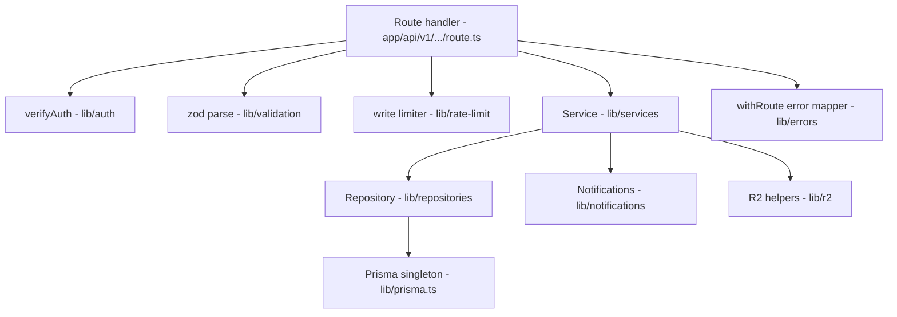

# 09 — Backend Design (Next.js Full-Stack)

| Field | Value |
|---|---|
| **Status** | Draft |
| **Version** | 1.0 |
| **Owner** | Founder (Abhishek) |
| **Last updated** | 2026-07-14 |
| **Depends on** | [../00-foundation/README.md](../00-foundation/README.md) · [../04-business-rules/README.md](../04-business-rules/README.md) · [../06-user-flows/README.md](../06-user-flows/README.md) · [../07-database/README.md](../07-database/README.md) · [../08-api/README.md](../08-api/README.md) · [../12-security/README.md](../12-security/README.md) |

> This document owns the **code-level design of the single Next.js codebase** (locked decision D1: App Router, API route handlers, no separate Express/NestJS service — ever, in MVP). It specifies where every file lives, how layers talk to each other, and how the backend implements the contracts owned elsewhere: business rules by [../04-business-rules/README.md](../04-business-rules/README.md) (`BR-xxx`), the schema by [../07-database/README.md](../07-database/README.md), the wire contract by [../08-api/README.md](../08-api/README.md) (`API-xx`), and the security posture by [../12-security/README.md](../12-security/README.md) (`SEC-Txx`, `ST-xx`). System/infra topology diagrams are deliberately **not** drawn here — they are owned by [../11-architecture/README.md](../11-architecture/README.md); deployment/CI mechanics by [../13-deployment/README.md](../13-deployment/README.md). Screens are cited by `S-xx` from [../06-user-flows/README.md](../06-user-flows/README.md).

**Toolchain (pinned):** Node 20 LTS · Next.js 14.2 (App Router) · TypeScript 5.x `strict` · Prisma `^5.15` (per doc 07 §2) · zod `^3.23` · next-intl `^3` · TanStack Query `^5` · sharp `^0.33` · `@aws-sdk/client-s3` `^3` + `@aws-sdk/s3-request-presigner` · firebase-admin `^12` (server) / firebase `^10` (client) · Serwist `^9` (PWA service worker) · Vitest + Playwright (doc 14). Every `/api` route handler and cron route runs the **Node.js runtime** (`export const runtime = "nodejs"`) — Prisma, firebase-admin and sharp are not Edge-compatible; only `middleware.ts` runs on the Edge.

---

## 1. Repository layout

One repository, one deployable. Every folder below exists from Sprint 1; empty folders carry a `.gitkeep`.

```text
pashusetu/
├── app/                              # Next.js App Router — all pages + all API routes
│   ├── layout.tsx                    # Root layout: <html lang>, NextIntl provider, theme, viewport
│   ├── globals.css                   # Tailwind base + design tokens (doc 10)
│   ├── manifest.ts                   # PWA web-app manifest (D9)
│   ├── sitemap.ts                    # SEO sitemap: static pages + APPROVED listing URLs
│   ├── robots.ts                     # robots.txt — disallows /api and /admin (doc 12 A05)
│   ├── offline/page.tsx              # Offline fallback page precached by the service worker
│   ├── (public)/                     # Route group: no auth required (BR-060)
│   │   ├── page.tsx                  # S-05 home — species chips + latest listings
│   │   ├── listings/page.tsx         # S-06 search results — filters in URL params
│   │   ├── listings/[id]/page.tsx    # S-07 listing detail — SSR for SEO (§12)
│   │   └── legal/[slug]/page.tsx     # T&C, privacy policy, grievance page (doc 16)
│   ├── (auth)/                       # Route group: login wall enforced by layout (Flow D)
│   │   ├── layout.tsx                # Client auth gate: token present else login sheet
│   │   ├── login/page.tsx            # S-02/S-03 phone OTP via backend /auth/otp (§3.6) + signInWithCustomToken
│   │   ├── profile/page.tsx          # S-04 profile setup + S-15 edit/settings
│   │   ├── sell/page.tsx             # S-10a…S-10e listing wizard (client island)
│   │   ├── my-listings/page.tsx      # S-11 My Listings hub with status tabs
│   │   ├── favorites/page.tsx        # S-13 saved listings
│   │   └── notifications/page.tsx    # S-14 bell list
│   ├── admin/                        # S-18…S-23 admin panel — server-side requireAdmin in layout
│   │   ├── layout.tsx                # Loads caller via verifyAuth + is_admin; 3-tab nav: रांग /admin · आकडेवारी /admin/stats · अभिप्राय /admin/feedback (labels doc 10)
│   │   ├── page.tsx                  # S-19 pending queue (रांग) — default tab
│   │   ├── stats/page.tsx            # admin analytics dashboard (आकडेवारी) — reads API-34
│   │   ├── feedback/page.tsx         # feedback inbox (अभिप्राय; नवीन/पूर्ण/सर्व) — #16
│   │   ├── listings/[id]/page.tsx    # S-20 review screen
│   │   ├── reports/page.tsx          # S-21 reports queue
│   │   ├── users/[id]/page.tsx       # S-22 user detail / ban
│   │   └── audit/page.tsx            # S-23 audit log — stats moved to /admin/stats; audit page not yet shipped
│   └── api/
│       ├── v1/                       # doc 08 contracted endpoints + go-live addenda (auth/otp/*, feedback, admin/feedback, meta/talukas, health) — canonical surface owned by doc 08
│       │   ├── auth/otp/send/route.ts                   # POST send/resend OTP (§3.6)
│       │   ├── auth/otp/verify/route.ts                 # POST verify → Firebase custom token (§3.6)
│       │   ├── users/route.ts                          # POST /users (API-01)
│       │   ├── users/me/route.ts                       # GET+PATCH /users/me (API-02/03)
│       │   ├── users/me/listings/route.ts              # GET (API-14)
│       │   ├── users/me/favorites/route.ts             # GET+POST (API-18/19)
│       │   ├── users/me/favorites/[listingId]/route.ts # DELETE (API-20)
│       │   ├── users/me/notifications/route.ts         # GET (API-23)
│       │   ├── meta/breeds/route.ts                    # GET (API-04)
│       │   ├── meta/districts/route.ts                 # GET (API-05)
│       │   ├── meta/talukas/route.ts                   # GET talukas
│       │   ├── listings/route.ts                       # GET search + POST create (API-06/08)
│       │   ├── listings/[id]/route.ts                  # GET detail + PATCH edit (API-07/09)
│       │   ├── listings/[id]/submit/route.ts           # POST (API-10)
│       │   ├── listings/[id]/sold/route.ts             # POST mark-as-sold (API-11)
│       │   ├── listings/[id]/renew/route.ts            # POST (API-12)
│       │   ├── listings/[id]/archive/route.ts          # POST (API-13)
│       │   ├── listings/[id]/images/route.ts           # POST attach (API-16)
│       │   ├── listings/[id]/images/[imageId]/route.ts # DELETE (API-17)
│       │   ├── listings/[id]/interest/route.ts         # POST (API-21) — the only phone egress
│       │   ├── listings/[id]/report/route.ts           # POST (API-22)
│       │   ├── uploads/presign/route.ts                # POST (API-15)
│       │   ├── feedback/route.ts                       # POST submit (optionalAuth, public) — #16
│       │   ├── health/route.ts                         # GET liveness/DB probe (doc 13 PS-006)
│       │   ├── notifications/[id]/read/route.ts        # POST (API-24)
│       │   └── admin/
│       │       ├── listings/route.ts                   # GET queue (API-25)
│       │       ├── listings/[id]/approve/route.ts      # POST (API-26)
│       │       ├── listings/[id]/reject/route.ts       # POST (API-27)
│       │       ├── reports/route.ts                    # GET (API-28)
│       │       ├── reports/[id]/resolve/route.ts       # POST (API-29)
│       │       ├── reports/[id]/dismiss/route.ts       # POST (API-30)
│       │       ├── users/[id]/ban/route.ts             # POST (API-31)
│       │       ├── users/[id]/unban/route.ts           # POST (API-32)
│       │       ├── audit-log/route.ts                  # GET (API-33)
│       │       ├── stats/route.ts                      # GET (API-34) → stats-service + stats-repo (not admin-service)
│       │       ├── feedback/route.ts                   # GET inbox — #16
│       │       └── feedback/[id]/route.ts              # PATCH status — #16
│       └── cron/                     # Internal job routes — CRON_SECRET guarded (§9), NOT part of /api/v1
│           ├── expire-listings/route.ts   # Daily 02:30 IST expiry + T-3d warnings (BR-072)
│           └── housekeeping/route.ts      # Daily 03:00 IST GC + purges + SMS retry (§9.3)
├── components/                       # Shared React components
│   ├── ui/                           # Design-system primitives per doc 10 (buttons, sheets, badges)
│   ├── listings/                     # ListingCard, PhotoCarousel, StatusBadge, FilterSheet
│   ├── forms/                        # Wizard steps, Uploader, DistrictPicker, BreedPicker
│   └── layout/                       # BottomNav, Header, Bell, LanguageToggle
├── lib/                              # ALL non-UI code — the backend proper
│   ├── prisma.ts                     # Prisma client singleton for serverless (§6)
│   ├── auth/
│   │   ├── firebase-admin.ts         # Admin SDK singleton init (§3.4)
│   │   ├── verify-auth.ts            # verifyAuth / requireProfile / requireAdmin (§3)
│   │   ├── verify-id-token.ts        # local ID-token verification (replaces Admin SDK verifyIdToken — §3.6 note)
│   │   ├── mint-custom-token.ts      # RS256-sign a Firebase custom token w/o firebase-admin (§3.6)
│   │   ├── otp-helpers.ts            # E.164 / national phone helpers for the OTP flow
│   │   └── auth-context.ts           # AuthContext type { user } passed to services
│   ├── otp/                          # Self-hosted phone-OTP internals (§3.6)
│   │   ├── config.ts                 # TTL / cooldown / cap constants + OTP_TEST_MODE
│   │   ├── code.ts                   # 6-digit code gen + salted-hash constant-time compare
│   │   └── sms-provider.ts           # Fast2SMS dispatch (SMS_OTP_PROVIDER / FAST2SMS_ROUTE)
│   ├── services/                     # Business rules: one file per domain aggregate (§2)
│   │   ├── user-service.ts           # register, getMe, updateMe (BR-010…BR-015)
│   │   ├── otp-service.ts            # send/verify OTP → Firebase custom token (§3.6)
│   │   ├── listing-service.ts        # create/edit/submit/mark-sold/renew/archive (BR-02x/03x)
│   │   ├── search-service.ts         # public search + detail + view_count (BR-034, doc 08 §4)
│   │   ├── image-service.ts          # presign, attach, delete, T-09 wiring (BR-023)
│   │   ├── favorite-service.ts       # add/remove/list (BR-070)
│   │   ├── interest-service.ts       # log-before-reveal + 20/day (BR-062/063/064)
│   │   ├── report-service.ts         # create + auto-hide T-10 (BR-045/050/051)
│   │   ├── notification-service.ts   # createNotifications + dispatch + caps (§8)
│   │   ├── admin-service.ts          # approve/reject/resolve/dismiss/ban/unban (BR-04x/05x) — stats split out
│   │   ├── stats-service.ts          # read-only admin analytics aggregates (API-34)
│   │   ├── feedback-service.ts       # submit (anon+auth) / list / setStatus (#16)
│   │   ├── meta-service.ts           # breeds/districts cached reads (§12)
│   │   └── serializers.ts            # DTO builders: toListingCard/toListingDetail/toUserProfile —
│   │                                 #   the ONLY place doc 08 shapes are built (phone-concealment ST-02)
│   ├── repositories/                 # Prisma queries only — zero business logic (§2)
│   │   ├── user-repo.ts
│   │   ├── otp-repo.ts               # atomic OTP challenge + per-phone/IP send caps (§3.6)
│   │   ├── listing-repo.ts           # incl. keyset search queries per doc 08 §4.2 / doc 07 §4.1
│   │   ├── image-repo.ts
│   │   ├── favorite-repo.ts
│   │   ├── interest-repo.ts
│   │   ├── report-repo.ts
│   │   ├── notification-repo.ts
│   │   ├── moderation-log-repo.ts
│   │   ├── meta-repo.ts
│   │   ├── feedback-repo.ts          # #16
│   │   ├── stats-repo.ts             # analytics aggregates (API-34)
│   │   └── sitemap-repo.ts           # APPROVED-listing rows for sitemap.ts
│   ├── validation/                   # zod schemas mirroring doc 08 request shapes 1:1 (§4)
│   │   ├── common.ts                 # cuidSchema, pagination, enums, E.164, phone-in-text refinements
│   │   ├── users.ts
│   │   ├── listings.ts
│   │   ├── images.ts
│   │   ├── favorites.ts
│   │   ├── interest.ts
│   │   ├── reports.ts
│   │   └── admin.ts
│   ├── r2/                           # S3-compatible storage integration — R2/Supabase/MinIO (§7)
│   │   ├── client.ts                 # generic S3Client (R2_ENDPOINT/R2_REGION/R2_FORCE_PATH_STYLE)
│   │   ├── presign.ts                # PutObject presign, 600 s, signed type+length
│   │   ├── objects.ts                # headObject, getObjectBytes, deleteObjects
│   │   └── image-pipeline.ts         # sharp: magic-bytes, EXIF strip, WebP variants (§7.3)
│   ├── notifications/                # Notification adapter (§8)
│   │   ├── types.ts                  # NotificationSender interface + template id union
│   │   ├── templates.ts              # NTF-* → DLT template id + param map (BR-071 copy)
│   │   ├── inapp-sender.ts           # DB-row sender (status SENT on create)
│   │   ├── msg91-sender.ts           # MSG91 SMS sender (PENDING → SENT|FAILED)
│   │   └── dispatch.ts               # post-commit best-effort dispatch via waitUntil
│   ├── rate-limit/
│   │   └── write-limit.ts            # Postgres rolling-window 60/min/user (§10)
│   ├── i18n/
│   │   ├── request.ts                # next-intl request config: locale = user pref, default mr
│   │   ├── enums.ts                  # Species/status/reason → message-key mapping (§13)
│   │   └── locales.ts                # LOCALES = ["mr","en"], DEFAULT_LOCALE = "mr"
│   ├── errors/
│   │   ├── app-error.ts              # AppError class + factories for every doc 08 code (§5)
│   │   ├── prisma-map.ts             # Prisma error → AppError mapping table (§5.3)
│   │   └── handle.ts                 # withRoute() wrapper: catch → envelope → Sentry (§5.2)
│   └── utils/
│       ├── cursor.ts                 # opaque base64url keyset cursor encode/decode (doc 07 §4.1)
│       ├── phone.ts                  # BR-065 hard/soft regexes, Devanagari-digit normalize
│       ├── dates.ts                  # UTC helpers; addDays for expires_at
│       └── logger.ts                 # structured JSON logger with key-name redaction (doc 12 §8.5)
├── prisma/
│   ├── schema.prisma                 # Owned verbatim by doc 07 §2 — never edited without doc 07 change
│   ├── seed.ts                       # Idempotent seed (doc 07 §6): districts, breeds, System user
│   └── migrations/                   # Immutable once merged (doc 07 §7.1); incl. hand-written SQL
├── messages/
│   ├── mr.json                       # Marathi catalog — the key authority (D8), 100% complete
│   └── en.json                       # English fallback — same key set, CI-checked parity (§13)
├── scripts/
│   └── grant-admin.ts                # Founder-only admin grant/revoke (BR-012, doc 12 §3.5)
├── tests/                            # Owned by doc 14; layout fixed here
│   ├── unit/                         # Services with mocked repos; utils; image pipeline (ST-07)
│   ├── integration/                  # Route handlers vs Neon test branch; ST-01/03/04/06/10/11
│   ├── e2e/                          # Playwright flows incl. XSS corpus ST-05
│   └── factories/                    # Typed fixture builders (user, listing, image, report)
├── public/                           # Static assets: icons, PWA icons, og-default.png
├── middleware.ts                     # Edge: kill-switch guards READ_ONLY_MODE/DISABLE_* (doc 12 §9.2)
├── instrumentation.ts                # Sentry server init + beforeSend scrubbing (doc 12 §5.5)
├── next.config.ts                    # Security headers (doc 12 §8.1), Serwist wiring, next-intl plugin
├── vercel.json                       # Cron schedules (§9.1)
├── .env.example                      # Every §11 var with placeholder values — committed
├── .eslintrc.cjs                     # incl. no-restricted-syntax raw-SQL ban, react/no-danger,
│                                     #   import-boundary rules (§2.2)
├── package.json                      # "prisma": { "seed": "tsx prisma/seed.ts" }
└── tsconfig.json                     # strict, paths alias "@/..." → repo root
```

Notes:

- `app/api/v1/**` mirrors the canonical endpoint paths from doc 08 exactly — **adding a route file requires a doc 08 endpoint row plus a doc 12 §4 authz-matrix row plus an ST-01 test case first** (deny-by-default rule).
- `app/api/cron/**` sits **outside** `/api/v1` on purpose: the `/api/v1` surface stays exactly the 34 contracted endpoints; cron routes are internal, `CRON_SECRET`-guarded (doc 12 AS-12/B5), and never called by clients.
- `prisma/schema.prisma` is a verbatim copy of doc 07 §2 — this document never restates or modifies the schema.

---

## 2. Layering rules

Three layers, one import direction. This is the backbone that keeps a solo-dev codebase reviewable.



### 2.1 Responsibilities and prohibitions

| Layer | Lives in | Does | MUST NOT |
|---|---|---|---|
| **Route handler** | `app/api/v1/**/route.ts` | Authenticate (`verifyAuth`/`requireAdmin`), enforce the 60/min write limit, zod-parse body/query/path params, call **exactly one** service function, serialize the result via `lib/services/serializers.ts`, and let `withRoute()` map errors to the doc 08 envelope | Import `lib/prisma` or any repository; contain a business rule, a status-machine check, or a Prisma call; build response shapes inline (serializers only — ST-02 depends on it) |
| **Service** | `lib/services/*.ts` | Enforce every `BR-xxx` (state guards, quotas, declaration, ownership), own transactions (`prisma.$transaction` passed down as `tx`), orchestrate repositories + R2 + notifications, throw typed `AppError`s, call `revalidatePath` on status transitions (§12) | Touch `Request`/`NextResponse`/HTTP headers or status codes (it knows error **codes**, never HTTP); parse raw input (it receives zod-inferred types); write Prisma queries inline (repositories only) |
| **Repository** | `lib/repositories/*.ts` | Prisma queries and nothing else: finds, counts, guarded compare-and-swap updates (`UPDATE … WHERE status = <from>`), keyset pagination queries. Accepts an optional `tx: Prisma.TransactionClient` so services can compose them into one transaction | Contain business decisions (a repo returns `updatedCount: 0`; the **service** decides that means `INVALID_STATE_TRANSITION`); throw `AppError` (Prisma errors bubble up to §5.3 mapping); import services, validation, or anything HTTP |

**Import-direction rule:** `app/` → `lib/services` → `lib/repositories` → `lib/prisma`. Never backwards, never skipping (a route importing a repository is a lint error). `lib/validation` is importable from `app/` (route handlers + client forms) only; `lib/errors` and `lib/utils` are importable from anywhere. Server pages (RSC) may import **services** for direct reads (§14) but never repositories.

### 2.2 Enforcement

Enforced mechanically, not by discipline: `eslint-plugin-boundaries` zones (`app`, `services`, `repositories`, `validation`, `prisma`) with the allowed-import matrix above; violations fail CI (doc 14). The same ESLint config carries the doc 12 bans: `$queryRawUnsafe`/`$executeRawUnsafe` (SEC-T14) and `react/no-danger` (SEC-T09).

### 2.3 Worked example — `POST /api/v1/listings/{id}/submit` (API-10, T-02/T-05) end-to-end

TypeScript-style pseudocode; abbreviated but structurally exact. Note two deliberate contract details: **there is no quota check at submit** (a `DRAFT`/`REJECTED` listing already counts toward BR-024 — quota is enforced at `POST /listings`, doc 08 API-10), and a repeat submit on an already-`PENDING` listing is a 200 no-op that refreshes `declaration_at` (doc 08 §1.7).

```ts
// ── app/api/v1/listings/[id]/submit/route.ts ────────────────────────────────
export const runtime = "nodejs";
import { withRoute } from "@/lib/errors/handle";
import { verifyAuth, requireProfile } from "@/lib/auth/verify-auth";
import { enforceWriteLimit } from "@/lib/rate-limit/write-limit";
import { submitListingSchema, cuidSchema } from "@/lib/validation/listings";
import { submitListing } from "@/lib/services/listing-service";
import { toListingDetail } from "@/lib/services/serializers";

export const POST = withRoute(async (req, { params }) => {
  const ctx = await verifyAuth(req);            // 401 UNAUTHENTICATED / 403 USER_BANNED (§3)
  requireProfile(ctx);                          // 403 PROFILE_INCOMPLETE (BR-013)
  await enforceWriteLimit(ctx.user.id);         // 429 RATE_LIMITED, 60/min (BR-090 #2, §10)
  const id = cuidSchema.parse(params.id);       // 400 VALIDATION_ERROR on garbage ids
  const body = submitListingSchema.parse(await req.json()); // { declarationAccepted: true }
  const listing = await submitListing(ctx, id, body);       // ← the ONE service call
  return Response.json(toListingDetail(listing, { viewer: ctx.user }), { status: 200 });
});

// ── lib/validation/listings.ts ──────────────────────────────────────────────
export const submitListingSchema = z
  .object({ declarationAccepted: z.literal(true) })  // BR-027: literally true, nothing else
  .strict();                                         // mass-assignment guard (doc 12 §8.2)
// z.literal(true) failure surfaces as 422 DECLARATION_REQUIRED via a schema-level errorMap.

// ── lib/services/listing-service.ts ─────────────────────────────────────────
export async function submitListing(ctx: AuthContext, id: string, _body: SubmitListingInput) {
  return prisma.$transaction(async (tx) => {
    const listing = await listingRepo.findByIdWithImages(tx, id);
    assertOwnerVisible(ctx, listing);           // §3.6: 404 masked / 403 FORBIDDEN

    if (listing.status === "PENDING") {         // idempotent repeat (doc 08 §1.7)
      return listingRepo.refreshDeclaration(tx, id);       // declaration_at = now, 200 no-op
    }
    if (listing.status !== "DRAFT" && listing.status !== "REJECTED") {
      throw AppError.invalidStateTransition(listing.status, "PENDING"); // 409 (BR-032)
    }

    // T-02 submit guards — one aggregated 422 with details.fields (doc 08 API-10)
    const fieldErrors = validateSubmitCompleteness(listing);   // BR-022 species/sex matrix,
    //   description 10–1000 (BR-025), price ₹500–₹10,00,000 (BR-026), district+village set
    assertNoPhoneInText(listing);                              // BR-065 hard regex → PHONE_IN_DESCRIPTION
    if (listing.images.length < 3) fieldErrors.images = "AT_LEAST_THREE_PHOTOS"; // BR-023 (min 3)
    if (Object.keys(fieldErrors).length) throw AppError.validation(fieldErrors);
    // NOTE: no BR-024 quota check here — DRAFT/REJECTED already occupy a slot (doc 08 API-10).

    const dupIds = await listingRepo.findDuplicateCandidates(tx, {   // BR-029 heuristic:
      sellerId: listing.sellerId, species: listing.species,          //   same seller + species,
      priceInr: listing.priceInr, withinDays: 7, priceTolerance: 0.1 //   price ±10%, 7 days
    });

    const updated = await listingRepo.transitionToPending(tx, {
      id, fromStatuses: ["DRAFT", "REJECTED"],   // compare-and-swap: 0 rows → race lost
      declarationAt: new Date(),                 // BR-027: refreshed on EVERY submit
      clearRejectionReason: true,                // T-05 side effect
      duplicateOfId: dupIds[0] ?? null,          // stored for the S-20 admin badge
    });
    if (!updated) throw AppError.invalidStateTransition(listing.status, "PENDING");

    await notificationService.createForAdmins(tx, {          // BR-071: NTF-ADMIN-PENDING,
      templateId: "NTF-ADMIN-PENDING", channel: "INAPP",     //   one INAPP row per human admin
      params: { listingId: id },                             //   (System user excluded)
    });
    return updated;
  });
  // post-commit (inside withRoute, after the tx resolves): revalidatePath is NOT needed here —
  // the listing was never public; approval (API-26) is what revalidates /listings/[id] (§12).
}

// ── lib/repositories/listing-repo.ts ────────────────────────────────────────
export async function transitionToPending(tx: Tx, args: TransitionArgs) {
  const { count } = await tx.listing.updateMany({
    where: { id: args.id, status: { in: args.fromStatuses } },   // BR-033 CAS guard
    data: { status: "PENDING", declarationAccepted: true, declarationAt: args.declarationAt,
            rejectionReason: null, duplicateOfId: args.duplicateOfId },
  });
  if (count === 0) return null;
  return tx.listing.findUniqueOrThrow({ where: { id: args.id }, include: { images: true,
    breed: true, district: true, seller: { select: SELLER_PUBLIC_SELECT } } });
}
```

Files touched, in call order: `route.ts` → `lib/errors/handle.ts` → `lib/auth/verify-auth.ts` → `lib/rate-limit/write-limit.ts` → `lib/validation/listings.ts` → `lib/services/listing-service.ts` → `lib/repositories/listing-repo.ts` → `lib/services/notification-service.ts` → `lib/services/serializers.ts`. The BR-065 **soft flag** (8–9 digit runs) is deliberately not stored at submit — doc 07 has no column for it; `admin-service.ts` computes `moderation.possibleContactInfo` at read time for API-25 by running the soft regex over the stored description.

---

## 3. Authentication middleware

Design implements doc 12 §3 exactly; no route may hand-roll verification.

### 3.1 `verifyAuth(req, opts?)` — `lib/auth/verify-auth.ts`

1. **Extract** — `Authorization` header must match `^Bearer (.+)$`; missing/malformed → `AppError.unauthenticated()` (401).
2. **Verify** — `getAdminAuth().verifyIdToken(token)` with **`checkRevoked = false`** — the deliberate doc 12 §3.3 stance: per-request DB `status` lookup is strictly faster-acting than Firebase revocation and costs no extra network round-trip; Firebase-level revocation + `checkRevoked` is the recorded Phase 2 hardening item. Signature/`aud`/`iss`/expiry failures → 401 `UNAUTHENTICATED`.
3. **Resolve** — `userRepo.findByFirebaseUid(decoded.uid)` (unique index, the hottest lookup — doc 07 §4.2). The decoded `uid` is the **only** identity input; body/query can never influence identity. No row → behavior by caller: `GET /users/me` returns 404 `NOT_FOUND` (routes to S-04); `POST /users` proceeds with `{ firebaseUid: decoded.uid, phone: decoded.phone_number }` from **token claims only** (doc 12 §3.1); every other endpoint → 403 `PROFILE_INCOMPLETE`.
4. **Ban gate** — `user.status === "BANNED"` → `AppError.userBanned()` (403, wire code `USER_BANNED`) — with exactly one bypass: `verifyAuth(req, { allowBanned: true })`, used **only** by `GET /users/me` so the client can render the banned screen (BR-014).
5. **Attach** — returns `ctx: AuthContext = { user }` (the full Prisma `User` row). Services receive `ctx`, never the token.

Companion guards, same file:

- `requireProfile(ctx)` — `name` and `districtId` set (BR-013) else 403 `PROFILE_INCOMPLETE`. Applied to **every authenticated write** (doc 12 §4 precondition 3).
- `requireAdmin(req)` — runs `verifyAuth`, then `ctx.user.isAdmin === true` else 403 `FORBIDDEN` (no data leakage). Applied by every `app/api/v1/admin/**` handler **and** by `app/admin/layout.tsx` server-side (SEC-T04). There is no cached admin flag — the row is re-read per request (BR-012).
- `optionalAuth(req)` — for public endpoints that personalize when a token is present (API-07 `viewer` block) **and** for `POST /api/v1/feedback` so anonymous callers can submit feedback: invalid/absent token yields `ctx = null` silently, never 401. When a valid token *is* present, its `userId` is attached to the `Feedback` row (`lib/services/feedback-service.ts` `submit`); otherwise the feedback row is anonymous.

### 3.2 Token caching stance

**Verify on every request; cache nothing per-user.** The Firebase Admin SDK verifies the JWT signature **locally** against Google's public certs, which the SDK itself fetches and caches (~1 h TTL) — so per-request verification is CPU-only, no network hop (doc 12 B3). Decoded tokens are never memoized across requests (a 60-minute-lived credential memoized server-side would just re-implement the revocation problem we deliberately avoided). The per-request Neon lookup by `firebase_uid` doubles as the ban/authz read and is a single indexed point query.

### 3.3 Firebase Admin initialization for serverless — `lib/auth/firebase-admin.ts`

```ts
import { initializeApp, getApps, cert, type App } from "firebase-admin/app";
import { getAuth } from "firebase-admin/auth";

function initAdminApp(): App {
  const existing = getApps()[0];
  if (existing) return existing;                    // reuse across warm invocations
  return initializeApp({
    credential: cert({
      projectId: process.env.FIREBASE_PROJECT_ID!,
      clientEmail: process.env.FIREBASE_CLIENT_EMAIL!,
      privateKey: process.env.FIREBASE_PRIVATE_KEY!.replace(/\\n/g, "\n"), // Vercel stores \n escaped
    }),
  });
}
export const getAdminAuth = () => getAuth(initAdminApp());
```

- **Singleton across invocations:** Vercel reuses the Node process between warm invocations; `getApps()` guards against the "app already exists" crash on module re-evaluation. Cold start pays the init once (~10 ms; no network).
- The three env vars are the service-account credential doc 12 tracks as asset AS-06 — stored as **three separate vars** (not one JSON blob) so the multiline private key survives Vercel's env UI and rotation swaps one value at a time (§11).

### 3.4 Kill switches (doc 12 §9.2)

`middleware.ts` (Edge) checks, before anything else: `READ_ONLY_MODE=1` → every non-GET `/api/v1` request gets 503 with error code `INTERNAL` and a Marathi maintenance message; `DISABLE_INTEREST=1` → 503 on `POST /api/v1/listings/*/interest`; `DISABLE_UPLOADS=1` → 503 on presign + attach. Env-var flips + redeploy take < 2 minutes — the containment levers of the incident runbook.

### 3.5 Ownership masking helper

`assertOwnerVisible(ctx, listing)` centralizes the doc 12 §4 masking rule: listing missing → 404 `LISTING_NOT_FOUND`; exists but caller ≠ seller → 403 `FORBIDDEN` if the listing is `APPROVED` (publicly visible anyway), else 404 `LISTING_NOT_FOUND` (existence never confirmed for hidden statuses). Ownership always checked **before** state guards so error codes never leak state (doc 12 §4).

### 3.6 OTP login surface (server-mediated) — `lib/services/otp-service.ts`

Phone login is now **backend-mediated**, replacing Firebase Phone Auth (the client-SDK reCAPTCHA + SMS flow) — a go-live decision reversal (provider Firebase-real-OTP → Fast2SMS; owned by doc 00). Two endpoints front it; the wire contract is doc 08, the toll-fraud model doc 12.

- **`POST /auth/otp/send`** — generates a 6-digit code (`lib/otp/code.ts`; only a per-challenge salt + `sha256(salt:code)` is stored, never plaintext), enforces a **per-phone** resend cooldown + hourly cap and a **per-IP** hourly cap via **atomic** `otp-repo` claims (`claimPhoneSendAndWrite` / `claimIpSend` — conditional `updateMany` under the row lock, so the caps hold under concurrent requests), then dispatches through `lib/otp/sms-provider.ts`. Provider is chosen by `SMS_OTP_PROVIDER` (default **Fast2SMS**); `FAST2SMS_ROUTE` selects `quick` (open international gateway, pre-DLT bridge) or `otp` (DLT route, needs an approved template). Throttles throw 429 `RATE_LIMITED` + `Retry-After`.
- **`POST /auth/otp/verify`** — atomically reserves one of `MAX_VERIFY_ATTEMPTS` (`reserveVerifyAttempt`) **before** hashing the guess, so at most 5 guesses can ever run for a challenge no matter how many verifies race (TOCTOU-safe brute-force cap); a correct code clears the challenge (single-use, no replay), then the service mints a **Firebase custom token** (`lib/auth/mint-custom-token.ts`) carrying a `phone_number` claim. The client calls `signInWithCustomToken`, so `verifyAuth` / `firebaseUid` keying / the ban gate (§3.1) are all **untouched** — `phone_number` is promoted to a top-level ID-token claim exactly as before, and `user-service` reads `token.phone_number` unchanged. Wrong code → 422 `VALIDATION_ERROR` (`details.fields.otp = invalid|expired`); attempts exhausted → 429 `RATE_LIMITED`.
- **Identity mapping:** a returning user reuses their stored `firebaseUid` (looked up by phone); a new user gets a stable `uid = phone_{national}` that their profile row then stores.
- **Backend config (`lib/otp/config.ts`; canonical values owned by doc 04):** code TTL **10 min**, resend cooldown **30 s**, **5** sends/phone/hour, **100** sends/IP/hour (fixed 1 h window), **5** verify attempts. *(The S-03 UI's resend timer is a separate frontend value owned by doc 10 — do not read it as the backend cooldown.)*
- **`OTP_TEST_MODE=1`** (dev/CI **only**, never prod) skips the real SMS and accepts the fixed code `OTP_TEST_CODE` (default `246810`) so Playwright/integration can drive the full flow at zero SMS cost.

> **Custom token, not the Admin SDK.** `mint-custom-token.ts` builds and RS256-signs the token with `node:crypto` and the service-account key directly — `firebase-admin/auth` fails to load on the serverless runtime (`ERR_REQUIRE_ESM`), so `createCustomToken` (and `verifyIdToken`) are hand-rolled locally.

---

## 4. Validation

### 4.1 Organization

One file per domain in `lib/validation/`, mirroring doc 08's request tables 1:1 — every field, bound, and conditionality in doc 08 §2 has exactly one zod counterpart. Schemas are the **single source of typed truth**: `export type CreateListingInput = z.infer<typeof createListingSchema>` — services and client forms (react-hook-form `zodResolver`) consume the same inferred types, and the Sprint-1 `openapi.yaml` generation (doc 08 §6) reads these schemas so contract drift fails CI (doc 14).

Rules (doc 12 §8.2, restated as code conventions):

- Every schema is `.strict()` — unknown keys rejected 400; privileged fields (`isAdmin`, `status`, `phone`, `sellerId`, `viewCount`, `approvedAt`, `expiresAt`) do not exist in any client-writable schema.
- Route handlers parse **body, query, and path params** before anything else; nothing downstream touches `req.json()` output raw.
- Strings: `.trim()`, NFC-normalize (`.transform(s => s.normalize("NFC"))`), length-cap per BR, **then** run BR-065 refinements.
- zod's error map converts issues into the `details.fields` per-field map of `VALIDATION_ERROR` (doc 08 §1.3); raw zod internals are never echoed (doc 12 §8.2). Malformed JSON / wrong types / bad enums / bad cursor → 400; well-formed but domain-invalid → 422 (doc 08 §1.3 split, carried on each schema via a `httpStatus` issue tag).

### 4.2 Shared refinements — `lib/validation/common.ts`

| Refinement | Definition | Used by | BR |
|---|---|---|---|
| `e164Phone` | `/^\+91[6-9]\d{9}$/` — Indian mobile E.164. Only used for display/config validation; identity phone always comes from token claims, never a body | (defensive; no client-writable phone field exists) | BR-010 |
| `priceInr` | `z.number().int().min(500).max(1_000_000)` | listings create/edit | BR-026 |
| `description` | `z.string().trim().min(10).max(1000)` in Unicode code points, then `noPhoneInText` | listings | BR-025 |
| `noPhoneInText` | Normalize Devanagari digits `०-९` → ASCII, strip spaces/hyphens between digit runs, then reject on `/(\+?91[\s-]?)?[6-9]\d{9}/` **or** any run of 10+ digits → 422 `PHONE_IN_DESCRIPTION` | `description`, `village`, `taluka`, user `name`/`village` | BR-065 hard block |
| `softContactFlag(text)` | Non-rejecting helper (exported from `lib/utils/phone.ts`, not a zod refinement): any 8–9 digit run after the same normalization → `possibleContactInfo` badge for API-25 | admin-service read path | BR-065 soft flag |
| `paginationSchema` | `cursor: z.string().optional()` (opaque; decode failures → 400) + `limit: z.coerce.number().int().min(1).max(50).default(20)` (>50 → 422) | every list endpoint | BR-090 #12 |
| `cuidSchema` | `/^c[a-z0-9]{20,}$/` | every path id | doc 08 §1.6 |
| Enum schemas | `speciesSchema`, `sexSchema`, `interestTypeSchema`, `reportReasonSchema`, `listingStatusSchema` — `z.enum` of the exact doc 07 values | everywhere | BR-022, BR-050, BR-062 |

Cross-field conditionality (the BR-022 species/sex matrix: `COW ⇒ FEMALE`, `BULL_OX ⇒ MALE`, `REDA ⇒ MALE` *(REDA/रेडा retired — dormant enum value kept only for archived rows; not listable, `listableSpeciesSchema` rejects it)*, milch fields female-only; report `details` required for `OTHER`) is expressed with `.superRefine` in the domain schemas so a single parse yields the complete `details.fields` map for the wizard's jump-to-step behavior (doc 08 API-10).

**Feedback schema — deliberate BR-065 exemption.** `lib/validation/feedback.ts` (`createFeedbackSchema`: `type` `PROBLEM`|`SUGGESTION`|`OTHER`, `message` 3–1000, `contact` ≤ 120 optional, `path` ≤ 200 optional, `.strict()`) deliberately does **not** run `noPhoneInText` on `message` or `contact`. Feedback is **exempt** from BR-065: a user reporting a problem may legitimately leave a phone number or name for follow-up — the opposite of a listing `description`/`village`, which *do* run the hard phone block. (The BR-065 exemption rule is owned by doc 04; the feedback wire contract by doc 08.)

---

## 5. Error model

### 5.1 `AppError` — `lib/errors/app-error.ts`

```ts
export class AppError extends Error {
  constructor(
    public readonly code: ErrorCode,        // union of the doc 08 §1.3 registry — nothing else compiles
    public readonly httpStatus: number,
    public readonly messageKey: string,     // messages/*.json key under "apiErrors.*"
    public readonly details?: Record<string, unknown>,
  ) { super(code); }
}
```

Static factories exist for every registered code (`AppError.listingLimitReached(activeCount)`, `AppError.rateLimited(retryAfterSeconds)`, `AppError.declarationRequired()`, …) so services can never invent an unregistered code — `ErrorCode` is a closed TypeScript union generated from the doc 08 table. Services **throw**; they never build responses.

### 5.2 One route-level catch — `withRoute()` in `lib/errors/handle.ts`

Every handler is wrapped; there is exactly one place errors become HTTP:

| Caught | Mapped to |
|---|---|
| `AppError` | `{ error: { code, message, details } }` with its `httpStatus`; `message` localized from `messages/{mr,en}.json` by `Accept-Language` (doc 08 §1.5); 429s additionally get a `Retry-After` header |
| `ZodError` | 400 or 422 `VALIDATION_ERROR` with `details.fields` (§4.1) |
| Prisma known errors | via the §5.3 table |
| `SyntaxError` from `req.json()` | 400 `VALIDATION_ERROR` |
| Non-JSON content type on body routes | 415 `UNSUPPORTED_MEDIA_TYPE` |
| Anything else | `Sentry.captureException` → 500 `INTERNAL` with `details.eventId` (doc 08 §1.3) and a generic localized message — **stack traces, Prisma messages, and env values never reach the wire** |

### 5.3 Prisma error mapping — `lib/errors/prisma-map.ts`

| Prisma code | Meaning | Mapped AppError | HTTP | Notes |
|---|---|---|---|---|
| `P2002` | Unique constraint violated | `CONFLICT` — refined by target: `users.phone`/`firebase_uid` → `USER_ALREADY_EXISTS`; `reports_one_open_per_reporter` → `REPORT_ALREADY_EXISTS`; `favorites` PK → treated as idempotent success (BR-070), not an error | 409 | The refinement map keys on `error.meta.target` |
| `P2025` | Record not found on update/delete | `NOT_FOUND` (specific `LISTING_NOT_FOUND` where the repo context is a listing) | 404 | Repos prefer `updateMany` CAS + null return; this is the backstop |
| `P2003` | Foreign-key violation | `VALIDATION_ERROR` with the offending relation in `details.fields` (e.g. unknown `districtId`/`breedId`) | 422 | Reference data is seed-only, so this means bad client input |
| `P2034` | Transaction conflict / deadlock | Retry the transaction **once**, then `INTERNAL` + Sentry | 500 | Only interactive txs (§6.3) can hit it |
| `P2024` | Pool timeout (connection_limit exhausted) | `INTERNAL` + Sentry (capacity signal — alert per doc 12 §9.5) | 500 | — |
| `P1001`/`P1002`/`P1008` | DB unreachable / timeout | `INTERNAL` + Sentry | 500 | Neon cold-start blips surface here; client shows the generic retry state |
| any other `P*` / unknown | — | `INTERNAL` + Sentry | 500 | Never leaked |

### 5.4 Sentry capture rules

- Capture: every 500/unknown error (with `eventId` returned), cron job failures (§9), Prisma `P2024`/connection errors, and the doc 12 §8.5 custom events (admin-route 403 counter, rate-limit trips as breadcrumbs, attach-validation rejects).
- **Never capture** expected 4xx `AppError`s as exceptions — they are product behavior, not defects (they appear only as breadcrumbs on a later 500).
- `beforeSend` (in `instrumentation.ts` + `sentry.client.config.ts`): strip `Authorization` headers, cookies, request bodies; redact anything matching `[+]?[0-9]{10,13}` in messages/breadcrumbs (doc 12 §5.5). `tracesSampleRate = 0.1`.

---

## 6. Prisma client management

### 6.1 Singleton — `lib/prisma.ts`

```ts
import { PrismaClient } from "@prisma/client";
const globalForPrisma = globalThis as unknown as { prisma?: PrismaClient };
export const prisma =
  globalForPrisma.prisma ??
  new PrismaClient({ log: ["warn", "error"] });
if (process.env.NODE_ENV !== "production") globalForPrisma.prisma = prisma;
```

The `globalThis` stash prevents dev hot-reload from leaking clients; in production each warm serverless instance holds exactly one client. No `$disconnect()` calls in request code — the pooler owns connection lifecycle.

### 6.2 Connection strings — doc 07 §8.3 followed exactly

| Var | Value | Used by |
|---|---|---|
| `DATABASE_URL` | Neon **pooled** host (`-pooler`) + `?sslmode=require&pgbouncer=true&connect_timeout=15&connection_limit=5` — PgBouncer transaction mode; `pgbouncer=true` disables prepared statements; `connection_limit=5` per instance | Runtime (all route handlers + crons) |
| `DIRECT_URL` | Neon direct host | `prisma migrate` / `prisma studio` / `scripts/grant-admin.ts` only — never runtime |

### 6.3 Transaction usage rules

**Interactive transactions (`prisma.$transaction(async tx => …)`) are used only where a multi-row invariant must hold atomically** — everywhere else, single guarded statements (CAS `updateMany … WHERE status = <from>`, BR-033) suffice and are cheaper through transaction-mode PgBouncer:

| Transaction | Invariant | Doc |
|---|---|---|
| Listing create | BR-024 quota: `SELECT … FOR UPDATE` on the seller's `users` row as per-user mutex → count non-terminal listings → insert | doc 07 §9.1 |
| Image attach | BR-023: count existing `listing_images` (< 10) → insert row → T-09 CAS if listing was `APPROVED` | doc 07 §9.1 |
| Report create | BR-045: insert report → count OPEN → if ≥ 3, CAS `APPROVED→PENDING` + `moderation_log AUTO_HIDE` + notification rows; BR-051 5/day count in the same tx | doc 07 §9.1 |
| Interest create | BR-062/064: rolling-24h count (< 20) → insert `interest_events` → read seller phone; the row commits **before** the reveal response is built | doc 07 §9.1 |
| Submit | §2.3: CAS transition + duplicate flag + admin notifications | BR-027/029 |
| Admin mutations | Decision + `moderation_log` row + notification rows, one tx each (BR-046); ban = bulk T-12 archive + one `BAN` log row (BR-014) | doc 08 §2.10 |

Rules: transactions stay **short** (≤ a few hundred rows, doc 07 §8.3); **no external I/O inside a transaction** — no R2 calls, no MSG91 calls, no Sentry flushes (notification *rows* are written inside; *dispatch* happens post-commit, §8.3); default isolation (Read Committed) is sufficient because every state change is a CAS with a `WHERE status = <from>` precondition plus row locks where counting (BR-033 pattern); `$transaction` options pinned to `{ maxWait: 5_000, timeout: 10_000 }`.

---

## 7. R2 integration

Implements doc 12 §6 (security controls) and doc 08 API-15/16/17 (wire contract). D4 locked: **S3-compatible object storage** (Cloudflare R2 / Supabase Storage / MinIO) with presigned direct uploads and two buckets — a private originals bucket and a public WebP-variants bucket. `lib/r2/client.ts` is a **generic S3 client** driven by `R2_ENDPOINT` / `R2_REGION` / `R2_FORCE_PATH_STYLE`, so the same code runs on any of the three; bucket names are **derived from the `R2_BUCKET` prefix** (`<prefix>-uploads` private, `<prefix>-public` public). **Go-live runs on Supabase Storage** — the chosen-provider decision (no-credit-card constraint) is owned by doc 00 (stack) + doc 13 (deployment); only the code-level integration is documented here. *(The `r2/` folder and `R2_*` env prefix are historical names; the integration is provider-neutral — the old fixed buckets `pashusetu-uploads`/`pashusetu-public` and the `img.pashusetu.in` endpoint are superseded.)*

### 7.1 Client — `lib/r2/client.ts`

Generic `S3Client` singleton (`getS3()`, lazily created): `endpoint = R2_ENDPOINT` (falling back to `https://${R2_ACCOUNT_ID}.r2.cloudflarestorage.com` for R2), `region = R2_REGION ?? "auto"` (Supabase/AWS validate the real region in the SigV4 signature, so set it — e.g. `ap-south-1`), `forcePathStyle = R2_FORCE_PATH_STYLE === "1"` (Supabase/MinIO need path-style addressing; R2 uses vhost-style), credentials from `R2_ACCESS_KEY_ID`/`R2_SECRET_ACCESS_KEY` (server env only — never in the client bundle, SEC-T15). Checksum handling is pinned to `WHEN_REQUIRED` (`requestChecksumCalculation`/`responseChecksumValidation`) so presigned `PutObject` URLs stay plain-body uploads — the SDK-default CRC32 trailing checksum breaks a browser `fetch()` PUT.

### 7.2 Presign service — `lib/r2/presign.ts` (API-15)

After the service-layer checks (owner, editable state per BR-028, photo count < 10 — BR-023 raised 5→10, value owned by doc 04 — content-type whitelist, `sizeBytes` 1–5,242,880 — doc 12 §6.1):

```ts
const key = `listings/${listingId}/original/${createId()}.${EXT[contentType]}`;
// 100% server-generated (doc 12 §6.1); EXT maps the validated content type to
//   jpg | png | webp — the doc 08 API-15 key shape `listings/{id}/original/{cuid}.{ext}`
const url = await getSignedUrl(r2, new PutObjectCommand({
  Bucket: env.R2_BUCKET, Key: key,
  ContentType: contentType,          // signed header — a JPEG-signed URL can't PUT text/html
  ContentLength: sizeBytes,          // signed header — the PUT-presign equivalent of the
}), { expiresIn: 600 });             //   content-length-range condition (1 B – 5 MB, doc 12 §6.1)
return { key, uploadUrl: url, expiresIn: 600, headers: { "Content-Type": contentType } };
```

- **Expiry 600 s** — docs 08 (API-15) and 12 (§6.1) agree; doc 08 is the wire authority.
- **Key scheme (doc 08 API-15):** `listings/{listingId}/original/{imageCuid}.{ext}` in the **private** bucket, `{ext}` derived from the validated content type (`jpg`|`png`|`webp`) — the key travels in the API-15 response payload, so the doc 08 wire shape is authoritative. Doc 12 §6.1's security property is unchanged: the key is 100% server-generated with no client-contributed part, the authoritative type is the enforced `Content-Type`, and originals are never served regardless.
- The signature binds bucket + key + type + length: oversize or retyped PUTs die at R2 (SEC-T05). Re-PUT within the window can only overwrite the caller's own not-yet-attached object — closed at attach.

### 7.3 Attach flow — `lib/services/image-service.ts` + `lib/r2/image-pipeline.ts` (API-16)

Ordered exactly per doc 12 §6.2:

1. Owner + state re-check; key-shape check `^listings/{id}/original/c[a-z0-9]{20,}\.(jpg|png|webp)$` with `{id}` equal to the route's listing id — foreign-namespace keys → 422 `INVALID_UPLOAD`.
2. **`HeadObject` on the private bucket before any DB row**: object must exist with `ContentLength ≤ 5 MB` (defense in depth). Missing/oversize → 422 `INVALID_UPLOAD`.
3. `GetObject` bytes → **magic-bytes sniff** (`FF D8 FF` / `89 50 4E 47` / `RIFF…WEBP`); declared type untrusted. Mismatch → delete object + 422 (BR-023).
4. **sharp pipeline** (the only image parser): `.rotate()` normalizes EXIF orientation → `metadata()` yields true width/height (overwrites client-sent values) → three WebP variants, `withoutEnlargement`, **never** `.withMetadata()` so EXIF/XMP/IPTC incl. GPS are stripped (doc 12 §6.3, unit-tested ST-07):

   | Variant | Max width | WebP quality | Budget (PRD NFR-02) |
   |---|---|---|---|
   | `thumb` | 400 px | 70, re-encode at 55 if > 40 KB | ≤ 40 KB (search cards on 3G) |
   | `card` | 800 px | 75 | — (stored in `listing_images.url`) |
   | `detail` | 1280 px | 75 | — (S-07 carousel) |

   Undecodable files → delete + 422; they never reach the public bucket.
5. **Variant keys (public bucket)** — named by variant to match the doc 08 `ImageObject.urls` contract, which is the wire authority for URL shape: `listings/{listingId}/thumb/{imageCuid}.webp`, `…/card/…`, `…/detail/…`, written with `Cache-Control: public, max-age=31536000, immutable` and served as `{R2_PUBLIC_BASE_URL}/listings/{listingId}/{variant}/{imageCuid}.webp` (= `https://img.pashusetu.in/…`). Doc 12 §6.2's size-suffix sketch (`-400/-800/-1280`) maps 1:1 onto `thumb/card/detail`; the doc 08 path shape wins because clients receive these URLs.
6. Then, in one **interactive transaction** (§6.3): count images < 10 (BR-023 max raised 5→10 — more angles sell an animal faster; min stays 3, doc 04) → insert `listing_images` row (`r2Key` = private base key, `url` = card variant URL, true `width`/`height`, next free `sortOrder`) → T-09 CAS if the listing was `APPROVED` (requires `declarationAccepted: true` — doc 08 API-16).

Timing note: variant generation runs **inline in the attach handler before the transaction** (steps 3–5 ≈ 1–3 s for a 5 MB original — acceptable, the wizard shows the local file meanwhile per S-10c); the doc 08 allowance that `urls` "may serve placeholder variants for a few seconds" therefore never triggers in practice but remains contractually available.

Deletion (API-17): DB row deleted + `sortOrder` compacted in one tx; original + variants removed via a post-commit best-effort `DeleteObjects`; the housekeeping GC (§9.3) is the backstop for failed deletes and never-attached uploads.

---

## 8. Notifications adapter

### 8.1 Interface — `lib/notifications/types.ts`

```ts
export type NtfTemplateId =
  | "NTF-LISTING-APPROVED" | "NTF-LISTING-REJECTED" | "NTF-INTEREST-RECEIVED"
  | "NTF-EXPIRY-WARNING"   | "NTF-LISTING-EXPIRED"  | "NTF-LISTING-HIDDEN"
  | "NTF-ADMIN-PENDING"    | "NTF-ADMIN-AUTOHIDE"   | "NTF-USER-BANNED" | "NTF-USER-UNBANNED";

export interface NotificationSender {
  send(userId: string, templateId: NtfTemplateId, params: Record<string, string>,
       channel: "SMS" | "INAPP"): Promise<{ notificationId: string; status: "SENT" | "PENDING" | "FAILED" }>;
}
```

Template ids map 1:1 to the BR-071 trigger table; the stored `notifications.type` value (doc 07 §5.9) and API-23's wire `type` field (doc 08 §1.9) are this identical `NTF-*` template-id string — no prefix stripping anywhere. Channel fan-out per event (SMS+INAPP vs INAPP-only) follows the BR-071 table verbatim — `notification-service.ts` owns that mapping; callers name the event, never the channels.

### 8.2 Implementations

- **`inapp-sender.ts`** — inserts a `notifications` row with `channel = INAPP`, `status = SENT` (doc 08 API-23: INAPP rows are born `SENT`, become `READ` via API-24). Payload = template params (`{ listingId, listingTitleMr, reasonCode, reasonMr, buyerName, expiresAt }` subset per doc 07 §5.9).
- **`msg91-sender.ts`** — inserts the row with `channel = SMS`, `status = PENDING`, then (post-commit, §8.3) calls the MSG91 Flow API (v5) with the DLT template id from `templates.ts` and the recipient's E.164 number; HTTP 2xx + accepted → `status = SENT`, anything else → `FAILED`. Marathi SMS bodies are the **fixed BR-071 canonical strings** with `{#var#}` slots for `listingUrl`/`reasonMr`/`helpline` only — no attacker-controlled free text (SEC-T18).
- **DLT compliance (India, TRAI):** every SMS template must be pre-registered on a DLT platform under the PashuSetu entity with sender ID `PSHSTU` (6 chars), and MSG91 must have the approved template ids before a single SMS can be delivered. Registration takes days-to-weeks — **flagged as a Sprint-1 external task** (tracked in [../15-project-plan/README.md](../15-project-plan/README.md)): register entity + sender ID + all 8 SMS-channel templates from BR-071 (approved/rejected/interest/expiry-warning/banned/unbanned + the doc 12 §9.3 breach template + a reserved generic). Until approval lands, the sender logs `FAILED` with reason `DLT_PENDING` and the product runs INAPP-only.
- **OTP SMS is a separate path.** Login-code SMS does **not** travel this adapter: it is dispatched by `lib/otp/sms-provider.ts` (Fast2SMS, §3.6), never through the `NotificationSender` interface or `msg91-sender`, and the `NtfTemplateId` union (§8.1) carries **no** OTP template. This keeps the notification outbox (§8.3) and the OTP login surface (§3.6) cleanly separated — different provider, different DLT posture, different failure handling.

### 8.3 Outbox stance (decision, stated)

**MVP = the `notifications` row is the outbox record; delivery is best-effort inline with status tracking.** Concretely: (a) rows are created **inside the triggering transaction** (BR-071 enforcement — the event and its notification commit or roll back together); (b) after commit, the route hands the new SMS row ids to `dispatch.ts`, which fires MSG91 calls via `waitUntil()` (`@vercel/functions`) so the user response is never blocked; (c) outcome is written back as `SENT`/`FAILED`. (d) **Retry:** the daily housekeeping cron (§9.3) re-attempts `FAILED` and stuck-`PENDING` SMS rows younger than 24 h once — this is the minimal "async with retry" that BR-071 requires and exactly what `notifications_dispatch_idx` was built for (doc 07 §4.2). A dedicated near-real-time retry worker / queue-backed outbox is **Phase 2**; at MVP volume (≤ a few hundred SMS/day) a daily retry pass plus INAPP redundancy is sufficient, and every notification-worthy event also has an INAPP row that never needs delivery infrastructure.

Caps enforced in `notification-service.ts`: interest SMS ≤ **3/day/seller**, silent downgrade to INAPP-only (BR-090 #13 — counted from today's `SMS` rows of type `NTF-INTEREST-RECEIVED` for that user inside the creating tx); admin recipients for `NTF-ADMIN-*` = all `is_admin = true` users **except** the seeded System user (doc 07 §6.3).

---

## 9. Scheduled jobs — Vercel Cron

### 9.1 Schedule (`vercel.json`)

```json
{
  "crons": [
    { "path": "/api/cron/expire-listings", "schedule": "0 21 * * *" },
    { "path": "/api/cron/housekeeping",   "schedule": "30 21 * * *" }
  ]
}
```

21:00 UTC = **02:30 IST** — the BR-072 canonical time; housekeeping follows at 03:00 IST. Two jobs (not four) is deliberate: Vercel's Hobby tier allows two daily crons, so GC + purge + SMS retry share one route. **Security:** every `/api/cron/*` handler first checks `Authorization: Bearer ${CRON_SECRET}` (Vercel injects it automatically when the `CRON_SECRET` env var is set) and returns 401 otherwise — doc 12 boundary B5 / asset AS-12. Handlers export `maxDuration = 60` and self-impose a 50 s soft deadline: unfinished work is safely left for the next run because every step is idempotent.

### 9.2 `/api/cron/expire-listings` — BR-072, T-07

Two ordered passes, both batched (100 rows/iteration) and idempotent:

1. **Expire:** select `id` where `status = 'APPROVED' AND expires_at < now()` (index `listings_expiry_idx`); per batch, one transaction: CAS `updateMany … WHERE status = 'APPROVED'` → `EXPIRED` + create `NTF-LISTING-EXPIRED` INAPP rows (INAPP-only per BR-071 — the SMS budget was spent on the warning). The CAS precondition makes double-runs and mid-run crashes harmless (BR-033).
2. **Warn (T-3d):** select `APPROVED` with `expires_at` in `(now(), now() + 3 days]` **and** no existing notification row with `type = 'NTF-EXPIRY-WARNING'` and `payload.listingId = id` and `payload.expiresAt = expires_at` — the BR-071 dedup key (doc 07 §5.9) guarantees once-per-cycle even across re-runs. Create SMS + INAPP rows; dispatch SMS post-batch (§8.3).

Each expired listing also gets `revalidatePath("/listings/{id}")` so its SSR page drops to the 404/unavailable state (§12). Job completion pings a Sentry Cron Monitor; a missed schedule or thrown error fires the doc 12 §9.5 "Cron failure" alert.

### 9.3 `/api/cron/housekeeping` — GC, purges, SMS retry

| Step | Action | Rule |
|---|---|---|
| Orphan-upload GC | List private-bucket objects with `LastModified < now() − 24 h`, delete those with no `listing_images.r2_key` row; delete public variants whose image row no longer exists | doc 12 §6.2 step 6; doc 08 API-15 ("garbage-collected after 24 h") |
| Notification purge | `DELETE FROM notifications WHERE created_at < now() − 90 days` (index `notifications_purge_idx`) | BR-071 / BR-090 #18 |
| Rate-limit GC | `DELETE FROM rate_limits WHERE window_ends_at < now() − 1 hour` | doc 12 §8.4 |
| SMS retry | Re-dispatch `channel = SMS` rows with `status = 'FAILED'` (or `PENDING` older than 15 min — a crashed `waitUntil`) and `created_at > now() − 24 h`, one retry attempt per run (index `notifications_dispatch_idx`) | §8.3 (d) |

All four steps are order-independent and individually idempotent; each logs a one-line summary (`{step, scanned, acted}`) and pings its Sentry monitor.

---

## 10. Rate limiting

Postgres-based, per the doc 12 §8.4 decision (no Redis/Upstash in MVP; revisit trigger recorded there); window semantics per doc 04 BR-090 — every limit in the BR-090 table, including #2, is a **rolling** window. Two mechanisms:

### 10.1 Rolling-window write limiter — `lib/rate-limit/write-limit.ts` (BR-090 #2)

Table — deliberately **not** a Prisma model (infrastructure state, not domain data; keeps doc 07's canonical 10-model schema intact), created by a hand-written migration following the doc 07 §9.2 precedent, accessed via tagged-template `$queryRaw` (parameterized — SEC-T14 compliant):

```sql
CREATE TABLE "rate_limits" (
  "key"            text PRIMARY KEY,          -- "w:{userId}"
  "hits"           timestamptz[] NOT NULL,    -- write timestamps inside the trailing 60 s
  "window_ends_at" timestamptz NOT NULL       -- newest hit + 60 s (GC watermark, §9.3)
);
CREATE INDEX "rate_limits_window_idx" ON "rate_limits" ("window_ends_at");  -- housekeeping GC
```

```ts
export async function enforceWriteLimit(userId: string): Promise<void> {
  const [{ count, oldest }] = await prisma.$queryRaw<{ count: number; oldest: Date }[]>`
    INSERT INTO rate_limits (key, hits, window_ends_at)
    VALUES (${"w:" + userId}, ARRAY[now()], now() + interval '60 seconds')
    ON CONFLICT (key) DO UPDATE SET
      hits = (SELECT coalesce(array_agg(t ORDER BY t), '{}')      -- drop hits older than 60 s,
              FROM unnest(rate_limits.hits) AS t                  --   append the current one
              WHERE t > now() - interval '60 seconds') || now(),
      window_ends_at = now() + interval '60 seconds'
    RETURNING array_length(hits, 1) AS count, hits[1] AS oldest`;
  if (count > 60) throw AppError.rateLimited(
    Math.max(1, Math.ceil((oldest.getTime() + 60_000 - Date.now()) / 1000)));  // details.retryAfterSeconds
}
```

One atomic statement per request — the upsert's row lock serializes parallel racers, so the cap can never be exceeded (SEC-T11, verified by ST-06). The window is **rolling** per BR-090 #2: 60 writes in any trailing 60 s, with no doubled budget across a minute boundary. `Retry-After` = seconds until the oldest still-counting hit leaves the window; rejected attempts are appended too, so a client hammering past the cap stays limited until it genuinely backs off (the array stays bounded by the client's own attempt rate over 60 s).

### 10.2 Domain-window limits — counted in-transaction

The daily limits are **not** counter rows: they are exact rolling-24 h counts over the domain tables, executed inside the same transaction as the insert (doc 12 §8.4 #2), so the limit and the audit trail can never drift.

### 10.3 Who gets what (canonical application table)

| Endpoint set | Limit | Mechanism | Error |
|---|---|---|---|
| Every authenticated `POST`/`PATCH`/`DELETE` under `/api/v1` | 60/min/user, rolling 60 s (BR-090 #2) | §10.1 rolling window, called by the handler right after `requireProfile` | 429 `RATE_LIMITED` + `Retry-After` |
| `POST /listings/{id}/interest` | 20/day/buyer, rolling 24 h, all types+listings (BR-064) | `COUNT(*)` on `interest_events` via `interest_events_buyer_idx` inside the reveal tx | 429 `RATE_LIMITED` |
| `POST /listings/{id}/report` | 5/day/user rolling 24 h (BR-051) | `COUNT(*)` on `reports` via `reports_reporter_idx` inside the report tx | 429 `RATE_LIMITED` |
| Stored quotas: 10 active listings / 5 photos / 200 favorites | BR-024/023/070 | Domain guards in their transactions (§6.3) — quotas, not rate limits | 409 `LIMIT_EXCEEDED` family |
| All `GET`s (public + authed) | No app-layer limit | Vercel edge absorbs read load (SEC-T08); page size clamped ≤ 50 | — |
| `/api/cron/*` | Exempt | `CRON_SECRET` bearer check instead | 401 |
| `POST /auth/otp/send` | per-phone 30 s resend cooldown + 5 sends/hour; per-IP 100 sends/hour (fixed 1 h window) — BR-090 #1 (values owned by doc 04) | atomic claims in `otp-repo` (`claimPhoneSendAndWrite` / `claimIpSend`) — **not** the §10.1 `users.id` write-limiter (login is pre-auth) | 429 `RATE_LIMITED` + `Retry-After` |
| `POST /auth/otp/verify` | 5 wrong-code attempts per challenge, then a fresh code is required | atomic `reserveVerifyAttempt` in `otp-repo` | 429 `RATE_LIMITED` (exhausted) / 422 `VALIDATION_ERROR` (`details.fields.otp = invalid|expired`) |

Keying for the §10.1 write-limiter is always `users.id`, never IP (rural CGNAT — doc 12 §8.4 #3). **OTP is the deliberate exception:** its login surface (`POST /auth/otp/send` + `/auth/otp/verify` — see §3.6) is **pre-auth**, so it carries its own rate limits, enforced by atomic conditional DB updates in `lib/repositories/otp-repo.ts` (per-phone + per-IP) rather than the `users.id` write-limiter. Window/cap values are owned by doc 04 (BR-090 #1); the toll-fraud rationale is doc 12.

---

## 11. Environment variable catalog

"Where set": **L** = local `.env` (gitignored; `.env.example` documents every var) · **P** = Vercel Preview · **Pr** = Vercel Production. Preview deployments use the **dev Firebase project and a per-PR Neon branch** (doc 07 §7.2, doc 12 A05) — CI injects the branch connection strings.

| Name | Purpose | L | P | Pr | Secret? |
|---|---|---|---|---|---|
| `DATABASE_URL` | Neon **pooled** runtime string incl. `pgbouncer=true&connection_limit=5` (§6.2) | dev branch | per-PR branch (CI-injected) | main branch | **Yes** |
| `DIRECT_URL` | Neon direct string — migrations/studio/scripts only | dev branch | per-PR branch (CI-injected) | main branch | **Yes** |
| `FIREBASE_PROJECT_ID` | Admin SDK credential (project) | dev project | dev project | prod project | No (server-only anyway) |
| `FIREBASE_CLIENT_EMAIL` | Admin SDK credential (service account) | ✓ | ✓ | ✓ | **Yes** |
| `FIREBASE_PRIVATE_KEY` | Admin SDK credential (PEM, `\n`-escaped — §3.3) | ✓ | ✓ | ✓ | **Yes** |
| `R2_ACCOUNT_ID` | R2 only — derives the S3 endpoint when `R2_ENDPOINT` is unset (§7.1) | ✓ | ✓ | ✓ | No |
| `R2_ENDPOINT` | S3 API endpoint — R2 (`https://<acct>.r2.cloudflarestorage.com`), Supabase (`https://<ref>.supabase.co/storage/v1/s3`), or MinIO (§7.1) | ✓ | ✓ | ✓ | No |
| `R2_REGION` | SigV4 region — blank/`auto` for R2; the real region for Supabase/AWS (e.g. `ap-south-1`) | ✓ | ✓ | ✓ | No |
| `R2_FORCE_PATH_STYLE` | `1` for Supabase/MinIO (path-style addressing); blank for R2 (vhost) | ✓ | ✓ | ✓ | No |
| `R2_ACCESS_KEY_ID` | R2 API key (scoped to the two buckets) | ✓ | ✓ | ✓ | **Yes** |
| `R2_SECRET_ACCESS_KEY` | R2 API secret | ✓ | ✓ | ✓ | **Yes** |
| `R2_BUCKET` | Bucket **prefix** — code derives `<prefix>-uploads` (private originals) + `<prefix>-public` (public variants); supersedes the old fixed bucket names | dev prefix | dev prefix | prod prefix | No |
| `R2_PUBLIC_BUCKET` | *(superseded)* the public bucket is now derived as `<R2_BUCKET>-public`; no longer read by the code | — | — | — | No |
| `R2_PUBLIC_BASE_URL` | Public serving origin — `https://img.pashusetu.in` (dev buckets use the `r2.dev` URL) | ✓ | ✓ | ✓ | No |
| `MSG91_AUTH_KEY` | MSG91 API key (§8.2) | test key | test key | ✓ | **Yes** |
| `MSG91_SENDER_ID` | DLT-registered sender ID `PSHSTU` (notification SMS, §8 — **separate** from the OTP provider below) | ✓ | ✓ | ✓ | No |
| `SMS_OTP_PROVIDER` | OTP-SMS provider selector (§3.6) — default `fast2sms` | — | ✓ | ✓ | No |
| `FAST2SMS_API_KEY` | Fast2SMS API key for OTP dispatch (§3.6) | ✓ | ✓ | ✓ | **Yes** |
| `FAST2SMS_ROUTE` | `quick` (open gateway, pre-DLT bridge) or `otp` (DLT route) — §3.6 | ✓ | ✓ | ✓ | No |
| `OTP_TEST_MODE` | `1` skips real SMS + uses the fixed test code — **dev/CI ONLY, never prod** (unset in Pr) | dev/CI | CI | unset | No |
| `OTP_TEST_CODE` | Fixed OTP in test mode — default `246810` (dev/CI) | dev/CI | CI | — | No |
| `SENTRY_DSN` | Server + client error reporting | optional | ✓ | ✓ | No (DSN is not a secret; treat as config) |
| `CRON_SECRET` | Bearer secret for `/api/cron/*` (§9.1) | ✓ | ✓ | ✓ (distinct values) | **Yes** |
| `NEXT_PUBLIC_FIREBASE_API_KEY` | Firebase **client** config (public by design — doc 12 SEC-T15 allowlist) | dev project | dev project | prod project | No |
| `NEXT_PUBLIC_FIREBASE_AUTH_DOMAIN` | Firebase client config | ✓ | ✓ | ✓ | No |
| `NEXT_PUBLIC_FIREBASE_PROJECT_ID` | Firebase client config | ✓ | ✓ | ✓ | No |
| `NEXT_PUBLIC_FIREBASE_APP_ID` | Firebase client config | ✓ | ✓ | ✓ | No |
| `NEXT_PUBLIC_APP_URL` | Canonical origin for absolute URLs (`whatsappUrl` listing links BR-063, sitemap, OG tags) — `https://pashusetu.in`; preview = the deployment URL | `http://localhost:3000` | deployment URL | prod URL | No |
| `READ_ONLY_MODE` / `DISABLE_INTEREST` / `DISABLE_UPLOADS` | Incident kill switches (§3.4, doc 12 §9.2) — unset by default | unset | unset | unset | No |
| `SENTRY_AUTH_TOKEN` | CI-only: sourcemap upload at build | — | CI secret | CI secret | **Yes** |

`FIREBASE_PROJECT_ID`+`FIREBASE_CLIENT_EMAIL`+`FIREBASE_PRIVATE_KEY` together are the service-account credential doc 12 inventories as asset AS-06 (`FIREBASE_SERVICE_ACCOUNT`); the three-var split is the storage format (§3.3). Rotation triggers/order per doc 12 §9.4; runbooks in [../13-deployment/README.md](../13-deployment/README.md). CI gates (gitleaks, client-bundle secret grep — ST-08) police this table.

---

## 12. Caching & rendering strategy

| Surface | Strategy | Invalidation |
|---|---|---|
| Reference data (breeds/districts) | API: `Cache-Control: public, s-maxage=86400, stale-while-revalidate=604800` (doc 08 API-04/05). Server-side reads (pickers rendered in RSC) via `unstable_cache(metaRepo.…, ["meta"], { revalidate: 86400 })` | Reference data changes only via seed migrations (doc 07 §6) — the 24 h window is the invalidation |
| Public listing detail page `/listings/[id]` (S-07) | **SSR with ISR**: `export const revalidate = 86400` on the page; renders `ListingDetail` (public shape, never a phone — BR-066) + JSON-LD for SEO | `revalidatePath("/listings/{id}")` called by the service layer on **every status transition** touching the listing — approve (page goes live), reject/auto-hide/archive/expire (page → 404/unavailable), mark-sold (SOLD banner per doc 08 API-07), price-only edit (fresh price). The `viewer` block + `view_count` increment come from the client island's `GET /api/v1/listings/{id}` call on hydration — the cached HTML stays personalization-free, and BR-034's increment stays exclusively in API-07 |
| Search `GET /listings` + `/listings` page (S-06) | **Always dynamic** (`force-dynamic` / no store) — filters and freshness beat cacheability; every query is an index scan (doc 07 §4) | n/a |
| Home feed (S-05) | Dynamic render with `Cache-Control: s-maxage=60, stale-while-revalidate=300` at the edge — near-fresh, absorbs anonymous browse load | 60 s window |
| PWA shell | Static: layout, nav, `/offline` page precached by the Serwist service worker (D9); images runtime-cached SWR with a capped store; **authed API responses are never SW-cached** beyond what logout clears (doc 12 §3.4) | SW update flow per NFR-11 |
| `sitemap.ts` | Regenerated on demand with `revalidate = 3600`; lists static pages + `APPROVED` listings (`listings_status_created_idx`) | 1 h window |
| Admin panel + all authed screens | Fully dynamic, no caching (correctness over speed for moderation) | n/a |

---

## 13. i18n approach

- **Library: next-intl**, wired via `lib/i18n/request.ts`. **No locale segment in URLs** (decision): language is a *user preference*, not a URL dimension — canonical listing URLs stay shareable and SEO-stable. Locale resolution order: authenticated user's `languagePref` (MR|EN, BR-010) → `lang` cookie (set by the S-15 toggle, persists through logout per F-12 AC-2) → default **`mr`**.
- **Catalogs:** `messages/mr.json` is the authority and must be 100 % complete — Marathi-first is D8, so **`mr` is the default locale and `en` is the fallback, never the reverse**. `en.json` mirrors the key set; a CI parity check fails on missing/extra keys in either file (doc 12 §8.5 "i18n test suites"). `getMessageFallback` falls back `en → mr` for any straggler key so users never see raw keys.
- **Server usage:** RSC pages and layouts use `getTranslations()`; **API error messages** are localized inside `withRoute()` from the same catalogs, keyed by `AppError.messageKey` and selected by `Accept-Language` (`mr`|`en`, else `en` — doc 08 §1.5). API **data** is never localized: reference rows always carry both `nameEn` and `nameMr`; user text is returned verbatim.
- **Client usage:** interactive islands receive only their namespace slice through `NextIntlClientProvider` (payload discipline for 3G — NFR-01); `useTranslations()` inside. Notification items (API-23) are rendered client-side from `notifications.{type}` keys + `payload` params, so language follows the *current* preference at render time (doc 08 API-23).
- **Enum label mapping** — `lib/i18n/enums.ts` maps every wire enum to a message key; components never switch-case on enums inline:

  | Key | mr | en |
  |---|---|---|
  | `enums.species.COW` | गाय | Cow |
  | `enums.species.BUFFALO` | म्हैस | Buffalo |
  | `enums.species.BULL_OX` | बैल | Bull / Ox |
  | `enums.species.GOAT` | शेळी | Goat |
  | `enums.species.SHEEP` | मेंढी | Sheep |
  | `enums.species.REDA` | रेडा | He-buffalo *(retired — display only for archived rows; not listable)* |
  | `enums.listingStatus.DRAFT` | अपूर्ण जाहिरात *(incomplete listing)* | Draft |
  | `enums.listingStatus.PENDING` | तपासणी सुरू आहे *(under review)* | Under review |
  | `enums.listingStatus.APPROVED` | सुरू आहे *(live)* | Live |
  | `enums.listingStatus.SOLD` | विकले गेले *(sold)* | Sold |
  | `enums.listingStatus.EXPIRED` | मुदत संपली *(expired)* | Expired |
  | `enums.listingStatus.REJECTED` | मंजूर झाली नाही *(not approved)* | Not approved |
  | `enums.listingStatus.ARCHIVED` | काढून टाकली *(removed)* | Removed |

  The same pattern covers `reportReason.*`, `rejectionReason.*` (BR-043 taxonomy), `errors.*` (per doc 08 error code — e.g. `errors.LISTING_LIMIT_REACHED` carries the BR-024 canonical Marathi copy), and `notifications.*`. Final register/wording review is the doc 10 native-speaker gate; keys and meanings are fixed here and in doc 04.

---

## 14. Frontend architecture summary

(Brief by design — visual/UX requirements are owned by [../10-frontend-design-requirements/README.md](../10-frontend-design-requirements/README.md).)

- **React Server Components by default.** Pages under `(public)/` and `admin/` are RSC; they may call **services directly** server-side (never repositories, never Prisma — §2.1) for first-paint data: home feed, listing detail, admin queue.
- **Client components only for interactive islands:** the listing wizard + autosave (S-10a–e), the photo uploader (presign → PUT → attach state machine), filter sheet + infinite scroll (S-06), favorite heart, contact buttons + login-wall replay (Flow C), notification bell, language toggle, OTP login.
- **Client code talks ONLY to `/api/v1`** through a typed `apiFetch` wrapper that attaches the Firebase ID token, handles the 401-refresh-retry-once contract (doc 12 §3.2), and parses the error envelope into typed `ApiError`s keyed for `errors.*` copy.
- **TanStack Query v5** for all client data: `useInfiniteQuery` for search/favorites/notifications (cursor pagination), mutations with optimistic updates for favorite/read/mark-sold, and query invalidation keyed by listing id after wizard mutations.
- **Forms:** react-hook-form + `zodResolver` reusing the exact `lib/validation` schemas — client validation is UX only; the server parse remains the authority (doc 12 §8.2).
- **PWA:** Serwist service worker — precached shell + offline fallback, runtime image cache; installability per D9.

---

## 15. Testing hooks

How the layers are designed to be tested (implementation, CI wiring, coverage targets and the ST-01…ST-12 security suites are owned by [../14-testing-qa/README.md](../14-testing-qa/README.md)):

- **Services — unit tests (Vitest, `tests/unit/`):** repositories are constructor-free modules, so services import them via a thin indirection that Vitest mocks (`vi.mock("@/lib/repositories/listing-repo")`). Every BR guard gets a case: quota at 10, 6th photo, declaration missing, each disallowed transition (feeding ST-10), BR-065 corpus (ASCII + Devanagari digits), duplicate heuristic boundaries (±10 %, 7 days). The image pipeline is unit-tested with fixture files incl. the GPS-EXIF JPEG (ST-07).
- **Route handlers — integration tests (`tests/integration/`):** run against a **Neon branch test database** (branch-per-CI-run, copy-on-write from a seeded baseline — same mechanics as doc 07 §7.2 previews), exercising the full stack: real zod, real Prisma, real transactions, mocked Firebase Admin (`verifyIdToken` stub per fixture user) and mocked MSG91/R2 network (dev R2 bucket for the nightly ST-03 presign suite). The doc 12 §4 authz matrix is table-driven into ST-01 so matrix and tests cannot drift.
- **Fixtures/factories (`tests/factories/`):** typed builders (`makeUser`, `makeListing({ status })`, `makeReport`, …) that write through Prisma against the test branch; seed data (districts/breeds/System user) comes from the real `prisma/seed.ts` so tests exercise production reference data.
- **E2E (Playwright, `tests/e2e/`):** the doc 06 golden flows (create→submit→approve→contact) plus the ST-05 XSS render corpus, against a preview deployment.

---

## Acceptance checklist

- [x] Header table complete (Status/Version/Owner/Last updated 2026-07-14/Depends on with relative links); no system/infra diagrams — architecture explicitly deferred to `../11-architecture/README.md`
- [x] §1 full annotated repository tree: `app/` with `(public)`/`(auth)`/`admin/` route groups and `api/v1/**` route.ts files mirroring all 34 canonical endpoints exactly (plus `api/cron/*` outside v1, justified); `lib/` with auth/services/repositories/validation/r2/notifications/rate-limit/i18n/errors/utils; `prisma/` (schema.prisma, seed.ts, migrations/); `messages/` (mr.json, en.json); `tests/` (unit/integration/e2e); `public/`; config files — every folder annotated
- [x] §2 layering: route handler → service → repository responsibilities with explicit MUST-NOT lists, import-direction rule enforced by ESLint boundaries; one fully worked TypeScript-style example of `POST /api/v1/listings/{id}/submit` end-to-end with file names, showing auth → zod → state guard + declaration + completeness → transaction (CAS + BR-029 duplicate flag) → NTF-ADMIN-PENDING → response, and explicitly documenting that the BR-024 quota check lives at create, not submit (per doc 08 API-10)
- [x] §3 verifyAuth: Bearer extraction, Admin-SDK `verifyIdToken`, revocation stance stated and reconciled with doc 12 §3.3 (`checkRevoked=false`, DB status per request; Firebase revocation = Phase 2), user resolution by `firebase_uid`, BANNED → 403 `USER_BANNED` with the `GET /users/me` exception, `ctx { user }`, `requireProfile`/`requireAdmin`/`optionalAuth`; token caching stance (verify per request, SDK caches certs) and serverless singleton init pattern with `\n`-escaped private key
- [x] §4 validation: `lib/validation/<domain>.ts` mirroring doc 08 request schemas with inferred TS types as single source; shared refinements incl. E.164, price bounds BR-026, description 10–1000 BR-025, and the exact BR-065 phone-in-text regex (ASCII + Devanagari `०-९`, 10+-digit runs hard block, 8–9-digit soft flag computed at admin read time)
- [x] §5 error model: `AppError` with closed code union from the doc 08 registry, services throw / one `withRoute()` catch maps to the envelope; Prisma mapping table (P2002→CONFLICT with target refinement, P2025→NOT_FOUND, P2003→VALIDATION_ERROR, P2034 retry-once, P2024/P1001→INTERNAL); no internals leaked; Sentry capture rules incl. `beforeSend` scrubbing and `details.eventId`
- [x] §6 Prisma: `globalThis` singleton; pooled `DATABASE_URL` with `pgbouncer=true&connection_limit=5` + `DIRECT_URL` exactly per doc 07 §8.3; interactive-transaction whitelist (create-quota, image-attach count, report auto-hide, interest log-before-reveal, submit, admin mutations) with no-external-I/O and CAS rules
- [x] §7 R2: S3 SDK presign with signed content-type + content-length (600 s per docs 08/12 — no conflict), doc 08 API-15 key scheme `listings/{listingId}/original/{cuid}.{ext}` (server-generated per doc 12 §6.1), HEAD-before-DB-row attach, magic-bytes sniff, sharp pipeline stripping EXIF/GPS producing thumb 400/card 800/detail 1280 WebP variants (doc 08 wire contract wins over the task's 1600 px sketch; doc 12 suffix notation mapped to `thumb/card/detail` paths), public serving via `img.pashusetu.in`, deletion + GC backstop
- [x] §8 notifications: `NotificationSender` interface (userId, templateId, params, channel); MSG91 implementation with DLT registration flagged as Sprint-1 external task (entity + sender ID `PSHSTU` + all BR-071 templates); in-app = DB rows born `SENT`; outbox stance stated — row in triggering tx + post-commit best-effort `waitUntil` dispatch with status tracking, daily single-retry pass in housekeeping (satisfying BR-071 "async with retry"), queue-backed worker Phase 2; 3 SMS/day/seller downgrade (BR-090 #13)
- [x] §9 cron: `vercel.json` with `0 21 * * *` = 02:30 IST (BR-072 aligned) expiry job (batched CAS expiry + T-3d warning with the doc 07 §5.9 dedup key) and 03:00 IST housekeeping (orphan GC 24 h, notification purge 90 d, rate-limit GC, SMS retry); both idempotent, `CRON_SECRET` bearer-guarded, Sentry cron monitors
- [x] §10 rate limiting: Postgres rolling-window per BR-090 #2 (Postgres-not-Redis decision per doc 12 §8.4) — exact `rate_limits` table DDL (hand-written migration, not a Prisma model — doc 07's 10-model schema untouched), atomic `INSERT … ON CONFLICT … RETURNING` helper, and the canonical endpoint→limit table (60/min writes, 20/day interest, 5/day reports in-tx, quotas as 409s, GETs unlimited, cron exempt)
- [x] §11 env catalog: all mandated vars (DATABASE_URL, DIRECT_URL, FIREBASE_PROJECT_ID/CLIENT_EMAIL/PRIVATE_KEY, R2_ACCOUNT_ID/ACCESS_KEY_ID/SECRET_ACCESS_KEY/R2_BUCKET/R2_PUBLIC_BASE_URL, MSG91_AUTH_KEY/SENDER_ID, SENTRY_DSN, CRON_SECRET, NEXT_PUBLIC_FIREBASE_*, NEXT_PUBLIC_APP_URL) plus justified additions (R2_PUBLIC_BUCKET, kill switches, SENTRY_AUTH_TOKEN) with purpose / local-preview-prod placement / secret flag; AS-06 three-var split reconciled with doc 12
- [x] §12 caching: breeds/districts revalidate 24 h (matching doc 08 cache headers); listing detail SSR/ISR with `revalidatePath` on every moderation/status event and view-count increments kept exclusively in API-07; search always dynamic; PWA shell static via Serwist
- [x] §13 i18n: next-intl, `mr` default with `en` fallback (never reversed — D8), no URL locale segment (decision), server vs client message usage rules, API error localization via `Accept-Language`, enum→label mapping table with real Devanagari + glosses, CI key-parity check
- [x] §14 frontend summary ≤ 30 lines: RSC default, listed client islands, pages call services directly (never repos), client → `/api/v1` only, TanStack Query for mutations/infinite scroll, zod-shared forms
- [x] §15 testing hooks: services unit-tested with mocked repos, route handlers integration-tested on a Neon branch test DB, typed factories + real seed, E2E, with ownership deferred to `../14-testing-qa/README.md`
- [x] Consistency verified: zero contradictions with D1–D10 (no Express/NestJS/Mongo/Supabase, no separate backend, no in-app chat); **note:** the original "backend never sends OTP" decision was **reversed at go-live** — the backend now generates and sends OTP via Fast2SMS and mints Firebase custom tokens (§3.6), replacing Firebase Phone Auth (doc 00); all constants cite BR ids from doc 04 (BR-090 table numbers, BR-072 02:30 IST, BR-071 templates/caps, BR-065 regex verbatim); schema names/indexes cite doc 07; endpoint paths/shapes cite doc 08; security controls cite doc 12; the mermaid block uses quoted labels with no parentheses inside bracket labels; no unresolved placeholders or open questions
