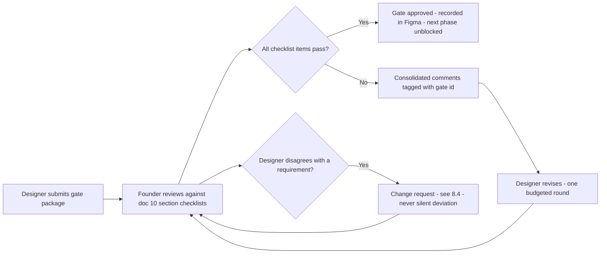

# 10 — Frontend Design Requirements (Designer Handoff)

| Field | Value |
|---|---|
| **Status** | Draft |
| **Version** | 1.0 |
| **Owner** | Founder (Abhishek) |
| **Last updated** | 2026-07-04 |
| **Depends on** | [../00-foundation/README.md](../00-foundation/README.md) · [../01-prd/README.md](../01-prd/README.md) · [../03-users/README.md](../03-users/README.md) · [../04-business-rules/README.md](../04-business-rules/README.md) · [../05-features/README.md](../05-features/README.md) · [../06-user-flows/README.md](../06-user-flows/README.md) |

> **Who this document is for.** You — the external UI designer producing the Figma designs for PashuSetu. This document is deliberately self-sufficient: everything you need is in here (personas, constraints, every screen with its contents and states, the component list, tokens, deliverables). You do not need to read the other docs to design; the links exist so the founder can trace every requirement to its source.
>
> **What this document is.** Requirements only. It tells you *what every screen must do and contain* and *which constraints bind you*. It never tells you what the product should look like — visual style, color values, illustration style, iconography and layout composition are yours to propose, within the hard constraints of §2 and the token constraints of §5. Flows, screens, fields, rules and copy meaning are **frozen** by [../04-business-rules/README.md](../04-business-rules/README.md), [../05-features/README.md](../05-features/README.md) and [../06-user-flows/README.md](../06-user-flows/README.md) — see §9.

---

## 1. Project brief for the designer

### 1.1 The product in 10 lines

1. PashuSetu (पशुसेतू — "the bridge for livestock") is a **marketplace web app** where farmers in rural Maharashtra sell cows, buffaloes, bulls/oxen, goats and sheep (five listable species; REDA/रेडा — a male breeding/draft buffalo — retired, not listable).
2. It is a **PWA**: opened from a WhatsApp link or installed to the home screen — never from an app store.
3. **Sellers** photograph an animal and fill a 5-step Marathi wizard; the listing goes to an admin queue.
4. **Every listing is human-moderated before it becomes public** — trust is the core product promise, and the UI must make this checking visible and reassuring, not bureaucratic.
5. **Buyers** (traders, dairy farms) browse and filter without any login; login (phone OTP, no passwords) is required only to contact a seller, save favorites, report, or sell.
6. Contact happens by **phone call and WhatsApp** — there is no in-app chat, no payments, no auctions in this version.
7. The seller's phone number is hidden until a logged-in buyer taps a contact button; the app then opens the dialer or WhatsApp directly.
8. Listings live for 30 days, can be renewed with one tap, and are marked "sold" by the seller — keeping the market fresh is a headline feature.
9. The whole platform is **free** — no commission, no listing fee — and the UI must never look like it might charge money (a real user fear).
10. **Marathi is the default language everywhere**; English is a fallback toggle. Many users are first-time smartphone users who read slowly — pictures, icons-with-labels and big buttons carry the comprehension load.

### 1.2 The six product principles (validate every design decision against these)

| # | Principle | What it means for design |
|---|---|---|
| 1 | **Farmer First** | When seller convenience conflicts with anything else, the seller wins. The wizard is the most important surface in the product. |
| 2 | **Trust Over Speed** | Moderation states ("under review", "checked listing" badge) are first-class UI, never fine print. |
| 3 | **Simple Enough for First-Time Smartphone Users** | Icon + text pairing, minimal typing, forgiving flows, nothing ever lost by a wrong tap. |
| 4 | **Marathi First** | Design every screen with the Marathi string first; English is the variant, never the reverse. |
| 5 | **Fast on Slow Internet** | Every screen usable on 3G; skeletons over spinners; no decorative asset that costs kilobytes. |
| 6 | **No Hidden Charges** | Nothing in the UI may resemble a paywall, coin, premium tier or price tag on the product itself. |

### 1.3 Target users — the four key personas (compressed from doc 03)

**Design rule: if a screen works for Sunita (P4), it works for everyone.** She is the stress-test lens for every wireframe.

| | **P1 — Ramesh** (primary seller) | **P2 — Mahesh** (primary buyer) | **P3 — Anjali** (high-value buyer) | **P4 — Sunita** (design-stress persona) |
|---|---|---|---|---|
| Who | Farmer, 45, Satara. 3 cows; sells ~1 animal/year when cash is needed. 8th-standard Marathi schooling. | Livestock trader, 38, Sangli. Buys ~10 animals/month across 5 districts. Lives in 20+ WhatsApp trading groups. | Dairy farm owner, 34, Ahilyanagar. B.Sc. Agri. Buys 1–2 high-yield animals per quarter at ₹60k–1.2L. | Woman farmer, 52, widow, Dharashiv. 4 goats + 1 buffalo. Reads Marathi slowly, letter by letter. **Cannot type.** |
| Device / network | ₹7,500 Android, 3 GB RAM, storage full, weak battery. 3G in the cattle shed; data pack exhausted by evening. | ₹15,000 Android, 6 GB RAM, dual SIM. 4G most of the day, patchy between towns. | ₹25,000 Android + office laptop. Always online. | 4-year-old hand-me-down Android 9, 2 GB RAM, cracked screen. Patchy 3G, ₹155 pack when affordable. |
| Literacy | Reads/writes Marathi; recognizes Latin digits and "OK/Call/WhatsApp". Prefers voice over typing. | Types fast in Marathi + Roman-script Marathi. Power user of classifieds apps. | Fully comfortable in English but prefers Marathi labels — farm staff share her screen. | Navigates purely by icon shape, color and position. Fears a wrong tap will "cut money". English = instant abandonment. |
| Wants from the UI | Post a listing in minutes; feel credible; see proof buyers are looking (views, interest). | Filter fast (species, breed, district, price); spot fresh vs stale instantly; shortlist and burn through calls. | Trust structured data: milk yield, lactation, pregnancy, vaccination visible and scannable. | Photos and voice over text; one decision per screen; nothing irreversible without a plain-Marathi confirmation. |
| Fears the UI must defuse | Hidden charges; his number reaching strangers; "photos not good enough". | Junk/duplicate listings; dead leads; daily caps blocking his volume. | Misstated data; wasting a day traveling for a misrepresented animal. | Being cheated; pressing the wrong button; anything in English; sharing photos of her home. |

**Internal persona (admin screens S-18…S-23):** P5 — Vikram, 27, operations moderator on a laptop (Chrome, broadband). Needs to clear 50–100 pending listings/day inside a 24-hour SLA — dense, fast, keyboard-friendly, **English-first desktop UI**. Everything else in this document is mobile-first Marathi; the admin section (§3.4, §7) is the single exception.

### 1.4 Device & context reality (design for this, not for a flagship)

| Fact | Design consequence |
|---|---|
| Reference device: entry Android, 5–6 inch, **360×800 logical px**, 2–4 GB RAM, Android 9+, Chrome | 360 px is the design baseline (§7). No layout may require > 360 px width. |
| Network: 3G / throttled 4G, data-capped packs | Skeletons, lazy images, offline states are mandatory deliverables per screen (§3). Decorative imagery is a data cost — earn it or cut it. |
| Outdoor use in **direct sunlight** (fields, cattle sheds, mandis) | Contrast ≥ 4.5:1 everywhere; avoid pale grey text, thin strokes and low-contrast disabled states that vanish in sunlight. |
| **One-handed use** while holding a rope, a bag, an umbrella | Primary actions in the bottom half of the screen; sticky bottom bars for the key action; no top-corner-only critical controls. |
| Cracked screens, aged digitizers | Touch targets ≥ 48×48 px with ≥ 8 px gaps; no precision gestures as the only path (§6). |
| Shared devices, interruptions (cattle, customers, power cuts) | Every flow is resumable; drafts autosave; nothing is lost on exit. |
| System font-size often raised by users | Layouts must survive 130% font scale without clipping or overlap (§6). |

---

## 2. Hard constraints (non-negotiable)

Every constraint below is verified at each review gate (§8.3). A design that violates any of these is returned unreviewed.

| Id | Constraint | Detail |
|---|---|---|
| HC-01 | **Marathi-first design** | Every frame is designed with the real Marathi strings of §3 first; the English variant is derived afterwards. Never mock with lorem ipsum or English placeholders. **Devanagari runs ~15–20% longer than the equivalent English and needs taller line boxes** — buttons, tabs, chips and badges are sized to the Marathi string, then checked in English (never the reverse). |
| HC-02 | **Typeface** | **Noto Sans Devanagari** for all Devanagari text, paired with **Noto Sans** for Latin text and digits. Self-hosted subset, budgeted ≤ 60 KB WOFF2 (PRD NFR-02) — no additional display typeface may be introduced. |
| HC-03 | **Type size floor** | Body text minimum **16 px**; **prefer 18 px** for Marathi body copy (never below 17 px for Devanagari body, PRD NFR-07). De-emphasized metadata (timestamps, counters) may go to 14 px but never carries essential or actionable information. Icon captions ≥ 14 px. |
| HC-04 | **Touch targets** | Minimum **48×48 px** per interactive element, with ≥ 8 px spacing between adjacent targets. |
| HC-05 | **Contrast** | Text and meaningful icons ≥ **4.5:1** against their background — including on photos (use scrims), in disabled states that must stay readable, and across every status color (§5). Sunlight readability is the bar, not just WCAG. |
| HC-06 | **Icons always carry text labels** | No icon-only buttons anywhere in the user app — every icon is paired with a Marathi word (e.g. 📞 «कॉल करा»). This includes compact controls: the favorite heart carries «जतन» (save), share carries «शेअर», the bell carries «सूचना» where space allows and always an accessible name. Admin screens may relax visible labels for standard table controls but never for destructive actions. |
| HC-07 | **Max 2 levels of navigation depth** | No screen sits more than two levels below a bottom-nav tab root (e.g. Home → Search results → Listing detail). Overlays (sheets, dialogs, photo viewer) do not count as a level. **One bounded exception to the no-hamburger rule:** a single top-level account/overflow menu — the Home app-bar **AppMenu** — is permitted. It carries ONLY the logged-in user block, secondary-nav duplicates and utilities — the nav duplicates (होम · जनावरे पहा · विका · माझी प्रोफाइल), the अभिप्राय (feedback) entry, an admin link when `isAdmin`, and «बाहेर पडा» (logout) — never primary navigation, which stays in the fixed bottom nav (HC-08). No other hamburger menus; no nested settings trees beyond one sub-level (S-15 → S-16 is the deepest settings path). **FLAG for founder:** reconcile this exception against HC-08 — confirm the 4-tab bottom nav still coexists with the AppMenu (nav structure is owned by [../06-user-flows/README.md](../06-user-flows/README.md)). |
| HC-08 | **Bottom navigation: exactly 4 tabs** | होम / Home · विका / Sell · आवडते / Favorites · प्रोफाइल / Profile — fixed order, fixed set (doc 06 §5.2). No fifth tab, no "more" tab. Hidden inside the wizard (S-10) and on overlays. |
| HC-09 | **No text-only critical actions** | Every primary/destructive action pairs icon + text (the inverse of HC-06). Submit, call, WhatsApp, mark-sold, delete-photo, report, approve/reject all carry a recognizable pictogram plus the Marathi label. |
| HC-10 | **Forms: one primary question per step** | The listing wizard asks one primary decision per step (max 3 related inputs per chunk, PRD NFR-07). No screen in the user app presents more than one form section requiring thought at once. Pickers and chips over free-text everywhere except village and description. |
| HC-11 | **Numerals: Latin digits only** | Devanagari digits (०–९) are never used. All prices, counts, ages, dates and timers use Latin digits with Indian grouping (₹65,000 · ₹1,25,000), in both locales (PRD F-12 AC-6). **Normalization note:** where a canonical string in doc 06 §6 contains Devanagari digits (e.g. «२४», «३०»), this rule wins and the digit is rendered Latin («24», «30») — wording otherwise verbatim. This is the single, deliberate deviation from verbatim reuse. |
| HC-12 | **One primary action per screen** | Each screen has exactly one visually dominant action; everything else is visibly secondary. |
| HC-13 | **Performance-aware design** | First-load budgets are hard (PRD NFR-01: ≤ 500 KB total, ≤ 200 KB JS on search/detail). Consequences for design: no full-bleed decorative photography, no video backgrounds, no custom illustration heavier than a simple SVG per empty state, skeleton states for anything that loads, explicit image dimensions everywhere (zero layout shift). |
| HC-14 | **Screens and ids are fixed** | Design exactly the 24 screens + 5 wizard sub-steps of §3 under their `S-xx` ids (Figma pages named "S-07 Listing detail" etc.) — the 24th (the admin feedback inbox) is **pending a doc 06 §8 id assignment**; see that screen's flag. You may add **states** of existing screens, never new screens or renumbered ids (doc 06 §8). |
| HC-15 | **Trust & legal surfaces are verbatim** | The seller declaration text, rejection reasons, the "checked listing" badge, and the number-privacy reassurance use the exact strings given in §3 — meaning is owned by [../04-business-rules/README.md](../04-business-rules/README.md) (BR-027, BR-043) and may not be paraphrased. |

---

## 3. Complete screen inventory

### 3.1 How to read this section

- Ids `S-01`…`S-24` (+ `S-10a`…`S-10e`) are the canonical inventory from [../06-user-flows/README.md](../06-user-flows/README.md) §3 — **29 design units** total (S-24, the admin feedback inbox, is pending a doc 06 §8 id assignment).
- **Must contain** lists every data field and action that must appear. Order and arrangement are yours; presence is not.
- **States** enumerates every state to design for that screen. Definitions used throughout:
  - **Loading** — content-shaped skeleton placeholders (never a full-screen spinner; a spinner may appear only inside a button). Anything visible longer than 300 ms needs a skeleton.
  - **Empty** — zero-data state with an illustration slot, one plain-Marathi sentence, and a CTA (never a dead end).
  - **Error** — icon + one short Marathi sentence + one recovery button. No error codes shown to users.
  - **Offline** — global banner «इंटरनेट नाही — जुनी माहिती दाखवत आहोत» ("No internet — showing older data") + cached content where available; all write actions disabled with an explanatory state.
  - **Success** — explicit confirmation (toast, inline check, or confirmation screen) for every completed write.
- **Marathi copy** gives the key strings (Devanagari + gloss). Strings marked 06 are canonical from doc 06 §6 and reused verbatim (digits normalized per HC-11); the rest are new canonical strings introduced by this document. Design with these strings, not placeholders.

**Two global states to design once, applied everywhere:**

1. **Login-wall sheet** — S-02 + S-03 rendered as a bottom sheet over any screen, with the context line 06 «विक्रेत्याशी बोलण्यासाठी आधी लॉगिन करा» ("To talk to the seller, log in first" — context line varies per trigger: contact / favorite / report / sell). Cancellable; the host screen stays visible behind the scrim.
2. **Banned account screen** — full-screen block: sober icon, «नियमांच्या उल्लंघनामुळे तुमचे खाते बंद आहे. संपर्क: support@pashusetu.in / हेल्पलाइन» ("Your account is suspended for rule violations. Contact: support@pashusetu.in / helpline" — grievance contact **support@pashusetu.in** + helpline number slot), and a button back to public browsing (S-05). No dead end.

### 3.2 Public & auth screens

#### S-01 — Splash & language pick · भाषा निवडा
- **Purpose:** first-run brand moment + language choice; मराठी pre-selected, one tap continues. Shown once.
- **Must contain:** logo + wordmark slot; tagline slot; two large language options (मराठी pre-selected, English) as tappable cards; continue button; free-of-cost reassurance line; entry point to a skippable ≤ 60-second Marathi voice-over intro video (doc 03 directive A10).
- **Primary action:** «पुढे जा» (continue) → S-05. **Secondary:** play intro video; switch selection.
- **States:** default (मराठी selected) · English selected · video playing (with skip) · offline (screen fully functional; video entry hidden) · font-loading fallback (system font swap must not break layout).
- **Navigation:** In — first open / cleared data. Out — S-05.
- **Marathi copy:** «भाषा निवडा» (choose language) · «पुढे जा» (continue) · «हे ॲप पूर्णपणे मोफत आहे» (this app is completely free) · «ॲप कसे वापरायचे ते पहा» (see how to use the app).

#### S-02 — Phone entry · मोबाईल नंबर टाका
- **Purpose:** collect the 10-digit Indian mobile and trigger the Firebase OTP send. Two presentations: full-screen (from Profile/Sell tab) and bottom-sheet login wall (see §3.1).
- **Must contain:** title; context line (login-wall variant only); fixed non-editable «+91» prefix; 10-digit numeric input (numeric keypad, large digit rendering); send button with loading state; one-line trust note that the number is used only for login; links to T&C and privacy policy; close/cancel (sheet variant).
- **Primary action:** «OTP पाठवा» (send OTP) → S-03. **Secondary:** cancel/close → origin screen, nothing lost.
- **States:** default · invalid input inline error (letters / < 10 digits / non-Indian prefix; send disabled) · sending (button loading) · send failed — throttled or network («थोड्या वेळाने पुन्हा प्रयत्न करा» / try again after a while, with retry) · offline (send disabled + banner) · success → S-03.
- **Navigation:** In — login wall from any gated action; Sell/Favorites/Profile tab while anonymous; `/login`. Out — S-03; cancel → origin.
- **Marathi copy:** «मोबाईल नंबर टाका» (enter mobile number) · «OTP पाठवा» (send OTP) · «बरोबर 10 अंकी नंबर टाका» (enter a valid 10-digit number) · 06 «विक्रेत्याशी बोलण्यासाठी आधी लॉगिन करा».

#### S-03 — OTP verify · OTP टाका
- **Purpose:** 6-digit code entry with timer, attempt counting, resend and change-number escape hatches.
- **Must contain:** masked target number («+91 98••• ••210») with «नंबर बदला» (change number) link; 6-box OTP input (auto-advance, paste-friendly, WebOTP auto-read as progressive enhancement); 120 s countdown timer; resend control (disabled until timer expiry, then a 30 s minimum cooldown between sends); attempt feedback (5 wrong codes invalidate the code); note that the code is valid for 10 minutes; verify button with loading state. (These numeric limits are owned by [../04-business-rules/README.md](../04-business-rules/README.md) — doc-10 mirrors them.)
- **Primary action:** verify → S-04 (new user) or original destination (returning). **Secondary:** resend; change number → S-02 with input preserved; cancel (sheet variant).
- **States:** default (timer running) · verifying · wrong code (06 «चुकीचा OTP. पुन्हा प्रयत्न करा.» — inline, input cleared, attempt counter visible) · code invalidated after the 5th wrong attempt (verify disabled, resend highlighted) · resend cooldown countdown · resend failed — one plain-Marathi sentence + retry («OTP पाठवता आला नाही. थोड्या वेळाने पुन्हा प्रयत्न करा.» or, when throttled, «खूप वेळा प्रयत्न झाला. थोड्या वेळाने पुन्हा पाठवा.»; the SMS-provider (Fast2SMS) status/message is captured server-side for diagnosis, not shown to the user) · resend success toast «OTP पुन्हा पाठवला आहे» (OTP sent again) · offline · banned user (route to global banned screen) · success.
- **Navigation:** In — S-02. Out — S-04 / destination / S-02.
- **Marathi copy:** 06 «चुकीचा OTP. पुन्हा प्रयत्न करा.» · 06 «OTP पुन्हा पाठवा» (send OTP again) · «नंबर बदला» (change number).

#### S-04 — Profile setup · प्रोफाइल तयार करा
- **Purpose:** first-login minimal profile so the user can transact; must complete in under a minute, mostly taps.
- **Must contain:** name input (2–50 chars, any script); district picker — searchable list of the 36 Maharashtra districts with Marathi labels (required); taluka input (optional); village input with autocomplete assist that silently degrades to plain text (optional here); role question as two large check-cards «मला जनावर विकायचे आहे» (I want to sell an animal) / «मला जनावर विकत घ्यायचे आहे» (I want to buy an animal) — both selectable, at least one required; save button; note that the phone number is already verified.
- **Primary action:** «जतन करा» (save) → original destination or S-05. **Secondary:** none (this screen cannot be skipped once entered; back returns to S-03 context).
- **States:** default · per-field validation errors (name too short / only digits; district missing; no role selected) · district picker open (searchable sheet) · autocomplete suggestions / silent fallback · saving · save failed (retry, inputs kept) · offline · success.
- **Navigation:** In — S-03 when no profile exists. Out — destination / S-05.
- **Marathi copy:** «तुमचे नाव» (your name) · «जिल्हा निवडा» (choose district) · «गाव» (village) · «किमान एक निवडा» (choose at least one) · «जतन करा» (save).

#### S-05 — Home / browse · होम
- **Purpose:** public landing and discovery hub; the first screen most users ever see, often from a shared WhatsApp link.
- **Must contain:** app bar with logo, language toggle «मराठी | English», notification bell with unread badge (max «9+», logged-in only), and an **AppMenu** overflow/hamburger control (top-right) that opens the account menu (see below); a home **hero region** at the top of the feed (HeroSlider) carrying a featured listing and a primary «तपशील पहा» / view-detail CTA — hero height is the designer's to set (shipped at ~50vh — half the reference viewport, per HC-13, not full-bleed); a search bar and **5** species category chips with icon + Marathi label (गाय · म्हैस · बैल · शेळी · मेंढी — REDA/रेडा retired, not listable; canonical label/order is glossary-owned by [../04-business-rules/README.md](../04-business-rules/README.md)), the search + chips bar **pinned sticky to the top of the scroll (top:0)** so it stays reachable one-handed while the feed scrolls; feed of latest APPROVED listing cards (card anatomy in §4, component C-17) — for a logged-in user with a district this defaults to a **nearby** (same-district) feed titled «{जिल्हा} मधील जनावरे» with a «सर्व जनावरे पहा» see-all link → S-06, while logged-out users get the latest feed; bottom nav (HC-08); custom PWA install prompt surface (appears from the 2nd session, dismissible); offline banner slot. The **account menu** (AppMenu, opened via the top-right control) carries the signed-in user block at top (name + phone/district, or «प्रोफाइल पूर्ण करा» when the profile is incomplete), nav duplicates (होम · जनावरे पहा · विका · माझी प्रोफाइल), the अभिप्राय feedback entry «अडचण कळवा / सूचना द्या», an admin link «जाहिरात तपासणी» shown only when `isAdmin`, and «बाहेर पडा» (logout, error-colored); the signed-out variant shows «लॉगिन करा» instead of the user block.
- **Primary action:** tap the search bar → opens the structured filter sheet (FilterSheet) **in place** over Home (no page jump to start filtering); applying the chosen filters then shows the matching results on S-06. **Secondary:** tap a species chip → S-06 filtered; tap card → S-07; bell → S-14; language toggle; open the AppMenu → account menu (logout confirms per ACC-17); install prompt accept/dismiss. NOTE: the Home-search-in-place behavior and any S-05→S-06 transition are navigation/flow concerns owned by [../06-user-flows/README.md](../06-user-flows/README.md) — flag for the 06 agent.
- **States:** loading (skeleton chips + 4 skeleton cards) · loaded · **three feed-empty variants** — (a) near-you-empty (the logged-in user's district has no listings): «तुमच्या जिल्ह्यात अजून जनावरे नाहीत.» + «सर्व जनावरे पहा» browse-wider CTA → S-06; (b) global-empty (no listings at all): «अजून जनावरे उपलब्ध नाहीत. लवकरच नवीन जाहिराती येतील.» + «जाहिरात टाका» post-first CTA → Sell; (c) filtered-empty (a query/filter returns nothing): «या शोधाशी जुळणारे जनावर सापडले नाही. फिल्टर बदला किंवा काढा.» + «फिल्टर काढा» clear-filters CTA · feed error (retry, chips still usable) · offline (cached feed + banner) · pull-to-refresh · install prompt visible · sticky search + species-chip bar pinned while scrolling (the hero collapses out of view above it).
- **Navigation:** In — S-01, app open, Home tab, deep link `/`. Out — S-06, S-07, S-14, tabs.
- **Marathi copy:** «जनावर शोधा» (search for an animal — search placeholder) · species labels per glossary · install prompt: «पशुसेतू फोनवर ठेवा — एक टॅप मध्ये उघडा» (keep PashuSetu on your phone — open in one tap).
- **FeedbackSheet** (C-13 bottom-sheet variant, opened from the AppMenu «अडचण कळवा / सूचना द्या»): title «अडचण कळवा / सूचना द्या»; a type selector अडचण / सूचना / इतर (PROBLEM / SUGGESTION / OTHER); a **required** message textarea (label «तुमचा संदेश», placeholder/helper «काय अडचण आली किंवा काय सुधारायला हवं ते लिहा», too-short error «कृपया थोडक्यात तुमची अडचण किंवा सूचना लिहा.»); an optional contact field «संपर्क (ऐच्छिक)»; submit «पाठवा»; send-failed state «पाठवता आले नाही. कृपया पुन्हा प्रयत्न करा.»; success «धन्यवाद! 🙏». Works **signed-out** (anonymous allowed) and is **exempt** from the no-phone-in-text rule (BR-065) — a contact number is permitted here. The Feedback model/enums, migration and endpoints are owned by [../07-database/README.md](../07-database/README.md) / [../08-api/README.md](../08-api/README.md) / [../04-business-rules/README.md](../04-business-rules/README.md) — cross-ref, do not restate.

#### S-06 — Search results + filters sheet · शोधा
- **Purpose:** the buyer's core loop — filterable, infinitely scrolling results of APPROVED listings; state fully shareable via URL.
- **Must contain:** a **sticky results header** pinned (top:0) above the scrolling cards — carrying a back control, the «जाहिराती» title, a «सर्व काढा» clear-all shown whenever any filter is set, and a «फिल्टर» entry with an **active-filter count badge** (e.g. «3», counting every set filter including a non-default sort); applied-filter chips row (each removable, with clear-all); result sort control (नवीन आधी newest / कमी किंमत आधी price low→high / जास्त किंमत आधी price high→low; lives inside the filter sheet as «क्रमवारी»); listing cards (C-17) in infinite scroll, 20 per page; end-of-results marker; filters bottom sheet (FilterSheet) containing — a free-text search field «शोधा», species chips, breed picker «जात» (dependent on species, resets when species changes, includes «गावठी / स्थानिक» local/crossbred), district «जिल्हा» + taluka «तालुका» pickers, min/max price inputs, an **age-range** min/max («किमान वय (महिने)» / «जास्तीत जास्त वय»), a **minimum milk-yield** input «किमान दूध (लि/दिवस)» (milch females only), a **pregnancy toggle** «फक्त गाभण जनावरे» (female species only), sort «क्रमवारी», and apply «जाहिराती पहा» + clear «सर्व काढा» buttons.
- **Primary action:** apply filters / tap a card → S-07. **Secondary:** remove chip; clear all; change sort; share current results URL.
- **States:** initial loading (skeleton cards) · results · paging (skeleton row appended ≥ 300 px before end) · empty (06 «काहीही सापडले नाही. फिल्टर बदलून पुन्हा पहा.» + 06 «फिल्टर काढा» clear CTA + change-filters CTA) · filter validation error (price min > max: inline under price fields, apply blocked; **age min > max** likewise blocks apply, with «किमान वय जास्तीत जास्त वयापेक्षा कमी हवे» inline under the age fields) · network error (inline retry row appended; loaded cards kept) · offline (cached results + banner) · end of results (06 «सर्व जाहिराती पाहिल्या» — a visible stop, not a spinner) · deep-link hydration (chips prefilled from URL before first paint) · back-restore (scroll + filters restored after returning from S-07).
- **Navigation:** In — S-05 chips/search, deep link `/listings?…`, S-09 "other listings". Out — S-07; back → S-05.
- **Marathi copy:** as above; «फिल्टर» (filters) · «जाहिराती पहा» (apply / view listings) · «सर्व काढा» (clear all) · «शोधा» (search field — a single free-text query matches across village, taluka, breed [Marathi + English], seller name and **exact** listing-id; match scope owned by [../05-features/README.md](../05-features/README.md) / [../09-backend/README.md](../09-backend/README.md), do not restate).

#### S-07 — Listing detail · जाहिरात तपशील
- **Purpose:** the conversion surface — everything a buyer needs to decide to contact, on one public, shareable page.
- **Must contain:** photo carousel with position counter «2/5» (single-photo variant: no swipe affordance, no counter) → opens S-08; price in Indian grouping + negotiable marker «बोलणी होऊ शकते» (negotiable) when set; trust badge «तपासलेली जाहिरात» (checked listing); attribute table — breed, sex, age («वय: 3 वर्षे 2 महिने»), weight, milk yield («12 लि./दिवस»), lactation number («वेत: 2»), pregnant «गाभण», vaccinated «लसीकरण झाले» — **unset optional fields are omitted entirely, never shown as "–" or "N/A"**; description collapsed to 4 lines with «अधिक वाचा» (read more); location line (village, taluka, district); seller row (first name, village + district) → S-09; posted time («2 दिवसांपूर्वी» / 2 days ago, Latin digits); favorite heart with «जतन» label; share with «शेअर» label (ShareButton — tapping «शेअर» invokes the native Web Share sheet where available and otherwise opens an in-app share-options bottom sheet with WhatsApp (wa.me), Facebook, Telegram and copy-link actions; the shared payload never contains a phone number — share text/payload wording stays owned by doc 05, cross-ref); report link «तक्रार करा» → S-17; **sticky bottom contact bar** with three labeled buttons — «कॉल करा» (call) · «WhatsApp» · «आवड कळवा» (send interest). The seller's phone number never appears anywhere on this screen. A **related-animals shelf** (RelatedAnimals) sits near the bottom (after the report link) — a horizontal, scrollable row of C-17 listing cards for nearby APPROVED listings of the same species in the same district; the section heading is server-provided («{जिल्हा} मधील जनावरे»); each card → S-07 and a «सर्व पहा» see-all link opens S-06 filtered. The related-listings data/query is owned by [../05-features/README.md](../05-features/README.md) / [../09-backend/README.md](../09-backend/README.md); doc-10 owns only the shelf surface.
- **Primary action:** contact bar (login-walled). **Secondary:** favorite, share, report, photos, seller snippet.
- **States:** loaded (SSR default) · loading skeleton (client-side navigation) · sold banner (06 «हे जनावर विकले गेले आहे» — contact bar hidden, similar-listings CTA → S-06) · unavailable (06 «ही जाहिरात आता उपलब्ध नाही» + browse CTA → S-05; used for pending/rejected/expired/archived/draft links) · owner view (contact bar replaced by «ही तुमची जाहिरात आहे» / this is your listing + edit shortcut → S-12; own status banner when not APPROVED) · contact button loading · interest success — CALL/WHATSAPP hand off to dialer/WhatsApp with the revealed number also shown in a confirmation sheet for manual dialing; INTEREST shows «विक्रेत्याला कळवले आहे» (the seller has been informed) + number on screen · rate-limited toast (06 «आजची मर्यादा संपली. उद्या पुन्हा प्रयत्न करा.») · login-wall sheet over this screen · favorite optimistic toggle · offline (cached view + banner; contact/favorite/report disabled with explanation) · description expanded · related shelf empty → the section is hidden entirely (never an empty rail).
- **Navigation:** In — S-05, S-06, S-13, S-14, shared deep link. Out — S-08, S-09, S-17, S-12 (owner), S-07 (related card), S-06 (see-all); back — the detail's back control **always resolves to Home (S-05)** because a shared/deep-linked detail has no safe in-app history, so the user is never stranded (back-resolution is a nav concern owned by [../06-user-flows/README.md](../06-user-flows/README.md) — flag for the 06 agent).
- **Marathi copy:** as listed; WhatsApp prefill and share text are fixed strings (owned by BR-063 / doc 05) — design only the buttons.

#### S-08 — Photo viewer · फोटो पहा
- **Purpose:** full-screen inspection of photos — buyers judge animals by photos; admins zoom for fraud checks.
- **Must contain:** dark full-screen overlay; swipeable photos with pinch-zoom and double-tap zoom; position counter «2/5»; close button ≥ 48 px with «बंद करा» (close) label; non-gesture navigation alternative (previous/next tap zones or arrows — HC per §6, no gesture-only actions).
- **Primary action:** close → host screen. **Secondary:** swipe/arrows, zoom.
- **States:** image loading (blur-up or spinner within frame) · image failed (placeholder + retry) · single photo (no counter/swipe) · zoomed · offline (cached images only; uncached show the failed placeholder).
- **Navigation:** In — any photo on S-07 or S-20. Out — close/back → host.
- **Marathi copy:** «बंद करा» (close).

#### S-09 — Seller public profile snippet · विक्रेत्याची माहिती
- **Purpose:** just enough seller context to build trust — **never the phone number** (BR-10/BR-062).
- **Must contain:** bottom sheet over S-07 with: seller first name; initial-letter avatar (no photo in MVP); village + district; member-since month («सभासद: मार्च 2026» / member since March 2026); count of active listings; link «या विक्रेत्याच्या इतर जाहिराती» (other listings by this seller) → S-06 filtered; close control.
- **Primary action:** view other listings → S-06. **Secondary:** close.
- **States:** loading (skeleton rows in sheet) · loaded · error (retry inside sheet) · offline (cached or error).
- **Navigation:** In — seller row on S-07. Out — S-06 filtered; close → S-07.

### 3.3 Seller screens

#### S-10 — Create listing wizard host · नवीन जाहिरात
- **Purpose:** the shell around the five steps — progress, autosave, safe exit. The single most important seller surface; must feel un-losable.
- **Must contain:** step progress indicator (5 dots/segments with current step highlighted and step title); back control per step (never loses data); persistent «जतन करून बाहेर पडा» (save and exit) → S-11; autosave status indicator («जतन झाले» saved / saving / retry on failure); **no bottom nav** (HC-08); quota-blocked entry state when the user already has 10 active listings.
- **Primary action:** step-level «पुढे» (next). **Secondary:** back, save & exit.
- **States:** creating draft (first forward step, brief blocking indicator) · autosaving / saved / autosave failed (retry, non-blocking) · quota blocked («तुमच्या 10 जाहिराती आधीच सुरू आहेत. नवीन जाहिरात टाकण्यासाठी जुनी जाहिरात 'विकले गेले' करा किंवा काढून टाका.» / you already have 10 running listings… + CTA to S-11) · resume (all steps prefilled from draft, lands on first incomplete step) · offline (current inputs kept locally, forward navigation blocked with message) · exit confirmation not required — save & exit is always safe.
- **Navigation:** In — S-11 «+ नवीन जाहिरात», Sell tab (zero listings). Out — S-11.

#### S-10a — Step 1: species & breed · जनावर व जात निवडा
- **Must contain:** icon grid of the 5 species as large image-chips with Marathi labels (गाय · म्हैस · बैल · शेळी · मेंढी — REDA/रेडा retired, not listable, so no longer offered in the picker; the sex/milk visibility rule is owned by [../04-business-rules/README.md](../04-business-rules/README.md) / [../05-features/README.md](../05-features/README.md), cross-ref); breed picker revealed after species selection — searchable sheet listing breeds of that species in Marathi (Gir गीर, Murrah मुऱ्हा, Osmanabadi उस्मानाबादी…, always including «गावठी / स्थानिक» local/crossbred); changing species clears the breed.
- **Primary action:** «पुढे» (next, enabled when both chosen) → S-10b.
- **States:** nothing selected (next disabled) · species selected, breeds loading (skeleton list) · breeds load error (retry) · both selected · offline.
- **Marathi copy:** «कोणते जनावर विकायचे?» (which animal are you selling?) · «जात निवडा» (choose breed).

#### S-10b — Step 2: details · जनावराचा तपशील
- **Must contain:** sex selector as two labeled chips (नर male / मादी female) — **hidden and auto-set for COW (मादी) and BULL_OX (नर)**; age input as two steppers (वर्षे years + महिने months); weight stepper (optional, «ऐच्छिक» marked); milk section shown **only for female milch animals** — milk yield stepper (लि./दिवस litres per day) + lactation number stepper («वेत»); pregnant «गाभण आहे का?» yes/no chips (female only); vaccinated «लसीकरण झाले आहे का?» yes/no chips; description textarea with mic-dictation affordance, live character counter (10–1000) and helper text.
- **Primary action:** «पुढे» → S-10c.
- **States:** default with conditional fields per species/sex · per-field validation errors · description phone-number blocked («कृपया वर्णनात फोन नंबर लिहू नका. खरेदीदारांना तुमचा नंबर 'कॉल करा' बटणाने आपोआप मिळेल.» / please don't write phone numbers in the description…) · dictation active · offline (inputs kept).
- **Marathi copy:** field labels above; «ऐच्छिक» (optional).

#### S-10c — Step 3: photos · फोटो टाका
- **Must contain:** 10-slot photo grid (the numeric max, now 10, is owned by [../04-business-rules/README.md](../04-business-rules/README.md) — cross-ref); add-photo tile «फोटो जोडा» opening a multi-select gallery picker (choose several photos at once); the OS camera remains reachable but capture is no longer forced; per-photo tile with upload progress, retry on failure, delete, drag-to-reorder **plus non-drag reorder alternative** (§6), cover marker on position 1 («मुख्य फोटो» main photo); the 3-photo nudge; link to a photo-tips sheet.
- **Primary action:** «पुढे» (enabled at ≥ 1 uploaded photo) → S-10d.
- **States:** empty (0 photos, next disabled) · uploading (per-tile progress) · upload failed (per-tile retry; others unaffected) · file rejected client-side («फोटो खूप मोठा आहे. दुसरा फोटो निवडा.» / photo too big, choose another — also for wrong format) · full (10/10 — add tile hidden) · reordering · tips sheet open («उन्हात, पूर्ण जनावर दिसेल असा फोटो काढा» / shoot in daylight with the full animal visible) · offline (adding disabled with message; existing photos kept).
- **Marathi copy:** nudge «किमान 3 फोटो टाकल्यास जनावर लवकर विकले जाते» (with at least 3 photos the animal sells faster).

#### S-10d — Step 4: price & location · किंमत व ठिकाण
- **Must contain:** price input — large ₹ field, integer only, live Indian-grouping display **and words readback** («₹50,000 — पन्नास हजार रुपये» / fifty thousand rupees; catches missing-zero errors, doc 03 A6); negotiable toggle «किंमतीत बदल शक्य» (price negotiable, default on); district picker (prefilled from profile); taluka (required); village (required, free text + autocomplete assist).
- **Primary action:** «पुढे» → S-10e.
- **States:** default (district prefilled) · price empty/zero/out-of-bounds error (bounds ₹500–₹10,00,000; next disabled) · words readback updating live · village required error · autocomplete suggestions / silent fallback to plain text · offline.
- **Marathi copy:** «किंमत ठरवा» (set the price) · «गाव लिहा» (write the village).

#### S-10e — Step 5: declaration & review · हमीपत्र व अंतिम तपासणी
- **Must contain:** read-only summary card of the entire listing (photo thumbnails, species/breed, all details, price, location) with per-section edit links jumping back to the relevant step; the seller declaration as a single plain-Marathi checkbox with the **verbatim** text: «मी जाहीर करतो/करते की मी या जनावराचा/जनावरीचा कायदेशीर मालक आहे, ही विक्री महाराष्ट्र राज्याच्या कायद्यांनुसार आहे, आणि हे जनावर कत्तलीसाठी विकले जात नाही.» (I declare that I am the lawful owner of this animal, that this sale complies with the laws of the State of Maharashtra, and that this animal is not being sold for slaughter — BR-027 wording; the shorter doc 06 variant is superseded by the rule owner); the number-privacy reassurance «तुमचा नंबर फक्त लॉगिन केलेल्या खरेदीदारांनाच दिसेल» (your number is shown only to logged-in buyers); submit button.
- **Primary action:** «तपासणीसाठी पाठवा» (send for review) — disabled until the checkbox is ticked. **Secondary:** edit links; save & exit (draft retained).
- **States:** unchecked (submit disabled + hint 06 «हमीपत्र स्वीकारल्याशिवाय जाहिरात पाठवता येणार नाही» / the listing cannot be sent without accepting the declaration) · checked (enabled) · submitting · success (06 «तुमची जाहिरात तपासणीसाठी पाठवली आहे. 24 तासांच्या आत उत्तर मिळेल.» — confirmation view, then → S-11) · server validation error (routes to the offending step with the field highlighted) · quota 409 error (same copy as S-10 blocked state) · offline (submit disabled).

#### S-11 — My listings · माझ्या जाहिराती
- **Purpose:** the seller's dashboard — status at a glance, one-tap lifecycle actions, the Sell tab target.
- **Must contain:** status tabs with counts — अपूर्ण (drafts) · तपासणीत (in review) · चालू (live) · विकलेल्या (sold) · नाकारलेल्या (rejected) · मुदत संपलेल्या (expired) · बंद (archived); active-count meter «7/10» toward the 10-listing quota; persistent «+ नवीन जाहिरात» (new listing) CTA; per-listing management card (C-18) showing thumbnail, species + breed, price, status badge, view count and interest count, and status-appropriate actions — resume draft («पुढे चालू ठेवा» continue) · edit → S-12 · «विकले गेले म्हणून नोंद करा» (mark as sold, APPROVED only) · 06 «30 दिवसांसाठी पुन्हा सुरू करा» (renew, EXPIRED only) · archive («जाहिरात काढून टाका» remove listing); PENDING cards show «तपासणी सुरू आहे — साधारण 24 तास» (under review — approx. 24 hours) with submission time; auto-hidden cards add «तक्रारींमुळे तपासणीसाठी थांबवले आहे» (paused for review due to reports); REJECTED cards show the admin reason verbatim + «दुरुस्त करून पुन्हा पाठवा» (fix and resend) → S-12.
- **Primary action:** «+ नवीन जाहिरात» → S-10a. **Secondary:** per-card actions above.
- **States:** loading (skeleton cards) · loaded per tab · global empty (zero listings: «पहिली जाहिरात टाका» / post your first listing + CTA) · per-tab empty (one sentence each, e.g. sold tab: «अजून एकही जनावर विकले गेले नाही» / no animal sold yet) · quota at 10/10 (meter emphasized; new-listing CTA leads to the blocked message) · mark-sold confirmation dialog (06 «विकले गेले म्हणून नोंद करायची का? हे परत बदलता येणार नाही.» / mark as sold? this cannot be undone) · archive confirmation dialog («जाहिरात कायमची बंद होईल. पुन्हा सुरू करता येणार नाही.» / the listing will close permanently; it cannot be reopened) · action loading (per card) · action conflict (state changed elsewhere: row refreshes with toast) · renew success (inline confirmation, card moves to चालू) · error (retry) · offline (cached read-only; actions disabled) · pull-to-refresh.
- **Navigation:** In — Sell tab, post-submit redirect, S-14 taps. Out — S-10, S-12, S-07 (own listing preview).

#### S-12 — Edit listing · जाहिरात बदला
- **Purpose:** single scrollable pre-filled form (same fields as the wizard) for edits and rejection fixes.
- **Must contain:** all wizard fields pre-filled in one scrollable page with section headers; for APPROVED listings a pinned warning banner 06 «बदल केल्यास जाहिरात पुन्हा तपासणीत जाईल» (if you make changes, the listing will go back for review) — **price and negotiable changes are exempt and save instantly**; for REJECTED listings the rejection reason pinned on top (with prior reasons listed when rejected more than once); photo management identical to S-10c; save button whose label reflects consequence — «जतन करा» (save, price-only) vs «जतन करून पुन्हा पाठवा» (save and resubmit).
- **Primary action:** save / save & resubmit. **Secondary:** cancel (back, discards unsaved edits after confirmation).
- **States:** loading pre-fill · default · per-field errors (same as wizard) · price-only save success toast («किंमत बदलली» / price updated — stays live) · re-moderation confirmation dialog before a non-price save on APPROVED · resubmitting · resubmit success (→ S-11 तपासणीत) · state conflict 409 (listing changed status meanwhile: explain + refresh) · discard-changes confirmation · offline.
- **Navigation:** In — S-11 edit, S-07 owner shortcut. Out — S-11.

#### S-13 — Favorites · आवडत्या जाहिराती
- **Purpose:** the buyer's shortlist; brings comparison shoppers back.
- **Must contain:** list of saved listing cards, newest-saved first; heart toggle on each card (optimistic un-save); no-longer-available items stay visible, greyed, with a status tag («विकले गेले» sold / «मुदत संपली» expired) and disabled contact; remove affordance on unavailable items.
- **Primary action:** tap card → S-07. **Secondary:** unfavorite.
- **States:** loading skeleton · loaded · empty («अजून एकही जाहिरात जतन केलेली नाही» / nothing saved yet + «जनावरे पाहा» browse-animals CTA → S-06) · unavailable-item variant · paging · error retry · offline (cached list; toggling disabled).
- **Navigation:** In — Favorites tab (login-walled). Out — S-07; empty-state CTA → S-06.

#### S-14 — Notifications · सूचना
- **Purpose:** in-app inbox for approval/rejection/interest/expiry events; the return-visit driver.
- **Must contain:** list items (C-25) with per-type icon, title, one-line snippet (rejection items show the reason), relative time (Latin digits), unread indicator; unread count synced with the S-05 bell; tapping marks read and deep-links (approved/interest → S-07 or S-11; rejected/expired → S-11).
- **Primary action:** tap item → subject screen. **Secondary:** none (no swipe-to-dismiss in MVP).
- **States:** loading skeleton · loaded (read/unread visual distinction beyond color alone) · empty («अजून सूचना नाहीत.» / no notifications yet + browse CTA) · paging · error retry · offline (cached).
- **Navigation:** In — bell on S-05, SMS deep links, S-15 row. Out — S-07, S-11.

#### S-15 — Profile / settings · माझे प्रोफाइल
- **Purpose:** own profile management and the app's utility drawer — without ever becoming a junk menu (HC-07).
- **Must contain:** editable name, district, taluka, village, role flags (same components as S-04); phone displayed read-only with «फोन नंबर बदलता येत नाही» (phone number cannot be changed); rows — भाषा (language → S-16), सूचना (notifications → S-14), मदत व तक्रार (help & grievance: helpline number + grievance@pashusetu.in), नियम व अटी (T&C), गोपनीयता (privacy); logout «लॉगआउट» with confirmation; app version line.
- **Primary action:** save edits. **Secondary:** navigation rows; logout.
- **States:** loading · default · editing/saving per field group · save error · logout confirmation («लॉगआउट करायचे का?» / log out?) · offline (read-only) · anonymous variant (tab tapped while logged out → login wall).
- **Navigation:** In — Profile tab. Out — S-16, S-14, external legal pages, logout → S-05.

#### S-16 — Language settings · भाषा बदला
- **Purpose:** switch मराठी ↔ English; instant, whole-app re-render.
- **Must contain:** two large option rows with radio selection (each language named in itself: «मराठी», «English»); confirmation of persistence for logged-in users.
- **Primary action:** pick language → back to S-15, UI re-renders instantly. **Secondary:** back.
- **States:** current selection · switching (brief) · offline (choice applies locally, sync deferred silently).
- **Navigation:** In — S-15 row; long-press hint on S-01. Out — S-15.

#### S-17 — Report listing modal · तक्रार करा
- **Purpose:** community policing — a fast, low-friction flag with a fixed reason set.
- **Must contain:** modal/sheet over S-07 with six reason rows, each icon + Marathi text, single-select — खोटी जाहिरात (fake) · आधीच विकले गेले (already sold) · चुकीची माहिती (wrong info) · स्पॅम (spam) · बेकायदेशीर (illegal) · इतर (other); details textarea ≤ 500 chars — optional except **required for इतर**; submit + cancel; note that the report is confidential.
- **Primary action:** «तक्रार पाठवा» (send report). **Secondary:** cancel → S-07.
- **States:** default (submit disabled until a reason is picked) · इतर selected (details marked required) · validation error · submitting · success toast (06 «तुमची तक्रार नोंदवली आहे. आम्ही लवकरच तपासू.» / your complaint is recorded, we will check soon) · duplicate (06 «तुमची तक्रार आधीच नोंदवली आहे» / your complaint is already recorded) · rate-limited (5/day message) · offline (submit disabled).
- **Navigation:** In — report link on S-07 (login-walled). Out — S-07.

### 3.4 Admin screens (desktop-first, English-first UI; listing content renders in Marathi as submitted)

#### S-18 — Admin: login & guard
- **Purpose:** gate to `/admin`; same phone-OTP components restyled for desktop; hard denial for non-admins.
- **Must contain:** centered auth card reusing C-03/C-04 (phone + OTP); verifying state; access-denied page (no admin data visible, link back to the public app); admin shell after success (sidebar: Pending · Reports · Users · Stats · Feedback + logout). **FLAG (founder / doc 06):** the shipped admin nav diverges — it uses **Marathi** labels consolidated to **three** tabs (रांग queue · आकडेवारी stats · अभिप्राय feedback), against this doc's English-first four-item sidebar (Pending · Reports · Users · Stats). Reconcile the tab set, ordering and the English-vs-Marathi convention (§3.4 names admin as the single English-first exception); primary nav structure is owned by [../06-user-flows/README.md](../06-user-flows/README.md).
- **Primary action:** log in → S-19. **Secondary:** back to app.
- **States:** phone entry · OTP · verifying role · denied · error · success.

#### S-19 — Admin: pending queue
- **Purpose:** the moderation worklist — clear the queue inside the 24 h SLA; decide each item in under a minute.
- **Must contain:** table/queue rows (C-27), oldest first, each with cover thumbnail, species + breed, price, seller name + district, submitted-at, **age-in-queue badge (amber > 18 h, red > 24 h)**, and flag icons with tooltips — "reports" (auto-hidden, pinned styling), "possible duplicate", "possible contact info"; status filter (PENDING default, other statuses selectable); total count; row click → S-20.
- **Primary action:** open row → S-20. **Secondary:** filter, refresh.
- **States:** loading · populated · empty ("Queue clear" + SLA stats + links to S-21/S-23 — the desired steady state, design it positively) · error retry · row-conflict (item decided elsewhere: row drops out with notice) · overdue emphasis.

#### S-20 — Admin: listing review detail
- **Purpose:** the decision screen — full listing, seller history and risk flags on one screen; approve or reject with a mandatory reason.
- **Must contain:** full listing preview exactly as a buyer would see it (photos → S-08 zoom; all attributes; description; price; location); declaration status + timestamp; **seller history panel** — join date, prior listings count, prior rejections count (repeat badge at ≥ 3), open reports, link to S-22; **duplicate warning panel** when flagged (linked suspected sibling listing, advisory only); open reports list when arriving from S-21; action bar — Approve · Reject; reject flow requires a reason: one-tap canned reasons from the fixed taxonomy (Slaughter intent suspected · Photos unclear · Wrong species/breed · Duplicate · Fraud suspected · Unrealistic price · Contact info in description · Other) + free text (mandatory for Other); the chosen Marathi label reaches the seller verbatim — show that preview.
- **Primary action:** Approve. **Secondary:** Reject (with reason), open seller → S-22, photo zoom → S-08.
- **States:** loading · default · photos-not-loaded (Approve disabled until ≥ 1 photo renders — no blind approvals; Reject stays available) · reject form open · reject blocked (empty reason) · action submitting · success (advance to next queue item) · conflict 409 (listing changed: reload banner) · seller-banned-meanwhile error.

#### S-21 — Admin: reports queue
- **Purpose:** triage open reports; auto-hidden listings first.
- **Must contain:** report groups by listing — cover thumb, listing title, OPEN report count, reason breakdown (e.g. "2× already sold, 1× fake"), auto-hidden groups pinned with a distinct flag; per-report rows inside a group: reason, details text, reporter identity (admin-only), created time; actions per report — Resolve · Dismiss (with confirmation); open listing → S-20.
- **Primary action:** open group → S-20. **Secondary:** resolve/dismiss per report.
- **States:** loading · populated · empty ("No open reports") · action confirming · action loading · error retry.

#### S-22 — Admin: users & ban
- **Purpose:** user-level enforcement: history review, ban with reason, unban.
- **Must contain:** search by phone or name; result list; user detail card — status (ACTIVE/BANNED), join date, role flags, district, listings history with statuses, rejection count, reports received/filed, dismissed-reports abuse flag; Ban action opening a dialog with **mandatory reason** and the explicit consequence warning "Banning archives ALL of this user's listings — this cannot restore them on unban"; Unban action.
- **Primary action:** search / ban / unban as context demands. **Secondary:** open listing rows → S-20.
- **States:** initial (empty search prompt) · searching · results · no results · user detail loading · ban dialog (reason empty = blocked) · action loading · success · error (incl. blocked self/admin ban) .

#### S-23 — Admin: stats dashboard
- **Purpose:** read-only health monitoring of the marketplace and moderation SLA.
- **Must contain:** metric tiles — pending count + oldest-pending age, approvals/rejections (7 d / 30 d), new users & listings (incl. **new listings today / this week**), listings by status, **total viewCount across APPROVED listings + a top-5 most-viewed listings table**, **interest events broken down by type (Call / WhatsApp / Interest) for all-time AND the last 7 days**, **count of APPROVED listings with zero enquiries**, **top districts**, inquiry rate, open reports, moderation turnaround median + p95 (all read-only — no schema change; the aggregate endpoint `GET /api/v1/admin/stats` is owned by [../08-api/README.md](../08-api/README.md), cross-ref); breakdown tables/simple charts by district and species; audit-log table (admin, action, target, reason, timestamp) with filters (admin, action, date range) and cursor paging; drill-through links to S-19/S-21.
- **Primary action:** none (monitoring). **Secondary:** filters, drill-through.
- **States:** loading (skeleton tiles) · loaded · per-widget error with retry (one failed widget never blanks the page) · empty audit filter result · date-filter applied.

#### S-24 — Admin: feedback inbox
- **Purpose:** triage user-submitted app feedback / problem reports (from the AppMenu FeedbackSheet); desktop-first per §3.4. **FLAG:** HC-14 freezes the screen set — this new screen REQUIRES [../06-user-flows/README.md](../06-user-flows/README.md) §8 to assign the id FIRST; the "S-24" used here is **provisional** pending that assignment.
- **Must contain:** status tabs नवीन / पूर्ण / सर्व (NEW / DONE / ALL) with a new-count in the heading («अभिप्राय (N नवीन)»); rows each showing a type badge (अडचण / सूचना / इतर = PROBLEM / SUGGESTION / OTHER), the message, optional contact, the submitting user (name + phone) or «अनामिक» (anonymous), the source path, and relative time; a «पूर्ण झाले» triage action (mark-done → status DONE).
- **Primary action:** «पूर्ण झाले» (mark a feedback item done). **Secondary:** switch status tab.
- **States:** loading (skeleton) · populated · empty per tab («इथे अजून काही नाही.») · action loading (per row) · error retry («काहीतरी चुकले. पुन्हा प्रयत्न करा.»).
- **Navigation:** In — admin nav «अभिप्राय» tab (`/admin/feedback`). Out — none (triage-in-place). NOTE: the feedback model/enums and the `GET` / `PATCH /api/v1/admin/feedback` endpoints are owned by [../07-database/README.md](../07-database/README.md) / [../08-api/README.md](../08-api/README.md) — cross-ref, do not restate.

---

## 4. Component library requirements

The design system must define the **28 components** below, each with every listed variant and state, on a dedicated Figma library page. All components are designed with Marathi strings first (HC-01) and must pass HC-03/04/05 individually.

| # | Component | Variants | States required |
|---|---|---|---|
| C-01 | Button — primary | icon+label (default), full-width, compact | default · pressed · disabled (still ≥ 4.5:1 readable) · **loading (spinner replaces icon, label stays)** |
| C-02 | Button — secondary & tertiary | outline, text+icon, destructive | default · pressed · disabled |
| C-03 | Text input | text, numeric, phone (+91 fixed prefix), textarea with counter, with mic-dictation affordance | default · focus · filled · disabled · **error with Marathi helper text below** · success |
| C-04 | OTP input | 6-box | empty · focus · filling · error (shake + message) · disabled (invalidated) · auto-filled |
| C-05 | Price input | large ₹ entry with live Indian grouping + **Marathi words readback line** | default · focus · valid (readback visible) · out-of-bounds error |
| C-06 | Stepper (numeric) | years+months pair, single unit (weight, litres, lactation) | default · at-min/at-max (button disabled) · error |
| C-07 | Toggle / switch | with label + helper | on · off · disabled |
| C-08 | Checkbox | standard; **declaration variant (multi-line legal text, large box)** | unchecked · checked · error-highlight |
| C-09 | Choice chips | yes/no pair, sex pair, sort options | default · selected · disabled |
| C-10 | Species picker | 5-item icon grid (large), chip row (compact, for filters) — REDA/रेडा retired, not listable | default · selected · disabled |
| C-11 | List picker sheet | breed, district — searchable bottom sheet with A-Z list | default · searching · loading · empty result · selected · error+retry |
| C-12 | Filter chip (applied) | removable, clear-all | default · pressed |
| C-13 | Bottom sheet | filters, seller snippet, login wall, photo tips, contact confirmation, share options, feedback (अभिप्राय) | opening · open · scrollable-content (**caps at the viewport height and scrolls its content internally on EVERY viewport — tall sheets, e.g. the full FilterSheet, must never be clipped on short/mobile screens**) · closing (scrim tap, close button, back) |
| C-14 | Dialog (confirm) | standard, destructive (mark sold, archive, ban) | open · action loading · blocked (mandatory input empty) |
| C-15 | Toast / snackbar | success, error, info | appear · auto-dismiss · with action (e.g. retry) |
| C-16 | Badge set | **status badges with Marathi labels: DRAFT अपूर्ण · PENDING तपासणीत · APPROVED चालू · REJECTED नाकारली · SOLD विकले गेले · EXPIRED मुदत संपली · ARCHIVED बंद**; attribute badges: गाभण (pregnant) · लसीकरण झाले (vaccinated) · «12 लि./दिवस» milk yield · बोलणी होऊ शकते (negotiable); trust badge तपासलेली जाहिरात; SLA badges (admin: amber/red age) | default only — but every badge distinguishable without color alone (label always present) |
| C-17 | Listing card (public) | grid, list | default: **cover photo, species icon+label, breed, price ₹ formatted, district, age, milk-yield badge when present, गाभण badge when set, time since posted, favorite heart with «जतन» label** · skeleton · image-failed placeholder · favorited · unavailable (greyed + status tag, for S-13) |
| C-18 | Listing management card (seller) | per-status action sets | default · with status badge + views/interest counts · pending (SLA note) · rejected (reason box) · auto-hidden note · action loading · skeleton |
| C-19 | Photo uploader tile | add tile (multi-select gallery; camera optional), photo tile | empty · picking · **uploading with progress %** · uploaded · **failed with retry** · delete confirm · cover-marked · reorder (drag + button alternative) |
| C-20 | Photo carousel + full-screen viewer | inline (S-07), full-screen (S-08) | loading/blur-up · loaded · failed+retry · single-photo · zoomed · counter |
| C-21 | Wizard header | 5-step progress + step title + save & exit + autosave status | steps 1–5 · autosaving · saved · autosave failed |
| C-22 | Bottom navigation | 4 tabs (HC-08), icon + Marathi label | per-tab active/inactive · badge on tab (none in MVP, slot reserved) · hidden (wizard/overlays) |
| C-23 | App bar | home (logo + language + bell + **AppMenu overflow control, top-right**), sub-screen (back + title), contextual (share on S-07) | default · with unread bell badge («9+» cap) · **AppMenu open (account menu: user block + nav/utility rows + logout)** · offline banner attached |
| C-24 | Sticky contact bar | 3 buttons: कॉल करा · WhatsApp · आवड कळवा | default · per-button loading · disabled (offline/unavailable) · owner-replacement variant |
| C-25 | Notification list item | per-type icon (approved, rejected, interest, expiry, expired, hidden) | unread · read · skeleton |
| C-26 | Empty-state block | **illustration slot** + one sentence + CTA | per-screen content variants (S-05/06/11/13/14/19/21/22); the S-05/S-06 feed has **three** distinct variants — near-you-empty (browse-wider CTA), global-empty (post-first CTA), filtered-empty (clear-filters CTA) |
| C-27 | Admin queue/table row | pending queue, reports group, audit log, user result | default · hover · flagged (reports/duplicate/contact-info icons) · overdue (amber/red) · selected · resolved/decided (drop-out) |
| C-28 | Banner / inline alert | info, warning (re-moderation), error, offline (global), status banner (sold/unavailable/own-status on S-07) | static · with action · dismissible (offline banner is not dismissible) |

Also deliver as part of the library: **skeleton primitives** (text line, card, avatar, tile — used by C-17/18/25/27), and the **icon set** — every icon used anywhere in §3, drawn on a 24 px grid, readable at 24 px in one color, each shipped with its Marathi label pairing (HC-06). Required icons at minimum: 5 species (गाय · म्हैस · बैल · शेळी · मेंढी — REDA/रेडा retired, not listable, so no REDA icon required), call, WhatsApp, interest/heart, save/जतन, share, report/flag, camera, gallery, mic, edit, sold, renew, archive, search, filter, sort, location, bell, home, sell, profile, language, back, close, check, warning, offline, photo-tips, admin flags (report, duplicate, contact-info).

---

## 5. Design tokens required

Deliver these as Figma variables/styles. This section constrains; it does not choose. Final values are proposed by you and signed off by the founder at gate R1 (§8.3).

| Token group | Must include | Constraints |
|---|---|---|
| **Type scale** | display, h1, h2, h3, body-lg, body, label, caption — each with size/weight/line-height for Devanagari and Latin | Body ≥ 16 px, Marathi body preferred 18 px (HC-03). **Devanagari line-height ≥ 1.6 for body, ≥ 1.4 for headings** — Devanagari needs taller line boxes for the shirorekha, stacked conjuncts and matras; verify no clipping with test strings «जिल्ह्यांमध्ये», «दुरुस्त», «म्हैस», «क्षेत्र». No all-caps styling applied to Devanagari (it has no case; letter-spacing tricks break it). Max two weights in the user app (regular + semibold/bold). |
| **Spacing scale** | 4 px base, named steps (e.g. 4/8/12/16/24/32/48) | Screen edge margin 16 px at 360 px width; ≥ 8 px between touch targets (HC-04). |
| **Radius** | small (inputs/chips), medium (cards/sheets), large (dialogs), full (pills/avatars) | Consistent; sheets have top-only radius. |
| **Elevation** | max 3 levels (flat, raised card, overlay) | Sunlight kills subtle shadows — pair every elevation with a visible border or strong surface contrast; never rely on shadow alone to separate surfaces. |
| **Color roles** | primary, on-primary, secondary, surface, on-surface, surface-variant, background, outline, error, success, warning, info + on-colors for each | Every text/background pairing ≥ 4.5:1 (HC-05). Palette must read **trust-evoking and calm** — this app handles a family's biggest asset sale. **Avoid religiously or politically loaded color semantics**: do not build the identity on a palette that reads as a party flag or religious symbol in Maharashtra (e.g. dominant saffron, party-green or party-blue as the brand primary); neutral/earthy directions are safer — founder signs off the final direction. Nothing may look like a "payment" or "premium gold" treatment (principle 6). |
| **Status colors** | one token per listing status: DRAFT, PENDING, APPROVED, REJECTED, SOLD, EXPIRED, ARCHIVED (+ admin SLA amber/red) | Distinguishable from each other; never the only carrier of meaning (badges always labeled, C-16); red reserved for REJECTED/destructive; APPROVED reads positive; color-blind-safe as a set (test deuteranopia). |
| **Component tokens** | button heights, input heights, card padding, bottom-nav height, contact-bar height | Bottom nav and contact bar must include safe-area padding tokens (§7.4). |
| **Motion** | duration + easing tokens (fast/medium) | Subtle and cheap: no springy physics, no animation longer than 300 ms on the critical path; all motion must degrade to instant on low-end devices without breaking comprehension. |
| **Assets** | app icon (maskable 192/512), splash/theme color, empty-state illustration slots | Icon must read at 48 px on a cluttered home screen; illustrations are simple SVGs (HC-13), culturally accurate to rural Maharashtra (animals drawn correctly — buyers are experts), no religious iconography. |

---

## 6. Accessibility & literacy requirements

Derived from the ten directives in [../03-users/README.md](../03-users/README.md) §5 (A1–A10) and PRD NFR-07. Each is an acceptance criterion at every review gate.

- [ ] **ACC-01 — Every icon carries a Marathi label** (A1, HC-06). No icon-only buttons in the user app; labels ≥ 14 px.
- [ ] **ACC-02 — Voice-over friendly:** every interactive element has an accessible name in the active language; the designer annotates the intended accessible name for any control whose visible label is abbreviated (e.g. heart = «आवडत्यांमध्ये जतन करा» / save to favorites).
- [ ] **ACC-03 — No gesture-only actions:** every swipe/drag/pinch interaction has a visible tap alternative — carousel gets tap zones or arrows + dots; photo reorder gets move buttons; sheets get a close button, not just swipe-down; pinch-zoom gets double-tap.
- [ ] **ACC-04 — Typing minimized to near zero** (A2): pickers, chips and steppers everywhere; free text only for village and description; description offers mic dictation.
- [ ] **ACC-05 — One decision per screen in the wizard** (A3, HC-10): progress always visible, back never loses data, every step autosaves.
- [ ] **ACC-06 — Generous Devanagari line spacing:** body line-height ≥ 1.6, no clipped matras at any font-scale setting (§5).
- [ ] **ACC-07 — Errors instruct, never scold** (A7): every error = icon + one short plain-Marathi sentence + one recovery action; no error codes, no red walls of text.
- [ ] **ACC-08 — Money in digits + words** (A6): price entry shows the Indian-grouped figure and the Marathi words readback simultaneously.
- [ ] **ACC-09 — Photos-first comprehension:** the photo is the largest element on every listing card and detail page; text supports the photo, not the reverse; browsing must be navigable by photos alone.
- [ ] **ACC-10 — Trust made visible** (A8): «तपासलेली जाहिरात» badge on approved listings; the 24-hour review promise at submit; the declaration as a single plain-Marathi read-aloud-friendly screen; the number-privacy sentence at listing creation (A9).
- [ ] **ACC-11 — Touch targets ≥ 48×48 px, spacing ≥ 8 px** (A5, HC-04); primary actions reachable one-handed in the bottom half of the screen.
- [ ] **ACC-12 — Contrast ≥ 4.5:1 everywhere** including text over photos (scrims) and disabled-but-readable states (A5, HC-05).
- [ ] **ACC-13 — 130% font-scale resilience:** every screen is deliverable-checked at 130% system font size — no clipping, overlap or lost actions (PRD NFR-07).
- [ ] **ACC-14 — Read-aloud friendly** (A10): each wizard screen's purpose is expressible in one spoken Marathi sentence, so a helper can coach over the shoulder or by phone; no screen depends on reading a paragraph to proceed.
- [ ] **ACC-15 — Alt-text slots:** every meaningful image position (listing photos, empty-state illustrations) carries a defined alt-text pattern in the handoff specs (e.g. "«{breed} {species}, {district}» photo {n} of {total}").
- [ ] **ACC-16 — Focus states:** visible keyboard-focus styles for all interactive components (admin panel is keyboard-driven; PWA users may use accessibility switches).
- [ ] **ACC-17 — Nothing irreversible without confirmation:** mark-sold, archive, ban and logout always confirm in plain Marathi (English for admin), naming the consequence (P4's core fear).

---

## 7. Responsive behavior

### 7.1 Baseline & breakpoints

| Breakpoint | Applies to | What changes |
|---|---|---|
| **360 px (baseline)** | User app — design canvas 360×800 | Single column; 16 px edge margins; bottom nav + sticky bars; filter/pickers as bottom sheets. No horizontal scroll ever; no element assumes > 360 px. |
| **768 px** | User app on tablets / large phones landscape | Listing cards go 2-column grid on S-05/S-06/S-13; dialogs and sheets cap at 480 px width, centered; forms keep a single 480 px column (never widen inputs to full width); bottom nav persists. |
| **1024 px+** | User app on desktop (secondary) | Content column capped at 768 px, centered with neutral gutters; cards may go 3-column on browse screens; bottom nav persists (the PWA remains a mobile product — no desktop-specific navigation is designed for user screens). |
| **1024 px+ (primary)** | **Admin screens S-18…S-23 — desktop-first** | Design canvas 1280 px wide, minimum supported 1024 px: persistent left sidebar (Pending · Reports · Users · Stats · Feedback — but see the S-18 flag: the shipped admin nav is three Marathi tabs रांग · आकडेवारी · अभिप्राय), dense tables, S-19→S-20 as list + detail. At 768–1023 px the sidebar collapses to icons+labels and tables become stacked cards; below 768 px admin is functional but unoptimized (single column, no separate design needed beyond the stacked-card pattern). |

### 7.2 Layout rules across breakpoints

- Wide content (attribute tables, admin tables, audit log) scrolls horizontally **inside its own container**, never the page.
- Images always render with reserved aspect-ratio boxes (zero layout shift, HC-13).
- The wizard (S-10) keeps its single-column, one-question layout at every width — extra width becomes margin, not extra columns.

### 7.3 Touch vs pointer

Hover states exist only as enhancements (admin rows, desktop cards); nothing may be reachable **only** on hover. Touch remains the primary model at all breakpoints of the user app.

### 7.4 PWA chrome notes

- **Standalone display mode:** when installed, there is no browser URL bar or back button — every screen must carry its own back affordance (C-23 sub-screen app bar), and the bottom nav is the permanent escape hatch.
- **Safe areas:** bottom nav, sticky contact bar and full-screen overlays (S-08) must respect device safe-area insets (gesture bar, notch); include safe-area padding tokens (§5).
- **Theme & splash:** provide the manifest theme color and the icon-on-background splash composition (name rendered "PashuSetu — पशुसेतू"); the system splash is what users see on slow cold starts — it must feel branded, not broken.
- **Install prompt:** custom, dismissible install surface on S-05 (never on first visit; from the 2nd session); one sentence + install/dismiss.
- **Offline chrome:** the global offline banner (C-28) and the branded cold-start offline page («इंटरनेट नाही» + retry) are deliverables; the browser's default offline dinosaur must never appear.
- **Branded Marathi 404 / not-found page:** a sober brand mark, one plain-Marathi line («हे पान सापडले नाही» + «तुम्ही शोधत असलेले जनावर किंवा पान आता उपलब्ध नाही…») and return-to-Home «मुख्य पानावर जा» + browse «जनावरे पहा» CTAs — the framework's default English 404 must never appear (parallels the offline-chrome rule).

---

## 8. Deliverables & acceptance criteria

### 8.1 Deliverables table

| # | Deliverable | Contents | Definition of done | Review gate |
|---|---|---|---|---|
| D1 | **Figma file structured by S-xx ids** | One page per screen id, named "S-xx {EN name}" (wizard sub-steps as frames within "S-10"), containing **every state enumerated in §3** as separate frames, at the §7 baseline sizes (360 for user, 1280 for admin), Marathi-first with an English variant per key frame | All 29 design units present · zero states from §3 missing · zero invented screens (HC-14) · Marathi strings from §3 used verbatim | R2–R4 |
| D2 | **Component library page** | All 28 components of §4 with every listed variant + state, built with the D3 tokens, auto-layout, published as a Figma library; icon set on the same page | Every §4 row covered · each component individually passes HC-03/04/05 · components consumed (not detached) by all D1 frames | R1 |
| D3 | **Token styles** | All §5 token groups as Figma variables/styles: type, spacing, radius, elevation, color roles, status colors, component tokens, motion, assets | Every §5 constraint met · contrast table submitted showing ≥ 4.5:1 for every text/background pairing incl. all 7 status badges · founder sign-off on color direction | R1 |
| D4 | **Clickable prototype — 3 critical flows** | (a) **Onboarding + first listing:** S-01 → S-05 → Sell → S-02 → S-03 (incl. wrong-OTP branch) → S-04 → S-10a→e (incl. one photo-retry branch) → submit success → S-11 · (b) **Buyer browse → contact:** S-05 → S-06 (filter apply + empty-state branch) → S-07 → login-wall sheet → interest CALL success (+ WhatsApp variant) · (c) **Admin moderation:** S-18 → S-19 → S-20 → approve branch + reject-with-reason branch → S-19 | Every tap target on the golden paths clickable · listed error branches included · runs on a 360×800 frame (a, b) / 1280 frame (c) · usable for field-testing with real farmers | R5 |
| D5 | **Handoff specs** | Figma Dev Mode annotations: spacing/size redlines on S-05, S-07, S-10c, S-11, S-19; icon set exported as SVG; image-slot specs (aspect ratios, variant sizes per PRD NFR-02); alt-text patterns (ACC-15); accessible-name annotations (ACC-02); safe-area behavior notes | Solo developer can build any screen without asking a layout question · all exports named by component/screen id | R5 |
| D6 | **Copy deck extension** | Spreadsheet/Figma table of every string used in the designs: key, Marathi, English, screen id, source (06 / §3 / new) | Doc 06 §6 strings verbatim (HC-11 digit normalization only) · every **new** string flagged for founder approval before use · no orphan strings in frames | R2–R5 |

### 8.2 Suggested milestone order

R1 (tokens + components) → R2 (public & auth screens S-01…S-09) → R3 (seller screens S-10…S-17) → R4 (admin S-18…S-23) → R5 (prototypes + handoff). Each gate blocks the next phase of work; the founder's sprint plan ([../15-project-plan/README.md](../15-project-plan/README.md)) consumes these in the same order.

### 8.3 Review process

The founder reviews each gate **against this document, section by section**: §2 constraint pass, then the relevant §3 screen checklists item by item, then §4/§5/§6 as applicable. Feedback lands as Figma comments tagged `[R{n}]`. One consolidated revision round is budgeted per gate; a second round means the gate re-runs. Sign-off is recorded as a comment "R{n} approved — {date}" on the page.

### 8.4 Change-request protocol

- The designer **never silently deviates** from this document. Any proposed change — a state that seems unnecessary, a component merge, a copy tweak, an extra screen — is filed as a **change request**: a card on a dedicated "CR log" Figma page stating *what*, *why*, and *which section of which doc it touches*.
- The founder answers every CR within **2 working days**: approved (the affected doc is updated and version-bumped before the design changes) or declined (with reason).
- CRs touching **flows, screens/ids, fields, business rules, or copy meaning** additionally require the owning doc (04/05/06) to change first — expect these to be declined during MVP unless field research demands them.
- Visual-only CRs (within §2/§5 constraints) are fast-tracked and normally approved.

---

## 9. Out of scope for the designer (frozen elsewhere)

You design the visual system. The following are **frozen** and not yours to change — propose changes only via §8.4:

| Frozen item | Owner |
|---|---|
| Screen list, ids, routes and navigation structure (incl. the 4 bottom-nav tabs) | [../06-user-flows/README.md](../06-user-flows/README.md) |
| Flows, entry/exit points, login-wall behavior, edge-case handling | [../06-user-flows/README.md](../06-user-flows/README.md) |
| Field sets, validation rules, field visibility per species/sex | [../04-business-rules/README.md](../04-business-rules/README.md) (BR-022…BR-027), [../05-features/README.md](../05-features/README.md) |
| All business rules and limits (photos 1–10, 10 active listings, 30-day expiry, 24 h SLA, rate limits, report reasons, status set and transitions) | [../04-business-rules/README.md](../04-business-rules/README.md) |
| Copy **meaning**: canonical strings in §3 and doc 06 §6, the declaration text, rejection reason labels, SMS templates | docs [04](../04-business-rules/README.md)/[06](../06-user-flows/README.md); legal wording with [../16-legal/README.md](../16-legal/README.md) |
| Which data appears on which screen (e.g. seller phone never on any surface; unset fields omitted) | [../04-business-rules/README.md](../04-business-rules/README.md) BR-10/BR-062, [../01-prd/README.md](../01-prd/README.md) |
| Performance budgets and image variant sizes | [../01-prd/README.md](../01-prd/README.md) NFR-01/NFR-02 |
| Anything OUT of MVP scope: chat UI, payments, auctions, video, ratings, verified-seller badges, vet certificates — do not sketch "future" surfaces | [../00-foundation/README.md](../00-foundation/README.md) §4 |

**Requires explicit founder sign-off even within your remit:** final color direction and status-color set (§5); the app icon and splash; empty-state illustration style; any visible label shorter than the canonical string; the icon chosen for each species (farmers must recognize their animal — validate at R1 with the founder, who checks against field research).

**Yours to own, within §2/§5 constraints:** layout composition, visual hierarchy, iconography style, illustration, component anatomy and micro-interactions, motion, and the overall look and feel.

---

## Acceptance checklist

- [x] §1 brief contains the product in exactly 10 numbered lines, all 6 product principles with design consequences, the 4 key personas (P1–P4) embedded in compressed form plus the internal admin persona, and the device/context reality table (low-end Android, 5–6 inch, 3G, sunlight, one-handed)
- [x] §2 hard constraints cover every mandated item: Marathi-first design with the 15–20% Devanagari length rule, Noto Sans Devanagari + Latin pairing, body ≥ 16 px (prefer 18 px), touch targets ≥ 48×48 px, contrast ≥ 4.5:1, icons always paired with text, max 2 levels of navigation depth, bottom nav with exactly 4 tabs (Home, Sell, Favorites, Profile), no text-only critical actions, one primary question per form step, and Latin numerals with the doc-06 digit-normalization note
- [x] §3 reuses the exact S-01…S-23 ids (+ S-10a…S-10e) from ../06-user-flows/README.md with zero new or renumbered screens, and every screen specifies purpose, must-contain content checklist, primary + secondary actions, explicitly enumerated states (loading/empty/error/offline/success plus screen-specific states), navigation in/out by S-xx reference, and Marathi copy in real Devanagari with English gloss
- [x] The listing card requirement includes photo, species+breed, formatted INR price, district, age, milk-yield badge when present, and time since posted (C-17, S-06/S-07 checklists)
- [x] §4 defines 28 components — including buttons with loading state, inputs with Marathi error text, OTP input, photo uploader with progress + retry, listing card, filter chips, bottom sheet, price input with INR formatting, species/breed pickers, wizard header, toast, dialog, badge set with Marathi status labels for all 7 statuses, empty-state illustration slots, skeleton loaders, bottom nav, app bar, notification list item, admin table row — each with variants and states
- [x] §5 lists required tokens (type scale with Devanagari line-height guidance, spacing, radius, elevation, color roles incl. status colors) as constraints only — trust-evoking, high-contrast, avoidance of religiously/politically loaded color semantics — with no color values chosen
- [x] §6 provides a 17-item accessibility & literacy checklist traceable to doc 03 directives A1–A10 (voice-over labels, no gesture-only actions, Devanagari line spacing, plain-Marathi errors with recovery, photos-first comprehension, 130% font scale)
- [x] §7 defines the 360 px baseline, 768/1024 breakpoints with concrete changes at each, admin as desktop-first at 1024+ (1280 canvas), and PWA chrome notes (standalone mode back affordances, safe areas, splash, install prompt, offline chrome)
- [x] §8 contains the deliverables table (Figma by S-xx, component library, tokens, clickable prototype of the 3 named critical flows, handoff specs, copy deck) each with definition of done and review gate, plus the section-by-section founder review process and a change-request protocol; the review-flow mermaid diagram uses quoted labels without parentheses
- [x] §9 freezes flows, fields, business rules and copy semantics to docs 04/05/06 and lists what needs founder sign-off
- [x] All business-rule constants match canonical values (photos: min-3 nudge, max 10, ≤ 5 MB via states in S-10c, 10 active listings, 30-day expiry/renew, 24 h SLA, ≥ 3 reports auto-hide surfaced on S-11/S-19, rate-limit states, 6 report reasons, declaration mandatory at S-10e, phone reveal only via contact actions) and are consistent with locked decisions D1–D10 — no chat, payments, video, auctions or native app anywhere
- [x] All Marathi strings are real Devanagari in a simple rural register with English glosses; doc 06 §6 strings reused verbatim except the declared HC-11 digit normalization and the BR-027 declaration wording (rule owner precedence, stated inline)
- [x] Header table present; relative links used for all cross-references; no TBD/TODO/open questions anywhere
