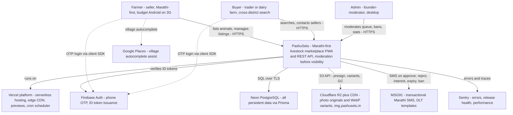
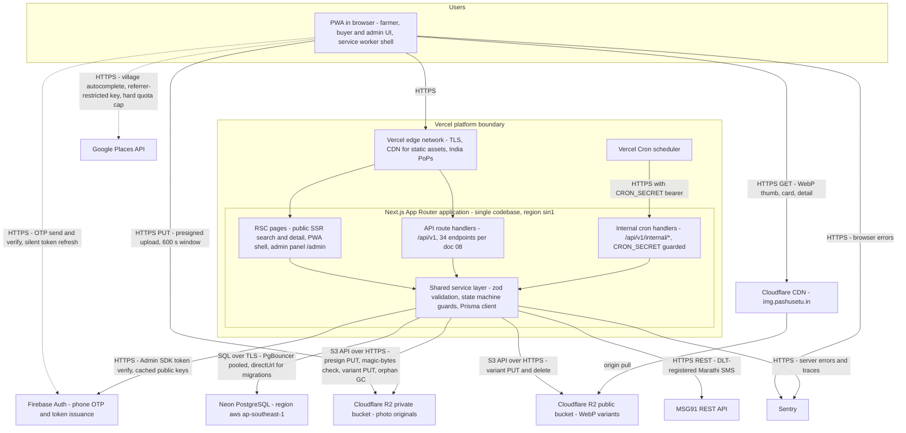
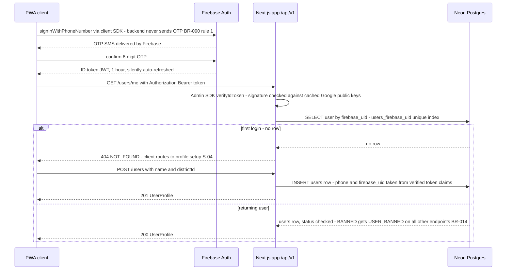
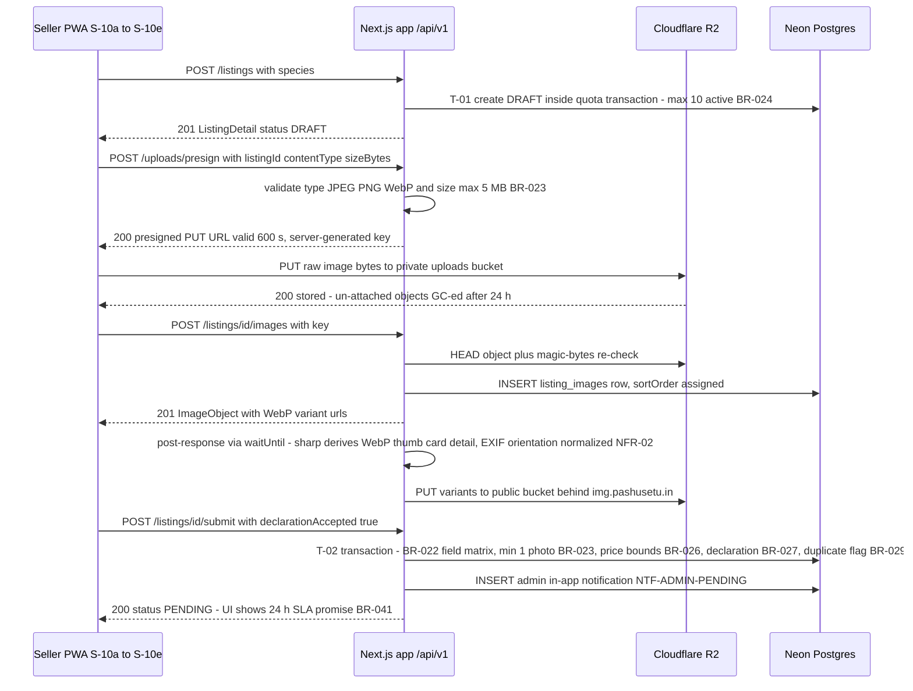
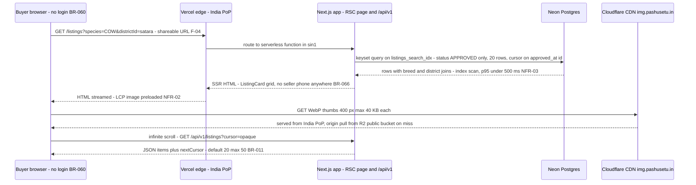
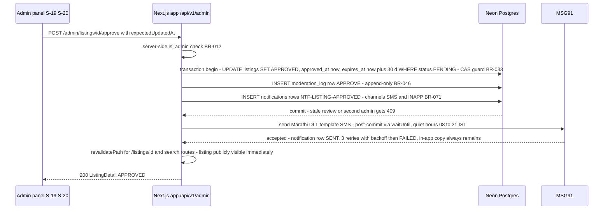
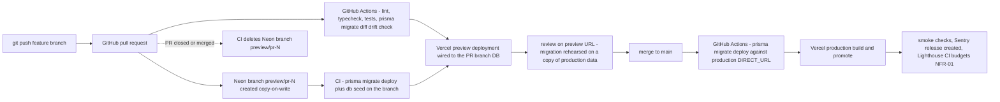

# 11 — System Architecture & ADRs

| Field | Value |
|---|---|
| **Status** | Draft |
| **Version** | 1.0 |
| **Owner** | Founder (Abhishek) |
| **Last updated** | 2026-07-04 |
| **Depends on** | [../00-foundation/README.md](../00-foundation/README.md) · [../01-prd/README.md](../01-prd/README.md) · [../04-business-rules/README.md](../04-business-rules/README.md) · [../07-database/README.md](../07-database/README.md) · [../08-api/README.md](../08-api/README.md) · [../12-security/README.md](../12-security/README.md) |

> This document owns the **system-level architecture**: the C4 context and container views, the request lifecycles across service boundaries, the environment topology, the Architecture Decision Records (ADR-001…ADR-010, one per locked decision D1–D10), the scaling path, the cost model, and the availability/DR posture. It deliberately does **not** define the code folder structure, module layout, job implementations or library choices inside the Next.js app — those are owned by [../09-backend/README.md](../09-backend/README.md). Deployment mechanics, secrets and runbooks are owned by [../13-deployment/README.md](../13-deployment/README.md); threat model and controls by [../12-security/README.md](../12-security/README.md). Where this doc names a business rule it cites the `BR-xxx` id from [../04-business-rules/README.md](../04-business-rules/README.md) and never restates the rule.

---

## 1. Architecture overview

PashuSetu is a **single Next.js App Router codebase** (locked decision D1) deployed on Vercel: React Server Component pages render the public, SEO-indexable Marathi-first PWA (browse, search, listing detail — all public per BR-060) and the internal admin panel at `/admin`; API route handlers under `/api/v1` implement the complete REST contract of [../08-api/README.md](../08-api/README.md); internal cron handlers under `/api/v1/internal/*` (guarded by `CRON_SECRET`, [../12-security/README.md](../12-security/README.md) AS-12) run the scheduled jobs (expiry sweep per BR-072, notification dispatch/retry, R2 orphan GC, 90-day notification purge per BR-071). All persistent data lives in **Neon PostgreSQL** accessed through Prisma over a PgBouncer pooled connection (D2, [../07-database/README.md](../07-database/README.md) §8.3). Identity is **Firebase phone OTP** — the client SDK owns the entire OTP exchange and the backend only verifies Bearer ID tokens with the Firebase Admin SDK (D3, BR-090 #1). Listing photos go **directly from the browser to Cloudflare R2** via presigned PUT URLs; the server derives WebP variants with sharp and serves them through the image CDN host `img.pashusetu.in` (D4, BR-023, NFR-02). Transactional Marathi SMS goes out through **MSG91** (never OTP); village autocomplete uses **Google Places** from the client with a silent free-text fallback; **Sentry** collects errors and release health. There is no separate backend service, no message broker, no cache tier and no in-app chat in MVP (D1, D6) — every one of those has an explicit trigger in §6 before it may be built.

### 1.1 C4 Level 1 — System Context

Buyer→seller contact (call / WhatsApp) happens **off-platform** after the logged phone reveal (BR-062); the platform is a discovery-and-contact facilitator only ([../16-legal/README.md](../16-legal/README.md)).

---

## 2. C4 Level 2 — Containers

### 2.1 Container responsibilities & protocols

| Container | Responsibility | Protocol in / out | Owning doc for internals |
|---|---|---|---|
| PWA in browser | Marathi-first UI, offline shell (NFR-11), Firebase client SDK, presigned uploads | HTTPS | [../10-frontend-design-requirements/README.md](../10-frontend-design-requirements/README.md), [../06-user-flows/README.md](../06-user-flows/README.md) |
| Vercel edge network | TLS termination, static asset CDN, routing to functions | HTTPS | [../13-deployment/README.md](../13-deployment/README.md) |
| RSC pages | SSR of public pages (SEO, NFR-09) and admin panel; reads go through the same service layer as the API — no duplicated query logic | in-process | [../09-backend/README.md](../09-backend/README.md) |
| API route handlers `/api/v1` | The full REST contract, guards, error envelope | HTTPS (JSON) | [../08-api/README.md](../08-api/README.md) |
| Internal cron handlers | Expiry sweep (BR-072, daily 02:30 IST), notification dispatch/retry + quiet-hours flush (BR-071), R2 orphan GC (24 h), notification purge (90 d) | HTTPS + `CRON_SECRET` | [../09-backend/README.md](../09-backend/README.md) |
| Shared service layer | zod validation, BR guards, state-machine CAS transitions (BR-033), Prisma transactions | SQL over TLS | [../09-backend/README.md](../09-backend/README.md) |
| Firebase Auth | OTP delivery + verification (client), ID token verification (server, Admin SDK — signature checked against cached Google public keys, no network hop per request) | HTTPS | [../12-security/README.md](../12-security/README.md) |
| Neon PostgreSQL | All 10 tables; pooled `-pooler` endpoint at runtime, direct endpoint for `prisma migrate` | SQL over TLS | [../07-database/README.md](../07-database/README.md) |
| Cloudflare R2 (private + public) + CDN | Originals ≤ 5 MB (never served); WebP variants thumb/card/detail behind `img.pashusetu.in` (NFR-02); zero egress fees | S3 API / HTTPS | [../09-backend/README.md](../09-backend/README.md) (pipeline), [../13-deployment/README.md](../13-deployment/README.md) (buckets) |
| MSG91 | Transactional Marathi SMS only — **never OTP** (BR-090 #1) | HTTPS REST | [../09-backend/README.md](../09-backend/README.md) (dispatcher) |
| Google Places | Village autocomplete from the client (CSP-allowlisted `maps.googleapis.com` per doc 12); silent free-text fallback on error/timeout (F-02 AC-3) | HTTPS | [../12-security/README.md](../12-security/README.md) (key policy) |
| Sentry | Crash-free sessions (G-05), API 5xx budget (NFR-05), performance | HTTPS | [../13-deployment/README.md](../13-deployment/README.md) (alerting) |

**Caching stance (system-level decision):** public search and detail pages are SSR'd with Next.js data caching; every state change that affects public visibility — approve/reject (T-03/T-04), mark-sold (T-06), renew (T-08), edit-hide (T-09), auto-hide (T-10), archive (T-11/T-12) and the expiry cron (T-07) — calls `revalidatePath` on the affected listing page and the search routes, so moderation decisions are publicly visible within seconds. Reference data (`/meta/*`) is CDN-cached 24 h per API-04/05.

---

## 3. Request lifecycles (sequence diagrams)

Four canonical flows at system granularity. Endpoint-level shapes and error branches are owned by [../08-api/README.md](../08-api/README.md) §3; these diagrams add the cross-service hops (Firebase Admin SDK, sharp, MSG91, cache revalidation).

### 3.1 Phone OTP authentication → token verify → user row create-if-absent

Create-if-absent semantics: a retried `POST /users` returns 409 `USER_ALREADY_EXISTS` and the client recovers with `GET /users/me` (API-01, BR-010) — the pair behaves as an idempotent upsert without needing one.

### 3.2 Listing creation + image upload + submit to moderation

Variant generation runs **in-process after the response** (Vercel `waitUntil`) — no queue in MVP; the attach response may briefly point at placeholder variants (API-16), and the daily cron re-derives any variants a crashed function missed (repair sweep, [../09-backend/README.md](../09-backend/README.md)).

### 3.3 Public search — anonymous buyer on 3G

### 3.4 Moderation approve → transaction → SMS → cache revalidation

`revalidatePath` runs inside the request before the response returns; the MSG91 call runs post-commit via `waitUntil` so SMS provider latency never blocks the admin. Reject (T-04) follows the identical shape with `moderation_log` `REJECT` + `NTF-LISTING-REJECTED` carrying the BR-043 reason.

---

## 4. Environment topology & promotion path

Three environments, all defined here at system level; provisioning steps, env-var values and runbooks live in [../13-deployment/README.md](../13-deployment/README.md). The Neon-branch-per-PR mechanics are specified in [../07-database/README.md](../07-database/README.md) §7.

| | Local | Preview (per PR) | Production |
|---|---|---|---|
| App | `next dev` on `localhost:3000` | Vercel preview deployment (unique URL, never shared publicly — doc 12) | Vercel production, `pashusetu.in` |
| Database | Neon branch `dev/abhishek` (no local Postgres) | Neon branch `preview/pr-{number}`, copy-on-write from `main`, migrated + seeded by CI, deleted on PR close | Neon branch `main` |
| Firebase project | `pashusetu-dev` | `pashusetu-dev` (shared with local) | `pashusetu-prod` |
| R2 buckets | `pashusetu-uploads-dev` / `pashusetu-public-dev` | same dev pair | `pashusetu-uploads` / `pashusetu-public` behind `img.pashusetu.in` |
| MSG91 | Dispatcher in **dry-run** — logs and marks rows `SENT` without calling MSG91 | dry-run | Live sends, DLT templates |
| Google Places | Dev key, quota-capped | dev key | Prod key, referrer-restricted + hard monthly cap |
| Sentry env tag | `development` (sampling off) | `preview` | `production` (release health = G-05) |

Two system-level invariants: **(1)** `prisma migrate deploy` always runs **before** the production promote, and every migration must be backward-compatible with the currently deployed code (expand–contract, doc 07 §7.3–7.4) — this is what makes deploys zero-downtime (NFR-04); **(2)** rollback = redeploy the previous Vercel build (≤ 10 minutes, PRD §10 gate); schema rollback follows the migration's recorded rollback note, with Neon PITR as the disaster fallback only.

---

## 5. ADR log

One ADR per locked decision in [../00-foundation/README.md](../00-foundation/README.md) §3. The **decisions themselves are locked** — these records exist so the reasoning survives, the rejected alternatives stay rejected for stated reasons, and each decision has a concrete, measurable revisit trigger instead of ambient second-guessing. Status of all ten: **Accepted 2026-07-04**.

### ADR-001 — Next.js full-stack, no separate backend service (D1)

- **Context:** Solo developer (D7), 12 MVP features, read-heavy workload (≤ 50 writes/day vs public browse traffic), 2-week sprints. Every service boundary added is a deploy, a contract and a failure mode the one developer must own.
- **Decision:** One Next.js App Router codebase on Vercel: RSC pages for UI + SSR/SEO, route handlers for `/api/v1`, internal cron handlers for jobs. The REST contract (doc 08) is written as if the API were a separate service, so extraction later is a lift, not a rewrite.
- **Alternatives considered:** **Express** API + separate React SPA — two deploys, hand-rolled SSR for SEO (NFR-09), no gain at this scale. **NestJS** — enterprise module ceremony sized for teams, not one person. tRPC-only monolith — couples the contract to the client and blocks the documented REST surface doc 08 promises.
- **Consequences:** *Positive:* one repo, one deploy, one set of env vars; shared types end-to-end; preview deployments exercise UI + API + DB together. *Negative:* serverless constraints (no resident workers — jobs must fit cron + `waitUntil`; function duration limits bound sharp processing); web and API cannot scale independently; framework lock-in to Vercel-flavored Next.js.
- **Revisit trigger:** extract a dedicated API service when **more than 2 backend developers** work the codebase, **or** sustained **p95 > 1 s** on the core endpoints (`GET /listings`, `GET /listings/{id}`, `POST /listings/{id}/interest`) for 2 consecutive weeks despite index/query fixes (NFR-03 breach), **or** a feature requires long-lived connections (e.g. Phase 2 chat).

### ADR-002 — Neon PostgreSQL via Prisma (D2)

- **Context:** The domain is inherently relational (users→listings→breeds/districts, favorites, reports, append-only ledgers), with hard integrity rules (BR-024 quota, BR-045 atomic auto-hide, BR-033 CAS transitions) and reporting needs (`GET /admin/stats`).
- **Decision:** Neon serverless Postgres + Prisma. Production region: **AWS ap-southeast-1 (Singapore)** — Neon does not offer an AWS Mumbai region at decision time; §8.2 records the latency trade-off and the migration path if that changes.
- **Alternatives considered:** **MongoDB** — no cross-document ACID ergonomics for quota/auto-hide/ban transactions, weak relational reporting; wrong shape for this domain. **Supabase** — solid Postgres, but bundles auth/storage/API layers that duplicate Firebase (D3) and R2 (D4), and lacks Neon's copy-on-write branch-per-PR, which is the single biggest safety net for a solo dev (doc 07 §7.2). **PlanetScale/MySQL** — historical FK limitations conflict with the Restrict-by-default integrity stance (doc 07 §2.1). **AWS RDS** — always-on cost + patching/ops burden with no branching.
- **Consequences:** *Positive:* scale-to-zero pricing fits pilot volumes (< 100 MB at M12, doc 07 §8); branch-per-PR rehearses every migration on production-identical data; plain Postgres + FKs means zero proprietary lock-in in the schema itself. *Negative:* PgBouncer transaction mode restricts session features (handled via `directUrl` for migrations); autosuspend cold starts ~500 ms at near-zero traffic; region is Singapore, not India (§8.2).
- **Revisit trigger:** move region when **Neon offers AWS ap-south-1 Mumbai** (checked each quarter; migration = logical replication or dump/restore in a low-traffic window, runbook in doc 13). Upgrade compute/plan when storage > 5 GB, sustained CPU > 60% of provisioned CU, or `GET /listings` p95 > 350 ms server-side at the DB layer.

### ADR-003 — Firebase Authentication, phone OTP only (D3)

- **Context:** Target users have phone numbers, not emails or password habits; Aadhaar collection is explicitly refused (foundation §8). OTP UX is universally understood in rural India.
- **Decision:** Firebase Auth phone provider. The client SDK owns OTP send/verify and throttling; the backend verifies ID tokens with the Admin SDK and maps `firebase_uid` → `users` row. The backend has **no OTP endpoints** (BR-090 #1).
- **Alternatives considered:** **Custom OTP via MSG91** — we would own OTP fraud controls, retry logic, and toll-fraud exposure; explicitly forbidden as an MVP path (PRD A-05). **Supabase Auth** — rejected with ADR-002's bundling argument. **Auth0/Okta** — per-MAU pricing absurd for this audience. **Truecaller SDK** — coverage gaps on low-end devices; noted as a Phase 2 convenience layer only.
- **Consequences:** *Positive:* zero password support burden; verified phone is the trust anchor for the whole contact flow (BR-062); free tier apart from SMS. *Negative:* per-OTP SMS cost scales with signups (§7); reCAPTCHA fallback adds friction on low-end Androids; Google dependency for the login path (§8.4 degradation: browse-only mode); recycled-number risk accepted for MVP (PRD F-01 edge case).
- **Revisit trigger:** monthly auth-SMS spend > **₹25,000** or OTP delivery success < **95%** in pilot districts for 2 consecutive weeks → enable Firebase SMS region policies, then evaluate WhatsApp-OTP as an additional factor. Never migrate to backend-sent OTP without a full doc 12 review.

### ADR-004 — Cloudflare R2 with presigned direct uploads (D4)

- **Context:** An image-heavy marketplace where every listing card fetch is image egress; NFR-02 fixes strict per-variant byte budgets; uploads come from 3G phones and must not proxy through the API (function duration + double transfer).
- **Decision:** R2, two buckets (private originals / public variants), browser PUTs directly via 600 s presigned URLs (API-15), server derives WebP variants with sharp, public variants served via `img.pashusetu.in` behind Cloudflare CDN.
- **Alternatives considered:** **AWS S3** — egress fees dominate cost for an image marketplace; otherwise equivalent API. **Google Cloud Storage** — same egress issue, less S3-tooling compatibility. **Vercel Blob** — priced per GB served, deeper Vercel lock-in. **Cloudinary/ImageKit** — elegant transforms but per-transform pricing at 25 k images and beyond; sharp at build cost ₹0.
- **Consequences:** *Positive:* zero egress cost forever (the entire "images fine at every tier" row in §6); S3-compatible API keeps AWS SDK and future portability; direct upload keeps the API stateless and cheap. *Negative:* no built-in image transforms (we own the sharp pipeline and its failure modes — repair sweep in §3.2); no object versioning/PITR — durability relies on R2's design plus the append-only usage pattern (objects are written once, deleted only by GC); presign flow is more moving parts than a form-post upload.
- **Revisit trigger:** image LCP p95 breaches the NFR-01 budget from Indian networks for 2 consecutive weekly Lighthouse runs → add Cloudflare Images or tune CDN cache; need for per-device responsive variants beyond the fixed three → revisit transform service.

### ADR-005 — Vercel + GitHub + GitHub Actions (D5)

- **Context:** Solo dev needs hosting that gives previews, TLS, CDN, cron and rollback without any ops time; CI must gate merges (lint/typecheck/test/migration drift).
- **Decision:** Vercel for hosting/previews/cron; GitHub for source; GitHub Actions for CI and for `prisma migrate deploy` ordering (§4). Serverless functions pinned to **sin1** (Singapore) co-located with Neon (§8.2).
- **Alternatives considered:** **Railway/Render** — resident containers (nice for workers) but weaker preview story and edge network in India. **AWS Amplify** — heavier config surface, weaker Next.js fidelity. **Self-hosted VPS** — cheapest on paper, most expensive in founder-hours; no previews. **Cloudflare Pages** — attractive pairing with R2, but Next.js App Router support gaps at decision time.
- **Consequences:** *Positive:* preview-per-PR (paired with Neon branches) is the core QA workflow; zero-config TLS/CDN; instant rollback to a previous build. *Negative:* function limits shape the job architecture (cron + `waitUntil`, no daemons); Vercel-specific APIs (`waitUntil`, cron config) are mild lock-in; cost curve steepens with traffic (§7).
- **Revisit trigger:** monthly Vercel bill > **₹40,000**, or a workload genuinely needs a resident worker (queue consumer, websocket server) → move that workload (not the site) to a container host, which is also the ADR-001 extraction moment.

### ADR-006 — Contact = call + WhatsApp + logged interest; in-app chat deferred (D6)

- **Context:** Rural livestock deals close on phone calls; WhatsApp is the de facto messaging layer (PRD A-02). Chat is a large build (threads, delivery states, notifications) plus an ongoing abuse-moderation surface — against principle "Trust Over Speed".
- **Decision:** Three login-gated actions on the detail page; the seller's phone is revealed **only** by `POST /listings/{id}/interest`, and every reveal writes an `interest_events` row first, in the same transaction (BR-062) — making inquiry metric G-04 exact.
- **Alternatives considered:** **In-app chat now** — rejected: months of build + moderation for a channel the audience will bypass with a call anyway. **Masked/virtual numbers** — per-minute telephony cost and a provider integration before product-market fit. **Phone printed on the listing** — kills the G-04 funnel, invites scraping, violates BR-066.
- **Consequences:** *Positive:* ships weeks earlier; conversion metric is trustworthy; sellers protected from bulk scraping (rate limit BR-064 + logging). *Negative:* negotiations happen off-platform — no visibility into deal completion (G-08 relies on seller self-report via mark-sold); revealed numbers can still be saved and shared; no message history to arbitrate disputes.
- **Revisit trigger:** build chat (Phase 2) when **≥ 30% of interest events lack call follow-through** — measured by monthly seller callback surveys during pilot, since calls happen off-platform — **or** user interviews in ≥ 2 districts independently demand negotiation history, **and** G-04 ≥ 25% is sustained (PRD §11 gate).

### ADR-007 — Solo developer + external designer, 2-week sprints (D7)

- **Context:** Team reality: one founder-developer, one contracted designer working from [../10-frontend-design-requirements/README.md](../10-frontend-design-requirements/README.md). Budget favors runway over headcount.
- **Decision:** Scope, sprints ([../15-project-plan/README.md](../15-project-plan/README.md)) and this architecture are all sized for one developer: managed services everywhere, no component that needs pager rotation, self-review checklists where a reviewer is missing (doc 07 §7.3).
- **Alternatives considered:** **Agency build** — burns capital, domain knowledge leaves with the contract. **Hiring a second engineer pre-validation** — spends runway before G-01…G-04 prove demand. **No-code/low-code MVP** — cannot express the state machine, moderation transactions or presigned upload flow cleanly.
- **Consequences:** *Positive:* zero coordination overhead; every doc in this set doubles as the missing reviewer. *Negative:* bus factor = 1 (mitigated: everything reproducible from docs + IaC-lite env definitions in doc 13); founder is also the moderator (BR-041 SLA is founder time); vacation = degraded SLA.
- **Revisit trigger:** moderation load > **50 submissions/day sustained** (PRD A-04) → hire/train a part-time moderator (panel already supports multiple admins); post-seed funding **and** M3 metrics on target → hire developer #2, which also arms the ADR-001 team trigger.

### ADR-008 — Marathi-first UI, English fallback (D8)

- **Context:** The audience reads Marathi; competitors are Hindi-first with Marathi as an afterthought — this is the differentiation axis (PRD §1.5).
- **Decision:** `mr` is the default locale for every visitor regardless of `Accept-Language` (F-12 AC-1); English is the fallback; all strings in catalogs from day 1; DB reference data carries `name_mr`/`name_en`.
- **Alternatives considered:** **Hindi-first** — surrenders the differentiator. **English-first** — excludes the primary persona outright. **Marathi-only** — blocks the admin panel (English-first internal tool, doc 06 §3) and English-preferring urban dairy buyers.
- **Consequences:** *Positive:* trust and usability with the core persona; SEO in Marathi queries (NFR-09). *Negative:* every string authored twice; Devanagari webfont weight budgeted at ≤ 60 KB (NFR-02); native-speaker review is a release-gate dependency (PRD §10).
- **Revisit trigger:** add a Hindi locale (Phase 2) when border-district sessions ≥ **15%** of traffic or trader interviews demand it — the i18n architecture (catalogs + per-row names) makes this additive.

### ADR-009 — PWA, no native app in MVP (D9)

- **Context:** Distribution in rural Maharashtra is WhatsApp link sharing; every install step loses users; solo dev cannot maintain two codebases (D7).
- **Decision:** Installable PWA with offline-tolerant shell (NFR-11); shared listing URLs open instantly in the browser; SMS (not push) is the notification backbone (F-11).
- **Alternatives considered:** **Native Android/Kotlin** — a second codebase plus Play review latency per fix. **Flutter** — single codebase but forfeits SSR/SEO (NFR-09) and instant link-open; web build quality insufficient for 3G budgets. **React Native** — same store friction, and the web remains needed for SEO anyway.
- **Consequences:** *Positive:* one codebase, instant updates (critical with weekly pilot iteration), every listing is a URL that WhatsApp previews (OG image, NFR-09). *Negative:* web push unreliable across Android browsers (accepted — SMS covers the payoff moments); iOS PWA limits (audience is overwhelmingly Android, PRD A-01); no Play Store discoverability or trust badge.
- **Revisit trigger:** PWA install rate < **10% of MAU at M6** *and* user research shows a store-trust barrier → ship a **TWA wrapper** (same codebase) to the Play Store first; a true native app only if TWA measurably fails.

### ADR-010 — Moderation-before-visibility state machine (D10)

- **Context:** Fake and stale listings are the trust failure of every existing channel (PRD §1.5). Trust Over Speed is foundation principle 2.
- **Decision:** Nothing is public until an admin approves it: `DRAFT → PENDING → APPROVED → (SOLD | REJECTED | EXPIRED | ARCHIVED)`, transitions T-01…T-12 exactly per BR-031, enforced as CAS updates (BR-033), 24 h SLA (BR-041), auto-hide at 3 open reports (BR-045).
- **Alternatives considered:** **Publish-first, moderate-later** — what competitors do; the damage window after a fake goes live is precisely the trust gap we exist to close. **Community-only moderation** — needs user volume we won't have at launch. **No moderation** — legally untenable given the slaughter-sale guardrail (foundation §8, BR-012 declaration + BR-042 checklist).
- **Consequences:** *Positive:* the marketplace's core promise; legal defensibility (declaration + append-only `moderation_log`, FR-12); rejection feedback loop improves listing quality (G-12). *Negative:* up-to-24 h seller latency (mitigated by SLA copy and expectation-setting, F-03 AC-5); founder time per listing; single-admin bottleneck at growth.
- **Revisit trigger:** PENDING queue depth > **50 for 3 consecutive days** or SLA misses > **5% in a month** (G-07) → hire moderator (ADR-007) and build the trusted-seller fast lane (Phase 2) — never abandon pre-moderation itself.

---

## 6. Scaling path

Three tiers with what changes — and only when its trigger fires. Baseline capacity ceiling for the MVP build is NFR-12 (10 k users / 5 k listings / 25 k images / 200 concurrent browsers) — i.e. the MVP as designed already covers the Growth tier without redesign.

| Dimension | Pilot — 1 k users / 5 k listings | Growth — 10 k users | Scale — 100 k users | Trigger to move right |
|---|---|---|---|---|
| Compute (Vercel) | Hobby → Pro at public launch; functions pinned sin1; defaults otherwise | Pro; enable fluid/concurrent function execution; per-route max durations tuned | Pro + usage billing; consider extracting `/api/v1` per ADR-001; static/ISR share maximized | Function concurrency saturation or ADR-001 triggers |
| Database (Neon) | Free tier; autoscaling 0.25–1 CU; autosuspend on (cron keeps it warm) | Launch plan; 1–2 CU; PITR ≥ 7 days; autosuspend off | Scale plan; 2–8 CU; **add a read replica** for search reads + `GET /admin/stats`; connection budget re-derived | CPU > 60% sustained, or read latency p95 > 350 ms at DB layer |
| Images (R2 + CDN) | As built — **already fine at every tier** (zero egress, CDN-fronted, fixed variants) | Same; monitor cache-hit ratio ≥ 90% | Same; tiered cache if hit ratio drops | None expected — this row is why D4 was chosen |
| Search | Composite b-tree indexes (doc 07 §4) — structured filters only, no free text in MVP | Add **Postgres FTS** (`tsvector` on description, simple config + trigram for transliteration) when free-text search ships (Phase 2) | External engine (Meilisearch/Typesense) fed by an outbox table — only if FTS p95 > 500 ms on real queries | Free-text feature request first; then FTS latency breach |
| Notifications | Rows written in-transaction; send post-commit via `waitUntil`; cron sweep for retries + quiet-hours flush | Same, plus alerting on dispatch lag > 15 min | Dedicated **queue** (e.g. Upstash QStash or the extracted worker from ADR-005) + WhatsApp Business API to cut SMS cost (§7) | SMS volume > 2,000/day or dispatch lag alerts recurring |
| Moderation | Manual — founder, 2× daily queue checks (PRD §10) | Assisted: BR-029 duplicate flags + BR-065 contact-info flags already built; add Marathi slaughter-intent keyword flagging; part-time moderator | Multi-moderator roles/assignment; ML-assisted photo checks (animal present, quality) | > 50 submissions/day sustained (ADR-007/ADR-010 triggers) |

**What we deliberately do NOT build now:** no microservices, no Kubernetes, no Redis/cache tier, no message broker, no external search engine, no read replicas, no multi-region deployment, no GraphQL gateway, no data warehouse, no in-app chat infrastructure (D6). Every one of these has a named trigger above or in §5; building any of them before its trigger fires is scope theft from a solo developer's MVP (D7). The extension points that make later adoption cheap — REST contract as-if-separate (ADR-001), plain Postgres schema (ADR-002), outbox-able notification rows — are already in place.

---

## 7. Cost model

Monthly estimates in INR at ₹85 = US$1. **All rows: verify current pricing before budgeting** — these are planning figures from provider price lists as of 2026-07, not quotes. One-time costs excluded from monthly totals: domain registration ≈ ₹900/yr (amortized below), MSG91 DLT entity + template registration ≈ ₹6,000 one-time.

| Service | Pilot — 1 k users | Growth — 10 k users | Scale — 100 k users | Assumptions (per row) |
|---|---|---|---|---|
| Vercel | ₹0 | ₹1,700 | ₹8,500 | Pilot on Hobby; move to Pro (~US$20/seat) at public launch for commercial fair-use compliance; Scale adds usage overages (functions + bandwidth). (verify current pricing before budgeting) |
| Neon | ₹0 | ₹1,600 | ₹12,000 | Free tier holds pilot data (< 100 MB, doc 07 §8.2); Launch ~US$19 at beta for compute hours + longer PITR; Scale plan + read replica compute at 100 k. (verify current pricing before budgeting) |
| Cloudflare R2 | ₹0 | ₹50 | ₹300 | Storage US$0.015/GB-mo beyond 10 GB free; ~2 GB / 15 GB / 150 GB of originals+variants; ops within free tiers; **zero egress at every tier** (D4). (verify current pricing before budgeting) |
| Firebase phone-auth SMS (India) | ₹500 | ₹3,500 | ₹25,000 | ≈ ₹1.0 per OTP SMS to Indian numbers; OTPs ≈ new signups + ~20% device re-logins + resends → ~500 / 3,500 / 25,000 OTPs/mo; auth is otherwise free at our MAU. (verify current pricing before budgeting) |
| MSG91 transactional SMS | ₹600 | ₹6,000 | ₹45,000 | ≈ ₹0.25/segment DLT transactional; Marathi Unicode ≈ 3 segments avg (70-char Unicode segments, templates ≤ 5 — F-11) → ≈ ₹0.75/SMS; ~800 / 8,000 / 60,000 SMS/mo across N-01…N-09 triggers. (verify current pricing before budgeting) |
| Google Places | ₹0 | ₹400 | ₹2,000 | Autocomplete sessions only on profile/listing forms; pilot+growth inside the free monthly usage with a hard quota cap (PRD dependency table); scale ≈ 30 k sessions. (verify current pricing before budgeting) |
| Sentry | ₹0 | ₹2,200 | ₹4,500 | Developer (free) tier at pilot; Team ~US$26 at growth for release health volume; higher event quota at scale. (verify current pricing before budgeting) |
| Domain `pashusetu.in` | ₹75 | ₹75 | ₹75 | ≈ ₹900/yr amortized; includes `img.pashusetu.in` subdomain (Cloudflare DNS free). |
| **Total / month** | **≈ ₹1,200** | **≈ ₹15,500** | **≈ ₹97,400** | |

Two readings of this table: **(1)** the pilot runs on ~₹1,200/month — the architecture's managed-free-tier bet (D2/D4/D5) holds; **(2)** at Scale, **SMS is ~72% of total cost** (Firebase OTP + MSG91). The cost levers are already on the roadmap: web push to installed PWAs (Phase 2, F-11 future) and WhatsApp Business API notifications displace MSG91 volume; Firebase SMS region policies and possible WhatsApp-OTP (ADR-003 trigger) cap auth spend. Budget reviews happen monthly against this table in the ops runbook ([../13-deployment/README.md](../13-deployment/README.md)).

---

## 8. Availability & disaster recovery

### 8.1 SLOs

| SLO | Target | Measured by |
|---|---|---|
| Public browse + API availability | **99.5% monthly** (NFR-04) → error budget ≈ 3.6 h/month | Uptime checks on `/` and `GET /api/v1/listings` (doc 13) |
| API 5xx rate | ≤ 0.5% over any 7-day window (NFR-05) | Sentry + Vercel logs |
| Crash-free sessions | ≥ 99% (G-05) | Sentry release health |
| Moderation SLA | 24 h decision for 95% of listings (BR-041, G-07) — an **operational** commitment, not an infra one | `GET /admin/stats` turnaround percentiles |

Serial availability of the managed composition (Vercel ~99.99% × Neon ~99.95% × R2 ~99.9% × Firebase ~99.95%) is ≈ **99.8%** — comfortably above the 99.5% target, leaving the remaining budget for deploy mistakes and application bugs, which at team size 1 are the realistic outage source.

### 8.2 Region decision (single-region stance)

**Decision: Neon production in AWS ap-southeast-1 (Singapore); Vercel serverless functions pinned to sin1 (Singapore), co-located with the database.** Neon does not offer an AWS Mumbai (ap-south-1) region at decision time, and the binding constraint is **function↔database** proximity, not user↔function proximity: a page render or API call issues 1–5 sequential queries, so the DB must be < 5 ms from compute, while the user pays the cross-region hop **once** per request.

Latency accounting for a user in rural Maharashtra: user → Vercel edge PoP in India ≈ 30–50 ms; edge → sin1 function ≈ 55–70 ms over backbone; function ↔ Neon ≈ 1–3 ms per query. The added ~60 ms sits inside budgets calibrated for Fast 3G whose baseline RTT is already 150 ms (NFR-01), and NFR-03's p95 targets measure server processing, which co-location keeps low. Static assets and all images are served from India PoPs (Vercel edge + Cloudflare CDN), so the heavy bytes never cross the region. **Why acceptable:** the alternative — functions in Mumbai (bom1) with the DB in Singapore — would pay ~60 ms × N queries per request and is strictly worse; a self-managed Mumbai Postgres breaks D2. **Revisit:** migrate Neon to Mumbai when offered (ADR-002 trigger); the move is a rehearsed low-traffic-window migration, runbook in [../13-deployment/README.md](../13-deployment/README.md).

There is **no multi-region failover in MVP** — deliberate: 99.5% is achievable single-region on managed SLAs, and active-active adds data-consistency and ops complexity far beyond solo-dev capacity (D7). Total-region-loss recovery is the documented rebuild path below.

### 8.3 Backups & recovery

Detail and drills owned by [../13-deployment/README.md](../13-deployment/README.md); the system-level posture:

| Aspect | Posture |
|---|---|
| Postgres | Neon PITR — ≥ 24 h window at pilot (free tier), ≥ 7 days from beta (Launch tier, doc 07 §8.2). **RPO ≈ minutes** (WAL-based). Restore = create a branch at a timestamp, repoint `DATABASE_URL` → **RTO ≤ 4 h** with the runbook. Restore drill is a release-gate item (PRD §10). |
| R2 images | No versioning; objects are write-once (originals immutable, variants re-derivable from originals by the repair sweep). Deletion only via reviewed GC code paths. Accepted risk: a catastrophic bucket deletion loses images but no market data — listings degrade to placeholder rendering. |
| Config/secrets | All env vars enumerated in doc 13; recovery = re-provision from that inventory. Firebase/MSG91/R2 credentials rotate per doc 12 §rotation table. |
| Total region loss | Rebuild in an alternate Neon+Vercel region from migrations + seed + latest PITR-exported snapshot; **RTO ≤ 1 business day** — accepted for MVP and stated here so it is a known trade, not a surprise. |

### 8.4 Degradation modes (graceful, pre-decided)

| Dependency down | User-visible behavior | Mechanism |
|---|---|---|
| MSG91 (SMS) | Everything works; notifications are **in-app only** until recovery | SMS rows stay `PENDING`/`FAILED`; cron retries ≤ 24 h; in-app row always exists (F-11 AC-3) |
| R2 / image CDN | Browse, search, contact all work; cards and detail pages render **without images** (branded placeholder, explicit dimensions so no CLS); uploads fail with retry UI | `` error fallback; presign/attach return errors, wizard step retries (F-03 edge case) |
| Firebase Auth | **Browse-only mode**: public search/detail (SSR, no auth) fully work; login, contact, favorites, listing management unavailable with a Marathi notice | Public pages never touch Firebase; auth guard failures render the login-unavailable sheet |
| Google Places | Nothing visible — village fields silently behave as plain text | 2 s timeout fallback (F-02 AC-3) |
| Neon | Full maintenance page (all dynamic surfaces are DB-backed) | Health check flips to static maintenance response; Sentry + uptime alert (doc 13) |
| Sentry / Vercel Analytics | No user impact; observability blind spot only | Postgres-based §2 PRD metrics unaffected (NFR-10) |
| Vercel | Total outage — accepted single-platform risk within the 99.5% budget | Status-page comms per incident runbook (doc 13) |

---

## 9. Cross-cutting concerns map

Where each concern is normatively specified — this doc only places them in the architecture; it never restates their rules.

| Concern | Where it executes (system view) | Owning doc |
|---|---|---|
| Authentication & authorization | Guard chain in every route handler: Bearer verify → user resolve → status/role/ownership checks | [../12-security/README.md](../12-security/README.md) (controls) · [../08-api/README.md](../08-api/README.md) §1.2 (guard levels) |
| Input validation | zod schemas in the service layer; DB `CHECK` constraints as backstops | [../04-business-rules/README.md](../04-business-rules/README.md) (rules) · [../08-api/README.md](../08-api/README.md) (shapes) · [../07-database/README.md](../07-database/README.md) §9 (backstops) |
| Rate limiting | Per-user counters inside write transactions; platform-level abuse at the edge | [../04-business-rules/README.md](../04-business-rules/README.md) BR-090 (values) · [../09-backend/README.md](../09-backend/README.md) (implementation) · [../12-security/README.md](../12-security/README.md) (abuse) |
| Listing state machine | CAS `UPDATE … WHERE status = <from>` in the service layer | [../04-business-rules/README.md](../04-business-rules/README.md) BR-030…BR-034 |
| i18n (Marathi-first) | Locale catalogs in the client; `name_mr`/`name_en` in reference data; `Accept-Language` for error messages only | [../01-prd/README.md](../01-prd/README.md) F-12 (behavior) · [../10-frontend-design-requirements/README.md](../10-frontend-design-requirements/README.md) (register/content) |
| Observability | Sentry (errors, release health, traces) + Vercel logs/analytics + `GET /admin/stats` as product truth | [../13-deployment/README.md](../13-deployment/README.md) (alerting) · [../01-prd/README.md](../01-prd/README.md) NFR-05/NFR-10 (budgets, events) |
| Image pipeline | Presign → direct PUT → attach → sharp WebP variants → CDN; orphan GC | [../09-backend/README.md](../09-backend/README.md) (pipeline & jobs) · BR-023 (rules) · [../01-prd/README.md](../01-prd/README.md) NFR-02 (budgets) |
| Scheduled jobs | Vercel Cron → `/api/v1/internal/*` with `CRON_SECRET` | [../09-backend/README.md](../09-backend/README.md) (job specs) · [../13-deployment/README.md](../13-deployment/README.md) (schedules, monitoring) |
| Pagination | Opaque keyset cursors, default 20 / max 50 | [../08-api/README.md](../08-api/README.md) §1.4 · [../07-database/README.md](../07-database/README.md) §4.1 |
| SEO | SSR public pages, sitemap, JSON-LD, 404 for non-APPROVED | [../01-prd/README.md](../01-prd/README.md) NFR-09 · [../09-backend/README.md](../09-backend/README.md) |
| Secrets & key rotation | Vercel env vars per environment; rotation table | [../12-security/README.md](../12-security/README.md) · [../13-deployment/README.md](../13-deployment/README.md) |
| Backups / DR | §8.3 posture; drills and runbooks | [../13-deployment/README.md](../13-deployment/README.md) |
| Code structure & module layout | — (not this doc) | [../09-backend/README.md](../09-backend/README.md) |

---

## Acceptance checklist

- [x] Header table present (Status Draft / Version 1.0 / Owner Founder (Abhishek) / Last updated 2026-07-04 / Depends on with relative links); doc format per foundation §7; code folder structure explicitly deferred to doc 09
- [x] §1 gives a one-paragraph architecture overview plus a C4 Level 1 mermaid context diagram containing all three actors (Farmer, Buyer, Admin) and all seven required external systems (Firebase Auth, Neon Postgres, Cloudflare R2 + CDN, MSG91, Google Places, Sentry, Vercel platform)
- [x] §2 C4 Level 2 mermaid shows the Vercel boundary containing the Next.js app split into RSC pages, `/api/v1` route handlers and cron endpoints (`/api/v1/internal/*` per doc 12 AS-12), with protocol annotations on every external edge (HTTPS, SQL over TLS via PgBouncer, S3 API, presigned PUT)
- [x] §3 contains exactly four `sequenceDiagram` blocks — OTP auth with Admin-SDK verify and create-if-absent user row; listing creation with presign → browser PUT → attach → sharp variants → submit → PENDING + `NTF-ADMIN-PENDING`; public search via indexed keyset query with CDN image URLs; moderation approve with CAS transaction → `moderation_log` → MSG91 SMS → `revalidatePath` — all consistent with doc 08 §3 and doc 04 T-ids
- [x] §4 defines local / preview / production topology (Neon branch-per-PR consistent with doc 07 §7) and the promotion path with `prisma migrate deploy` ordered before the production promote; operational detail linked to doc 13
- [x] §5 contains ADR-001…ADR-010 mapping 1:1 to locked decisions D1–D10, each with Context, Decision, named real alternatives (Express, NestJS, MongoDB, Supabase, PlanetScale, RDS, AWS S3, GCS, Cloudinary, Auth0, native/Flutter/React Native, in-app-chat-now, publish-first moderation), positive AND negative consequences, and a concrete measurable revisit trigger — including the mandated ADR-001 (>2 backend devs OR sustained p95 > 1 s) and ADR-006 (≥30% of interest events lack call follow-through OR interviews demand it) triggers
- [x] §6 scaling table covers all three tiers (pilot 1 k / growth 10 k / scale 100 k) across compute, DB (Neon compute + read replica), images (explicitly fine at every tier), search (indexes → Postgres FTS → external engine), notifications (inline → queue) and moderation (manual → assisted), each with a trigger; the deliberate do-NOT-build-now list is explicit
- [x] §7 cost table covers Vercel, Neon, R2, Firebase phone-auth SMS for India, MSG91, Google Places, Sentry and domain at the same three tiers, in monthly INR (₹85/US$ stated), with per-row assumptions, every row marked "(verify current pricing before budgeting)", totals computed, and the SMS-dominance insight with cost levers named
- [x] §8 states the 99.5% SLO with composition math and error budget; picks ONE region (Neon Singapore ap-southeast-1 + Vercel sin1 co-location) with quantified India latency trade-off, justification and a Mumbai revisit trigger; summarizes PITR/RPO/RTO with detail deferred to doc 13; and pre-decides degradation modes including the three mandated ones (SMS → in-app only; R2 → cards without images; Firebase → browse-only)
- [x] §9 cross-cutting concerns table maps authz, validation, rate limiting, i18n, observability and image pipeline (plus six more) to their owning docs by relative link
- [x] All business constants cited match canonical values via BR ids (BR-011 pagination, BR-023 photos, BR-024 quota, BR-041 SLA, BR-045 auto-hide, BR-062 phone reveal, BR-064/051/090 rate limits, BR-071 notifications, BR-072 daily expiry cron at 02:30 IST, BR-073 30-day expiry); screens cited by S-xx ids from doc 06; transitions by T-xx ids from doc 04
- [x] Zero contradictions with locked decisions D1–D10 — no Express/NestJS/MongoDB/Supabase adoption, no separate backend service, no in-app chat in MVP, PWA not native, moderation-before-visibility upheld; alternatives appear only as rejected options inside ADRs
- [x] All seven mermaid blocks (2 C4 flowcharts, 4 sequence diagrams, 1 environment flowchart) use quoted labels, contain no parentheses inside square-bracket node labels, and parse as `flowchart`/`sequenceDiagram`
- [x] No "TBD"/"TODO"/open questions; every non-canonical value is decided and stated inline (sin1 + ap-southeast-1 region pair, two Firebase projects, dev/prod R2 bucket pairs, MSG91 dry-run outside production, `waitUntil` + cron-sweep dispatch model, ₹85/US$ rate, RTO/RPO figures, all ADR revisit thresholds)
