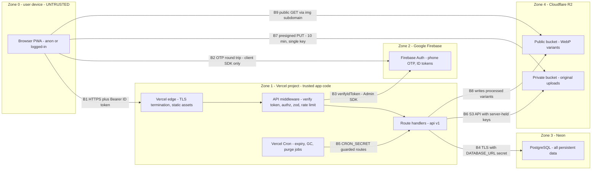
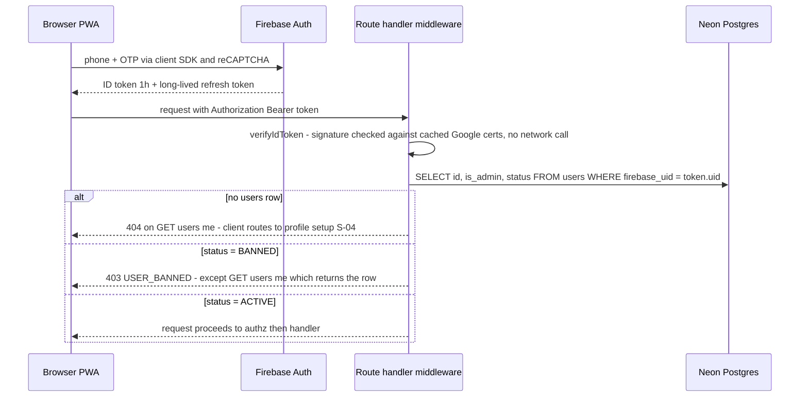

# 12 — Security & Privacy

| Field | Value |
|---|---|
| **Status** | Draft |
| **Version** | 1.0 |
| **Owner** | Founder (Abhishek) |
| **Last updated** | 2026-07-04 |
| **Depends on** | [../00-foundation/README.md](../00-foundation/README.md) · [../01-prd/README.md](../01-prd/README.md) · [../04-business-rules/README.md](../04-business-rules/README.md) · [../06-user-flows/README.md](../06-user-flows/README.md) · [../07-database/README.md](../07-database/README.md) · [../08-api/README.md](../08-api/README.md) · [../09-backend/README.md](../09-backend/README.md) · [../13-deployment/README.md](../13-deployment/README.md) · [../14-testing-qa/README.md](../14-testing-qa/README.md) · [../16-legal/README.md](../16-legal/README.md) |

> This document owns the security and privacy posture of PashuSetu. The single most sensitive asset on the platform is the **verified phone number of a rural farmer** — the entire contact model (locked decision D6) exists to protect it while still letting deals happen. Every control below is sized for the locked stack (D1–D5: Next.js full-stack on Vercel, Prisma + Neon, Firebase phone OTP, Cloudflare R2) and for a **solo developer** who must be able to operate all of it alone. Business rules are cited by their `BR-xxx` ids from [../04-business-rules/README.md](../04-business-rules/README.md); rate-limit numbers are never restated as new values — BR-090 is the single source of truth.

---

## 1. Assets & trust boundaries

### 1.1 Asset inventory

| # | Asset | Where it lives | Sensitivity | Primary threats | Guarding controls |
|---|---|---|---|---|---|
| AS-01 | User phone numbers (E.164) | Neon `users.phone`; Firebase Auth user records; interest responses in transit | **Critical** — harvesting destroys farmer trust and enables spam/fraud calls | Harvesting, scraping, leakage in payloads/HTML | BR-062/BR-064/BR-065/BR-066 reveal policy (§5.2), authz matrix (§4), phone-concealment test (§10) |
| AS-02 | User profile PII (name, district, taluka, village, language) | Neon `users` | Medium — coarse location + name are shown publicly by design (BR-060) | Bulk scraping, correlation | Data minimization (§5.1), first-name-only public payloads |
| AS-03 | Listing data + photos | Neon `listings`, `listing_images`; R2 buckets | Medium — public when APPROVED, but pre-approval content and originals are private | IDOR, key guessing, EXIF GPS leakage | §4, §6 |
| AS-04 | Admin functions (approve/reject/ban) | `/api/v1/admin/*` route handlers | **Critical** — compromise = full market manipulation + PII access | Privilege escalation, exposed endpoints, admin account takeover | Server-side `is_admin` check per request (BR-012), no admin signup (§3.5), audit log (BR-046) |
| AS-05 | Firebase ID tokens (sessions) | Browser memory / Firebase SDK persistence | High — bearer credential for a user | Theft via XSS, device theft, replay | 1-hour expiry (§3.2), XSS controls (§8.3), per-request ban check (§3.3) |
| AS-06 | Firebase service-account key (Admin SDK) | Vercel env var `FIREBASE_SERVICE_ACCOUNT` (server-only) | **Critical** — can mint/verify identities | Secrets leakage, repo commit | Env-var discipline + CI secret scan (§8.5, SEC-T15), rotation runbook (doc 13) |
| AS-07 | Neon `DATABASE_URL` + data at rest | Vercel env var; Neon | **Critical** — all persistent data | Credential leakage, injection | §8.2, Prisma parameterized queries, Neon TLS + encryption at rest (§5.6) |
| AS-08 | R2 access keys + bucket contents | Vercel env vars `R2_ACCESS_KEY_ID`/`R2_SECRET_ACCESS_KEY`; two R2 buckets (§6.4) | High | Presign abuse, key leakage, public exposure of originals | §6, rotation runbook (doc 13) |
| AS-09 | MSG91 auth key (notification SMS) | Vercel env var `MSG91_AUTH_KEY` | Medium — abuse = SMS cost + spam from our sender ID | Leakage, SMS bombing | SEC-T18, BR-071 SMS caps |
| AS-10 | `moderation_log` + `interest_events` integrity | Neon (append-only by application design) | High — legal/audit trail (IT Rules 2021, doc 16) | Tampering, repudiation | No update/delete code paths (FR-12), transactional writes (BR-046, BR-062) |
| AS-11 | Seller declaration records (`declaration_accepted`, `declaration_at`) | Neon `listings` | High — legal defense under Maharashtra Animal Preservation Act (foundation §8) | Tampering, loss | Written only by the submit transaction (BR-027); Neon PITR backups |
| AS-12 | Cron trigger routes (expiry job, GC, purge) | `/api/v1/internal/*` handlers invoked by Vercel Cron | Medium — unauthorized invocation could mass-expire listings | Spoofed invocation | `CRON_SECRET` bearer check on every internal route (doc 13) |

### 1.2 Trust boundaries

Five zones. Everything on the user device is **untrusted input** — every client-side validation is convenience only and is always re-enforced server-side.



| Crossing | What crosses | Control at the boundary |
|---|---|---|
| B1 | All API traffic + SSR pages | TLS (Vercel-managed), `Authorization: Bearer <Firebase ID token>` for authed routes, security headers (§8.1) |
| B2 | Phone number + OTP | Entirely Firebase client SDK + reCAPTCHA; **the backend has no OTP endpoint** (BR-010, BR-090 #1) |
| B3 | ID token verification | Firebase Admin SDK verifies JWT signature against cached Google certs — no per-request network call (§3.1) |
| B4 | SQL via Prisma | TLS-required connection string; Prisma parameterized queries only (SEC-T14) |
| B5 | Cron invocations | `Authorization: Bearer ${CRON_SECRET}` checked before any job logic; 401 otherwise |
| B6 | Presign generation, HEAD/GET validation, variant writes, GC deletes | R2 keys exist only in server env vars, never in the client bundle |
| B7 | Original image bytes | Presigned PUT with content-type + `content-length-range` conditions, 10-minute expiry, server-generated key (§6.1) |
| B8 | Processed WebP variants | Written only by the server-side image pipeline after validation (§6.2) |
| B9 | Public image GETs | Custom domain `img.pashusetu.in` bound to the **public bucket only**; private bucket has no public route (§6.4) |

External soft dependencies (MSG91 for notification SMS, Sentry for errors, Google Places for village assist, Vercel Web Analytics) sit outside these zones and receive **minimum-necessary data** (§5.5); none of them ever receives a seller phone number except MSG91, which needs the recipient number to deliver the recipient's own SMS.

---

## 2. Threat model — STRIDE-lite

STRIDE classes: **S**poofing · **T**ampering · **R**epudiation · **I**nformation disclosure · **D**enial of service · **E**levation of privilege. Likelihood/impact are rated Low/Medium/High (Critical reserved for platform-ending impact). Owner doc = where the mitigation is normatively specified.

| Id | Threat | STRIDE | Attack scenario | Likelihood | Impact | Mitigation | Owner doc |
|---|---|---|---|---|---|---|---|
| SEC-T01 | Phone-number harvesting via interest endpoint | I | Script registers one account, iterates `GET /listings`, calls `POST /listings/{id}/interest` on each to bulk-collect farmer numbers for spam/fraud calls | High | High | Login + complete profile required (BR-061, BR-013); hard cap **20 interest events/day/buyer** (BR-064); every reveal logged as an `interest_events` row *before* the number is returned (BR-062) so harvesting leaves a queryable trail; 60/min write ceiling (BR-090 #2); admin stats surface top interest-callers for anomaly review | doc 04 §6, this doc §5.2 |
| SEC-T02 | Fake/fraudulent listings (stolen photos, invented milk yields, nonexistent animals) | S | Fraudster posts an attractive Murrah at a low price to collect advance payments by phone | High | High | Moderation-before-visibility (D10, BR-042); photo-content rules incl. no stock photos (BR-082); mandatory seller declaration (BR-027); community reports + auto-hide at 3 OPEN reports (BR-045); 3-strike fraud ban (BR-054); platform-as-facilitator disclaimers (doc 16) | doc 04 §4–5 |
| SEC-T03 | OTP abuse / SIM-farmed account rings | S | Attacker uses cheap prepaid SIMs to mass-create accounts for spam listings, report-bombing, or harvesting quota | Medium | Medium | Firebase's own OTP throttling + reCAPTCHA (BR-090 #1); one phone = one account (unique `users.phone`); every abuse surface is per-account capped (10 listings, 20 interests/day, 5 reports/day); accounts cost a real SIM each — manual ban makes each SIM a consumable cost (BR-014) | doc 04 §1, §9 |
| SEC-T04 | Admin endpoint exposure | E | Attacker calls `POST /api/v1/admin/users/{id}/ban` directly with a normal user's token, or discovers `/admin` UI | Medium | Critical | `is_admin` read from the caller's `users` row and checked **server-side on every `/admin/*` request** — never client-side gating (BR-012, F-10 AC-1); no admin signup or role-grant endpoint exists (§3.5); admin UI leaks nothing pre-auth (S-18); authz test suite covers every admin route as anon + normal user (§10 ST-01) | this doc §3.5/§4 |
| SEC-T05 | Presigned URL abuse — oversize files, wrong content type, non-image bytes, URL re-use | T | Attacker requests a presign then PUTs a 50 MB file, an HTML file (stored-XSS-via-image attempt), or replays the URL | Medium | Medium | Presign conditions: content-type whitelist + `content-length-range` 1 B–5 MB + 10-minute expiry + server-generated key (§6.1); attach step re-validates by HEAD + magic-bytes sniff before any use (§6.2, BR-023); browsers never receive originals — only server-transcoded WebP variants (§6.4) | this doc §6 |
| SEC-T06 | R2 key guessing / enumeration of unapproved listings' images | I | Attacker brute-forces `img.pashusetu.in/listings/...` URLs to view photos of PENDING/REJECTED listings | Low | Low | Keys embed a server-generated cuid (~2¹²⁶ space) — unguessable (§6.1); public bucket holds only processed variants; bucket listing disabled; image URLs are only present in payloads the caller is authorized to see (§4). Residual: a leaked variant URL stays fetchable until deleted — accepted for MVP (images carry no PII after EXIF strip) | this doc §6 |
| SEC-T07 | IDOR on listings, images, favorites, notifications | E | User B PATCHes user A's listing id, deletes A's image, or marks A's notification read by guessing ids | Medium | High | Every owner-scoped route loads the resource **and compares `seller_id`/`user_id` to the verified caller id** before acting (else 403 `FORBIDDEN`); nested resources double-keyed (`imageId` must belong to `{id}`); favorites/notifications routes are self-scoped under `/users/me/...`; cuid ids are unguessable but are **never** relied on as the access control (§4); IDOR probe suite (§10 ST-04) | this doc §4 |
| SEC-T08 | Bulk scraping of public listings | I | Competitor crawls `GET /listings` nightly and republishes the catalog | High | Low | Public browse is a deliberate product decision (BR-060) — animal data is public; the valuable asset (phone) is behind SEC-T01's controls; page size clamped at 50 (BR-090 #12); opaque keyset cursors prevent offset skipping; Vercel edge absorbs read load. Residual: public data can be copied — accepted | doc 04 §6 |
| SEC-T09 | Stored XSS via description / name / village text | T | Seller submits description ``; buyer's browser executes it on S-07 | Medium | High | React JSX auto-escaping everywhere; `dangerouslySetInnerHTML` **banned for user content** (ESLint rule, §8.3); zod validation with length caps at every boundary (§8.2); CSP as depth (§8.1); human moderation reads every description before it is public (BR-042); XSS corpus test (§10 ST-05) | this doc §8 |
| SEC-T10 | CSRF on state-changing routes | S | Malicious page auto-submits a form to `POST /api/v1/listings/{id}/archive` in a logged-in victim's browser | Low | Low | **Stance: inherently low risk** — auth is the `Authorization: Bearer` header (FR-01), never cookies; browsers do not attach that header cross-site, so a forged request arrives with no credential → 401. No CSRF tokens needed in MVP. Guard preserved by rule: no auth cookies may ever be introduced without adding CSRF protection (recorded as a standing constraint for Phase 2 chat) | this doc §3 |
| SEC-T11 | Rate-limit bypass | D | Attacker parallelizes requests to race the window, rotates accounts, or hits from many IPs | Medium | Medium | Limits keyed on **user id, not IP** (rural CGNAT makes IP keys wrong *and* weak, FR-05); counters are atomic in Postgres — a single-statement array-append upsert (row lock serializes racers) for the rolling 60/min window and count-inside-transaction for daily domain limits (§8.4), so races cannot exceed the cap; account rotation is bounded by SIM cost (SEC-T03) | this doc §8.4 |
| SEC-T12 | Banned-user re-registration | S | Banned fraudster returns with a new SIM and a fresh account | Medium | Medium | Same number re-registration is impossible while banned (`users.phone` unique + `status=BANNED` row persists; `POST /users` hits `USER_ALREADY_EXISTS` and every call then 403s `USER_BANNED`); new-SIM return is detectable via moderation signals — same photos, district, species, price patterns; duplicate heuristic (BR-029) and seller-history panel (S-20) help the admin re-ban. Residual: determined actors can return; accepted with manual vigilance in MVP | doc 04 §1 |
| SEC-T13 | Report-bombing a competitor's listing | D | Rival farmer uses 3 accounts to file 3 reports and auto-hide a legitimate listing (BR-045) | Medium | Medium | 5 reports/day/user (BR-051); one OPEN report per (listing, reporter) (BR-050); auto-hide needs **3 distinct reporters**; hide is reversible only by human re-approval with original context (BR-052); dismissed-report tracking flags abusers at 5 dismissals/30 days (BR-053); organized false-flagging is a ban-eligible severe violation (BR-054) | doc 04 §5 |
| SEC-T14 | SQL injection via ORM escape hatches | T | Malicious `sort`/`cursor`/filter param reaches a raw SQL string | Low | High | **Stance:** Prisma query builder only; `$queryRawUnsafe`/`$executeRawUnsafe` are banned (ESLint `no-restricted-syntax` rule); the rare raw query (e.g. stats aggregates) must use tagged-template `$queryRaw` which parameterizes; all query params zod-parsed to typed enums/ints **before** any Prisma call (§8.2) | this doc §8.2 |
| SEC-T15 | Secrets leakage via client bundle or repo | I | Server secret exported as `NEXT_PUBLIC_*`, or service-account JSON committed to git | Low | Critical | Naming discipline: only the Firebase **client** config (public by design) and truly public values may be `NEXT_PUBLIC_*`; CI gate greps the built client bundle for secret patterns and runs gitleaks on every push (§8.5, §10 ST-08); `.env*` gitignored; all secrets live in Vercel env vars; rotation runbook in doc 13 for the day this fails | this doc §8.5, doc 13 |
| SEC-T16 | Dependency supply-chain compromise | T | Malicious version of an npm package exfiltrates env vars at build or runtime | Medium | High | Committed lockfile + `npm ci` only; Dependabot weekly + `npm audit --audit-level=high` as a CI gate; GitHub Actions pinned to commit SHAs; deliberately small dependency surface (D1 single codebase helps); Sentry alert on novel outbound behavior is not available serverless — compensated by fast patch policy (§9.1 SEV-3) | doc 13/14 |
| SEC-T17 | Stolen device / ID-token replay | S | Buyer's phone is stolen while logged in; token replayed from elsewhere | Medium | Medium | ID tokens expire in 1 hour (§3.2); HTTPS-only transport; tokens held by the Firebase SDK, never in cookies; user can be banned/deleted via helpline which cuts API access within one request (§3.3); no payment instruments exist to steal (out of scope, foundation §4) | this doc §3 |
| SEC-T18 | SMS abuse & cost bombing | D | Attacker triggers floods of interest SMS to a victim seller, or drains the SMS budget | Low | Low | Backend never sends OTP SMS (BR-090 #1) — the expensive abuse surface doesn't exist; interest SMS capped at 3/day/seller with silent INAPP downgrade (BR-090 #13); all SMS templates are DLT-registered fixed-content (no attacker-controlled free text except the admin-written rejection reason); MSG91 spend alert configured (doc 13) | doc 04 §7 |

---

## 3. Authentication

### 3.1 Firebase ID-token verification flow

Phone OTP is handled **entirely by the Firebase client SDK** (BR-010) — the backend has zero OTP code. The only server-side auth artifact is the Firebase **ID token** (a Google-signed JWT, 1-hour lifetime) presented as `Authorization: Bearer <token>` (FR-01).



Implementation rules (enforced by a single shared `requireAuth()` helper — no route may hand-roll verification):

1. `verifyIdToken(token)` via the Firebase **Admin SDK**, initialized once per runtime from the `FIREBASE_SERVICE_ACCOUNT` env var. Signature verification is local against Google's public certs (SDK-cached, ~1 h TTL) — no added latency per request.
2. The decoded token's `uid` is the **only** identity input. The users row is resolved by `firebase_uid`; the request body/query can never influence identity. On `POST /users` (first login), `phone` is taken from the token's `phone_number` claim — **never from the request body** (spoofing guard).
3. Missing/malformed/expired token, or `aud`/`iss` mismatch with our Firebase project → 401 `UNAUTHENTICATED` in the standard error envelope.
4. `checkRevoked` is **false** (no extra Firebase round-trip per request) — see §3.3 for why this is safe here.

### 3.2 Session lifetime, refresh, clock skew

| Property | Value |
|---|---|
| ID token lifetime | 60 minutes (Firebase-fixed) |
| Refresh | Silent, by the Firebase client SDK using its long-lived refresh token; users are never re-prompted mid-session (F-01 AC-7) |
| Server session store | **None.** No cookies, no session table (FR-01). SSR renders public data only; authed data hydrates client-side |
| Refresh-token lifetime | Indefinite until sign-out, Firebase account disable/delete, or password-equivalent event; acceptable because the DB `status` check (§3.3) is the real kill switch |
| Clock skew | Firebase Admin SDK's built-in tolerance is relied upon (Google-managed servers on both ends; the risky clock is the *client's*, which only affects when the SDK refreshes). Client contract: on any 401, force-refresh once via `getIdToken(true)` and retry exactly once; a second 401 opens the login sheet with `returnTo` preserved (Flow D, doc 06) |
| Concurrent devices | Allowed; both hold valid tokens; no device management in MVP (F-01 edge case) |

### 3.3 Ban enforcement & token-revocation stance

- **Primary control:** every authenticated request re-reads `users.status` from Neon (§3.1 step — one indexed lookup, already needed for authz). A ban therefore takes effect on the **very next request**, at most ~1 request behind real time, regardless of token validity.
- **Deliberate MVP stance:** we do **not** call `admin.auth().revokeRefreshTokens(uid)` on ban, and `verifyIdToken` runs with `checkRevoked=false`. Rationale: the DB status check is strictly faster-acting than revocation (revocation only bites at the next token refresh, up to 59 minutes away) and costs no extra Firebase round-trip. Firebase-level revocation + `checkRevoked` is a Phase 2 hardening item (already noted in PRD F-01 future improvements) that adds defense in depth if the DB check ever regresses.
- A `BANNED` user can still complete Firebase OTP (Google side), but every API call returns 403 `USER_BANNED` except `GET /users/me`, which returns the row so the client can render the banned screen with the grievance contact **support@pashusetu.in** (BR-014, doc 06 §7).
- Account deletion (BR-015) *does* delete the Firebase Auth user — that kills refresh outright.

### 3.4 Logout semantics

On logout (S-15): client calls Firebase `signOut()` (invalidates the refresh token client-side), clears all cached authed data — profile, favorites, notifications, drafts held in memory — and clears service-worker runtime caches of authed API responses. Language preference persists locally (F-12 AC-2). Navigation to any protected screen after logout re-opens the login wall (F-01 AC-6). Because the server holds no session, there is nothing server-side to destroy; a token copied *before* logout remains technically valid for ≤ 60 minutes — accepted residual, consistent with SEC-T17's rating.

### 3.5 Admin bootstrapping — no admin signup, ever

- There is **no endpoint, form, or UI** that grants or revokes `is_admin` (BR-012). The field is rejected by the zod schemas of `POST /users` and `PATCH /users/me` (mass-assignment guard, §8.2).
- Admins are provisioned by the Founder running a local script against production:

  ```bash
  # one-time, from the Founder's machine; DATABASE_URL pulled via `vercel env pull` and never committed
  npx tsx scripts/grant-admin.ts --phone +919XXXXXXXXXX          # grant
  npx tsx scripts/grant-admin.ts --phone +919XXXXXXXXXX --revoke # revoke
  ```

  The script: verifies the target users row exists and is `ACTIVE`, flips `is_admin`, prints an audit line (timestamp, target id, operator hostname), and the Founder records the grant in the ops journal (runbook in [../13-deployment/README.md](../13-deployment/README.md)). Expected admin count in MVP: 1–2 humans plus the seeded **System** user (BR-046), whose `firebase_uid` is the sentinel value `system` — no Firebase account can ever match it, so it can never authenticate.
- Admin sessions are ordinary Firebase phone-OTP sessions (S-18); admin power derives solely from the server-side row check. Admins cannot ban themselves or other admins (F-10 edge case, 400 `VALIDATION_ERROR`).

---

## 4. Authorization matrix

**Universal preconditions**, applied in order by shared middleware before any row below is evaluated:

1. Routes marked ✅ under *Anon* skip token checks entirely (public, BR-060). All others: valid Bearer token else **401 `UNAUTHENTICATED`**.
2. Authenticated caller must be `ACTIVE` else **403 `USER_BANNED`** — sole exception `GET /users/me` (§3.3).
3. Every authenticated **write** additionally requires a complete profile else **403 `PROFILE_INCOMPLETE`** (BR-013), and passes the 60/min write limit else **429 `RATE_LIMITED`** (BR-090 #2).
4. State-machine guards return **409 `INVALID_STATE_TRANSITION`** (BR-032/BR-033); ownership failures return **403 `FORBIDDEN`**; invisible resources return **404** (existence is not confirmed to unauthorized callers — BR-034).

Column semantics: **User** = authenticated non-owner acting on someone else's resource (or on no resource); **Owner** = the resource's seller/subject (self); **Admin** = `is_admin=true` acting on *others'* resources (an admin acting on their own resource follows the Owner column — BR-012: "an admin is a normal user in every other respect"). `n/a` = the route is inherently self-scoped, so a distinct owner column does not apply.

| # | Endpoint | Anon | User | Owner (self) | Admin | Ownership / state guards |
|---|---|---|---|---|---|---|
| 1 | `POST /users` | ❌ 401 | ✅ first login only | n/a | ✅ (self) | Requires valid Firebase token **without** an existing row; `phone` from token claim, not body; retry → 409 `USER_ALREADY_EXISTS`; `is_admin`/`status` not accepted in body |
| 2 | `GET /users/me` | ❌ 401 | ✅ | n/a | ✅ (self) | Only route that works while `BANNED`; 404 when profile row missing (routes to S-04) |
| 3 | `PATCH /users/me` | ❌ 401 | ✅ | n/a | ✅ (self) | zod whitelist: name, district, taluka, village, role flags, `language_pref` only; never `phone`, `is_admin`, `status` |
| 4 | `GET /meta/breeds?species=` | ✅ | ✅ | n/a | ✅ | Public reference data |
| 5 | `GET /meta/districts` | ✅ | ✅ | n/a | ✅ | Public reference data |
| 6 | `GET /listings` | ✅ | ✅ | ✅ | ✅ | Serves **APPROVED only** for every caller (BR-034); filters zod-validated; page ≤ 50 |
| 7 | `GET /listings/{id}` | ✅ APPROVED only | ✅ APPROVED only | ✅ any own status | ✅ any status | Non-APPROVED → 404 `LISTING_NOT_FOUND` unless owner/admin (BR-034); payload never contains seller phone (BR-066) |
| 8 | `POST /listings` | ❌ 401 | ✅ | n/a | ✅ (self) | Creates own DRAFT only (`seller_id` = caller, never from body); quota guard BR-024 → 409 `LISTING_LIMIT_REACHED` |
| 9 | `PATCH /listings/{id}` | ❌ 401 | ❌ 403 | ✅ | ❌ 403 | **Owner only AND state guard** BR-028: field-diff computed server-side; non-price edit of APPROVED fires T-09 → PENDING; EXPIRED/SOLD/ARCHIVED → 409 `EDIT_NOT_ALLOWED`. Admins never edit content (BR-028) |
| 10 | `POST /listings/{id}/submit` | ❌ 401 | ❌ 403 | ✅ | ❌ 403 | Owner + T-02/T-05 guards: field matrix, ≥1 photo, declaration (BR-027 → 422 `DECLARATION_REQUIRED`), phone-in-text block (BR-065) |
| 11 | `POST /listings/{id}/mark-sold` | ❌ 401 | ❌ 403 | ✅ | ❌ 403 | Owner + status APPROVED (T-06); idempotent on repeat |
| 12 | `POST /listings/{id}/renew` | ❌ 401 | ❌ 403 | ✅ | ❌ 403 | Owner + status EXPIRED (T-08); no re-moderation (BR-074) |
| 13 | `POST /listings/{id}/archive` | ❌ 401 | ❌ 403 | ✅ | ❌ 403 | Owner + any non-terminal status (T-11) |
| 14 | `GET /users/me/listings` | ❌ 401 | ✅ | n/a | ✅ (self) | Self-scoped: returns caller's listings only, all statuses |
| 15 | `POST /uploads/presign` | ❌ 401 | ❌ 403 | ✅ | ❌ 403 | Caller must own the target `listingId`, listing in an editable state (BR-028), photo count < 5; content-type + size validated (§6.1) → 422 `INVALID_UPLOAD` |
| 16 | `POST /listings/{id}/images` | ❌ 401 | ❌ 403 | ✅ | ❌ 403 | Owner + key belongs to this listing's namespace + post-upload validation (§6.2); 6th image → 409 `PHOTO_LIMIT_EXCEEDED` |
| 17 | `DELETE /listings/{id}/images/{imageId}` | ❌ 401 | ❌ 403 | ✅ | ❌ 403 | Double-keyed: image row must reference `{id}` AND caller must own `{id}` (IDOR guard SEC-T07) |
| 18 | `GET /users/me/favorites` | ❌ 401 | ✅ | n/a | ✅ (self) | Self-scoped |
| 19 | `POST /users/me/favorites` | ❌ 401 | ✅ | ❌ 403 own listing | ✅ (self) | Listing APPROVED; not own listing (BR-070 → `FORBIDDEN`); ≤ 200 → 409 `FAVORITE_LIMIT_REACHED`; idempotent |
| 20 | `DELETE /users/me/favorites/{listingId}` | ❌ 401 | ✅ | n/a | ✅ (self) | Deletes caller's own row only — path is self-scoped, no other user's favorite is addressable |
| 21 | `POST /listings/{id}/interest` | ❌ 401 | ✅ | ❌ 403 own listing | ✅ (as buyer) | **The only phone-reveal path** (BR-062): listing APPROVED else 404; buyer ≠ seller else `FORBIDDEN`; 20/day (BR-064) → 429; event logged transactionally before reveal |
| 22 | `POST /listings/{id}/report` | ❌ 401 | ✅ | ❌ 403 own listing | ✅ (as user) | Listing APPROVED else 409 `LISTING_NOT_REPORTABLE`; reporter ≠ seller (BR-050); one OPEN per pair → 409 `REPORT_ALREADY_EXISTS`; 5/day → 429 |
| 23 | `GET /users/me/notifications` | ❌ 401 | ✅ | n/a | ✅ (self) | Self-scoped |
| 24 | `POST /notifications/{id}/read` | ❌ 401 | ❌ 403 not recipient | ✅ recipient | ❌ 403 not recipient | `notifications.user_id` must equal caller (IDOR guard) |
| 25 | `GET /admin/listings?status=` | ❌ 401 | ❌ 403 | ❌ 403 | ✅ | `is_admin` checked per request (BR-012) |
| 26 | `POST /admin/listings/{id}/approve` | ❌ 401 | ❌ 403 | ❌ 403 | ✅ | Status PENDING + seller still ACTIVE (T-03), else 409 |
| 27 | `POST /admin/listings/{id}/reject` | ❌ 401 | ❌ 403 | ❌ 403 | ✅ | Status PENDING + non-empty reason (T-04), else 400/409 |
| 28 | `GET /admin/reports?status=` | ❌ 401 | ❌ 403 | ❌ 403 | ✅ | — |
| 29 | `POST /admin/reports/{id}/resolve` | ❌ 401 | ❌ 403 | ❌ 403 | ✅ | Report OPEN; side-effects per BR-052 |
| 30 | `POST /admin/reports/{id}/dismiss` | ❌ 401 | ❌ 403 | ❌ 403 | ✅ | Report OPEN |
| 31 | `POST /admin/users/{id}/ban` | ❌ 401 | ❌ 403 | ❌ 403 | ✅ | Reason mandatory; target not an admin and not self (400 `VALIDATION_ERROR`); archives listings atomically (BR-014) |
| 32 | `POST /admin/users/{id}/unban` | ❌ 401 | ❌ 403 | ❌ 403 | ✅ | Target BANNED; does not restore listings (BR-014) |
| 33 | `GET /admin/audit-log` | ❌ 401 | ❌ 403 | ❌ 403 | ✅ | Read-only, append-only source (BR-046) |
| 34 | `GET /admin/stats` | ❌ 401 | ❌ 403 | ❌ 403 | ✅ | Aggregates only; no raw phone lists in the response |

**Deny-by-default rule:** any route not in this table does not exist; adding a route requires adding a row here *and* a test case in the §10 authz suite before merge. Ownership checks always run **after** authentication and **before** state guards, so error codes never leak state information to non-owners (a non-owner probing someone's DRAFT gets 403/404, never 409).

---

## 5. Data protection & privacy

### 5.1 PII inventory

| Field / data | Classification | Where stored | Retention | Exposure rules |
|---|---|---|---|---|
| `users.phone` (E.164) | **Sensitive PII** | Neon `users`; mirrored in Firebase Auth; transits to MSG91 for the user's own SMS | Until account deletion → anonymized to `deleted:{id}` within 7 days (BR-015) | Self via `GET /users/me`; admins in panel; other users **only** via `POST /listings/{id}/interest` (BR-062). Never in public payloads/HTML/sitemaps/OG tags (BR-066) |
| `users.name` | PII | Neon `users` | Until deletion → `हटवलेला वापरकर्ता` (BR-015) | **First name only** in public listing/seller payloads (BR-060); full name to self + admins |
| `users.district/taluka/village` | Coarse-location PII | Neon `users` | Until deletion (taluka/village nulled) | Public on listings by design — buyer needs location; never GPS coordinates (none collected) |
| `users.firebase_uid` | Internal identifier | Neon `users` | Anonymized on deletion | Never in any API response |
| `language_pref`, role flags | Preference data | Neon `users` | Life of account | Self + admins only |
| Listing content + attributes | Public-by-intent data | Neon `listings` | Indefinite (audit; terminal statuses persist) | Public only while APPROVED (BR-034) |
| Listing photos | Media possibly containing faces / EXIF GPS | R2 (private originals + public variants) | Deleted from R2 within 30 days of account deletion (BR-015); otherwise life of listing | Variants public; originals never served; GPS stripped from variants (§6.3) |
| `interest_events` (who contacted whom, when) | Behavioral PII | Neon | **Retained indefinitely** (fraud/audit trail; the G-04 metric); user link anonymized on account deletion (BR-015 step 5) | Admin stats + seller's aggregate counts only; a seller never sees the buyer's identity for CALL/WHATSAPP types, and INTEREST reveals buyer first name only via `NTF-INTEREST-RECEIVED` |
| `reports` + reporter identity | Sensitive relational data | Neon | Indefinite (abuse history); anonymized on deletion | Reporter identity visible to **admins only**, never to the seller (F-09 AC-7) |
| `notifications.payload` (may contain buyer first name, reason text) | PII fragments | Neon | **Purged after 90 days** (BR-071) | Recipient + admins |
| `moderation_log` | Audit data (admin ids, reasons) | Neon | Indefinite, append-only (BR-046; IT Rules traceability, doc 16) | Admins only |
| `declaration_accepted/_at` | Legal record | Neon `listings` | Life of listing row (indefinite) | Seller + admins |
| Firebase Auth user record (phone, uid) | PII at processor | Google Firebase | Deleted at account deletion (BR-015 step 1) | Google acts as data processor; covered by its DPA |
| SMS delivery logs | PII at processor | MSG91 (DLT-mandated logging) | Per MSG91/DLT statutory retention | Contractual; templates carry minimal content — no other user's phone ever appears in an SMS body |
| Sentry events | Technical data | Sentry | 90 days (plan default) | Scrubbing on: `beforeSend` strips `Authorization` headers, request bodies, and anything matching a phone regex (§5.5) |

### 5.2 Phone-reveal policy as a security control (BR-06x restated)

The BR-06x series is simultaneously a product rule and this document's **control #1** against SEC-T01:

1. **Single egress point.** Exactly one endpoint in the entire system returns another user's phone: `POST /api/v1/listings/{id}/interest` (BR-062, FR-08). Code-review checklist item: any PR that serializes `users.phone` outside `GET /users/me`, the interest handler, or admin panel queries is rejected.
2. **Authenticated, identified, and eligible callers only.** Login + `ACTIVE` + complete profile + not-the-seller + listing APPROVED (BR-061/BR-062).
3. **Log before reveal.** The `interest_events` insert and the phone read happen in one transaction; if the insert fails, the number is not returned. Every reveal is therefore attributable to a verified phone-number-holding account — the audit trail *is* the deterrent.
4. **Hard budget.** 20 reveals/day/buyer (BR-064) caps worst-case harvesting at 20 numbers/day/SIM — economically uninteresting versus SIM cost.
5. **No secondary leaks.** Descriptions and location fields are regex-blocked from carrying phone numbers, in ASCII and Devanagari digits (BR-065 → 422 `PHONE_IN_DESCRIPTION`); photo overlays with numbers are a moderation reject (`CONTACT_IN_DESCRIPTION`, BR-082); public HTML/payloads are automatically scanned by the phone-concealment test (§10 ST-02) on every CI run.
6. **Monitoring.** `GET /admin/stats` includes a "top interest users, 7 days" list; any buyer near the daily cap on multiple consecutive days is a manual review candidate (SEC-T01).

### 5.3 DPDP Act 2023 alignment

PashuSetu is a Data Fiduciary under India's Digital Personal Data Protection Act, 2023 for the personal data in §5.1. MVP alignment (full legal text and policies owned by [../16-legal/README.md](../16-legal/README.md)):

| DPDP obligation | How PashuSetu meets it |
|---|---|
| Notice & consent (§5–6) | Signup screen (S-04) links the Privacy Policy and T&C; account creation is the recorded consent act (timestamp = `users.created_at`). The privacy notice is published in **Marathi and English** (DPDP allows notice in Eighth-Schedule languages; Marathi-first per D8) |
| Purpose limitation | Data is collected for exactly one purpose: livestock marketplace discovery and contact. No advertising use, no sale of data, no enrichment. Analytics are aggregate-only (§5.5) |
| Data minimization | Collected: phone, name, coarse location, language, listing data. **Not collected: Aadhaar (never — foundation §8), email, date of birth, GPS coordinates, payment data, ID documents** |
| Accuracy (§8.3) | Users edit their own profile (`PATCH /users/me`) and listings at will |
| Storage limitation | Notifications purged at 90 days (BR-071); deletion requests executed ≤ 7 days with in-place anonymization (BR-015); photos removed from R2 ≤ 30 days after deletion |
| Right to erasure & grievance (§12–13) | Helpline-mediated deletion (BR-015); grievance officer + support@pashusetu.in per IT Rules 2021 (doc 16); ban-appeal path (BR-055) |
| Security safeguards (§8.5) | This entire document; encryption in transit (TLS everywhere) and at rest (§5.6) |
| Breach notification (§8.6) | Duty to notify the Data Protection Board **and each affected user**; operationalized in §9.3 with a Marathi SMS template |
| Children's data | Platform is for adults transacting livestock; T&C requires 18+; no age data collected, no child-directed features |
| Significant Data Fiduciary obligations | Not applicable at MVP scale (no DPO/audit mandate); reassess at ≥ 1M users |

### 5.4 What is never collected or stored

No Aadhaar (hard rule, foundation §8 — rejected even if a user tries to type it into a description; moderation removes it). No passwords (OTP only). No email. No precise geolocation. No payment or bank data (payments are out of MVP scope, D6/foundation §4). No device contact lists. No biometric data. This list is a standing guardrail: adding any of these requires a foundation-level decision, not a feature PR.

### 5.5 Analytics & telemetry data minimization

- **Vercel Web Analytics** (NFR-10): cookie-free, no cross-site tracking, no user id attached to events. Event payloads may carry `listingId`, `species`, `districtId` — never phone, name, or free text.
- **Sentry**: `beforeSend` hook strips `Authorization` headers, cookies, request bodies, and applies a `[+]?[0-9]{10,13}` redaction pass over messages/breadcrumbs so a phone number can never land in an error report. `tracesSampleRate` capped at 0.1.
- **Server logs (Vercel)**: request logs exclude bodies; the shared logger redacts `phone` fields by key name. Vercel's short log retention is accepted — durable audit lives in Postgres (§8.5).

### 5.6 Encryption & backups

- **In transit:** TLS 1.2+ on every hop — browser↔Vercel (managed certs), Vercel↔Neon (`sslmode=require`), Vercel↔R2/Firebase/MSG91 (HTTPS).
- **At rest:** Neon encrypts storage with AES-256 by default (managed keys); R2 encrypts objects at rest by default; Firebase data is encrypted at rest by Google. No additional application-layer encryption in MVP — the phone number's protection is access control (§5.2), not field-level crypto (revisit if regulatory posture changes).
- **Backups:** Neon point-in-time recovery (PITR) inherits storage encryption; the restore drill is a release-gate item (PRD §10) with the procedure in [../13-deployment/README.md](../13-deployment/README.md). R2 images are not separately backed up in MVP (loss = re-upload; listings survive) — accepted and documented.

---

## 6. Upload security

### 6.1 Presign constraints (`POST /uploads/presign`)

Request: `{ "listingId": "...", "contentType": "image/jpeg", "contentLength": 2431022 }` (full contract in [../08-api/README.md](../08-api/README.md)). The server validates **before** signing:

| Check | Rule | Failure |
|---|---|---|
| Ownership | Caller owns `listingId` (§4 row 15) | 403 `FORBIDDEN` |
| Listing state | Editable per BR-028 (DRAFT/PENDING/REJECTED, or APPROVED with the T-09 consequence warned) | 409 `EDIT_NOT_ALLOWED` |
| Photo count | Existing `listing_images` count < 5 (BR-023) | 409 `PHOTO_LIMIT_EXCEEDED` |
| Content type | Exactly one of `image/jpeg`, `image/png`, `image/webp` (BR-023) — HEIC and everything else rejected | 422 `INVALID_UPLOAD` |
| Size | `contentLength` between 1 byte and 5,242,880 bytes | 422 `INVALID_UPLOAD` |
| Rate | Counts toward the 60/min write limit (BR-090 #2) | 429 `RATE_LIMITED` |

The presigned PUT itself (S3 SigV4 against the **private** bucket) is constrained by:

- **Key is 100% server-generated**: `listings/{listingId}/{cuid}.webp` — the canonical key namespace. `{cuid}` is generated server-side per presign; **no request field ever contributes to the key** (no filename, no extension, no path from the client — kills path traversal and overwrite attacks). The `.webp` suffix is the platform's uniform pipeline extension; the authoritative type is the enforced `Content-Type`, and the original object is never served regardless (§6.4).
- **`content-length-range` condition: 1 – 5,242,880 bytes** — R2 rejects oversize PUTs at the storage layer even if our API were bypassed.
- **Exact `Content-Type` condition** matching the whitelisted type from the request — a signed-for-JPEG URL cannot upload `text/html`.
- **Expiry: 600 seconds (10 minutes)**, per NFR-08. Single-use *intent*: the URL technically allows re-PUT to the same key within the window, which can only overwrite the attacker's own not-yet-attached object in their own listing's namespace — harmless, and closed at attach time (§6.2).

### 6.2 Post-upload validation on attach (`POST /listings/{id}/images`)

Attaching is the trust gate; an uploaded object is inert until it passes:

1. Ownership + state re-check (same as presign) and key-shape check: the submitted key must match `^listings/{id}/c[a-z0-9]{20,}\.webp$` **with `{id}` equal to the route's listing id** — a key from another listing's namespace is rejected 422 `INVALID_UPLOAD`.
2. `HEAD` the object in the private bucket: must exist and `ContentLength ≤ 5 MB` (defense in depth over the presign condition).
3. Fetch and **magic-bytes sniff** (BR-023): first bytes must match JPEG (`FF D8 FF`), PNG (`89 50 4E 47`), or WebP (`RIFF....WEBP`); declared content-type is not trusted. Mismatch → 422 `INVALID_UPLOAD` and the object is deleted immediately.
4. Decode with `sharp` (the only image parser; runs server-side in the route handler): normalizes EXIF orientation, extracts true width/height, and re-encodes WebP variants at 400/800/1280 px within NFR-02 budgets. A file that fails to decode is rejected + deleted — undecodable bytes never reach the public bucket.
5. Variants are written to the **public** bucket as `listings/{listingId}/{cuid}-400.webp`, `-800.webp`, `-1280.webp`; the `listing_images` row is created with `r2_key` (base key), `url` (public custom-domain URL of the 800 px variant), `sort_order`, `width`, `height`.
6. **Orphan GC:** a daily job (Vercel Cron, doc 09) deletes private-bucket objects older than 24 h with no `listing_images` row, and public variants whose image row was deleted — abandoned uploads cannot accumulate (PRD F-03 edge case).

### 6.3 EXIF & metadata stripping — decision

**Decision: strip all metadata server-side during variant generation.** `sharp` re-encoding drops EXIF/XMP/IPTC (including **GPS coordinates**, device serials, timestamps) by default; the pipeline explicitly never calls `.withMetadata()`, and a unit test asserts variants contain no EXIF segment (§10 ST-07). Rationale: farmers photograph animals at their homes — GPS EXIF would leak precise home coordinates to every viewer, defeating the coarse-location-only privacy model (§5.1). Originals in the private bucket retain their metadata (useful for fraud forensics, e.g. proving a stolen stock photo) but are never publicly reachable and are deleted on account deletion per BR-015.

### 6.4 Bucket topology & serving

| Bucket | Access | Contents | Served how |
|---|---|---|---|
| `pashusetu-uploads` (**private**) | No public access, no custom domain, bucket listing off | Original uploads at `listings/{listingId}/{cuid}.webp` | Never served to browsers (NFR-02); read only by the server pipeline via S3 API |
| `pashusetu-public` (**public via custom domain**) | Custom domain `img.pashusetu.in` (Cloudflare-proxied, cached); bucket listing off; no write access except server keys | Processed WebP variants only | `` etc.; immutable cache headers |

Two buckets instead of one bucket with path rules — the failure mode of a misconfigured path rule (accidentally exposing originals) is eliminated structurally. The R2 API keys in Vercel env vars are scoped to these two buckets only. **CORS:** the private bucket allows `PUT` from `https://pashusetu.in` origins only (presigned uploads from the PWA); the public bucket needs no CORS (plain `` GETs).

---

## 7. OWASP Top 10 (2021) mapping

| Category | How the stack addresses it | Residual risk |
|---|---|---|
| A01 Broken Access Control | Deny-by-default authz matrix (§4) enforced in shared middleware; ownership + state guards server-side on every mutating route; admin split checked per request (BR-012); IDOR test suite (§10 ST-04) | A missed check on a *future* route — mitigated by the "no route without a matrix row + test" rule |
| A02 Cryptographic Failures | TLS on every hop; managed at-rest encryption (Neon/R2/Google, §5.6); no passwords stored (OTP-only, D3); no payment data exists; secrets in env vars only | Phone numbers stored plaintext in Postgres (needed for SMS + reveal); protected by access control, not crypto — accepted |
| A03 Injection | Prisma parameterized queries, raw-unsafe APIs lint-banned (SEC-T14); zod parses every body/query/path param to typed values before use (§8.2); React output encoding + no `dangerouslySetInnerHTML` (§8.3); SMS templates are fixed DLT-registered strings | Admin-written rejection reasons flow into SMS/UI — length-capped, plain-text rendered, admin-only authorship |
| A04 Insecure Design | Threat model (§2) maintained with the doc set; moderation-before-visibility and single-phone-egress are *architectural* controls, not patches; rate limits designed into BR-090 from day 1 | Solo-dev review blindness — compensated by pre-launch external checklist run (§10) |
| A05 Security Misconfiguration | Security headers centrally set (§8.1); two-bucket R2 topology removes the exposable-original misconfig (§6.4); Vercel/Neon/Firebase are managed services with sane defaults; `robots.txt` disallows `/api` and `/admin` (NFR-09); prod env vars only in Vercel, previews get non-prod Firebase + DB branches (doc 13) | Config drift between preview/prod — checked by the §10 header test against prod after each deploy |
| A06 Vulnerable & Outdated Components | Lockfile + `npm ci`; Dependabot weekly; `npm audit --audit-level=high` CI gate; Actions pinned by SHA (SEC-T16) | Zero-day in a green dependency — SEV-3 patch policy (§9.1) |
| A07 Identification & Authentication Failures | Auth delegated to Firebase (phone OTP + reCAPTCHA + Google's abuse detection); ID-token verification via Admin SDK (§3.1); no custom credential storage; per-request ban check (§3.3) | Telco-recycled numbers inherit accounts (PRD F-01 edge case) — Phase 2 re-verification prompts |
| A08 Software & Data Integrity Failures | CI pipeline (lint/typecheck/test) gates every deploy (D5); append-only `moderation_log` written transactionally with each action (BR-046); no client-side updaters; SW caches only same-origin assets | npm postinstall scripts run in CI — mitigated by lockfile review on dependency PRs |
| A09 Security Logging & Monitoring Failures | Durable audit in Postgres (`moderation_log`, `interest_events`, rate-limit trips §8.5); Sentry alerting rules (§9.5); admin stats surface abuse signals (§5.2 #6) | No SIEM/log-drain in MVP — Vercel request logs are short-lived; accepted because the security-relevant events are all mirrored to Postgres |
| A10 Server-Side Request Forgery | No endpoint fetches user-supplied URLs (no link previews, no webhook registration, no image-by-URL import); the only server-side fetches go to fixed hosts (Firebase, R2, MSG91, Places) with hardcoded base URLs | Effectively none in MVP; rule stands: any future URL-fetching feature requires an allowlist design |

---

## 8. Platform hardening

### 8.1 Security headers

Set globally via `headers()` in `next.config.ts` (single source; verified by §10 ST-09):

| Header | Value |
|---|---|
| `Content-Security-Policy` | `default-src 'self'; script-src 'self' 'unsafe-inline' https://www.google.com https://www.gstatic.com https://maps.googleapis.com; style-src 'self' 'unsafe-inline'; img-src 'self' data: blob: https://img.pashusetu.in; font-src 'self'; connect-src 'self' https://identitytoolkit.googleapis.com https://securetoken.googleapis.com https://firebaseinstallations.googleapis.com https://www.googleapis.com https://maps.googleapis.com https://*.ingest.sentry.io; frame-src https://www.google.com; object-src 'none'; base-uri 'self'; form-action 'self'; frame-ancestors 'none'; upgrade-insecure-requests` |
| `Strict-Transport-Security` | `max-age=63072000; includeSubDomains; preload` |
| `X-Frame-Options` | `DENY` (legacy duplicate of `frame-ancestors 'none'`) |
| `X-Content-Type-Options` | `nosniff` |
| `Referrer-Policy` | `strict-origin-when-cross-origin` |
| `Permissions-Policy` | `camera=(self), geolocation=(), microphone=(), payment=()` — camera allowed for listing-photo capture; geolocation never requested (no GPS collection, §5.4) |
| `Cross-Origin-Opener-Policy` | `same-origin-allow-popups` (keeps reCAPTCHA/Firebase flows working) |

CSP notes: `'unsafe-inline'` in `script-src` is required by Next.js inline bootstrap and the reCAPTCHA loader in MVP; the primary XSS control is therefore React escaping + validation (§8.2–8.3), with CSP as depth. Moving to nonce-based strict CSP is a scheduled hardening task for the first post-launch sprint. The Google hosts cover Firebase phone-auth reCAPTCHA (`www.google.com`, `www.gstatic.com`), Firebase Auth REST (`identitytoolkit`, `securetoken`), and Places autocomplete (`maps.googleapis.com`). `img.pashusetu.in` is the only cross-origin image source (§6.4).

### 8.2 Input validation — zod at every route boundary

- Every route handler begins with `zod` parsing of **body, query, and path params**; nothing downstream ever touches `request.json()` output directly. Schemas live beside the route and are shared with the client for form validation (single source, but the **server parse is the authority** — client checks are UX only).
- Enums are parsed to the canonical unions (`species`, `sex`, report `reason`, interest `type`); numbers are coerced + range-checked to BR values (`age_months` 1–300, `price_inr` per BR-026, pagination `limit` clamped to 50); strings are trimmed, length-capped (BR-025, BR-050 #17), and Unicode-normalized (NFC) before the BR-065 phone regexes run over both ASCII and Devanagari digits.
- **Mass-assignment guards:** schemas are `strict()` — unknown keys are rejected, and privileged fields (`is_admin`, `status`, `phone`, `seller_id`, `view_count`, `approved_at`, `expires_at`) simply do not exist in any client-writable schema.
- Validation failure → 400/422 `VALIDATION_ERROR` with a per-field `details` map (FR-07); raw zod internals are never echoed back.

### 8.3 Output encoding

- React JSX escaping is the default and only rendering path for user content (descriptions, names, villages, rejection reasons).
- `dangerouslySetInnerHTML` is **forbidden for any user-originated string** — enforced by an ESLint `react/no-danger` error with a single documented exemption: the static JSON-LD `<script>` on listing detail pages (NFR-09), which is built exclusively from server-validated typed fields serialized with `JSON.stringify` (with `<` escaped as `<` so user text can never close the script tag).
- User text is rendered as text nodes even in SMS/WhatsApp prefills (server-built, URL-encoded — BR-063) and in admin panel views (an admin reviewing a malicious description must not be the XSS victim: same escaping applies in `/admin`).
- API responses are always `Content-Type: application/json; charset=utf-8` with `nosniff` (§8.1), so payloads can't be coerced into HTML.

### 8.4 Rate limiting implementation — Postgres rolling-window limiter (chosen)

**Decision: Postgres-based limiter, no Redis/Upstash in MVP.** Rationale: one less vendor/credential/failure mode for a solo dev; MVP volumes (NFR-12: ≤ 50 submissions/day, 200 concurrent browsers) are orders of magnitude below Postgres limits; limits must be atomic with the domain writes anyway (BR-064's count-then-insert). Revisit trigger: sustained write TPS > 50 or limiter overhead p95 > 20 ms → move the per-minute window to Upstash Redis (recorded here so doc 11's ADR list can cite it).

Mechanics (implementation detail owned by [../09-backend/README.md](../09-backend/README.md), contract fixed here):

1. **60/min/user write window (BR-090 #2, rolling):** table `rate_limits (key text primary key, hits timestamptz[])` with key `w:{userId}`. One atomic statement per request appends `now()` and prunes hits older than 60 s, returning the in-window count (the upsert's row lock serializes parallel racers); count > 60 → 429 `RATE_LIMITED` with `details.retryAfterSeconds` = seconds until the oldest still-counting hit leaves the window (FR-05). The window is genuinely rolling — no doubled budget across a minute boundary. Stale rows removed by the daily GC job. Exact mechanics owned by [../09-backend/README.md](../09-backend/README.md) §10.1.
2. **20 interests/day (BR-064) and 5 reports/day (BR-051):** enforced by counting the domain rows (`interest_events`, `reports`) for the rolling 24 h **inside the same transaction** as the insert — exact, audit-consistent, no separate counter to drift.
3. **Keying:** always `users.id` — never IP alone (CGNAT, FR-05). Anonymous users can only reach public GETs, which are unlimited at the app layer and absorbed by Vercel's edge (SEC-T08).
4. All 429 responses use the standard envelope and the Marathi client copy defined in doc 04 (e.g. BR-064's "आज खूप विक्रेत्यांशी संपर्क झाला आहे…" — *"You have contacted many sellers today…"*).

### 8.5 Audit & security logging

| Event class | Sink | Content | Retention |
|---|---|---|---|
| All admin + system moderation actions | `moderation_log` (append-only, BR-046) | actor, action, target, reason, timestamp | Indefinite |
| Every phone reveal | `interest_events` (BR-062) | listing, buyer, type, timestamp | Indefinite (anonymized on deletion) |
| Auth-sensitive events: profile creation, ban/unban, admin grants | `moderation_log` (ban/unban) + structured JSON log line + ops journal for grants (§3.5) | ids only, no tokens | Postgres indefinite; Vercel logs ephemeral |
| Rate-limit trips (429s) and admin-route 403s | Structured log line `{event, userId, route, ts}` + Sentry breadcrumb; ≥ 10 admin-route 403s/5 min fires an alert (§9.5) | ids + route | Sentry 90 days |
| Presign issued / attach rejected | Structured log line with listing id + rejection cause | no keys/URLs logged | Ephemeral (forensics via R2 + DB state) |
| CI security gates | GitHub Actions: gitleaks (secret scan), `npm audit`, client-bundle secret grep, i18n/authz test suites | — | Repo history |

Log hygiene rule: **no log line may contain a phone number, Bearer token, presigned URL, or OTP-related data** — the shared logger redacts by key name (`phone`, `authorization`) and by the §5.5 phone regex.

---

## 9. Incident response — right-sized for a solo dev

### 9.1 Severity levels

| Level | Definition | Examples | Response target |
|---|---|---|---|
| **SEV-1** | Active PII exposure, auth/authz bypass, admin compromise, or full production outage | Phone numbers reachable without the interest endpoint; `is_admin` bypass; leaked `DATABASE_URL`; site down | Act immediately, drop everything; mitigation ≤ 4 h; §9.3 duty evaluation mandatory |
| **SEV-2** | Single-user data exposure, exploitable rate-limit failure, moderation bypass, or partial outage | One user's listing editable by another (confirmed IDOR); harvesting proceeding despite caps; uploads down | Mitigation ≤ 24 h |
| **SEV-3** | Vulnerability with no evidence of exploitation | High-severity dependency CVE; header regression; excessive-but-legal scraping | Fix ≤ 7 days / next sprint; Dependabot PRs merged weekly |

### 9.2 First-hour checklist (SEV-1/SEV-2)

1. **Confirm & scope** — reproduce; query Neon for blast radius (e.g., `SELECT count(*) FROM interest_events WHERE buyer_id = $suspect AND created_at > ...`); check Sentry + Vercel logs; write down the UTC timeline as you go (memory fails under stress).
2. **Contain** — pick the smallest lever: ban the abusing account(s); flip the relevant kill-switch env var (`DISABLE_INTEREST=1`, `DISABLE_UPLOADS=1`, `READ_ONLY_MODE=1` — implemented as top-of-middleware guards, doc 09) and redeploy (< 2 min); or `vercel rollback` to the previous build (≤ 10 min, PRD §10). For leaked credentials go straight to rotation (§9.4).
3. **Preserve evidence** — export the relevant Postgres rows and Sentry event ids to the incident note **before** any cleanup; never delete `moderation_log`/`interest_events` rows.
4. **Assess PII impact** — exactly which fields, which users, what window. Phone numbers involved → treat as breach, go to §9.3.
5. **Eradicate & recover** — patch, add the regression test (§10 gains a case per incident), re-enable the switched-off surface, verify via the §10 suite.
6. **Record** — incident note (timeline, cause, blast radius, fix, follow-ups) committed to the private ops repo within 48 h.

### 9.3 User & regulator notification duty

- **Trigger:** any confirmed personal-data breach (DPDP §8.6) — practically: phone numbers or reporter identities exposed to unauthorized parties.
- **Who:** the Data Protection Board of India **and every affected user**, "without delay" — operational target: within **72 hours** of confirmation.
- **How:** SMS to affected users (Marathi, matching their channel) + a notice page linked from the app footer. Canonical SMS template:

  > **PashuSetu: सुरक्षेच्या त्रुटीमुळे तुमचा फोन नंबर काही अनोळखी लोकांना दिसला असण्याची शक्यता आहे. आम्ही त्रुटी दुरुस्त केली आहे. अनोळखी कॉलपासून सावध राहा. माहितीसाठी: {helpline}**
  >
  > *Gloss: "Due to a security flaw, your phone number may have been visible to some unknown persons. We have fixed the flaw. Be careful of unknown calls. For information: {helpline}."*

- Grievance-officer contact details and the legal notice format are owned by [../16-legal/README.md](../16-legal/README.md).

### 9.4 Key rotation — runbook pointers

Step-by-step rotation procedures live in [../13-deployment/README.md](../13-deployment/README.md); this table fixes the triggers and order:

| Credential | Rotate when | Order of operations (summary) |
|---|---|---|
| `DATABASE_URL` (Neon) | Any suspected leak; annually | Reset Neon role password → update Vercel env → redeploy → verify old string dead |
| `FIREBASE_SERVICE_ACCOUNT` | Any suspected leak; on device loss of the Founder machine | Create new key in Google console → swap env → redeploy → delete old key |
| R2 access keys | Any suspected leak; annually | Create second key pair → swap env → redeploy → revoke old pair |
| `MSG91_AUTH_KEY` | Any suspected leak | Regenerate in MSG91 panel → swap env → redeploy |
| `CRON_SECRET` | Any suspected leak | Regenerate → update Vercel cron config + env together |
| Admin accounts | Admin phone lost/compromised | `grant-admin.ts --revoke` first, then re-grant on the new number (§3.5) |

All rotations are zero-downtime (env-var swap + redeploy). After **any** SEV-1, rotate every credential in this table regardless of confirmed scope.

### 9.5 Sentry alerting rules

| Rule | Threshold | Action |
|---|---|---|
| Release health | Crash-free sessions < 99% (G-05) | Email + phone push to Founder, daily check |
| Error spike | Event rate > 5× trailing-7-day baseline for 15 min | Immediate alert |
| Admin-route probing | ≥ 10 `FORBIDDEN` on `/api/v1/admin/*` within 5 min (custom event) | Immediate alert — treat as SEC-T04 attempt |
| Rate-limit pressure | Same user trips `RATE_LIMITED` on interest ≥ 5×/hour (custom event) | Daily digest — SEC-T01 review candidate |
| Upload rejects | ≥ 20 attach validation failures/hour (custom event) | Daily digest — SEC-T05 probing signal |
| Cron failure | Expiry/GC/purge job errors or misses schedule | Immediate alert (doc 13 monitors) |
| New issue affecting > 1% of sessions | Per NFR-05 | Drop-everything fix during pilot |

---

## 10. Security testing plan (pre-launch gate — feeds doc 14)

These tests are release-gate items in PRD §10 ("Security review complete"); [../14-testing-qa/README.md](../14-testing-qa/README.md) owns their implementation and CI wiring. All must pass in staging on release candidates and run in CI where marked.

| Id | Test | What it proves | Method | CI? |
|---|---|---|---|---|
| ST-01 | **Authz matrix suite** — every §4 row exercised as anon, normal user, second user (non-owner), and admin; asserts exact status + error code per cell | No broken access control (A01, SEC-T04/T07) | Integration tests against a seeded test DB; generated from the §4 table so the table and tests cannot drift | ✅ every push |
| ST-02 | **Phone-concealment scan** — crawl all public payloads: `GET /listings` pages, `GET /listings/{id}` JSON + SSR HTML + OG tags, sitemap, seller snippet; regex for E.164/10-digit patterns | BR-066 / FR-08 hold everywhere | Automated crawler over seeded data incl. a listing whose seller name/village contain digit bait | ✅ every push |
| ST-03 | **Presign abuse suite** — oversize `contentLength`, 6 MB actual PUT vs 4 MB declared, `text/html` and HEIC types, foreign `listingId`, 6th photo, expired URL, key from another listing at attach, HTML-bytes-as-JPEG magic-byte mismatch | §6.1–6.2 constraints all enforce (SEC-T05) | Integration tests hitting a dev R2 bucket | ✅ nightly |
| ST-04 | **IDOR probes** — second account attempts PATCH/submit/mark-sold/renew/archive/images-delete on user A's listing and notification-read on A's notification | Ownership guards (SEC-T07) | Included in ST-01 fixtures | ✅ every push |
| ST-05 | **XSS corpus** — script tags, event handlers, `javascript:` URLs, Devanagari-mixed payloads submitted via description/name/village; rendered pages (user PWA **and** admin panel) contain them only as escaped text | Output encoding (SEC-T09) | Playwright render checks | ✅ nightly |
| ST-06 | **Rate-limit suite** — 61st write in a minute, 21st interest in 24 h, 6th report in 24 h, plus a 10-parallel-request race at each boundary; asserts caps never exceeded and `retryAfterSeconds` present | §8.4 atomicity (SEC-T11) | Integration tests with parallel requests | ✅ nightly |
| ST-07 | **EXIF strip check** — upload a JPEG with GPS EXIF; assert all public variants carry zero metadata segments | §6.3 decision holds | Unit test on the image pipeline | ✅ every push |
| ST-08 | **Secrets gates** — gitleaks over repo history in CI; grep of the built client bundle for `BEGIN PRIVATE KEY`, R2/MSG91 key patterns, and any non-allowlisted `NEXT_PUBLIC_` values | SEC-T15 | CI jobs | ✅ every push |
| ST-09 | **Header verification** — curl prod + preview for every §8.1 header with exact expected values; CSP parsed and diffed against the canonical policy | A05 config drift | Post-deploy smoke script | ✅ every deploy |
| ST-10 | **State-machine fuzz** — attempt every disallowed transition from BR-032 via the API as owner and admin; expect 409 `INVALID_STATE_TRANSITION` each time | No undefined transition reachable (PRD §10 gate) | Generated from the BR-031/BR-032 tables | ✅ every push |
| ST-11 | **Banned-user sweep** — ban a fixture user; assert every endpoint except `GET /users/me` returns 403 `USER_BANNED` on their next request, and their listings 404 publicly | §3.3 enforcement | Integration test | ✅ every push |
| ST-12 | **Dependency & injection audit** — `npm audit --audit-level=high` clean; ESLint bans on `$queryRawUnsafe`/`$executeRawUnsafe`/`react/no-danger` produce zero violations | SEC-T14/T16 | CI jobs | ✅ every push |

**Manual pre-launch pass (once, on the release candidate):** attempt the §2 scenarios by hand for SEC-T01 (run a scripted harvest against staging and confirm it dies at 20), SEC-T04 (probe every admin route with a fresh user token), and SEC-T13 (three test accounts report-bomb a listing; confirm auto-hide, admin dismiss, explicit re-approve). Findings become §10 regression cases before launch. After launch, this section re-runs in full before every feature that touches auth, uploads, or the interest endpoint.

---

## Acceptance checklist

- [x] Asset inventory covers all mandated assets (user PII/phone, listing data, admin functions, R2 buckets, Firebase credentials, Neon DB, session tokens) plus platform-specific ones (cron secret, audit-log integrity, declaration records)
- [x] Trust-boundary mermaid diagram shows the five required zones (browser / Vercel functions / Neon / R2 / Firebase) with labeled crossings B1–B9 and a control per crossing; all node labels quoted, no parentheses inside bracket labels
- [x] STRIDE-lite threat table has 18 threats (≥ 15 required) including all 15 mandated ones: phone harvesting, fake listings, OTP abuse/SIM farming, admin exposure, presigned URL abuse, R2 key guessing, IDOR, scraping, XSS, CSRF stance, rate-limit bypass, banned-user re-registration, report-bombing, Prisma injection stance, client-bundle secrets, supply chain — each with STRIDE class, scenario, likelihood, impact, mitigation, owner doc
- [x] AuthN section specifies Admin SDK verification (sequence diagram), token/refresh lifetimes, clock-skew handling with client retry-once contract, explicit revocation stance on ban (per-request DB status check; `checkRevoked=false` justified), logout semantics, and admin bootstrapping via secure script with no admin signup endpoint
- [x] AuthZ matrix covers all 34 canonical `/api/v1` endpoints × four roles with exact error codes, ownership checks called out (incl. `PATCH /listings/{id}` = owner only AND BR-028 state guard), universal preconditions, and a deny-by-default rule
- [x] PII inventory table (field / classification / storage / retention / exposure) present; phone-reveal policy restated as security control #1 with transactional logging; DPDP Act 2023 alignment table; NO-Aadhaar guardrail; analytics minimization; Neon/R2 default encryption + backup note
- [x] Upload security fully specified: presign whitelist + `content-length-range` 1 B–5 MB + 10-min expiry + server-generated key `listings/{listingId}/{cuid}.webp` with zero user-controlled parts; post-upload HEAD + magic-bytes + decode validation before attach; EXIF/GPS stripping decision made (server-side via sharp, tested); private-originals/public-variants two-bucket topology with custom-domain serving
- [x] OWASP Top 10 (2021) table maps all ten categories to stack controls with honest residual risks
- [x] Platform hardening: concrete security-header values incl. full CSP for Next.js + Firebase reCAPTCHA; zod-at-every-boundary with strict mass-assignment guards; React output encoding with `react/no-danger` ban and the single JSON-LD exemption; **Postgres-based rate limiter chosen and specified** with revisit trigger; audit-logging table with log-hygiene redaction rule
- [x] Incident response right-sized for solo dev: 3 severity levels with targets, ordered first-hour checklist, DPDP breach-notification duty with Marathi SMS template + gloss, key-rotation table pointing to doc 13 runbooks, 7 Sentry alert rules
- [x] Security testing plan ST-01…ST-12 + manual pass, each mapped to the control it proves, feeding [../14-testing-qa/README.md](../14-testing-qa/README.md) and matching the PRD §10 release-gate items (authz matrix tests, presign abuse, phone concealment, rate limits)
- [x] All BR references use doc 04's ids; all endpoint paths match the canonical `/api/v1` surface; all limit values cite BR-090 rather than inventing numbers; zero contradictions with locked decisions D1–D10 (no Express/NestJS, no separate backend, no in-app chat, backend never sends OTP)
- [x] Both mermaid blocks (trust-boundary flowchart, AuthN sequenceDiagram) use valid syntax — quoted labels, no parentheses inside bracketed node labels; Marathi strings are real Devanagari with English glosses; no unresolved placeholders or open questions; header table and relative cross-links present
