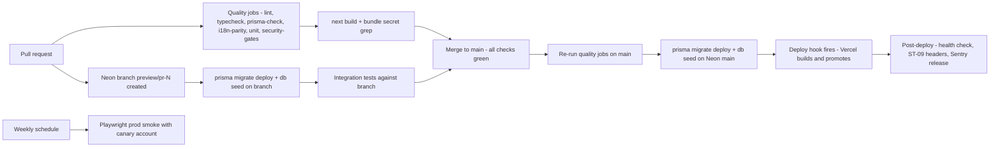

# 13 — Deployment, Environments & Operations

| Field | Value |
|---|---|
| **Status** | Draft |
| **Version** | 1.0 |
| **Owner** | Founder (Abhishek) |
| **Last updated** | 2026-07-04 |
| **Depends on** | [../00-foundation/README.md](../00-foundation/README.md) · [../01-prd/README.md](../01-prd/README.md) · [../04-business-rules/README.md](../04-business-rules/README.md) · [../07-database/README.md](../07-database/README.md) · [../08-api/README.md](../08-api/README.md) · [../09-backend/README.md](../09-backend/README.md) · [../11-architecture/README.md](../11-architecture/README.md) · [../12-security/README.md](../12-security/README.md) · [../14-testing-qa/README.md](../14-testing-qa/README.md) · [../15-project-plan/README.md](../15-project-plan/README.md) · [../16-legal/README.md](../16-legal/README.md) |

> This document owns **how PashuSetu is provisioned, deployed, and operated**: environments, vendor setup runbooks, the CI/CD pipeline, secrets, database operations (migrations, backups, PITR), rollback, monitoring, the launch-day gate, and the operating cadence. Everything is sized for the locked stack (D1–D5: Next.js full-stack on **Vercel**, **Prisma + Neon PostgreSQL**, **Firebase phone OTP**, **Cloudflare R2**, GitHub + GitHub Actions) and for a **solo developer** who must run all of it alone. Schema/migration semantics are owned by [doc 07](../07-database/README.md); jobs, workers and the full env-var registry by [doc 09](../09-backend/README.md); security controls and rotation triggers by [doc 12](../12-security/README.md); sprint scheduling by [doc 15](../15-project-plan/README.md) (this doc names sprints S1–S8 as defined there). Nothing here introduces a separate backend service, a different database, or any deviation from D1–D10.

---

## 1. Environment matrix

Three environments. **Two Firebase projects total** (`pashusetu-dev` serves both local and preview; `pashusetu-prod` serves production only) — a compromised or misconfigured dev/preview surface can never touch production identities. **Two R2 bucket pairs** follow the same split.

| Dimension | Local | Preview (per PR) | Production |
|---|---|---|---|
| App URL | `http://localhost:3000` | `https://pashusetu-git-<branch>-<account>.vercel.app` (Vercel-generated; access protected by Vercel Authentication) | `https://pashusetu.in` (`www` 308-redirects to apex) |
| `NEXT_PUBLIC_APP_URL` | `http://localhost:3000` | `https://$VERCEL_URL` (system-provided per deployment) | `https://pashusetu.in` |
| Database | Neon branch `dev/abhishek` (personal dev branch; **no local Postgres to maintain**, per [doc 07 §7.1](../07-database/README.md)) | Neon branch `preview/pr-{number}` — copy-on-write from `main`, created/deleted by CI ([doc 07 §7.2](../07-database/README.md)) | Neon branch `main` |
| Firebase project | `pashusetu-dev` | `pashusetu-dev` | `pashusetu-prod` |
| R2 buckets (`R2_BUCKET` prefix, §2.4) | `pashusetu-dev` pair | `pashusetu-dev` pair | `pashusetu-prod` pair |
| Public image domain (`R2_PUBLIC_BASE_URL`) | `https://img-dev.pashusetu.in` | `https://img-dev.pashusetu.in` | `https://img.pashusetu.in` |
| SMS (MSG91) | Test-mode auth key; dispatcher runs against the doc 09 **fake provider** with `FEATURE_SMS=0` by default (nothing is actually sent) | **Disabled** — `MSG91_AUTH_KEY` is not set in the Vercel *Preview* scope and `FEATURE_SMS=0`; dispatcher marks rows `FAILED` with a logged skip | **Live** — production auth key, DLT-approved templates, `FEATURE_SMS=1` |
| Sentry environment tag | `development` | `preview` | `production` |
| Seed data | `prisma db seed` (36 districts, 32 breeds, System user — [doc 07 §6](../07-database/README.md)) + doc 14 test fixtures | Inherits full production data via copy-on-write; CI re-runs the idempotent seed after `migrate deploy` | Seed run once at provisioning (§2.3), then re-run by every production deploy (idempotent upserts) |
| Cron jobs | Not scheduled — invoked manually: `curl -H "Authorization: Bearer $CRON_SECRET" localhost:3000/api/v1/internal/expiry` | Not scheduled (routes exist, callable manually against the branch DB) | Vercel Cron, 2 daily entries (§2.2 step 8) |
| Purpose | Development, unit/integration test target | Rehearse every PR — code **and** migration — against a byte-identical copy of prod data | Real users |

### 1.1 Region decisions (consistent with [doc 11](../11-architecture/README.md))

| Component | Region | Rationale |
|---|---|---|
| Neon project | **AWS `ap-southeast-1` (Singapore)** | Neon's closest region to Maharashtra; no Mumbai region exists on Neon. |
| Vercel Serverless Functions | **`sin1` (Singapore)** — set in `vercel.json` `"regions": ["sin1"]` | Co-located with the database. Each API request makes 2–5 sequential Prisma queries; function↔DB latency dominates, so functions live next to Neon, while users hit Vercel's Mumbai edge PoPs for static assets, cached SSR and TLS termination. Doc 11 owns the latency-budget analysis; this is its operational restatement. |
| Cloudflare R2 buckets | **Location hint: Asia-Pacific (APAC)** | Uploads and image serving stay in-region; `img.pashusetu.in` is Cloudflare-edge-cached in India regardless. |

### 1.2 Operational feature flags (kill switches)

Defined and implemented in [doc 09](../09-backend/README.md) as top-of-middleware guards ([doc 12 §9.2](../12-security/README.md)); listed here because operating them is a deployment action (env-var change + redeploy, < 2 min):

| Flag | Effect when set |
|---|---|
| `FEATURE_SMS=0` | SMS dispatch off; notifications fall back to INAPP rows only (PRD §10 fallback line) |
| `DISABLE_INTEREST=1` | `POST /listings/{id}/interest` returns 503 — stops an active phone-harvesting incident (SEC-T01) |
| `DISABLE_UPLOADS=1` | Presign + attach return 503 — stops an active upload-abuse incident (SEC-T05) |
| `READ_ONLY_MODE=1` | All mutating routes return 503; public browse stays up — DB-emergency mode |

Every flag flip is recorded in the ops journal (§4.4) with reason and revert time.

---

## 2. Provisioning runbooks

Run in the order listed — later runbooks consume outputs of earlier ones. All are Sprint 1 tasks (PS-001/002/003/008/054 in [doc 15 §4.2](../15-project-plan/README.md)) except where noted. Every secret produced goes straight into the password manager (Bitwarden, the master secret store — §4.1) before it goes anywhere else.

### 2.1 GitHub repository + branch protection

| # | Action | Where | Expected outcome |
|---|---|---|---|
| 1 | Create **private** repo `pashusetu` (single repo — D1 one-codebase) with default branch `main`; push the PS-001 scaffold | github.com → New repository | Repo exists; `main` holds the Next.js + Prisma scaffold; `pnpm-lock.yaml` committed |
| 2 | Add branch protection rule for `main`: require a pull request before merging (0 approvals — solo dev, decision); require status checks to pass: `lint`, `typecheck`, `prisma-check`, `i18n-parity`, `unit`, `security-gates`, `integration`, `build`; require branches up to date; block force pushes and deletions; **Include administrators** | Repo → Settings → Branches | Direct pushes to `main` are rejected even for the founder; a deliberately broken PR is blocked (S1 demo criterion) |
| 3 | Enable Dependabot: weekly `npm` ecosystem updates + security alerts (SEC-T16) | Settings → Code security | First Dependabot config PR opens within a week |
| 4 | Enable secret scanning + push protection | Settings → Code security | Pushing a test dummy AWS-style key is blocked |
| 5 | Create the `production` **environment** with **required reviewer = founder** (self-approval allowed) — this is the destructive-migration approval gate (§5.1) | Settings → Environments | Workflow jobs targeting `environment: production` pause for a manual click |
| 6 | Add Actions secrets (full list in §4.2) | Settings → Secrets and variables → Actions | CI runs green with no secrets in the repo |
| 7 | Create the **private ops repo** `pashusetu-ops` (ops journal, incident notes per [doc 12 §9.2](../12-security/README.md), drill logs, DLT receipts) | github.com | Journal file `JOURNAL.md` exists with its first entry: "repos provisioned" |

### 2.2 Vercel project

| # | Action | Where | Expected outcome |
|---|---|---|---|
| 1 | Import the GitHub repo; **Framework preset: Next.js**; Node.js 20; build command default (`next build` via `pnpm`); install command `pnpm install --frozen-lockfile` | vercel.com → Add New → Project | First deployment builds green |
| 2 | Set **Function region `sin1`** (§1.1) | Project → Settings → Functions | Functions execute in Singapore (visible in deployment summary) |
| 3 | Commit `vercel.json` (below): region pin, cron entries, and `git.deploymentEnabled.main=false` so **production deploys are triggered only by CI after migrations** (§3.3) | Repo root | Pushes to `main` no longer auto-deploy; PR branches still get preview deployments |
| 4 | Create a **Deploy Hook** named `prod-after-migrate` on branch `main`; store its URL as GitHub Actions secret `VERCEL_DEPLOY_HOOK_PROD` | Project → Settings → Git → Deploy Hooks | `curl -X POST $VERCEL_DEPLOY_HOOK_PROD` starts a production build from `main` |
| 5 | Add env vars per environment scope (Production / Preview / Development) exactly per the §4.2 placement table | Project → Settings → Environment Variables | `vercel env ls` matches §4.2; no prod secret appears in Preview scope |
| 6 | Enable **Vercel Authentication for preview deployments** (previews carry a copy of prod data — [doc 07 §7.2](../07-database/README.md)) | Project → Settings → Deployment Protection | Anonymous visit to a preview URL requires Vercel login |
| 7 | Add domains `pashusetu.in` (primary) and `www.pashusetu.in` (redirect to apex) | Project → Settings → Domains | Both verify after §2.9 DNS; HTTPS cert issued automatically |
| 8 | Verify **Vercel Cron** picked up the two `vercel.json` entries | Project → Settings → Cron Jobs | Both jobs listed with next-run times |
| 9 | Enable Vercel Web Analytics (NFR-10, cookie-free) | Project → Analytics | Events visible after next deploy |
| 10 | **Plan:** Hobby during S1–S7; upgrade to **Pro at the start of S8** (commercial-use terms, minute-precise crons, higher concurrency) — cost carried in doc 11's cost model | Account → Billing | Plan switch logged in ops journal |

```json
// vercel.json (committed)
{
  "regions": ["sin1"],
  "git": { "deploymentEnabled": { "main": false } },
  "crons": [
    { "path": "/api/v1/internal/expiry",  "schedule": "0 21 * * *"  },
    { "path": "/api/v1/internal/cleanup", "schedule": "30 21 * * *" }
  ]
}
```

Cron notes: `21:00 UTC = 02:30 IST` — the daily expiry + 3-day-warning sweep mandated by BR-072/BR-073 at exactly the time doc 04 fixed; `21:30 UTC = 03:00 IST` — the cleanup job (R2 orphan GC per [doc 12 §6.2](../12-security/README.md), 90-day notification purge per BR-071 #18, expired `rate_limits` rows per doc 12 §8.4). Job internals are owned by [doc 09](../09-backend/README.md); the schedule contract is fixed here. Both routes live under `/api/v1/internal/*` and reject any request without `Authorization: Bearer ${CRON_SECRET}` (doc 12 AS-12, B5) — Vercel injects that header automatically when a `CRON_SECRET` env var exists. Hobby-tier crons run within ~1 hour of schedule; acceptable for daily jobs, and the S8 Pro upgrade makes them minute-precise before launch.

### 2.3 Neon (PostgreSQL)

| # | Action | Where | Expected outcome |
|---|---|---|---|
| 1 | Create project `pashusetu`, Postgres 16, region **AWS ap-southeast-1** (§1.1) | console.neon.tech | Project with default branch `main` (this **is** production) |
| 2 | Copy the two `main` connection strings: **pooled** (host contains `-pooler`) and **direct**; form the runtime URLs per [doc 07 §8.3](../07-database/README.md): pooled + `?sslmode=require&pgbouncer=true&connect_timeout=15&connection_limit=5` → `DATABASE_URL`; direct + `?sslmode=require` → `DIRECT_URL` | Console → Connection details | Both strings stored in Bitwarden; `psql $DIRECT_URL -c "select 1"` returns 1 |
| 3 | Create personal dev branch `dev/abhishek` from `main`; copy its pooled + direct strings into local `.env.local` | Console → Branches | `pnpm prisma migrate dev` works locally against the branch |
| 4 | Apply the initial migration + seed to `main`: `DIRECT_URL=<prod-direct> pnpm prisma migrate deploy && pnpm prisma db seed` | Founder machine (one-time bootstrap) | `districts`=36, `breeds`=32, System user present ([doc 07 §6](../07-database/README.md)) |
| 5 | Add GitHub Actions secrets `NEON_API_KEY` + `NEON_PROJECT_ID` for **branch-per-PR**: CI uses `neondatabase/create-branch-action` on PR open/sync (branch `preview/pr-{number}`) and `neondatabase/delete-branch-action` on PR close, per [doc 07 §7.2](../07-database/README.md) | Neon console → API keys; repo secrets | Opening a test PR creates `preview/pr-N` and CI migrates + seeds it; closing deletes it |
| 6 | Confirm autosuspend (scale-to-zero) is on for non-prod branches; leave `main` on default autoscaling | Console → Branch settings | Idle dev/preview branches consume ~0 compute |
| 7 | **Plan:** Free tier through S6 (fits with >5× headroom, [doc 07 §8.2](../07-database/README.md)); upgrade to **Launch at the start of S7**, then set the PITR/history retention window to **7 days** — so the S7 restore drill (§5.3, PS-065) runs on the exact launch configuration | Console → Billing | Restore window shows 7 days; upgrade logged in ops journal |

### 2.4 Cloudflare R2

Bucket topology is a security control fixed by [doc 12 §6.4](../12-security/README.md): **private originals bucket + public variants bucket**, per environment. The env var `R2_BUCKET` holds the environment's **bucket-pair prefix** (`pashusetu-dev` / `pashusetu-prod`); the physical bucket names are `${R2_BUCKET}-uploads` (private) and `${R2_BUCKET}-public` (public) — doc 12's generically named `pashusetu-uploads`/`pashusetu-public` pair, carried per environment.

| # | Action | Where | Expected outcome |
|---|---|---|---|
| 1 | Enable R2 on the Cloudflare account (card on file; free tier: 10 GB storage, zero egress — D4 rationale) | dash.cloudflare.com → R2 | R2 dashboard active |
| 2 | Create 4 buckets, location hint **Asia-Pacific**: `pashusetu-dev-uploads`, `pashusetu-dev-public`, `pashusetu-prod-uploads`, `pashusetu-prod-public` | R2 → Create bucket | All 4 listed; bucket listing/public access **off** everywhere by default |
| 3 | Create **two scoped API tokens** (one per environment): permission **Object Read & Write**, scoped to exactly that environment's two buckets, TTL forever | R2 → Manage API Tokens | Each token yields `R2_ACCESS_KEY_ID` + `R2_SECRET_ACCESS_KEY` (S3-compatible); the account id shown is `R2_ACCOUNT_ID`. Dev token physically cannot touch prod buckets |
| 4 | Apply the CORS policy below to the two **`-uploads` (private) buckets only** — browsers PUT presigned uploads there ([doc 12 §6.1](../12-security/README.md), B7). The `-public` buckets get **no CORS** (plain `` GETs need none) | Bucket → Settings → CORS policy | A presigned PUT from an allowed origin succeeds; from any other origin the preflight fails |
| 5 | Attach custom domains: `img.pashusetu.in` → `pashusetu-prod-public`; `img-dev.pashusetu.in` → `pashusetu-dev-public`. Do **not** enable the `r2.dev` managed public URL on any bucket | Bucket → Settings → Custom Domains | Cloudflare auto-creates the proxied DNS records (§2.9); a variant URL serves over HTTPS; the private buckets have **no** public route |
| 6 | Cache rule for both image hosts: cache everything, **Edge Cache TTL 30 days**, respect origin `Cache-Control: public, max-age=31536000, immutable` set by the pipeline (keys are content-unique cuids, never overwritten — [doc 12 §6.1](../12-security/README.md)) | Cloudflare zone → Rules → Cache Rules | Second fetch of a variant shows `cf-cache-status: HIT` |

CORS policy for `pashusetu-prod-uploads` (exact JSON):

```json
[
  {
    "AllowedOrigins": ["https://pashusetu.in", "https://www.pashusetu.in"],
    "AllowedMethods": ["PUT"],
    "AllowedHeaders": ["Content-Type"],
    "ExposeHeaders": ["ETag"],
    "MaxAgeSeconds": 3600
  }
]
```

CORS policy for `pashusetu-dev-uploads` (exact JSON — adds local + preview origins; the wildcard is acceptable only because this bucket never holds production data):

```json
[
  {
    "AllowedOrigins": ["http://localhost:3000", "https://*.vercel.app"],
    "AllowedMethods": ["PUT"],
    "AllowedHeaders": ["Content-Type"],
    "ExposeHeaders": ["ETag"],
    "MaxAgeSeconds": 3600
  }
]
```

### 2.5 Firebase (two projects)

| # | Action | Where | Expected outcome |
|---|---|---|---|
| 1 | Create projects `pashusetu-dev` and `pashusetu-prod` (Google Analytics **off** — Vercel Analytics is the only analytics, doc 12 §5.5) | console.firebase.google.com | Two projects visible |
| 2 | In each: add a **Web app**; copy the client config into the `NEXT_PUBLIC_FIREBASE_*` vars (§4.2) for the matching environment scopes | Project settings → Your apps | Client SDK initializes in each environment |
| 3 | In each: enable **Phone** sign-in provider (the only provider — D3) | Build → Authentication → Sign-in method | Phone provider "Enabled" |
| 4 | **Authorized domains** — prod: `pashusetu.in`, `www.pashusetu.in` **only** (remove localhost). Dev: `localhost` + `vercel.app` (authorizes preview subdomains; Firebase matches subdomains of an authorized domain). Accepted risk on the **dev project only**: another vercel.app site could attempt OTP against `pashusetu-dev` — it holds no real users; never do this on prod | Authentication → Settings → Authorized domains | OTP works on localhost, previews, and prod; a prod OTP attempt from a non-pashusetu domain fails |
| 5 | Set **SMS region policy: allow India (+91) only** in both projects (doc 15 risk R-04) | Authentication → Settings → SMS region policy | OTP to a non-Indian number is rejected by Firebase |
| 6 | Dev project: add **test phone numbers** `+917700000001` / `+917700000002` / `+917700000003` with fixed code `731942` — real-device and CI logins with zero SMS cost. Prod project: add **one** test number `+917700000009` (fixed code held only in Bitwarden + the `CANARY_OTP` Actions secret) for the weekly prod smoke's canary account (§3.4) | Authentication → Sign-in method → Phone → Test numbers | Test-number login succeeds without an SMS being sent |
| 7 | In each: generate an **Admin SDK service-account key**; extract `project_id` → `FIREBASE_PROJECT_ID`, `client_email` → `FIREBASE_CLIENT_EMAIL`, `private_key` → `FIREBASE_PRIVATE_KEY` (stored with literal `\n` escapes; doc 12's `FIREBASE_SERVICE_ACCOUNT` refers to this same credential — operationally it is stored as these three discrete vars per doc 09's registry). Delete the downloaded JSON after transfer | Project settings → Service accounts | `verifyIdToken` works server-side; no JSON file exists on disk or in the repo (SEC-T15) |
| 8 | **App Check: OFF for MVP (decision).** Why: phone auth is already gated by Firebase's reCAPTCHA + throttling (BR-090 #1); App Check attestation adds a hard client dependency that mis-scores exactly our audience (low-end Androids, rural webviews) and complicates local/CI logins — for a marginal gain while every abuse surface is already per-account capped (SEC-T03). **Revisit trigger** (matches doc 15 R-04): monthly auth cost > ₹8,000 or an anomalous-OTP-volume alert → enable App Check in **monitoring mode** first, enforce only after a week of clean telemetry | Firebase console → App Check | Documented stance; no App Check SDK in the bundle |
| 9 | Set Firebase billing budget alert (Blaze plan on prod for phone-auth SMS): ₹8,000/month with 50%/80%/100% email alerts | Google Cloud console → Billing → Budgets | Alert emails configured to the founder |

### 2.6 MSG91 + DLT registration — **start Sprint 1 (PS-054); longest external dependency**

> **Lead-time warning:** end-to-end DLT registration (entity → header → templates, plus MSG91 linking) takes **2–6 weeks**, and Marathi templates with variables are commonly rejected once or twice. It is the only Sprint-6 dependency that no amount of engineering can accelerate — file it in Sprint 1 week 1. The PRD §10 gate explicitly allows launching with SMS toggled off (`FEATURE_SMS=0`, in-app only) if approval slips.

| # | Action | Where | Expected outcome |
|---|---|---|---|
| 1 | Create MSG91 account; complete KYC (PAN, address proof — sole proprietorship in the founder's name) | msg91.com | Account active; test-mode auth key available immediately → local `MSG91_AUTH_KEY` |
| 2 | Register the **Principal Entity** on a TRAI DLT registrar (decision: **Airtel DLT**, `dltconnect.airtel.in`) as sole proprietor; pay the one-time registration fee (~₹5,900 incl. GST) | Airtel DLT portal | **PE ID** issued (1–7 working days) |
| 3 | Register the **header (sender ID)**: `PSHSTU` (6 letters, category Transactional/Service) | DLT portal → Headers | Header approved against the PE ID (1–7 working days) |
| 4 | Register **content templates**: every SMS-channel template in the BR-071 trigger table, **verbatim** (`NTF-LISTING-APPROVED`, `NTF-LISTING-REJECTED`, `NTF-INTEREST-RECEIVED`, `NTF-EXPIRY-WARNING`, `NTF-USER-BANNED`), Marathi text with `{#var#}` in exactly the variable positions doc 04 defines; category Service-Implicit | DLT portal → Templates | Each template gets a **DLT template ID**; rejections re-filed within 24 h (common causes: variable count mismatch, missing brand name) |
| 5 | Link DLT to MSG91: add PE ID, header, and map each DLT template ID; set route Transactional | MSG91 dashboard → DLT | A test send of `NTF-LISTING-APPROVED` to the founder's phone arrives from `PSHSTU` |
| 6 | Generate the production auth key → `MSG91_AUTH_KEY` (Production scope only); set sender → `MSG91_SENDER_ID=PSHSTU`; enable MSG91 **low-balance + spend alerts** (SEC-T18) | MSG91 dashboard | Prod key stored; alert email configured |
| 7 | File all receipts/IDs (PE ID, header approval, template IDs) in `pashusetu-ops` | ops repo | S1 demo criterion "DLT submission receipt" satisfied |

### 2.7 Sentry

| # | Action | Where | Expected outcome |
|---|---|---|---|
| 1 | Create org `pashusetu`, one project `pashusetu` (platform: Next.js). One project, three environments via the `environment` tag (§1) | sentry.io | Project DSN issued → `SENTRY_DSN` (all env scopes; a DSN is publish-safe by design and is **allowlisted** in the ST-08 bundle grep) |
| 2 | Install `@sentry/nextjs` with `withSentryConfig`; set `environment` from `VERCEL_ENV`, release = commit SHA; `tracesSampleRate: 0.1` and the `beforeSend` PII scrubbing exactly per [doc 12 §5.5](../12-security/README.md) | Repo (PS-005) | A thrown test error appears tagged with environment + release |
| 3 | Create an **auth token** scoped `project:releases` → `SENTRY_AUTH_TOKEN` in Vercel (all scopes, server-only) and GitHub Actions. Source maps upload runs **inside the build** (`withSentryConfig` during `next build` on Vercel); the CI deploy job additionally creates the Sentry release and associates commits | Sentry → Auth Tokens | Prod stack traces are de-minified; releases show linked commits |
| 4 | Configure the seven alert rules from [doc 12 §9.5](../12-security/README.md) (error spike, release health < 99%, admin-route probing, rate-limit pressure, upload rejects, cron failure, new-issue > 1% sessions); alert channel = founder email + Sentry mobile-app push | Sentry → Alerts | Test alert fires to both channels |
| 5 | Create **Cron Monitors** for `/api/v1/internal/expiry` and `/api/v1/internal/cleanup` (check-in from each job run; doc 09 wires the SDK call); missed or failed schedule → immediate alert | Sentry → Crons | Simulated missed check-in alerts within the grace period (15 min) |

### 2.8 Google Places API (village autocomplete assist)

| # | Action | Where | Expected outcome |
|---|---|---|---|
| 1 | Create GCP project `pashusetu`; enable **Places API** (autocomplete only — no Maps rendering, no Geocoding; we never store coordinates, doc 12 §5.4) | console.cloud.google.com | API enabled |
| 2 | Create a **browser API key**; restrict: *Application* = HTTP referrers `pashusetu.in/*`, `www.pashusetu.in/*`, `localhost:3000/*`, `*.vercel.app/*`; *API* = Places API only | APIs & Services → Credentials | Key works from the app origins, rejected elsewhere; goes into `NEXT_PUBLIC_GOOGLE_MAPS_API_KEY` (referrer-restricted ⇒ public-safe by design; allowlisted in ST-08) |
| 3 | Set a billing **budget: ₹2,000/month** with 50%/80%/100% email alerts; Places autocomplete stays inside Google's free monthly credit at MVP volume | Billing → Budgets & alerts | Budget visible; alert emails to founder |

### 2.9 Domain + DNS (Cloudflare)

| # | Action | Where | Expected outcome |
|---|---|---|---|
| 1 | Register `pashusetu.in` on Cloudflare Registrar (or transfer in); zone active on Cloudflare DNS | dash.cloudflare.com | Zone `pashusetu.in` active |
| 2 | Create the records in the table below. **Vercel records are DNS-only (grey cloud)** — Vercel terminates TLS itself and double-proxying breaks cert issuance; **R2 image records are proxied (orange cloud)** — created automatically by the §2.4 custom-domain step and required by R2 | Zone → DNS | `dig pashusetu.in` → Vercel IP; `dig img.pashusetu.in` → Cloudflare edge |
| 3 | Zone SSL/TLS mode: **Full (strict)**; "Always Use HTTPS" on. HTTPS is otherwise automatic on both sides (Vercel-managed Let's Encrypt for the app; Cloudflare edge certs for `img*`) | Zone → SSL/TLS | Whole zone A+ on SSL Labs; plain-HTTP requests 301 to HTTPS |
| 4 | Enable **Cloudflare Email Routing**: forward `support@`, `grievance@`, `ops@pashusetu.in` to the founder's inbox (addresses required by [doc 16](../16-legal/README.md) and doc 12 §3.3) | Zone → Email → Email Routing | Test mail to all three arrives |
| 5 | Verify the domains attach in Vercel (§2.2 step 7) and R2 (§2.4 step 5) | Vercel + R2 dashboards | Both show "Valid configuration" |

| Record | Type | Name | Content | Proxy |
|---|---|---|---|---|
| Apex → Vercel | A | `pashusetu.in` | `76.76.21.21` | DNS only |
| www → Vercel | CNAME | `www` | `cname.vercel-dns.com` | DNS only |
| Prod images → R2 | CNAME | `img` | auto-managed by R2 custom domain | Proxied |
| Dev images → R2 | CNAME | `img-dev` | auto-managed by R2 custom domain | Proxied |

---

## 3. CI/CD pipeline

### 3.1 Shape

Package manager: **pnpm** with a committed `pnpm-lock.yaml`; every install is `pnpm install --frozen-lockfile` — the pnpm equivalent of doc 12 SEC-T16's committed-lockfile + clean-install rule. All third-party actions are **pinned to commit SHAs** (SEC-T16). Checks below are exactly the required status checks named in §2.1 step 2.



### 3.2 On pull request

| Job | Steps | Fails when |
|---|---|---|
| `lint` | `pnpm lint` (ESLint incl. the doc 12 bans: `no-restricted-syntax` on `$queryRawUnsafe`/`$executeRawUnsafe`, `react/no-danger`) + `pnpm prettier --check .` | Any lint/format error |
| `typecheck` | `pnpm tsc --noEmit` | Any type error |
| `prisma-check` | `pnpm prisma validate` + drift check `pnpm prisma migrate diff --from-migrations ./prisma/migrations --to-schema ./prisma/schema.prisma --exit-code` ([doc 07 §7.1](../07-database/README.md)) — Prisma 7 flag is `--to-schema` (was `--to-schema-datamodel`); the shadow DB it replays migrations into is an ephemeral Postgres **service container**, its URL passed via `SHADOW_DATABASE_URL` → `prisma.config.ts` `datasource.shadowDatabaseUrl` — + destructive-SQL grep on **new** migration files (§5.1) | Schema/migrations diverge, or a destructive statement lacks the `expand-contract-plan` PR label |
| `i18n-parity` | Catalog parity `mr.json` ↔ `en.json` (PS-002/PS-057: every key in both, no empty values) | Any missing/empty key |
| `unit` | `pnpm vitest run` (unit suites incl. ST-07 EXIF strip) | Any failing test |
| `security-gates` | `gitleaks` over the diff + history, `pnpm audit --audit-level high` (doc 12 A06) | Any secret or high/critical advisory |
| `integration` | `neondatabase/create-branch-action` → branch `preview/pr-{number}` → `prisma migrate deploy` + `prisma db seed` against its **direct** URL → integration suites (ST-01 authz matrix, ST-04 IDOR, ST-10 state-machine fuzz, ST-11 banned sweep, ST-02 phone concealment) against a locally-booted `next start` pointed at the branch's **pooled** URL | Migration fails on prod-shaped data, or any suite fails |
| `build` | `pnpm next build`, then **bundle secret grep** (§4.5) over `.next/static/**` | Build fails or a secret pattern / non-allowlisted `NEXT_PUBLIC_` value is found |

On PR close, a separate small workflow runs `neondatabase/delete-branch-action` for `preview/pr-{number}`. Vercel's Git integration independently builds the **preview deployment** for the PR branch (its `DATABASE_URL` is set to the PR's Neon branch by the integration job via the Vercel API).

### 3.3 On merge to `main` — production deploy ordering

**Ordering strategy (decision, implementing [doc 07 §7.1](../07-database/README.md) "migrate deploy before the Vercel production promote"):** Vercel auto-deploy is disabled for `main` (`vercel.json`, §2.2 step 3). The deploy workflow is the only thing that can put code in front of traffic, and it is sequenced:

1. Re-run all §3.2 quality jobs on the merge commit (cheap insurance against merge-skew).
2. `migrate-prod` job — GitHub environment `production`: `pnpm prisma migrate deploy` against `DIRECT_URL_PROD` ([doc 07 §8.3](../07-database/README.md): migrations always use the direct, non-pooler URL), then `pnpm prisma db seed` (idempotent — keeps breeds/districts current automatically). If the migration set contains a flagged destructive change, this job **pauses for the founder's manual approval** (§5.1).
3. Only after step 2 succeeds: `curl -X POST $VERCEL_DEPLOY_HOOK_PROD` — Vercel builds `main` via its Git integration and promotes it to production.
4. `verify` job polls the deployment until READY, then: `GET https://pashusetu.in/api/v1/health` must return 200 with `"db":"ok"`; the ST-09 header check diffs live headers against the doc 12 §8.1 canonical set; the Sentry release is created and commits associated.

Why this is safe: schema **always lands before code** (structural ordering, not a race), and because every migration is backward-compatible with the currently-deployed code (expand–contract, [doc 07 §7.3 #1](../07-database/README.md)), the old build keeps working during the ~3-minute window between steps 2 and 3 — zero downtime (NFR-04). If step 3 or 4 fails, traffic never left the previous healthy deployment.

### 3.4 Scheduled: weekly production E2E smoke

Playwright against **production**, Mondays 03:00 UTC (08:30 IST), using the **canary account** (prod Firebase test number `+917700000009`, §2.5 step 6 — logs in with a fixed code, sends no SMS, exists as a normal seedless `users` row named "Canary Test", district Satara):

1. `GET /api/v1/health` → 200. 2. Home (S-05) renders with listings. 3. Species + district filtered search returns results. 4. A known APPROVED listing detail (S-07) renders with images from `img.pashusetu.in`. 5. Canary logs in via OTP test code. 6. Canary creates a draft listing — description **"ही चाचणी जाहिरात आहे — कृपया दुर्लक्ष करा"** (*"This is a test listing — please ignore"*) — verifies it appears in My Listings, then archives it (T-11). The draft is never submitted, so it never enters the moderation queue or public search.
Failure → GitHub Actions failure email + a Sentry event tagged `smoke` (fires the immediate-alert rule).

### 3.5 Workflow sketch

```yaml
# .github/workflows/ci.yml — sketch; real file pins all actions by commit SHA (SEC-T16)
name: ci
on:
  pull_request:
  push:
    branches: [main]

jobs:
  quality:
    runs-on: ubuntu-latest
    strategy:
      matrix: { check: [lint, typecheck, prisma-check, i18n-parity, unit, security-gates] }
    steps:
      - uses: actions/checkout@<sha> # v4
      - uses: pnpm/action-setup@<sha> # v4
      - uses: actions/setup-node@<sha> # v4
        with: { node-version: 20, cache: pnpm }
      - run: pnpm install --frozen-lockfile
      - run: pnpm run check:${{ matrix.check }}   # package.json maps each check to §3.2 commands

  integration:
    if: github.event_name == 'pull_request'
    runs-on: ubuntu-latest
    steps:
      - uses: actions/checkout@<sha>
      - uses: pnpm/action-setup@<sha>
      - uses: actions/setup-node@<sha>
        with: { node-version: 20, cache: pnpm }
      - run: pnpm install --frozen-lockfile
      - id: neon
        uses: neondatabase/create-branch-action@<sha> # branch preview/pr-${{ github.event.number }}
        with: { project_id: "${{ secrets.NEON_PROJECT_ID }}", api_key: "${{ secrets.NEON_API_KEY }}" }
      - run: pnpm prisma migrate deploy && pnpm prisma db seed
        env: { DIRECT_URL: "${{ steps.neon.outputs.db_url }}" }
      - run: pnpm run test:integration   # boots next start against the branch; ST-01/02/04/10/11 suites
        env:
          DATABASE_URL: "${{ steps.neon.outputs.db_url_pooled }}"
          DIRECT_URL: "${{ steps.neon.outputs.db_url }}"

  build:
    runs-on: ubuntu-latest
    steps:
      - uses: actions/checkout@<sha>
      - uses: pnpm/action-setup@<sha>
      - uses: actions/setup-node@<sha>
        with: { node-version: 20, cache: pnpm }
      - run: pnpm install --frozen-lockfile
      - run: pnpm next build
      - run: ./scripts/bundle-secret-grep.sh   # §4.5 — fails on any secret pattern in .next/static

  migrate-prod:
    if: github.ref == 'refs/heads/main'
    needs: [quality, build]
    environment: production          # §5.1 manual gate bites here for destructive migrations
    runs-on: ubuntu-latest
    steps:
      - uses: actions/checkout@<sha>
      - uses: pnpm/action-setup@<sha>
      - uses: actions/setup-node@<sha>
        with: { node-version: 20, cache: pnpm }
      - run: pnpm install --frozen-lockfile
      - run: pnpm prisma migrate deploy && pnpm prisma db seed
        env: { DIRECT_URL: "${{ secrets.DIRECT_URL_PROD }}" }

  deploy-prod:
    if: github.ref == 'refs/heads/main'
    needs: migrate-prod
    runs-on: ubuntu-latest
    steps:
      - run: curl -sf -X POST "${{ secrets.VERCEL_DEPLOY_HOOK_PROD }}"
      - run: ./scripts/wait-and-verify.sh   # §3.3 step 4: poll READY, health check, ST-09 headers
      - run: pnpm dlx @sentry/cli releases new "$GITHUB_SHA" && pnpm dlx @sentry/cli releases set-commits --auto "$GITHUB_SHA"
        env: { SENTRY_AUTH_TOKEN: "${{ secrets.SENTRY_AUTH_TOKEN }}" }
```

```yaml
# .github/workflows/smoke.yml — sketch
name: prod-smoke
on:
  schedule:
    - cron: "0 3 * * 1"   # Mondays 03:00 UTC = 08:30 IST
jobs:
  smoke:
    runs-on: ubuntu-latest
    steps:
      - uses: actions/checkout@<sha>
      - uses: pnpm/action-setup@<sha>
      - uses: actions/setup-node@<sha>
        with: { node-version: 20, cache: pnpm }
      - run: pnpm install --frozen-lockfile && pnpm playwright install chromium
      - run: pnpm playwright test e2e/prod-smoke.spec.ts
        env:
          BASE_URL: https://pashusetu.in
          CANARY_PHONE: "+917700000009"
          CANARY_OTP: "${{ secrets.CANARY_OTP }}"
```

---

## 4. Secrets management

### 4.1 Principles

1. **Master store:** every credential lives in the founder's Bitwarden vault first; GitHub/Vercel hold copies, never originals.
2. **`.env.local` is gitignored; `.env.example` is committed** with every variable name and a placeholder value + one-line comment — a fresh clone knows exactly what to fill in.
3. **Server secrets never reach the client.** Only `NEXT_PUBLIC_*`-prefixed values (plus the publish-safe `SENTRY_DSN`) may appear in the bundle; enforced by the §4.5 CI grep (doc 12 SEC-T15/ST-08).
4. **Every env-var change is journaled** (§4.4) — the config-rollback path depends on it.

### 4.2 Placement table (runtime registry owned by [doc 09](../09-backend/README.md); placement fixed here)

| Variable | Local `.env.local` | Vercel Preview | Vercel Production | GitHub Actions | Client-visible? |
|---|---|---|---|---|---|
| `DATABASE_URL` (pooled, per doc 07 §8.3) | `dev/abhishek` branch | injected per-PR (Neon branch) | Neon `main` pooled | per-PR from Neon action | No |
| `DIRECT_URL` (direct; migrations) | `dev/abhishek` direct | injected per-PR | Neon `main` direct | as `DIRECT_URL_PROD` secret (deploy) + per-PR | No |
| `FIREBASE_PROJECT_ID` | `pashusetu-dev` | `pashusetu-dev` | `pashusetu-prod` | dev value (integration tests) | No |
| `FIREBASE_CLIENT_EMAIL` | dev SA | dev SA | prod SA | dev SA | No |
| `FIREBASE_PRIVATE_KEY` | dev SA | dev SA | prod SA | dev SA | No |
| `R2_ACCOUNT_ID` | account id | account id | account id | account id (ST-03 nightly) | No |
| `R2_ACCESS_KEY_ID` / `R2_SECRET_ACCESS_KEY` | dev token | dev token | prod token | dev token | No |
| `R2_BUCKET` (pair prefix, §2.4) | `pashusetu-dev` | `pashusetu-dev` | `pashusetu-prod` | `pashusetu-dev` | No |
| `R2_PUBLIC_BASE_URL` | `https://img-dev.pashusetu.in` | same | `https://img.pashusetu.in` | dev value | Yes (URL only, not a secret) |
| `MSG91_AUTH_KEY` | test-mode key | **not set** (§1 SMS row) | live key | — | No |
| `MSG91_SENDER_ID` | `PSHSTU` | `PSHSTU` | `PSHSTU` | — | No |
| `SENTRY_DSN` | dev tag via env | preview tag | production tag | — | Yes (publish-safe, allowlisted) |
| `CRON_SECRET` (32-byte random, `openssl rand -hex 32`) | local value | preview value | prod value | — | No |
| `NEXT_PUBLIC_FIREBASE_API_KEY` / `_AUTH_DOMAIN` / `_PROJECT_ID` / `_APP_ID` | dev web app | dev web app | prod web app | dev web app | Yes (public by design) |
| `NEXT_PUBLIC_APP_URL` | `http://localhost:3000` | `https://$VERCEL_URL` | `https://pashusetu.in` | — | Yes |
| `NEXT_PUBLIC_GOOGLE_MAPS_API_KEY` | referrer-restricted key | same | same | — | Yes (referrer-restricted) |
| `SENTRY_AUTH_TOKEN` (build-time only) | — | Vercel (server) | Vercel (server) | ✔ | No |
| `NEON_API_KEY`, `NEON_PROJECT_ID`, `VERCEL_DEPLOY_HOOK_PROD`, `CANARY_OTP` (CI-only) | — | — | — | ✔ | No |
| Flags: `FEATURE_SMS`, `DISABLE_INTEREST`, `DISABLE_UPLOADS`, `READ_ONLY_MODE` (§1.2) | `FEATURE_SMS=0` | `FEATURE_SMS=0` | `FEATURE_SMS=1`, kill switches unset | — | No |

### 4.3 Rotation runbooks

Triggers and ordering authority: [doc 12 §9.4](../12-security/README.md) (any suspected leak; annually for R2 + Neon; after **any** SEV-1 rotate everything). All rotations are zero-downtime env swaps. Each ends with: journal entry (§4.4) + verify the **old** credential is dead.

**`DATABASE_URL` / `DIRECT_URL` (Neon):**
1. Neon console → Roles → reset the application role's password → new pooled + direct strings.
2. Update Bitwarden, then Vercel Production (+ Preview/Development if the same role) and the `DIRECT_URL_PROD` Actions secret.
3. Redeploy production (re-fire the deploy hook or Vercel → Redeploy).
4. Verify: `GET /api/v1/health` returns `"db":"ok"`; `psql` with the **old** string fails auth.

**Firebase service account (`FIREBASE_CLIENT_EMAIL`/`FIREBASE_PRIVATE_KEY`):**
1. GCP console → IAM → Service accounts → the Admin SDK account → Keys → **Add key** (new JSON).
2. Extract the three values → Bitwarden → Vercel (correct project's scopes) → redeploy.
3. Verify login works on prod (canary account).
4. Delete the **old** key id in GCP; confirm a token minted for the old key is rejected.

**R2 access keys:**
1. R2 → Manage API Tokens → create a **second** token with the identical bucket scope.
2. Swap `R2_ACCESS_KEY_ID`/`R2_SECRET_ACCESS_KEY` in Bitwarden → Vercel → redeploy.
3. Verify a presign → PUT → attach round trip on prod (or the canary draft flow).
4. Revoke the old token; verify an old-signed request now 403s.

**`MSG91_AUTH_KEY`:**
1. MSG91 dashboard → API keys → regenerate.
2. Swap in Bitwarden → Vercel Production → redeploy.
3. Verify with one test SMS to the founder's phone; confirm the old key is rejected by the MSG91 API.

**`CRON_SECRET`:**
1. Generate a new value (`openssl rand -hex 32`).
2. Update the Vercel env var and redeploy — Vercel Cron picks up the new bearer value with the same deploy, so the swap is atomic.
3. Verify: next scheduled run check-ins green in Sentry Crons; a curl with the old secret gets 401.

### 4.4 Config change journal (discipline)

Every create/change/delete of any env var or dashboard setting (Vercel, Neon, R2, Firebase, MSG91, Sentry, Cloudflare, Google) gets a same-day line in `pashusetu-ops/JOURNAL.md`: `date | system | variable/setting | old → new (reference to Bitwarden entry, never the value) | reason | changed by`. This journal **is** the config-rollback source (§6.3) — Vercel does not keep env-var history.

### 4.5 No-secrets-in-client verification (CI, every build)

`scripts/bundle-secret-grep.sh` runs after `next build` (§3.2 `build` job; doc 12 ST-08):
1. Grep `.next/static/**` for: `BEGIN PRIVATE KEY`, `postgres://`, `postgresql://`, the MSG91 key shape, the R2 secret-key shape (64 hex chars), and `CRON_SECRET`'s value pattern.
2. Extract every `NEXT_PUBLIC_`-injected value found in the bundle and diff against the allowlist: `NEXT_PUBLIC_FIREBASE_*`, `NEXT_PUBLIC_APP_URL`, `NEXT_PUBLIC_GOOGLE_MAPS_API_KEY`, `SENTRY_DSN`.
3. Any hit / any non-allowlisted value → exit 1 → the `build` check blocks the merge.

---

## 5. Database operations

### 5.1 Migration deploy procedure

Semantics are owned by [doc 07 §7](../07-database/README.md); this is the operational restatement:

1. **Author** with `prisma migrate dev` on the local Neon branch; hand-written SQL via `--create-only` (doc 07 §9.2 pattern). Migration files are immutable once merged.
2. **Rehearse automatically**: the PR's Neon branch is a copy-on-write clone of production, so `prisma migrate deploy` in the `integration` job (§3.2) rehearses every migration against **real production data** before merge.
3. **Expand–contract policy (operational restatement of doc 07 §7.3–7.4):** every migration must be safe under the *currently deployed* code, because schema lands minutes before code (§3.3). Additive changes (new nullable column, new table/index, new enum value, widening) ship in one release. **Destructive changes** (`DROP TABLE`/`DROP COLUMN`, renames, type narrowing, `NOT NULL` on populated columns, enum-value removal, constraint tightening) are forbidden in a single release — they ship as the three-release Expand → Switch → Contract sequence with ≥ 1 week between Switch and Contract, exactly per the doc 07 §7.4 walkthrough.
4. **Destructive-change gate (mechanism, decision):** the `prisma-check` job greps new `migration.sql` files for `DROP TABLE|DROP COLUMN|ALTER COLUMN .* TYPE|SET NOT NULL|DROP CONSTRAINT`. A hit requires (a) the PR label `expand-contract-plan` **and** the plan written in the PR description (doc 07 §7.3 #2), and (b) the `migrate-prod` job then pauses on the GitHub `production` environment for the founder's explicit approval click (§2.1 step 5) — a deliberate stop-and-reread moment, even solo.
5. **Deploy**: `prisma migrate deploy` + idempotent `prisma db seed` run in CI against `DIRECT_URL` before the deploy hook fires (§3.3). Never run migrations through the pooled URL (PgBouncer transaction mode lacks the session features `prisma migrate` needs — doc 07 §8.3).

### 5.2 Backups & point-in-time recovery

- Neon PITR ("history retention") is the backup mechanism; R2 images are deliberately **not** separately backed up (loss = re-upload; accepted in [doc 12 §5.6](../12-security/README.md)).
- **Windows:** Free tier ≈ 24 hours (S1–S6); **Launch plan from S7 with the window set to 7 days** (§2.3 step 7) — the launch-day configuration.
- Restores are **non-destructive by default**: Neon restores into a *new branch* at a chosen timestamp; production `main` is untouched until you decide otherwise.

**Restore-to-branch drill runbook** (first execution: **Sprint 7**, story PS-065 in [doc 15](../15-project-plan/README.md); repeated quarterly per §9):

1. Pick a restore point 15 minutes in the past; note the target UTC timestamp.
2. Neon console → Branches → **Restore** → create branch `drill/2026-MM-DD` from `main` @ timestamp. Expected: branch READY in under a minute.
3. Copy the drill branch's pooled + direct strings (never point them at anything shared).
4. Verify data: `psql` row counts on `users`, `listings`, `moderation_log` vs production; spot-check one known listing's fields and images metadata.
5. Boot the app locally against the drill branch (`DATABASE_URL`/`DIRECT_URL` swap in `.env.local`); browse search + a detail page; log in with a dev-project test number is not possible against prod Firebase users — verify via SQL instead.
6. Record total elapsed time (target: **≤ 30 min** end-to-end; the restore itself is minutes) in `pashusetu-ops/drills/`.
7. Delete the drill branch; journal the drill.

**Real-disaster variant:** same through step 4, then use Neon's **Restore** on `main` itself (Neon repoints `main`'s head to the restore point and preserves the pre-restore state as a backup branch; connection strings are unchanged, so no env updates) → redeploy nothing; verify `GET /api/v1/health` + spot checks → journal + incident note (doc 12 §9.2). Any writes between the corruption moment and the restore are lost — announce accordingly.

### 5.3 Connection exhaustion playbook

Symptoms: Sentry `P2024` (Prisma pool timeout) spike, `/api/v1/health` 500s with connection errors, Neon dashboard connections pegged.

1. **Confirm** in Neon → Monitoring: active connections and whether they are pooler-side or direct.
2. **Check config first** (most likely cause after an env change): production `DATABASE_URL` must be the `-pooler` host with `pgbouncer=true&connection_limit=5` (doc 07 §8.3). A direct-URL-as-runtime mistake exhausts Neon in minutes — fix the env var and redeploy.
3. **Find stuck sessions**: Neon SQL editor → `select pid, state, now()-xact_start as age, query from pg_stat_activity where state <> 'idle' order by age desc;` → `select pg_terminate_backend(pid)` on anything abnormal (multi-minute transactions do not exist by design — doc 07 §8.3).
4. **Recycle the fleet**: Vercel → Redeploy current build — replaces all warm function instances and their Prisma clients.
5. **If genuinely traffic-driven**: raise the Neon compute autoscaling ceiling (more pooler backend budget), and journal it as a scale signal for [doc 11](../11-architecture/README.md)'s triggers.
6. **Last resort**: `READ_ONLY_MODE=1` (§1.2) to shed write load while investigating.

---

## 6. Rollback procedures

### 6.1 Application rollback (target: ≤ 10 minutes — PRD §10 gate; rehearsed in S7, PS-065)

1. Vercel dashboard → Project → Deployments → identify the last healthy production deployment (READY, pre-incident timestamp).
2. **Instant Rollback**: ⋯ menu on the current production deployment → *Instant Rollback* (or on the healthy build: *Promote to Production*). CLI equivalent: `vercel rollback`.
3. Traffic switches in seconds — no rebuild.
4. Verify: `GET /api/v1/health` 200; the triggering Sentry issue stops producing events; spot-check S-05.
5. **Pin**: disable the deploy hook usage (don't merge to `main`) until the fix lands; the rolled-back state survives because nothing else can deploy (§3.3).
6. Journal the rollback; open the incident note if user-facing (doc 12 §9.2).

Rollback caveat: it reverts **code only** — env vars and the database schema stay as they are. That is safe by construction: the schema is always backward-compatible with the previous release (§5.1 policy), so old code on new schema runs correctly.

### 6.2 Migration rollback policy

- **Default: roll forward.** A bad migration is corrected by a **new** migration (applied files are immutable — doc 07 §7.1); pair it with §6.1 if the code is also bad. Down-scripts are written in PR notes (doc 07 §7.3 #7) but executed as new forward migrations.
- **Restore-to-branch instead** only when data was **destroyed or corrupted** (bad backfill, faulty `UPDATE`, destructive statement that slipped the §5.1 gate): use the §5.2 real-disaster variant, accepting the write-loss window. Schema-only mistakes never justify PITR.
- Never `prisma migrate reset` against production under any circumstances (it drops the database).

### 6.3 Configuration rollback

1. Look up the previous value's Bitwarden reference in the ops journal (§4.4) — this is why the journal is mandatory.
2. Re-apply the old value in Vercel (correct scope) → Redeploy (env changes only take effect on a new deployment).
3. Verify the behavior the change controlled; journal the revert with a pointer to the original entry.

---

## 7. Monitoring & alerting

### 7.1 Health endpoint (contract fixed here; addendum to [doc 08](../08-api/README.md)'s catalog, added in Sprint 1 — PS-006)

`GET /api/v1/health` — public, no auth, exempt from rate limits, never cached. Executes `SELECT 1` through the pooled `DATABASE_URL`. Response `200 {"status":"ok","db":"ok","time":"<ISO 8601 UTC>"}`; any failure → `500` with the standard error envelope (`code: "HEALTH_CHECK_FAILED"`). It deliberately checks **only app + DB** (the two components whose failure takes the product down); R2/Firebase/MSG91 health is observed via their own signals below.

### 7.2 Signals table

Alert destination for everything marked *immediate*: **founder email (`ops@pashusetu.in`) + founder phone** (Sentry mobile push; UptimeRobot SMS/push). Sentry rule details are owned by [doc 12 §9.5](../12-security/README.md).

| Signal | Tool | Threshold | Alert channel / cadence |
|---|---|---|---|
| Uptime `GET /` (S-05) and `GET /api/v1/health` | UptimeRobot (free, 5-min interval, 2 monitors) | 2 consecutive failures (~10 min down) — sized against NFR-04's 99.5% | Immediate: email + phone push/SMS |
| Error rate | Sentry | > 5× trailing-7-day baseline for 15 min | Immediate |
| New issue | Sentry | Any new issue affecting > 1% of sessions (NFR-05) | Immediate |
| Crash-free sessions | Sentry release health | < 99% (G-05) | Immediate + checked in daily sweep |
| Admin-route probing / rate-limit pressure / upload rejects | Sentry custom events | Exactly per doc 12 §9.5 | Immediate / daily digest per that table |
| Cron jobs (expiry, cleanup) | Sentry Cron Monitors (§2.7 step 5) | Missed or failed check-in, 15-min grace | Immediate — a silent expiry-job death would freeze the market (BR-072) |
| Function errors | Vercel dashboard + log drain-free setup | 5xx > 1% of invocations over 1 h | Vercel notification email; checked in daily sweep |
| Function duration | Vercel | p95 > 3 s sustained 1 h (NFR-03 ceiling proxy) | Weekly review |
| Neon CPU | Neon dashboard email alerts | > 80% sustained 30 min | Email; weekly review |
| Neon storage | Neon dashboard | > 80% of plan quota | Monthly cost review (§9) |
| Neon connections | Neon dashboard | > 80% of pooler backend budget | Email → run §5.3 playbook |
| SMS delivery failure rate | MSG91 dashboard | > 5% failed in the trailing week; any DLT template rejection | Weekly review (§9); template rejection → same-day refile (§2.6) |
| MSG91 balance / spend | MSG91 alerts (§2.6 step 6) | Low balance; spend anomaly (SEC-T18) | Immediate email |
| Google Places spend | GCP budget (§2.8) | 50/80/100% of ₹2,000/month | Email |

---

## 8. Launch-day checklist (beta pilot gate — executed in S8, story PS-070, alongside PRD §10)

Ordered; each gate blocks the next. Evidence (screenshot/log link) is filed in `pashusetu-ops/launch/` per line.

1. **Prod env vars verified** — `vercel env ls` diffed line-by-line against §4.2 Production column; §4.5 bundle grep green on the launch build; kill switches unset; `FEATURE_SMS` set per DLT status.
2. **Migrations applied** — `pnpm prisma migrate status` against `DIRECT_URL_PROD` reports "Database schema is up to date"; `prisma migrate diff` clean.
3. **Seeds loaded** — 36 districts, 32 breeds (native-speaker-reviewed Marathi names — PRD §10), System user present ([doc 07 §6](../07-database/README.md)).
4. **Admin account created** — founder logged in on prod, `scripts/grant-admin.ts` run per [doc 07 §6.3](../07-database/README.md) / [doc 12 §3.5](../12-security/README.md); `GET /users/me` shows `isAdmin: true`; grant journaled.
5. **DLT templates approved** — all five §2.6 templates approved and mapped in MSG91, **or** the PRD §10 fallback consciously invoked: `FEATURE_SMS=0`, in-app only, SMS to follow within 2 weeks of pilot start — decision journaled.
6. **Test listing E2E on prod** — on a real budget Android over cellular: founder's second account creates a listing — species COW, description **"चाचणीसाठी तयार केलेली जाहिरात — लगेच काढून टाकली जाईल"** (*"A listing created for testing — will be removed immediately"*) — 3 photos → declaration → submit → admin approves from S-18/S-19 → appears in public search → buyer account taps WhatsApp (interest event logged, BR-062) → seller notification received → mark sold → **archive**. Every step green.
7. **Sentry receiving** — the E2E run visible as breadcrumbs; a deliberate test error appears tagged `production` with the launch release; all seven alert rules + 2 cron monitors active.
8. **Uptime monitor green** — both UptimeRobot monitors up ≥ 48 h with zero incidents; a forced failure (temporarily wrong path) confirmed to page the founder's phone, then reverted.
9. **Legal pages published** — `/privacy`, `/terms`, `/grievance` live in Marathi + English per [doc 16](../16-legal/README.md); seller declaration text live in the submit flow; footer links resolve.
10. **Helpline number live** — the dedicated support SIM (number published per doc 16 and in the app footer) rings to the founder; `support@`/`grievance@pashusetu.in` forwarding verified (§2.9 step 4); ban-appeal + deletion scripts from BR-014/BR-015 printed in the moderation runbook (PS-067).
11. **Rollback rehearsed** — the S7 PS-065 drill log shows app rollback ≤ 10 min and the Neon restore drill both passed **within the last 30 days**; if older, re-run both now.
12. **Final sweep** — moderation queue empty; `GET /admin/stats` returns the G-01…G-12 baseline (all ~0, captured as launch baseline); cron jobs' last runs green; then announce in the pilot villages (Chhatrapati Sambhajinagar + Ahilyanagar, PRD §10).

---

## 9. Operational cadence

| Cadence | When | Tasks |
|---|---|---|
| **Daily** (≈ 20 min, 7 days/week during pilot) | Morning, with the moderation duty | 1. Sentry inbox: triage new issues (SEV per doc 12 §9.1), check release health ≥ 99%. 2. **Moderation queue SLA check**: oldest PENDING item < 24 h (BR-041; amber at 18 h) — the queue itself is worked 2×/day per the PS-067 runbook. 3. Glance: uptime monitor, last cron runs, yesterday's signup/listing counts on `/admin/stats`. |
| **Weekly** (≈ 1 h, Monday — after the §3.4 smoke has run) | Monday | 1. Smoke result green. 2. Metrics review vs PRD targets: G-01…G-12 from `GET /admin/stats` vs the §2 PRD table (inquiry rate ≥ 25% trajectory, SLA p95). 3. SMS health: MSG91 delivery failure rate < 5%, spend sane. 4. Dependency updates: merge the week's Dependabot PRs (lockfile diff reviewed — SEC-T16); `pnpm audit` clean. 5. Neon/Vercel usage dashboards vs plan limits (doc 15 risk R-07). |
| **Monthly** (≈ 1 h, first working day) | Month start | 1. **Cost review vs the [doc 11](../11-architecture/README.md) cost model**: Vercel, Neon, R2, Firebase (OTP spend vs ₹8,000 alert line), MSG91 balance, Google Places — journal actuals + variance. 2. Storage growth vs doc 07 §8.1 projections. 3. Review rate-limit trip and abuse digests for policy tuning proposals (owner: doc 04). |
| **Quarterly** (≈ half day) | Quarter start | 1. **Backup restore drill** (§5.2 runbook, timed, logged). 2. **Secret rotation**: R2 keys + Neon password on the annual/semiannual wheel (§4.3; doc 12 §9.4 triggers override anytime). 3. App rollback re-drill (§6.1, ≤ 10 min). 4. Review this doc + doc 12 alert thresholds against reality; bump versions on change. 5. Verify branch protection, environment gate, and Vercel Authentication settings unchanged (config-drift check, doc 12 A05). |

---

## Acceptance checklist

- [x] Header table present (Status/Version/Owner/Last updated 2026-07-04/Depends on with relative links); doc cross-references use relative paths; BR ids (BR-041, BR-046, BR-062, BR-071, BR-072, BR-073, BR-090, BR-014/015) and screen ids (S-05, S-07, S-18, S-19) match docs 04/06 usage
- [x] Environment matrix covers local/preview/production × app URL, database (Neon `dev/abhishek` / branch-per-PR / `main`, per doc 07 §7), Firebase (`pashusetu-dev` for local+preview, `pashusetu-prod` — two projects total), R2 bucket pairs (`pashusetu-dev` / `pashusetu-dev` / `pashusetu-prod` prefixes with the doc 12 §6.4 private+public topology), SMS (test mode / disabled in preview / live), Sentry env tags, and seed data — plus region decisions (Neon ap-southeast-1, Vercel `sin1` co-located per doc 11) and kill-switch flags
- [x] All nine provisioning runbooks present (GitHub+branch protection, Vercel incl. cron + deploy hook, Neon incl. pooled-vs-direct per doc 07 §8.3 and branch-per-PR, R2 incl. **exact CORS JSON** for browser PUT + custom domains + cache rules, Firebase incl. two projects/phone auth/authorized domains/test numbers/Admin SDK/App Check OFF with rationale + revisit trigger, MSG91 incl. DLT steps + 2–6-week lead-time warning + start-Sprint-1, Sentry incl. source maps, Google Places incl. key restriction + budget, Cloudflare DNS incl. record table + HTTPS) — every step has action + where + expected outcome
- [x] CI/CD specified job-by-job with fenced YAML sketches: PR pipeline (pnpm frozen-lockfile install with cache, lint, typecheck, prisma validate + migrate-diff, i18n parity, unit, security gates, integration against a Neon preview branch, build + bundle grep) and main pipeline with the **migrate-before-traffic ordering strategy** (auto-deploy off for `main`, deploy hook fired only after `prisma migrate deploy` succeeds — implements doc 07 §7.1), plus the weekly scheduled Playwright prod smoke with a canary account; mermaid pipeline diagram parses (quoted labels, no parentheses in bracket labels)
- [x] Secrets management: placement table for every canonical env var (`DATABASE_URL`, `DIRECT_URL`, `FIREBASE_*`, `R2_*`, `MSG91_*`, `SENTRY_DSN`, `CRON_SECRET`, `NEXT_PUBLIC_FIREBASE_*`, `NEXT_PUBLIC_APP_URL`) across local/.env.example, Vercel per-environment, and GitHub Actions; concrete rotation runbooks for R2 keys, Firebase service account, MSG91, `DATABASE_URL` (+ `CRON_SECRET`) consistent with doc 12 §9.4; no-secrets-in-client CI bundle-grep step defined (ST-08)
- [x] Database operations: migration deploy procedure restating doc 07's expand–contract policy operationally with a concrete manual-approval gate for destructive migrations; Neon PITR windows per plan (24 h Free → 7 days on Launch from S7) with a numbered restore-to-branch drill runbook scheduled for **Sprint 7** (PS-065); connection-exhaustion playbook with ordered steps
- [x] Rollback: Vercel instant-rollback steps with the ≤ 10-minute PRD §10 target; migration policy = roll forward by default with the explicit restore-to-branch exception; config rollback backed by the mandatory env-change journal
- [x] Monitoring table (signal/tool/threshold/channel) covers Sentry error rate + new issues + release health, Vercel function errors/duration, Neon CPU/storage/connections, uptime on `/` and the health endpoint, cron monitors, and weekly MSG91 delivery-failure review; alerts go to founder email + phone; `GET /api/v1/health` declared with its full contract as a Sprint-1 addendum to doc 08 (PS-006 — path matches doc 15's demo criteria)
- [x] Launch-day checklist is an ordered gate list containing all mandated items (env vars verified, migrations applied, seeds loaded, admin created, DLT approved-or-fallback, prod E2E test listing, Sentry receiving, uptime green, legal pages, helpline live, rollback rehearsed) and aligns with PRD §10 and PS-070
- [x] Operational cadence covers daily (Sentry inbox + moderation SLA), weekly (metrics vs PRD + dependency updates + SMS health), monthly (cost review vs doc 11), quarterly (restore drill + secret rotation + rollback re-drill)
- [x] Zero contradictions with locked decisions D1–D10 (no separate backend, Neon+Prisma, Firebase client-side OTP only — the backend never sends OTP, R2 presigned uploads, Vercel+GitHub Actions) or with owner docs: canonical limits cited from BR-090 rather than restated as new values; pooled/direct string parameters, seed content, migration rules verbatim from doc 07; bucket topology, CORS stance, kill switches, rotation triggers from doc 12; cron time 02:30 IST from doc 04 BR-072/PS-027
- [x] Decision-complete: no TBD/TODO/open questions; all chosen values stated inline (regions, plan upgrade timing S7/S8, `PSHSTU` sender ID, Airtel DLT registrar, test/canary phone numbers, cron schedules, UptimeRobot, Bitwarden, budget amounts, drill targets); Marathi strings are real Devanagari with English glosses; all three mermaid/JSON/YAML fenced blocks are syntactically valid
