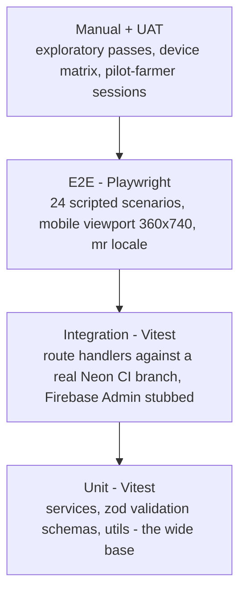

# 14 — Testing & QA Strategy

| Field | Value |
|---|---|
| **Status** | Draft |
| **Version** | 1.0 |
| **Owner** | Founder (Abhishek) |
| **Last updated** | 2026-07-04 |
| **Depends on** | [../00-foundation/README.md](../00-foundation/README.md) · [../01-prd/README.md](../01-prd/README.md) · [../04-business-rules/README.md](../04-business-rules/README.md) · [../06-user-flows/README.md](../06-user-flows/README.md) · [../08-api/README.md](../08-api/README.md) · [../12-security/README.md](../12-security/README.md) |

> This document owns **how PashuSetu is verified**: the test pyramid, environments and data, the E2E scenario catalog, non-functional and security test execution, the pilot-farmer UAT plan, bug triage, and the release gates. What is verified is owned elsewhere: [../04-business-rules/README.md](../04-business-rules/README.md) owns every rule (`BR-xxx`), [../08-api/README.md](../08-api/README.md) owns every contract (`API-xx`), [../12-security/README.md](../12-security/README.md) §10 owns the security test definitions (`ST-01`–`ST-12`), and [../06-user-flows/README.md](../06-user-flows/README.md) owns the screens (`S-xx`). If a test asserts behavior that contradicts those docs, the test is defective — never the rule. Everything here is sized for a **solo developer** (locked decision D7): automation does the regression work; the human does exploration, moderation-judgment checks, and UAT.

---

## 1. Strategy & test pyramid

### 1.1 Principles

1. **Test the rules, not the framework.** Every automated test exists to pin a `BR-xxx` rule, an `API-xx` contract row, or an NFR budget. No tests for Next.js internals, Prisma internals, or Firebase itself.
2. **The pyramid is real.** Most defects are caught by fast unit tests on services and zod schemas; integration tests prove the route handlers plus real Postgres behave; a small, ruthless E2E catalog proves the user-visible flows; manual effort is reserved for what machines cannot judge (photo quality, Marathi register, farmer usability).
3. **Deterministic by construction.** No sleeps, no real wall-clock time in business logic, no shared mutable environments: an injected clock (§2.6), a fresh Neon branch per CI run (§2.2), seeded factories (§2.3), Firebase fictional test numbers (§2.4).
4. **Marathi-first testing.** E2E and visual checks run in the `mr` locale by default — exactly as users see the app (D8, F-12 AC-1). English is the secondary snapshot set.
5. **Every S1/S2 bug becomes a test.** A severity-1/2 fix may not merge without a failing-then-passing regression test tagged `[regression]` (§7.3).

### 1.2 The four layers

| Layer | Tool | Scope | Runs against | Location in repo | Cadence |
|---|---|---|---|---|---|
| **Unit** | Vitest (node env) + v8 coverage | Pure services in `lib/services/**` (state-machine guards, expiry math, duplicate heuristic BR-029, phone-regex BR-065, WhatsApp URL builder BR-063, rate-limit windows), every zod schema in `lib/validation/**`, utils (cursor codec, INR formatting, i18n key parity) | In-memory; Prisma client mocked or unused; clock injected | `tests/unit/**` | Every push (CI) + pre-commit watch locally |
| **Integration** | Vitest (node env) invoking route handlers via `next-test-api-route-handler`-style harness | Every endpoint API-01…API-34: success path, **every specific error code its doc-08 table lists**, guards, side effects (`moderation_log`, `interest_events`, `notifications` rows), transactions and race behavior (BR-024 quota race, BR-045 3rd-report race, BR-033 double-approve) | **Real Neon CI branch** (§2.2); Firebase Admin SDK **stubbed with test tokens** (§2.4); R2 stubbed by default, real test bucket for the nightly ST-03 suite (§2.5); SMS provider stubbed | `tests/integration/**` | Every push (CI); nightly extended set (ST-03, ST-05, ST-06) |
| **E2E** | Playwright (Chromium) | The 24 scenarios of §3, driven through the real UI. Default project: **mobile viewport 360×740, DPR 3, touch, locale `mr`**; secondary desktop project 1366×768 for the admin screens S-18…S-23 | Full local `next build && next start` stack in CI wired to the CI Neon branch, the Firebase **test project** (real client SDK + fictional test phone numbers, §2.4), and the R2 test bucket; re-run against prod-like staging at the release gate (§8.2) | `tests/e2e/**` | Every push: smoke subset E2E-01/02/12/13; full catalog nightly and on every release candidate |
| **Manual / UAT** | Human + checklists | Moderation-judgment rules (BR-021, BR-042, BR-080–BR-082), device matrix (§4.3), exploratory pass per sprint, Marathi copy review (NFR-06), pilot-farmer UAT (§6) | Prod-like staging; production once at the launch gate (§8.2) | `docs/14-testing-qa/` checklists + UAT issue log | Each sprint (smoke) + release gate (full) |

**Firebase Admin mocking stance (integration):** token verification is isolated in one module (`lib/auth/verifyToken.ts`). When `NODE_ENV=test` **and** `TEST_AUTH=1`, it accepts tokens of the form `test-token:{firebaseUid}` and resolves them to seeded users; in any other environment that code path throws at startup, and the ST-08 CI gate additionally asserts `TEST_AUTH` is absent from all Vercel environment configs. E2E never uses this stub — it exercises the **real** Firebase client SDK and real Admin-SDK verification against the dedicated test project.

### 1.3 Coverage targets (CI-enforced)

| Target | Value | Enforcement |
|---|---|---|
| Service line coverage (`lib/services/**`) | **≥ 80% lines** | `vitest --coverage` v8 provider, `coverage.thresholds` in `vitest.config.ts`; build fails below |
| Validation schemas | **100% of exported zod schemas exercised** — every schema has at least one passing and one failing fixture | Registry test `tests/unit/validation/registry.spec.ts` iterates every export of `lib/validation/**` and fails if a schema has no fixture pair in `tests/fixtures/validation/` |
| API contract | Every endpoint API-01…API-34 has ≥ 1 integration test per success status **and** per specific error code listed in its doc-08 error table | Contract-coverage script `scripts/check-api-coverage.mjs` diffs test tags `[API-xx]` against the doc-08 endpoint index |
| Business rules | **Every BR-xxx rule classified A or A+P in §1.4 is covered by ≥ 1 automated test** | Traceability script `scripts/check-br-coverage.mjs` (§1.4) |
| State machine | Every transition T-01…T-12 exercised; every BR-032 disallowed transition returns 409 `INVALID_STATE_TRANSITION` | Generated suite per ST-10 ([../12-security/README.md](../12-security/README.md) §10) |
| i18n | `mr.json` / `en.json` key parity — a key in one catalog but not the other fails the build (F-12 AC-3) | CI script `scripts/check-i18n-parity.mjs` |
| E2E | All 24 §3 scenarios green on every release candidate | Playwright CI job, required check |

Coverage numbers are floors, not goals: a change that lowers services below 80% or orphans a schema is rejected by CI regardless of reviewer mood.

### 1.4 BR-to-test traceability

**Stance:** traceability is machine-checked, not tribal. Every automated test title carries the ids it pins in square brackets — e.g. `it("rejects the 11th active listing [BR-024][API-08]")`. CI runs `scripts/check-br-coverage.mjs`, which lists every `BR-xxx` id from doc 04, subtracts the ids found in test titles across `tests/**`, and **fails if any rule classified A or A+P below has zero tests**. Rules classified P (process/judgment) are excluded from the automated check and instead appear on the manual pre-release checklist (§8.2) and the moderation runbook.

Classification: **A** = fully automatable · **A+P** = automated core + a manual/process residue · **P** = process or human judgment only.

| BR id | Class | Primary automated coverage | Manual residue |
|---|---|---|---|
| BR-010 | A | INT: API-01 create, duplicate → `USER_ALREADY_EXISTS`, phone from token claims; E2E-01, E2E-02 | — |
| BR-011 | A | INT: role flags never gate any endpoint (part of ST-01 matrix) | — |
| BR-012 | A+P | ST-01: `/admin/*` 403 for non-admins; INT: no role-grant endpoint exists (deny-by-default route test) | Admin flag set manually per runbook |
| BR-013 | A | INT: `PROFILE_INCOMPLETE` 403 on every authed write for a profile-less user; E2E-01 | — |
| BR-014 | A | INT: ban transaction archives all active listings + single `BAN` log row; ST-11 banned-user sweep; E2E-10 | — |
| BR-015 | A+P | UNIT: anonymization script leaves no PII fields; INT: retained rows keep FK integrity | Deletion drill executed once pre-launch (runbook in doc 13) |
| BR-020 | A | INT: create guards (ACTIVE, profile, quota); E2E-01 | — |
| BR-021 | P | — | Moderation checklist: reject multi-animal text with `WRONG_CATEGORY` |
| BR-022 | A | UNIT: zod matrix exhaustive per species/sex incl. `COW`⇒`FEMALE`, milk fields on `MALE` → 422; INT: submit guard | — |
| BR-023 | A | UNIT: presign validation; INT + ST-03 attach/limits; E2E-07 | Photo *content* is BR-082 (P) |
| BR-024 | A | INT: 11th create → `LISTING_LIMIT_REACHED`; parallel-create race keeps count ≤ 10; E2E-08 | — |
| BR-025 | A | UNIT: 9/10/1000/1001 code points, Devanagari counting | — |
| BR-026 | A | UNIT: ₹499/₹500/₹10,00,000/₹10,00,001 bounds | — |
| BR-027 | A | INT: submit without declaration → 422 `DECLARATION_REQUIRED`; re-affirmation updates `declaration_at`; E2E-01/06 | — |
| BR-028 | A | INT: edit matrix per status incl. price-only exception and `EDIT_NOT_ALLOWED`; E2E-05/06/16 | — |
| BR-029 | A | UNIT: heuristic function boundaries at ±10% and 7 days; E2E-22 | Final duplicate call is admin judgment |
| BR-030 | A | UNIT: status enum closed set (schema test) | — |
| BR-031 | A | INT: one test per transition T-01…T-12 with guards + side effects | — |
| BR-032 | A | ST-10 state-machine fuzz: every disallowed edge → 409 | — |
| BR-033 | A | ST-01/ST-04 actor checks; INT: concurrent double-approve → second gets 409 | — |
| BR-034 | A | INT: visibility per status per caller; view-count increments (no dedup, never for owner/admin); ST-02 | — |
| BR-040 | A | INT: PENDING queue FIFO by `updated_at`; edit re-positions to back | — |
| BR-041 | A+P | INT: `GET /admin/stats` turnaround percentiles computed correctly | The 24 h SLA itself is operational (runbook, PRD §10) |
| BR-042 | P | — | Moderation checklist executed on every review; sampled in UAT window |
| BR-043 | A | INT: reject requires reason; `OTHER` requires free text; reason travels verbatim; E2E-03 | — |
| BR-044 | A | INT: resubmit clears `rejection_reason`, rejection counter increments; E2E-03 | 3+-rejection "repeat" badge reviewed manually |
| BR-045 | A | INT: 3rd OPEN report fires T-10 exactly once under two racing reports; E2E-09 | — |
| BR-046 | A | INT: every admin mutation writes exactly one log row in-transaction; no update/delete route exists | — |
| BR-050 | A | INT: reason enum, `OTHER` needs details, own-listing 403, non-APPROVED → `LISTING_NOT_REPORTABLE`; E2E-20 | — |
| BR-051 | A | ST-06: 6th report in 24 h → 429; E2E-20 | — |
| BR-052 | A | INT: resolve hides a still-APPROVED listing in the same transaction; dismiss never republishes; E2E-09 | Post-resolve reject/ban is admin judgment |
| BR-053 | A+P | INT: 5-dismissed-in-30-days surfacing query | Consequences are manual/graduated |
| BR-054 | P | — | Ban criteria are admin judgment; the ban *mechanics* are BR-014 (A) |
| BR-055 | A+P | INT: unban endpoint + `NTF-USER-UNBANNED` | Appeal handling via helpline is process |
| BR-060 | A | INT: public routes work with no token; E2E-12/23 | — |
| BR-061 | A | INT: anonymous contact/favorite/report → 401; E2E-11/12 | — |
| BR-062 | A | INT: phone only in API-21 response; event row written before reveal (transaction test); E2E-01 | — |
| BR-063 | A | UNIT: `wa.me` URL builder — E.164 digits, URL-encoding, `language_pref` prefill; E2E-17 | — |
| BR-064 | A | ST-06: 21st interest in 24 h → 429 + race at the boundary; E2E-19 | — |
| BR-065 | A | UNIT: regex corpus ASCII + Devanagari digits + spacing/`+91` variants → 422; soft-flag 8–9-digit runs; INT | Photo-overlay numbers are moderation (BR-082) |
| BR-066 | A | ST-02 phone-concealment crawl of payloads, SSR HTML, OG tags, sitemap | — |
| BR-070 | A | INT: idempotent add, 200-cap, own-listing 403, greyed non-APPROVED rows; E2E-11 | — |
| BR-071 | A | INT: each trigger writes its `NTF-*` row; interest-SMS cap 3/day/seller downgrades silently; UNIT: expiry-warning dedup | SMS template DLT approval is process (PRD §10) |
| BR-072 | A | INT: cron route transitions overdue listings, idempotent on re-run; E2E-04 | — |
| BR-073 | A | UNIT: clock-injected `expires_at` math; INT: T-03/T-08 always set +30 d, price-only edit never touches it | — |
| BR-074 | A | INT: renew from EXPIRED only, no re-moderation, `approved_at` unchanged; E2E-04 | — |
| BR-080 | A+P | UNIT: Devanagari/Latin/mixed input accepted by validation | Language judgment at moderation |
| BR-081 | P | — | Moderation checklist; prohibited-content spot checks each sprint |
| BR-082 | A+P | UNIT: photo-tips copy key exists in both catalogs | Photo content review is human |
| BR-090 | A | ST-06 + a sweep suite asserting every numbered limit in the BR-090 table (one test per row with an error code) | — |

---

## 2. Test environment & data

### 2.1 Environments used by tests

| Environment | Database | Firebase | R2 | Used for |
|---|---|---|---|---|
| Local dev | Personal Neon branch `dev-abhishek` | Test project `pashusetu-test` | Test bucket | Watch-mode unit/integration, local E2E |
| CI (GitHub Actions) | **Ephemeral Neon branch per run** (§2.2) | Test project (stub for INT, real SDK for E2E) | Test bucket (nightly ST-03) / stub | Every push: lint → typecheck → unit → integration → build → E2E smoke → budgets |
| Vercel preview | CI branch of that PR | Test project | Test bucket | Lighthouse CI advisory run per PR (§4.1) |
| Prod-like staging | Dedicated Neon branch `staging` | Test project (real OTP flows) | Test bucket | Full E2E catalog, device matrix, UAT (§6), release gate (§8.2) — provisioning owned by [../13-deployment/README.md](../13-deployment/README.md) |
| Production | Production Neon | Prod project `pashusetu-prod` | Prod buckets | **One** manual golden-path run with a real SMS at the launch gate (§8.2), ST-09 post-deploy header smoke — never automated writes otherwise |

### 2.2 Neon branch per CI run

Neon's copy-on-write branching gives every CI run a **real, isolated Postgres** in seconds — no Docker Postgres drift, identical extensions and behavior to production (D2).

- **Create:** first CI step runs `neonctl branches create --name ci-$GITHUB_RUN_ID --parent staging` and exports the returned connection string as `DATABASE_URL` for all later jobs. Parenting off `staging` means the branch starts with the production-shaped schema and seed reference data (36 districts, breed catalog, the seeded System admin — BR-046).
- **Migrate + seed:** `prisma migrate deploy` (proves pending migrations apply cleanly to a prod-shaped schema on every push) then `prisma db seed -- --profile=test` loads the test fixture baseline (§2.3).
- **Destroy:** teardown step with `if: always()` runs `neonctl branches delete ci-$GITHUB_RUN_ID`. A scheduled nightly job additionally deletes any `ci-*` branch older than 24 h (crash insurance so orphaned branches never eat the Neon quota).
- **Isolation rule:** integration tests never share rows — each test file creates its own actors via factories; no test truncates shared reference tables.

### 2.3 Seed & factories

Factories live in `tests/factories/` and write via Prisma directly (fast, no API coupling); tests that verify creation itself go through the API instead. Faker is seeded with the fixed seed `20260704` so failures reproduce byte-for-byte. Name/village pools are real Marathi Devanagari samples (consistent with doc 08 examples) so every layer exercises Unicode paths.

| Factory | Variants (each a one-line call) |
|---|---|
| `userFactory` | `active` (default, complete profile) · `profileless` (Firebase uid only, no row) · `incomplete` (row without district) · `admin` (`is_admin = true`) · `banned` · `seller-at-quota` (10 active listings attached) |
| `listingFactory` | One per status with invariants enforced: `draft` · `pending` (`declaration_accepted = true`, `declaration_at` set) · `approved` (`approved_at`, `expires_at = approved_at + 30 d`) · `rejected` (BR-043 reason) · `expired` (`expires_at` in the past) · `sold` (`sold_at`) · `archived`. Options: `expiresInDays`, `photos: n` (0–5), `priceInr`, `species` |
| `imageFactory` | Attached `listing_images` row with `sort_order`, fake variant URLs; `real: true` uploads a 50 KB fixture JPEG through the actual presign flow (ST-03 only) |
| `interestEventFactory` | `type` CALL/WHATSAPP/INTEREST; `bulk(n, withinHours)` for rate-limit setups (BR-064) |
| `reportFactory` | OPEN/RESOLVED/DISMISSED; `openReportsOnListing(listing, n)` for BR-045 setups |
| `notificationFactory` | Any `NTF-*` type, SENT/READ, INAPP/SMS |
| `moderationLogFactory` | Any action, defaults to the seeded System admin |

Fixture images: `tests/fixtures/images/` — `cow-800x600.jpg` (valid), `cow-exif-gps.jpg` (ST-07), `over-5mb.jpg`, `not-an-image.html` renamed `.jpg` (magic-bytes case), `cow.webp`, `cow.png`, `cow.heic` (reject case).

### 2.4 Firebase test phone numbers (no real SMS in CI)

Configured in the **`pashusetu-test`** Firebase project console (Authentication → Sign-in method → Phone → *Phone numbers for testing*; Firebase caps this list at 10 entries). Test numbers never send SMS, never consume quota, and work headlessly in Playwright. The fictional range and the fixed OTP are frozen here:

| Persona | Number | OTP | Seeded as |
|---|---|---|---|
| Farmer 1 — रमेश (primary seller) | `+91 99999 90001` | `246810` | `active`, Satara district |
| Buyer 1 — सुनील (primary buyer) | `+91 99999 90002` | `246810` | `active`, Kolhapur district |
| Buyer 2 (reporter) | `+91 99999 90003` | `246810` | `active` |
| Buyer 3 (reporter) | `+91 99999 90004` | `246810` | `active` |
| Ban target | `+91 99999 90005` | `246810` | `active`, owns listings |
| Fresh registrant (created during E2E, deleted in teardown) | `+91 99999 90006` | `246810` | none |
| Quota seller (10 active) | `+91 99999 90007` | `246810` | `seller-at-quota` |
| Rate-limit buyer | `+91 99999 90008` | `246810` | `active` + 20 interest events |
| Admin | `+91 99999 90010` | `246810` | `admin` |

The deliberately wrong OTP used in negative tests is `000000` (never a configured code). The production project has **zero** test numbers configured — verified on the §8.2 launch checklist.

### 2.5 R2 test bucket

- Buckets `pashusetu-test-uploads` (private originals) and `pashusetu-test-public` (variants) mirror the production topology ([../12-security/README.md](../12-security/README.md) §6.4).
- **Lifecycle rule: delete every object older than 1 day** — the buckets are self-cleaning; tests never depend on pre-existing objects.
- Unit and default integration runs stub the S3 client; the nightly ST-03 presign-abuse suite and all E2E photo uploads hit the real test bucket (real presign, real `PUT`, real magic-bytes re-check).

### 2.6 Deterministic time (clock injection)

- All business-time reads go through a `Clock` interface (`{ now(): Date }`) injected into services; production wires `systemClock`, tests wire `fixedClock("2026-07-04T00:00:00.000Z")` and `advanceDays(n)`.
- An ESLint `no-restricted-syntax` rule bans `new Date()` and `Date.now()` inside `lib/services/**` so expiry math (BR-073), warning windows (BR-071), and rolling rate-limit windows (BR-090) are always testable at exact boundaries. DB column defaults (`created_at`) may still use DB time — they are never compared against business deadlines.
- E2E cannot warp a running server's time, so time-dependent E2E scenarios (E2E-04) instead **seed timestamps via factories and invoke the protected cron route directly** (`Authorization: Bearer $CRON_SECRET`, per BR-072 / [../09-backend/README.md](../09-backend/README.md)) — same code path production Vercel Cron takes, zero flakiness.

### 2.7 Real vs stubbed — the one table

| Dependency | Unit | Integration | E2E (CI/staging) |
|---|---|---|---|
| Postgres | not used (pure functions) | **real** Neon CI branch | **real** Neon branch |
| Firebase Admin verify | stub | **stub test tokens** (§1.2) | **real** (test project) |
| Firebase client OTP | n/a | n/a | **real SDK + test numbers** (§2.4) |
| Cloudflare R2 | S3 client stub | stub; **real test bucket** nightly (ST-03) | **real test bucket** |
| SMS provider (MSG91) | stub | recording stub — asserts template id + payload, sends nothing | dry-run env flag; rows written, nothing sent. Exactly **one real SMS** ever sent by QA: the §8.2 production golden-path run |
| Google Places | stub incl. timeout path (F-02 AC-3) | stub | disabled by env (field degrades to free text — the tested fallback) |
| Sentry | disabled | disabled | disabled in CI, enabled on staging |
| Time | injected clock | injected clock | factory timestamps + direct cron invocation |

---

## 3. E2E scenario catalog (Playwright)

**Conventions.** Default project = Chromium, viewport **360×740**, DPR 3, touch enabled, locale `mr`, timezone `Asia/Kolkata`; admin steps run in the desktop project (1366×768). Personas map to §2.4 numbers; distinct actors = distinct browser contexts in the same test. Every scenario title carries its `[BR-xxx]` tags for §1.4 traceability. Scenarios are independent — each seeds its own data via factories and cleans up in teardown. "Search shows/omits X" is always asserted through the real UI **and** a direct `GET /api/v1/listings` probe.

#### E2E-01 — Golden path: register → list with 3 photos → approve → search → call → mark sold

- **Preconditions:** fresh registrant number `+91 99999 90006` has no `users` row; buyer 1 and admin seeded; no APPROVED Gir cow listings in Satara.
- **Steps:**
  1. Farmer context (anonymous): open `/` → S-01 language pick shows with मराठी pre-selected → continue.
  2. Tap Sell tab → login wall S-02 → enter `+91 99999 90006`, "OTP पाठवा" → S-03 → enter `246810` → S-04 profile setup (name "विठ्ठल जाधव", district सातारा) → save.
  3. S-10 wizard: species गाय + breed गीर (S-10a) → sex/age/milk details (S-10b) → upload **3 photos** via presign flow (S-10c) → price ₹65,000, negotiable, village (S-10d) → S-10e shows the full BR-027 declaration text → tick checkbox → "तपासणीसाठी पाठवा".
  4. Assert S-11 tab तपासणीत shows the listing with the 24 h SLA copy; API probe: status `PENDING`, `declarationAccepted: true`, `declarationAt` set.
  5. Admin context: S-19 queue shows the listing (FIFO) → open S-20 → approve with `expectedUpdatedAt`.
  6. Assert `approvedAt` set, `expiresAt` = approval time + 30 days; farmer's S-14 bell shows `LISTING_APPROVED` in-app row.
  7. Buyer context (anonymous): S-06 with filters species=गाय + district=सातारा → card visible with thumbnail, price "₹65,000", district → open S-07.
  8. Tap "फोन करा" → login sheet with "विक्रेत्याशी संपर्क करण्यासाठी लॉगिन करा" → OTP login as buyer 1 → **the call action resumes automatically** → `tel:+919999990006` link invoked.
  9. Assert one `interest_events` row (type `CALL`, buyer 1, this listing) exists and the phone appeared **only** in the API-21 response (page HTML re-scanned for phone patterns — none).
  10. Farmer: S-11 → "विकले गेले" on the listing → confirm.
- **Expected:** listing status `SOLD` with `soldAt`; the S-06 search (and API probe) no longer contains it; its URL shows the S-07 sold banner "विकले गेले" (API-07 `details.publicState = "SOLD"`); edit/renew actions absent.
- **Screens:** S-01, S-02, S-03, S-04, S-05, S-06, S-07, S-10a–e, S-11, S-14, S-19, S-20.
- **BR ids:** BR-010, BR-013, BR-020, BR-022, BR-023, BR-027, BR-031 (T-01/T-02/T-03/T-06), BR-034, BR-040, BR-060, BR-061, BR-062, BR-066, BR-071, BR-073.

#### E2E-02 — OTP wrong code ×3 + resend cooldown

- **Preconditions:** anonymous context; test number `+91 99999 90002`.
- **Steps:** open login → send OTP → enter `000000` three times → then wait out the resend cooldown → resend → enter `246810`.
- **Expected:** each wrong attempt shows the inline error "चुकीचा कोड. पुन्हा प्रयत्न करा." without a page reload; the attempt counter increments; "पुन्हा OTP पाठवा" stays disabled during the 30 s cooldown with a visible countdown (S-03 spec, doc 06); after resend the correct code logs in normally. No real SMS was sent at any point (test number).
- **Screens:** S-02, S-03. **BR ids:** BR-010, BR-090 #1 (OTP is 100% Firebase client SDK; no backend OTP endpoint is ever called — asserted via network log).

#### E2E-03 — Rejected with reason → edit → resubmit → approve

- **Preconditions:** farmer 1 owns a PENDING listing (factory); admin seeded.
- **Steps:** admin rejects with reason `POOR_PHOTOS` (+ `expectedUpdatedAt`) → farmer opens S-14 notification `LISTING_REJECTED` → S-11 नाकारलेल्या tab shows reason "फोटो स्पष्ट नाहीत" verbatim with the "दुरुस्त करून पुन्हा पाठवा" CTA → S-12 edit replaces one photo → resubmit with declaration re-tick → admin approves.
- **Expected:** T-04 then T-05 then T-03 in `moderation_log`; resubmission cleared `rejectionReason`, re-entered the queue FIFO by resubmit time, `declarationAt` refreshed (BR-027); final status APPROVED with fresh 30-day `expiresAt`.
- **Screens:** S-11, S-12, S-14, S-19, S-20. **BR ids:** BR-043, BR-044, BR-027, BR-031 (T-04/T-05/T-03), BR-040.

#### E2E-04 — Expiry warning → expiry → one-tap renew

- **Preconditions:** farmer 1 owns an APPROVED listing with `expires_at = now + 2 days` (factory).
- **Steps:** invoke the protected cron route (§2.6) → assert `NTF-EXPIRY-WARNING` row created once → invoke cron **again** → assert no duplicate warning (BR-071 dedup) → factory sets `expires_at = now − 1 h` → invoke cron → farmer opens S-11 मुदत संपलेल्या tab → taps "नूतनीकरण करा".
- **Expected:** after the third cron run the listing is EXPIRED, out of search, with `NTF-LISTING-EXPIRED` in-app row; renew returns it to APPROVED with `expiresAt` ≈ now + 30 days, `approvedAt` unchanged, **no re-moderation** (admin queue empty), and it re-appears in S-06 search instantly.
- **Screens:** S-11, S-14, S-06. **BR ids:** BR-071, BR-072, BR-073, BR-074, BR-031 (T-07/T-08).

#### E2E-05 — Price-only edit keeps APPROVED

- **Preconditions:** farmer 1 owns an APPROVED listing at ₹65,000, `expires_at` known.
- **Steps:** S-12 edit → change only price to ₹60,000 (and toggle negotiable) → save.
- **Expected:** status stays APPROVED with **unchanged** `expiresAt`; S-07 public detail shows ₹60,000 immediately; admin queue receives nothing; no re-declaration asked.
- **Screens:** S-11, S-12, S-07. **BR ids:** BR-028, BR-073.

#### E2E-06 — Description edit sends APPROVED back to PENDING

- **Preconditions:** same as E2E-05.
- **Steps:** S-12 edit description → warning banner about re-review is visible before saving → save requires the declaration re-affirmation → confirm.
- **Expected:** T-09 fires: status PENDING, public URL now shows the unavailable state, listing gone from search, admin `NTF-ADMIN-PENDING` badge increments, `declarationAt` refreshed; re-approval later grants a fresh 30-day `expiresAt` (T-03).
- **Screens:** S-12, S-07, S-19. **BR ids:** BR-027, BR-028, BR-031 (T-09), BR-034.

#### E2E-07 — Photo limits: max 5, cover ordering

- **Preconditions:** farmer 1 mid-wizard on a DRAFT.
- **Steps:** upload 5 photos on S-10c → UI hides/disables the add control → direct API probe attaches a 6th → delete photo #2 in the UI → add one more → drag-reorder so a different photo is first.
- **Expected:** the 6th attach returns 409 `PHOTO_LIMIT_EXCEEDED`; after delete the add control returns; final `imageOrder` persists with `sortOrder 0` as cover on the S-07 card/thumbnail; per-photo progress and retry affordances appeared during upload.
- **Screens:** S-10c, S-07. **BR ids:** BR-023, BR-090 #7.

#### E2E-08 — Max 10 active listings

- **Preconditions:** quota seller `+91 99999 90007` seeded with 10 active listings (mixed DRAFT/PENDING/APPROVED/REJECTED/EXPIRED).
- **Steps:** open S-11 → quota meter shows "१०/१०" → tap "+ नवीन जाहिरात" → observe the friendly block (S-10 spec) → direct API probe `POST /listings` → mark one listing sold → retry creation.
- **Expected:** API probe returns 409 `LISTING_LIMIT_REACHED` with the BR-024 Marathi copy; after mark-sold (terminal status frees a slot) creation succeeds and the meter shows "१०/१०" → "९/१०" → "१०/१०".
- **Screens:** S-11, S-10. **BR ids:** BR-024, BR-030 (quota counts non-terminal only).

#### E2E-09 — Three reports auto-hide, admin restores

- **Preconditions:** an APPROVED listing by farmer 1; buyers 1–3 logged-in contexts.
- **Steps:** buyer 1 reports `FAKE`, buyer 2 reports `WRONG_INFO` → listing still public → buyer 3 reports `SOLD_ALREADY` → admin opens S-21 (auto-hidden group pinned) → dismisses all three → re-approves via S-20.
- **Expected:** on the 3rd OPEN report the listing flips to PENDING and its public URL/search visibility drops instantly (T-10); `moderation_log` has exactly one `AUTO_HIDE` row under the System admin; admin got `NTF-ADMIN-AUTOHIDE`, seller got `NTF-LISTING-HIDDEN` (no reporter details); seller's S-11 shows the "तक्रारींमुळे तपासणीसाठी थांबवले आहे" note; after dismiss+re-approve the listing is APPROVED with a fresh 30-day `expiresAt` (T-03 per doc 04 — a human always re-approves, never automatic).
- **Screens:** S-07, S-17, S-21, S-20, S-11. **BR ids:** BR-045, BR-046, BR-050, BR-052, BR-071, BR-031 (T-10).

#### E2E-10 — Ban archives listings; banned account blocked

- **Preconditions:** ban target `+91 99999 90005` owns 1 APPROVED + 1 DRAFT listing and is logged in on a second context.
- **Steps:** admin bans via S-22 with a written reason → banned user's context performs a write (favorite tap) and then navigates the app → admin unbans → user retries login/browse.
- **Expected:** both listings become ARCHIVED atomically; exactly one `BAN` `moderation_log` row; the APPROVED listing's public URL 404s and it leaves search; the banned user's API calls return 403 `USER_BANNED` while `GET /users/me` still returns 200 with `"status": "BANNED"` and the app shows the full-screen banned notice with the helpline; SMS row `NTF-USER-BANNED` recorded (dry-run). After unban the account browses and creates again, but the archived listings are **not** restored (terminal).
- **Screens:** S-22, S-07, S-05. **BR ids:** BR-014, BR-031 (T-12), BR-032, BR-055 (unban mechanics), BR-071.

#### E2E-11 — Favorites: login wall, toggle consistency, greyed sold rows

- **Preconditions:** two APPROVED listings; buyer 1 seeded but logged out.
- **Steps:** anonymous heart tap on an S-06 card → login sheet → OTP login → assert the intended favorite applied automatically → open S-07 of the same listing (heart filled) → S-13 shows it → unfavorite from S-13 → re-favorite → double-tap the heart rapidly → seller marks that listing sold → buyer revisits S-13.
- **Expected:** heart state is consistent across S-06/S-07/S-13; rapid double-tap converges to the last intent (idempotent API); the sold favorite stays listed, greyed, with badge "विकले गेले" and disabled contact; removing it works.
- **Screens:** S-06, S-07, S-13, S-02/S-03. **BR ids:** BR-061, BR-070.

#### E2E-12 — Anonymous browse is free; contact is walled; phone never in HTML

- **Preconditions:** fresh anonymous context; seeded APPROVED listings.
- **Steps:** browse S-05 → S-06 with filters → open S-07 — assert **zero** login prompts so far → scan the SSR HTML source of S-06 and S-07 for phone patterns (E.164 / 10-digit / Devanagari digits) → tap "व्हॉट्सॲप" → login wall → complete OTP → action resumes.
- **Expected:** all reads worked logged-out (BR-060); no phone pattern anywhere in public HTML or JSON (BR-066); after login the `wa.me/919…?text=` URL opens with the BR-063 Marathi prefill and one `interest_events` row (type `WHATSAPP`) exists.
- **Screens:** S-05, S-06, S-07, S-02, S-03. **BR ids:** BR-060, BR-061, BR-062, BR-063, BR-066.

#### E2E-13 — Marathi default + language switch persistence

- **Preconditions:** fresh context with `Accept-Language: en-US`.
- **Steps:** open `/` → assert UI is Marathi despite the English browser locale (deliberate override, F-12 AC-1) → switch to English via S-16 → assert instant re-render → reload → still English (localStorage) → log in as buyer 1 → assert `PATCH /users/me` synced `languagePref: "EN"` → open a second context, log in as the same user → UI is English from the server value.
- **Expected:** as stated per step; number formatting stays Latin-digit Indian grouping ("₹6५,000" never appears — asserted "₹65,000") in both locales.
- **Screens:** S-01, S-05, S-15, S-16. **BR ids:** BR-010 (`language_pref` default MR); D8/F-12 behaviors.

#### E2E-14 — Empty search results + one-tap filter reset

- **Preconditions:** seed guarantees zero SHEEP listings in Gadchiroli district.
- **Steps:** S-06 apply species=मेंढी + district=गडचिरोली → observe empty state → tap "फिल्टर काढा".
- **Expected:** empty state shows "या शोधात जनावरे सापडली नाहीत. फिल्टर बदलून पाहा." with the clear-filters action; after reset the URL query drops the filters and the default result feed renders with items; no error state, no crash.
- **Screens:** S-06. **BR ids:** BR-034 (only APPROVED searched), BR-090 #12 (pagination defaults intact after reset).

#### E2E-15 — Slow-network browse under throttled 3G (budget assertions)

- **Preconditions:** CDP network emulation: Fast 3G — 1.6 Mbps down / 750 Kbps up / 150 ms RTT — plus 4× CPU throttle (the NFR-01 reference environment); cold cache.
- **Steps:** navigate `/` → S-06 with a filter → an S-07 detail; collect Web-Vitals via injected PerformanceObserver; record transfer sizes from the network log; repeat the S-07 navigation once (warm, SW shell cached).
- **Expected:** cold: search and detail LCP ≤ 4.0 s, TTI ≤ 5.0 s, CLS ≤ 0.1, JS transfer ≤ 200 KB gzip (NFR-01); loading skeletons render (never a blank screen or spinner-only); below-fold images lazy-load (no offscreen image requests before scroll). Warm repeat view: **LCP < 2.5 s** with the cached shell (§4.1 repeat-view budget).
- **Screens:** S-05, S-06, S-07. **BR ids:** — (NFR-01/NFR-02/NFR-11 budgets; listed here because the catalog is the enforcement point).

#### E2E-16 — SOLD is terminal: no edit, no renew, idempotent mark-sold

- **Preconditions:** farmer 1 owns an APPROVED listing.
- **Steps:** mark sold from S-11 → tap the (stale) mark-sold control again via a second tab → attempt edit and renew via direct API probes → open the public URL.
- **Expected:** second mark-sold is a 200 no-op (doc 08 §1.7); `PATCH` returns 409 `EDIT_NOT_ALLOWED`; renew returns 409 `INVALID_STATE_TRANSITION`; S-11 shows no edit/renew actions on the sold row; public URL renders the sold banner.
- **Screens:** S-11, S-07. **BR ids:** BR-028, BR-032.

#### E2E-17 — WhatsApp deep link contact

- **Preconditions:** buyer 1 logged in with `languagePref: "MR"`; APPROVED listing by farmer 1.
- **Steps:** S-07 → tap "व्हॉट्सॲप" → capture the navigation target.
- **Expected:** one `interest_events` row (type `WHATSAPP`); navigation to `https://wa.me/91XXXXXXXXXX?text=…` where the decoded prefill equals the BR-063 Marathi template with this listing's species/breed/price/URL; the phone number is also shown in the confirmation toast as the manual-dial fallback.
- **Screens:** S-07. **BR ids:** BR-062, BR-063.

#### E2E-18 — Send Interest notifies the seller; bell flow

- **Preconditions:** buyer 1 logged in; farmer 1 logged in on a second context; APPROVED listing.
- **Steps:** buyer taps "आवड कळवा" → assert buyer sees "विक्रेत्याला कळवले आहे" plus the phone for manual dialing → farmer refreshes → bell badge shows 1 → open S-14 → tap the item.
- **Expected:** `interest_events` row (type `INTEREST`); farmer has an `INTEREST_RECEIVED` in-app row carrying the buyer's first name only, plus one dry-run SMS row (within the 3/day/seller cap); tapping marks it read (unread count decrements) and deep-links to the listing.
- **Screens:** S-07, S-14. **BR ids:** BR-062, BR-071.

#### E2E-19 — Interest rate limit 20/day

- **Preconditions:** rate-limit buyer `+91 99999 90008` seeded with 20 interest events inside the current 24 h window (factory `bulk`).
- **Steps:** tap any contact action on an APPROVED listing.
- **Expected:** 429 `RATE_LIMITED` with `details.retryAfterSeconds`; UI shows "आज खूप विक्रेत्यांशी संपर्क झाला आहे. कृपया उद्या पुन्हा प्रयत्न करा."; **no** `interest_events` row was added and **no** phone was revealed.
- **Screens:** S-07. **BR ids:** BR-064, BR-090 #3.

#### E2E-20 — Report flow: duplicate blocked, OTHER needs details, 5/day cap

- **Preconditions:** buyer 1 logged in; several APPROVED listings; factory pre-seeds 4 reports by buyer 1 today.
- **Steps:** report listing X with `SOLD_ALREADY` + details (this is report #5 today) → attempt a second report on X → open the report sheet on listing Y, choose इतर (OTHER) and try to submit without details → then submit with details.
- **Expected:** first report succeeds ("तक्रार नोंदवली. आम्ही तपासू."); the duplicate returns 409 `REPORT_ALREADY_EXISTS` ("तुमची तक्रार आधीच नोंदलेली आहे"); OTHER without details is blocked; the 6th report of the day returns 429 `RATE_LIMITED`; reporter identity appears nowhere in any seller-visible surface.
- **Screens:** S-07, S-17. **BR ids:** BR-050, BR-051, BR-090 #4/#5.

#### E2E-21 — Draft autosave & resume

- **Preconditions:** farmer 1 logged in, no drafts.
- **Steps:** start the wizard, complete S-10a and S-10b, then kill the context (simulated app kill) → new context, log in → S-11 अपूर्ण tab → resume.
- **Expected:** the DRAFT persisted server-side with the step-1/2 values intact; the wizard resumes at the first incomplete step; completing photos, price and declaration submits it to PENDING normally.
- **Screens:** S-10a–e, S-11. **BR ids:** BR-020, BR-028 (DRAFT freely editable), BR-031 (T-01/T-02).

#### E2E-22 — Duplicate heuristic warns the admin, never blocks

- **Preconditions:** farmer 1 submitted listing A (COW, ₹60,000) two days ago (factory); now submits listing B (COW, ₹63,000 — within 10%, within 7 days).
- **Steps:** submit B → admin opens S-19/S-20 for B.
- **Expected:** the queue row shows the "संभाव्य डुप्लिकेट" badge and `moderation.duplicateOfListingIds` links listing A; approval of B is **not** blocked (advisory only); a control listing at ₹80,000 shows no badge.
- **Screens:** S-19, S-20. **BR ids:** BR-029.

#### E2E-23 — Shareable filtered URL + SSR without JavaScript

- **Preconditions:** seeded APPROVED listings matching `species=COW&districtId=<Satara>&maxPrice=80000`.
- **Steps:** open that exact deep link in a fresh anonymous context → assert filters pre-applied and results match → open an S-07 detail deep link in a context with **JavaScript disabled**.
- **Expected:** the search URL reproduces the exact filtered, server-rendered view (F-04 AC-6); with JS disabled the detail page still shows photos as ``, the attribute table, price, and a Marathi `<title>`/meta description (NFR-09); contact buttons degrade to login links; no phone anywhere in the markup.
- **Screens:** S-06, S-07. **BR ids:** BR-060, BR-066.

#### E2E-24 — PWA offline shell

- **Preconditions:** context has visited `/` and one S-07 detail online (service worker installed, shell + visited pages cached).
- **Steps:** `context.setOffline(true)` → reload `/` → navigate to the previously visited detail → attempt a favorite tap → navigate to a never-visited listing URL.
- **Expected:** the shell renders with the banner "इंटरनेट नाही — जुनी माहिती दाखवत आहोत"; the visited detail renders from cache; the write is disabled with a clear message (no silent queue — NFR-11); the un-cached URL shows the branded offline page, never the browser error page.
- **Screens:** S-05, S-07. **BR ids:** — (NFR-11; D9).

---

## 4. Non-functional testing

### 4.1 Performance — Lighthouse CI budgets

Reference environment (identical to PRD NFR-01): Moto G-class emulation, 4× CPU throttle, Fast 3G (1.6 Mbps / 750 Kbps / 150 ms RTT). Runner: `@lhci/cli` in GitHub Actions — **advisory on every PR** (against the Vercel preview URL) and **blocking on every production deploy**. Three runs per page, median asserted. Audited pages (public, seeded): `/` (S-05), `/listings?species=COW&districtId=<Satara>` (S-06), `/listings/{seed-id}` (S-07).

| Budget (mobile) | Home S-05 | Search S-06 | Detail S-07 |
|---|---|---|---|
| Lighthouse performance score | **≥ 80** | **≥ 80** | **≥ 80** |
| LCP — cold load | ≤ 4.0 s | ≤ 4.0 s | ≤ 4.0 s |
| LCP — repeat view with cached shell | **< 2.5 s** | **< 2.5 s** | **< 2.5 s** |
| TTI | ≤ 5.0 s | ≤ 5.0 s | ≤ 5.0 s |
| CLS | ≤ 0.1 | ≤ 0.1 | ≤ 0.1 |
| JS shipped (gzip) | ≤ 200 KB | ≤ 200 KB | ≤ 200 KB |
| Total first load incl. above-fold images (gzip) | ≤ 500 KB | ≤ 500 KB | ≤ 550 KB |

- The **repeat-view LCP < 2.5 s** budget is measured by the Playwright perf script (second navigation in the same context with the service worker active — E2E-15), since Lighthouse measures cold loads; both numbers gate the release (§8.2).
- The auth-gated create form (S-10) is covered by a `size-limit` bundle job asserting its route chunk keeps total JS ≤ 250 KB gzip (NFR-01) instead of a Lighthouse run.
- Image variant budgets (thumb ≤ 40 KB, card ≤ 90 KB, detail ≤ 180 KB — NFR-02) are asserted by a unit test on the image pipeline output for the fixture photos.

### 4.2 Marathi rendering checks

| Check | How | Gate |
|---|---|---|
| Devanagari font loads | Network assertion: self-hosted Noto Sans Devanagari subset WOFF2 ≤ 60 KB requested with `font-display: swap` (NFR-02); `document.fonts.check('17px "Noto Sans Devanagari"', 'ऱ्हा')` returns true after load | E2E smoke, every push |
| No tofu / no replacement chars | A hidden glyph-audit page renders every string value from `mr.json`; script asserts no `U+FFFD` in the DOM and per-string canvas measurement differs from the notdef box width (real glyphs present), including conjuncts (क्ष, ज्ञ, ऱ्या) and the ॲ in "व्हॉट्सॲप" | Nightly |
| String-expansion overflow at 360 px | In the `mr` visual-snapshot run: assert `document.documentElement.scrollWidth ≤ window.innerWidth` on every cataloged screen, and no button/label element has `scrollWidth > clientWidth` (clipped text) | Nightly + release gate |
| 130% system font size | Repeat the overflow sweep with font scale 1.3 (NFR-07) | Release gate |
| Copy register | Native Marathi speaker reviews all `mr.json` strings against the doc 10 style guide (simple, rural-friendly, जनावर not पशुधन) | Once before beta (NFR-06, PRD §10) |

Visual snapshots are captured **Marathi-first**: the `mr` locale is the primary snapshot set; `en` is secondary. A layout that only fits English fails the build.

### 4.3 Device matrix (chosen)

Emulated Playwright (360×740) runs in CI on every push; the physical matrix below is a **manual smoke per sprint** and a **full manual regression at each release gate**. The two low-end phones are purchased project devices and double as UAT loaners (§6).

| Tier | Device | OS / browser | RAM | What runs on it |
|---|---|---|---|---|
| Low-end 1 | Xiaomi Redmi 9A | Android 10, Chrome m110 (deliberately not updated) | 2 GB | Sprint smoke: E2E-01 script by hand on cellular data; PWA install; photo upload from camera |
| Low-end 2 | Samsung Galaxy A03 Core | Android 11, Chrome m120 | 2 GB | Sprint smoke (alternates flows with device 1); 130% font-size pass |
| Mid | Redmi Note 12 | Android 13, latest stable Chrome | 4 GB | Full manual regression at release gate; Marathi rendering spot checks |
| Desktop | Chrome latest, 1366×768, mouse+keyboard | — | — | Admin panel S-18…S-23 manual pass + Playwright desktop project |

### 4.4 PWA checks

- **Installability:** Lighthouse PWA installability audit passes on every production deploy (manifest name "PashuSetu — पशुसेतू", maskable 192/512 icons, theme color — NFR-11).
- **Custom install prompt timing:** E2E asserts the prompt appears on the second session, never the first (NFR-11).
- **Offline shell:** E2E-24 automated; additionally verified on a real device in airplane mode at the release gate (PRD §10): shell + offline banner, cached listings render, writes disabled with a clear message, cold start shows the branded offline page — never the browser error.
- **Service-worker update:** deploy a build to staging over an open old client; assert the new version activates on next navigation within one reload cycle (manual, each release).

### 4.5 Accessibility

- **Automated:** `@axe-core/playwright` runs on S-01, S-05, S-06, S-07, S-10a–e, S-11, S-13, S-14, S-15 in the `mr` locale; **zero serious/critical violations** is a required check. A geometry script asserts every interactive element ≥ 48×48 px with ≥ 8 px spacing (NFR-07).
- **Manual pass (release gate, per NFR-07):** every primary action pairs icon + text (never icon-only); focus order follows visual order with a visible focus ring; text contrast ≥ 4.5:1 spot-checked against the doc 10 tokens; one primary action per screen; all images carry alt text; the app remains fully usable at 130% system font size (§4.2).

---

## 5. Security test cases

Security test **definitions** are owned by [../12-security/README.md](../12-security/README.md) §10 (ST-01…ST-12); this section owns their **execution and the release-gate spot checks**. Cadence below restates doc 12 for scheduling; on any conflict doc 12 wins.

| Doc 12 id | Suite | Where it runs from this doc's pipeline |
|---|---|---|
| ST-01 | Full authz matrix (all 34 endpoints × anon/user/owner/admin) | Integration, every push |
| ST-02 | Phone-concealment crawl (payloads, SSR HTML, OG, sitemap) | Integration + E2E-12/23 assertions, every push |
| ST-03 | Presign abuse suite (real R2 test bucket) | Nightly |
| ST-04 | IDOR probes | Integration (inside ST-01 fixtures), every push |
| ST-05 | XSS corpus render checks | Playwright, nightly |
| ST-06 | Rate-limit suite incl. boundary races | Integration, nightly |
| ST-07 | EXIF strip check | Unit, every push |
| ST-08 | Secrets gates (gitleaks + bundle grep) | CI job, every push |
| ST-09 | Security-header verification | Post-deploy smoke, every deploy |
| ST-10 | State-machine fuzz (BR-032) | Integration, every push |
| ST-11 | Banned-user sweep | Integration, every push |
| ST-12 | Dependency & injection audit | CI job, every push |

### 5.1 Authz spot-test matrix — every role × 8 sensitive endpoints

The full ST-01 matrix runs in CI; this **8-endpoint spot test** is additionally executed as a curl script against the prod-like environment at every release gate (and once against production at launch, read-only rows plus a sacrificial listing). Expected cells come verbatim from doc 12 §4; roles: **Anon**, **User** (authenticated non-owner), **Owner** (the resource's seller/recipient), **Admin**, **Banned**.

| Endpoint | Anon | User | Owner | Admin | Banned |
|---|---|---|---|---|---|
| `PATCH /listings/{id}` | 401 | 403 `FORBIDDEN` | 200 | 403 `FORBIDDEN` | 403 `USER_BANNED` |
| `POST /listings/{id}/mark-sold` | 401 | 403 | 200 | 403 | 403 `USER_BANNED` |
| `POST /uploads/presign` | 401 | 403 | 200 | 403 | 403 `USER_BANNED` |
| `DELETE /listings/{id}/images/{imageId}` | 401 | 403 | 204 | 403 | 403 `USER_BANNED` |
| `POST /listings/{id}/interest` | 401 | 201 | 403 own listing | 201 as buyer | 403 `USER_BANNED` |
| `POST /admin/listings/{id}/approve` | 401 | 403 | 403 | 200 | 403 `USER_BANNED` |
| `POST /admin/users/{id}/ban` | 401 | 403 | 403 | 200 | 403 `USER_BANNED` |
| `GET /admin/audit-log` | 401 | 403 | 403 | 200 | 403 `USER_BANNED` |

Notes: an admin editing content is denied by design (BR-028 — admins moderate, never edit); "Owner" on admin routes means a non-admin seller of the addressed listing. Every 403/401 body must carry the exact error code (`UNAUTHENTICATED` / `FORBIDDEN` / `USER_BANNED`) — the script asserts codes, not just statuses.

### 5.2 Presign abuse (ST-03 execution)

All cases run against the real R2 test bucket (§2.5) as farmer 1 unless stated:

| Case | Expected |
|---|---|
| `contentType: "text/html"` or `"image/heic"` | 422 `INVALID_UPLOAD` at presign — nothing uploaded |
| `sizeBytes: 6 MB` | 422 `INVALID_UPLOAD` at presign |
| Declared 4 MB, actually `PUT` 6 MB | R2 rejects the PUT (signed max content length) |
| `listingId` owned by another seller | 403 `FORBIDDEN` |
| Unknown `listingId` | 404 `LISTING_NOT_FOUND` |
| Presign for a listing that already has 5 photos | Denied per doc 12 §4 row 15 (photo count guard); attach path returns 409 `PHOTO_LIMIT_EXCEEDED` |
| `PUT` after the 600 s window | R2 403 — client must re-presign |
| Attach with a `key` issued for a different listing | 422 `INVALID_UPLOAD` (prefix check) |
| HTML bytes uploaded under `image/jpeg` | 422 `INVALID_UPLOAD` at attach (magic-bytes re-check, BR-023) |

### 5.3 Rate-limit verification (ST-06 execution)

- 61st write within a minute → 429; 21st interest in 24 h → 429 (E2E-19 covers the UI); 6th report in 24 h → 429 (E2E-20).
- **Boundary race:** 10 parallel requests straddling each limit; the granted count never exceeds the cap (Postgres token bucket atomicity, doc 12 §8.4).
- Every 429 carries `details.retryAfterSeconds` **and** the `Retry-After` header; limits key on user id, never IP (PRD FR-05).

### 5.4 IDOR attempts (ST-04 execution)

User B (authenticated, complete profile) attempts against user A's resources — all must fail with the doc 12 §4 code and **leak nothing**:

- `PATCH` / `submit` / `mark-sold` / `renew` / `archive` on A's listing → 403 `FORBIDDEN`.
- `DELETE /listings/{A-listing}/images/{imageId}` → 403; `imageId` from listing X addressed under listing Y → 404 (double-keyed guard).
- `POST /notifications/{A-notification}/read` → 404 masked (no existence leak).
- Favorites are self-scoped by path (`/users/me/...`) — probe confirms no other user's favorite is addressable.
- A non-owner probing A's DRAFT gets 403/404, never 409 — error codes must not leak listing state (doc 12 §4 deny-by-default note).

### 5.5 Phone-in-description rejection (BR-065) + concealment (ST-02)

- **Unit regex corpus** (hard block → 422 `PHONE_IN_DESCRIPTION` on description/village/taluka): `9876543210` · `+91 98765 43210` · `98765-43210` · `091 9876543210` · Devanagari `९८७६५४३२१०` · any 10+ digit run · the same patterns split across spaces. Negative controls that must **pass**: prices ("₹65000"), age ("48 महिने"), a 6-digit pincode.
- **Soft flag:** 8–9-digit runs set `moderation.possibleContactInfo = true` in the admin queue payload (integration assertion) — the admin rejects with `CONTACT_IN_DESCRIPTION` when warranted (process).
- **Concealment:** ST-02 crawls all public surfaces on every push with digit-bait fixtures (a seller whose village legitimately contains digits) to prove the scanner has no false-negative blind spot; E2E-01 step 9 and E2E-12 re-assert in-browser.

---

## 6. UAT plan — pilot farmers

### 6.1 Participants & setting

- **Who:** 6 participants (recruit 8, expect ≥ 5 to complete — minimum 5, maximum 8): 4 farmer/seller profiles and 2 trader/buyer profiles; ≥ 2 first-time smartphone users; ≥ 1 woman farmer; age spread 25–60; all Marathi-speaking.
- **Where:** 2 villages in the pilot districts (PRD §10): one in **Paithan taluka, Chhatrapati Sambhajinagar (Aurangabad)** and one in **Ahilyanagar (Ahmednagar)** district, recruited through the dairy co-op / Pashu Mitra contacts (GTM per [../15-project-plan/README.md](../15-project-plan/README.md)). Sessions at the participant's home or the co-op office — their environment, their network.
- **Device & account:** participant's own Android phone on their own SIM/data (facilitator hotspot only as a rescue); loaner Redmi 9A (§4.3) if needed. Participants register with their **real phone numbers** on the prod-like staging environment (real OTP; URL per [../13-deployment/README.md](../13-deployment/README.md)); all UAT data is wiped after the round.
- **When:** UAT runs in the hardening sprint before the beta gate (§8.2), after all E2E scenarios are green on staging.

### 6.2 Consent & incentive

- **Consent:** facilitator reads a one-page Marathi consent script and hands over a printed copy: participation is voluntary, they may stop anytime, screen/audio recording is optional and separately consented, findings are anonymized (P1…P8 codes), and no documents of any kind are collected — explicitly no Aadhaar (foundation §8). Signature or thumbprint accepted.
- **Incentive:** ₹500 mobile recharge per participant plus tea/snacks, disclosed **before** the session and never conditioned on task success ("तुमची परीक्षा नाही, अ‍ॅपची परीक्षा आहे" — "This is not a test of you, it is a test of the app").

### 6.3 Task script (read aloud verbatim, Marathi)

Tasks run in order; T2 uses the participant's own animal where available (else the host farm's animal). Between T2 and T6 the facilitator's assistant approves the listing from the admin panel.

| # | Task (Marathi, read verbatim) | English gloss | Success = participant, unaided, … | Target |
|---|---|---|---|---|
| T1 | "या अ‍ॅपमध्ये तुमच्या मोबाईल नंबरने नोंदणी करा." | Register in this app with your mobile number. | reaches the home screen logged in, profile complete (S-02→S-05) | 4 min |
| T2 | "तुमच्या जनावराचे किमान ३ फोटो काढून विक्रीसाठी जाहिरात टाका." | Photograph your animal at least 3 times and post it for sale. | submits a listing (PENDING) with ≥ 3 photos and the declaration ticked (S-10a–e) | 8 min |
| T3 | "तुमच्या जिल्ह्यात ₹७०,००० पेक्षा कमी किंमतीची गाय शोधा." | Find a cow under ₹70,000 in your district. | applies species + district + price filters and opens a matching listing (S-06→S-07) | 3 min |
| T4 | "या विक्रेत्याला फोन लावा." | Call this seller. | taps कॉल करा and reaches the dialer with the number (S-07) | 2 min |
| T5 | "ही जाहिरात नंतर पाहण्यासाठी जतन करा, आणि मग जतन केलेल्या यादीत ती परत शोधा." | Save this listing for later, then find it again in your saved list. | favorites it and locates it in S-13 | 2 min |
| T6 | "तुमची जाहिरात मंजूर झाली का ते पाहा." | Check whether your listing was approved. | opens the bell (S-14) or S-11 and states the status correctly | 2 min |
| T7 | "समजा तुमचे जनावर विकले गेले — जाहिरात बंद करा." | Suppose your animal is sold — close the listing. | completes mark-sold with confirmation (S-11) | 2 min |
| T8 | "ही जाहिरात खोटी वाटते — तिची तक्रार करा." | This listing looks fake — report it. | submits a report with a reason (S-17) | 2 min |

### 6.4 Facilitator protocol

- **Think-aloud:** before T1, ask once: "तुम्ही काय करत आहात आणि काय विचार करत आहात ते मोठ्याने बोलत राहा." ("Keep saying out loud what you are doing and thinking.") Re-prompt at most once per task.
- **No leading.** The only permitted interventions, in order: (a) re-read the task verbatim; (b) neutral prompt "तुम्ही आता काय कराल?" ("What will you do now?"). Never point at the screen, never name a button, never touch the phone.
- **Help ladder & scoring:** stuck 2 minutes → re-read task (still counts as unaided); stuck 3+ minutes or participant asks for help → facilitator may point to the screen area — the task is then scored **assisted**; abandoned or wrong outcome → **failed**. Note-taker (or the facilitator, if solo) logs every hesitation, wrong tap, and verbatim quote with a timestamp.
- **Session shape:** 45–60 minutes; tasks in order; short break after T4; end with three questions — ease rating 1–5 per pain point, "हे अ‍ॅप तुम्ही वापराल का? का?" ("Would you use this app? Why?"), and "सगळ्यात गोंधळात टाकणारी गोष्ट कोणती?" ("What confused you the most?").

### 6.5 Success threshold

- **Gate: ≥ 80% of task attempts completed unaided** across all participants (e.g., ≥ 39 of 48 for 6 participants × 8 tasks).
- **Per-task floor:** any single task with < 50% unaided completion triggers a redesign of that flow before beta, regardless of the aggregate.
- **Every failure and every assist is logged as an issue** (§6.6) with a §7 severity; UAT-sourced S1/S2 issues must be fixed and re-verified (with at least the affected task re-run on 2 participants or on video-call follow-up) before the beta gate.

### 6.6 Output template (issue log)

One row per observed problem, kept as `docs/14-testing-qa/uat/uat-round-1.md` (plus per-task summary):

| Field | Content |
|---|---|
| Id | `UAT-nn` |
| Task / Screen | T1–T8 / S-xx |
| Participant | P1…P8 (anonymized) |
| Observation | What happened, with the participant's verbatim quote in Marathi |
| Root-cause hypothesis | Copy? Layout? Concept? Network? |
| Severity | S1–S4 per §7.1 |
| Outcome | fix planned (issue link) / by-design / needs research |

Summary block per round: per-task unaided %, assisted %, failed %, median time vs target; the three end-question responses; go/no-go recommendation against §6.5.

---

## 7. Bug triage

### 7.1 Severity definitions & SLAs (sized for a solo dev)

| Sev | Definition | Examples | Response SLA |
|---|---|---|---|
| **S1 — Critical** | Data loss, security or legal exposure, seller-phone leak, golden path broken, app unusable for a whole user class, > 1% of sessions crashing (NFR-05) | Phone number in public HTML (BR-066 breach); approval not persisting; OTP login dead on Chrome Android | **Same day.** Drop everything; **blocks any release**; hotfix + `[regression]` test; if user-facing in production, doc 12 §9 incident checklist applies |
| **S2 — Major** | A Must-feature acceptance criterion (F-01–F-07, F-09, F-10, F-12) fails, or a common flow has no workaround | Renew button 409s for all EXPIRED listings; Marathi catalog missing on one screen; report sheet won't submit | **Before the next release** — no release ships with a known open S2; fix lands with a regression test |
| **S3 — Minor** | Cosmetic, rare edge case, or an inconvenient but existing workaround | Misaligned badge at 130% font; stale scroll position on back-nav; awkward (but correct) copy | Backlog, batched; target within **2 sprints**; no release block |
| **S4 — Trivial** | Polish, nice-to-have, dev-experience | Icon color nit; log noise | **Opportunistic**; auto-closed as `wontfix` if untouched for 90 days |

### 7.2 GitHub Issues conventions

- **Labels (fixed set):** `bug` · severity exactly one of `sev:S1` `sev:S2` `sev:S3` `sev:S4` · area exactly one **matching the docs folder numbers**: `area:01-prd`, `area:04-business-rules`, `area:05-features`, `area:06-user-flows`, `area:07-database`, `area:08-api`, `area:09-backend`, `area:10-frontend`, `area:11-architecture`, `area:12-security`, `area:13-deployment`, `area:14-testing-qa`, `area:16-legal` · plus optional `regression`, `uat` (from §6.6), `flaky-test`.
- **Title:** `[S2][area:08-api] renew returns 409 for freshly expired listings`.
- **Body template** (`.github/ISSUE_TEMPLATE/bug.yml`): steps to reproduce · expected vs actual (cite the owning `BR-xxx` / `API-xx` / AC id) · device + locale + network · screen `S-xx` · screenshots/recording · Sentry link if any.
- **Milestones:** one per sprint; S1s additionally get a pinned comment linking the incident note when production was affected (doc 12 §9).

### 7.3 Workflow

1. **Intake:** anything from CI, Sentry, UAT, or the helpline becomes an issue within 24 h; the founder triages severity at creation (re-triage allowed once with a comment explaining why).
2. **Fix discipline:** S1/S2 fixes merge only with a `[regression]`-tagged test that failed before the fix and passes after; the test cites the issue number.
3. **Flaky tests are S2 against `area:14-testing-qa`:** a flaky required check corrodes every other gate; quarantine (skip with issue link) is allowed for at most one sprint.
4. **Weekly sweep:** every open `sev:S1`/`sev:S2` reviewed weekly; S3 batch-scheduled at sprint planning; S4s pruned per the 90-day rule.

---

## 8. Release gates

### 8.1 Per-sprint Definition-of-Done — test additions

Appended to the sprint DoD in [../15-project-plan/README.md](../15-project-plan/README.md); a story is not done until:

1. Unit + integration tests exist for every new/changed endpoint, covering the success path and **every specific error code** its doc-08 table lists.
2. Every `BR-xxx` rule implemented or touched this sprint appears in ≥ 1 test title tag (`scripts/check-br-coverage.mjs` green).
3. Coverage floors hold: services ≥ 80% lines, schema registry 100% (§1.3).
4. E2E scenarios touching changed screens pass locally and in CI; the push smoke set (E2E-01/02/12/13) is a required check on every merge.
5. i18n key-parity check green; no new axe serious/critical violations; `size-limit` bundle budgets not regressed.
6. Security suites scheduled "every push" (ST-01/02/04/07/08/10/11/12) green.
7. Zero S1/S2 issues opened by this sprint's work remain open at sprint review.
8. One manual smoke on a physical low-end device (§4.3) per sprint, logged in the sprint notes.

### 8.2 BETA LAUNCH readiness gate (test-side)

This checklist is the QA half of the launch decision; it complements the PRD §10 release criteria and the operational launch checklist in [../13-deployment/README.md](../13-deployment/README.md) (deployment, backups, rollback, DLT/SMS, legal pages). Every box must be checked, with evidence linked, before the pilot goes live:

- [ ] **All 24 E2E scenarios green against the prod-like staging environment** (real Firebase test project, staging Neon branch, real R2 test bucket) — CI run link recorded.
- [ ] **Golden path manually executed once ON PRODUCTION with a real phone number and real SMS end-to-end** (register → list with 3 photos → approve → search → call → interest SMS → mark sold), on a physical low-end device over cellular data; the test listing archived and test data cleaned per the doc 13 runbook. This is the **only** real SMS QA ever sends.
- [ ] **Lighthouse budgets met on production URLs** (§4.1 table, 3-run median) **and** the repeat-view LCP < 2.5 s measurement passes.
- [ ] **Security spot tests pass:** push-cadence ST suites green in CI, ST-03/05/06 nightly green within the last 24 h, ST-09 headers verified on production, and the §5.1 8-endpoint role matrix executed against production with expected codes.
- [ ] **BR traceability green** — every A/A+P rule covered (§1.4); the P-rule manual checklist (BR-021, BR-042, BR-054, BR-081, BR-082 moderation judgment items) walked once with the moderation runbook.
- [ ] **State machine proven:** ST-10 green — every T-01…T-12 transition exercised, every BR-032 disallowed edge returns 409 (PRD §10 gate item).
- [ ] **UAT complete at ≥ 80% unaided task completion** (§6.5), per-task floors met, and all UAT S1/S2 issues fixed and re-verified.
- [ ] **Zero open S1/S2 issues** across all areas.
- [ ] **Device matrix full manual regression** completed on all four §4.3 devices, including PWA install + airplane-mode offline shell on a real device.
- [ ] **Marathi quality:** §4.2 rendering checks green; native-speaker copy review signed off (NFR-06).
- [ ] **No test backdoors in production:** `TEST_AUTH` absent from Vercel prod env; zero Firebase test phone numbers configured on the prod project (§2.4); CRON secret rotated from staging value.
- [ ] **Rollback smoke defined:** after any production rollback, the smoke subset (E2E-01, E2E-12, E2E-13) is run against production before declaring recovery — documented in the doc 13 rollback runbook.

Exit from pilot to public launch re-runs this gate plus the PRD §10 pilot-exit metrics (≥ 100 farmers, ≥ 50 approved listings, inquiry rate trend, SLA adherence).

---

## Acceptance checklist

- [x] Header table complete (Status/Version/Owner/Last updated 2026-07-04/Depends on with relative links); ownership relations to docs 04/08/12/06 stated up front
- [x] Test pyramid defined with all four layers — unit (Vitest: services, validation schemas, utils), integration (route handlers against a real Neon test branch, Firebase Admin stubbed with test tokens), E2E (Playwright, mobile viewport 360×740 default, Firebase test phone numbers), manual/UAT — each with tools, targets, and cadence
- [x] Coverage targets stated and CI-enforced: services ≥ 80% lines, 100% of validation schemas exercised, every automatable BR rule covered by ≥ 1 automated test, plus API-contract, state-machine, i18n-parity and E2E gates
- [x] BR-to-test traceability stance is concrete (title tags + `check-br-coverage.mjs`) and the full BR-010…BR-090 matrix classifies every rule (A / A+P / P) with named coverage
- [x] Test environment & data fully specified: Neon branch per CI run with create/migrate/seed/destroy lifecycle and orphan sweep; factory catalog covering users and listings in every state; Firebase fictional test numbers (+91 99999 900xx, fixed OTP 246810, no real SMS in CI); R2 test buckets with 1-day lifecycle auto-delete; deterministic time via injected `Clock` with an ESLint ban on raw `Date` in services
- [x] E2E catalog has 24 numbered scenarios (E2E-01…E2E-24), each with title, preconditions, steps, expected result, S-xx screens and BR ids — including all mandated scenarios: golden path, OTP wrong-code ×3 + resend cooldown, reject→edit→resubmit→approve, expiry warning/expiry/renew, price-only vs description edit, max-5-photos, max-10-active, 3-report auto-hide, ban → archived + blocked account, favorites + login wall, anonymous browse vs walled contact, Marathi default + language persistence, empty results + filter reset, throttled-3G budget assertions
- [x] Non-functional testing covers Lighthouse CI budgets per page (perf ≥ 80 mobile, cold LCP ≤ 4.0 s and repeat-view LCP < 2.5 s with cached shell on throttled 3G, JS ≤ 200 KB gzip — consistent with PRD NFR-01/NFR-02), Marathi rendering (font loading, tofu, 360 px overflow, 130% font), a concrete 4-device matrix (2 low-end Android Chrome versions + 1 mid + desktop admin), PWA installability/offline checks, and axe + manual accessibility passes
- [x] Security section references doc 12 ids (ST-01…ST-12) without redefining them, and adds the release-gate execution: 5-role × 8-endpoint authz spot matrix matching doc 12 §4 exactly, presign-abuse cases, rate-limit verification with boundary races, IDOR probes, and the BR-065 phone-in-description corpus + ST-02 concealment crawl
- [x] UAT plan is complete and runnable: 8 verbatim Marathi tasks with English gloss and success criteria (register, create listing with 3 photos, find a cow under ₹70,000 in own district, call a seller, favorite, check approval, mark sold, report), facilitator think-aloud/no-leading protocol with a help ladder, ≥ 80% unaided threshold + 50% per-task floor, every failure logged, consent + ₹500 incentive note, 5–8 participants across 2 villages in the pilot districts, and an issue-log output template with severities
- [x] Bug triage defines S1–S4 with solo-dev SLAs (S1 same-day + blocks release, S2 before next release, S3 backlog ≤ 2 sprints, S4 opportunistic/90-day prune) and GitHub Issues conventions with severity labels and `area:NN-…` labels matching the docs folder numbers
- [x] Release gates: per-sprint DoD test additions and a beta-launch readiness checklist (all E2E green on prod-like env, golden path manually verified on production with one real SMS, Lighthouse budgets, security spot tests, UAT ≥ 80%, zero open S1/S2), cross-referencing [../13-deployment/README.md](../13-deployment/README.md) by link only
- [x] All canonical values match docs 00/01/04/08: photos 1–5 ≤ 5 MB, 10 active listings, 30-day expiry + one-tap renew without re-moderation, price-only edit exception, SOLD terminal, 24 h SLA, 3-report auto-hide, duplicate heuristic advisory-only, ban archives listings, Firebase-only OTP, 60/min + 20/day + 5/day limits, public browse + phone reveal only via the logged interest endpoint, cursor pagination 20/50, mandatory declaration — cited by doc 04 `BR-xxx` ids throughout
- [x] Marathi strings are real Devanagari with English glosses in a simple rural register, consistent with the canonical copy in docs 04/06/08; the single mermaid block parses (quoted labels, no parentheses in bracket labels); zero TBD/TODO/open questions — every non-canonical value is chosen and stated
