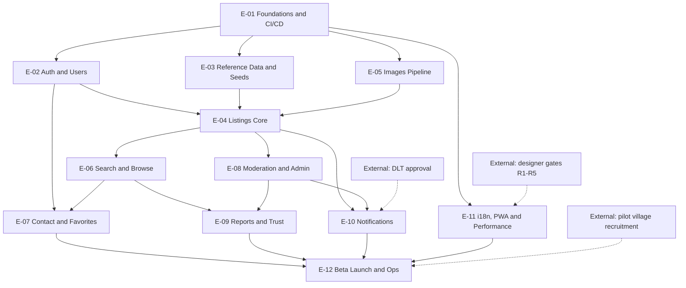

# 15 — Project Plan: Epics, Backlog, Sprints & Milestones

| Field | Value |
|---|---|
| **Status** | Draft |
| **Version** | 1.0 |
| **Owner** | Founder (Abhishek) |
| **Last updated** | 2026-07-04 |
| **Depends on** | [../00-foundation/README.md](../00-foundation/README.md) · [../01-prd/README.md](../01-prd/README.md) · [../02-research/README.md](../02-research/README.md) · [../04-business-rules/README.md](../04-business-rules/README.md) · [../05-features/README.md](../05-features/README.md) · [../07-database/README.md](../07-database/README.md) · [../08-api/README.md](../08-api/README.md) · [../10-frontend-design-requirements/README.md](../10-frontend-design-requirements/README.md) · [../13-deployment/README.md](../13-deployment/README.md) · [../14-testing-qa/README.md](../14-testing-qa/README.md) · [../16-legal/README.md](../16-legal/README.md) |

> This is the execution plan that turns the Phase 1 blueprint into a live beta pilot: 12 epics, 71 stories (174 points), 8 two-week sprints, 5 milestones. Sized for **one solo developer with AI-assisted coding plus one external designer working in parallel** (locked decision D7). Every story references the doc sections that specify it — nothing in this plan is specified here; everything is specified *there*.

---

## 1. Delivery strategy

### 1.1 Walking skeleton first

Sprint 1 delivers a **deployed, end-to-end thread through every architectural layer**: repo → CI → Vercel production URL → Next.js route handler → Prisma → Neon → Firebase phone-OTP login on a real device → a `users` row. It is deliberately thin (no styling, no listings) but it retires the integration risk of the whole stack (D1–D5) in the first two weeks. Every later sprint only thickens an already-working skeleton.

### 1.2 Vertical slices, not horizontal layers

Every story that can be user-visible is cut **vertically**: DB migration + API route + UI screen + tests ship together in one story (e.g. PS-023 "My Listings" includes API-14, screen S-11 and its route-handler tests). Horizontal stories (schema-only, middleware-only) are allowed only in E-01/E-03 where no user surface exists yet. Rule of thumb: at the end of any story, something demonstrable changed on a preview URL.

### 1.3 Always-deployable main

- Trunk-based development: short-lived branches (≤ 2 days), PR to `main`, squash merge. CI (lint, typecheck, unit + integration tests, `prisma migrate diff` check, mr/en catalog parity per PRD F-12 AC-3) must be green to merge.
- `main` deploys to production automatically ([../13-deployment/README.md](../13-deployment/README.md)); every PR gets a Vercel preview with a Neon branch database ([07 §7.2](../07-database/README.md)).
- Features that must not be publicly visible before their sprint demo hide behind environment-variable flags (`FEATURE_SMS`, `FEATURE_PWA_PROMPT`), never behind long-lived branches.
- Database changes follow expand–contract ([07 §7.4](../07-database/README.md)) so `main` is deployable at any commit.

### 1.4 Designer runs 1–2 sprints ahead — dev never waits

The external designer works from [doc 10](../10-frontend-design-requirements/README.md) alone, delivering gates R1→R5 (doc 10 §8.2) on the schedule in §4 below. The decoupling rule that makes a solo dev immune to design latency:

1. **Build unstyled-functional first.** Every screen is first implemented with semantic HTML, the real Marathi strings, correct states and correct behavior, using placeholder tokens. Acceptance criteria are testable without final visuals.
2. **Apply the design system when its gate is approved.** Token/component application (R1), public-screen skins (R2), seller-screen skins (R3), admin skins (R4) are absorbed as restyling passes inside later sprints — they change CSS, never behavior.
3. If a gate slips, the sprint ships unstyled-functional and the skin moves to the next sprint. Only M5 (beta) requires final visuals.

### 1.5 Docs gate the work — Definition of Ready

A story may enter **Ready** only when:

1. Every doc section it references carries **Status: Approved** in its header table. As of 2026-07-04 only [doc 00](../00-foundation/README.md) is Approved; the founder's first task in Sprint 1 week 1 is the approval pass over docs 01–14 and 16 (read, fix defects, flip Draft → Approved).
2. Its dependencies (column "Deps" in §3) are Done or scheduled earlier in the same sprint.
3. Its acceptance criteria are traceable to PRD ACs / BR ids (they are, by construction — see §3).

If implementation reveals a doc defect, the doc is fixed and version-bumped **before** the code merges (same discipline as the designer CR protocol, doc 10 §8.4). Code never silently diverges from an Approved doc.

### 1.6 Founder time budget

Velocity in §4 assumes the founder-developer spends ~80% of working time on committed stories. The remaining ~20% is reserved for: doc approvals and updates, designer gate reviews (doc 10 §8.3), field research coordination ([03 §4.5](../03-users/README.md) runs parallel to Sprint 1), moderation duty from M4 onward, and GTM prep from S5 onward ([02 §5](../02-research/README.md)). This reserve is why points are calibrated conservatively.

---

## 2. Epic list

Twelve epics cover 100% of MVP scope (foundation §4 IN-list, PRD F-01–F-12) plus the ops work the release gate demands (PRD §10, [16 §10](../16-legal/README.md)). Exit criteria per epic are in §3 with the stories.

| Epic | Name | Goal (one line) | PRD features | Primary doc refs | Pts | Sprints |
|---|---|---|---|---|---|---|
| E-01 | Foundations & CI/CD | Deployable skeleton: repo, CI, envs, middleware core, observability | — (enables all) | [13](../13-deployment/README.md) · [12 §8](../12-security/README.md) · [08 §1](../08-api/README.md) | 14 | S1–S2, S7 |
| E-02 | Auth & Users | Phone-OTP login, profile, session, login-wall | F-01, F-02 | [05 auth](../05-features/auth.md) · [05 profile](../05-features/profile.md) · [12 §3](../12-security/README.md) | 15 | S1–S6 |
| E-03 | Reference Data & Seeds | Schema live; 36 districts + 32 breeds seeded with reviewed Marathi names | — (enables F-03/F-04) | [07 §2, §6](../07-database/README.md) · [08 §2.2](../08-api/README.md) | 7 | S1–S3 |
| E-04 | Listings Core | Full listing lifecycle: wizard, submit, manage, state machine, expiry | F-03, F-07 | [05 listing-create](../05-features/listing-create.md) · [05 listing-manage](../05-features/listing-manage.md) · [04 BR-02x/03x/07x](../04-business-rules/README.md) | 27 | S2–S6 |
| E-05 | Images Pipeline | Presigned R2 uploads, attach, WebP variants, orphan GC | F-03 (photos) | [08 §2.5](../08-api/README.md) · [12 §6](../12-security/README.md) · [09](../09-backend/README.md) | 15 | S2–S7 |
| E-06 | Search & Browse | Public search, filters, SSR detail, SEO — no login needed | F-04, F-05 | [05 search-filters](../05-features/search-filters.md) · [05 listing-detail](../05-features/listing-detail.md) · [08 §4](../08-api/README.md) | 18 | S3, S6–S7 |
| E-07 | Contact & Favorites | Logged phone reveal (call/WhatsApp/interest) + favorites | F-06, F-08 | [05 contact-seller](../05-features/contact-seller.md) · [05 favorites](../05-features/favorites.md) · [04 BR-06x/070](../04-business-rules/README.md) | 8 | S4–S5 |
| E-08 | Moderation & Admin | Admin panel: queue, approve/reject, users/ban, audit, stats | F-10 | [05 §1 index](../05-features/README.md) · [08 §2.10](../08-api/README.md) · [06 §4.6](../06-user-flows/README.md) | 14 | S5 |
| E-09 | Reports & Trust | Report flow, 3-report auto-hide, resolve/dismiss, duplicate badge | F-09 | [05 §1 index](../05-features/README.md) · [04 BR-05x](../04-business-rules/README.md) · [06 §4.7](../06-user-flows/README.md) | 9 | S5 |
| E-10 | Notifications | In-app inbox + Marathi SMS via MSG91/DLT + retention jobs | F-11 | [05 §1 index](../05-features/README.md) · [04 BR-071](../04-business-rules/README.md) · [16 §8.1](../16-legal/README.md) | 9 | S1, S6–S7 |
| E-11 | i18n, PWA & Performance | Marathi-first catalogs, installable offline shell, NFR budgets green | F-12 + NFR-01/02/07/11 | [01 §6](../01-prd/README.md) · [10 §7.4](../10-frontend-design-requirements/README.md) · [14](../14-testing-qa/README.md) | 15 | S2, S6–S7 |
| E-12 | Beta Launch & Ops | Legal pages, E2E/security tests, drills, UAT, pilot launch | Release gate (PRD §10) | [14](../14-testing-qa/README.md) · [13](../13-deployment/README.md) · [16 §10](../16-legal/README.md) · [02 §5](../02-research/README.md) | 23 | S7–S8 |

Total: **174 points**. Points use the solo-dev scale of §3.1.

---

## 3. Story backlog

### 3.1 Conventions

- **Ids** PS-001…PS-071 are stable; never renumber.
- **Points** (Fibonacci 1/2/3/5, calibrated for one AI-assisted developer): 1 ≈ ≤ half a focused day · 2 ≈ 1 day · 3 ≈ 1.5–2 days · 5 ≈ 3–4 days. Nothing is estimated at 8: anything that sized was split (the listing wizard, the admin panel and the E2E suite were each split into 2–6 stories for exactly this reason). Estimates assume the referenced docs are decision-complete (they are), so no design churn is priced in.
- **AC / Verify** column cites the owning PRD acceptance criteria and BR ids instead of restating them, then names the story's verification method: **U** unit tests · **I** integration tests on route handlers with a test DB · **E** Playwright E2E · **M** manual on-device check (budget Android, cellular) · **L** Lighthouse CI · **P** process artifact (screenshot/log/sign-off) — test types per [doc 14](../14-testing-qa/README.md).
- **Docs** column links the sections a developer builds from. Sections in docs 09/13/14 are cited at doc level; their section anchors are fixed when those docs pass the §1.5 approval gate.
- Ops/paperwork stories are marked **[ops]** — they consume calendar time and points like any other story.

### 3.2 E-01 — Foundations & CI/CD (14 pts)

**Goal:** a deployable, observable, secured skeleton so every later story lands on working rails. **PRD:** enables all; NFR-04/05/08. **Exit criteria:** production URL serves `/api/v1/health` 200; CI blocks bad merges; preview deploys get isolated Neon branch DBs; Sentry receives a test event from prod; security headers pass doc 12 §8.1 checks.

| Id | Title | User story | AC / Verify | Pts | Deps | Docs |
|---|---|---|---|---|---|---|
| PS-001 | Repo scaffold | As the developer, I want a Next.js App Router + TypeScript + Prisma + ESLint/Prettier monorepo so that every convention is fixed before feature code exists. | Repo builds clean; conventions doc'd in README; D1 respected (no separate server). Verify: U (CI run) | 2 | — | [00 §3 D1](../00-foundation/README.md) · [13](../13-deployment/README.md) |
| PS-002 | CI pipeline | As the developer, I want GitHub Actions running lint, typecheck, tests, Prisma migrate-diff and catalog-parity checks on every PR so that main stays deployable (§1.3). | All 5 checks gate merge; red CI blocks. Verify: P (deliberately broken PR is blocked) | 3 | PS-001 | [13](../13-deployment/README.md) · [14](../14-testing-qa/README.md) |
| PS-003 | Vercel + Neon environments | As the developer, I want prod/preview Vercel environments wired to Neon (prod branch + per-PR branch DBs) with secrets managed per environment so that previews never touch prod data. | Preview PR gets own DB branch; env vars documented. Verify: M + P | 2 | PS-001 | [13](../13-deployment/README.md) · [07 §7.2](../07-database/README.md) |
| PS-004 | API middleware core | As the developer, I want shared route-handler middleware — zod validation, the FR-07 error envelope, and the Postgres rolling-window rate limiter (60 writes/min/user, BR-090 #2) — so every endpoint inherits BR-090 behavior. | Error envelope exact per 08 §1.3; RATE_LIMITED carries retryAfterSeconds. Verify: U + I | 3 | PS-001 | [08 §1.3](../08-api/README.md) · [12 §8.2, §8.4](../12-security/README.md) · [04 BR-090](../04-business-rules/README.md) |
| PS-005 | Sentry + release health | As the founder, I want client+server Sentry with release tagging so that G-05 (crash-free ≥ 99%) is measurable from the first deploy. | Test error visible in Sentry with release id; alert rules per 12 §9.5. Verify: M | 2 | PS-003 | [01 G-05, NFR-05](../01-prd/README.md) · [12 §9.5](../12-security/README.md) |
| PS-006 | Health check + uptime alert | As the founder, I want `/api/v1/health` (DB round-trip) plus an external uptime ping so that outages page me before users call. | 200 with DB check; alert fires on simulated downtime. Verify: M | 1 | PS-003 | [13](../13-deployment/README.md) |
| PS-007 | Security headers & hardening base | As the developer, I want the doc 12 §8.1 header set (CSP, HSTS, frame/referrer policies) applied globally so the OWASP review starts from green. | Headers verified on prod responses. Verify: I + M | 1 | PS-003 | [12 §8.1](../12-security/README.md) |

### 3.3 E-02 — Auth & Users (15 pts)

**Goal:** F-01/F-02 complete — OTP login, profile, settings, login-wall resume. **PRD:** F-01, F-02; FR-01/FR-02. **Exit criteria:** all F-01 AC 1–7 and F-02 AC 1–7 pass; banned user sees blocked screen; login wall resumes the interrupted action; no OTP endpoint exists on the backend (BR-010).

| Id | Title | User story | AC / Verify | Pts | Deps | Docs |
|---|---|---|---|---|---|---|
| PS-008 | Firebase project setup [ops] | As the developer, I want the Firebase project configured (phone provider, test numbers, quotas, Admin SDK service account in Vercel env) so that OTP login works in every environment. | Test-number login works on preview; service account never in repo. Verify: M + P | 2 | PS-003 | [05 auth](../05-features/auth.md) · [12 §3.1](../12-security/README.md) |
| PS-009 | OTP login UI (S-02/S-03) | As a farmer, I want to log in with my phone number and an SMS code so that I never need a password. | F-01 AC-1/2; S-02/S-03 states incl. resend cooldown, 3-strike invalidation. Verify: E + M | 3 | PS-008 | [05 auth](../05-features/auth.md) · [06 §4.4 Flow D](../06-user-flows/README.md) · [10 §3.2](../10-frontend-design-requirements/README.md) |
| PS-010 | Token verification + ban middleware | As the platform, I want every authed request verified via Firebase Admin SDK with `users.status` re-checked so that bans bite instantly (F-01 AC-4/5). | 401 UNAUTHENTICATED / 403 USER_BANNED exact. Verify: I | 2 | PS-004, PS-008 | [12 §3.1–3.3](../12-security/README.md) · [08 §1.2](../08-api/README.md) |
| PS-011 | Users API (API-01/02) | As a first-time user, I want my account created after OTP login so that the app knows me next time. | F-01 AC-3; BR-010 idempotency (USER_ALREADY_EXISTS → GET /users/me). Verify: I | 2 | PS-010, PS-015 | [08 §2.1 API-01/02](../08-api/README.md) · [04 BR-010](../04-business-rules/README.md) |
| PS-012 | Profile setup S-04 + PATCH (API-03) | As a first-time user, I want to set my name and district in under a minute, mostly by tapping, so that I can start immediately. | F-02 AC-1–4; BR-013 completeness; Places assist with 2 s silent fallback. Verify: I + M | 2 | PS-011, PS-016 | [05 profile](../05-features/profile.md) · [08 API-03](../08-api/README.md) · [04 BR-013](../04-business-rules/README.md) |
| PS-013 | Settings S-15/S-16 + logout | As a user, I want to edit my profile, switch language and log out so that the account stays mine. | F-02 AC-5/6; logout clears local state (F-01 AC-6). Verify: E + M | 2 | PS-012, PS-057 | [10 §3.3 S-15/S-16](../10-frontend-design-requirements/README.md) · [05 profile](../05-features/profile.md) |
| PS-014 | Login-wall sheet + returnTo | As an anonymous buyer, I want tapping a gated action to open login and then finish my original action so that I never lose my place. | F-06 AC-1; doc 06 §3.2 login-wall behavior; PROFILE_INCOMPLETE → S-04. Verify: E | 2 | PS-009, PS-012 | [06 §3.2, §4.4](../06-user-flows/README.md) · [04 BR-061](../04-business-rules/README.md) |

### 3.4 E-03 — Reference Data & Seeds (7 pts)

**Goal:** the full doc 07 schema live and seeded. **PRD:** enables F-03/F-04; assumption A-07. **Exit criteria:** all 10 tables + hand-written SQL constraints migrated; 36 districts + 32 breeds + system user seeded; meta endpoints serve Marathi names reviewed by a native speaker (release-gate item).

| Id | Title | User story | AC / Verify | Pts | Deps | Docs |
|---|---|---|---|---|---|---|
| PS-015 | Prisma schema + initial migration | As the developer, I want the complete doc 07 schema (users, districts, breeds, listings, listing_images, favorites, interest_events, reports, notifications, moderation_log) plus the §9.2 SQL constraints migrated so that every entity exists from day 1. | Schema byte-matches 07 §2; constraints per 07 §9. Verify: U (prisma validate) + I | 3 | PS-003 | [07 §2, §9](../07-database/README.md) |
| PS-016 | Seed script | As the developer, I want idempotent seeds — 36 districts, 32 breeds (Marathi + English names), system user, admin bootstrap — so that every environment starts usable. | Matches 07 §6.1–6.3 lists exactly; re-run safe. Verify: I + SQL count check | 2 | PS-015 | [07 §6](../07-database/README.md) |
| PS-017 | Meta endpoints (API-04/05) | As the client, I want cached `GET /meta/breeds?species=` and `GET /meta/districts` so pickers load instantly. | Contract per 08 §2.2; species filter validated. Verify: I | 1 | PS-016 | [08 §2.2](../08-api/README.md) |
| PS-018 | Seed Marathi review [ops] | As the founder, I want a native Marathi speaker to review all seeded `name_mr` values so the release-gate line "seed data reviewed" can be checked. | Review log stored; corrections migrated. Verify: P | 1 | PS-016 | [01 §10](../01-prd/README.md) · [07 §6.2](../07-database/README.md) |

### 3.5 E-04 — Listings Core (27 pts)

**Goal:** F-03 + F-07 complete — wizard, submit with declaration, My Listings, lifecycle actions, state-machine guards, expiry job. **Exit criteria:** every BR-031 transition T-01…T-12 exercised by automated tests and no undefined transition reachable (PRD §10 gate line); quota, declaration and edit rules enforced server-side; expiry cron live.

| Id | Title | User story | AC / Verify | Pts | Deps | Docs |
|---|---|---|---|---|---|---|
| PS-019 | Listing create/edit APIs (API-08/09) | As a seller, I want drafts saved with any subset of fields and edits validated against the species matrix so that I can fill the form at my own pace. | F-03 AC-1–3; BR-022/024/025/026; BR-065 phone block; price-only exception computed server-side (BR-028). Verify: I | 3 | PS-011, PS-016 | [08 §2.4 API-08/09](../08-api/README.md) · [04 BR-022–028, BR-065](../04-business-rules/README.md) |
| PS-020 | Wizard host + steps 1–2 (S-10, S-10a/b) | As a farmer, I want a guided Marathi wizard for species, breed and details with autosave so that nothing I enter is ever lost. | doc 10 S-10/S-10a/S-10b must-contain + states; conditional milk fields; ACC-05. Verify: E + M | 5 | PS-019, PS-017 | [05 listing-create](../05-features/listing-create.md) · [10 §3.3 S-10a/b](../10-frontend-design-requirements/README.md) · [06 §4.1 Flow A](../06-user-flows/README.md) |
| PS-021 | Wizard steps 4–5 (S-10d/e) | As a farmer, I want price with words readback, location, and the plain-Marathi declaration screen so that I understand exactly what I am publishing. | S-10d/S-10e states; BR-026 bounds; BR-027 verbatim declaration; ACC-08. Verify: E + M | 3 | PS-020 | [10 §3.3 S-10d/e](../10-frontend-design-requirements/README.md) · [04 BR-026/027](../04-business-rules/README.md) · [16 §3.2](../16-legal/README.md) |
| PS-022 | Submit endpoint (API-10) | As the platform, I want submit to enforce completeness, ≥ 1 photo, declaration and quota atomically, computing the duplicate flag, so nothing unmoderated leaks. | T-02/T-05 guards + side-effects per BR-031; idempotent re-submit per 08 §1.7. Verify: I | 2 | PS-019, PS-030 | [08 API-10](../08-api/README.md) · [04 BR-027/029, T-02](../04-business-rules/README.md) |
| PS-023 | My Listings S-11 (API-14) | As a farmer, I want all my listings grouped by status with views and interest counts so that I always know where each animal stands. | F-07 AC-1/7; S-11 tabs, quota meter, per-status cards. Verify: E + M | 3 | PS-022 | [05 listing-manage](../05-features/listing-manage.md) · [08 API-14](../08-api/README.md) · [10 §3.3 S-11](../10-frontend-design-requirements/README.md) |
| PS-024 | Mark-sold / renew / archive (API-11/12/13) | As a farmer, I want one-tap sold, renew and remove actions so buyers stop calling after a deal and fresh listings stay live. | F-07 AC-2/3/5/6; BR-074 renew without re-moderation; confirmations per ACC-17. Verify: I + E | 3 | PS-023 | [08 API-11/12/13](../08-api/README.md) · [04 BR-028/074, T-06/08/11](../04-business-rules/README.md) |
| PS-025 | Edit listing S-12 | As a seller, I want to fix a rejected listing or update price without losing my live slot unnecessarily. | F-03 AC-7; F-07 AC-4; re-moderation warning before non-price save; rejection reason pinned. Verify: E + M | 3 | PS-023 | [10 §3.3 S-12](../10-frontend-design-requirements/README.md) · [04 BR-028, T-05/T-09](../04-business-rules/README.md) |
| PS-026 | State-machine guard layer + transition tests | As the platform, I want every transition executed as `UPDATE … WHERE status = <from>` with the full T-01–T-12 table unit-tested, including all BR-032 disallowed pairs, so races can never corrupt a listing. | 409 INVALID_STATE_TRANSITION on every illegal pair. Verify: U + I (transition matrix test) | 3 | PS-019 | [04 BR-031/032/033](../04-business-rules/README.md) · [14](../14-testing-qa/README.md) |
| PS-027 | Expiry cron job | As the platform, I want the daily 02:30 IST job expiring listings and enqueuing 3-day warnings idempotently so the market never shows stale animals. | BR-072/073; FR-10 idempotency; protected cron route. Verify: I (time-travel test) + M | 2 | PS-026, PS-053 | [04 BR-072/073](../04-business-rules/README.md) · [09](../09-backend/README.md) · [13](../13-deployment/README.md) |

### 3.6 E-05 — Images Pipeline (15 pts)

**Goal:** BR-023 end-to-end — presign, direct PUT, attach with re-validation, WebP variants within NFR-02 budgets, orphan GC. **Exit criteria:** a 5 MB JPEG from a budget Android becomes served WebP variants ≤ 40/90/180 KB; HEIC and oversize rejected with the right codes; no EXIF (incl. GPS) survives; orphaned keys are collected daily.

| Id | Title | User story | AC / Verify | Pts | Deps | Docs |
|---|---|---|---|---|---|---|
| PS-028 | R2 buckets + presign (API-15) | As the client, I want single-use 10-minute presigned PUT URLs validated for type and size so uploads never transit our server. | 08 §2.5 contract; 12 §6.1 constraints; INVALID_UPLOAD cases. Verify: I | 3 | PS-004 | [08 API-15](../08-api/README.md) · [12 §6.1](../12-security/README.md) · [04 BR-023](../04-business-rules/README.md) |
| PS-029 | Photo upload UI (S-10c) | As a farmer, I want to add up to 5 photos from camera or gallery with per-photo progress, retry and reorder so that a network drop never ruins my listing. | F-03 AC-4; S-10c states; C-19 component behavior; 3-photo nudge. Verify: E + M (airplane-mode mid-upload) | 5 | PS-028, PS-030, PS-020 | [10 §3.3 S-10c, §4 C-19](../10-frontend-design-requirements/README.md) · [05 listing-create](../05-features/listing-create.md) |
| PS-030 | Attach/delete images (API-16/17) | As the platform, I want attach to re-check magic bytes, size and key ownership, and delete to cascade to R2, so uploads can't smuggle bad content. | 08 §2.5; PHOTO_LIMIT_EXCEEDED at 6th; T-09 on APPROVED photo change. Verify: I | 3 | PS-028, PS-019 | [08 API-16/17](../08-api/README.md) · [12 §6.2](../12-security/README.md) |
| PS-031 | WebP variant generation | As a buyer on 3G, I want thumbnail/card/detail WebP variants within NFR-02 budgets, orientation-normalized and EXIF-stripped, so pages stay fast and private. | NFR-02 sizes; 12 §6.3 EXIF decision; sideways-cow edge case (F-03). Verify: U (size assertions) + M | 3 | PS-030 | [01 NFR-02](../01-prd/README.md) · [12 §6.3](../12-security/README.md) · [09](../09-backend/README.md) |
| PS-032 | Orphaned-object GC job | As the operator, I want a daily job deleting R2 keys never attached to a listing so storage doesn't leak money. | F-03 edge case (interrupted PUT); idempotent. Verify: I | 1 | PS-030 | [09](../09-backend/README.md) |

### 3.7 E-06 — Search & Browse (18 pts)

**Goal:** F-04 + F-05 public and fast — the WhatsApp-shareable, Google-indexable buyer loop. **Exit criteria:** anonymous user finds a listing via species+district filter and opens its SSR detail page in < 5 s TTI on Fast 3G; filter state survives URL sharing; non-APPROVED URLs 404; sitemap/JSON-LD live.

| Id | Title | User story | AC / Verify | Pts | Deps | Docs |
|---|---|---|---|---|---|---|
| PS-033 | Search endpoint (API-06) | As a trader, I want filterable, keyset-paginated search over APPROVED listings so I can scan many animals across districts fast. | F-04 AC-1/3/4; 08 §4 deep spec (sorts, cursors, visibility); NFR-03 ≤ 500 ms p95. Verify: I + U (cursor edge cases) | 3 | PS-022 | [08 §4](../08-api/README.md) · [04 BR-034](../04-business-rules/README.md) · [07 §4](../07-database/README.md) |
| PS-034 | Home + results + filter sheet (S-05/S-06) | As a buyer, I want species chips, a filter sheet and infinitely scrolling cards with URL-encoded state so I can share a search on WhatsApp. | F-04 AC-2/5/6/7; S-05/S-06 states; C-17 card anatomy. Verify: E + M | 5 | PS-033, PS-017 | [05 search-filters](../05-features/search-filters.md) · [10 §3.2 S-05/S-06](../10-frontend-design-requirements/README.md) · [06 §4.5 Flow E](../06-user-flows/README.md) |
| PS-035 | Listing detail SSR + photo viewer (S-07/S-08, API-07) | As a dairy buyer, I want every attribute and photo on one shareable page so I can shortlist before traveling. | F-05 AC-1–7; owner view; sold/unavailable states; S-08 zoom with non-gesture alternatives; serves upload originals until PS-031 lands (S3 risk note). Verify: E + M + L | 5 | PS-033, PS-030 | [05 listing-detail](../05-features/listing-detail.md) · [10 §3.2 S-07/S-08](../10-frontend-design-requirements/README.md) · [16 §2.2](../16-legal/README.md) |
| PS-036 | Seller snippet sheet (S-09) | As a buyer, I want basic seller context — name, village, member-since, other listings — without ever seeing a phone number. | S-09 must-contain; BR-060 payload shaping. Verify: E | 1 | PS-035 | [10 §3.2 S-09](../10-frontend-design-requirements/README.md) · [04 BR-060](../04-business-rules/README.md) |
| PS-037 | View counting | As a seller, I want view counts on my listings so I can see buyers are looking. | FR-09 + BR-034 (no owner/admin counting). Verify: I | 1 | PS-035 | [01 FR-09](../01-prd/README.md) · [04 BR-034](../04-business-rules/README.md) |
| PS-038 | SEO pack | As the founder, I want sitemap, robots, Marathi titles/descriptions, Product JSON-LD, OG images and hreflang so listings acquire buyers organically. | NFR-09 complete; non-APPROVED URLs 404. Verify: I + M (rich-results test) | 3 | PS-035 | [01 NFR-09](../01-prd/README.md) |

### 3.8 E-07 — Contact & Favorites (8 pts)

**Goal:** F-06 + F-08 — the conversion moment and the shortlist. **Exit criteria:** every phone reveal flows through API-21 and writes an `interest_events` row first; 20/day limit enforced; the automated phone-concealment test guards every public surface; favorites idempotent with the 200 cap.

| Id | Title | User story | AC / Verify | Pts | Deps | Docs |
|---|---|---|---|---|---|---|
| PS-039 | Interest endpoint (API-21) | As the platform, I want one logged endpoint revealing the seller's phone with all guards (login, profile, APPROVED, not-own, 20/day) so G-04 is exact and scraping is blocked. | F-06 AC-2/5/6/7; BR-062/063/064; whatsappUrl built server-side. Verify: I | 2 | PS-014, PS-033 | [08 §2.7 API-21](../08-api/README.md) · [04 BR-062–064](../04-business-rules/README.md) |
| PS-040 | Contact bar UI + confirmation sheets | As a buyer, I want Call / WhatsApp / Send-Interest buttons that open the dialer or WhatsApp in one tap, with the number also shown for manual dialing. | F-06 AC-1–3; C-24 states; 16 §2.3 disclaimer on the sheet. Verify: E + M (real dialer/WhatsApp) | 2 | PS-039, PS-035 | [05 contact-seller](../05-features/contact-seller.md) · [10 §4 C-24](../10-frontend-design-requirements/README.md) · [16 §2.3](../16-legal/README.md) |
| PS-041 | Favorites (API-18/19/20 + S-13) | As a trader, I want to save listings and revisit them, with sold/expired ones greyed but visible, so my week-long shortlist survives. | F-08 AC-1–6; BR-070 (200 cap, idempotent, no self-favorite). Verify: I + E | 3 | PS-014, PS-034 | [05 favorites](../05-features/favorites.md) · [08 §2.6](../08-api/README.md) · [10 §3.3 S-13](../10-frontend-design-requirements/README.md) |
| PS-042 | Phone-concealment automated test | As the founder, I want a CI test asserting no seller phone appears in any public payload, SSR HTML, sitemap or OG tag so BR-066 can never regress silently. | F-06 AC-4; FR-08. Verify: I (runs in CI forever) | 1 | PS-039 | [04 BR-066](../04-business-rules/README.md) · [12 §5.2](../12-security/README.md) · [14](../14-testing-qa/README.md) |

### 3.9 E-08 — Moderation & Admin (14 pts)

**Goal:** F-10 — the operating console that makes the 24 h SLA achievable solo. **Exit criteria:** all F-10 AC 1–10 pass; every admin mutation writes `moderation_log`; the interim SQL-approval runbook (used S3–S4) is retired; queue decision takes ≤ 60 s for a typical listing.

| Id | Title | User story | AC / Verify | Pts | Deps | Docs |
|---|---|---|---|---|---|---|
| PS-043 | Admin shell + guard (S-18) | As the admin, I want a desktop `/admin` area that hard-denies non-admins server-side so moderation power can't leak. | F-10 AC-1; 12 §3.5 no-admin-signup. Verify: I (authz test) + E | 2 | PS-010 | [10 §3.4 S-18](../10-frontend-design-requirements/README.md) · [12 §3.5, §4](../12-security/README.md) |
| PS-044 | Pending queue (S-19, API-25) | As the admin, I want the FIFO queue with SLA age badges and report/duplicate/contact-info flags so I always work the right item next. | F-10 AC-2; BR-040/041 ordering + amber/red. Verify: I + E | 3 | PS-043, PS-022 | [08 API-25](../08-api/README.md) · [04 BR-040/041](../04-business-rules/README.md) · [10 §3.4 S-19](../10-frontend-design-requirements/README.md) |
| PS-045 | Review + approve/reject (S-20, API-26/27) | As the admin, I want the full listing, seller history and one-tap reject reasons on one screen so a decision takes under a minute. | F-10 AC-3/4/10; BR-042 checklist, BR-043 taxonomy; notification rows written (T-03/T-04 side-effects); photos-loaded guard. Verify: I + E | 3 | PS-044 | [08 API-26/27](../08-api/README.md) · [04 BR-042/043, T-03/T-04](../04-business-rules/README.md) · [10 §3.4 S-20](../10-frontend-design-requirements/README.md) |
| PS-046 | Users + ban/unban (S-22, API-31/32) | As the admin, I want user search, history and ban-with-reason (archiving all listings atomically) so severe violators leave the market in one action. | F-10 AC-7; BR-014, T-12; self/admin-ban blocked. Verify: I + E | 2 | PS-043 | [08 API-31/32](../08-api/README.md) · [04 BR-014/054](../04-business-rules/README.md) · [10 §3.4 S-22](../10-frontend-design-requirements/README.md) |
| PS-047 | Audit log (API-33) | As the admin, I want the append-only, filterable moderation log so every decision is defensible. | F-10 AC-8; BR-046; FR-12. Verify: I | 2 | PS-045 | [08 API-33](../08-api/README.md) · [04 BR-046](../04-business-rules/README.md) |
| PS-048 | Stats dashboard (S-23, API-34) | As the founder, I want the G-01…G-12 counters on one screen so metric reviews (§10) take minutes, not queries. | F-10 AC-9; PRD §2 measurement methods. Verify: I + M | 2 | PS-045 | [08 API-34](../08-api/README.md) · [01 §2](../01-prd/README.md) · [10 §3.4 S-23](../10-frontend-design-requirements/README.md) |

### 3.10 E-09 — Reports & Trust (9 pts)

**Goal:** F-09 — community policing with the atomic auto-hide. **Exit criteria:** 3rd OPEN report hides a listing exactly once under concurrency; resolve/dismiss flows per BR-052; reporter identity never reaches the seller.

| Id | Title | User story | AC / Verify | Pts | Deps | Docs |
|---|---|---|---|---|---|---|
| PS-049 | Report endpoint + modal (S-17, API-22) | As a buyer who found a dead listing, I want to report it with a reason in three taps so others don't waste calls. | F-09 AC-1/2/4/5/6/7; BR-050/051 guards. Verify: I + E | 2 | PS-014, PS-035 | [08 API-22](../08-api/README.md) · [04 BR-050/051](../04-business-rules/README.md) · [10 §3.3 S-17](../10-frontend-design-requirements/README.md) |
| PS-050 | Auto-hide transaction (T-10) | As the platform, I want the 3rd open report to hide the listing atomically with one AUTO_HIDE log row and admin+seller notifications, even under racing reports. | F-09 AC-3; BR-045; concurrency edge (two simultaneous #3 reports). Verify: I (race test) | 3 | PS-049, PS-026 | [04 BR-045, T-10](../04-business-rules/README.md) · [01 F-09 AC-3](../01-prd/README.md) |
| PS-051 | Reports queue + resolve/dismiss (S-21, API-29/30) | As the admin, I want reports grouped by listing with resolve (hides if still live) and dismiss so justified complaints act fast. | F-10 AC-6; BR-052 resolve/dismiss flows; re-approval always via the normal T-03 (expires_at = now + 30 d, BR-045/BR-073). Verify: I + E | 3 | PS-050, PS-045 | [08 API-29/30](../08-api/README.md) · [04 BR-052/053](../04-business-rules/README.md) · [10 §3.4 S-21](../10-frontend-design-requirements/README.md) |
| PS-052 | Duplicate-heuristic badge | As the admin, I want the BR-029 flag (same seller + species + ±10% price + 7 days) shown with a link to the sibling listing so duplicates die in review. | F-10 AC-5; FR-11 — advisory only, never blocks. Verify: I | 1 | PS-022, PS-044 | [04 BR-029](../04-business-rules/README.md) · [01 FR-11](../01-prd/README.md) |

### 3.11 E-10 — Notifications (9 pts)

**Goal:** F-11 — in-app inbox always; Marathi SMS for payoff moments. **Exit criteria:** all FR-04 triggers N-01…N-09 write rows; SMS dispatched post-commit via `waitUntil` with the single daily housekeeping retry of rows < 24 h old (doc 09 §8.3), respecting 08:00–21:00 IST quiet hours and the 3/day/seller interest cap; DLT templates approved (or SMS consciously toggled off per PRD §10).

| Id | Title | User story | AC / Verify | Pts | Deps | Docs |
|---|---|---|---|---|---|---|
| PS-053 | In-app notifications + inbox (S-14, API-23/24) | As a farmer, I want a bell with unread count and an inbox that deep-links to the affected listing so I never miss an approval or a buyer. | F-11 AC-1/5/7 (INAPP path); FR-04 rows written by all trigger sites. Verify: I + E | 3 | PS-011 | [08 §2.9](../08-api/README.md) · [04 BR-071](../04-business-rules/README.md) · [10 §3.3 S-14](../10-frontend-design-requirements/README.md) |
| PS-054 | DLT + MSG91 registration [ops] | As the founder, I want DLT entity/header/template registration submitted with the exact BR-071 Marathi templates so SMS is legally sendable by S6. | Templates match BR-071 table verbatim; submission receipts filed. Verify: P | 1 | — | [04 BR-071](../04-business-rules/README.md) · [01 §10](../01-prd/README.md) · [13](../13-deployment/README.md) |
| PS-055 | SMS dispatch worker | As the platform, I want post-commit `waitUntil` MSG91 dispatch with the single daily retry of rows < 24 h old (doc 09 §8.3), quiet hours, the 3-SMS/day/seller interest cap and BANNED-user skip so SMS is reliable and cheap. | F-11 AC-2/3/4/6; BR-071/090 #13; behind `FEATURE_SMS` flag. Verify: I (fake provider) + M (real SMS) | 3 | PS-053, PS-054 | [04 BR-071](../04-business-rules/README.md) · [09](../09-backend/README.md) · [01 F-11](../01-prd/README.md) |
| PS-056 | Retention & purge jobs | As the operator, I want scheduled purges per the legal retention table (notifications 90 d, listing images 12 m post-terminal, etc.) so stored data matches published policy. | 16 §8.1 rows implemented; idempotent. Verify: I (time-travel) | 2 | PS-027 | [16 §8.1](../16-legal/README.md) · [04 BR-071 retention](../04-business-rules/README.md) · [09](../09-backend/README.md) |

### 3.12 E-11 — i18n, PWA & Performance (15 pts)

**Goal:** F-12 + NFR-01/02/07/11 — Marathi-first everywhere, installable, fast on 3G. **Exit criteria:** CI fails on catalog gaps; native-speaker review signed; Lighthouse budgets green on all three budget pages; PWA installs and survives airplane mode per NFR-11.

| Id | Title | User story | AC / Verify | Pts | Deps | Docs |
|---|---|---|---|---|---|---|
| PS-057 | i18n framework + catalogs + CI parity | As a Marathi-speaking user, I want every string from `mr.json`/`en.json` with Marathi default and instant toggle so the app never speaks English at me first. | F-12 AC-1–4/6; CI parity check; mr→en→key fallback with Sentry warn. Verify: U + I + E | 3 | PS-001 | [01 F-12](../01-prd/README.md) · [05 §3.5](../05-features/README.md) |
| PS-058 | Marathi copy review [ops] | As the founder, I want every UI string reviewed by a native Marathi speaker against the doc 10 register rules so the release-gate NFR-06 line can be checked. | 100% strings reviewed; fixes merged; sign-off filed. Verify: P | 2 | PS-057 | [01 NFR-06, §10](../01-prd/README.md) · [10 §2 HC-01](../10-frontend-design-requirements/README.md) |
| PS-059 | PWA: manifest + service worker + offline shell | As a farmer with patchy 3G, I want the app installable with cached shell, cached visited listings and a branded offline page so it never shows the browser dinosaur. | NFR-11 complete: install prompt from 2nd session, SWR image cache 50-entry LRU, writes disabled offline per 05 §3.3. Verify: E + M (airplane mode, real device) | 5 | PS-034, PS-035 | [01 NFR-11](../01-prd/README.md) · [10 §7.4](../10-frontend-design-requirements/README.md) · [05 §3.3](../05-features/README.md) |
| PS-060 | Lighthouse CI + performance tuning | As the founder, I want NFR-01 budgets enforced on every deploy (Fast 3G, Moto-G class) with fixes for any red so G-06 holds. | Search/detail/create pages within TTI/LCP/CLS/JS budgets. Verify: L (CI gate) | 3 | PS-059 | [01 NFR-01/02](../01-prd/README.md) · [14](../14-testing-qa/README.md) |
| PS-061 | Accessibility pass | As Sunita (P4), I want 48 px targets, 130% font-scale resilience, contrast ≥ 4.5:1 and icon+label pairing verified everywhere so the app works for first-time smartphone users. | NFR-07; doc 10 §6 ACC-01…17 audited screen by screen. Verify: M (audit checklist) + E (font-scale snapshot) | 2 | PS-034, PS-023 | [01 NFR-07](../01-prd/README.md) · [10 §6](../10-frontend-design-requirements/README.md) |

### 3.13 E-12 — Beta Launch & Ops (23 pts)

**Goal:** everything between "feature-complete" and "farmers in Satara and Ahilyanagar are using it": legal, tests, drills, UAT, launch. **Exit criteria:** every PRD §10 release-gate box checked; pilot live; first-week metrics reviewed.

| Id | Title | User story | AC / Verify | Pts | Deps | Docs |
|---|---|---|---|---|---|---|
| PS-062 | Legal pages + signup consent [ops] | As the platform, I want `/privacy`, `/terms`, `/grievance` live in EN+MR and the §4.5 consent notice at signup so IT Rules/DPDP duties are met before launch. | 16 §10 G-2/G-3/G-4; linked from S-02/S-15 footer. Verify: M + P | 2 | PS-012 | [16 §4–§6, §10](../16-legal/README.md) |
| PS-063 | E2E test suite | As the developer, I want Playwright suites for the golden paths — onboarding+first listing, browse→contact, moderation, report→auto-hide, renew/mark-sold — running in CI so regressions surface before deploys. | PRD §10 scripted scenario automated; doc 14 suite plan. Verify: E (the suite itself, gating CI) | 5 | PS-045, PS-040, PS-051 | [14](../14-testing-qa/README.md) · [01 §10](../01-prd/README.md) · [06 §4](../06-user-flows/README.md) |
| PS-064 | Security test pass | As the founder, I want the doc 12 §10 pre-launch battery — authz matrix, presign abuse, rate limits, phone concealment, OWASP checklist — executed and green. | All 12 §10 items pass; findings fixed or risk-accepted in writing. Verify: I + P | 3 | PS-063 | [12 §10](../12-security/README.md) · [01 NFR-08](../01-prd/README.md) |
| PS-065 | Backup restore + rollback drills [ops] | As the operator, I want a Neon PITR restore drill and a ≤ 10-minute production rollback drill executed and timed so recovery is proven, not assumed. | PRD §10 lines "backups verified" + "rollback proven"; drill log filed. Verify: P | 2 | PS-003 | [13](../13-deployment/README.md) · [01 §10](../01-prd/README.md) |
| PS-066 | UAT with farmers [ops] | As the founder, I want ≥ 5 assisted sessions (incl. ≥ 2 women, per doc 03 quotas) on budget Androids over cellular running the full farmer script, with findings triaged into S8. | PRD §10 E2E-on-real-device line; UAT report with severity-tagged findings. Verify: P | 3 | PS-063, PS-058 | [03 §4](../03-users/README.md) · [14](../14-testing-qa/README.md) · [01 §10](../01-prd/README.md) |
| PS-067 | Moderation runbook + staffing [ops] | As the admin, I want the written runbook (queue 2×/day 7 days/week, BR-042 checklist, ban criteria, deletion procedure) so moderation survives founder sick days. | PRD §10 runbook line; BR-015 deletion steps included. Verify: P | 1 | PS-045 | [04 BR-041/042/054, BR-015](../04-business-rules/README.md) · [13](../13-deployment/README.md) |
| PS-068 | Pilot onboarding materials [ops] | As a Pashu Mitra, I want the field kit — poster/pamphlet with QR, WhatsApp scripts, 60-second demo flow, helpline card — printed from the doc 02 master copy so village onboarding is repeatable. | 02 §5.3/§5.7 assets produced; QR links tested. Verify: P + M | 2 | PS-059 | [02 §5.3, §5.7](../02-research/README.md) |
| PS-069 | Analytics events wiring | As the founder, I want all 14 frozen NFR-10 events firing with correct properties, verified end-to-end in production, so funnel metrics exist from day 1 of pilot. | NFR-10 list exactly — no invented events (05 §3.4). Verify: I + M (prod event check) | 1 | PS-040, PS-021 | [01 NFR-10](../01-prd/README.md) · [05 §3.4](../05-features/README.md) |
| PS-070 | Beta launch execution [ops] | As the founder, I want the PRD §10 gate walked line-by-line, the doc 13 launch checklist executed, and the launch event run in the first pilot village. | Every gate box checked with evidence links; launch day per 02 §5.6. Verify: P | 2 | PS-064, PS-065, PS-066, PS-068 | [01 §10](../01-prd/README.md) · [13](../13-deployment/README.md) · [02 §5.6](../02-research/README.md) |
| PS-071 | Pilot triage + metrics baseline [ops] | As the founder, I want daily Sentry/stats triage in launch week and a first G-01…G-12 baseline reading so course corrections start immediately. | Week-1 report vs PRD §2 targets; SEV-1 defects zero or fixed. Verify: P | 2 | PS-070 | [01 §2](../01-prd/README.md) · [12 §9](../12-security/README.md) |

**Backlog totals: 71 stories, 174 points.** Ops stories: PS-008, PS-018, PS-054, PS-058, PS-062, PS-065–068, PS-070–071.

---

## 4. Sprint plan (S1–S8, two weeks each)

### 4.1 Velocity assumption — 20–25 points per sprint

**Committed: 24 pts/sprint average (S1–S7), with S8 deliberately light (5 pts + reserve).** Justification: (a) one point ≈ 0.4 focused dev-days on this scale, so 24 pts ≈ 9–10 focused days of the 10-day sprint, matching the §1.6 80% focus budget; (b) AI-assisted coding is fastest exactly where this backlog is heaviest — CRUD route handlers, zod schemas from the BR-022 matrix, Prisma models transcribed from doc 07, test scaffolding; (c) the docs are decision-complete, so zero sprint time goes to "what should this do?"; (d) the unstyled-first strategy (§1.4) removes design-wait idle time. Velocity is re-measured every sprint retro; if actuals land below 20 for two consecutive sprints, the §8 scope-guardrail fires (Should-priority stories PS-041 favorites and PS-055 SMS slip first, per PRD assumption A-08 — never a Must feature).

### 4.2 Sprint-by-sprint

Dev committed points target 24 (25 max). The **Designer track** row lists deliverables due from the external designer that sprint (gates per [10 §8](../10-frontend-design-requirements/README.md)); designer work costs zero dev points, but founder review time comes from the §1.6 reserve.

#### S1 — Walking skeleton

| | |
|---|---|
| **Goal** | A production URL where a real phone number logs in via OTP and lands in the database; all rails (CI/CD, envs, schema, observability) in place; both external long-poles (DLT, design) started. |
| **Committed** | PS-001 (2) · PS-002 (3) · PS-003 (2) · PS-004 (3) · PS-006 (1) · PS-008 (2) · PS-009 (3) · PS-010 (2) · PS-011 (2) · PS-015 (3) · PS-054 (1) — **24 pts** |
| **Demo criteria** | Live prod URL; founder's real phone: OTP → logged in → `users` row visible in Neon; `/api/v1/health` 200; a deliberately broken PR blocked by CI; DLT submission receipt; doc approval pass done (§1.5). |
| **Risks** | Firebase OTP delivery to Indian numbers flaky (test early, enable test numbers); doc-approval pass eats more than week-1 (timebox to 2 days, defects become backlog items). |
| **Designer track** | Kickoff: designer receives doc 10, walks it with the founder; proposes color direction + type/token drafts; starts R1 (tokens D3 + component library D2). Founder answers CRs within 2 working days (10 §8.4). |

#### S2 — Listing creation opens

| | |
|---|---|
| **Goal** | A logged-in farmer with a complete profile creates a resumable draft through wizard steps 1–2, with the image backend (presign + attach) proven and i18n plumbing live from the start. |
| **Committed** | PS-005 (2) · PS-012 (2) · PS-016 (2) · PS-017 (1) · PS-019 (3) · PS-020 (5) · PS-028 (3) · PS-030 (3) · PS-057 (3) — **24 pts** |
| **Demo criteria** | On preview: profile completion S-04 with the 36-district picker; wizard steps 1–2 with seeded breeds in Marathi; kill the app mid-wizard → draft resumes; photo presign→PUT→attach round-trip shown via API; header toggle flips मराठी/English everywhere; Sentry catches a thrown test error. |
| **Risks** | Wizard autosave complexity underestimated (fallback: autosave on step-forward only, per-keystroke sync deferred); Neon branch DBs slow CI (cache Prisma client). |
| **Designer track** | **R1 due end of S2**: tokens (D3) + all 28 components (D2) delivered and founder-reviewed. Color direction signed off (10 §9). |

#### S3 — Submit end-to-end + public marketplace

| | |
|---|---|
| **Goal** | Full listing submission with photos and declaration; approved listings publicly searchable and shareable (M2 + M3). Interim moderation: founder approves via a written Prisma-Studio/SQL runbook until the admin panel lands in S5 — every interim approval still writes `moderation_log` via a script, so the audit trail starts clean. |
| **Committed** | PS-018 (1) · PS-021 (3) · PS-022 (2) · PS-029 (5) · PS-033 (3) · PS-034 (5) · PS-035 (5) — **24 pts** |
| **Demo criteria** | On a real budget Android over cellular: photograph a cow → 3 photos upload with progress → declaration → submit → PENDING; approve via interim runbook; listing appears in public search under species+district filter; SSR detail URL shared over WhatsApp renders with photo preview; anonymous browsing needs no login. |
| **Risks** | WebP variants not yet live (PS-031 in S4) — detail serves resized-on-upload originals this sprint, budget-exempt until S4; image upload UX on low-end devices needs real-device time (schedule 1 field afternoon). |
| **Designer track** | **R2 due end of S3**: public & auth screens S-01…S-09 (all states). Dev consumes R1 tokens: global restyle pass of auth + wizard replaces placeholder tokens (absorbed in PS-029/PS-034 story work). |

#### S4 — Seller management + buyer contact

| | |
|---|---|
| **Goal** | The full seller loop (My Listings, edit, mark-sold, renew, archive, state-machine tests) and the full buyer conversion loop (login wall, interest reveal, call/WhatsApp, favorites). |
| **Committed** | PS-014 (2) · PS-023 (3) · PS-024 (3) · PS-025 (3) · PS-026 (3) · PS-031 (3) · PS-039 (2) · PS-040 (2) · PS-041 (3) — **24 pts** |
| **Demo criteria** | Anonymous buyer taps "कॉल करा" → login sheet → OTP → call resumes with dialer open and `interest_events` row logged; WhatsApp opens with the BR-063 Marathi prefill; favorites heart syncs across list/detail/S-13; seller marks sold (listing vanishes from search instantly), renews an expired listing (via test fixture), edits price without losing APPROVED; transition-matrix test suite green incl. all BR-032 illegal pairs; images now served as WebP variants within NFR-02 budgets. |
| **Risks** | `tel:`/`wa.me` behavior varies by device (test matrix: 3 real Androids); state-machine test surface is wide (generate table-driven tests from BR-031). |
| **Designer track** | **R3 due end of S4**: seller screens S-10…S-17. Dev applies R2 skins to S-01…S-09 (small restyle chores, absorbed in sprint slack). |

#### S5 — Moderated marketplace complete (M4)

| | |
|---|---|
| **Goal** | Admin panel replaces the interim runbook: queue, review, reject taxonomy, reports with auto-hide, bans, audit log, stats. From this sprint on the founder runs real moderation duty daily. |
| **Committed** | PS-042 (1) · PS-043 (2) · PS-044 (3) · PS-045 (3) · PS-046 (2) · PS-047 (2) · PS-048 (2) · PS-049 (2) · PS-050 (3) · PS-051 (3) · PS-052 (1) — **24 pts** |
| **Demo criteria** | Pending listing approved from S-19/S-20 with seller in-app notification row; rejection with "फोटो स्पष्ट नाहीत" reaches seller's S-11 verbatim; 3 reports from 3 accounts auto-hide a live listing exactly once (race test green); ban archives all of a user's listings and blocks their API access; audit log shows every action; stats dashboard renders G-01…G-12 counters; phone-concealment CI test green; interim SQL runbook deleted. |
| **Risks** | Admin surface is wide but shallow — watch for underestimation (canned queries + AI-generated tables help); founder moderation duty begins, consuming reserve time. |
| **Designer track** | **R4 due end of S5**: admin screens S-18…S-23 (dev builds admin unstyled this sprint; R4 skin applied in S6). Pilot-village recruitment starts (founder + Pashu Mitra shortlist per [02 §5.3–5.4](../02-research/README.md)). |

#### S6 — Notifications, i18n complete, PWA, performance

| | |
|---|---|
| **Goal** | Every payoff moment reaches the farmer (in-app + SMS), Marathi is reviewed and complete, the app installs and works offline, and the NFR-01 budgets are enforced in CI. |
| **Committed** | PS-013 (2) · PS-027 (2) · PS-037 (1) · PS-038 (3) · PS-053 (3) · PS-055 (3) · PS-058 (2) · PS-059 (5) · PS-060 (3) — **24 pts** |
| **Demo criteria** | Approval triggers a real Marathi SMS on the founder's phone (if DLT approved; else worker demoed against the fake provider with `FEATURE_SMS` off and the PRD §10 SMS-fallback line invoked); bell inbox with unread badge deep-links to the listing; expiry cron demoed with a time-traveled fixture; PWA installs from the 2nd-session prompt; airplane mode shows cached listings + branded offline page; Lighthouse CI green on search/detail/create; native-speaker copy review signed; sitemap + JSON-LD validate. |
| **Risks** | **DLT approval is outside our control** — mitigation in §6; performance debt discovered late (budget 2 days of tuning inside PS-060; worst offenders are known in advance: images, JS bundles). |
| **Designer track** | **R5 due end of S6**: clickable prototypes (D4) + handoff specs (D5) + copy deck (D6). Dev applies R4 admin skin + R3 seller-screen polish. |

#### S7 — Hardening, UAT, release-gate prep

| | |
|---|---|
| **Goal** | Prove the system: full E2E suite, security battery, restore/rollback drills, farmer UAT, legal pages, remaining small stories. Feature freeze at sprint end — S8 fixes only. |
| **Committed** | PS-007 (1) · PS-032 (1) · PS-036 (1) · PS-056 (2) · PS-061 (2) · PS-062 (2) · PS-063 (5) · PS-064 (3) · PS-065 (2) · PS-066 (3) · PS-068 (2) · PS-069 (1) — **25 pts** |
| **Demo criteria** | Playwright suite green in CI across the five golden paths; doc 12 §10 security battery report all-pass; Neon PITR restore drill log + timed ≤ 10 min rollback; UAT report from ≥ 5 farmers (≥ 2 women) with severity-tagged findings; `/privacy`, `/terms`, `/grievance` live in EN+MR; accessibility audit checklist signed; analytics events visible in production dashboards; printed pilot kit in hand. |
| **Risks** | UAT scheduling with farmers slips (book sessions in S6 via the Pashu Mitra shortlist; weekday-morning visits per doc 03 field plan); E2E flakiness burns time (retry budget + test-id discipline from S3 onward). |
| **Designer track** | Designer supports UAT with the D4 prototype for side-by-side comparison; visual fixes from UAT filed as CRs; launch-asset artwork (poster/pamphlet visuals for PS-068) finalized. |

#### S8 — Beta pilot launch (M5)

| | |
|---|---|
| **Goal** | Launch in the 2 pilot districts (Satara, Ahilyanagar per PRD §10), fix what the first real users break, and baseline the metrics. Deliberately light commitment: **~15–17 pts of capacity reserved** for UAT findings and launch-week fixes — launch weeks always find work. |
| **Committed** | PS-067 (1) · PS-070 (2) · PS-071 (2) — **5 pts committed + reserve** |
| **Demo criteria** | PRD §10 release gate walked line-by-line with evidence; launch event executed in first pilot village (02 §5.6); ≥ 10 genuine farmer listings approved within SLA in week 1; admin stats reviewed with the G-01…G-12 baseline; zero open SEV-1 defects at sprint end. |
| **Risks** | Low first-week adoption (§8 R-05 — activate Pashu Mitra assisted-listing plan immediately, not after a month); founder splits between moderation, support helpline and fixes (runbook PS-067 + strict daily triage slot). |
| **Designer track** | On-call for launch fixes; collects field UI observations for the post-pilot design retro. |

### 4.3 Commitment cross-check

| Sprint | Points | Stories |
|---|---|---|
| S1 | 24 | PS-001–004, 006, 008–011, 015, 054 |
| S2 | 24 | PS-005, 012, 016, 017, 019, 020, 028, 030, 057 |
| S3 | 24 | PS-018, 021, 022, 029, 033–035 |
| S4 | 24 | PS-014, 023–026, 031, 039–041 |
| S5 | 24 | PS-042–052 |
| S6 | 24 | PS-013, 027, 037, 038, 053, 055, 058–060 |
| S7 | 25 | PS-007, 032, 036, 056, 061–066, 068, 069 |
| S8 | 5 + reserve | PS-067, 070, 071 |
| **Total** | **174** | 71 stories, each committed exactly once |

---

## 5. Milestones

| Id | Milestone | When | Objective verification criteria (all must hold) |
|---|---|---|---|
| M1 | **Walking skeleton** | End S1 | (1) Production URL live with `/api/v1/health` 200 incl. DB round-trip; (2) real-device phone-OTP login creates a `users` row (checked in Neon); (3) CI blocks a deliberately failing PR; (4) preview deploy with isolated Neon branch demonstrated; (5) DLT submission receipt filed; (6) designer kickoff done and R1 in progress; (7) docs 01–14/16 flipped to Approved. |
| M2 | **Listing lifecycle E2E works** | End S3 | (1) On a real budget Android over cellular: create → 3 photos → declaration → submit → PENDING; (2) approval (interim runbook) makes it publicly visible with `expires_at = +30 d`; (3) `declaration_accepted` + `declaration_at` stored (SQL check); (4) draft resume after app kill; (5) `moderation_log` row exists for the approval. |
| M3 | **Marketplace browsable publicly** | End S3 | (1) Anonymous user (fresh incognito, no login) filters by species+district and opens a detail page; (2) the detail URL shared into WhatsApp shows an image preview and opens SSR-rendered; (3) non-APPROVED listing URL returns HTTP 404; (4) no seller phone anywhere in payloads or HTML (grep + PS-042 test once it lands). |
| M4 | **Moderated marketplace complete** | End S5 | (1) Approve/reject with mandatory reason from the admin panel, reason visible to seller verbatim; (2) 3-report auto-hide fires exactly once under a concurrent test; (3) ban archives all the user's listings atomically and blocks API access; (4) audit log shows every admin/system action; (5) stats endpoint returns all PRD §2 counters; (6) interim SQL runbook retired (file deleted from repo). |
| M5 | **Beta pilot live** | End S8 | (1) Every PRD §10 release-gate checkbox checked with evidence links; (2) doc 13 launch checklist executed; (3) doc 14 release gate signed; (4) pilot running in Satara + Ahilyanagar with ≥ 10 genuine approved listings and moderation SLA met for 95% of week-1 submissions; (5) G-01…G-12 baseline recorded; (6) zero open SEV-1 defects. |

---

## 6. Dependency graph & external long-poles

### 6.1 Epic-level dependencies

The critical path is **E-01 → E-02/E-03/E-05 → E-04 → E-06 → E-08 → E-12**: nothing about notifications, PWA polish or favorites sits on it, which is exactly why those are the PRD "Should" items allowed to slip last (A-08).

### 6.2 External long-poles (start-by dates are hard)

| Long-pole | Owner | Start by | Typical lead time | Blocks | Contingency if late |
|---|---|---|---|---|---|
| DLT registration (entity + header + Marathi templates) + MSG91 account | Founder | **S1 week 1** (PS-054) | 2–6 weeks incl. template rework rounds | PS-055 real SMS (S6) | Launch with in-app-only notifications; PRD §10 explicitly allows SMS to follow within 2 weeks of pilot; `FEATURE_SMS` stays off |
| Designer gate R1 (tokens + components) | Designer | Kickoff S1 week 1 | 2 weeks | Styled UI from S3 | Ship unstyled-functional (§1.4); restyle later — behavior unaffected |
| Designer gates R2/R3/R4/R5 | Designer | R2 by end S3 · R3 by end S4 · R4 by end S5 · R5 by end S6 | 2 weeks each | Visual polish per area; D4 prototype for UAT | Same unstyled fallback; UAT can run on the built app instead of the prototype |
| Pilot village + Pashu Mitra recruitment (2 districts, ≥ 4 villages, 2–4 Pashu Mitras) | Founder | **S5 week 1** | 4–6 weeks of relationship-building ([02 §5.3–5.4](../02-research/README.md)) | PS-068/PS-070 (S7–S8) | Fall back to founder-led launch in 1 district (Satara) + dairy co-op channel; second district follows post-launch |
| Legal counsel review (OLQ-1…12, final Privacy/T&C text) | Founder + counsel | **S6 week 1** | 2–4 weeks | PS-062 final text; 16 §10 G-9 | Doc 16 §9 product defaults apply until counsel answers ("none blocks the build"); launch on drafted texts with counsel sign-off tracked as a post-launch gate item only if counsel confirms in writing that drafts are acceptable interim |
| Native Marathi copy reviewer | Founder | Book by **S5**, review in S6 | 1 week | PS-058 → release gate NFR-06 | Second reviewer candidate pre-identified (Pashu Mitra network); worst case founder + one native speaker split the catalog |
| Google Places API key + billing cap | Founder | S2 (with PS-012) | Days | Village autocomplete assist | Feature degrades silently to free text by design (F-02 AC-3) — never blocking |
| UAT farmer scheduling | Founder | Book in **S6** for S7 sessions | 1–2 weeks | PS-066 | Recruit via dairy co-op morning collection points (03 §4.2); minimum viable: 3 sessions, rest in S8 week 1 |

---

## 7. Definition of Done

### 7.1 Story-level DoD

A story is Done only when **all** of:

1. Every referenced acceptance criterion (PRD AC / BR id) demonstrably passes.
2. Tests written and green per the story's Verify tags and the [doc 14](../14-testing-qa/README.md) pyramid (unit for logic, integration for route handlers, E2E only for golden paths); the transition matrix, authz matrix and phone-concealment suites never regress.
3. Lint, typecheck, catalog-parity and migration checks green in CI.
4. New user-facing strings exist in **both** `mr.json` and `en.json` (Marathi first).
5. Deployed to a Vercel preview and manually exercised there (on a real Android for UI stories).
6. Docs updated: if implementation deviated from any Approved doc, that doc was corrected and version-bumped before merge (§1.5).
7. Merged to `main`; production deploy healthy (Sentry clean for the release).

### 7.2 Sprint-level DoD

1. All sprint demo criteria (§4.2) demonstrated on production or preview, recorded (screen capture) for the stakeholder demo.
2. Zero open SEV-1/SEV-2 bugs (severity per [12 §9.1](../12-security/README.md)); lower-severity bugs triaged into the backlog with ids.
3. `main` deployable: CI green, no half-migrated expand-contract steps left dangling.
4. Velocity recorded; next sprint planned against §4.1 rules; board groomed (§10).
5. Designer gate for the sprint reviewed with sign-off or a dated revision plan (10 §8.3).

### 7.3 Release/beta DoD (M5 gate)

1. **[Doc 14](../14-testing-qa/README.md) release gate** signed: full regression + E2E suite green, NFR-01 budgets green, security battery pass.
2. **[Doc 13](../13-deployment/README.md) launch checklist** executed: envs, cron schedules, backups verified by drill, rollback proven ≤ 10 min, alerting live.
3. **PRD §10 checklist** — every box checked with an evidence link (test run, screenshot, log, sign-off), including legal pages, seed review, Marathi copy review, DLT status (approved or consciously toggled off), moderation runbook staffed.
4. Founder go/no-go recorded in writing with date.

---

## 8. Risk register

P/I scale: L(ow) / M(edium) / H(igh). Reviewed at every sprint retro; any risk whose trigger fires becomes a named backlog item within 24 h.

| Id | Risk | P | I | Mitigation (ongoing) | Trigger → Contingency |
|---|---|---|---|---|---|
| R-01 | **Solo-dev bus factor** — illness/emergency stalls everything | M | H | Everything reproducible from docs + IaC-ish setup notes in doc 13; daily push to `main`; secrets in a shared vault the founder's designated backup can access; moderation runbook (PS-067) executable by a non-developer | Trigger: > 3 lost working days → slip the sprint wholesale (don't thin quality); if during pilot, backup moderator (trained in S7) keeps SLA while dev work pauses |
| R-02 | **DLT approval delayed** blocks SMS notifications | H | M | Submit S1 week 1 (PS-054); templates copied verbatim from BR-071 to avoid rework; MSG91 support engaged early | Trigger: not approved by S6 planning → launch in-app-only per PRD §10 fallback; re-check weekly; SMS lands as a post-launch patch |
| R-03 | **Designer delay** blocks styled UI | M | M | §1.4 unstyled-functional-first strategy makes design non-blocking by construction; gates scheduled 1–2 sprints ahead of consumption; CR SLA 2 days | Trigger: a gate ≥ 1 sprint late → ship unstyled, apply skin next sprint; ≥ 2 sprints late → founder applies a minimal token set himself and descopes visual polish from the beta gate (beta needs correct, legible, accessible — not beautiful) |
| R-04 | **OTP cost overrun / SMS-pumping abuse** on Firebase phone auth | M | M | Firebase abuse controls + region policy limited to India; billing alerts at 50/80% of budget; assumption A-05 monitored weekly | Trigger: monthly auth cost > ₹8,000 or anomalous OTP volume → enable stricter Firebase quotas + app-check; never build a custom OTP sender (BR-09 locked) |
| R-05 | **Low pilot adoption** — farmers don't list | M | H | GTM per doc 02: Pashu Mitra assisted listing, co-op channels, launch event; G-10 funnel instrumented from day 1; UAT before launch catches usability blockers | Trigger: < 25 farmer registrations or < 15 listings by end of pilot week 2 → founder runs assisted-listing drives 3 days/week; review G-12 rejection reasons for form fixes before building anything new (PRD §2 rule) |
| R-06 | **Moderation load exceeds founder time** | M | M | Panel optimized for ≤ 60 s decisions (F-10); queue badges + SLA alarms; A-04 says ≤ 50/day is manageable | Trigger: p95 SLA > 24 h for 3 consecutive days or queue > 60 items → recruit/train part-time moderator (panel already multi-admin, BR-012); tighten photo tips + form copy to cut rejection load |
| R-07 | **Neon/Vercel free-tier limits** (compute hours, cron frequency, function duration) | M | M | NFR-12 capacity fits paid-entry tiers by design; usage dashboards checked at each metrics review; image work kept off long-running functions (presigned direct uploads, D4) | Trigger: any platform limit warning → upgrade to the first paid tier (budgeted ops cost, doc 13); if Vercel cron granularity insufficient, external cron (GitHub Actions schedule) hits the protected route |
| R-08 | **Scope creep — chat pressure** from users/stakeholders during pilot | H | M | D6 locked: chat is Phase 2; §9 parking lot gives every "can we add…" a home with a trigger metric; foundation §3 makes revisiting a foundation-level change | Trigger: chat requests recur in pilot feedback → log against the §9 item and its PRD §11 trigger (G-04 ≥ 25% sustained); founder answers "logged for Phase 2", never "yes" mid-MVP |
| R-09 | **Google Places pricing/quota** surprises on village autocomplete | L | L | Hard monthly quota cap configured (PRD §8); silent free-text fallback is the designed behavior (F-02 AC-3) | Trigger: cost > ₹2,000/month or quota errors → disable the assist flag; UX already defined without it |
| R-10 | **Monsoon timing squeezes field work** — S1 field research and S7 UAT fall in heavy-rain months for an Oct–Nov launch window | M | M | Doc 03 fieldwork planned around co-op collection points (indoor, morning); UAT sessions booked with slack (S6 booking for S7); pilot launch itself lands post-monsoon (festival/fair season — good for livestock trade) | Trigger: sessions cancelled by weather → switch to phone-assisted remote sessions with a Pashu Mitra holding the device; extend UAT into S8 week 1 rather than skipping quotas |
| R-11 | **Image pipeline on serverless** — sharp/WebP generation hits memory/time limits | M | M | Variants generated per-image (not batch) on attach; size-capped inputs (5 MB); budget tested with worst-case photos in PS-031 | Trigger: variant generation p95 > 10 s or OOM errors → move variant generation to an async queue triggered post-attach (listing shows original until variants ready); R2 image resizing service as fallback |
| R-12 | **Neon cold starts / connection limits** break NFR-03 latency | M | M | Prisma via Neon pooled connection string (07 §8.3); keep-warm via the health-check ping; p95 tracked in Sentry | Trigger: search p95 > 500 ms for a week → enable Neon autoscaling min-compute floor (paid), add response caching on meta endpoints |
| R-13 | **High rejection rate churns first sellers** (G-12 > 30%) | M | H | Photo tips sheet, wizard nudges, BR-065 hard block before submit (rejects prevented, not punished); reject reasons are instructive Marathi templates | Trigger: G-12 > 30% in any month → PRD §2 rule fires: form/onboarding review before any new feature; add pre-submit photo quality hints |
| R-14 | **Counsel review stalls or demands changes** to declaration/T&C late | L | M | Doc 16 §9 defaults apply until answered; counsel engaged S6 with a fixed question list (OLQ-1…12); legal texts are content, not code — swappable without deploys beyond copy | Trigger: counsel unreachable by S7 → second counsel referral (agri-tech familiar); launch on documented defaults with founder risk sign-off, per doc 16 §9 preamble |

---

## 9. Phase 2 backlog (parking lot)

Ordered by expected pull-forward pressure. Nothing here may enter a sprint before M5 + its trigger condition; each item cites where its future hook is documented. Architecture-level revisit triggers (dedicated backend extraction, D1) live in [../11-architecture/README.md](../11-architecture/README.md).

| # | Item | One-line rationale | Reference |
|---|---|---|---|
| 1 | In-app chat | Highest expected user pressure, but valuable only once inquiry volume proves demand — calls/WhatsApp already close deals (D6). | [01 §11 Phase 2](../01-prd/README.md) · foundation D6 · ADR trigger in [11](../11-architecture/README.md) |
| 2 | Verified seller badge + document review | Trust multiplier once seller volume makes manual review a queue, not a favor; schema extension point exists. | [01 §11](../01-prd/README.md) · F-02 future improvements |
| 3 | Vet certificate uploads on listings | Converts milk-yield/health claims into evidence — the top buyer-side trust ask (P3). | [01 §11](../01-prd/README.md) · F-05 future improvements |
| 4 | Listing videos | Photos limit judging gait/temperament; deferred for data cost + moderation load (BR-023 explicitly excludes video in MVP). | [04 BR-023](../04-business-rules/README.md) · F-03 future improvements |
| 5 | Sold-price capture → AI price suggestion | Needs the sold-price data MVP only starts collecting; guessing prices would destroy trust (PRD §9). | [01 §11 Phase 2/3](../01-prd/README.md) · F-07 future improvements |
| 6 | Multi-animal lots | Direct trader demand (P2) but breaks the one-animal listing atom; needs schema + moderation rework. | [04 BR-021](../04-business-rules/README.md) · F-03 future improvements |
| 7 | Auctions | Needs simultaneous buyer liquidity per animal; premature before G-04 ≥ 25% is consistently met. | [01 §9, §11 Phase 3](../01-prd/README.md) |
| 8 | Transport partner marketplace | Zero leverage until listing liquidity exists; animal-transit welfare compliance is its own track. | [01 §9, §11 Phase 3](../01-prd/README.md) · [16 §2.4](../16-legal/README.md) |
| 9 | Insurance referrals | IRDAI-regulated partnership/business-development work, not product work; extension noted in personas only. | [01 §9, §11 Phase 3](../01-prd/README.md) |
| 10 | Milk tracking / herd management | Different usage cadence (daily farm ops vs. occasional trading); a separate product surface entirely. | [01 §9, §11 Phase 3](../01-prd/README.md) |

Also parked from PRD §11 (lower pressure, same discipline): ratings & reviews, web push, Hindi locale, saved-search alerts, "recently sold" showcase (BR-034 note).

---

## 10. Tracking & ceremonies (solo-adapted)

### 10.1 GitHub Projects board

One board, one source of truth, columns:

| Column | Entry rule |
|---|---|
| **Backlog** | All §3 stories, labeled by epic (`E-01`…`E-12`), sprint milestone, and `ops` where applicable |
| **Ready** | §1.5 Definition of Ready passed (docs Approved, deps satisfied) — checked at sprint planning |
| **In progress** | WIP limit **2** (one primary + one blocked-waiting item); enforced ruthlessly — solo context-switching is the #1 velocity killer |
| **In review / preview** | PR open, preview deploy up; self-review with the [code + §7.1 DoD checklist](../14-testing-qa/README.md) |
| **Done** | §7.1 DoD complete, merged, prod healthy |

Bugs enter as issues with severity labels (SEV-1…4 per [12 §9.1](../12-security/README.md)); SEV-1/2 jump the queue, SEV-3/4 wait for sprint planning.

### 10.2 Cadence

| Ceremony | When | Duration | Content |
|---|---|---|---|
| Sprint planning | Day 1 of sprint | 60 min | Pull §4.2 committed stories to Ready/In-progress; confirm DoR; adjust for last sprint's actual velocity |
| Daily note | Every working day | 5 min | One-line journal in the sprint issue: done / next / blocked — the solo substitute for standup, and the audit trail R-01 depends on |
| Weekly self-review | Friday | 30 min | Board hygiene; risk register scan (§8 triggers); CI/Sentry/uptime check; DLT + designer-gate status |
| Sprint demo | Last day of sprint | 45 min | Recorded walkthrough of demo criteria (§4.2) to the designer + 1–2 trusted advisors; doubles as the stakeholder demo and the M-milestone evidence capture |
| Retro | Last day of sprint | 30 min | Velocity actual vs. plan; one process change max; risk register update |
| Metrics review | Fortnightly (with demo); **weekly during S8/pilot** | 30 min | `GET /api/v1/admin/stats` + Vercel Analytics + Sentry release health vs. PRD §2 targets G-01…G-12; misses feed the §8 triggers (esp. R-05, R-13) |
| Designer sync | Weekly, 30 min | 30 min | Gate progress, CR queue (2-day SLA per 10 §8.4), upcoming handoffs |

### 10.3 Metrics watched (and where)

- **Build health:** CI pass rate, deploy frequency, rollback count — GitHub/Vercel.
- **Product truth:** G-01…G-04, G-07…G-12 from `GET /api/v1/admin/stats` (PS-048).
- **Quality:** G-05 crash-free (Sentry), 5xx rate (NFR-05), Lighthouse budget status (PS-060).
- **Funnel:** the 14 frozen NFR-10 events (PS-069) — reviewed only fortnightly to avoid solo-dev dashboard-staring.

---

## Acceptance checklist

- [x] Delivery strategy states walking-skeleton-first, vertical slices, always-deployable main (trunk-based + expand–contract + env flags), designer running 1–2 sprints ahead with the unstyled-functional fallback, and the explicit docs-gate rule: a story is Ready only when its referenced doc sections are Approved (§1.5)
- [x] Exactly 12 epics E-01…E-12 covering Foundations/CI-CD, Auth & Users, Reference Data & Seeds, Listings Core, Images Pipeline, Search & Browse, Contact & Favorites, Moderation & Admin, Reports & Trust, Notifications, i18n & PWA & Performance, Beta Launch & Ops — each with goal, PRD feature ids, doc references and exit criteria (§2 table + §3 epic intros)
- [x] Story backlog holds 71 stories (within the 55–75 target), ids PS-001…PS-071 each committed to exactly one sprint (§4.3 cross-check), every story with user-story sentence, AC references to PRD ACs/BR ids plus a named verification method, points from {1,2,3,5} (nothing at 8 — oversized work was split), dependencies by story id, and doc refs to real sections
- [x] All mandated ops stories present: DLT registration (PS-054), Firebase setup (PS-008), seed data (PS-016/018), Sentry (PS-005), cron jobs (PS-027/032/056), legal pages (PS-062), UAT execution (PS-066), pilot onboarding materials (PS-068)
- [x] Sprint plan S1–S8 gives per sprint: goal, committed story ids with point totals (24–25 for S1–S7; S8 deliberately 5 + reserve, stated and justified), demo criteria, risks and a designer-track row mapped to doc 10 gates R1–R5; velocity assumption 20–25 pts/sprint stated and justified (§4.1); S1 matches the walking-skeleton mandate incl. DLT start and designer kickoff
- [x] Milestones M1 (end S1), M2 (end S3), M3 (end S3), M4 (end S5), M5 (end S8) each carry objective, checkable verification criteria (§5)
- [x] Mermaid epic dependency flowchart present with quoted labels and no parentheses inside bracket labels; external long-poles (DLT, designer gates, pilot village recruitment, counsel, copy reviewer, Places, UAT scheduling) tabled with start-by sprints, lead times, what they block and contingencies (§6)
- [x] Definition of Done at three levels: story (code + tests per doc 14 + docs updated + preview-deployed), sprint (demo criteria + zero SEV-1/SEV-2 + deployable main), release/beta (doc 14 release gate + doc 13 launch checklist + PRD §10) (§7)
- [x] Risk register has 14 rows (≥ 12) with probability, impact, mitigation, trigger + contingency — including solo-dev bus factor, DLT delay, designer delay (unstyled-first mitigation), OTP cost overrun, low pilot adoption, moderation overload, Neon/Vercel tier limits, chat scope creep, Google Places pricing, and monsoon field-research timing (§8)
- [x] Phase 2 parking lot lists the 10 mandated items in priority order, each with a one-line rationale and its PRD §11 / feature future-improvements / BR / ADR reference (§9)
- [x] Tracking & ceremonies are solo-adapted: board columns with WIP limit 2, daily journal, weekly self-review, fortnightly demo to designer/advisors, metrics review against PRD §2 targets (§10)
- [x] Zero contradictions with locked decisions D1–D10 and canonical values: Next.js full-stack only, Firebase client-side OTP (no backend OTP endpoint), R2 presigned uploads, 1–5 photos ≤ 5 MB, 10 active listings, 30-day expiry/one-tap renew, 24 h SLA, 3-report auto-hide, admin-side duplicate heuristic, cursor pagination 20/50, declaration at submit, chat/payments/AI/auctions/video excluded from all sprints
- [x] Decision-complete: every value chosen and stated (velocity 24 avg, point scale, interim SQL-approval runbook for S3–S4, S8 reserve, WIP limit, review cadences); no TBD/TODO/open questions; header table per foundation §7 with relative links throughout

