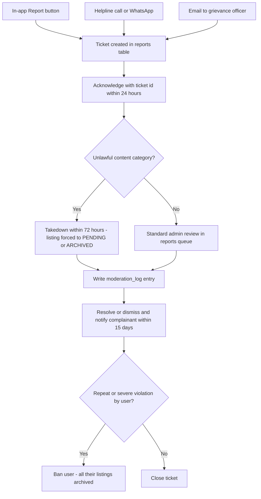

# 16 — Legal & Compliance

> **DRAFT — for legal counsel review before launch. Not legal advice.**
> Every policy text in this document (disclaimers, declaration, privacy policy, terms) is a working draft written by the product team. A qualified Indian advocate must review and sign off on all user-facing legal text before public launch. Until counsel sign-off, treat wording as provisional but treat the **product controls** (checkboxes, logs, retention jobs, grievance flow) as binding build requirements.

| Field | Value |
|---|---|
| **Status** | Draft |
| **Version** | 1.0 |
| **Owner** | Founder (Abhishek) |
| **Last updated** | 2026-07-04 |
| **Depends on** | [../00-foundation/README.md](../00-foundation/README.md) · [../01-prd/README.md](../01-prd/README.md) · [../04-business-rules/README.md](../04-business-rules/README.md) · [../07-database/README.md](../07-database/README.md) · [../08-api/README.md](../08-api/README.md) · [../12-security/README.md](../12-security/README.md) |

---

## 0. Purpose, scope and conventions

This document is the single legal & compliance reference for PashuSetu MVP. It:

1. Maps every applicable law/regulation to a concrete **product control** already specified in the blueprint (compliance register, §1).
2. Fixes the **platform stance** (facilitator/intermediary) and the exact disclaimer texts, English + Marathi (§2).
3. Fixes the exact **seller declaration** checkbox text and its storage requirements (§3).
4. Provides complete **Privacy Policy** and **Terms & Conditions** outlines that counsel can convert into final legal text (§4, §5).
5. Specifies the **grievance mechanism** required by the IT Rules 2021 (§6).
6. Maps the **content policy** to detection and enforcement actions (§7).
7. Fixes the **data retention & deletion** policy (§8).
8. Lists numbered **open questions for counsel** (§9) — these are questions for the lawyer, not open product decisions; the product ships with the defaults written here unless counsel overrides them.

**Business-rule references.** Rules are cited by BR family id; authoritative individual rule ids and full text live in [../04-business-rules/README.md](../04-business-rules/README.md):

| BR family | Topic |
|---|---|
| BR-01x | Accounts & roles |
| BR-02x | Listing creation, photos, seller declaration |
| BR-03x | Listing limits (max 10 active per user) |
| BR-04x | Listing lifecycle: 30-day expiry, renew, edit rules |
| BR-05x | Moderation: 24h SLA, mandatory rejection reason |
| BR-06x | Reports: ≥3 open reports auto-hide, 5 reports/day/user |
| BR-07x | Contact & phone-reveal via interest events, 20/day/buyer |
| BR-08x | Prohibited content |
| BR-09x | Rate limits, duplicate heuristic, bans |

**Entity note.** "PashuSetu", "we", "the platform" in draft policy texts means the operating entity. The operating entity at pilot is the Founder (Abhishek) as sole proprietor; incorporation as a Private Limited Company is planned before scale monetization (see OLQ-1 in §9). Policy texts must render the entity name from a single config constant (`LEGAL_ENTITY_NAME`) so an incorporation later is a config change, not a rewrite.

---

## 1. Compliance register

Each row: the law, what it requires of us, the product control that implements it, and where that control is specified. This register is reviewed at every release that touches listings, contact, or user data.

| # | Law / Regulation | What it requires (as applied to PashuSetu) | Product control implementing it | Doc / BR reference |
|---|---|---|---|---|
| CR-1 | **Maharashtra Animal Preservation Act, 1976 (as amended 2015)** — prohibits slaughter of cows, bulls and bullocks in Maharashtra, and prohibits sale/purchase/possession for that purpose | The platform must not facilitate, advertise, or knowingly enable sale of cattle for slaughter. Facilitation could expose the platform to abetment allegations. | (a) Mandatory **seller declaration** incl. "NOT for slaughter" on every submission (§3); (b) 100% **pre-publication human moderation** — DRAFT→PENDING→APPROVED, nothing public without admin approval; (c) admin **rejects** any listing whose text/photos suggest slaughter intent (mandatory reason); (d) repeat offenders **banned**, all listings archived; (e) species restricted to a fixed enum (COW, BUFFALO, BULL_OX, GOAT, SHEEP) — no "meat", "for slaughter" categories exist. | §3, §7 · BR-02x, BR-05x, BR-08x, BR-09x · [../04-business-rules/README.md](../04-business-rules/README.md) |
| CR-2 | **Prevention of Cruelty to Animals Act, 1960** + **Transport of Animals Rules, 1978** — humane treatment; animal transport requires fit animals, suitable vehicles, food/water, certificates | The platform does not arrange transport (out of MVP scope) but must not encourage unlawful transport; buyers/sellers must be reminded that transport is regulated. | (a) **Transport disclaimer** (exact text §2.4) shown on listing detail and in the contact/interest confirmation sheet; (b) transport services are explicitly OUT of scope (no transport listings — enforced by BR-08x); (c) cruelty-depicting photos rejected at moderation (§7). | §2.4, §7 · BR-05x, BR-08x |
| CR-3 | **IT Act, 2000 (§2(1)(w), §79)** + **IT (Intermediary Guidelines and Digital Media Ethics Code) Rules, 2021** — intermediary due diligence: publish rules/privacy policy/T&C, inform users of prohibited content, appoint Grievance Officer, acknowledge complaints in 24h, resolve in 15 days, expedited takedown for specified unlawful content, retain data of withdrawn registrations 180 days | PashuSetu is an intermediary hosting user-generated listings; safe-harbour under §79 depends on performing this due diligence. | (a) Privacy Policy + T&C published in-app and on web, EN + MR (§4, §5); (b) prohibited-content list surfaced in T&C and at listing creation (§7); (c) named **Grievance Officer**, published name + contact (§6); (d) grievance SLAs 24h/15d wired into the admin reports queue (§6); (e) takedown = listing forced to PENDING/ARCHIVED + `moderation_log` entry (§6.3); (f) 180-day retention of removed-content records and of deleted-account registration info (§8). | §4, §5, §6, §8 · BR-06x · [../05-features/README.md](../05-features/README.md) (Report feature), [../08-api/README.md](../08-api/README.md) (`/admin/*`) |
| CR-4 | **Digital Personal Data Protection Act, 2023** (+ DPDP Rules as notified, phased commencement) — notice & consent, purpose limitation, data minimisation, security safeguards, data principal rights (access, correction, erasure, grievance, nomination), breach notification to the Data Protection Board and affected users | PashuSetu is a **Data Fiduciary** for phone numbers, names, locations, and behavioural records (interest events). Processors: Firebase, Neon, Cloudflare R2, Vercel, SMS provider. | (a) **Consent notice** at signup, EN + MR (§4.5), consent logged with timestamp; (b) purposes enumerated and closed (§4.3) — no ads, no sale of data; (c) rights honoured via in-app profile edit + grievance channel, erasure within 30 days (§8.2); (d) security controls per [../12-security/README.md](../12-security/README.md); (e) breach-notification runbook (§4.7); (f) retention schedule (§8.1). | §4, §8 · [../12-security/README.md](../12-security/README.md) |
| CR-5 | **Aadhaar Act, 2016** — private entities may not demand Aadhaar; strict rules on collection/storage of Aadhaar numbers and biometrics | We must not collect, request, store, or accept Aadhaar numbers or biometric data. | (a) **No Aadhaar field exists anywhere** — schema (doc 07) has no Aadhaar column; (b) auth is Firebase phone OTP only (locked decision D3); (c) moderation rejects listings/photos containing Aadhaar images (§7); (d) support staff instructed never to request ID documents in MVP. | [../07-database/README.md](../07-database/README.md), [../12-security/README.md](../12-security/README.md) · BR-08x · D3 in [../00-foundation/README.md](../00-foundation/README.md) |
| CR-6 | **GST (CGST Act, 2017 + Maharashtra SGST)** — registration and tax on supply of services; e-commerce operator TCS (§52) applies only where the operator collects consideration | MVP is **free**: no fees, no commission, no consideration collected → no supply, no TCS. Future monetization (featured listings, verified-seller badge) is a **taxable advertising/platform service**, expected SAC 9983/998365-6 at **18% GST**, requiring registration before first invoice. | (a) No payment collection paths exist in MVP (locked scope); (b) monetization features gated behind a "GST registration complete" launch checklist item in [../15-project-plan/README.md](../15-project-plan/README.md); (c) this register row re-reviewed before any paid feature ships. | §9 OLQ-8 · [../00-foundation/README.md](../00-foundation/README.md) (OUT-of-scope list) |
| CR-7 | **Consumer Protection (E-Commerce) Rules, 2020** — transparency duties for e-commerce entities: display seller details, grievance officer, complaint ticket numbers, no misleading advertisements, no price manipulation | Applicability to a zero-payment classifieds platform is arguable (OLQ-2), but we adopt the duties prophylactically since they overlap with IT Rules duties. | (a) Listing detail shows seller name, village/district (seller identity transparency); (b) Grievance Officer published (§6); (c) every grievance gets a **ticket id** (= `reports.id`) quoted in the acknowledgment (§6.2); (d) platform never sets, boosts or manipulates prices — price is seller-entered, no algorithmic ranking by payment in MVP; (e) misleading listings rejected/reported (§7). | §6, §7 · BR-05x, BR-06x, BR-08x |

---

## 2. Platform stance — facilitator / intermediary model

### 2.1 Stance (binding for all docs and all UI copy)

1. PashuSetu is a **discovery and contact platform** (an "intermediary" under IT Act §2(1)(w)). It hosts listings created by sellers and lets buyers find and contact them.
2. **Every transaction is concluded offline, directly between buyer and seller.** PashuSetu is never a party to the sale, never takes custody of the animal, never holds or transfers money, and never guarantees price, health, quality, ownership, or delivery.
3. PashuSetu **does not handle payments** in any form (no escrow, no advance, no booking fee). Any UI copy implying otherwise is a defect.
4. Moderation is a **screening effort, not a warranty**. Approval of a listing means it passed our content rules at review time; it is not certification of the animal or the seller. T&C must state this expressly (§5, clause 5).
5. Disclaimers are **mandatory UI elements** in two places (owned by [../10-frontend-design-requirements/README.md](../10-frontend-design-requirements/README.md)):
   - **Listing detail page** — persistent disclaimer block below seller info (§2.2).
   - **Contact/interest confirmation sheet** — shown every time a logged-in buyer taps Call / WhatsApp / Send Interest, i.e., immediately before `POST /api/v1/listings/{id}/interest` reveals the seller phone (§2.3). The buyer taps "Understood — continue" to proceed; the tap is implied by the interest event record itself (no extra column needed).

### 2.2 Listing detail page disclaimer (exact text)

**English:**

> PashuSetu only connects buyers and sellers. The deal, price negotiation and payment happen directly between you and the other party, outside this app. PashuSetu does not verify the health, quality or ownership of any animal and is not responsible for the transaction. Always inspect the animal in person before buying.

**Marathi (मराठी):**

> पशुसेतू फक्त खरेदीदार आणि विक्रेते यांना जोडणारे व्यासपीठ आहे. सौदा, भाव आणि पैशांची देवाणघेवाण तुम्ही आणि समोरची व्यक्ती यांच्यात थेट, या अ‍ॅपच्या बाहेर होते. जनावराचे आरोग्य, गुणवत्ता किंवा मालकी पशुसेतू तपासत नाही आणि व्यवहाराची जबाबदारी घेत नाही. खरेदी करण्यापूर्वी जनावर नेहमी प्रत्यक्ष पाहून व तपासून घ्या.

### 2.3 Contact / interest confirmation disclaimer (exact text)

Shown in the bottom sheet before revealing the seller's phone number (all three interest types: CALL, WHATSAPP, INTEREST).

**English:**

> You are contacting the seller directly. PashuSetu is not part of your deal and does not handle any payment. Check the animal and the seller yourself before paying any money. Animal transport must follow government rules.

**Marathi (मराठी):**

> तुम्ही विक्रेत्याशी थेट संपर्क करत आहात. पशुसेतू तुमच्या व्यवहारात सहभागी नाही आणि कोणतेही पैसे हाताळत नाही. पैसे देण्यापूर्वी जनावर आणि विक्रेता स्वतः तपासा. जनावरांची वाहतूक सरकारी नियमांनुसारच करावी.

### 2.4 Transport disclaimer (exact text)

Rendered as the last line of the listing detail disclaimer block (collapsible "अधिक वाचा / Read more" is acceptable on small screens).

**English:**

> Transport of animals must comply with the Prevention of Cruelty to Animals Act, 1960 and the Transport of Animals Rules, 1978 — a suitable vehicle, food and water, and the required fitness certificates. Lawful transport is the responsibility of the buyer and the seller.

**Marathi (मराठी):**

> जनावरांची वाहतूक प्राणी क्रूरता प्रतिबंध कायदा १९६० आणि जनावर वाहतूक नियम १९७८ नुसारच करावी — योग्य वाहन, चारा-पाणी आणि आवश्यक ती आरोग्य प्रमाणपत्रे लागतात. कायदेशीर वाहतुकीची जबाबदारी खरेदीदार व विक्रेता यांची आहे.

---

## 3. Seller declaration

### 3.1 When it appears

The declaration is a **required, unchecked-by-default checkbox** on the final step of listing creation and on every resubmission (REJECTED → PENDING and any APPROVED → PENDING edit resubmit). `POST /api/v1/listings/{id}/submit` returns error code `DECLARATION_REQUIRED` if the checkbox value is not `true` (see [../08-api/README.md](../08-api/README.md)). Renewal (EXPIRED → APPROVED via `POST /api/v1/listings/{id}/renew`) does **not** re-prompt, because the listing content is unchanged and the original declaration stands (BR-04x).

### 3.2 Exact checkbox text

**English:**

> I declare that:
> 1. This animal is my lawful property, or I am selling it with the owner's permission.
> 2. All information and photos in this listing are true and current.
> 3. This animal is **NOT** being sold for slaughter.
> 4. This sale complies with the laws of the State of Maharashtra, including the Maharashtra Animal Preservation Act.
>
> I understand that a false declaration may lead to removal of my listings and closure of my PashuSetu account, and that I alone am responsible under law for this sale.

**Marathi (मराठी):**

> मी जाहीर करतो/करते की:
> १. हे जनावर माझ्या कायदेशीर मालकीचे आहे, किंवा मालकाच्या परवानगीने मी ते विकत आहे.
> २. या जाहिरातीतील सर्व माहिती आणि फोटो खरे व सध्याचे आहेत.
> ३. हे जनावर **कत्तलीसाठी विकले जात नाही**.
> ४. ही विक्री महाराष्ट्र राज्याच्या कायद्यांनुसार आहे — महाराष्ट्र प्राणी संरक्षण कायद्यासह.
>
> खोटी माहिती दिल्यास माझ्या जाहिराती काढून टाकल्या जातील व माझे खाते बंद केले जाऊ शकते, आणि या विक्रीची कायदेशीर जबाबदारी पूर्णपणे माझी आहे, हे मला मान्य आहे.

### 3.3 Storage requirements

| Requirement | Implementation |
|---|---|
| Acceptance flag | `listings.declaration_accepted` (boolean, must be `true` at submit) — per canonical schema, [../07-database/README.md](../07-database/README.md) |
| Acceptance timestamp | `listings.declaration_at` (UTC, set server-side at the submit call, never client-supplied) |
| Version of accepted text | The declaration text carries a version string (`decl_v1`); the version in force at acceptance is derivable from `declaration_at` against this doc's changelog — a dedicated column is deliberately omitted in MVP (single version). If the text changes, doc 07 adds `declaration_version` before release of the new text. |
| Re-acceptance | Every transition into PENDING via `submit` overwrites `declaration_at` with the new acceptance time (fresh declaration per BR-02x). |
| Immutability & audit | `declaration_accepted`/`declaration_at` are writable only by the submit handler; admin UI shows both fields read-only on the moderation screen; they are never exposed in public API responses. |
| Retention | Retained for the full listing retention period (36 months past terminal state, §8.1) — the declaration is our primary evidence of due diligence under CR-1. |

---

## 4. Privacy Policy — outline (skeleton for counsel)

Published at `/privacy` (EN) and `/mr/privacy` (MR); linked from signup screen, app footer, and the T&C. Marathi version is the primary display for `language_pref = MR` users. The signup consent notice (§4.5) is a condensed layer-1 notice; this policy is layer 2.

### 4.1 Section skeleton with content notes

| # | Section | Content notes (what counsel must cover) |
|---|---|---|
| 1 | Who we are | Legal entity name (`LEGAL_ENTITY_NAME`), role as **Data Fiduciary** under DPDP Act 2023, registered address, effective date, contact: `privacy@pashusetu.in`. |
| 2 | Data we collect | Exactly the table in §4.2 — nothing more. State plainly: **we never collect Aadhaar, bank details, payment data, precise GPS, or your phone contacts.** |
| 3 | Why we use it | Purposes table §4.3; commitment to purpose limitation — data is not used for advertising and is never sold. |
| 4 | Who we share it with | §4.4: (a) the **seller-phone-to-buyer reveal** (the one deliberate disclosure in the product); (b) processors; (c) legal/government demands. No other sharing. |
| 5 | Where data is stored | Named processors (§4.4) and their regions; note that some processors store data outside India, permitted under DPDP §16 unless the country is on a notified negative list (OLQ-6). |
| 6 | How long we keep it | Reference the retention table (§8.1) verbatim. |
| 7 | Your rights | Access, correction, erasure, grievance redressal, nomination (DPDP §§11–14); how to exercise: in-app profile edit, in-app Report/Help, helpline, or `grievance@pashusetu.in`; response within 30 days. |
| 8 | Consent & withdrawal | Consent captured at signup (§4.5); withdrawal = account deletion request (§8.2); consequence of withdrawal: account and listings are removed, past interest-event logs are retained per §8.1 as legally required records. |
| 9 | Cookies & analytics | §4.6 — strictly-necessary storage only, cookieless analytics, no ad trackers. |
| 10 | Children | Service is for users **18 years or older** (§5 clause 1); we do not knowingly process children's data; discovered under-18 accounts are deleted. |
| 11 | Data breaches | Commitment per §4.7. |
| 12 | Grievance Officer | Name + contact + timelines, mirroring §6.1 (IT Rules require this inside the policy). |
| 13 | Changes to this policy | Notice of material changes via SMS/in-app notification ≥7 days before effect; continued use = acceptance; archive of prior versions kept in the repo. |

### 4.2 Data collected (closed list)

| Data class | Fields (canonical schema) | Source | Required? |
|---|---|---|---|
| Identity | `users.phone` (E.164), `users.name`, `users.firebase_uid` | Signup (Firebase phone OTP) + profile | Yes |
| Location (coarse) | `users.district_id`, `users.taluka`, `users.village` | Profile / listing form | District yes; taluka/village optional on profile |
| Preferences | `users.language_pref`, role flags `is_farmer`/`is_buyer` | Profile | Yes (defaults MR) |
| Listing content | All `listings.*` attribute fields + `listing_images.*` photos | Seller input | Yes for sellers |
| Behavioural | `interest_events` (who contacted which listing, type, when), `favorites`, `reports` | Buyer/user actions | Generated by use |
| Communications | `notifications` records (type, payload, channel, status) | System | Generated by use |
| Technical | Server access logs (IP, user agent, timestamps) at Vercel; error traces (Sentry, PII-scrubbed) | Automatic | Generated by use |

### 4.3 Purposes (closed list — purpose limitation)

| Purpose | Data used | Basis |
|---|---|---|
| Operate the marketplace (accounts, listings, search, contact) | Identity, location, listing content | Consent (DPDP §6) |
| Reveal seller phone to an interested logged-in buyer | Seller `phone`; buyer identity logged in `interest_events` | Consent — disclosed in this policy §4.4(a) and in seller onboarding |
| Moderation, fraud & abuse prevention, duplicate detection, bans | Listing content, reports, behavioural, technical | Legitimate operation of the service; legal duty as intermediary (CR-3) |
| Notify users (approval, rejection, interest received) | Identity, notifications | Consent |
| Aggregate product metrics (e.g., ≥25% inquiry rate) | Behavioural, anonymised/aggregated | Legitimate operation |
| Comply with law (court orders, government requests) | Any, as legally compelled | Legal obligation |

### 4.4 Sharing & disclosure

- **(a) Seller phone reveal (deliberate product disclosure):** a seller's phone number is shown ONLY to a logged-in buyer who taps a contact action, via `POST /api/v1/listings/{id}/interest`; every reveal is logged as an `interest_events` row (BR-07x). Sellers are told this in onboarding and in this policy. Buyer phone numbers are never shown to sellers by the platform (the buyer chooses to reveal it by calling).
- **(b) Processors (Data Processors under DPDP):** Google Firebase (authentication), Neon (PostgreSQL database), Cloudflare R2 (image storage), Vercel (hosting/logs), SMS provider — MSG91 (transactional SMS), Sentry (error monitoring, PII-scrubbed). Each bound by its DPA; list maintained in [../12-security/README.md](../12-security/README.md).
- **(c) Legal:** disclosure to law enforcement / courts only against a lawful written demand, logged internally.
- **Never:** sale or rental of personal data; advertising networks; data brokers.

### 4.5 Consent notice at signup (exact text, layer-1)

Shown on the profile-completion screen (after first OTP verification, before `POST /api/v1/users`), above a required consent checkbox. Checking it sets consent; the `users.created_at` of the profile record is the consent timestamp.

**English:**

> To run PashuSetu we collect your phone number, name and village/district, and we keep a record of your activity — such as listings you post and sellers you contact. We use this only to run the marketplace, keep it safe, and inform you about your listings. We do not sell your data. If you are a seller, your phone number is shown to interested buyers who tap "Call" or "WhatsApp". You can see, correct or delete your data any time — see the Privacy Policy or call our helpline.

**Marathi (मराठी):**

> पशुसेतू चालवण्यासाठी आम्ही तुमचा फोन नंबर, नाव आणि गाव/जिल्हा घेतो, तसेच तुमच्या वापराची नोंद ठेवतो — जसे की तुम्ही टाकलेल्या जाहिराती व संपर्क केलेले विक्रेते. ही माहिती फक्त बाजार चालवण्यासाठी, तो सुरक्षित ठेवण्यासाठी आणि तुमच्या जाहिरातींबद्दल तुम्हाला कळवण्यासाठी वापरली जाते. आम्ही तुमची माहिती विकत नाही. तुम्ही विक्रेता असाल, तर "फोन करा" किंवा "व्हॉट्सअ‍ॅप" वर टॅप करणाऱ्या इच्छुक खरेदीदारांना तुमचा फोन नंबर दिसतो. तुमची माहिती पाहणे, दुरुस्त करणे किंवा काढून टाकणे यासाठी कधीही विनंती करू शकता — गोपनीयता धोरण पहा किंवा आमच्या हेल्पलाइनला फोन करा.

Checkbox label: **EN** "I agree to the Privacy Policy and Terms." / **MR** "मला गोपनीयता धोरण आणि अटी मान्य आहेत."

### 4.6 Cookies & analytics (fixed for MVP)

| Item | Decision |
|---|---|
| Strictly-necessary storage | Firebase Auth session (IndexedDB/localStorage), language preference, PWA install state. No consent banner needed for these under current Indian law; disclosed in the policy. |
| Analytics | **Vercel Analytics only** — cookieless, aggregated. No Google Analytics, no advertising pixels, no third-party trackers of any kind in MVP. |
| Error monitoring | Sentry with `sendDefaultPii: false`, phone numbers and tokens scrubbed via beforeSend (spec in [../12-security/README.md](../12-security/README.md)). |

### 4.7 Breach notification commitment

On becoming aware of a personal data breach: (1) contain and assess immediately; (2) notify the **Data Protection Board of India** and each affected user without delay, with the detailed intimation within **72 hours** as per the DPDP Rules; (3) user notice goes out via SMS + in-app notification in the user's `language_pref`; (4) incident recorded in the internal incident log (runbook in [../12-security/README.md](../12-security/README.md)).

---

## 5. Terms & Conditions — outline (skeleton for counsel)

Published at `/terms` (EN) and `/mr/terms` (MR); accepted together with the Privacy Policy via the signup checkbox (§4.5). Clause-level skeleton:

| # | Clause | Content notes |
|---|---|---|
| 1 | Acceptance & eligibility | Contract formed on account creation. Users must be **18 years or older**, competent to contract under the Indian Contract Act 1872, and resident in India. One account per person/phone number. |
| 2 | Account rules | Phone number must belong to the user; keep device/OTP secure; account is personal and non-transferable; user must keep profile info accurate (BR-01x). We may require re-verification. |
| 3 | Nature of the service | PashuSetu is an **intermediary/facilitator only** (§2.1 stance verbatim): no party to any sale, no payments, no escrow, no delivery, no agency. Free of charge in MVP; clause 8 governs future fees. |
| 4 | Listing rules | Sellers may list only livestock of the supported species; **max 10 active listings** (BR-03x); 1–5 photos, each ≤5 MB (BR-02x); mandatory **seller declaration** (§3) on every submission; listings expire after 30 days and can be renewed (BR-04x); **prohibited content list** (§7 / BR-08x) incorporated by reference; sellers must promptly mark sold animals as SOLD. |
| 5 | Moderation rights | Every listing is reviewed before publication; we may approve, reject (with reason), hide, or remove any content at our discretion, and are under **no obligation to publish** any listing. The 24h moderation SLA (BR-05x) is a service target, not a contractual guarantee. Approval is not a certification of the animal, the seller, or the listing's accuracy. |
| 6 | Buyer responsibilities | Inspect the animal physically before purchase; verify ownership documents; agree price and payment directly with the seller; comply with transport law (§2.4). Contact actions are rate-limited (20 interest events/day, BR-07x). |
| 7 | User conduct | No harassment, spam, fake listings, misleading info, scraping, automated access beyond published API limits (60 writes/min, BR-09x), circumvention of moderation, or use of another user's account. Reporting misuse (>5 reports/day, or bad-faith reports) is itself a violation (BR-06x). |
| 8 | Fees | The service is **free** in MVP: no listing fee, no commission, no subscription. Any future paid feature will be announced ≥30 days in advance, will be optional and clearly priced including GST, and will never be applied retroactively. |
| 9 | Content licence | Seller retains ownership of listing content but grants PashuSetu a non-exclusive, royalty-free, worldwide licence to host, display, resize/re-encode (WebP variants), and promote the listing on the platform while it is live and as needed for records thereafter (per retention §8.1). Seller warrants the content does not infringe third-party rights. |
| 10 | Disclaimers & limitation of liability | Service provided "as is"; **no warranty on animal health, milk yield, pregnancy status, age, breed purity, temperament, or quality**; no warranty of seller/buyer identity or intent; strong recommendation of **physical inspection and independent veterinary check** before purchase; platform not liable for offline transactions, transport incidents, or losses between users; aggregate liability capped at ₹1,000 or the fees paid by the user in the preceding 12 months, whichever is higher (MVP fees = ₹0). |
| 11 | Indemnity | User indemnifies the platform against claims arising from their listings, declarations (incl. false "not for slaughter" declarations), transactions, transport, or breach of these terms. |
| 12 | Suspension & termination | We may suspend or **ban** accounts for violations (manual admin action, BR-09x); banning archives all of the user's listings; ≥3 open reports auto-hides a listing pending review (BR-06x); users may close their account any time (§8.2); clauses on content licence (records), indemnity, disputes survive termination. |
| 13 | Dispute resolution & governing law | Governed by the laws of India; **exclusive jurisdiction of the courts at Pune, Maharashtra**. Escalation ladder: (1) grievance mechanism (§6), (2) then courts. No arbitration clause in MVP (OLQ-9 asks counsel whether to add one). Disputes **between users** (buyer vs seller) are their own; the grievance channel handles only platform-conduct complaints and content issues. |
| 14 | Changes to terms | Material changes notified ≥7 days in advance via in-app notification + SMS; continued use after the effective date is acceptance; version history retained. |
| 15 | Grievance Officer | Name, contact and timelines per §6.1 (IT Rules Rule 3(2)(a) requires publication in the T&C). |
| 16 | Miscellaneous | Severability; no waiver; assignment by platform on entity change (see §0 entity note); entire agreement; force majeure; Marathi text provided for accessibility — **English version prevails** in case of interpretational conflict (OLQ-5 asks counsel to confirm this is acceptable). |

---

## 6. Grievance mechanism (IT Rules 2021)

### 6.1 Grievance Officer

| Item | Value |
|---|---|
| Role | Grievance Officer under Rule 3(2), IT Rules 2021 (also the DPDP grievance contact) |
| Named person (launch) | **Abhishek — Founder** (self-designated; OLQ-9 confirms permissibility) |
| Email | `grievance@pashusetu.in` (monitored daily) |
| Helpline | PashuSetu support phone/WhatsApp Business number — provisioned before launch, injected from config (`SUPPORT_PHONE`), and rendered on the Help screen, Privacy Policy §12 and T&C clause 15. Marathi-speaking. Hours: Mon–Sat, 10:00–18:00 IST. |
| Published where | `/grievance` page (EN+MR), Privacy Policy, T&C, app "Help / मदत" screen |
| Acknowledgment SLA | **≤ 24 hours**, with a ticket id |
| Resolution SLA | **≤ 15 days** from receipt |
| Expedited takedown | Complaints alleging content in the specified unlawful categories (impersonation, sexually explicit content, or content unlawful under any law — e.g., slaughter-trade solicitations) are acted on within **72 hours** of receipt |

### 6.2 Intake channels and ticketing

1. **In-app "Report" is the primary intake channel** — `POST /api/v1/listings/{id}/report` with reason enum (FAKE, SOLD_ALREADY, WRONG_INFO, SPAM, ILLEGAL, OTHER) creates a `reports` row; `reports.id` **is** the grievance ticket id.
2. **Helpline / WhatsApp** and **email** complaints are entered by the admin into the same admin panel (reports queue) so every grievance has a ticket row and appears in `GET /api/v1/admin/reports?status=OPEN`.
3. Acknowledgment: in-app notification (channel INAPP) for logged-in reporters; email/SMS reply quoting the ticket id for helpline/email complainants. Template (MR): "तुमची तक्रार क्र. {ticketId} नोंदवली आहे. आम्ही १५ दिवसांच्या आत उत्तर देऊ." (EN: "Your complaint no. {ticketId} is registered. We will respond within 15 days.")
4. Every resolution/dismissal writes a `moderation_log` row (action RESOLVE_REPORT / DISMISS_REPORT) — this log is the compliance evidence trail (`GET /api/v1/admin/audit-log`).

### 6.3 Grievance & takedown flow

Notes:
- "Takedown" reuses the listing state machine (doc 04): the listing is moved out of APPROVED (to PENDING for review, or ARCHIVED for clear-cut illegal content) so it is immediately hidden from the public. The **≥3 open reports auto-hide** (BR-06x) is the automated fast path of the same mechanism; it also notifies the admin.
- Takedown does not delete data: the content is retained hidden for 180 days for investigative purposes (§8.1, IT Rules Rule 3(1)(g)).
- The complainant is informed of the outcome; a seller whose listing is removed receives the reason (mirrors mandatory rejection reason, BR-05x) and may appeal via the same grievance channel.

### 6.4 Threshold obligations (monitoring note)

The heavier "significant social media intermediary" obligations (Chief Compliance Officer, nodal contact person, resident Grievance Officer, **monthly compliance report**) apply above the notified user threshold (currently 5,000,000 registered Indian users) and primarily to social-media intermediaries. PashuSetu is far below the threshold and is a marketplace, not a social-media intermediary; nevertheless: the admin stats endpoint (`GET /api/v1/admin/stats`) must always be able to report total registered users, and this section is re-reviewed when registered users cross **1,000,000** or if MeitY amends the rules. Until then, an **internal** monthly note (tickets received / resolved / takedowns) is generated from `admin/stats` + `admin/audit-log` and archived — cheap now, ready if ever required.

---

## 7. Content policy → enforcement mapping

The prohibited content list below is the normative source for BR-08x, is summarised at the listing-creation screen, and is incorporated into T&C clause 4. Detection is layered: **(L1)** structural prevention (schema/enums make it impossible), **(L2)** 100% pre-publication human moderation, **(L3)** user reports + auto-hide, **(L4)** admin-side duplicate heuristic warning (same seller + same species + price within 10% within 7 days, BR-09x).

| # | Prohibited content | Example | Detection | Action | Reference |
|---|---|---|---|---|---|
| P-1 | Sale for slaughter, or wording/pricing signals of slaughter trade | "कत्तलीसाठी", per-kg meat pricing, slaughterhouse mentions | L2 moderation (trained checklist); L3 reports (ILLEGAL) | Reject with reason; repeat → ban; if reported post-approval → 72h takedown (§6.3) | CR-1 · BR-05x, BR-08x, BR-09x |
| P-2 | Species outside COW/BUFFALO/BULL_OX/GOAT/SHEEP incl. wild or protected animals | Deer, birds, dogs, exotic pets | L1 species enum blocks structured entry; L2 catches photo/description mismatch | Reject; ILLEGAL wildlife → reject + report to authorities if warranted | Wildlife Protection Act 1972 · BR-08x |
| P-3 | Fake or misleading listings | Stock photos, inflated milk yield, wrong breed, fabricated animal | L2 photo/attribute plausibility check; L3 reports (FAKE, WRONG_INFO) | Reject with reason; ≥3 open reports auto-hide; repeat → ban | CR-7 · BR-05x, BR-06x, BR-08x |
| P-4 | Suspected stolen animals / seller not owner | Report from claimed real owner | L3 reports (ILLEGAL/OTHER); declaration (§3) is the ex-ante control | Immediate takedown to PENDING; ban on confirmation; cooperate with police on lawful demand | §3, §4.4(c) · BR-08x, BR-09x |
| P-5 | Already-sold animals kept live | Buyer calls, animal sold long ago | L3 reports (SOLD_ALREADY); 30-day expiry limits staleness | Admin marks listing SOLD/ARCHIVED after seller contact; education notice to seller | BR-04x, BR-06x |
| P-6 | Duplicate/spam listings | Same animal posted 4 times to flood results | L4 duplicate heuristic warns admin at review; L2; L3 reports (SPAM); max 10 active cap limits blast radius | Reject duplicates with reason; repeat spam → ban | BR-03x, BR-08x, BR-09x |
| P-7 | Cruelty-depicting or gruesome imagery | Injured/mutilated animal photos | L2 photo review; L3 reports | Reject; severe cases → ban | CR-2 · BR-05x, BR-08x |
| P-8 | Obscene, abusive, hateful, or communal content in text/photos | Abusive description text | L2; L3 reports | Reject; severe/repeat → ban; unlawful-category complaints get 72h takedown | CR-3 · BR-08x |
| P-9 | Off-topic sales | Equipment, fodder, land, vehicles, transport services | L1 (form only models animals); L2 | Reject with reason "जनावरांशिवाय इतर विक्री येथे करता येत नाही" | BR-08x |
| P-10 | Personal data leakage / Aadhaar images / third-party PII in photos or description | Aadhaar card photo as "proof", someone else's phone number | L2 photo/text review | Reject with reason asking removal | CR-5 · BR-08x |
| P-11 | Phone numbers or external contact info embedded in description/photos | "थेट फोन करा 98XXX..." in description | L2 text scan at moderation (manual + simple regex assist in admin UI) | Reject with reason asking removal — contact must flow through the logged interest endpoint so reveals stay audited (BR-07x) | BR-07x, BR-08x |
| P-12 | Price manipulation / bait pricing | ₹1 price to top "price low→high" sort | L2 sanity band per species at review (admin judgement); L3 reports | Reject with reason; repeat → ban | CR-7 · BR-05x |

**Enforcement actors and tools:** all actions are performed in the admin panel via the canonical endpoints — `POST /api/v1/admin/listings/{id}/reject` (mandatory reason), `POST /api/v1/admin/users/{id}/ban` (mandatory reason, archives all the user's listings), report handling via `POST /api/v1/admin/reports/{id}/resolve|dismiss` — and every action lands in `moderation_log`. Rejection reasons are delivered to the seller via notification in `language_pref`.

---

## 8. Data retention & deletion policy

### 8.1 Retention schedule (normative — implemented as scheduled jobs, see [../09-backend/README.md](../09-backend/README.md))

| Data class | Store | Retention period | Trigger / deletion method |
|---|---|---|---|
| User profile (`users`) | Neon PG | Life of account; after a verified deletion request: **anonymised within 30 days** (name → "हटवलेला वापरकर्ता / Deleted user", phone → null, firebase_uid → null); a minimal registration record (internal id, phone hash, created/deleted dates) retained **180 days** post-deletion (IT Rules 3(1)(h)), then hard-deleted | Deletion request (§8.2) → anonymise job → 180-day purge job |
| Firebase Auth record | Firebase | Deleted at account deletion | Firebase Admin SDK `deleteUser` in the deletion job |
| Listings — non-terminal (DRAFT/PENDING/APPROVED/REJECTED/EXPIRED) | Neon PG | Retained while the account is active (state transitions per doc 04 only — no retention-driven state changes); on account deletion they are archived by the deletion runbook (§8.2) and then follow the terminal schedule | Deletion runbook (§8.2) |
| Listings — terminal (SOLD/ARCHIVED) | Neon PG | **36 months** from terminal timestamp (evidence for CR-1/CR-3 incl. declaration fields), then hard-deleted | Monthly purge job |
| Listing images | Cloudflare R2 | While listing is non-terminal; deleted from R2 **12 months** after the listing turns terminal (DB row metadata follows the listing's 36-month rule) | Monthly purge job deletes `r2_key` objects |
| Removed/taken-down content (rejected or takedown listings + images) | Neon PG + R2 (hidden) | Minimum **180 days** from removal for investigative purposes (IT Rules 3(1)(g)); then follows the terminal-listing schedule | Same purge jobs, 180-day floor enforced |
| Interest events (`interest_events`) | Neon PG | **36 months** (evidence of who received a seller's phone; abuse forensics) | Monthly purge job |
| Favorites | Neon PG | Deleted immediately with account deletion; otherwise life of account | Deletion job |
| Reports (`reports`) | Neon PG | **36 months** after RESOLVED/DISMISSED | Monthly purge job |
| Moderation log (`moderation_log`) | Neon PG | **5 years** (compliance audit trail) | Yearly purge job |
| Notifications (`notifications`) | Neon PG | **12 months** | Monthly purge job |
| Server access logs | Vercel | **90 days** (platform default window; not extended) | Vercel automatic |
| Error traces | Sentry | **90 days** | Sentry automatic |
| Database backups / PITR | Neon | **30 days** rolling; deleted/anonymised data therefore ages out of all backups within 30 days of purge | Neon automatic |

Rationale for 36 months on transactional evidence: within the 3-year default limitation period for civil claims (Limitation Act 1963) and long enough for typical police inquiries under CR-1; counsel to confirm (OLQ-7).

### 8.2 User deletion requests (DPDP erasure right)

1. **Channels:** in-app "Help / मदत" screen → "माझे खाते हटवा" (Delete my account), the helpline, or `grievance@pashusetu.in`. MVP handles deletion as an admin-executed runbook (no self-serve one-tap deletion endpoint in MVP; the runbook lives in [../09-backend/README.md](../09-backend/README.md)).
2. **Verification:** requester confirms control of the account phone number (OTP-verified in-app session, or callback to the registered number for helpline requests).
3. **Effect within 30 days:** all non-terminal listings → ARCHIVED; favorites deleted; profile anonymised per §8.1; Firebase user deleted; confirmation SMS sent.
4. **What survives (and why):** interest events, reports, moderation log, and terminal listing records survive in anonymised-linkage form for their scheduled periods — retained as records the platform is legally required/entitled to keep (DPDP §8(7) read with IT Rules retention duties); this is disclosed in Privacy Policy §7–8.
5. **Banned users** (status BANNED) may still request data erasure; the ban record (phone hash + moderation_log) is retained for its full schedule to keep the ban enforceable.

---

## 9. Open legal questions for counsel

Questions for the retained advocate before launch. Product defaults (stated above) apply until counsel answers; none of these blocks the build.

1. **Entity & timing** — Confirm operating as sole proprietor for the free pilot is acceptable, and the trigger point for incorporating a Private Limited Company (recommendation in research: before monetization/funding). Confirm the T&C party-name approach (config constant `LEGAL_ENTITY_NAME`, §0) survives an entity switch without user re-acceptance.
2. **Intermediary classification** — Confirm PashuSetu qualifies as an "intermediary" under IT Act §2(1)(w) with §79 safe harbour given 100% pre-publication moderation (does human pre-approval jeopardise the "passive conduit" character?), and confirm the Consumer Protection (E-Commerce) Rules 2020 do or do not apply to a zero-payment classifieds platform (CR-7 stance).
3. **Bulls & bullocks (BULL_OX)** — The 2015 MAPA amendment extends the slaughter ban to bulls and bullocks. Confirm the §3 declaration wording sufficiently covers BULL_OX sales, or whether an additional purpose field (e.g., "for agriculture/breeding only") is advisable for that species.
4. **Declaration adequacy** — Review §3 text against MAPA §§5, 9 (and abetment principles): is a checkbox declaration plus pre-publication moderation sufficient due diligence to negate platform liability for a seller's unlawful sale?
5. **Language of legal texts** — Confirm whether a Marathi version of the Privacy Policy/T&C is legally required (vs. good practice) and whether the "English prevails" clause (§5 clause 16) is enforceable against rural Marathi-first users, or whether the Marathi text should prevail.
6. **Cross-border processors** — Verify Firebase (US), Neon, Cloudflare R2 and Vercel storage regions against any country negative-list notified under DPDP §16, and whether contractual DPAs with each processor satisfy DPDP §8(2).
7. **Retention schedule** — Confirm the §8.1 durations reconcile DPDP erasure duties (§8(7)) with IT Rules 180-day retention and Limitation Act exposure; in particular the 36-month interest-event retention and the 5-year moderation log.
8. **GST** — Confirm (with a CA): (a) no GST registration is required while the platform is entirely free; (b) SAC code and 18% rate for future featured-listing/badge fees; (c) that TCS under CGST §52 can never apply while PashuSetu collects no consideration on supplies between users.
9. **Grievance Officer & disputes** — Confirm the founder may self-designate as Grievance Officer (Rule 3(2)) and what exactly must be published (name, designation, contact). Advise whether T&C clause 13 should add an arbitration clause (seat Pune) instead of court-only jurisdiction.
10. **Transport & market rules** — Confirm the §2.4 disclaimer discharges any duty regarding user transport arrangements, and report the current status/applicability of the Prevention of Cruelty to Animals (Regulation of Livestock Markets) Rules to an online marketplace (the 2017 rules were challenged/withdrawn; confirm nothing in force reaches online classifieds).
11. **Police/authority cooperation SOP** — Draft the lawful-demand response standard (what instrument compels disclosure of user data — court order, §91 CrPC/BNSS notice — and who signs off) referenced in §4.4(c).
12. **Final text review** — Convert §4 and §5 outlines plus §2/§3 draft strings into final bilingual legal text; certify the Marathi translations; sign off the launch versions (decl_v1, privacy_v1, terms_v1).

---

## 10. Compliance-critical build requirements (extract for the sprint plan)

Cross-linked into [../15-project-plan/README.md](../15-project-plan/README.md); each item is a pre-launch gate.

| # | Requirement | Where specified |
|---|---|---|
| G-1 | Seller declaration checkbox (exact §3.2 text, both languages) wired to `declaration_accepted` + `declaration_at`; submit blocked without it | §3, BR-02x, doc 07/08 |
| G-2 | Disclaimer blocks on listing detail + contact sheet (exact §2.2–2.4 texts) | §2, doc 10 |
| G-3 | `/privacy`, `/terms`, `/grievance` pages live in EN + MR before public launch | §4, §5, §6 |
| G-4 | Signup consent notice + checkbox (§4.5) before profile creation | §4.5, doc 05/06 |
| G-5 | Reports queue doubles as grievance ticketing with 24h/15d SLA tracking in admin panel | §6, doc 05 (admin) |
| G-6 | Retention/purge jobs for every row of §8.1 | §8.1, doc 09 |
| G-7 | Account deletion runbook (§8.2) tested end-to-end before launch | §8.2, doc 09 |
| G-8 | No Aadhaar field anywhere; moderation checklist includes P-1…P-12 | §1 CR-5, §7 |
| G-9 | Counsel review of all §2/§3/§4/§5 texts completed; OLQ-1…12 answered or accepted-as-default by founder sign-off | §9 |

---

## Acceptance checklist

- [x] Top banner marks the doc as a draft for counsel review, not legal advice
- [x] Compliance register covers all seven required laws (MAPA 1976/2015, PCA 1960 + Transport Rules, IT Act + IT Rules 2021, DPDP 2023, Aadhaar Act, GST, Consumer Protection E-Commerce Rules 2020), each with requirement → product control → doc/BR reference
- [x] Platform stance defined as facilitator/intermediary: offline transactions, no payment handling, moderation-is-not-warranty
- [x] Exact disclaimer texts drafted in English + Devanagari Marathi for listing detail, contact/interest sheet, and transport
- [x] Seller declaration exact checkbox text in EN + MR covering lawful ownership, accuracy, not-for-slaughter, state-law compliance; storage via `declaration_accepted` + `declaration_at` with re-acceptance, immutability and retention rules
- [x] Privacy policy outline complete: 13-section skeleton with content notes, closed data-collection list, closed purposes list, sharing (incl. the seller-phone reveal), DPDP consent notice text EN + MR, cookies/analytics decision, breach commitment
- [x] T&C outline complete: 16 clauses incl. 18+ eligibility, account rules, listing rules linked to BR-08x, moderation rights, health/quality liability disclaimers with inspection recommendation, indemnity, suspension/termination, Pune/Maharashtra governing law, changes to terms
- [x] Grievance mechanism per IT Rules 2021: named Grievance Officer, 24h acknowledgment, 15-day resolution, 72h unlawful-content takedown, in-app Report as primary intake + helpline/email, ticket ids, mermaid flow diagram, threshold monitoring note with internal monthly compliance note
- [x] Content policy mapping: 12 prohibited categories, each with example, detection layer, enforcement action, and BR/CR references, tied to canonical admin endpoints and moderation_log
- [x] Data retention & deletion: full per-data-class table with chosen durations, IT Rules 180-day floors, DPDP-aligned 30-day deletion flow, banked-record survivals justified
- [x] Open legal questions: 12 numbered, specific, each with the product default that applies meanwhile
- [x] Decision-complete throughout: every non-canonical value is chosen and stated (with the default applying until counsel overrides); no contradiction with locked decisions D1–D10 or the canonical business-rule constants; all API paths cited match the canonical `/api/v1` surface; the mermaid diagram uses quoted labels and valid flowchart syntax
